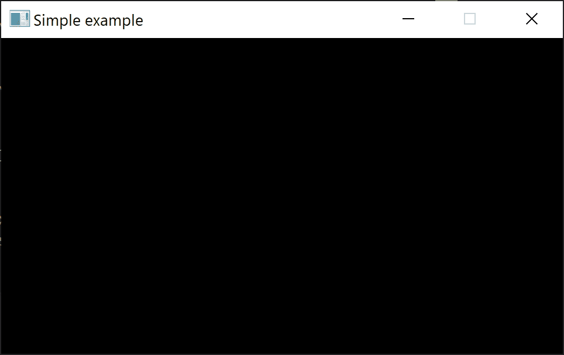
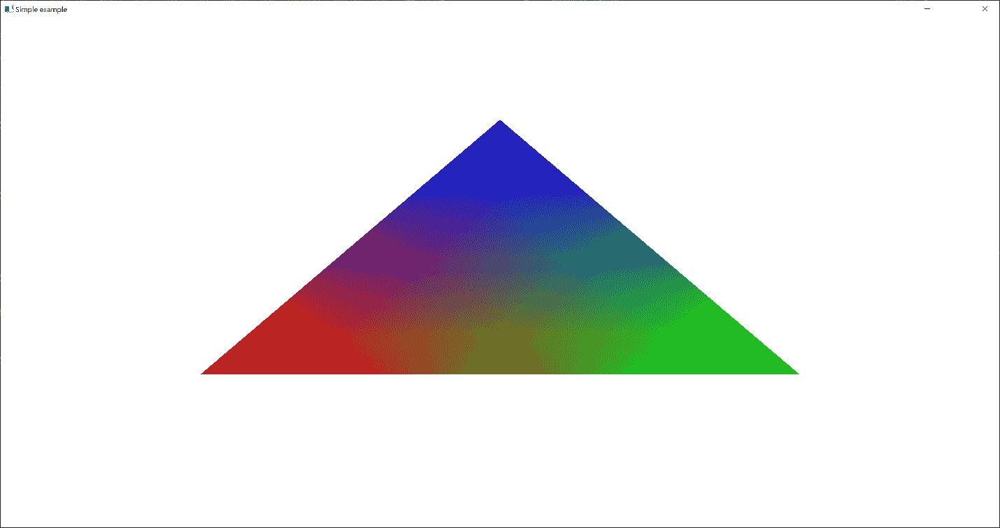
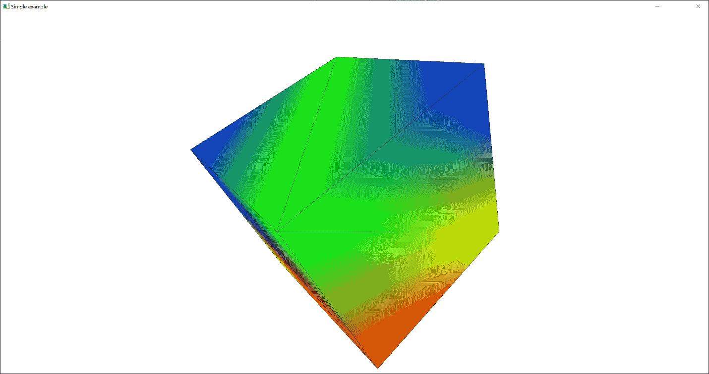

# 第三章：2 开始使用 Vulkan

## 加入我们的 Discord 书籍社区


[`packt.link/unitydev`](https://packt.link/unitydev)

在本章中，我们将学习如何使用 Vulkan 进行第一步，以便我们可以处理交换链、着色器和管线。本章的食谱将帮助您使用 Vulkan 在屏幕上显示第一个三角形。本节的 Vulkan 实现基于开源库*LightweightVK*([`github.com/corporateshark/lightweightvk`](https://github.com/corporateshark/lightweightvk))，我们将在本章中对其进行探索。

在本章中，我们将介绍以下食谱：

+   初始化 Vulkan 实例和图形设备

+   初始化 Vulkan 交换链

+   设置 Vulkan 调试功能

+   使用 Vulkan 命令缓冲区

+   初始化 Vulkan 着色器模块

+   初始化 Vulkan 管线

## 技术要求

要运行本章的食谱，您必须使用配备有支持 Vulkan 1.3 的视频卡和驱动程序的 Windows 或 Linux 计算机。阅读*第一章*，*建立构建环境*，了解如何正确配置它。

## 初始化 Vulkan 实例和图形设备

与 OpenGL 相比，Vulkan API 的语法更加冗长，因此我们必须将我们第一个图形演示应用程序的创建拆分为一系列单独的小食谱。在这个食谱中，我们将学习如何创建一个 Vulkan 实例，枚举系统中所有能够进行 3D 图形渲染的物理设备，并将其中一个设备初始化以创建一个带有附加表面的窗口。

### 准备工作

如果您对 Vulkan 一无所知，我们建议从一些初学者 Vulkan 书籍开始，例如 Preetish Kakkar 和 Mauricio Maurer 的*The Modern Vulkan Cookbook*，或者 Graham Sellers 的*Vulkan Programming Guide: The Official Guide to Learning Vulkan*。

从 OpenGL 过渡到 Vulkan，或任何类似的现代图形 API，最困难的部分是习惯于设置渲染过程所需的显式代码量，幸运的是，这只需要做一次。了解 Vulkan 的对象模型也很有用。作为一个良好的起点，我们建议阅读 Adam Sawicki 的[`gpuopen.com/understanding-vulkan-objects`](https://gpuopen.com/understanding-vulkan-objects)作为参考。对于本章的后续食谱，我们设定的目标是使用最少的设置开始渲染 3D 场景。

我们所有的 Vulkan 食谱都使用 LightweightVK 库，您可以通过以下 Bootstrap 片段从[`github.com/corporateshark/lightweightvk`](https://github.com/corporateshark/lightweightvk)下载该库：这个库实现了本书中将要讨论的所有底层 Vulkan 包装类：

```cpp
{
  “name”: “ lightweightvk “,
  “source”: {
    “type”: “git”,
    “url”: “ https://github.com/corporateshark/lightweightvk.git “,
    “revision”: “1.0”
  }
}
```

本食谱的完整 Vulkan 示例可以在`Chapter02/01_Swapchain`中找到。

### 如何操作...

在我们深入实际实现之前，让我们探索一些使调试 Vulkan 后端变得更容易的脚手架代码。让我们从一些错误检查设施开始：

1.  从复杂的 API 中调用的任何函数都可能失败。为了处理失败，或者至少让开发者知道失败的确切位置，*LightweightVK* 将大多数 Vulkan 调用包装在 `VK_ASSERT()` 和 `VK_ASSERT_RETURN()` 宏中，这些宏检查 Vulkan 操作的结果。当从头开始编写新的 Vulkan 实现时，这将非常有帮助：

```cpp
#define VK_ASSERT(func) {                                          \
    const VkResult vk_assert_result = func;                        \
    if (vk_assert_result != VK_SUCCESS) {                          \
      LLOGW(“Vulkan API call failed: %s:%i\n  %s\n  %s\n”,         \
                    __FILE__, __LINE__, #func,                     \
                    ivkGetVulkanResultString(vk_assert_result));   \
      assert(false);                                               \
    }                                                              \
  }
```

1.  `VK_ASSERT_RETURN()` 宏非常相似，并将控制权返回给调用代码：

```cpp
#define VK_ASSERT_RETURN(func) {                                   \
    const VkResult vk_assert_result = func;                        \
    if (vk_assert_result != VK_SUCCESS) {                          \
      LLOGW(“Vulkan API call failed: %s:%i\n  %s\n  %s\n”,         \
                    __FILE__, __LINE__, #func,                     \
                    ivkGetVulkanResultString(vk_assert_result));   \
      assert(false);                                               \
      return getResultFromVkResult(vk_assert_result);              \
    }                                                              \
  }
```

现在，我们可以开始创建我们的第一个 Vulkan 应用程序。让我们探索示例应用程序 `Chapter02/01_Swapchain` 中正在发生的事情，该应用程序创建了一个窗口、一个 Vulkan 实例和一个设备，以及一个 Vulkan 交换链，这将在接下来的食谱中解释。应用程序代码非常简单：

1.  我们初始化日志库并创建一个 GLFW 窗口，正如我们在第一章的食谱 *使用 GLFW 库* 中讨论的那样。所有 Vulkan 初始化魔法都发生在 `lvk::createVulkanContextWithSwapchain()` 辅助函数中，我们将在稍后探索：

```cpp
int main(void) {
  minilog::initialize(nullptr, { .threadNames = false });
  int width  = 960;
  int height = 540;
  GLFWwindow* window = lvk::initWindow(
    “Simple example”, width, height);
  std::unique_ptr<lvk::IContext> ctx =
    lvk::createVulkanContextWithSwapchain(window, width, height, {});
```

1.  应用程序主循环在窗口大小改变时更新帧缓冲区大小，获取一个命令缓冲区，提交它，并呈现当前的交换链图像，或者在 *LightweightVK* 中称为纹理：

```cpp
 while (!glfwWindowShouldClose(window)) {
    glfwPollEvents();
    glfwGetFramebufferSize(window, &width, &height);
    if (!width || !height) continue;
    lvk::ICommandBuffer& buf = device->acquireCommandBuffer();
    ctx->submit(buf, ctx->getCurrentSwapchainTexture());
  }
```

1.  关闭代码是标准的。在销毁 GLFW 窗口之前，我们应该销毁 `IDevice` 对象：

```cpp
 ctx.reset();
  glfwDestroyWindow(window);
  glfwTerminate();
  return 0;
}
```

1.  应用程序应该渲染一个空的黑窗口，如下面的截图所示：



图 2.1：主循环和交换链

让我们探索 `lvk::createVulkanContextWithSwapchain()` 并窥视其实现。同样，我们跳过了书中文本中的大多数错误检查，因为这些错误检查并不有助于理解：

1.  这个辅助函数调用 *LightweightVK* 来创建一个基于 GLFW 窗口和操作系统显示属性的 *VulkanContext* 对象：

```cpp
std::unique_ptr<lvk::IContext> createVulkanContextWithSwapchain(
  GLFWwindow* window, uint32_t width, uint32_t height,
  const lvk::vulkan::VulkanContextConfig& cfg,
  lvk::HWDeviceType preferredDeviceType = lvk::HWDeviceType_Discrete) {
  std::unique_ptr<vulkan::VulkanContext> ctx;
#if defined(_WIN32)
  ctx = std::make_unique<vulkan::VulkanContext>(
    cfg, (void*)glfwGetWin32Window(window));
#elif defined(__linux__)
  ctx = std::make_unique<vulkan::VulkanContext>(
    cfg, (void*)glfwGetX11Window(window), (void*)glfwGetX11Display());
#else
#  error Unsupported OS
#endif
```

1.  然后，我们枚举 Vulkan 物理设备并选择最偏好的一个。首先尝试选择一个离散 GPU，如果没有，则选择一个集成 GPU：

```cpp
 std::vector<HWDeviceDesc> devices;
  Result res = ctx->queryDevices(preferredDeviceType, devices);
  if (devices.empty()) {
    if (preferredDeviceType == HWDeviceType_Discrete) {
      res = ctx->queryDevices(HWDeviceType_Integrated, devices);
    }
    if (preferredDeviceType == HWDeviceType_Integrated) {
      res = ctx->queryDevices(HWDeviceType_Discrete, devices);
    }
  }
```

1.  一旦选择了一个物理设备，就调用 `VulkanContext::initContext()`，它将创建所有 Vulkan 和 *LightweightVK* 内部数据结构：

```cpp
 if (!res.isOk() || devices.empty()) return nullptr;
  res = ctx->initContext(devices[0]);
  if (!res.isOk()) return nullptr;
```

1.  如果我们有一个非空的视口，初始化一个 Vulkan 交换链。交换链创建过程将在下一道食谱中详细解释，*初始化 Vulkan 交换链*。

```cpp
 if (width > 0 && height > 0) {
    res = ctx->initSwapchain(width, height);
    if (!res.isOk()) return nullptr;
  }
  return std::move(ctx);
}
```

关于高级代码，我们只需做这些。让我们深入挖掘，看看 *LightweightVK* 的内部结构，看看它是如何工作的。

### 它是如何工作的...

有多个函数涉及将 Vulkan 启动并运行。一切始于在 `VulkanContext::createInstance()` 中创建 Vulkan 实例。使用 Vulkan 实例，我们可以在以后获取具有所需属性的一组物理设备。

1.  首先，我们需要指定所有运行我们的 Vulkan 图形后端所需的 Vulkan 实例扩展的名称。我们需要 `VK_KHR_surface` 以及另一个平台特定的扩展，该扩展接受操作系统窗口句柄并将其附加到渲染表面。在 Linux 上，我们只支持基于 libXCB 的窗口创建。同样，Wayland 协议也可以支持，但超出了本书的范围。以下是 Wayland 被添加到 LightweightVK 的方式，[`github.com/corporateshark/lightweightvk/pull/13`](https://github.com/corporateshark/lightweightvk/pull/13)：

```cpp
void VulkanContext::createInstance() {
  vkInstance_ = VK_NULL_HANDLE;
  const char* instanceExtensionNames[] = {
    VK_KHR_SURFACE_EXTENSION_NAME,
    VK_EXT_DEBUG_UTILS_EXTENSION_NAME,
#if defined(_WIN32)
    VK_KHR_WIN32_SURFACE_EXTENSION_NAME,
#elif defined(__linux__)
    VK_KHR_XLIB_SURFACE_EXTENSION_NAME,
#endif     VK_EXT_VALIDATION_FEATURES_EXTENSION_NAME
  };
```

1.  当不需要验证时，我们禁用 `VK_EXT_validation_features`，例如，在发布构建中：

```cpp
 const uint32_t numInstanceExtensions = config_.enableValidation ?
    (uint32_t)LVK_ARRAY_NUM_ELEMENTS(instanceExtensionNames) :
    (uint32_t)LVK_ARRAY_NUM_ELEMENTS(instanceExtensionNames) - 1;
  const VkValidationFeatureEnableEXT validationFeaturesEnabled[] = {
    VK_VALIDATION_FEATURE_ENABLE_GPU_ASSISTED_EXT };
  const VkValidationFeaturesEXT features = {
    .sType = VK_STRUCTURE_TYPE_VALIDATION_FEATURES_EXT,
    .pNext = nullptr,
    .enabledValidationFeatureCount = config_.enableValidation ?
      LVK_ARRAY_NUM_ELEMENTS(validationFeaturesEnabled) : 0u,
    .pEnabledValidationFeatures = config_.enableValidation ?
      validationFeaturesEnabled : nullptr,
  };
```

1.  在构建与表面相关的扩展列表之后，我们应该填写一些关于我们应用程序的必要信息：

```cpp
 const VkApplicationInfo appInfo = {
    .sType = VK_STRUCTURE_TYPE_APPLICATION_INFO,
    .pNext = nullptr,
    .pApplicationName = “LVK/Vulkan”,
    .applicationVersion = VK_MAKE_VERSION(1, 0, 0),
    .pEngineName = “LVK/Vulkan”,
    .engineVersion = VK_MAKE_VERSION(1, 0, 0),
    .apiVersion = VK_API_VERSION_1_3,
  };
```

1.  要创建一个 `VkInstance` 对象，我们应该填充 `VkInstanceCreateInfo` 结构。我们使用上述 `appInfo` 常量的指针以及 `VkInstanceCreateInfo` 成员字段中的扩展列表。我们使用存储在全局变量 `kDefaultValidationLayers[]` 中的所谓层列表，这将允许我们为每个 Vulkan 调用启用调试输出。我们书中使用的唯一层是 Khronos 验证层，`VK_LAYER_KHRONOS_validation`。相同的验证层列表将用于创建 Vulkan 设备。然后，我们使用 *Volk* 库加载为创建的 `VkInstance` 相关的所有实例相关 Vulkan 函数。

Volk 是 Vulkan 的元加载器。它允许你在不链接到 `vulkan-1.dll` 或静态链接 Vulkan 加载器的情况下动态加载使用 Vulkan 所需的入口点。Volk 通过自动加载所有相关入口点简化了 Vulkan 扩展的使用。除此之外，Volk 可以直接从驱动程序加载 Vulkan 入口点，这可以通过跳过加载器调度开销来提高性能：[`github.com/zeux/volk`](https://github.com/zeux/volk)。

```cpp
 const VkInstanceCreateInfo ci = {
    .sType = VK_STRUCTURE_TYPE_INSTANCE_CREATE_INFO,
    .pNext = config_.enableValidation ? &features : nullptr,
    .flags = 0,
    .pApplicationInfo = &appInfo,
    .enabledLayerCount = config_.enableValidation ?
      LVK_ARRAY_NUM_ELEMENTS(kDefaultValidationLayers) : 0,
    .ppEnabledLayerNames = config_.enableValidation ?
      kDefaultValidationLayers : nullptr,
    .enabledExtensionCount = numInstanceExtensions,
    .ppEnabledExtensionNames = instanceExtensionNames,
  };
  VK_ASSERT(vkCreateInstance(&ci, nullptr, &vkInstance_));
  volkLoadInstance(vkInstance_);
```

1.  最后但同样重要的是，让我们打印出所有可用的 Vulkan 实例扩展的格式化列表：

```cpp
 uint32_t count = 0;
  VK_ASSERT(vkEnumerateInstanceExtensionProperties(
    nullptr, &count, nullptr));
  std::vector<VkExtensionProperties> allInstanceExtensions(count);
  VK_ASSERT(vkEnumerateInstanceExtensionProperties(
    nullptr, &count, allInstanceExtensions.data()));
  LLOGL(“\nVulkan instance extensions:\n”);
  for (const auto& extension : allInstanceExtensions) {
    LLOGL(“  %s\n”, extension.extensionName);
  }
}
```

一旦我们创建了 Vulkan 实例，我们就可以访问必要的 Vulkan 物理设备列表，以继续设置我们的 Vulkan 后端。以下是我们可以枚举 Vulkan 物理设备并选择一个合适设备的方法：

1.  函数 `vkEnumeratePhysicalDevices()` 被调用两次。第一次是为了获取可用物理设备的数量并为它分配 `std::vector` 存储空间。第二次是为了检索实际的物理设备数据：

```cpp
lvk::Result VulkanContext::queryDevices(HWDeviceType deviceType,
  std::vector<HWDeviceDesc>& outDevices) {
  outDevices.clear();
  uint32_t deviceCount = 0;
  VK_ASSERT_RETURN(
    vkEnumeratePhysicalDevices(vkInstance_, &deviceCount, nullptr));
  std::vector<VkPhysicalDevice> vkDevices(deviceCount);
  VK_ASSERT_RETURN(vkEnumeratePhysicalDevices(
    vkInstance_, &deviceCount, vkDevices.data()));
```

1.  我们遍历设备向量以检索它们的属性并过滤掉不合适的设备。函数`convertVulkanDeviceTypeToIGL()`将 Vulkan 枚举`VkPhysicalDeviceType`转换为`LightweightVK`枚举`HWDeviceType`：

```cpp
enum HWDeviceType {
  HWDeviceType_Discrete = 1,
  HWDeviceType_External = 2,
  HWDeviceType_Integrated = 3,
  HWDeviceType_Software = 4,
};
  const HWDeviceType desiredDeviceType = deviceType;
  for (uint32_t i = 0; i < deviceCount; ++i) {
    VkPhysicalDevice physicalDevice = vkDevices[i];
    VkPhysicalDeviceProperties deviceProperties;
    vkGetPhysicalDeviceProperties(physicalDevice, &deviceProperties);
    const HWDeviceType deviceType =
      convertVulkanDeviceTypeToIGL(deviceProperties.deviceType);
    if (desiredDeviceType != HWDeviceType_Software &&         desiredDeviceType != deviceType) continue;
    outDevices.push_back(
      {.guid = (uintptr_t)vkDevices[i], .type = deviceType});
    strcpy(outDevices.back().name, deviceProperties.deviceName);
  }
  if (outDevices.empty()) return Result(RuntimeError,
    “No Vulkan devices matching your criteria”);
  return Result();
}
```

一旦我们选择了一个合适的 Vulkan 物理设备，我们就可以创建一个 GPU 的逻辑表示`VkDevice`。我们可以将 Vulkan 设备视为本质上是一组队列和内存堆。为了使用设备进行渲染，我们需要指定一个能够执行图形相关命令的队列和一个具有此类队列的物理设备。让我们探索*LightweightVK*和函数`VulkanContext::initContext()`的一些部分，该函数在后续章节中我们将讨论的许多其他事情中，检测合适的队列家族并创建一个 Vulkan 设备。再次提醒，这里将省略大部分错误检查：

1.  在`VulkanContext::initContext()`中，我们首先打印出与我们之前选择的物理设备和 Vulkan 驱动程序相关的信息。这对于调试非常有用：

```cpp
lvk::Result VulkanContext::initContext(const HWDeviceDesc& desc) {
  vkPhysicalDevice_ = (VkPhysicalDevice)desc.guid;
  vkGetPhysicalDeviceFeatures2(vkPhysicalDevice_, &vkFeatures10_);
  vkGetPhysicalDeviceProperties2(
    vkPhysicalDevice_, &vkPhysicalDeviceProperties2_);
  const uint32_t apiVersion =
    vkPhysicalDeviceProperties2_.properties.apiVersion;
  LLOGL(“Vulkan physical device: %s\n”,
    vkPhysicalDeviceProperties2_.properties.deviceName);
  LLOGL(“           API version: %i.%i.%i.%i\n”,
        VK_API_VERSION_MAJOR(apiVersion),
        VK_API_VERSION_MINOR(apiVersion),
        VK_API_VERSION_PATCH(apiVersion),
        VK_API_VERSION_VARIANT(apiVersion));
  LLOGL(“           Driver info: %s %s\n”,
        vkPhysicalDeviceDriverProperties_.driverName,
        vkPhysicalDeviceDriverProperties_.driverInfo);
```

1.  让我们列举并打印出这个 Vulkan 物理设备上可用的所有扩展，这对调试非常有帮助：

```cpp
 uint32_t count = 0;
  vkEnumerateDeviceExtensionProperties(
    vkPhysicalDevice_, nullptr, &count, nullptr);
  std::vector<VkExtensionProperties>     allPhysicalDeviceExtensions(count);
  vkEnumerateDeviceExtensionProperties(vkPhysicalDevice_, nullptr,
    &count, allPhysicalDeviceExtensions.data());
  LLOGL(“Vulkan physical device extensions:\n”);
  for (const auto& ext : allPhysicalDeviceExtensions) {
    LLOGL(“  %s\n”, ext.extensionName);
  }
```

1.  在创建 Vulkan 设备之前，我们需要找到队列家族索引并创建队列。此代码块根据提供的物理设备上的实际队列可用性创建一个或两个设备队列，图形和计算队列。`lvk::findQueueFamilyIndex()`辅助函数，该函数在`lvk/vulkan/VulkanUtils.cpp`中实现，返回第一个匹配请求队列标志的专用队列家族索引。如果你深入研究，你可以看到它是如何确保你首先选择专用队列的。

在 Vulkan 中，`queueFamilyIndex`是队列所属的队列家族的索引。队列家族是一组具有相似属性和功能的 Vulkan 队列。在这里，`deviceQueues_`是一个成员字段，它包含一个包含队列信息的结构：

```cpp
struct DeviceQueues {
  const static uint32_t INVALID = 0xFFFFFFFF;
  uint32_t graphicsQueueFamilyIndex = INVALID;
  uint32_t computeQueueFamilyIndex = INVALID;
  VkQueue graphicsQueue = VK_NULL_HANDLE;
  VkQueue computeQueue = VK_NULL_HANDLE;
};
  deviceQueues_.graphicsQueueFamilyIndex =
      lvk::findQueueFamilyIndex(vkPhysicalDevice_,
      VK_QUEUE_GRAPHICS_BIT);
  deviceQueues_.computeQueueFamilyIndex =
      lvk::findQueueFamilyIndex(vkPhysicalDevice_,
      VK_QUEUE_COMPUTE_BIT);
  const float queuePriority = 1.0f;
  const VkDeviceQueueCreateInfo ciQueue[2] = {
    {   .sType = VK_STRUCTURE_TYPE_DEVICE_QUEUE_CREATE_INFO,
        .queueFamilyIndex = deviceQueues_.graphicsQueueFamilyIndex,
        .queueCount = 1,
        .pQueuePriorities = &queuePriority, },
    {   .sType = VK_STRUCTURE_TYPE_DEVICE_QUEUE_CREATE_INFO,
        .queueFamilyIndex = deviceQueues_.computeQueueFamilyIndex,
        .queueCount = 1,
        .pQueuePriorities = &queuePriority, },
  };
```

1.  有时，尤其是在移动 GPU 上，图形和计算队列可能是相同的。在这里，我们处理这样的边缘情况：

```cpp
 const uint32_t numQueues =
    ciQueue[0].queueFamilyIndex == ciQueue[1].queueFamilyIndex ? 1:2;
```

1.  5. 我们逻辑设备必须支持的一组扩展列表。设备必须支持 swapchain 对象，这允许我们在屏幕上呈现渲染的帧。我们使用包含所有其他必要功能的 Vulkan 1.3，因此不需要额外的扩展：

```cpp
 const char* deviceExtensionNames[] = {
    VK_KHR_SWAPCHAIN_EXTENSION_NAME,
  };
```

1.  让我们请求我们将在后端使用所有必要的*Vulkan 1.0*至*1.3*功能。最重要的功能是从*Vulkan 1.2*开始的描述符索引和从*Vulkan 1.3*开始的动态渲染，我们将在后续章节中讨论。看看我们将使用的其他功能。

描述符索引是一组 Vulkan 1.2 功能，它使应用程序能够访问它们的所有资源，并在着色器中选择具有动态索引的那些资源。

动态渲染是 Vulkan 1.3 的一个特性，它允许应用程序直接将图像渲染到图像中，而不需要创建渲染通道对象或帧缓冲区。

```cpp
 VkPhysicalDeviceFeatures deviceFeatures10 = {
      .geometryShader = VK_TRUE,
      .multiDrawIndirect = VK_TRUE,
      .drawIndirectFirstInstance = VK_TRUE,
      .depthBiasClamp = VK_TRUE,
      .fillModeNonSolid = VK_TRUE,
      .textureCompressionBC = VK_TRUE,
  };
  VkPhysicalDeviceVulkan11Features deviceFeatures11 = {
      .sType = VK_STRUCTURE_TYPE_PHYSICAL_DEVICE_VULKAN_1_1_FEATURES,
      .storageBuffer16BitAccess = VK_TRUE,
      .shaderDrawParameters = VK_TRUE,
  };
  VkPhysicalDeviceVulkan12Features deviceFeatures12 = {
      .sType = VK_STRUCTURE_TYPE_PHYSICAL_DEVICE_VULKAN_1_2_FEATURES,
      .pNext = &deviceFeatures11,
      .descriptorIndexing = VK_TRUE,
      .shaderSampledImageArrayNonUniformIndexing = VK_TRUE,
      .descriptorBindingSampledImageUpdateAfterBind = VK_TRUE,
      .descriptorBindingStorageImageUpdateAfterBind = VK_TRUE,
      .descriptorBindingUpdateUnusedWhilePending = VK_TRUE,
      .descriptorBindingPartiallyBound = VK_TRUE,
      .descriptorBindingVariableDescriptorCount = VK_TRUE,
      .runtimeDescriptorArray = VK_TRUE,
      .uniformBufferStandardLayout = VK_TRUE,
      .timelineSemaphore = VK_TRUE,
      .bufferDeviceAddress = VK_TRUE,
  };
  VkPhysicalDeviceVulkan13Features deviceFeatures13 = {
      .sType = VK_STRUCTURE_TYPE_PHYSICAL_DEVICE_VULKAN_1_3_FEATURES,
      .pNext = &deviceFeatures12,
      .subgroupSizeControl = VK_TRUE,
      .synchronization2 = VK_TRUE,
      .dynamicRendering = VK_TRUE,
      .maintenance4 = VK_TRUE,
  };
```

1.  在我们创建实际设备之前，还有一些步骤，比如检查我们请求的扩展列表与可用扩展列表的对比，并在日志中打印所有缺失的扩展，然后终止：

```cpp
 std::vector<VkExtensionProperties> props;
  getDeviceExtensionProps(vkPhysicalDevice_, props);
  for (const char* layer : kDefaultValidationLayers)
    getDeviceExtensionProps(vkPhysicalDevice_, props, layer);
  std::string missingExtensions;
  for (const char* ext : deviceExtensionNames)
    if (!hasExtension(ext, props))
      missingExtensions += “\n   “ + std::string(ext);
  if (!missingExtensions.empty()) {
    MINILOG_LOG_PROC(minilog::FatalError,
      “Missing Vulkan device extensions: %s\n”,
      missingExtensions.c_str());
    return Result(Result::Code::RuntimeError);
  }
```

1.  最后，我们应该将所有请求的 Vulkan 特性与实际可用的特性进行核对。借助 C 宏，我们可以轻松地做到这一点。这段代码很有用，所以我们几乎将其全部打印在这里：

```cpp
 {
    std::string missingFeatures;
#define CHECK_VULKAN_FEATURE(                       \
  reqFeatures, availFeatures, feature, version)     \
  if ((reqFeatures.feature == VK_TRUE) &&           \
      (availFeatures.feature == VK_FALSE))          \
        missingFeatures.append(“\n   “ version “ .” #feature);
#define CHECK_FEATURE_1_0(feature)                               \
  CHECK_VULKAN_FEATURE(deviceFeatures10, vkFeatures10_.features, \
  feature, “1.0 “);
    CHECK_FEATURE_1_0(robustBufferAccess);
    CHECK_FEATURE_1_0(fullDrawIndexUint32);
    CHECK_FEATURE_1_0(imageCubeArray);
    … // omitted a lot of other Vulkan 1.0 features here
#undef CHECK_FEATURE_1_0
#define CHECK_FEATURE_1_1(feature)                      \
  CHECK_VULKAN_FEATURE(deviceFeatures11, vkFeatures11_, \
    feature, “1.1 “);
    CHECK_FEATURE_1_1(storageBuffer16BitAccess);
    CHECK_FEATURE_1_1(uniformAndStorageBuffer16BitAccess);
    CHECK_FEATURE_1_1(storagePushConstant16);
    … // omitted a lot of other Vulkan 1.1 features here
#undef CHECK_FEATURE_1_1
#define CHECK_FEATURE_1_2(feature)                      \
  CHECK_VULKAN_FEATURE(deviceFeatures12, vkFeatures12_, \
  feature, “1.2 “);
    CHECK_FEATURE_1_2(samplerMirrorClampToEdge);
    CHECK_FEATURE_1_2(drawIndirectCount);
    CHECK_FEATURE_1_2(storageBuffer8BitAccess);
    … // omitted a lot of other Vulkan 1.2 features here
#undef CHECK_FEATURE_1_2
#define CHECK_FEATURE_1_3(feature)                      \
  CHECK_VULKAN_FEATURE(deviceFeatures13, vkFeatures13_, \
  feature, “1.3 “);
    CHECK_FEATURE_1_3(robustImageAccess);
    CHECK_FEATURE_1_3(inlineUniformBlock);
    … // omitted a lot of other Vulkan 1.3 features here
#undef CHECK_FEATURE_1_3
    if (!missingFeatures.empty()) {
      MINILOG_LOG_PROC(minilog::FatalError,
        “Missing Vulkan features: %s\n”, missingFeatures.c_str());
      return Result(Result::Code::RuntimeError);
    }
  }
```

当我们缺少一些 Vulkan 特性时，这段代码将打印出一个格式良好的缺失特性列表，并用相应的 Vulkan 版本标记。这对于调试和使你的 Vulkan 后端适应不同设备非常有价值。

现在，我们已经准备好创建 Vulkan 设备，使用*Volk*加载所有相关的 Vulkan 函数，并根据我们在本配方中之前选择的队列家族索引获取实际的设备队列：

```cpp
 const VkDeviceCreateInfo ci = {
      .sType = VK_STRUCTURE_TYPE_DEVICE_CREATE_INFO,
      .pNext = &deviceFeatures13,
      .queueCreateInfoCount = numQueues,
      .pQueueCreateInfos = ciQueue,
      .enabledLayerCount =
        LVK_ARRAY_NUM_ELEMENTS(kDefaultValidationLayers),
      .ppEnabledLayerNames = kDefaultValidationLayers,
      .enabledExtensionCount = 
        LVK_ARRAY_NUM_ELEMENTS(deviceExtensionNames),
      .ppEnabledExtensionNames = deviceExtensionNames,
      .pEnabledFeatures = &deviceFeatures10,
  };
  VK_ASSERT_RETURN(vkCreateDevice(
    vkPhysicalDevice_, &ci, nullptr, &vkDevice_));
  volkLoadDevice(vkDevice_);
  vkGetDeviceQueue(vkDevice_, deviceQueues_.graphicsQueueFamilyIndex,
    0, &deviceQueues_.graphicsQueue);
  vkGetDeviceQueue(vkDevice_, deviceQueues_.computeQueueFamilyIndex,
    0, &deviceQueues_.computeQueue);
  … // other code in initContext() is unrelated to this recipe
}
```

现在 Vulkan 设备已经准备好使用，但 Vulkan 渲染管道的初始化还远未完成。接下来我们需要做的是创建一个 swapchain 对象。让我们跟随下一个配方来学习如何做到这一点。

## 初始化 Vulkan swapchain

通常，每一帧都会渲染到一个离屏图像中。渲染过程完成后，离屏图像应该变得可见或“呈现”。**swapchain**是一个包含一组可用离屏图像的对象，或者更具体地说，是一个等待在屏幕上呈现的已渲染图像队列。在 OpenGL 中，将离屏缓冲区呈现到窗口的可视区域是通过系统依赖的函数来完成的，即 Windows 上的`wglSwapBuffers()`，OpenGL ES 嵌入式系统上的`eglSwapBuffers()`，以及 Linux 上的`glXSwapBuffers()`或自动在 macOS 上。Vulkan 为我们提供了更细粒度的控制。我们需要为 swapchain 图像选择一个呈现模式。

在本配方中，我们将展示如何使用之前配方中初始化的 Vulkan 实例和设备创建一个 Vulkan swapchain 对象。

### 准备工作

回顾之前的配方，*初始化 Vulkan 实例和图形设备*，它讨论了初始化 Vulkan 所需的初始步骤。本配方中讨论的源代码在`lvk::VulkanSwapchain`类中实现。

### 如何做...

在之前的配方中，我们通过探索辅助函数`lvk::createVulkanContextWithSwapchain()`开始学习如何创建 Vulkan 实例和设备。它引导我们到`VulkanContext::initContext()`函数，我们在之前的配方中对其进行了详细讨论。让我们继续我们的旅程，并探索来自*LightweightVK*的`VulkanContext::initSwapchain()`和相关类`VulkanSwapchain`：

1.  首先，让我们看看一个检索各种表面格式支持能力并将它们存储在`VulkanContext`成员字段中的函数。该函数还检查深度格式支持，但仅限于可能被*LightweightVK*使用的深度格式：

```cpp
void VulkanContext::querySurfaceCapabilities() {
   const VkFormat depthFormats[] = {
     VK_FORMAT_D32_SFLOAT_S8_UINT, VK_FORMAT_D24_UNORM_S8_UINT,
     VK_FORMAT_D16_UNORM_S8_UINT, VK_FORMAT_D32_SFLOAT,
     VK_FORMAT_D16_UNORM};
  for (const auto& depthFormat : depthFormats) {
    VkFormatProperties formatProps;
    vkGetPhysicalDeviceFormatProperties(
      vkPhysicalDevice_, depthFormat, &formatProps);
    if (formatProps.optimalTilingFeatures)
      deviceDepthFormats_.push_back(depthFormat);
  }
```

1.  所有表面能力和表面格式都被检索并存储。首先，获取支持的格式数量。然后，分配存储空间来保存它们并读取实际的属性：

```cpp
 vkGetPhysicalDeviceSurfaceCapabilitiesKHR(
    vkPhysicalDevice_, vkSurface_, &deviceSurfaceCaps_);
  uint32_t formatCount;
  vkGetPhysicalDeviceSurfaceFormatsKHR(
    vkPhysicalDevice_, vkSurface_, &formatCount, nullptr);
  if (formatCount) {
    deviceSurfaceFormats_.resize(formatCount);
    vkGetPhysicalDeviceSurfaceFormatsKHR(vkPhysicalDevice_,
      vkSurface_, &formatCount, deviceSurfaceFormats_.data());
  }
```

1.  以类似的方式，我们也存储当前表面的模式：

```cpp
 uint32_t presentModeCount;
  vkGetPhysicalDeviceSurfacePresentModesKHR(vkPhysicalDevice_,
    vkSurface_, &presentModeCount, nullptr);
  if (presentModeCount) {
    devicePresentModes_.resize(presentModeCount);
    vkGetPhysicalDeviceSurfacePresentModesKHR(vkPhysicalDevice_,
    vkSurface_, &presentModeCount, devicePresentModes_.data());
  }
}
```

知道所有支持的颜色表面格式后，我们可以为我们的交换链选择一个合适的格式。让我们看看`chooseSwapSurfaceFormat()`辅助函数是如何做到这一点的。该函数接受一个可用格式的列表和一个所需的颜色空间：

1.  首先，它选择一个首选的表面格式，基于所需的颜色空间和 RGB/BGR 原生交换链图像格式。RGB 或 BGR 是通过遍历 Vulkan 返回的所有可用颜色格式，并选择一个格式，RGB 或 BGR， whichever is closer to the beginning of the list。如果 BGR 出现在列表的更前面，它将成为选择的格式。一旦选择了首选的图像格式和颜色空间，我们就可以遍历支持的格式列表，并尝试找到一个完全匹配的格式。

```cpp
VkSurfaceFormatKHR chooseSwapSurfaceFormat(   const std::vector<VkSurfaceFormatKHR>& formats,
  lvk::ColorSpace colorSpace) {
  const VkSurfaceFormatKHR preferred = colorSpaceToVkSurfaceFormat(
    colorSpace, isNativeSwapChainBGR(formats));
  for (const auto& fmt : formats)
    if (fmt.format == preferred.format &&         fmt.colorSpace == preferred.colorSpace) return fmt;
```

1.  如果您找不到匹配的格式和颜色空间，尝试只匹配格式。如果无法匹配格式，则默认为第一个可用的格式。在许多系统中，它将是`VK_FORMAT_R8G8B8A8_UNORM`或类似的格式：

```cpp
 for (const auto& fmt : formats) {
    if (fmt.format == preferred.format) return fmt;
  }
  return formats[0];
}
```

此函数从`VulkanSwapchain`的构造函数中调用。一旦选择了格式，我们还需要进行一些额外的检查，然后才能创建实际的 Vulkan 交换链：

1.  第一次检查是为了确保所选格式支持用于创建交换链的图形队列家族上的呈现操作：

```cpp
VkBool32 queueFamilySupportsPresentation = VK_FALSE;
vkGetPhysicalDeviceSurfaceSupportKHR(ctx.getVkPhysicalDevice(),
  ctx.deviceQueues_.graphicsQueueFamilyIndex, ctx.vkSurface_,
  &queueFamilySupportsPresentation));
IGL_ASSERT(queueFamilySupportsPresentation == VK_TRUE);
```

1.  第二次检查是必要的，用于选择交换链图像的使用标志。使用标志定义了交换链图像是否可以用作颜色附件、在传输操作中使用，或者作为存储图像以允许计算着色器直接在它们上操作。不同的设备有不同的能力，并且存储图像并不总是被支持，尤其是在移动 GPU 上：

```cpp
VkImageUsageFlags chooseUsageFlags(   VkPhysicalDevice pd, VkSurfaceKHR surface, VkFormat format)
{
  VkImageUsageFlags usageFlags = VK_IMAGE_USAGE_COLOR_ATTACHMENT_BIT |
                                 VK_IMAGE_USAGE_TRANSFER_DST_BIT |
                                 VK_IMAGE_USAGE_TRANSFER_SRC_BIT;
  VkSurfaceCapabilitiesKHR caps;
  vkGetPhysicalDeviceSurfaceCapabilitiesKHR(pd, surface, &caps);
  const bool isStorageSupported =
    (caps.supportedUsageFlags & VK_IMAGE_USAGE_STORAGE_BIT) > 0;
  VkFormatProperties props;
  vkGetPhysicalDeviceFormatProperties(pd, format, &props);
  const bool isTilingOptimalSupported =
    (props.optimalTilingFeatures & VK_IMAGE_USAGE_STORAGE_BIT) > 0;
  if (isStorageSupported && isTilingOptimalSupported) {
    usageFlags |= VK_IMAGE_USAGE_STORAGE_BIT;
  }
  return usageFlags;
}
```

1.  现在，我们应该选择呈现模式。首选的呈现模式是`VK_PRESENT_MODE_MAILBOX_KHR`，它指定 Vulkan 呈现系统应等待下一个垂直空白期来更新当前图像。在这种情况下不会观察到视觉撕裂。然而，这个呈现模式并不保证会被支持。在这种情况下，我们可以尝试选择`VK_PRESENT_MODE_IMMEDIATE_KHR`以获得最快的帧率而不使用 V-sync，或者我们可以始终回退到`VK_PRESENT_MODE_FIFO_KHR`。所有可能的呈现模式之间的区别在 Vulkan 规范中描述，见[`www.khronos.org/registry/vulkan/specs/1.3-extensions/man/html/VkPresentModeKHR.xhtml`](https://www.khronos.org/registry/vulkan/specs/1.3-extensions/man/html/VkPresentModeKHR.xhtml)：

```cpp
VkPresentModeKHR chooseSwapPresentMode(   const std::vector<VkPresentModeKHR>& modes) {
#if defined(__linux__)
  if (std::find(modes.cbegin(), modes.cend(),
      VK_PRESENT_MODE_IMMEDIATE_KHR) != modes.cend())
    return VK_PRESENT_MODE_IMMEDIATE_KHR;
#endif // __linux__
  if (std::find(modes.cbegin(), modes.cend(),
      VK_PRESENT_MODE_MAILBOX_KHR) != modes.cend())
    return VK_PRESENT_MODE_MAILBOX_KHR;
  return VK_PRESENT_MODE_FIFO_KHR;
}
```

1.  我们需要的最后一个辅助函数将选择 swapchain 对象中的图像数量。它基于我们之前检索到的表面能力。我们不是直接使用`minImageCount`，而是请求一个额外的图像，以确保我们不会等待 GPU 完成任何操作：

```cpp
uint32_t chooseSwapImageCount(const VkSurfaceCapabilitiesKHR& caps) {
  const uint32_t desired = caps.minImageCount + 1;
  const bool exceeded = caps.maxImageCount > 0 &&                         desired > caps.maxImageCount;
  return exceeded ? caps.maxImageCount : desired;
}
```

1.  让我们回到构造函数`VulkanSwapchain::VulkanSwapchain()`，并探索它是如何使用所有上述辅助函数来创建一个 Vulkan swapchain 对象的。这里的代码变得相当简短，仅包括填充`VkSwapchainCreateInfoKHR`结构体：

```cpp
const VkImageUsageFlags usageFlags = chooseUsageFlags(
  ctx.getVkPhysicalDevice(), ctx.vkSurface_, surfaceFormat_.format);
const VkSwapchainCreateInfoKHR ci = {
  .sType = VK_STRUCTURE_TYPE_SWAPCHAIN_CREATE_INFO_KHR,
  .surface = ctx.vkSurface_,
  .minImageCount = chooseSwapImageCount(ctx.deviceSurfaceCaps_),
  .imageFormat = surfaceFormat_.format,
  .imageColorSpace = surfaceFormat_.colorSpace,
  .imageExtent = {.width = width, .height = height},
  .imageArrayLayers = 1,
  .imageUsage = usageFlags,
  .imageSharingMode = VK_SHARING_MODE_EXCLUSIVE,
  .queueFamilyIndexCount = 1,
  .pQueueFamilyIndices = &ctx.deviceQueues_.graphicsQueueFamilyIndex,
  .preTransform = ctx.deviceSurfaceCaps_.currentTransform,
  .compositeAlpha = VK_COMPOSITE_ALPHA_INHERIT_BIT_KHR,
  .presentMode = chooseSwapPresentMode(ctx.devicePresentModes_),
  .clipped = VK_TRUE,
  .oldSwapchain = VK_NULL_HANDLE,
};
vkCreateSwapchainKHR(device_, &ci, nullptr, &swapchain_);
```

1.  在 swapchain 对象创建后，我们可以检索 swapchain 图像：

```cpp
vkGetSwapchainImagesKHR(
  device_, swapchain_, &numSwapchainImages_, nullptr);
std::vector<VkImage> swapchainImages(numSwapchainImages_);
vkGetSwapchainImagesKHR(
  device_, swapchain_, &numSwapchainImages_, swapchainImages.data());
```

检索到的`VkImage`对象可以用来创建纹理和附件。这个主题将在第三章的食谱*在 Vulkan 中使用纹理数据*中讨论。

现在，我们已经初始化了 Vulkan，并且实际上可以运行我们的第一个应用程序，*Chapter02/01_Swapchain*。在下一个食谱中，我们将学习如何使用 Vulkan 的内置调试功能。

## 设置 Vulkan 调试功能

一旦我们创建了一个 Vulkan 实例，我们就可以开始跟踪所有可能的错误和警告，这些错误和警告是由验证层产生的。为了做到这一点，我们使用扩展`VK_EXT_debug_utils`来创建一个回调函数，并将其注册到 Vulkan 实例上。在这个食谱中，我们将学习如何设置和使用它们。

### 准备工作

请重新查看第一个食谱，*初始化 Vulkan 实例和图形设备*，以了解如何在您的应用程序中初始化 Vulkan 的详细信息。

### 如何操作...

我们必须提供一个回调函数给 Vulkan 以捕获调试输出。在*LightweightVK*中，它被称为`vulkanDebugCallback()`。以下是它是如何传递给 Vulkan 以拦截日志的：

1.  让我们创建一个调试消息传递器，它将调试消息传递给一个由应用程序提供的回调函数，`vulkanDebugCallback()`：

```cpp
const VkDebugUtilsMessengerCreateInfoEXT ci = {
  .sType = VK_STRUCTURE_TYPE_DEBUG_UTILS_MESSENGER_CREATE_INFO_EXT,
  .messageSeverity = VK_DEBUG_UTILS_MESSAGE_SEVERITY_VERBOSE_BIT_EXT |
                     VK_DEBUG_UTILS_MESSAGE_SEVERITY_INFO_BIT_EXT |
                     VK_DEBUG_UTILS_MESSAGE_SEVERITY_WARNING_BIT_EXT |
                     VK_DEBUG_UTILS_MESSAGE_SEVERITY_ERROR_BIT_EXT,
  .messageType = VK_DEBUG_UTILS_MESSAGE_TYPE_GENERAL_BIT_EXT |
                 VK_DEBUG_UTILS_MESSAGE_TYPE_VALIDATION_BIT_EXT |
                 VK_DEBUG_UTILS_MESSAGE_TYPE_PERFORMANCE_BIT_EXT,
  .pfnUserCallback = &vulkanDebugCallback,
  .pUserData = this,
};
vkCreateDebugUtilsMessengerEXT(
  vkInstance_, &ci, nullptr, &vkDebugUtilsMessenger_);
```

1.  回调本身更为详细，可以提供有关导致错误或警告的 Vulkan 对象的信息。我们不涵盖标记对象分配和关联使用的数据。一些性能警告被静音，以使调试输出更易于阅读：

```cpp
VKAPI_ATTR VkBool32 VKAPI_CALL
vulkanDebugCallback(   VkDebugUtilsMessageSeverityFlagBitsEXT msgSeverity,
  VkDebugUtilsMessageTypeFlagsEXT msgType,
  const VkDebugUtilsMessengerCallbackDataEXT* cbData,
  void* userData) {
  if (msgSeverity < VK_DEBUG_UTILS_MESSAGE_SEVERITY_INFO_BIT_EXT)
    return VK_FALSE;
  const bool isError =
   (msgSeverity & VK_DEBUG_UTILS_MESSAGE_SEVERITY_ERROR_BIT_EXT) != 0;
  char errorName[128] = {};
  int object = 0;
  void* handle = nullptr;
  char typeName[128] = {};
  void* messageID = nullptr;
  if (sscanf(cbData->pMessage,
        “Validation Error : [ %127s ] Object %i: handle = %p, “         “type = %127s | MessageID = %p”,
        errorName, &object, &handle, typeName, messageID) >= 2) {
    const char* message = strrchr(cbData->pMessage, ‘|’) + 1;
    LLOGL(“%sValidation layer:\n Validation Error: %s \n Object %i: “           “handle = %p, type = %s\n MessageID = %p \n%s \n”,
      isError ? “\nERROR:\n” : ““,
      errorName, object, handle, typeName, messageID, message);
  } else {
    LLOGL(“%sValidation layer:\n%s\n”, isError ? “\nERROR:\n” : ““,
      cbData->pMessage);
  }
  if (isError) {
    VulkanContext* ctx =
      static_cast<lvk::vulkan::VulkanContext*>(userData);
    if (ctx->config_.terminateOnValidationError) {
      IGL_ASSERT(false);
      std::terminate();
    }
  }
  return VK_FALSE;
}
```

这段代码足以让您开始阅读验证层消息并调试您的 Vulkan 应用程序。此外，请注意，应在销毁 Vulkan 实例之前立即执行验证层回调的销毁。查看完整源代码以获取所有详细信息：[`github.com/corporateshark/lightweightvk/blob/master/lvk/vulkan/VulkanClasses.cpp`](https://github.com/corporateshark/lightweightvk/blob/master/lvk/vulkan/VulkanClasses.cpp)。

### 还有更多...

扩展`VK_EXT_debug_utils`为您提供了使用文本名称或标签识别特定 Vulkan 对象的能力，以改进 Vulkan 对象跟踪和调试体验。

在 *LightweightVK* 中，我们可以为我们的 `VkDevice` 对象分配一个名称：

```cpp
lvkSetDebugObjectName(vkDevice_, VK_OBJECT_TYPE_DEVICE,
   (uint64_t)vkDevice_, “Device: VulkanContext::vkDevice_”));
```

此辅助函数在 `lvk/vulkan/VulkanUtils.cpp` 中实现，如下所示：

```cpp
VkResult ivkSetDebugObjectName(VkDevice device, VkObjectType type,
  uint64_t handle, const char* name) {
  if (!name || !*name) return VK_SUCCESS;
  const VkDebugUtilsObjectNameInfoEXT ni = {
      .sType = VK_STRUCTURE_TYPE_DEBUG_UTILS_OBJECT_NAME_INFO_EXT,
      .objectType = type,
      .objectHandle = handle,
      .pObjectName = name,
  };
  return vkSetDebugUtilsObjectNameEXT(device, &ni);
}
```

## 使用 Vulkan 命令缓冲区

在之前的菜谱中，我们学习了如何创建 Vulkan 实例、用于渲染的设备以及 swapchain。在本菜谱中，我们将学习如何管理**命令缓冲区**并使用**命令队列**提交它们，这将使我们更接近使用 Vulkan 渲染第一张图像。

Vulkan 命令缓冲区用于记录 Vulkan 命令，然后可以提交到设备队列以执行。命令缓冲区从允许 Vulkan 实现将资源创建的成本分摊到多个命令缓冲区的池中分配。命令池是**外部同步的**，这意味着一个命令池不应在多个线程之间使用。让我们学习如何在 Vulkan 命令缓冲区和池的上方创建一个方便的用户友好包装器。

### 准备工作

我们将探索 LightweightVK 库中的命令缓冲区管理代码。查看 `lvk/vulkan/VulkanClasses.h` 中的 `VulkanImmediateCommands` 类。在本书的前一版中，我们使用了非常基础的命令缓冲区管理代码，它没有假设任何同步，因为每一帧都是通过 `vkDeviceWaitIdle()` 来“同步”的。在这里，我们将探索一个更实际的解决方案，并提供一些同步功能。

让我们回到我们的演示应用程序，该应用程序来自菜谱 *初始化 Vulkan swapchain*，它渲染一个黑色的空窗口，*第二章/01_Swapchain*。应用程序的主循环如下所示：

```cpp
 while (!glfwWindowShouldClose(window)) {
    glfwPollEvents();
    glfwGetFramebufferSize(window, &width, &height);
    if (!width || !height) continue;
    lvk::ICommandBuffer& buf = ctx->acquireCommandBuffer();
    ctx->submit(buf, ctx->getCurrentSwapchainTexture());
  }
```

在这里，我们获取一个下一个命令缓冲区，然后提交它而不向其中写入任何命令，允许`LightweightVK`运行其 swapchain 展示代码并渲染一个黑色窗口。让我们深入了解实现，了解`lvk::VulkanImmediateCommands`如何在幕后完成所有繁重的工作。

### 如何做到这一点...

1.  首先，我们需要一个辅助结构体 `struct SubmitHandle` 来标识之前提交的命令缓冲区。这将是在有人想要安排一些工作，这些工作依赖于之前提交的命令缓冲区的结果时实现同步所必需的。它包含提交缓冲区的内部 ID 和提交的整数 ID。句柄可以方便地转换为和从 64 位整数转换。

```cpp
struct SubmitHandle {
  uint32_t bufferIndex_ = 0;
  uint32_t submitId_ = 0;
  SubmitHandle() = default;
  explicit SubmitHandle(uint64_t handle) :
    bufferIndex_(uint32_t(handle & 0xffffffff)),
    submitId_(uint32_t(handle >> 32)) {}
  bool empty() const { return submitId_ == 0; }
  uint64_t handle() const   { return (uint64_t(submitId_) << 32) + bufferIndex_; }
};
```

1.  另一个辅助结构体 `CommandBufferWrapper` 是必要的，用于封装与一个命令缓冲区相关联的所有 Vulkan 对象。在这里，我们存储最初分配的和当前活动的命令缓冲区。最近的提交句柄与这个命令缓冲区相关联。一个 Vulkan 栅栏和一个 Vulkan 信号量与这个命令缓冲区相关联。栅栏用于实现 GPU-CPU 同步。信号量是必要的，以确保命令缓冲区按顺序由 GPU 处理，因为 `LightweightVK` 强制所有命令缓冲区按照它们提交的顺序进行处理。这在渲染方面简化了许多事情：

```cpp
struct CommandBufferWrapper {
  VkCommandBuffer cmdBuf_ = VK_NULL_HANDLE;
  VkCommandBuffer cmdBufAllocated_ = VK_NULL_HANDLE;
  SubmitHandle handle_ = {};
  VkFence fence_ = VK_NULL_HANDLE;
  VkSemaphore semaphore_ = VK_NULL_HANDLE;
  bool isEncoding_ = false;
};
```

现在，让我们看看 `lvk::VulkanImmediateCommands` 的接口：

1.  Vulkan 命令缓冲区是预分配的，并以循环方式使用。预分配的命令缓冲区数量是 `kMaxCommandBuffers`。如果我们用完了缓冲区，`VulkanImmediateCommands` 将会等待，直到一个现有的命令缓冲区通过等待栅栏变得可用。`64` 个命令缓冲区确保在大多数情况下非阻塞操作。构造函数接受 `queueFamilyIdx` 的值以检索适当的 Vulkan 队列：

```cpp
class VulkanImmediateCommands final {
 public:
   static constexpr uint32_t kMaxCommandBuffers = 64;
  VulkanImmediateCommands(
    VkDevice device, uint32_t queueFamilyIdx, const char* debugName);
  ~VulkanImmediateCommands();
```

1.  `acquire()` 方法返回下一个可用的命令缓冲区。如果所有命令缓冲区都忙碌，它将等待在栅栏（fence）上，直到有一个命令缓冲区变得可用。`submit()` 方法将命令缓冲区提交到分配的 Vulkan 队列：

```cpp
 const CommandBufferWrapper& acquire();
  SubmitHandle submit(const CommandBufferWrapper& wrapper);
```

1.  接下来的两个方法提供了 GPU-GPU 同步机制。第一个方法 `waitSemaphore()` 使得当前命令缓冲区在运行之前等待在给定的信号量上。这个方法的典型用例是从 `VulkanSwapchain` 对象获取一个“获取信号量”，它等待获取一个交换链图像，并确保命令缓冲区在开始渲染到交换链图像之前会等待它。第二个方法 `acquireLastSubmitSemaphore()` 返回并重置信号量，该信号量在最后一个提交的命令缓冲区完成时被触发。这个信号量可以在交换链展示之前被交换链使用，以确保图像渲染完成：

```cpp
 void waitSemaphore(VkSemaphore semaphore);
  VkSemaphore acquireLastSubmitSemaphore();
```

1.  接下来的一组方法控制 GPU-CPU 同步。正如我们将在后面的食谱中看到的那样，提交句柄是通过 Vulkan 栅栏实现的，并且可以用来等待特定的 GPU 操作完成：

```cpp
 SubmitHandle getLastSubmitHandle() const;
  bool isReady(SubmitHandle handle) const;
  void wait(SubmitHandle handle);
  void waitAll();
```

1.  类的私有部分包含所有局部状态，包括一个预分配的 `CommandBufferWrapper` 对象数组 `buffers_`。

```cpp
 private:
  void purge();
  VkDevice device_ = VK_NULL_HANDLE;
  VkQueue queue_ = VK_NULL_HANDLE;
  VkCommandPool commandPool_ = VK_NULL_HANDLE;
  uint32_t queueFamilyIndex_ = 0;
  const char* debugName_ = ““;
  CommandBufferWrapper buffers_[kMaxCommandBuffers];
  SubmitHandle lastSubmitHandle_ = SubmitHandle();
  VkSemaphore lastSubmitSemaphore_ = VK_NULL_HANDLE;
  VkSemaphore waitSemaphore_ = VK_NULL_HANDLE;
  uint32_t numAvailableCommandBuffers_ = kMaxCommandBuffers;
  uint32_t submitCounter_ = 1;
};
```

`VulkanImmediateCommands`类对于我们的整个 Vulkan 后端操作至关重要，因此让我们逐个详细探讨其实现，一次一个方法。

让我们从类构造函数和析构函数开始。构造函数预分配所有命令缓冲区。文本中省略了错误检查和调试代码；请参阅*LightweightVK*库源代码以获取完整细节：

1.  首先，我们应该检索一个 Vulkan 设备队列并分配一个命令池。我们使用`VK_COMMAND_POOL_CREATE_RESET_COMMAND_BUFFER_BIT`标志来指定从这个池中分配的任何命令缓冲区都可以使用 Vulkan 函数`vkResetCommandBuffer()`单独重置到初始状态。为了指定从这个池中分配的命令缓冲区将是短暂的，我们使用标志`VK_COMMAND_POOL_CREATE_TRANSIENT_BIT`，这意味着它们将在相对较短的时间内重置或释放：

```cpp
lvk::VulkanImmediateCommands::VulkanImmediateCommands(VkDevice device,
  uint32_t queueFamilyIndex, const char* debugName) :
  device_(device), queueFamilyIndex_(queueFamilyIndex),
  debugName_(debugName)
{
  vkGetDeviceQueue(device, queueFamilyIndex, 0, &queue_);
  const VkCommandPoolCreateInfo ci = {
      .sType = VK_STRUCTURE_TYPE_COMMAND_POOL_CREATE_INFO,
      .flags = VK_COMMAND_POOL_CREATE_RESET_COMMAND_BUFFER_BIT |
               VK_COMMAND_POOL_CREATE_TRANSIENT_BIT,
      .queueFamilyIndex = queueFamilyIndex,
  };
  VK_ASSERT(vkCreateCommandPool(device, &ci, nullptr, &commandPool_));
```

1.  现在，我们可以从命令池中预分配所有命令缓冲区。除此之外，我们为每个命令缓冲区创建一个信号量和一个栅栏，以启用我们的同步机制：

```cpp
 const VkCommandBufferAllocateInfo ai = {
      .sType = VK_STRUCTURE_TYPE_COMMAND_BUFFER_ALLOCATE_INFO,
      .commandPool = commandPool_,
      .level = VK_COMMAND_BUFFER_LEVEL_PRIMARY,
      .commandBufferCount = 1,
  };
  for (uint32_t i = 0; i != kMaxCommandBuffers; i++) {
    auto& buf = buffers_[i];
    buf.semaphore_ = lvk::createSemaphore(device, semaphoreName);
    buf.fence_ = lvk::createFence(device, fenceName);
    VK_ASSERT(
      vkAllocateCommandBuffers(device, &ai, &buf.cmdBufAllocated_));
    buffers_[i].handle_.bufferIndex_ = i;
  }
}
```

1.  析构函数很简单。我们只需要在销毁命令池、栅栏和信号量之前等待所有命令缓冲区被处理：

```cpp
lvk::VulkanImmediateCommands::~VulkanImmediateCommands() {
  waitAll();
  for (auto& buf : buffers_) {
    vkDestroyFence(device_, buf.fence_, nullptr);
    vkDestroySemaphore(device_, buf.semaphore_, nullptr);
  }
  vkDestroyCommandPool(device_, commandPool_, nullptr);
}
```

现在，让我们看看我们最重要的函数`acquire()`的实现。这里省略了所有错误检查代码以简化理解：

1.  在我们能够找到一个可用的命令缓冲区之前，我们必须确保有一个。这个忙等待循环检查当前可用的命令缓冲区数量，并调用`purge()`函数，该函数回收已处理的命令缓冲区并将它们重置到初始状态，直到我们至少有一个缓冲区可用：

```cpp
const lvk::VulkanImmediateCommands::CommandBufferWrapper&   lvk::VulkanImmediateCommands::acquire()
{
  while (!numAvailableCommandBuffers_) purge();
```

1.  一旦我们知道至少有一个命令缓冲区可用，我们可以通过遍历所有缓冲区的数组并选择第一个来找到它。

1.  在这一点上，我们减少`numAvailableCommandBuffers`。这是为了确保我们下一次调用`acquire()`时正确地忙等待。

    `isEncoding`成员字段用于防止当前已编码但尚未提交的命令缓冲区的重复使用：

```cpp
 VulkanImmediateCommands::CommandBufferWrapper* current = nullptr;
  for (auto& buf : buffers_) {
    if (buf.cmdBuf_ == VK_NULL_HANDLE) {
      current = &buf;
      break;
    }
  }
  current->handle_.submitId_ = submitCounter_;
  numAvailableCommandBuffers_--;
  current->cmdBuf_ = current->cmdBufAllocated_;
  current->isEncoding_ = true;
```

1.  在我们在库的这一侧完成所有账目之后，我们可以调用 Vulkan API 来开始记录当前的命令缓冲区：

```cpp
 const VkCommandBufferBeginInfo bi = {
      .sType = VK_STRUCTURE_TYPE_COMMAND_BUFFER_BEGIN_INFO,
      .flags = VK_COMMAND_BUFFER_USAGE_ONE_TIME_SUBMIT_BIT,
  };
  VK_ASSERT(vkBeginCommandBuffer(current->cmdBuf_, &bi));
  return *current;
}
```

1.  在我们探索下一系列函数之前，让我们看看上面提到的`acquire()`中的一个简短辅助函数`purge()`。这个函数使用 Vulkan 栅栏和`timeout`值为`0`调用`vkWaitForFences()`，这将在不等待的情况下返回栅栏的当前状态。如果栅栏被触发，我们可以重置命令缓冲区并增加`numAvailableCommandBuffers`：

```cpp
void lvk::VulkanImmediateCommands::purge() {
  for (CommandBufferWrapper& buf : buffers_) {
    if (buf.cmdBuf_ == VK_NULL_HANDLE || buf.isEncoding_)
      continue;
    const VkResult result =
      vkWaitForFences(device_, 1, &buf.fence_, VK_TRUE, 0);
    if (result == VK_SUCCESS) {
      VK_ASSERT(vkResetCommandBuffer(
        buf.cmdBuf_, VkCommandBufferResetFlags{0}));
      VK_ASSERT(vkResetFences(device_, 1, &buf.fence_));
      buf.cmdBuf_ = VK_NULL_HANDLE;
      numAvailableCommandBuffers_++;
    }
  }
}
```

另一个非常重要的函数是`submit()`，它将命令缓冲区提交到队列。让我们看看：

1.  首先，我们应该调用`vkEndCommandBuffer()`来完成命令缓冲区的记录。

```cpp
SubmitHandle lvk::VulkanImmediateCommands::submit(
  const CommandBufferWrapper& wrapper) {
  VK_ASSERT(vkEndCommandBuffer(wrapper.cmdBuf_));
```

1.  然后，我们应该准备信号量。我们可以在 GPU 处理我们的命令缓冲区之前设置两个可选的信号量进行等待。第一个是使用`waitSemaphore()`函数注入的信号量。如果我们想组织某种类型的帧图，它可以是来自交换链的“获取信号量”或任何其他用户提供的信号量。第二个信号量，`lastSubmitSemaphore_`，是由先前提交的命令缓冲区发出的信号量。这确保了所有命令缓冲区都是顺序逐个处理的：

```cpp
 const VkPipelineStageFlags waitStageMasks[] = {
    VK_PIPELINE_STAGE_ALL_COMMANDS_BIT,
    VK_PIPELINE_STAGE_ALL_COMMANDS_BIT };
  VkSemaphore waitSemaphores[] = { VK_NULL_HANDLE, VK_NULL_HANDLE };
  uint32_t numWaitSemaphores = 0;
  if (waitSemaphore_)
    waitSemaphores[numWaitSemaphores++] = waitSemaphore_;
  if (lastSubmitSemaphore_)
    waitSemaphores[numWaitSemaphores++] = lastSubmitSemaphore_;
```

1.  一旦我们有了所有数据，调用`vkQueueSubmit()`就变得简单。我们将`pSignalSemaphores`设置为当前`CommandBufferWrapper`对象中的信号量存储，这样我们就可以在下一个`submit()`调用中等待它：

```cpp
 const VkSubmitInfo si = {
      .sType = VK_STRUCTURE_TYPE_SUBMIT_INFO,
      .waitSemaphoreCount = numWaitSemaphores,
      .pWaitSemaphores = waitSemaphores,
      .pWaitDstStageMask = waitStageMasks,
      .commandBufferCount = 1u,
      .pCommandBuffers = &wrapper.cmdBuf_,
      .signalSemaphoreCount = 1u,
      .pSignalSemaphores = &wrapper.semaphore_,
  };
  VK_ASSERT(vkQueueSubmit(queue_, 1u, &si, wrapper.fence_));
  lastSubmitSemaphore_ = wrapper.semaphore_;
  lastSubmitHandle_ = wrapper.handle_;
```

1.  一旦使用`waitSemaphore_`对象，就丢弃它。它应该仅与一个命令缓冲区一起使用。提交计数器用于在`SubmitHandle`中设置`submitId`值。这里有一个技巧我们可以做。当命令缓冲区和`submitId`为零时，`SubmitHandle`被认为是空的。一个简单的方法是始终跳过`submitCounter`的零值：

```cpp
 waitSemaphore_ = VK_NULL_HANDLE;
  const_cast<CommandBufferWrapper&>(wrapper).isEncoding_ = false;
  submitCounter_++;
  if (!submitCounter_) submitCounter_++;
  return lastSubmitHandle_;
}
```

这段代码已经足够组织应用程序中的命令缓冲区管理。然而，让我们检查`VulkanImmediateCommands`的其他方法，这些方法通过在`SubmitHandle`后面隐藏它们，使得使用 Vulkan 栅栏的工作变得更加容易。最有用的下一个方法是`isReady()`，它是我们的高级等价于`vkWaitForFences()`，超时设置为`0`：

1.  首先，我们进行一个简单的检查，检查提交句柄是否为空：

```cpp
bool VulkanImmediateCommands::isReady(const SubmitHandle handle) const {
  if (handle.empty()) return true;
```

1.  然后，我们检查一个实际的命令缓冲区包装器，并检查其命令缓冲区是否已经被回收：

```cpp
 const CommandBufferWrapper& buf = buffers_[handle.bufferIndex_];
  if (buf.cmdBuf_ == VK_NULL_HANDLE) return true;
```

1.  另一种情况是当命令缓冲区被回收后再次使用。在这种情况下，`submitId`值将不同。只有在这个比较之后，我们才能调用 Vulkan API 来获取我们的`VkFence`对象的状态：

```cpp
 if (buf.handle_.submitId_ != handle.submitId_)  return true;
  return vkWaitForFences(device_, 1, &buf.fence_, VK_TRUE, 0) ==
    VK_SUCCESS;
}
```

这个`isReady()`方法提供了一个简单的接口，用于 Vulkan 栅栏，可以被使用*LightweightVK*的应用程序所使用。

有成对类似的方法允许我们等待命令缓冲区或特定的句柄或`VkFence`：

1.  第一个是`wait()`，它等待单个栅栏被发出信号。这里有两点重要的事情要提一下。我们可以使用`isEncoding_`标志检测未提交命令缓冲区的等待操作。此外，我们在函数的末尾调用`purge()`，因为我们确信现在至少有一个命令缓冲区需要回收：

```cpp
void lvk::VulkanImmediateCommands::wait(const SubmitHandle handle) {
  if (isReady(handle)) return;
  if (!LVK_VERIFY(!buffers_[handle.bufferIndex_].isEncoding_)) return;
  VK_ASSERT(vkWaitForFences(device_, 1, 
    &buffers_[handle.bufferIndex_].fence_, VK_TRUE, UINT64_MAX));
  purge();
}
```

1.  第二个函数等待所有命令缓冲区完成，这在我们要删除所有资源时很有用，例如在析构函数中。实现很简单，我们再次调用`purge()`来回收所有完成的命令缓冲区：

```cpp
void lvk::VulkanImmediateCommands::waitAll() {
  VkFence fences[kMaxCommandBuffers];
  uint32_t numFences = 0;
  for (const auto& buf : buffers_) {
    if (buf.cmdBuf_ != VK_NULL_HANDLE && !buf.isEncoding_)
      fences[numFences++] = buf.fence_;
  }
  if (numFences) VK_ASSERT(vkWaitForFences(
    device_, numFences, fences, VK_TRUE, UINT64_MAX));
  purge();
}
```

这些都是关于低级实现的详细信息。现在，让我们看看这段代码是如何与我们的演示应用程序一起工作的。

### 它是如何工作的…

让我们追溯到我们的演示应用程序及其主循环。我们调用函数 `VulkanContext::acquireCommandBuffer()`，它返回一个对某些高级接口的引用，`lvk::ICommandBuffer`。然后，我们调用 `VulkanContext::submit()` 来提交该命令缓冲区：

```cpp
 while (!glfwWindowShouldClose(window)) {
    glfwPollEvents();
    glfwGetFramebufferSize(window, &width, &height);
    if (!width || !height) continue;
    lvk::ICommandBuffer& buf = ctx->acquireCommandBuffer();
    ctx->submit(buf, ctx->getCurrentSwapchainTexture());
  }
```

这些函数内部正在发生的事情。

1.  第一个函数，`VulkanContext::acquireCommandBuffer()`，非常简单。它创建一个 `lvk::CommandBuffer` 对象并返回对其的引用。此对象实现了 `lvk::ICommandBuffer` 接口：

```cpp
ICommandBuffer& VulkanContext::acquireCommandBuffer() {
  LVK_ASSERT_MSG(!pimpl_->currentCommandBuffer_.ctx_,
    “Cannot acquire more than 1 command buffer simultaneously”);
  pimpl_->currentCommandBuffer_ = CommandBuffer(this);
  return pimpl_->currentCommandBuffer_;
}
```

1.  函数 `VulkanContext::submit()` 更加详细。除了提交命令缓冲区之外，它还接受一个可选的参数，即要呈现的交换链纹理。在这里我们将跳过这部分，只关注命令缓冲区提交部分：

```cpp
void VulkanContext::submit(
  const lvk::ICommandBuffer& commandBuffer, TextureHandle present) {
  vulkan::CommandBuffer* vkCmdBuffer =
    const_cast<vulkan::CommandBuffer*>(
      static_cast<const vulkan::CommandBuffer*>(&commandBuffer));
  if (present) {
    // … do proper layout transitioning for the image …
  }
```

1.  在这里，我们将从交换链注入 `acquireSemaphore_` 到 `VulkanImmediateCommands` 对象中，以便在开始渲染之前等待其被信号：

```cpp
 const bool shouldPresent = hasSwapchain() && present;
  if (shouldPresent) {
    immediate_->waitSemaphore(swapchain_->acquireSemaphore_);
  }
```

1.  然后，我们调用上述 `VulkanImmediateCommands::submit()` 并使用其最后一个提交信号量来告诉交换链等待渲染完成：

```cpp
 vkCmdBuffer->lastSubmitHandle_ =
    immediate_->submit(*vkCmdBuffer->wrapper_);
  if (shouldPresent) {
    swapchain_->present(immediate_->acquireLastSubmitSemaphore());
  }
```

1.  在每次提交操作中，我们处理所谓的延迟任务。延迟任务是一个 `std::packaged_task`，它仅在关联的 `SubmitHandle`（即 `VkFence`）就绪时运行。这种机制非常有帮助于管理或释放资源，将在后续章节中讨论：

```cpp
 processDeferredTasks();
  pimpl_->currentCommandBuffer_ = {};
}
```

现在，我们有一个工作子系统来处理 Vulkan 命令缓冲区并以干净直接的方式向用户应用程序暴露 `VkFence` 对象。我们没有在本菜谱中涵盖 `ICommandBuffer` 接口，但我们将在本章中简要介绍，同时进行我们的第一个 Vulkan 渲染演示。在我们能够进行渲染之前，让我们学习如何处理来自 *第一章* 中 *在运行时编译 Vulkan 着色器* 菜单的编译好的 SPIR-V 着色器：

### 参见…

我们建议您参考 Pawel Lapinski 的 *Vulkan 烹饪书*，以深入了解交换链创建和命令队列管理。

## 初始化 Vulkan 着色器模块

Vulkan API 以编译好的 SPIR-V 二进制文件的形式消耗着色器。在 *第一章* 中的一个先前菜谱 *在运行时编译 Vulkan 着色器* 中，我们学习了如何使用 Khronos 的开源 `glslang` 编译器将 GLSL 着色器从源代码编译成 SPIR-V。在本菜谱中，我们将学习如何在 Vulkan 中使用 GLSL 着色器和预编译的二进制文件。

### 准备工作

在继续之前，我们建议您阅读 *第一章* 中的 *在运行时编译 Vulkan 着色器* 菜单。

### 如何做到这一点…

让我们看看我们的下一个演示应用程序，`Chapter02/02_HelloTriangle`，以了解着色器模块的高级 *LightweightVK* API。正如我们将看到的，在 `IContext` 中有一个 `createShaderModule()` 方法来完成这项工作：

1.  给定`IContext`的指针，可以通过以下方式从 GLSL 着色器创建 Vulkan 着色器模块，其中`codeVS`和`codeFS`是空终止字符串，分别持有顶点和片段着色器源代码。请注意，这些值用于初始化传递给`createShaderModule()`的结构体：

```cpp
ctx->createShaderModule(
  { codeVS, lvk::Stage_Vert, “Shader Module: main (vert)” })
ctx->createShaderModule(
  { codeFS, lvk::Stage_Frag, “Shader Module: main (frag)” })
```

1.  `createShaderModule()`的第一个参数是一个结构体，名为`ShaderModuleDesc`，它包含创建 Vulkan 着色器模块所需的所有属性。如果`dataSize`成员字段非零，则`data`字段被视为二进制 SPIR-V blob。如果`dataSize`为零，则`data`被视为包含 GLSL 源代码的空终止字符串：

```cpp
struct ShaderModuleDesc {
  ShaderStage stage = Stage_Frag;
  const char* data = nullptr;
  size_t dataSize = 0;
  const char* debugName = ““;
  ShaderModuleDesc(const char* source, lvk::ShaderStage stage,
    const char* debugName) : stage(stage), data(source),
    debugName(debugName) {}
  ShaderModuleDesc(const void* data, size_t dataLength,
    lvk::ShaderStage stage, const char* debugName) :
    stage(stage), data(static_cast<const char*>(data)),
    dataSize(dataLength), debugName(debugName) {}
};
```

1.  在`VulkanContext::createShaderModule()`内部，我们对文本 GLSL 和二进制 SPIR-V 着色器进行分支。实际的`VkShaderModule`对象存储在一个池中，我们将在随后的章节中讨论：

```cpp
lvk::Holder<lvk::ShaderModuleHandle>   VulkanContext::createShaderModule(const ShaderModuleDesc& desc)
{
  VkShaderModule sm = desc.dataSize ?
    // binary SPIR-V
    createShaderModule(desc.data, desc.dataSize, desc.debugName) :
    // textual GLSL
    createShaderModule(desc.stage, desc.data, desc.debugName);
  return {this, shaderModulesPool_.create(std::move(sm))};
}
```

1.  从二进制 SPIR-V blob 创建 Vulkan 着色器模块的过程如下。为了简单起见，省略了错误检查：

```cpp
VkShaderModule VulkanContext::createShaderModule(const void* data,
  size_t length, const char* debugName, Result* outResult) const {
  VkShaderModule vkShaderModule = VK_NULL_HANDLE;
  const VkShaderModuleCreateInfo ci = {
      .sType = VK_STRUCTURE_TYPE_SHADER_MODULE_CREATE_INFO,
      .codeSize = length,
      .pCode = (const uint32_t*)data,
  };
  vkCreateShaderModule(vkDevice_, &ci, nullptr, &vkShaderModule);
  return vkShaderModule;
}
```

现在，Vulkan 着色器模块已准备好在 Vulkan 管道中使用。让我们在下一个菜谱中学习如何这样做。

## 初始化 Vulkan 管道

Vulkan 管道是抽象图形管道的实现，它是一系列操作，用于转换顶点并光栅化生成的图像。本质上，这个想法与“冻结”的 OpenGL 状态的单一快照类似。Vulkan 管道基本上是不可变的，这意味着应该创建多个 Vulkan 管道以允许不同的数据路径通过图形管道。在这个菜谱中，我们将学习如何创建一个适合渲染彩色三角形的 Vulkan 管道，并探索如何将低级和冗长的 Vulkan 封装到简单的通用接口中。

### 准备工作

要获取有关 Vulkan 管道的所有基本信息，我们建议阅读 Pawel Lapinski 的*Vulkan Cookbook*，由 Packt 出版，或者 Alexander Overvoorde 的*Vulkan Tutorial*系列：[`vulkan-tutorial.com/Drawing_a_triangle/Graphics_pipeline_basics/Introduction`](https://vulkan-tutorial.com/Drawing_a_triangle/Graphics_pipeline_basics/Introduction)。

要获取有关描述符集布局的更多信息，请查看[`vulkan-tutorial.com/Uniform_buffers/Descriptor_layout_and_buffer`](https://vulkan-tutorial.com/Uniform_buffers/Descriptor_layout_and_buffer)章节。

Vulkan 管道需要 Vulkan 着色器模块。在进入这个菜谱之前，请查看之前的菜谱，*初始化 Vulkan 着色器模块*。

### 如何操作...

让我们深入了解如何创建和配置适合我们应用程序的 Vulkan 管道。由于 Vulkan API 的极端冗长，这个菜谱将是最长的。我们将从我们的演示应用程序中的高级代码开始，即`Chapter02/02_HelloTriangle`，然后深入到*LightweightVK*的内部。在随后的章节中，我们将更详细地介绍，例如动态状态、多采样、顶点输入等。

让我们看看 `Chapter02/02_HelloTriangle` 的初始化和主循环：

1.  首先，我们创建一个 Vulkan 上下文，如前几道菜谱中所述：

```cpp
std::unique_ptr<lvk::IContext> ctx =
  lvk::createVulkanContextWithSwapchain(window, width, height, {});
```

1.  然后，我们需要创建一个渲染管线。*LightweightVK* 使用不透明的句柄来处理资源，因此在这里，`lvk::RenderPipelineHandle` 是一个不透明的句柄，它管理着一组 `VkPipeline` 对象，而 `lvk::Holder` 是一个 RAII 包装器，用于自动处理超出作用域的句柄。`createRenderPipeline()` 方法接受一个结构体，`RenderPipelineDesc`，它包含配置渲染管线所需的数据。对于我们的第一个三角形演示，我们希望尽可能简约，因此我们设置了顶点和片段着色器，并定义了颜色附加的格式。这是我们渲染到交换链图像所需的最小数据集：

```cpp
lvk::Holder<lvk::RenderPipelineHandle> rpTriangle =
  ctx->createRenderPipeline({
    .smVert = ctx->createShaderModule(
      { codeVS, lvk::Stage_Vert, “Shader Module: vert” }).release(),
    .smFrag = ctx->createShaderModule(
      { codeFS, lvk::Stage_Frag, “Shader Module: frag” }).release(),
    .color  = { { .format = ctx->getSwapchainFormat() } },
});
```

1.  在主循环内部，我们获取一个命令缓冲区，如 *使用 Vulkan 命令缓冲区* 菜谱中所述，并发出一些绘图命令：

```cpp
while (!glfwWindowShouldClose(window)) {
  glfwPollEvents();
  glfwGetFramebufferSize(window, &width, &height);
  if (!width || !height) continue;
  lvk::ICommandBuffer& buf = ctx->acquireCommandBuffer();
```

1.  成员函数 `cmdBeginRendering()` 包装了 Vulkan 1.3 的动态渲染功能，它允许直接将渲染输出到 Vulkan 图像，而不需要显式创建任何渲染通道或帧缓冲区对象。它接受一个渲染通道的描述，`lvk::RenderPass`，和一个帧缓冲区的描述，`lvk::Framebuffer`。我们将在后续章节中更详细地探讨它。在这里，我们使用当前交换链纹理作为第一个颜色附加，并在渲染前将其清除为白色，使用附加加载操作 `LoadOp_Clear`，这对应于 Vulkan 中的 `VK_ATTACHMENT_LOAD_OP_CLEAR`。存储操作默认设置为 `StoreOp_Store`：

```cpp
 buf.cmdBeginRendering(
    {.color = {{ .loadOp = LoadOp_Clear, .clearColor = {1,1,1,1}}}},
    {.color = {{ .texture = ctx->getCurrentSwapchainTexture() }}});
```

1.  可以在一行中将渲染管线绑定到命令缓冲区。然后，我们可以发出一个绘图命令，`cmdDraw()`，这是 `vkCmdDraw()` 之上的包装器。你可能已经注意到我们没有使用任何索引或顶点缓冲区。当我们查看 GLSL 着色器时，我们将会看到原因。命令 `cmdEndRendering()` 对应于 Vulkan 1.3 中的 `vkCmdEndRendering()`：

```cpp
 buf.cmdBindRenderPipeline(rpTriangle);
  buf.cmdDraw(lvk::Primitive_Triangle, 0, 3);
  buf.cmdEndRendering();
  ctx->submit(buf, ctx->getCurrentSwapchainTexture());
}
```

让我们看看 GLSL 着色器：

1.  由于我们没有提供任何顶点输入，顶点着色器必须为三角形生成顶点数据。我们使用内置变量 `gl_VertexIndex`，它为每个后续顶点自动递增，并返回硬编码的位置和顶点颜色值：

```cpp
#version 460
layout (location=0) out vec3 color;
const vec2 pos[3] = vec23, vec2(0.6, -0.4), vec2(0.0, 0.6) );
const vec3 col[3] = vec33, vec3(0.0, 1.0, 0.0), vec3(0.0, 0.0, 1.0) );
void main() {
  gl_Position = vec4(pos[gl_VertexIndex], 0.0, 1.0);
  color = col[gl_VertexIndex];
}
```

1.  片段着色器很简单，只是输出插值后的颜色：

```cpp
#version 460
layout (location=0) in vec3 color;
layout (location=0) out vec4 out_FragColor;
void main() {
  out_FragColor = vec4(color, 1.0);
}
```

应用程序应该渲染一个彩色三角形，如图所示。



图 2.2：你好，三角形

我们学习了如何使用 *LightweightVK* 使用 Vulkan 绘制三角形。现在是时候揭开盖子，看看这个高级渲染管线管理接口是如何通过 Vulkan 实现的。

### 它是如何工作的…

要探索底层的 Vulkan 实现，我们必须一层层地剥开。当我们想在应用程序中创建图形管道时，我们调用成员函数 `IContext::createRenderPipeline()`，该函数在 `VulkanContext` 中实现。这个函数接收一个结构体，`lvk::RenderPipelineDesc`，它描述了我们的渲染管道。让我们更仔细地看看它。

1.  该结构体包含创建有效的图形 `VkPipeline` 对象所需的信息子集：

```cpp
struct RenderPipelineDesc final {
  VertexInput vertexInput;
  ShaderModuleHandle smVert;
  ShaderModuleHandle smGeom;
  ShaderModuleHandle smFrag;
  const char* entryPointVert = “main”;
  const char* entryPointFrag = “main”;
  const char* entryPointGeom = “main”;
```

1.  颜色附件的最大数量设置为 `4`。我们在这里不存储使用的附件数量。相反，我们使用一个辅助函数来计算我们实际上有多少个附件：

```cpp
 ColorAttachment color[LVK_MAX_COLOR_ATTACHMENTS] = {};
  uint32_t getNumColorAttachments() const {
    uint32_t n = 0;
    while (n < LVK_MAX_COLOR_ATTACHMENTS &&       color[n].format != Format_Invalid) n++;
    return n;
  }
```

1.  其他成员字段代表一个典型的渲染状态，包括剔除模式、面顺时针方向、多边形模式等。

```cpp
 Format depthFormat = Format_Invalid;
  Format stencilFormat = Format_Invalid;
  CullMode cullMode = lvk::CullMode_None;
  WindingMode frontFaceWinding = lvk::WindingMode_CCW;
  PolygonMode polygonMode = lvk::PolygonMode_Fill;
  StencilState backFaceStencil = {};
  StencilState frontFaceStencil = {};
  uint32_t samplesCount = 1u;
  const char* debugName = ““;
};
```

当我们调用 `VulkanContext::createRenderPipeline()` 时，它所做的只是对 `RenderPipelineDesc` 进行一些合理性检查，并将所有值存储在 `RenderPipelineState` 结构体中。正如我们之前提到的，*LightweightVK* 管道不能直接一对一映射到 `VkPipeline` 对象。这样做的原因是 `RenderPipelineDesc` 提供的状态比未扩展的 Vulkan 1.3 支持的更动态。例如，*LightweightVK* 自动管理描述符集布局。Vulkan 需要为管道对象指定一个描述符集布局。为了克服这个限制，存储在 `RenderPipelineState` 中的数据用于在函数 `VulkanContext::getVkPipeline()` 中延迟创建实际的 `VkPipeline` 对象。让我们看看这个机制。为了简化理解，省略了错误检查和一些不重要的细节：

1.  构造函数需要 `VulkanContext` 和 `RenderPipelineDesc`。它做一些准备工作但不会创建实际的 `VkPipeline` 对象。我们很快就会查看其实现：

```cpp
class RenderPipelineState final {
  RenderPipelineDesc desc_;
  uint32_t numBindings_ = 0;
  uint32_t numAttributes_ = 0;
```

1.  预缓存一些有用的值，这样我们就不必每次创建新的 Vulkan 管道对象时都重新初始化它们：

```cpp
 VkVertexInputBindingDescription
    vkBindings_[VertexInput::LVK_VERTEX_BUFFER_MAX] = {};
  VkVertexInputAttributeDescription
    vkAttributes_[VertexInput::LVK_VERTEX_ATTRIBUTES_MAX] = {};
  VkDescriptorSetLayout lastVkDescriptorSetLayout_ = VK_NULL_HANDLE;
  VkShaderStageFlags shaderStageFlags_ = 0;
  VkPipelineLayout pipelineLayout_ = VK_NULL_HANDLE;
  VkPipeline pipeline_ = VK_NULL_HANDLE;
};
```

在所有数据结构就绪后，我们现在可以查看 `VulkanContext::createRenderPipeline()` 的实现代码：

1.  构造函数遍历顶点输入属性，并将所有必要的数据预先缓存到 Vulkan 结构体中，以供后续使用：

```cpp
VulkanContext::createRenderPipeline(
  const RenderPipelineDesc& desc, Result* outResult)
{
  const bool hasColorAttachments = desc.getNumColorAttachments() > 0;
  const bool hasDepthAttachment = desc.depthFormat != Format_Invalid;
  const bool hasAnyAttachments =
    hasColorAttachments || hasDepthAttachment;
  if (!LVK_VERIFY(hasAnyAttachments)) return {};
  if (!LVK_VERIFY(desc.smVert.valid())) return {};
  if (!LVK_VERIFY(desc.smFrag.valid())) return {};
  RenderPipelineState rps = {.desc_ = desc};
```

1.  遍历并缓存顶点输入绑定和属性。顶点缓冲区绑定在 `bufferAlreadyBound` 中跟踪。其他一切都是从我们的高级数据结构到 Vulkan 的非常简单的转换代码：

```cpp
 const lvk::VertexInput& vstate = rps.desc_.vertexInput;
  bool bufferAlreadyBound[VertexInput::LVK_VERTEX_BUFFER_MAX] = {};
  rps.numAttributes_ = vstate.getNumAttributes();
  for (uint32_t i = 0; i != rps.numAttributes_; i++) {
    const auto& attr = vstate.attributes[i];
    rps.vkAttributes_[i] = { .location = attr.location,
                             .binding = attr.binding,
                             .format =
                               vertexFormatToVkFormat(attr.format),
                             .offset = (uint32_t)attr.offset };
    if (!bufferAlreadyBound[attr.binding]) {
      bufferAlreadyBound[attr.binding] = true;
      rps.vkBindings_[rps.numBindings_++] = {
        .binding = attr.binding,
        .stride = vstate.inputBindings[attr.binding].stride,
        .inputRate = VK_VERTEX_INPUT_RATE_VERTEX };
    }
  }
  return {this, renderPipelinesPool_.create(std::move(rps))};
}
```

现在，我们可以创建实际的 Vulkan 管道。嗯，几乎是这样。一些非常长的代码片段在等待我们。这些是整本书中最长的函数，但我们至少要过一遍。话虽如此，错误检查被省略以简化事情：

1.  `getVkPipeline()` 函数检索与提供的管道句柄关联的 `RenderPipelineState` 结构体：

```cpp
VkPipeline VulkanContext::getVkPipeline(RenderPipelineHandle handle)
{
  lvk::RenderPipelineState* rps = renderPipelinesPool_.get(handle);
  if (!rps) return VK_NULL_HANDLE;
```

1.  然后，我们检查用于为这个`VkPipeline`对象创建管线布局的描述符集布局是否已更改。我们的实现使用描述符索引来管理一个巨大的描述符集中的所有纹理，并创建一个描述符集布局来存储所有纹理。一旦新纹理被加载，可能没有足够的空间来存储它们，就必须创建一个新的描述符集布局。每次发生这种情况时，我们必须删除旧的`VkPipeline`和`VkPipelineLayout`对象，并创建新的：

```cpp
 if (rps->lastVkDescriptorSetLayout_ != vkDSL_) {
    deferredTask(std::packaged_task<void()>(
      [device = getVkDevice(), pipeline = rps->pipeline_]() {
        vkDestroyPipeline(device, pipeline, nullptr); }));
    deferredTask(std::packaged_task<void()>(
      [device = getVkDevice(), layout = rps->pipelineLayout_]() {
        vkDestroyPipelineLayout(device, layout, nullptr); }));
    rps->pipeline_ = VK_NULL_HANDLE;
    rps->lastVkDescriptorSetLayout_ = vkDSL_;
  }
```

1.  如果已经存在一个与当前描述符集布局兼容的有效图形管线，我们只需返回它：

```cpp
 if (rps->pipeline_ != VK_NULL_HANDLE) {
    return rps->pipeline_;
  }
```

1.  让我们准备构建一个新的 Vulkan 管线对象。并非所有颜色附件都是有效的。我们只需要为活动的颜色附件创建颜色混合附件。辅助函数，如`formatToVkFormat()`，将*LightweightVK*枚举转换为 Vulkan：

```cpp
 VkPipelineLayout layout = VK_NULL_HANDLE;
  VkPipeline pipeline = VK_NULL_HANDLE;
  const RenderPipelineDesc& desc = rps->desc_;
  const uint32_t numColorAttachments = desc_.getNumColorAttachments();
  VkPipelineColorBlendAttachmentState
    colorBlendAttachmentStates[LVK_MAX_COLOR_ATTACHMENTS] = {};
  VkFormat colorAttachmentFormats[LVK_MAX_COLOR_ATTACHMENTS] = {};
  for (uint32_t i = 0; i != numColorAttachments; i++) {
    const auto& attachment = desc_.color[i];
    colorAttachmentFormats[i] = formatToVkFormat(attachment.format);
```

1.  设置颜色附件的混合状态既繁琐又简单：

```cpp
 if (!attachment.blendEnabled) {
      colorBlendAttachmentStates[i] =
        VkPipelineColorBlendAttachmentState{
          .blendEnable = VK_FALSE,
          .srcColorBlendFactor = VK_BLEND_FACTOR_ONE,
          .dstColorBlendFactor = VK_BLEND_FACTOR_ZERO,
          .colorBlendOp = VK_BLEND_OP_ADD,
          .srcAlphaBlendFactor = VK_BLEND_FACTOR_ONE,
          .dstAlphaBlendFactor = VK_BLEND_FACTOR_ZERO,
          .alphaBlendOp = VK_BLEND_OP_ADD,
          .colorWriteMask = VK_COLOR_COMPONENT_R_BIT |
                            VK_COLOR_COMPONENT_G_BIT |
                            VK_COLOR_COMPONENT_B_BIT |
                            VK_COLOR_COMPONENT_A_BIT,
      };
    } else {
      colorBlendAttachmentStates[i] =
        VkPipelineColorBlendAttachmentState{
          .blendEnable = VK_TRUE,
          .srcColorBlendFactor = blendFactorToVkBlendFactor(
            attachment.srcRGBBlendFactor),
          .dstColorBlendFactor = blendFactorToVkBlendFactor(
            attachment.dstRGBBlendFactor),
          .colorBlendOp = blendOpToVkBlendOp(attachment.rgbBlendOp),
          .srcAlphaBlendFactor = blendFactorToVkBlendFactor(
            attachment.srcAlphaBlendFactor),
          .dstAlphaBlendFactor = blendFactorToVkBlendFactor(
            attachment.dstAlphaBlendFactor),
          .alphaBlendOp = blendOpToVkBlendOp(attachment.alphaBlendOp),
          .colorWriteMask = VK_COLOR_COMPONENT_R_BIT |
                            VK_COLOR_COMPONENT_G_BIT | 
                            VK_COLOR_COMPONENT_B_BIT |
                            VK_COLOR_COMPONENT_A_BIT,
      };
    }
  }
```

1.  使用不透明的句柄从池中检索`VkShaderModule`对象。我们将在下一章讨论池的工作原理。在这里，我们只需要知道它们允许快速将整数句柄转换为与之关联的实际数据。几何着色器是可选的：

```cpp
 const VkShaderModule* vert =
    ctx_->shaderModulesPool_.get(desc_.smVert);
  const VkShaderModule* geom =
    ctx_->shaderModulesPool_.get(desc_.smGeom);
  const VkShaderModule* frag =
    ctx_->shaderModulesPool_.get(desc_.smFrag);
```

1.  准备一个`VkSpecializationInfo`结构来描述此图形管线的专用常量：

```cpp
 VkSpecializationMapEntry entries[
    SpecializationConstantDesc::LVK_SPECIALIZATION_CONSTANTS_MAX] ={};
  const VkSpecializationInfo si =
    lvk::getPipelineShaderStageSpecializationInfo(
      desc.specInfo, entries);
```

1.  为此管线创建一个合适的`VkPipelineLayout`对象。使用存储在`VulkanContext`中的当前描述符集布局。在这里，一个描述符集布局`vkDSL_`被复制多次以创建管线布局。这是必要的，以确保与 MoltenVK 的兼容性，MoltenVK 不允许不同描述符类型的别名。推送常量大小从预编译的着色器模块中检索：

```cpp
 const VkDescriptorSetLayout dsls[] =
      { vkDSL_, vkDSL_, vkDSL_, vkDSL_ };
    const VkPushConstantRange range = {
      .stageFlags = rps->shaderStageFlags_,
      .offset = 0,
      .size = pushConstantsSize,
    };
    const VkPipelineLayoutCreateInfo ci = {
      .sType = VK_STRUCTURE_TYPE_PIPELINE_LAYOUT_CREATE_INFO,
      .setLayoutCount = (uint32_t)LVK_ARRAY_NUM_ELEMENTS(dsls),
      .pSetLayouts = dsls,
      .pushConstantRangeCount = pushConstantsSize ? 1u : 0u,
      .pPushConstantRanges = pushConstantsSize ? &range : nullptr,
  };
  VK_ASSERT(vkCreatePipelineLayout(vkDevice_, &ci, nullptr, &layout));
```

这里有一个片段，用于从着色器模块中检索推送常量大小：

```cpp
#define UPDATE_PUSH_CONSTANT_SIZE(sm, bit) if (sm) { \
  pushConstantsSize = std::max(pushConstantsSize,    \
  sm->pushConstantsSize);                            \
  rps->shaderStageFlags_ |= bit; }
rps->shaderStageFlags_ = 0;
uint32_t pushConstantsSize = 0;
UPDATE_PUSH_CONSTANT_SIZE(vertModule, VK_SHADER_STAGE_VERTEX_BIT);
UPDATE_PUSH_CONSTANT_SIZE(tescModule,
  VK_SHADER_STAGE_TESSELLATION_CONTROL_BIT);
UPDATE_PUSH_CONSTANT_SIZE(teseModule,
  VK_SHADER_STAGE_TESSELLATION_EVALUATION_BIT);
UPDATE_PUSH_CONSTANT_SIZE(geomModule, VK_SHADER_STAGE_GEOMETRY_BIT);
UPDATE_PUSH_CONSTANT_SIZE(fragModule, VK_SHADER_STAGE_FRAGMENT_BIT);
#undef UPDATE_PUSH_CONSTANT_SIZE
```

1.  随着我们逐步剥离更多的实现层，这里还有另一个层级可以剥离。然而，这是最后一个层级。为了方便起见，实际`VkPipeline`对象的创建被封装进`VulkanPipelineBuilder`中，它为所有我们不希望设置的众多 Vulkan 数据成员提供了合理的默认值。熟悉 Java 的人会认出一种典型的*Builder*设计模式：

```cpp
 lvk::vulkan::VulkanPipelineBuilder()
      // from Vulkan 1.0
      .dynamicState(VK_DYNAMIC_STATE_VIEWPORT)
      .dynamicState(VK_DYNAMIC_STATE_SCISSOR)
      .dynamicState(VK_DYNAMIC_STATE_DEPTH_BIAS)
      .dynamicState(VK_DYNAMIC_STATE_BLEND_CONSTANTS)
      // from Vulkan 1.3 
      .dynamicState(VK_DYNAMIC_STATE_DEPTH_TEST_ENABLE)
      .dynamicState(VK_DYNAMIC_STATE_DEPTH_WRITE_ENABLE)
      .dynamicState(VK_DYNAMIC_STATE_DEPTH_COMPARE_OP)
      .dynamicState(VK_DYNAMIC_STATE_DEPTH_BIAS_ENABLE)
      .primitiveTopology(dynamicState.getTopology())
      .depthBiasEnable(dynamicState.depthBiasEnable_)
      .depthCompareOp(dynamicState.getDepthCompareOp())
      .depthWriteEnable(dynamicState.depthWriteEnable_)
      .rasterizationSamples(
        getVulkanSampleCountFlags(desc_.samplesCount))
      .polygonMode(polygonModeToVkPolygonMode(desc_.polygonMode))
      .stencilStateOps(VK_STENCIL_FACE_FRONT_BIT,
        stencilOpToVkStencilOp(
          desc_.frontFaceStencil.stencilFailureOp),
        stencilOpToVkStencilOp(
          desc_.frontFaceStencil.depthStencilPassOp),
        stencilOpToVkStencilOp(
          desc_.frontFaceStencil.depthFailureOp),
        compareOpToVkCompareOp(
          desc_.frontFaceStencil.stencilCompareOp))
      .stencilStateOps(VK_STENCIL_FACE_BACK_BIT,
        stencilOpToVkStencilOp(
          desc_.backFaceStencil.stencilFailureOp),
        stencilOpToVkStencilOp(
          desc_.backFaceStencil.depthStencilPassOp),
        stencilOpToVkStencilOp(
          desc_.backFaceStencil.depthFailureOp),
        compareOpToVkCompareOp(
          desc_.backFaceStencil.stencilCompareOp))
      .stencilMasks(VK_STENCIL_FACE_FRONT_BIT, 0xFF,
        desc_.frontFaceStencil.writeMask,
        desc_.frontFaceStencil.readMask)
      .stencilMasks(VK_STENCIL_FACE_BACK_BIT, 0xFF,
        desc_.backFaceStencil.writeMask,
        desc_.backFaceStencil.readMask)
```

1.  着色器模块逐个提供。只有顶点和片段着色器是必需的：

```cpp
 .shaderStage(lvk::getPipelineShaderStageCreateInfo(
        VK_SHADER_STAGE_VERTEX_BIT,
        vertModule->sm, desc.entryPointVert, &si))
      .shaderStage(lvk::getPipelineShaderStageCreateInfo(
        VK_SHADER_STAGE_FRAGMENT_BIT,
        fragModule->sm, desc.entryPointFrag, &si))
      .shaderStage(geomModule ? lvk::getPipelineShaderStageCreateInfo(
        VK_SHADER_STAGE_GEOMETRY_BIT,
        geomModule->sm, desc.entryPointGeom, &si)
        : VkPipelineShaderStageCreateInfo{.module = VK_NULL_HANDLE})
      .cullMode(cullModeToVkCullMode(desc_.cullMode))
      .frontFace(windingModeToVkFrontFace(desc_.frontFaceWinding))
      .vertexInputState(vertexInputStateCreateInfo_)
      .colorBlendAttachmentStates(colorBlendAttachmentStates)
      .colorAttachmentFormats(colorAttachmentFormats)
      .depthAttachmentFormat(formatToVkFormat(desc_.depthFormat))
      .stencilAttachmentFormat(formatToVkFormat(desc_.stencilFormat))
```

1.  最后，我们调用`VulkanPipelineBuilder::build()`方法，该方法创建一个`VkPipeline`对象，我们可以将其存储在我们的`RenderPipelineState`结构中，连同管线布局一起：

```cpp
 .build(
        vkDevice_, pipelineCache_, layout, &pipeline, desc.debugName);
  rps->pipeline_ = pipeline;
  rps->pipelineLayout_ = layout;
  return pipeline;
}
```

我们在这里想要探索的最后一个方法是`VulkanPipelineBuilder::build()`，这是纯 Vulkan。让我们看看它以总结管线创建过程：

1.  首先，我们将提供的动态状态放入`VkPipelineDynamicStateCreateInfo`：

```cpp
VkResult VulkanPipelineBuilder::build(VkDevice device,
                                      VkPipelineCache pipelineCache,
                                      VkPipelineLayout pipelineLayout,
                                      VkPipeline* outPipeline,
                                      const char* debugName)
{
  const VkPipelineDynamicStateCreateInfo dynamicState = {
      .sType = VK_STRUCTURE_TYPE_PIPELINE_DYNAMIC_STATE_CREATE_INFO,
      .dynamicStateCount = (uint32_t)dynamicStates_.size(),
      .pDynamicStates = dynamicStates_.data(),
  };
```

1.  Vulkan 规范说明，如果视口和裁剪状态是动态的，则视口和裁剪可以设置为`nullptr`。我们当然很高兴充分利用这个机会：

```cpp
 const VkPipelineViewportStateCreateInfo viewportState = {
      .sType = VK_STRUCTURE_TYPE_PIPELINE_VIEWPORT_STATE_CREATE_INFO,
      .viewportCount = 1,
      .pViewports = nullptr,
      .scissorCount = 1,
      .pScissors = nullptr,
  };
```

1.  使用我们在本菜谱中准备的颜色混合状态和附件：

```cpp
 const VkPipelineColorBlendStateCreateInfo colorBlendState = {
      .sType =
        VK_STRUCTURE_TYPE_PIPELINE_COLOR_BLEND_STATE_CREATE_INFO,
      .logicOpEnable = VK_FALSE,
      .logicOp = VK_LOGIC_OP_COPY,
      .attachmentCount = uint32_t(colorBlendAttachmentStates_.size()),
      .pAttachments = colorBlendAttachmentStates_.data(),
  };
  const VkPipelineRenderingCreateInfo renderingInfo = {
      .sType = VK_STRUCTURE_TYPE_PIPELINE_RENDERING_CREATE_INFO_KHR,
      .pNext = nullptr,
      .colorAttachmentCount =
        (uint32_t)colorAttachmentFormats_.size(),
      .pColorAttachmentFormats = colorAttachmentFormats_.data(),
      .depthAttachmentFormat = depthAttachmentFormat_,
      .stencilAttachmentFormat = stencilAttachmentFormat_,
  };
```

1.  将所有内容组合到`VkGraphicsPipelineCreateInfo`中，并调用`vkCreateGraphicsPipelines()`：

```cpp
 const VkGraphicsPipelineCreateInfo ci = {
      .sType = VK_STRUCTURE_TYPE_GRAPHICS_PIPELINE_CREATE_INFO,
      .pNext = &renderingInfo,
      .flags = 0,
      .stageCount = (uint32_t)shaderStages_.size(),
      .pStages = shaderStages_.data(),
      .pVertexInputState = &vertexInputState_,
      .pInputAssemblyState = &inputAssembly_,
      .pTessellationState = nullptr,
      .pViewportState = &viewportState,
      .pRasterizationState = &rasterizationState_,
      .pMultisampleState = &multisampleState_,
      .pDepthStencilState = &depthStencilState_,
      .pColorBlendState = &colorBlendState,
      .pDynamicState = &dynamicState,
      .layout = pipelineLayout,
      .renderPass = VK_NULL_HANDLE,
      .subpass = 0,
      .basePipelineHandle = VK_NULL_HANDLE,
      .basePipelineIndex = -1,
  };
  const auto result = vkCreateGraphicsPipelines(
    device, pipelineCache, 1, &ci, nullptr, outPipeline);
  numPipelinesCreated_++;
}
```

这段代码完成了管道创建过程。除了非常简单的示例`Chapter02/02_HelloTriangle`之外，我们还创建了一个稍微复杂一些的应用程序，以展示如何使用多个渲染管道，通过使用 GLM 库进行矩阵数学，渲染一个带有线框覆盖的旋转立方体。在`Chapter02/03_GLM`中查看它，看看它是如何使用`cmdPushConstants()`来动画化立方体的。它应该看起来像下面的截图。



图 2.3：GLM 使用示例

### 还有更多……

如果你熟悉 Vulkan 的旧版本，你可能会注意到，在这个菜谱中，我们完全省略了任何关于渲染通道的引用。它们也没有在任何数据结构中提及。这样做的原因是我们使用了 Vulkan 1.3 的动态渲染功能，这使得`VkPipeline`对象不需要渲染通道。

如果你想在没有使用`*VK_KHR_dynamic_rendering*`扩展的情况下为 Vulkan 的旧版本实现类似的包装器，你可以在`VulkanContext`内部数组的“全局”渲染通道集合中维护一个渲染通道的整数索引，并将相应的渲染通道的整数索引作为一个数据成员添加到`RenderPipelineDynamicState`中。由于我们只能使用非常有限数量的不同渲染通道——比如说最多 256 个——索引可以保存为`uint8_t`。这将使哈希键保持在`uint32_t`大小内。

如果你想探索这个方法的实际工作实现，请查看 Meta 的 IGL 库在[`github.com/facebook/igl/blob/main/src/igl/vulkan/RenderPipelineState.h`](https://github.com/facebook/igl/blob/main/src/igl/vulkan/RenderPipelineState.h)，并查看那里是如何处理`renderPassIndex`的。

现在，让我们跳到下一章，*与 Vulkan 对象一起工作*，学习如何以用户友好的方式使用 Vulkan 构建更有趣的示例。
