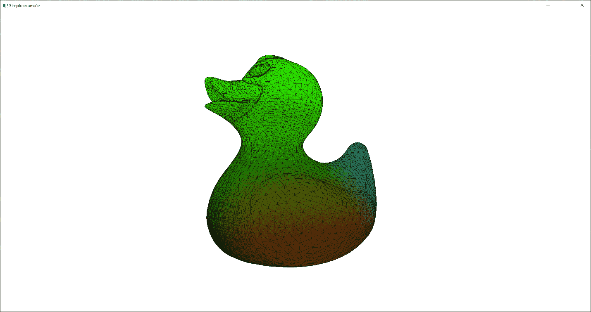
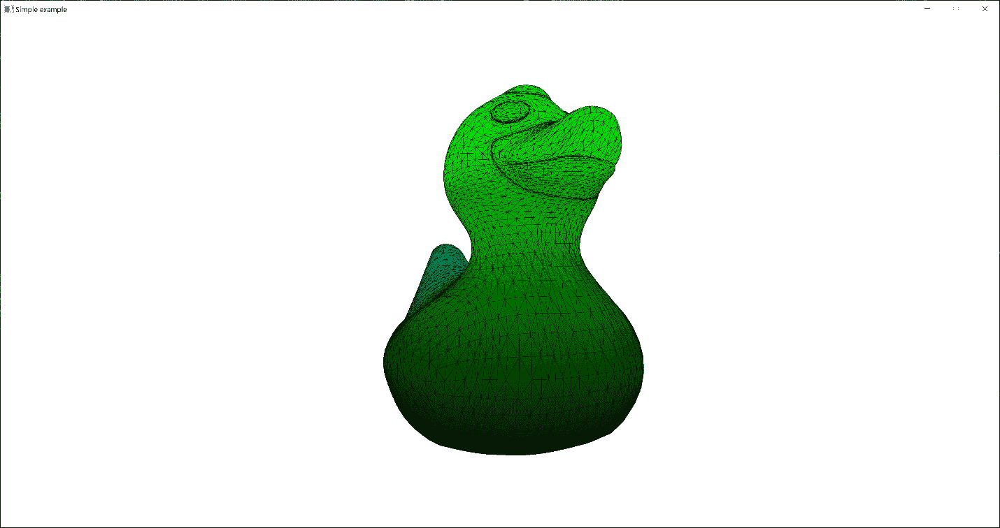
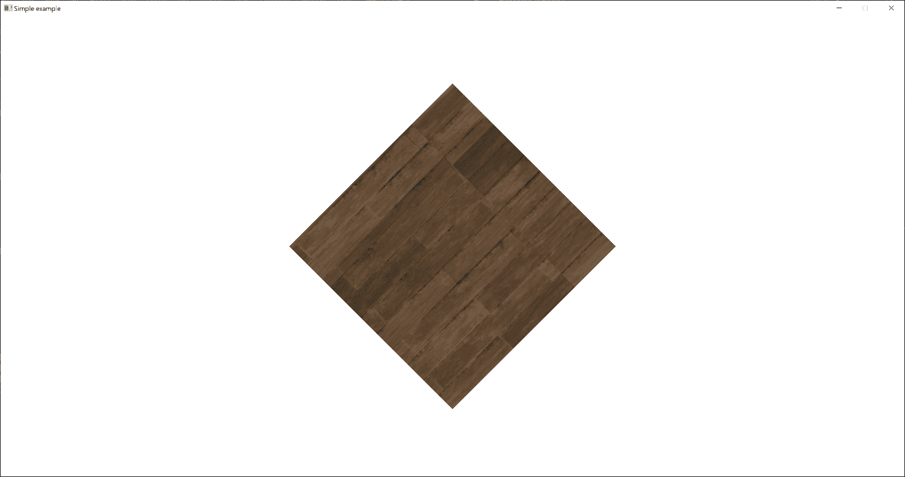

# 3 使用 Vulkan 对象

## 加入我们的 Discord 书籍社区


[`packt.link/unitydev`](https://packt.link/unitydev)

在上一章中，我们学习了如何使用 Vulkan 在屏幕上显示我们的第一个三角形。让我们继续前进，学习如何处理纹理和缓冲区来构建一个现代的 Vulkan 包装器。本章的食谱将不仅关注图形 API，还将涵盖提高图形应用程序开发和各种 3D 图形算法所必需的各种技巧和窍门。在 Vulkan 方面，我们将涵盖使其运行的基本内容。底层 Vulkan 实现基于 *LightweightVK* 库 ([`github.com/corporateshark/lightweightvk`](https://github.com/corporateshark/lightweightvk))。

在本章中，我们将涵盖以下食谱：

+   在 Vulkan 中处理缓冲区

+   实现阶段缓冲区

+   在 Vulkan 中使用纹理数据

+   存储 Vulkan 对象

+   使用 Vulkan 描述符索引

## 技术要求

要运行本章的食谱，您必须使用配备支持 Vulkan 1.3 的显卡和驱动程序的 Windows 或 Linux 计算机。阅读上一章，*第二章，Vulkan 入门*，以了解开始使用 Vulkan 所必需的基本知识。

## 在 Vulkan 中处理缓冲区

Vulkan 中的缓冲区本质上是指持任意数据且能够被 GPU 访问的内存区域。更准确地说，Vulkan 缓冲区指的是与内存区域 `VkDeviceMemory` 相连的元数据 `VkBuffer`。要使用 Vulkan API 渲染 3D 场景，我们必须将场景数据转换为适合 GPU 的格式。在本食谱中，我们将描述如何创建 GPU 缓冲区并将顶点数据上传到其中。我们将使用开源的资产加载库 *Assimp* ([`github.com/assimp/assimp`](https://github.com/assimp/assimp)) 从 `.obj` 文件中加载 3D 模型，并使用 *LightweightVK* 和 Vulkan 进行渲染。此外，食谱还涵盖了 *Vulkan 内存分配器* (*VMA*) 库的一些基本用法。

### 准备工作

将数据上传到 GPU 缓冲区是像任何其他 Vulkan 操作一样通过命令缓冲区执行的运算。这意味着我们需要一个能够执行传输操作的命令队列。命令缓冲区的创建和使用在上一章的 *使用 Vulkan 命令缓冲区* 食谱中已有介绍。

### 如何做到...

让我们从我们的采样应用程序中的高级代码开始，`Chapter03/01_Assimp`，并从那里探索到 Vulkan API：

1.  首先，我们需要借助 Assimp 库从 .obj 文件中加载我们的模型。以下是一些基本的代码来完成这项工作。不要忘记，为了更好的性能，可以在向量上调用 `reserve()`。为了简单起见，我们只加载第一个网格，并只读取顶点位置和索引。

```cpp
 const aiScene* scene = aiImportFile(
    “data/rubber_duck/scene.gltf”, aiProcess_Triangulate);
  const aiMesh* mesh = scene->mMeshes[0];
  std::vector<vec3> positions;
  std::vector<uint32_t> indices;
  positions.reserve(mesh->mNumVertices);
  indices.reserve(3 * mesh->mNumFaces);
  for (unsigned int i = 0; i != mesh->mNumVertices; i++) {
    const aiVector3D v = mesh->mVertices[i];
    positions.push_back(vec3(v.x, v.y, v.z));
  }
  for (unsigned int i = 0; i != mesh->mNumFaces; i++) {
    for (int j = 0; j != 3; j++)
      indices.push_back(mesh->mFaces[i].mIndices[j]);
  }
  aiReleaseImport(scene);
```

1.  现在我们必须为加载的顶点位置和索引创建缓冲区。我们的顶点缓冲区将具有使用标志 `BufferUsageBits_Vertex`。我们要求 *LightweightVK* 从 `positions.data()` 开始上传初始缓冲区数据。C++20 的指定初始化器语法对于这种高级 API 非常方便。索引缓冲区有一个相应的使用标志 `BufferUsageBits_Index`。这两个缓冲区都存储在 GPU 内存中以提高性能。这通过指定存储类型 `StorageType_Device` 来确保，它在 *LightweightVK* 中被解析以选择这些缓冲区的适当 Vulkan 内存类型。

```cpp
 Holder<lvk::BufferHandle> vertexBuffer = ctx->createBuffer(
      { .usage     = lvk::BufferUsageBits_Vertex,
        .storage   = lvk::StorageType_Device,
        .size      = sizeof(vec3) * positions.size(),
        .data      = positions.data(),
        .debugName = “Buffer: vertex” }, nullptr);
  Holder<lvk::BufferHandle> indexBuffer = ctx->createBuffer(
      { .usage     = lvk::BufferUsageBits_Index,
        .storage   = lvk::StorageType_Device,
        .size      = sizeof(uint32_t) * indices.size(),
        .data      = indices.data(),
        .debugName = “Buffer: index” }, nullptr);
```

1.  要使用 Vulkan 渲染复杂的凹面网格，我们必须使用深度缓冲区。我们需要自己创建一个，如下所示。在这里我们指定 `Format_Z_F32`，但底层的 *LightweightVK* Vulkan 后端会将其替换为当前 Vulkan 实现上实际可用的最接近的格式。`width` 和 `height` 的值对应于帧缓冲区的尺寸。我们只将深度纹理用作深度缓冲区，不会从中采样，这意味着指定使用标志为 `TextureUsageBits_Attachment` 就足够了。

```cpp
 Holder<lvk::TextureHandle> depthTexture = ctx->createTexture({
        .type       = lvk::TextureType_2D,
        .format     = lvk::Format_Z_F32,
        .dimensions = {(uint32_t)width, (uint32_t)height},
        .usage      = lvk::TextureUsageBits_Attachment,
        .debugName  = “Depth buffer”,
    });
```

1.  在我们继续创建渲染管线之前，正如在上一章的食谱“初始化 Vulkan 管线”中所描述的，我们必须使用上述顶点缓冲区为它们指定顶点输入状态。以下是我们可以这样做的方法。在这里，`.location = 0` 对应于 GLSL 顶点着色器中的输入位置，它将渲染此网格。

```cpp
 const lvk::VertexInput vdesc = {
    .attributes    = { { .location = 0, 
                         .format = lvk::VertexFormat::Float3 } },
    .inputBindings = { { .stride = sizeof(vec3) } },
  };
```

1.  现在我们可以创建两个渲染管线。第一个用于渲染实体网格。另一个将在其上方渲染线框网格。注意，`.depthFormat` 设置为我们之前创建的深度纹理的格式。

```cpp
 Holder<lvk::ShaderModuleHandle> vert =
    loadShaderModule(ctx, “Chapter03/01_Assimp/src/main.vert”);
  Holder<lvk::ShaderModuleHandle> frag =
    loadShaderModule(ctx, “Chapter03/01_Assimp/src/main.frag”);
  Holder<lvk::RenderPipelineHandle> pipelineSolid =
    ctx->createRenderPipeline({
      .vertexInput = vdesc,
      .smVert      = vert,
      .smFrag      = frag,
      .color       = { { .format = ctx->getSwapchainFormat() } },
      .depthFormat = ctx->getFormat(depthTexture),
      .cullMode    = lvk::CullMode_Back,
  });
```

1.  第二个渲染管线通过将 `.polygonMode` 字段设置为 `PolygonMode_Line` 来执行线框渲染。两个管线使用相同的着色器集。使用一个专用常量来改变着色器的行为。

```cpp
 const uint32_t isWireframe = 1;
  Holder<lvk::RenderPipelineHandle> pipelineWireframe =
    ctx->createRenderPipeline({
      .vertexInput = vdesc,
      .smVert      = vert,
      .smFrag      = frag,
      .specInfo = { .entries = { { .constantId = 0,
                                   .size = sizeof(uint32_t) } },
        .data = &isWireframe, .dataSize = sizeof(isWireframe) },
      .color       = { { .format = ctx->getSwapchainFormat() } },
      .depthFormat = ctx->getFormat(depthTexture),
      .cullMode    = lvk::CullMode_Back,
      .polygonMode = lvk::PolygonMode_Line,
  });
```

1.  在我们可以进入主循环之前，我们需要定义一个深度状态。深度状态启用深度缓冲区写入并设置适当的深度比较运算符。

```cpp
 const lvk::DepthState dState = {
    .compareOp = lvk::CompareOp_Less, .isDepthWriteEnabled = true   };
```

现在我们可以看看应用程序的主循环。这里我们跳过了 GLFW 事件拉取和帧缓冲区大小更新代码。你可以在 `Chapter03/01_Assimp/src/main.cpp` 中找到它们：

1.  主循环根据当前帧缓冲区宽高比更新投影矩阵 `p`。

```cpp
 while (!glfwWindowShouldClose(window)) {
    …
    const float ratio = width / height;
    const mat4 p = glm::perspective(45.0f, ratio, 0.1f, 1000.0f);
```

1.  设置模型视图矩阵以启用模型绕垂直轴的逐渐旋转。模型矩阵 `m` 负责将模型的“向上”方向与 Vulkan 中的垂直轴对齐。视图矩阵 `v` 负责我们的 3D 相机方向和观察方向，它围绕垂直轴 `Y` 缓慢旋转。

```cpp
 const mat4 m = glm::rotate(
      mat4(1.0f), glm::radians(-90.0f), vec3(1, 0, 0));
    const mat4 v = glm::rotate(glm::translate(mat4(1.0f),
      vec3(0.0f, -0.5f, -1.5f)), (float)glfwGetTime(),
      vec3(0.0f, 1.0f, 0.0f));
```

1.  现在渲染通道需要指定深度缓冲区的加载操作和清除值。帧缓冲区只有一个颜色附件 - 当前的交换链图像。

```cpp
 const lvk::RenderPass renderPass = {
      .color = {
        { .loadOp = LoadOp_Clear, .clearColor = { 1., 1., 1., 1\. }}
      },
      .depth = { .loadOp = LoadOp_Clear, .clearDepth = 1\. }
    };
    const lvk::Framebuffer framebuffer = {
      .color = { { .texture = ctx->getCurrentSwapchainTexture() } },
      .depthStencil = { .texture = depthTexture },
    };
```

1.  准备工作完成后，我们可以按照*使用 Vulkan 命令缓冲区*的说明获取命令缓冲区，并开始渲染。大括号用于强调范围。

```cpp
 lvk::ICommandBuffer& buf = ctx->acquireCommandBuffer();
    buf.cmdBeginRendering(renderPass, framebuffer);
```

1.  顶点缓冲区和索引缓冲区都应该被绑定。顶点缓冲区绑定到绑定点`0`。索引缓冲区使用无符号 32 位整数作为索引。

```cpp
 buf.cmdBindVertexBuffer(0, vertexBuffer);
    buf.cmdBindIndexBuffer(indexBuffer, lvk::IndexFormat_UI32);
```

1.  让我们使用第一个渲染管线和深度状态渲染一个实体网格。模型视图投影矩阵通过 Vulkan 推送常数发送到着色器。推送常数是一种高效机制，用于将非常少量的数据传递给着色器。Vulkan 1.3 保证至少有`128`字节的推送常数，这足以存储`2`个 4x4 矩阵或`16`个任意的 64 位 GPU 缓冲区地址。

```cpp
 buf.cmdBindRenderPipeline(pipelineSolid);
    buf.cmdBindDepthState(dState);
    buf.cmdPushConstants(p * v * m);
    buf.cmdDrawIndexed(lvk::Primitive_Triangle, indices.size());
```

1.  然后，我们在实体网格的上方渲染网格的线框副本。我们设置深度偏移，以便正确且无闪烁地渲染线框边缘。

```cpp
 buf.cmdBindRenderPipeline(pipelineWireframe);
    buf.cmdSetDepthBias(0.0f, -1.0f, 0.0f);
    buf.cmdDrawIndexed(lvk::Primitive_Triangle, indices.size());
```

1.  现在可以将命令缓冲区提交以执行。

```cpp
 buf.cmdEndRendering();
    ctx->submit(buf, ctx->getCurrentSwapchainTexture());
```

演示应用程序应该渲染一个带有线框覆盖的彩色旋转鸭，如下面的截图所示。



图 3.1：使用 Assimp 加载的网格渲染

高级部分很容易。现在让我们深入到底层实现，学习如何使用 Vulkan API 实现这个精简的缓冲区管理接口。

### 它是如何工作的...

让我们看看低级 Vulkan 代码，以了解缓冲区是如何工作的。我们的深入探索从`IContext::createBuffer()`开始，它接受一个缓冲区描述结构`BufferDesc`作为输入：

1.  `BufferDesc`的声明如下。

```cpp
struct BufferDesc final {
  uint8_t usage = 0;
  StorageType storage = StorageType_HostVisible;
  size_t size = 0;
  const void* data = nullptr;
  const char* debugName = ““;
};
```

存储类型可以是以下三个枚举值之一：`StorageType_Device`、`StorageType_HostVisible`。它们对应于 GPU 本地内存——从 CPU 端不可见——和主机可见内存。实际的 Vulkan 内存类型由底层的*LightweightVK*代码和**VulkanMemoryAllocator**（**VMA**）库更精确地选择。

1.  缓冲区使用模式是以下标志的组合。这些标志非常灵活，我们可以请求任何必要的组合，除了统一和存储缓冲区是互斥的。

```cpp
enum BufferUsageBits : uint8_t {
  BufferUsageBits_Index = 1 << 0,
  BufferUsageBits_Vertex = 1 << 1,
  BufferUsageBits_Uniform = 1 << 2,
  BufferUsageBits_Storage = 1 << 3,
  BufferUsageBits_Indirect = 1 << 4,
};
```

现在让我们看看`VulkanContext::createBuffer()`的实现，它将请求的 LightweightVK 缓冲区属性转换为相应的支持 Vulkan 标志：

1.  在所有其他事情之前，我们应该检查是否应该使用一个阶段缓冲区来将数据上传到这个新的缓冲区。例如，如果阶段缓冲区被禁用，因为我们的 GPU 只有一个既是主机可见又是设备本地的共享内存堆，我们将使用`StorageType_HostVisible`覆盖请求的设备本地存储模式。这对于消除具有这种内存配置的 GPU 上的额外复制非常重要。

```cpp
Holder<BufferHandle> VulkanContext::createBuffer(
  const BufferDesc& requestedDesc, Result* outResult) {
  BufferDesc desc = requestedDesc;
  if (!useStaging_ && (desc.storage == StorageType_Device))
    desc.storage = StorageType_HostVisible;
```

1.  如果应用程序想要设备本地缓冲区，我们应该使用一个阶段缓冲区将数据传输到我们的设备本地缓冲区。设置相应的 Vulkan 标志以确保我们可以传输到和从这个缓冲区。

```cpp
 VkBufferUsageFlags usageFlags = desc.storage == StorageType_Device ?
    VK_BUFFER_USAGE_TRANSFER_DST_BIT |
    VK_BUFFER_USAGE_TRANSFER_SRC_BIT : 0;
```

1.  对于每个请求的使用标志，启用一组必要的特定 Vulkan 使用标志。要使用缓冲区设备地址功能并通过指针从着色器访问缓冲区，我们应该添加标志 `VK_BUFFER_USAGE_SHADER_DEVICE_ADDRESS_BIT`。

```cpp
 if (desc.usage & BufferUsageBits_Index)
    usageFlags |= VK_BUFFER_USAGE_INDEX_BUFFER_BIT;
  if (desc.usage & BufferUsageBits_Vertex)
    usageFlags |= VK_BUFFER_USAGE_VERTEX_BUFFER_BIT;
  if (desc.usage & BufferUsageBits_Uniform)
    usageFlags |= VK_BUFFER_USAGE_UNIFORM_BUFFER_BIT |
                  VK_BUFFER_USAGE_SHADER_DEVICE_ADDRESS_BIT;
  if (desc.usage & BufferUsageBits_Storage)
    usageFlags |= VK_BUFFER_USAGE_STORAGE_BUFFER_BIT |
                  VK_BUFFER_USAGE_TRANSFER_DST_BIT |
                  VK_BUFFER_USAGE_SHADER_DEVICE_ADDRESS_BIT;
  if (desc.usage & BufferUsageBits_Indirect)
    usageFlags |= VK_BUFFER_USAGE_INDIRECT_BUFFER_BIT |
                  VK_BUFFER_USAGE_SHADER_DEVICE_ADDRESS_BIT;
```

1.  使用辅助函数获取所需的 Vulkan 内存属性，然后调用 `VulkanContext::createBuffer()` 的另一个变体，该变体只接受 Vulkan 标志。委托很有用，因为这个函数在 *LightweightVK* Vulkan 后端内部使用来创建内部辅助缓冲区。这个函数检查缓冲区大小限制并在相应的池中创建 `VulkanBuffer` 对象。

```cpp
 const VkMemoryPropertyFlags memFlags =
    storageTypeToVkMemoryPropertyFlags(desc.storage);
  Result result;
  BufferHandle handle = createBuffer(
    desc.size, usageFlags, memFlags, &result, desc.debugName);
```

1.  如果提供了初始缓冲区数据，则立即上传。

```cpp
 if (desc.data) {
    upload(handle, desc.data, desc.size, 0);
  }
  Result::setResult(outResult, Result());
  return {this, handle};
}
```

让我们看看 `VulkanBuffer` 的接口，它封装了 Vulkan 缓冲区管理功能。

1.  所有之前获得的 Vulkan 标志都传递给类构造函数。默认构造函数很简单，使 `VulkanBuffer` 能够存储在 *LightweightVK* 对象池中。我们将在后续章节中讨论这些池。

```cpp
class VulkanBuffer final {
 public:
  VulkanBuffer() = default;
  VulkanBuffer(lvk::VulkanContext* ctx,
               VkDevice device,
               VkDeviceSize bufferSize,
               VkBufferUsageFlags usageFlags,
               VkMemoryPropertyFlags memFlags,
               const char* debugName = nullptr);
  ~VulkanBuffer();
```

1.  一系列方法用于从主机获取数据到缓冲区和从缓冲区获取数据。所有主机可见的缓冲区都自动映射，以便我们可以通过正常的 C++ 指针访问其数据。`flushMappedMemory()` 函数在系统上的缓冲区不支持一致性内存时是必要的。当启用 **Vulkan Memory Allocator** (**VMA**) 库时，该函数调用 `vkFlushMappedMemoryRanges()` 和 `vmaFlushAllocation()`。 

```cpp
 void bufferSubData(size_t offset, size_t size, const void* data);
  void getBufferSubData(size_t offset, size_t size, void* data);
  [[nodiscard]] uint8_t* getMappedPtr() const {
    return static_cast<uint8_t*>(mappedPtr_);
  }
  bool isMapped() const { return mappedPtr_ != nullptr; }
  void flushMappedMemory(VkDeviceSize offset, VkDeviceSize size);
```

1.  数据成员封装了与底层 Vulkan 缓冲区管理代码相关的所有必要内容。只有在启用 *VMA* 库时才使用 VMA 相关字段。

```cpp
 lvk::VulkanContext* ctx_ = nullptr;
  VkDevice device_ = VK_NULL_HANDLE;
  VkBuffer vkBuffer_ = VK_NULL_HANDLE;
  VkDeviceMemory vkMemory_ = VK_NULL_HANDLE;
  VmaAllocationCreateInfo vmaAllocInfo_ = {};
  VmaAllocation vmaAllocation_ = VK_NULL_HANDLE;
  VkDeviceAddress vkDeviceAddress_ = 0;
  VkDeviceSize bufferSize_ = 0;
  VkBufferUsageFlags vkUsageFlags_ = 0;
  VkMemoryPropertyFlags vkMemFlags_ = 0;
  void* mappedPtr_ = nullptr;
};
```

现在我们已经准备好创建实际的 Vulkan 缓冲区对象。让我们看看代码。为了更好地理解，省略了错误处理：

1.  构造函数参数直接用于填充 *VkBufferCreateInfo* 结构。

```cpp
lvk::VulkanBuffer::VulkanBuffer(lvk::VulkanContext* ctx,
                                VkDevice device,
                                VkDeviceSize bufferSize,
                                VkBufferUsageFlags usageFlags,
                                VkMemoryPropertyFlags memFlags,
                                const char* debugName) :
  ctx_(ctx), device_(device), bufferSize_(bufferSize),
  vkUsageFlags_(usageFlags), vkMemFlags_(memFlags)
{
  const VkBufferCreateInfo ci = {
      .sType = VK_STRUCTURE_TYPE_BUFFER_CREATE_INFO,
      .pNext = nullptr,
      .flags = 0,
      .size = bufferSize,
      .usage = usageFlags,
      .sharingMode = VK_SHARING_MODE_EXCLUSIVE,
      .queueFamilyIndexCount = 0,
      .pQueueFamilyIndices = nullptr,
  };
```

1.  现在我们决定是直接使用 Vulkan 还是让 *Vulkan Memory Allocator* 为我们做所有的内存分配。VMA 是主要代码路径，而直接 Vulkan 调用在必要时进行调试很有帮助。在 VMA 的情况下，我们再次转换标志。

```cpp
 if (LVK_VULKAN_USE_VMA) {
    if (memFlags & VK_MEMORY_PROPERTY_HOST_VISIBLE_BIT) {
      vmaAllocInfo_.requiredFlags =
        VK_MEMORY_PROPERTY_HOST_VISIBLE_BIT;
      vmaAllocInfo_.preferredFlags =
        VK_MEMORY_PROPERTY_HOST_COHERENT_BIT |
        VK_MEMORY_PROPERTY_HOST_CACHED_BIT;
      vmaAllocInfo_.flags = VMA_ALLOCATION_CREATE_MAPPED_BIT |
        VMA_ALLOCATION_CREATE_HOST_ACCESS_RANDOM_BIT;
    }
    if (memFlags & VK_MEMORY_PROPERTY_HOST_COHERENT_BIT)
      vmaAllocInfo_.requiredFlags |=
        VK_MEMORY_PROPERTY_HOST_COHERENT_BIT;
    vmaAllocInfo_.usage = VMA_MEMORY_USAGE_AUTO;
    vmaCreateBuffer((VmaAllocator)ctx_->getVmaAllocator(), &ci,
      &vmaAllocInfo_, &vkBuffer_, &vmaAllocation_, nullptr);
```

1.  处理主机可见的内存映射缓冲区。在整个缓冲区生命周期中使用持久映射。

```cpp
 if (memFlags & VK_MEMORY_PROPERTY_HOST_VISIBLE_BIT) {
      vmaMapMemory((VmaAllocator)ctx_->getVmaAllocator(),
        vmaAllocation_, &mappedPtr_);
    }
  } else {
```

1.  直接的 Vulkan 代码路径很简单，但需要手动内存分配。有关完整的详细错误检查，请参阅 `lvk/vulkan/VulkanClasses.cpp`，这里省略了文本中的内容。

```cpp
 vkCreateBuffer(device_, &ci, nullptr, &vkBuffer_);
    VkMemoryRequirements requirements = {};
    vkGetBufferMemoryRequirements(device_, vkBuffer_, &requirements);
    lvk::allocateMemory(ctx_->getVkPhysicalDevice(), device_,
      &requirements, memFlags, &vkMemory_));
    vkBindBufferMemory(device_, vkBuffer_, vkMemory_, 0);
```

1.  主机可见的缓冲区以类似的方式处理。

```cpp
 if (memFlags & VK_MEMORY_PROPERTY_HOST_VISIBLE_BIT) {
      vkMapMemory(device_, vkMemory_, 0, bufferSize_, 0, &mappedPtr_);
    }
  }
```

1.  让我们为此缓冲区设置一个用户提供的调试名称。

```cpp
 lvk::setDebugObjectName(
    device_, VK_OBJECT_TYPE_BUFFER, (uint64_t)vkBuffer_, debugName);
```

1.  一旦创建缓冲区，获取一个可以在着色器中使用以访问此缓冲区的缓冲区设备地址。

```cpp
 if (usageFlags & VK_BUFFER_USAGE_SHADER_DEVICE_ADDRESS_BIT) {
    const VkBufferDeviceAddressInfo ai = {
      .sType = VK_STRUCTURE_TYPE_BUFFER_DEVICE_ADDRESS_INFO,
      .buffer = vkBuffer_,     };
    vkDeviceAddress_ = vkGetBufferDeviceAddress(device_, &ai);
  }
}
```

缓冲区销毁过程很有趣，值得提及，因为 Vulkan 缓冲区在 GPU 使用期间不应被删除。除了进行 VMA 和 Vulkan 调用来进行内存解映射和释放外，析构函数将实际释放延迟到缓冲区不再被 GPU 使用为止：

1.  如果这个 `VulkanBuffer` 对象是用默认构造函数创建的，并且没有任何有效负载，我们就可以立即返回。`deferredTask()` 成员函数将 lambda 参数的执行推迟到所有先前提交的命令缓冲区完成处理的时间。我们将在后续章节中探讨此机制。

```cpp
lvk::VulkanBuffer::~VulkanBuffer() {
  if (!ctx_) return;
  if (LVK_VULKAN_USE_VMA) {
    if (mappedPtr_)
      vmaUnmapMemory(
        (VmaAllocator)ctx_->getVmaAllocator(), vmaAllocation_);
    ctx_->deferredTask(std::packaged_task<void()>(
      [vma = ctx_->getVmaAllocator(),
       buffer = vkBuffer_,
       allocation = vmaAllocation_]() {
      vmaDestroyBuffer((VmaAllocator)vma, buffer, allocation);
    }));
  } else {
```

1.  当我们不使用 VMA 并直接与 Vulkan 通信时，采取类似的方法。

```cpp
 if (mappedPtr_)
      vkUnmapMemory(device_, vkMemory_);
    ctx_->deferredTask(std::packaged_task<void()>(
      [device = device_, buffer = vkBuffer_, memory = vkMemory_]() {
      vkDestroyBuffer(device, buffer, nullptr);
      vkFreeMemory(device, memory, nullptr);
    }));
  }
}
```

在我们总结如何与 Vulkan 缓冲区一起工作时，这里还有三个其他成员函数需要提及：

1.  函数 `flushMappedMemory()` 用于确保当不支持一致性内存时，主机写入到映射内存的缓冲区对 GPU 可用。

```cpp
void lvk::VulkanBuffer::flushMappedMemory(
  VkDeviceSize offset, VkDeviceSize size) const
{
  if (!LVK_VERIFY(isMapped()))return;
  if (LVK_VULKAN_USE_VMA) {
    vmaFlushAllocation((VmaAllocator)ctx_->getVmaAllocator(),
      vmaAllocation_, offset, size);
  } else {
    const VkMappedMemoryRange memoryRange = {
      .sType = VK_STRUCTURE_TYPE_MAPPED_MEMORY_RANGE,
      .memory = vkMemory_,
      .offset = offset,
      .size = size,
    };
    vkFlushMappedMemoryRanges(device_, 1, &memoryRange);
  }
}
```

1.  函数 `getBufferSubData()` 以方便的方式包装了一个 `memcpy()` 操作。它仅适用于内存映射的主机可见缓冲区。设备本地缓冲区使用一个阶段缓冲区单独处理。我们将在后续章节中讨论此机制。

```cpp
void lvk::VulkanBuffer::getBufferSubData(
  size_t offset, size_t size, void* data) {
  LVK_ASSERT(mappedPtr_);
  if (!mappedPtr_) return;
  LVK_ASSERT(offset + size <= bufferSize_);
  const uint8_t* src = static_cast<uint8_t*>(mappedPtr_) + offset;
  memcpy(data, src, size);
}
```

1.  函数 `bufferSubData()` 是一个类似的包装器。对于主机可见的缓冲区来说，这是微不足道的。注意这里是如何使用 `memset()` 来将缓冲区的内容设置为 `0`。

```cpp
void lvk::VulkanBuffer::bufferSubData(
  size_t offset, size_t size, const void* data) {
  if (!mappedPtr_) return;
  LVK_ASSERT(offset + size <= bufferSize_);
  if (data) {
    memcpy((uint8_t*)mappedPtr_ + offset, data, size);
  } else {
    memset((uint8_t*)mappedPtr_ + offset, 0, size);
  }
}
```

现在我们已经涵盖了运行 `Chapter03/01_Assimp` 应用程序所需的全部 Vulkan 代码，该应用程序通过 *Assimp* 加载并渲染 `.obj` 3D 模型。有两个小函数需要提及，分别用于绑定顶点和索引缓冲区，它们是 `ICommandBuffer` 接口的一部分。

1.  第一个函数通过 `vkCmdBindVertexBuffers()` 绑定顶点缓冲区，用于顶点输入。需要进行一些检查以确保缓冲区的正确使用。在后续章节中，我们将学习如何完全省略顶点缓冲区，并学习 *可编程顶点提取* (*PVP*) 方法。

```cpp
void lvk::CommandBuffer::cmdBindVertexBuffer(uint32_t index,
  BufferHandle buffer, size_t bufferOffset)
{
  if (!LVK_VERIFY(!buffer.empty()))return;
  lvk::VulkanBuffer* buf = ctx_->buffersPool_.get(buffer);
  VkBuffer vkBuf = buf->vkBuffer_;
  LVK_ASSERT(buf->vkUsageFlags_ & VK_BUFFER_USAGE_VERTEX_BUFFER_BIT);
  const VkDeviceSize offset = bufferOffset;
  vkCmdBindVertexBuffers(
    wrapper_->cmdBuf_, index, 1, &vkBuf, &offset);
}
```

1.  第二个函数使用 `vkCmdBindIndexBuffer()` 绑定索引缓冲区。除了断言之外，还有一些从 *LightweightVK* 到 Vulkan API 的枚举类型转换。

```cpp
void lvk::CommandBuffer::cmdBindIndexBuffer(BufferHandle indexBuffer,
  IndexFormat indexFormat, size_t indexBufferOffset)
{
  lvk::VulkanBuffer* buf = ctx_->buffersPool_.get(indexBuffer);
  LVK_ASSERT(buf->vkUsageFlags_ & VK_BUFFER_USAGE_INDEX_BUFFER_BIT);
  const VkIndexType type = indexFormatToVkIndexType(indexFormat);
  vkCmdBindIndexBuffer(
    wrapper_->cmdBuf_, buf->vkBuffer_, indexBufferOffset, type);
}
```

应用程序 `Chapter03/01_Assimp` 应渲染以下图像。



图 3.2：使用 Assimp 加载的网格渲染

现在我们已经完成了一些非常基本的 Vulkan 使用，并准备好向我们的示例添加一些纹理。

## 实现阶段缓冲区

GPU 设备本地缓冲区对主机不可见，我们可以使用各种 CPU-GPU-CPU 复制操作将数据上传到它们。在 Vulkan 中，这可以通过创建一个辅助缓冲区，称为阶段缓冲区，它是 CPU 可见或主机可见的，从主机上传一些数据到其中，然后发出 GPU 命令从该阶段缓冲区复制到设备本地缓冲区来实现。让我们学习如何在 Vulkan 中实现这项技术。

### 准备工作

在继续阅读之前，请查看之前的配方，*处理 Vulkan 中的缓冲区*，以了解如何创建不同类型的 Vulkan 缓冲区。

### 如何做到这一点...

如往常一样，让我们从 LightweightVK 的高级接口开始，然后深入到实现。在`lvk/LVK.h`中声明的接口类`IContext`公开以下方法来操作缓冲区。

```cpp
Result upload(BufferHandle handle,
  const void* data, size_t size, size_t offset = 0) = 0;
uint8_t* getMappedPtr(BufferHandle handle) const = 0;
uint64_t gpuAddress(BufferHandle handle, size_t offset = 0) const = 0;
void flushMappedMemory(BufferHandle handle,
  size_t offset, size_t size) const = 0;
```

这些方法在子类`VulkanContext`中实现，大致对应于前一个配方中详细讨论的`VulkanBuffer`实现。我们还看到了`VulkanContext::createBuffer()`如何在有初始数据要上传到缓冲区的情况下调用`VulkanContext::uload()`。让我们看看这个方法内部是什么。

1.  首先，我们必须将缓冲区句柄转换为指向`VulkanBuffer`对象的指针。这是通过一个存储系统中所有`VulkanBuffer`对象的池来完成的。池的实现将在后续配方中讨论。现在，让我们假装这是一个将整数句柄映射到`VulkanBuffer`对象指针的不可见机制。

```cpp
Result VulkanContext::upload(lvk::BufferHandle handle,
  const void* data, size_t size, size_t offset) {
  if (!LVK_VERIFY(data)) return lvk::Result();
  lvk::VulkanBuffer* buf = buffersPool_.get(handle);
```

1.  在进行一些范围检查后，我们将工作委托给成员函数`VulkanStagingDevice::bufferSubData()`。

```cpp
 if (!LVK_VERIFY(offset + size <= buf->bufferSize_))
    return Result(Result::Code::ArgumentOutOfRange, “Out of range”);
  stagingDevice_->bufferSubData(*buf, offset, size, data);
  return lvk::Result();
}
```

类`VulkanStagingDevice`封装了管理 Vulkan 阶段缓冲区所需的所有功能。

1.  阶段设备提供了访问设备本地缓冲区和图像的功能。在本配方中，我们将仅关注缓冲区部分和 2D 图像。虽然 3D 图像上传由*LightweightVK*支持，但本书中并未使用，我们将跳过它。如果您对学习这些细节感兴趣，鼓励您查看*LightweightVK*的实际源代码，位于`lvk/vulkan/VulkanClasses.cpp`。

```cpp
class VulkanStagingDevice final {
 public:
  explicit VulkanStagingDevice(VulkanContext& ctx);
  ~VulkanStagingDevice();
  void bufferSubData(VulkanBuffer& buffer,
    size_t dstOffset, size_t size, const void* data);
  void imageData2D(VulkanImage& image,
                   const VkRect2D& imageRegion,
                   uint32_t baseMipLevel,
                   uint32_t numMipLevels,
                   uint32_t layer,
                   uint32_t numLayers,
                   VkFormat format,
                   const void* data[]);
  // … imageData3D() is skipped
```

1.  每次调用`bufferSubData()`或`imageData2D()`都会在阶段缓冲区中占用一些空间。结构`MemoryRegionDesc`使用一个`SubmitHandle`描述这样的内存区域，该`SubmitHandle`用于通过它上传数据。

```cpp
 private:
  struct MemoryRegionDesc {
    uint32_t srcOffset_ = 0;
    uint32_t alignedSize_ = 0;
    SubmitHandle handle_ = {};
  };
```

1.  函数`getNextFreeOffset()`返回下一个可用的内存区域，该区域适合容纳`size`字节的数据。函数`waitAndReset()`用于内部等待，直到所有内存区域都可用。

```cpp
 MemoryRegionDesc getNextFreeOffset(uint32_t size);
  void waitAndReset();
 private:
  VulkanContext& ctx_;
  BufferHandle stagingBuffer_;
  std::unique_ptr<lvk::VulkanImmediateCommands> immediate_;
  uint32_t stagingBufferFrontOffset_ = 0;
  uint32_t stagingBufferSize_ = 0;
  uint32_t bufferCapacity_ = 0;
  std::vector<MemoryRegionDesc> regions_;
};
```

一旦我们理解了`getNextFreeOffset()`辅助函数的工作原理，上传过程就变得非常简单。让我们看看：

1.  确保请求的缓冲区大小是对齐的。某些压缩图像格式要求大小填充到`16`字节。我们在这里贪婪地使用那个值。使用简单的二进制算术技巧来确保大小值按要求对齐。

```cpp
MemoryRegionDesc VulkanStagingDevice::getNextFreeOffset(uint32_t size) {
  constexpr uint32_t kStagingBufferAlignment_ = 16;
  uint32_t alignedSize = (size + kStagingBufferAlignment_ - 1) &
     ~(kStagingBufferAlignment_ - 1);
```

1.  跟踪最合适的内存区域。检查我们是否可以重用之前使用的任何内存区域。这可能会在阶段缓冲区中引起一些内存碎片化，但这不是问题，因为这些子分配的生命周期非常短。

```cpp
 auto bestIt = regions_.begin();
  for (auto it = regions_.begin(); it != regions_.end(); it++) {
    if (immediate_->isReady(SubmitHandle(it->handle_))) {
      if (it->alignedSize_ >= alignedSize) {
        SCOPE_EXIT { regions_.erase(it); };
        return *it;
      }
      if (bestIt->alignedSize_ < it->alignedSize_) bestIt = it;
    }
  }
```

1.  重新获取并返回内存区域。如果没有更多空间可用在阶段缓冲区中，则重新获取所有之前的内存区域。

```cpp
 if (bestIt != regions_.end() && 
      bufferCapacity_ < bestIt->alignedSize_) {
    regions_.erase(bestIt);
    return *bestIt;
  }
  if (bufferCapacity_ == 0) waitAndReset();
```

1.  如果我们不能重用任何之前的内存区域，则从空闲阶段内存中分配一个新的。

```cpp
 alignedSize =
    (alignedSize <= bufferCapacity_) ? alignedSize : bufferCapacity_;
  const uint32_t srcOffset = stagingBufferFrontOffset_;
  stagingBufferFrontOffset_ =
    (stagingBufferFrontOffset_ + alignedSize) % stagingBufferSize_;
  bufferCapacity_ -= alignedSize;
  return {srcOffset, alignedSize};
}
```

现在我们可以实现 `VulkanStagingDevice::bufferSubData()` 函数。这里的复杂性主要在于要上传的数据大小大于阶段缓冲区的大小。

1.  如果目标缓冲区对主机可见，就像我们在之前的配方中讨论的那样，直接将数据内存复制到其中，*处理 Vulkan 中的缓冲区*：

```cpp
void VulkanStagingDevice::bufferSubData(VulkanBuffer& buffer,
  size_t dstOffset, size_t size, const void* data)
{
  if (buffer.isMapped()) {
    buffer.bufferSubData(dstOffset, size, data);
    return;
  }
  lvk::VulkanBuffer* stagingBuffer =
    ctx_.buffersPool_.get(stagingBuffer_);
```

1.  在还有数据要上传的情况下迭代。在每次迭代中，我们尝试获取一个适合整个剩余大小的内存区域。我们相应地选择块大小：

```cpp
 while (size) {
    MemoryRegionDesc desc = getNextFreeOffset((uint32_t)size);
    const uint32_t chunkSize =
      std::min((uint32_t)size, desc.alignedSize_);
```

1.  阶段缓冲区本身始终对主机可见，因此我们可以将我们的数据内存复制到其中：

```cpp
 stagingBuffer->bufferSubData(desc.srcOffset_, chunkSize, data);
```

1.  获取命令缓冲区并发出 Vulkan 命令，在阶段缓冲区和目标缓冲区之间复制缓冲区数据：

```cpp
 const VkBufferCopy copy = {desc.srcOffset_, dstOffset, chunkSize};
    auto& wrapper = immediate_->acquire();
    vkCmdCopyBuffer(wrapper.cmdBuf_,
      stagingBuffer->vkBuffer_, buffer.vkBuffer_, 1, &copy);
    desc.handle_ = immediate_->submit(wrapper);
```

1.  当 GPU 正在执行复制时，我们将这个内存区域——连同其 `SubmitHandle` ——添加到已占用内存区域的容器中：

```cpp
 regions_.push_back(desc);
    size -= chunkSize;
    data = (uint8_t*)data + chunkSize;
    dstOffset += chunkSize;
  }
}
```

阶段缓冲区的另一个关键作用是将像素数据复制到 Vulkan 图像中。让我们看看它是如何实现的。这个函数要复杂得多，所以我们再次省略文本中的所有错误检查，以便更好地理解代码。

1.  `imageData2D()` 函数可以一次性上传图像的多个层，从 `layer` 开始，以及从 `baseMipLevel` 开始的多个米普级别。*LightweightVK* 假设存在一个最大可能的米普级别数量。我们计算每个米普级别的字节数。

```cpp
void VulkanStagingDevice::imageData2D(VulkanImage& image,
                                      const VkRect2D& imageRegion,
                                      uint32_t baseMipLevel,
                                      uint32_t numMipLevels,
                                      uint32_t layer,
                                      uint32_t numLayers,
                                      VkFormat format,
                                      const void* data[])
{
  uint32_t mipSizes[LVK_MAX_MIP_LEVELS];
```

1.  由于我们知道我们想要更新的基本米普级别编号，我们可以通过位移从 Vulkan 图像范围中计算其尺寸。

```cpp
 uint32_t width = image.vkExtent_.width >> baseMipLevel;
  uint32_t height = image.vkExtent_.height >> baseMipLevel;
  const Format texFormat(vkFormatToFormat(format));
```

1.  现在让我们计算每层存储大小，这是为了容纳图像的所有相应米普级别所必需的。函数 `getTextureBytesPerLayer()` 返回具有请求图像格式的层的字节数。将结果存储在 `mipSizes[]` 中。

```cpp
 uint32_t layerStorageSize = 0;
  for (uint32_t i = 0; i < numMipLevels; ++i) {
    const uint32_t mipSize = lvk::getTextureBytesPerLayer(
      image.vkExtent_.width, image.vkExtent_.height, texFormat, i);
    layerStorageSize += mipSize;
    mipSizes[i] = mipSize;
    width = width <= 1 ? 1 : width >> 1;
    height = height <= 1 ? 1 : height >> 1;
  }
```

1.  现在我们知道存储整个图像数据所需的大小。尝试从阶段缓冲区获取下一个内存区域。*LightweightVK* 不提供在多个较小的块中复制图像数据的功能。如果我们得到一个小于 `storageSize` 的内存区域，我们应该等待一个更大的内存区域变得可用。这一结果的一个后果是，*LightweightVK* 无法上传内存占用大于阶段缓冲区大小的图像。

```cpp
 const uint32_t storageSize = layerStorageSize * numLayers;
  MemoryRegionDesc desc = getNextFreeOffset(layerStorageSize);
  if (desc.alignedSize_ < storageSize) {
    waitAndReset();
    desc = getNextFreeOffset(storageSize);
  }
  LVK_ASSERT(desc.alignedSize_ >= storageSize);
```

1.  一旦我们在阶段缓冲区中有一个合适的内存区域，我们可以遍历图像层和米普级别，为 Vulkan 准备数据。

```cpp
 lvk::VulkanBuffer* stagingBuffer =
    ctx_.buffersPool_.get(stagingBuffer_);
  auto& wrapper = immediate_->acquire();
  for (uint32_t layer = 0; layer != numLayers; layer++) {
    stagingBuffer->bufferSubData(
      desc.srcOffset_ + layer * layerStorageSize,
      layerStorageSize,
      data[layer]);
    uint32_t mipLevelOffset = 0;
    for (uint32_t mipLevel = 0; mipLevel < numMipLevels; ++mipLevel) {
      const auto currentMipLevel = baseMipLevel + mipLevel;
```

1.  将图像布局转换为 `VK_IMAGE_LAYOUT_TRANSFER_DST_OPTIMAL`，以便我们可以在 Vulkan 转移操作中使用它作为目标。

```cpp
 lvk::imageMemoryBarrier(wrapper.cmdBuf_,
                              image.vkImage_,
                              0,
                              VK_ACCESS_TRANSFER_WRITE_BIT,
                              VK_IMAGE_LAYOUT_UNDEFINED,
                              VK_IMAGE_LAYOUT_TRANSFER_DST_OPTIMAL,
                              VK_PIPELINE_STAGE_TOP_OF_PIPE_BIT,
                              VK_PIPELINE_STAGE_TRANSFER_BIT,
                              VkImageSubresourceRange{
                                VK_IMAGE_ASPECT_COLOR_BIT,
                                currentMipLevel, 1, layer, 1});
```

1.  将像素数据从阶段缓冲区复制到图像中。此级别的缓冲区偏移量位于所有米普级别开始处，加上所有之前上传的米普级别的尺寸。

```cpp
 const VkRect2D region = {
        .offset = {.x = imageRegion.offset.x >> mipLevel,
                   .y = imageRegion.offset.y >> mipLevel},
        .extent = {.width =
                     max(1u, imageRegion.extent.width >> mipLevel),
                   .height=
                     max(1u, imageRegion.extent.height >> mipLevel)},
      };
      const VkBufferImageCopy copy = {
          .bufferOffset =
            desc.srcOffset_ + layer*layerStorageSize + mipLevelOffset,
          .bufferRowLength = 0,
          .bufferImageHeight = 0,
          .imageSubresource = VkImageSubresourceLayers{
            VK_IMAGE_ASPECT_COLOR_BIT, currentMipLevel, layer, 1},
          .imageOffset = {.x = region.offset.x,
                          .y = region.offset.y,
                          .z = 0},
          .imageExtent = {.width = region.extent.width,
                          .height = region.extent.height,
                          .depth = 1u},
      };
      vkCmdCopyBufferToImage(wrapper.cmdBuf_,
        stagingBuffer->vkBuffer_, image.vkImage_,
        VK_IMAGE_LAYOUT_TRANSFER_DST_OPTIMAL, 1, &copy);
```

1.  我们已经完成了这个 mip 级别和层的处理。将其图像布局从 `VK_IMAGE_LAYOUT_TRANSFER_DST_OPTIMAL` 转换为 `VK_IMAGE_LAYOUT_SHADER_READ_ONLY_OPTIMAL`。这对于正常工作流程是必要的，因为任何后续处理图像的代码都期望这个图像布局。

```cpp
 lvk::imageMemoryBarrier(
        wrapper.cmdBuf_,
        image.vkImage_,
        VK_ACCESS_TRANSFER_READ_BIT | VK_ACCESS_TRANSFER_WRITE_BIT,
        VK_ACCESS_SHADER_READ_BIT,
        VK_IMAGE_LAYOUT_TRANSFER_DST_OPTIMAL,
        VK_IMAGE_LAYOUT_SHADER_READ_ONLY_OPTIMAL,
        VK_PIPELINE_STAGE_TRANSFER_BIT,
        VK_PIPELINE_STAGE_ALL_COMMANDS_BIT,
        VkImageSubresourceRange{
          VK_IMAGE_ASPECT_COLOR_BIT, currentMipLevel, 1, layer, 1});
```

Vulkan 图像布局是每个图像子资源的属性，它以某种不透明的实现特定方式描述了内存中数据的组织方式。当访问图像时，Vulkan 实现会考虑这个属性。未指定不同用例的正确布局可能会导致未定义的行为和扭曲的图像。

1.  将缓冲区偏移量推进到下一个 mip 级别。

```cpp
 mipLevelOffset += mipSizes[mipLevel];
    }
  }
```

1.  一旦 Vulkan 命令记录在命令缓冲区中，我们就可以提交它以复制图像数据。在我们退出之前，我们将最后一个图像布局设置为 `VK_IMAGE_LAYOUT_SHADER_READ_ONLY_OPTIMAL`，以便稍后可以正确地发生图像布局转换。

```cpp
 desc.handle_ = immediate_->submit(wrapper);
  image.vkImageLayout_ = VK_IMAGE_LAYOUT_SHADER_READ_ONLY_OPTIMAL;
  regions_.push_back(desc);
}
```

这一切都是关于阶段缓冲区实现以及通过它们上传设备本地缓冲区数据和图像。

### 还有更多...

*LightweightVK* 有一个名为 `VulkanStagingDevice::imageData3D()` 的函数，用于通过阶段缓冲区上传 3D 纹理数据。它可以在 `lvk/vulkan/VulkanClasses.cpp` 中找到。确保你探索它。

可以有一个由标志 `VK_MEMORY_PROPERTY_DEVICE_LOCAL_BIT | VK_MEMORY_PROPERTY_HOST_VISIBLE_BIT` 描述的内存堆。一些 GPU 可以有一个相对较小的独立内存堆，而一些 GPU 可以将整个设备内存标记为主机可见。这被称为可调整大小的 BAR，或 ReBAR，这是一个硬件特性，允许 CPU 访问 GPU 设备内存。如果您有这样的内存堆，您可以直接使用它来向 GPU 本地内存写入数据。例如，您可以在该内存中分配一个阶段缓冲区。如果您想了解更多关于 Vulkan 内存类型及其使用方法的信息，这里有一篇由 Adam Sawicki 撰写的精彩文章：`https://asawicki.info/news_1740_vulkan_memory_types_on_pc_and_how_to_use_them`。

现在，我们知道了如何处理 Vulkan 图像所需的一切。让我们进入下一个配方，学习如何使用 Vulkan 图像创建纹理。

## 在 Vulkan 中使用纹理数据

在我们能够使用 Vulkan 编写有意义的 3D 渲染应用程序之前，我们需要学习如何处理纹理。这个配方展示了如何使用 Vulkan API 实现一系列函数，以在 GPU 上创建、销毁和修改纹理对象。

### 准备工作

将纹理数据上传到 GPU 需要使用一个阶段缓冲区。在继续之前，请阅读配方*处理缓冲区*。

该配方的源代码可以在 `Chapter03/02_STB` 中找到。

### 如何操作...

我们首先创建一个图像。Vulkan 图像是另一种由内存支持的类型，用于存储 1D、2D 和 3D 图像或这些图像的数组。熟悉 OpenGL 的读者可能会对立方体贴图感到好奇。立方体贴图表示为六个 2D 图像的数组，可以通过在 `VkImageCreateInfo` 结构中设置 `VK_IMAGE_CREATE_CUBE_COMPATIBLE_BIT` 标志来构建。我们稍后会回到这一点。现在让我们仅使用 2D 图像来研究基本的使用案例。让我们从高级应用程序代码开始，一直到底层 Vulkan 图像分配：

1.  应用程序 `Chapter03/02_STB` 使用 STB 库（[`github.com/nothings/stb`](https://github.com/nothings/stb)）从 `.jpg` 文件中加载像素数据。我们强制转换为 4 通道，以简化纹理处理。许多 Vulkan 实现不支持 3 通道图像。

```cpp
 int w, h, comp;
  const uint8_t* img = stbi_load(“data/wood.jpg”, &w, &h, &comp, 4);
```

1.  创建了一个纹理对象的句柄。纹理格式是归一化的无符号 8 位 RGBA，对应于 Vulkan 格式 `VK_FORMAT_R8G8B8A8_UNORM`。我们打算在着色器中使用这个纹理进行采样，因此指定了纹理使用标志 `TextureUsageBits_Sampled`。

```cpp
 lvk::Holder<lvk::TextureHandle> texture = ctx->createTexture({
      .type       = lvk::TextureType_2D,
      .format     = lvk::Format_RGBA_UN8,
      .dimensions = {(uint32_t)w, (uint32_t)h},
      .usage      = lvk::TextureUsageBits_Sampled,
      .data       = img,
      .debugName  = “03_STB.jpg”,
  });
```

1.  不要忘记释放图像内存。

```cpp
 stbi_image_free((void*)img);
```

1.  让我们看看主循环。*LightweightVK* 是围绕无绑定渲染器设计构建的。无绑定渲染是一种技术，通过移除显式绑定资源（如纹理、缓冲区或采样器）的需要，从而允许更有效地管理 GPU 资源。以下是我们可以使用推送常量将纹理数据传递到着色器中的方法。之后，我们渲染一个由 `4` 个三角形条顶点组成的四边形。

```cpp
 const struct PerFrameData {
      mat4 mvp;
      uint32_t textureId;
    } pc = {
      .mvp       = p * m,
      .textureId = texture.index(),
    };
    …
    buf.cmdPushConstants(pc);
    buf.cmdDraw(lvk::Primitive_TriangleStrip, 0, 4);
    …
```

1.  顶点在 `Chapter03/02_STB/src/main.vert` 顶点着色器中生成，没有任何顶点输入，如下所示。

```cpp
#version 460 core
layout(push_constant) uniform PerFrameData {
  uniform mat4 MVP;
  uint textureId;
};
layout (location=0) out vec2 uv;
const vec2 pos[4] = vec24, vec2(1.0,  1.0), vec2(-1.0, -1.0), vec2(-1.0, 1.0)
);
void main() {
  gl_Position = MVP * vec4(0.5 * pos[gl_VertexIndex], 0.0, 1.0);
  uv = (pos[gl_VertexIndex]+vec2(0.5)) * 0.5;
}
```

1.  片段着色器更有趣。我们需要声明由 *LightweightVK* 提供的 2D 纹理和采样器数组。它们包含当前加载的所有纹理和所有采样器。两个数组中的元素 `0` 对应于一个虚拟对象。这对于安全地利用空值作为纹理标识符很有用。我们的推送常量 `textureId` 仅仅是 `kTextures2D` 数组中的一个索引。

```cpp
#version 460 core
#extension GL_EXT_nonuniform_qualifier : require
layout (set = 0, binding = 0) uniform texture2D kTextures2D[];
layout (set = 0, binding = 1) uniform sampler kSamplers[];
layout (location=0) in vec2 uv;
layout (location=0) out vec4 out_FragColor;
layout(push_constant) uniform PerFrameData {
  uniform mat4 MVP;
  uint textureId;
};
```

1.  这里有一个方便的辅助函数 `textureBindless2D()`，用于使用无绑定采样器从无绑定 2D 纹理中采样。我们将用它来代替标准的 GLSL `texture()` 函数，以便快速采样纹理。

在这里，我们自行提供了整个片段着色器 GLSL 源代码。如果我们省略着色器开头处的 `#version` 指令，*LightweightVK* 将会将其以及许多其他辅助函数注入到我们的 GLSL 源代码中，包括 `kTextures2D[]` 和其他声明。我们将在后续章节中使用这一功能来简化我们的着色器。这里列出这个函数仅出于纯粹的教育目的。

```cpp
vec4 textureBindless2D(uint textureid, uint samplerid, vec2 uv) {
  return texture(sampler2D(kTextures2D[textureid],
                           kSamplers[samplerid]), uv);
}
void main() {
  out_FragColor = textureBindless2D(textureId, 0, uv);
}
```

如果没有动态均匀纹理索引，Vulkan API 需要使用 `nonuniformEXT` 类型限定符来索引描述符绑定。

生成的应用程序 `Chapter03/02_STB` 应该渲染一个如以下截图所示的纹理旋转四边形。



图 3.3：渲染纹理四边形

高级部分相当简短且直接，隐藏了所有 Vulkan 的复杂性。现在让我们看看底层实现，以了解它是如何工作的。

### 它是如何工作的…

Vulkan 纹理，即图像和图像视图，很复杂。与描述符集一起，它们是访问着色器中纹理数据的必要条件。*LightweightVK* 的纹理实现有很多层。让我们逐一剖析它们，并学习如何使用。

冰山一角是 `VulkanContext::createTexture()` 函数，该函数返回一个纹理句柄。该函数相当长，所以我们再次省略错误检查代码，以便更容易理解：

1.  此函数将 *LightweightVK* 纹理描述 `TextureDesc` 转换为图像和图像视图的各种 Vulkan 标志。额外的参数 `debugName` 提供了一种方便的方法来覆盖 `TextureDesc::debugName` 字段。如果我们想使用相同的 `TextureDesc` 对象创建多个纹理，这将非常有用。

```cpp
Holder< TextureHandle> VulkanContext::createTexture(
  const TextureDesc& requestedDesc,
  const char* debugName,
  Result* outResult)
{
  TextureDesc desc(requestedDesc);
  if (debugName && *debugName) desc.debugName = debugName;
```

1.  将 *LightweightVK* 格式转换为 Vulkan 格式。Vulkan 在支持颜色格式方面提供了一些更强的保证。因此，深度格式根据实际可用性进行转换，而颜色格式则直接转换。

```cpp
 const VkFormat vkFormat = lvk::isDepthOrStencilFormat(desc.format) ?
    getClosestDepthStencilFormat(desc.format) :
    formatToVkFormat(desc.format);
  const lvk::TextureType type = desc.type;
```

1.  如果图像将要分配在 GPU 设备内存中，我们应该设置 `VK_IMAGE_USAGE_TRANSFER_DST_BIT` 以允许 Vulkan 将数据传输到其中。其他 Vulkan 图像使用标志根据 *LVK* 使用标志相应设置。

```cpp
 VkImageUsageFlags usageFlags = desc.storage == StorageType_Device ?
    VK_IMAGE_USAGE_TRANSFER_DST_BIT : 0;
  if (desc.usage & lvk::TextureUsageBits_Sampled)
    usageFlags |= VK_IMAGE_USAGE_SAMPLED_BIT;
  if (desc.usage & lvk::TextureUsageBits_Storage)
    usageFlags |= VK_IMAGE_USAGE_STORAGE_BIT;
  if (desc.usage & lvk::TextureUsageBits_Attachment)
    usageFlags |= lvk::isDepthOrStencilFormat(desc.format) ?
      VK_IMAGE_USAGE_DEPTH_STENCIL_ATTACHMENT_BIT :
      VK_IMAGE_USAGE_COLOR_ATTACHMENT_BIT;
```

1.  为了方便起见，我们始终允许从 GPU 读取图像到 CPU。然而，检查此使用标志是否实际上受支持可能是有价值的。内存标志的选择方式与我们在 *处理 Vulkan 中的缓冲区* 菜谱中所做的方式相同。

```cpp
 usageFlags |= VK_IMAGE_USAGE_TRANSFER_SRC_BIT;
  const VkMemoryPropertyFlags memFlags =
    storageTypeToVkMemoryPropertyFlags(desc.storage);
```

1.  通过在提供的 `debugName` 字符串前添加前缀来为 Vulkan 图像和图像视图对象生成调试名称。

```cpp
 const bool hasDebugName = desc.debugName && *desc.debugName;
  char debugNameImage[256] = {0};
  char debugNameImageView[256] = {0};
  if (hasDebugName) {
    snprintf(debugNameImage, sizeof(debugNameImage)-1,
      “Image: %s”, desc.debugName);
    snprintf(debugNameImageView, sizeof(debugNameImageView) - 1,
      “Image View: %s”, desc.debugName);
  }
```

1.  现在我们可以推断出 `VkImageCreateFlags` 和 Vulkan 图像及图像视图的类型。

```cpp
 VkImageCreateFlags createFlags = 0;
  uint32_t arrayLayerCount = static_cast<uint32_t>(desc.numLayers);
  VkImageViewType imageViewType;
  VkImageType imageType;
  VkSampleCountFlagBits samples = VK_SAMPLE_COUNT_1_BIT;
  switch (desc.type) {
```

1.  2D 图像可以是多采样（[`en.wikipedia.org/wiki/Multisample_anti-aliasing`](https://en.wikipedia.org/wiki/Multisample_anti-aliasing)）。

```cpp
 case TextureType_2D:
      imageViewType = VK_IMAGE_VIEW_TYPE_2D;
      imageType = VK_IMAGE_TYPE_2D;
      samples = lvk::getVulkanSampleCountFlags(desc.numSamples);
      break;
    case TextureType_3D:
      imageViewType = VK_IMAGE_VIEW_TYPE_3D;
      imageType = VK_IMAGE_TYPE_3D;
      break;
```

1.  Vulkan 中的立方体贴图可以使用类型为 `VK_IMAGE_VIEW_TYPE_CUBE` 的图像视图和带有特殊标志 `VK_IMAGE_CREATE_CUBE_COMPATIBLE_BIT` 的 2D 图像来表示。层数乘以 `6` 以根据 Vulkan 规范容纳所有立方体贴图面。

```cpp
 case TextureType_Cube:
      imageViewType = VK_IMAGE_VIEW_TYPE_CUBE;
      arrayLayerCount *= 6;
      imageType = VK_IMAGE_TYPE_2D;
      createFlags = VK_IMAGE_CREATE_CUBE_COMPATIBLE_BIT;
      break;
  }
```

1.  现在我们可以创建一个包装对象 `VulkanImage`，它封装了所有必要的 `VkImage` 相关属性。我们将在稍后探索 `createImage()` 函数。

```cpp
 Result result;
  std::shared_ptr<VulkanImage> image = createImage(imageType,
    VkExtent3D{ desc.dimensions.width,
                desc.dimensions.height,
                desc.dimensions.depth},
    vkFormat,
    desc.numMipLevels,
    arrayLayerCount,
    VK_IMAGE_TILING_OPTIMAL,
    usageFlags,
    memFlags,
    createFlags,
    samples,
    &result,
    debugNameImage);
```

1.  要从着色器访问 Vulkan 图像，我们需要创建一个 `VkImageView` 对象。为此，我们必须选择应包含在视图中的图像“方面”。Vulkan 中的图像可以同时具有多个方面，例如组合深度-模板图像，因此深度和模板位是分别处理的。

```cpp
 VkImageAspectFlags aspect = 0;
  if (image->isDepthFormat_ || image->isStencilFormat_) {
    if (image->isDepthFormat_) {
      aspect |= VK_IMAGE_ASPECT_DEPTH_BIT;
    } else if (image->isStencilFormat_) {
      aspect |= VK_IMAGE_ASPECT_STENCIL_BIT;
    }
  } else {
    aspect = VK_IMAGE_ASPECT_COLOR_BIT;
  }
```

1.  图像视图可以控制包含哪些米级和层。在这里，我们创建一个包含图像所有级别和层的图像视图。稍后，我们需要为只能有一个层和一个米级的帧缓冲区附加物创建单独的图像视图。

```cpp
 VkImageView view = image->createImageView(
    imageViewType, vkFormat, aspect, 0, VK_REMAINING_MIP_LEVELS, 0,
    arrayLayerCount, debugNameImageView);
```

1.  *LightweightVK* 调用了一对对象——`VkImage`，封装在 `VulkanImage` 类中，以及 `VkImageView`——作为纹理。布尔标志 `awaitingCreation_` 告诉 `VulkanContext` 已创建纹理，并且无绑定描述符集需要更新。我们将在下一章中回到这一点。

```cpp
 TextureHandle handle = texturesPool_.create(
    lvk::VulkanTexture(std::move(image), view));
  awaitingCreation_ = true;
```

1.  在我们返回新创建的纹理句柄之前，让我们上传初始纹理数据。

```cpp
 if (desc.data) {
    const void* mipMaps[] = {desc.data};
    upload(handle,
      {.dimensions = desc.dimensions, .numMipLevels = 1}, mipMaps);
  }
  return {this, handle};
}
```

上文提到的辅助函数 `createImage()` 创建一个 `VulkanImage` 对象。它执行一些错误检查，这里省略了，并将实际工作委托给 `VulkanImage` 的构造函数。以下是其实施的方便版本。

```cpp
std::shared_ptr<VulkanImage> VulkanContext::createImage(
  VkImageType imageType, VkExtent3D extent,  VkFormat format,
  uint32_t numLevels,   uint32_t numLayers, VkImageTiling tiling,
  VkImageUsageFlags usageFlags, VkMemoryPropertyFlags memFlags,
  VkImageCreateFlags flags, VkSampleCountFlagBits samples,
  lvk::Result* outResult, const char* debugName)
{
  return std::make_shared<VulkanImage>(*this, vkDevice_, extent,
    imageType, format, numLevels, numLayers, tiling, usageFlags,
    memFlags, flags, samples, debugName);
}
```

我们将更感兴趣的是 `VulkanImage` 构造函数，它创建一个实际的 `VkImage` 对象。

1.  构造函数接受一系列参数，描述图像的所有必要 Vulkan 属性。

```cpp
VulkanImage::VulkanImage(VulkanContext& ctx, VkDevice device,
  VkExtent3D extent, VkImageType type, VkFormat format,
  uint32_t numLevels, uint32_t numLayers, VkImageTiling tiling,
  VkImageUsageFlags usageFlags, VkMemoryPropertyFlags memFlags,
  VkImageCreateFlags createFlags, VkSampleCountFlagBits samples,
  const char* debugName) :
  ctx_(ctx), vkDevice_(device), vkUsageFlags_(usageFlags),
  vkExtent_(extent), vkType_(type), vkImageFormat_(format),
  numLevels_(numLevels), numLayers_(numLayers), vkSamples_(samples),
  isDepthFormat_(isDepthFormat(format)),
  isStencilFormat_(isStencilFormat(format))
 {
```

1.  使用这些参数，我们可以立即填写 `VkImageCreateInfo` 结构。LightweightVK 不与多个 Vulkan 队列一起工作，因此它将共享模式设置为 `VK_SHARING_MODE_EXCLUSIVE`。

```cpp
 const VkImageCreateInfo ci = {
      .sType = VK_STRUCTURE_TYPE_IMAGE_CREATE_INFO,
      .flags = createFlags,
      .imageType = type,
      .format = vkImageFormat_,
      .extent = vkExtent_,
      .mipLevels = numLevels_,
      .arrayLayers = numLayers_,
      .samples = samples,
      .tiling = tiling,
      .usage = usageFlags,
      .sharingMode = VK_SHARING_MODE_EXCLUSIVE,
      .initialLayout = VK_IMAGE_LAYOUT_UNDEFINED,
  };
```

1.  与我们在配方“处理 Vulkan 中的缓冲区”中处理缓冲区的方式相同，我们对 Vulkan 图像有两种代码路径。一个使用 *Vulkan Memory Allocator* 库，另一个直接调用 Vulkan 来分配内存。这对于调试目的很有用。

```cpp
 if (LVK_VULKAN_USE_VMA) {
    vmaAllocInfo_.usage = memFlags &
      VK_MEMORY_PROPERTY_HOST_VISIBLE_BIT ?
        VMA_MEMORY_USAGE_CPU_TO_GPU : VMA_MEMORY_USAGE_AUTO;
    VkResult result = vmaCreateImage(
      (VmaAllocator)ctx_.getVmaAllocator(), &ci, &vmaAllocInfo_,
      &vkImage_, &vmaAllocation_, nullptr);
```

1.  我们可以有与内存映射缓冲区相同的方式拥有内存映射图像。然而，这仅适用于非平铺的图像布局。

```cpp
 if (memFlags & VK_MEMORY_PROPERTY_HOST_VISIBLE_BIT) {
      vmaMapMemory((VmaAllocator)ctx_.getVmaAllocator(),
        vmaAllocation_, &mappedPtr_);
    }
  } else {
```

1.  直接的 Vulkan 代码路径相当相似。我们调用 `vkCreateImage()`，然后分配一些内存并使用 `vkBindImageMemory()` 绑定它。内存分配的方式与我们在本章的配方“处理 Vulkan 中的缓冲区”中为缓冲区所做的相同。

```cpp
 VK_ASSERT(vkCreateImage(vkDevice_, &ci, nullptr, &vkImage_));
    VkMemoryRequirements memRequirements;
    vkGetImageMemoryRequirements(device, vkImage_, &memRequirements);
    VK_ASSERT(lvk::allocateMemory(ctx.getVkPhysicalDevice(),
      vkDevice_, &memRequirements, memFlags, &vkMemory_));
    VK_ASSERT(vkBindImageMemory(vkDevice_, vkImage_, vkMemory_, 0));
    if (memFlags & VK_MEMORY_PROPERTY_HOST_VISIBLE_BIT) {
      VK_ASSERT(vkMapMemory(
        vkDevice_, vkMemory_, 0, VK_WHOLE_SIZE, 0, &mappedPtr_));
    }
  }
```

1.  在退出之前，设置创建的 `VkImage` 对象的调试名称，并检索物理设备格式属性以供进一步使用。

```cpp
 VK_ASSERT(lvk::setDebugObjectName(vkDevice_, VK_OBJECT_TYPE_IMAGE,
    (uint64_t)vkImage_, debugName));
  vkGetPhysicalDeviceFormatProperties(ctx.getVkPhysicalDevice(),
    vkImageFormat_, &vkFormatProperties_);
}
```

一旦我们有了 `VulkanImage` 包装对象，我们就可以创建一个图像视图。这要简单得多，可以使用一个简短的成员函数 `createImageView()` 来完成。

1.  此函数不使用任何包装器，并直接创建一个 `VkImageView` 对象。

```cpp
VkImageView VulkanImage::createImageView(VkImageViewType type,
  VkFormat format, VkImageAspectFlags aspectMask,
  uint32_t baseLevel, uint32_t numLevels,
  uint32_t baseLayer, uint32_t numLayers,
  const char* debugName) const
 {
  const VkImageViewCreateInfo ci = {
    .sType = VK_STRUCTURE_TYPE_IMAGE_VIEW_CREATE_INFO,
    .image = vkImage_,
    .viewType = type,
    .format = format,
    .components = {.r = VK_COMPONENT_SWIZZLE_IDENTITY,
                   .g = VK_COMPONENT_SWIZZLE_IDENTITY,
                   .b = VK_COMPONENT_SWIZZLE_IDENTITY,
                   .a = VK_COMPONENT_SWIZZLE_IDENTITY},
```

1.  如果提供了非零的 `numLevels` 参数，我们将使用它来覆盖我们想要在这个新图像视图中拥有的 MIP 级别数量。否则，我们将使用当前图像中可用的所有 MIP 级别来创建图像视图。这很方便，因为用作帧缓冲区附件的图像视图应该只有 `1` 个 MIP 级别。

```cpp
 .subresourceRange = { 
      aspectMask, baseLevel,
      numLevels ? numLevels : numLevels_,
      baseLayer, numLayers},
  };
  VkImageView vkView = VK_NULL_HANDLE;
  VK_ASSERT(vkCreateImageView(vkDevice_, &ci, nullptr, &vkView));
  VK_ASSERT(lvk::setDebugObjectName(vkDevice_,
    VK_OBJECT_TYPE_IMAGE_VIEW, (uint64_t)vkView, debugName));
  return vkView;
}
```

上文中创建的 `VkImage` 和 `VkImageView` 对象可以表示纹理。*LightweightVK* 将它们组合到 `VulkanTexture` 类中。

```cpp
struct VulkanTexture final {
  VulkanTexture() = default;
  VulkanTexture(std::shared_ptr<lvk::VulkanImage> image,
                VkImageView imageView);
  ~VulkanTexture();
  VkExtent3D getExtent() const { return image_->vkExtent_;  }
  VkImageView getOrCreateVkImageViewForFramebuffer(
    uint8_t level, uint16_t layer);
  std::shared_ptr<lvk::VulkanImage> image_;
  VkImageView imageView_ = VK_NULL_HANDLE; // all mip-levels
  VkImageView imageViewForFramebuffer_[LVK_MAX_MIP_LEVELS][6] = {}; // max 6 faces for cubemap rendering
};
```

如您所见，`VulkanTexture` 类只是一个数据容器，唯一有趣的部分是 `getOrCreateVkImageViewForFramebuffer()` 函数。正如我们之前提到的，用作帧缓冲区附件的图像视图应该只有 `1` 个 MIP 级别和 `1` 个层。这个函数以简单的方式在数组 `imageViewForFramebuffer_[][]` 中预缓存这样的图像视图。它最多支持 `6` 个层——这足以渲染到立方体贴图的各个面。

### 还有更多…

虽然技术上上述所有代码都足以创建 `VkImage` 和 `VkImageView` 对象，但我们仍然无法从着色器中访问它们。要做到这一点，我们需要了解如何存储这些对象以及如何创建和管理 Vulkan 描述符集。让我们继续学习下一道菜谱来了解这一点。

## 存储 Vulkan 对象

在之前的菜谱中，我们提到了许多 `lvk::…Handle` 类，它们被封装在一个类似唯一指针的类 `lvk::Holder` 中。它们是 *LightweightVK* 管理 Vulkan 对象和其他资源的关键。处理器是轻量级值类型，作为整数传递时成本低廉，与 `std::shared_ptr` 和类似的引用计数智能指针相比，我们没有共享所有权的成本。当拥有某些对象是可取的时候，我们将处理器封装在 `lvk::Holder` 类中，从概念上讲，它类似于 `std::unique_ptr`。

### 准备工作

处理器的 *LightweightVK* 实现受到了 Sebastian Aaltonen 在 SIGGRAPH 2023 上的演示 *HypeHype Mobile Rendering Architecture* 的启发。如果你想了解更多关于使用处理器进行 API 设计的底层有趣细节，请务必阅读：[`advances.realtimerendering.com/s2023/AaltonenHypeHypeAdvances2023.pdf`](https://advances.realtimerendering.com/s2023/AaltonenHypeHypeAdvances2023.pdf)。

### 如何做到这一点…

抽象处理器由一个模板类 `Handle<>` 表示：

1.  处理器被设计为指向存储在数组中的对象的指针。数组中的索引足以识别一个对象。为了处理对象被释放然后被其他对象替换的情况，我们引入了一个值 `gen_`，它代表对象的“生成”，每次将新对象分配到存储数组中的相同元素时，该值都会递增。

```cpp
template<typename ObjectType> class Handle final {
  uint32_t index_ = 0;
  uint32_t gen_ = 0;
```

1.  这些值是私有的，这样句柄就只能由友好的 `Pool` 类构建。`Pool` 类是模板化的，并且由两种类型参数化；一种对应于句柄的对象类型，另一种是存储在实现数组中的类型。它从接口中不可见。

```cpp
 Handle(uint32_t index, uint32_t gen) : index_(index), gen_(gen){};
  template<typename ObjectType,
           typename ImplObjectType> friend class Pool;
 public:
  Handle() = default;
```

1.  合同规定，生成等于 0 的句柄被视为空的空句柄。

```cpp
 bool empty() const { return gen_ == 0; }
  bool valid() const { return gen_ != 0; }
  uint32_t index() const { return index_; }
  uint32_t gen() const { return gen_; }
```

1.  当我们需要通过接受 `void*` 参数的第三方 C 风格接口传递句柄时，`indexAsVoid()` 函数很有帮助。本书中使用的例子是 *ImGui* 集成，这在下一章 *第四章*，*添加用户交互和生产率工具* 中讨论。

```cpp
 void* indexAsVoid() const 
  { return reinterpret_cast<void*>(static_cast<ptrdiff_t>(index_)); }
  bool operator==(const Handle<ObjectType>& other) const
  { return index_ == other.index_ && gen_ == other.gen_;  }
  bool operator!=(const Handle<ObjectType>& other) const
  { return index_ != other.index_ || gen_ != other.gen_; }
```

1.  显式转换为 `bool` 是必要的，以便在条件语句（如 `if (handle) …`）中使用句柄。

```cpp
 explicit operator bool() const { return gen_ != 0; }
};
static_assert(sizeof(Handle<class Foo>) == sizeof(uint64_t));
```

`Handle<>` 模板可以用一个提前声明的对象参数化，该对象永远不会定义。这样做是为了确保类型安全，以便异构句柄不能相互混合。以下是 *LightweightVK* 声明所有其 `Handle<>` 类型的示例。所有结构体都已声明但未定义。

```cpp
using ComputePipelineHandle = lvk::Handle<struct ComputePipeline>;
using RenderPipelineHandle = lvk::Handle<struct RenderPipeline>;
using ShaderModuleHandle = lvk::Handle<struct ShaderModule>;
using SamplerHandle = lvk::Handle<struct Sampler>;
using BufferHandle = lvk::Handle<struct Buffer>;
using TextureHandle = lvk::Handle<struct Texture>;
```

句柄不拥有它们指向的对象。只有 `Holder<>` 类才拥有。让我们看看它的实现：

1.  `Holder<>` 类使用它可以持有的 `Handle` 类型进行模板化。构造函数接受一个句柄和指向 `lvk::IContext` 的指针，以确保句柄可以正确销毁。该类具有类似于 `std::unique_ptr` 的移动语义。为了简洁起见，我们省略了移动构造函数和移动赋值的定义。

```cpp
template<typename HandleType> class Holder final {
 public:
  Holder() = default;
  Holder(lvk::IContext* ctx, HandleType handle)
    : ctx_(ctx), handle_(handle) {}
```

1.  我们在这里没有 `IContext` 类的声明。这就是为什么我们使用重载的提前声明的函数 `lvk::destroy()` 来释放句柄。

```cpp
 ~Holder() { lvk::destroy(ctx_, handle_); }
  Holder(const Holder&) = delete;
  Holder(Holder&& other):ctx_(other.ctx_), handle_(other.handle_) {…}
  Holder& operator=(const Holder&) = delete;
  Holder& operator=(Holder&& other) { … }
```

1.  将 `nullptr` 分配给持有者：

```cpp
 Holder& operator=(std::nullptr_t) { this->reset(); return *this; }
  inline operator HandleType() const { return handle_; }
  bool valid() const { return handle_.valid(); }
  bool empty() const { return handle_.empty(); }
```

1.  手动重置持有者并使其释放存储的句柄或仅在必要时返回句柄并释放所有权：

```cpp
 void reset() {
    lvk::destroy(ctx_, handle_);
    ctx_ = nullptr;
    handle_ = HandleType{};
  }
  HandleType release() {
    ctx_ = nullptr;
    return std::exchange(handle_, HandleType{});
  }
  uint32_t index() const { return handle_.index(); }
  void* indexAsVoid() const { return handle_.indexAsVoid(); }
 private:
  lvk::IContext* ctx_ = nullptr;
  HandleType handle_;
};
```

1.  `Holder` 类调用一系列重载的 `destroy()` 函数。以下是 *LightweightVK* 定义它们的示例，每个句柄类型一个函数。

```cpp
void destroy(lvk::IContext* ctx, lvk::ComputePipelineHandle handle);
void destroy(lvk::IContext* ctx, lvk::RenderPipelineHandle handle);
void destroy(lvk::IContext* ctx, lvk::ShaderModuleHandle handle);
void destroy(lvk::IContext* ctx, lvk::SamplerHandle handle);
void destroy(lvk::IContext* ctx, lvk::BufferHandle handle);
void destroy(lvk::IContext* ctx, lvk::TextureHandle handle);
```

1.  这些函数的实现位于 `lightweightvk/lvk/LVK.cpp`，并且它们看起来非常相似。每个函数都会调用 `IContext` 中的相应重载方法。虽然这可能看起来是不必要的，但实际上这有助于避免 `Holder` 类和 `IContext` 之间的循环依赖，从而使接口更加清晰。

```cpp
void destroy(lvk::IContext* ctx, lvk::ComputePipelineHandle handle) {
  if (ctx) ctx->destroy(handle);
}
```

关于 `Holder` 类以及接口中暴露的 Handle-Holder 机制的部分，这就是所有需要讨论的内容。现在，让我们深入探讨实现，了解对象 `Pool`s 可以如何实现。

### 它是如何工作的…

实现从类 `Pool<>` 开始，该类位于 `lightweightvk/lvk/Pool.h`。它使用 `std::vector` 存储类型为 `ImplObjectType` 的对象集合，并可以管理这些对象的句柄。让我们看看实现细节：

1.  每个数组元素都是一个`PoolEntry`结构体，它通过值存储一个`ImplObjectType`对象及其生成，用于检查指向此元素的句柄。字段`nextFree_`用于在数组内部维护空闲元素的链表。一旦句柄被释放，相应的数组元素就会被添加到空闲列表中。字段`freeListHead_`存储第一个空闲元素的索引，如果没有空闲元素，则为`kListEndSentinel`。

```cpp
template<typename ObjectType, typename ImplObjectType>
class Pool {
  static constexpr uint32_t kListEndSentinel = 0xffffffff;
  struct PoolEntry {
    explicit PoolEntry(ImplObjectType& obj) : obj_(std::move(obj)) {}
    ImplObjectType obj_ = {};
    uint32_t gen_ = 1;
    uint32_t nextFree_ = kListEndSentinel;
  };
  uint32_t freeListHead_ = kListEndSentinel;
public:
  std::vector<PoolEntry> objects_;
```

数据导向设计的支持者可能会争论说，这种结构通过将`ImplObjectType`的有效负载与效用值`gen_`和`nextFree_`交织在一起来最小化缓存利用率。这确实是正确的。一种缓解方法是通过维护两个单独的数组。第一个数组可以紧密打包`ImplObjectType`值，而第二个数组可以存储必要的记录元数据。实际上，可以更进一步，正如 Sebastian Aaltonen 的原版演示中提到的，通过将高频访问的“热”对象类型与低频访问的“冷”类型分开，这些类型可以存储在不同的数组中。然而，为了简单起见，我们将把这个作为读者的练习。

1.  创建新句柄的方法接受一个右值引用。它检查空闲列表的头部。如果数组中有空闲元素，我们可以立即将我们的对象放入其中，并从空闲列表中移除前端元素。

```cpp
 Handle<ObjectType> create(ImplObjectType&& obj) {
    uint32_t idx = 0;
    if (freeListHead_ != kListEndSentinel) {
      idx = freeListHead_;
      freeListHead_ = objects_[idx].nextFree_;
      objects_[idx].obj_ = std::move(obj);
    } else {
```

1.  如果内部没有空间，则将新元素追加到`std::vector`容器中。

```cpp
 idx = (uint32_t)objects_.size();
      objects_.emplace_back(obj);
    }
    numObjects_++;
    return Handle<ObjectType>(idx, objects_[idx].gen_);
  }
```

1.  销毁过程简单，但涉及一些额外的错误检查。空句柄不应被销毁。尝试从一个空池中移除非空句柄意味着逻辑错误，应该断言。如果句柄的生成与相应数组元素的生成不匹配，这意味着我们正在尝试双重删除。

```cpp
 void destroy(Handle<ObjectType> handle) {
    if (handle.empty()) return;
    assert(numObjects_ > 0);
    const uint32_t index = handle.index();
    assert(index < objects_.size());
    assert(handle.gen() == objects_[index].gen_); // double deletion
```

1.  如果所有检查都成功，则用空默认构造的对象替换存储的对象，并增加其生成。然后，将此数组元素放置在空闲列表的前端。

```cpp
 objects_[index].obj_ = ImplObjectType{};
    objects_[index].gen_++;
    objects_[index].nextFree_ = freeListHead_;
    freeListHead_ = index;
    numObjects_--;
  }
```

1.  通过`get()`方法进行句柄解引用，该方法有`const`和非`const`实现。它们是相同的，因此我们只需检查一个。生成不匹配使我们能够识别对已删除对象的访问。

```cpp
 ImplObjectType* get(Handle<ObjectType> handle) {
    if (handle.empty()) return nullptr;
    const uint32_t index = handle.index();
    assert(index < objects_.size());
    assert(handle.gen() == objects_[index].gen_); // deleted object
    return &objects_[index].obj_;
  }
```

1.  可以手动清空池，以便为每个对象调用析构函数。

```cpp
 void clear() {
    objects_.clear();
    freeListHead_ = kListEndSentinel;
    numObjects_ = 0;
  }
```

1.  成员字段`numObjects_`用于跟踪内存泄漏并防止在空池内部进行分配。

```cpp
 uint32_t numObjects() const {
    return numObjects_;
  }
  uint32_t numObjects_ = 0;
};
```

这就是`Pool`的工作原理。在`VulkanContext`中的实际实现使用它们来存储所有从接口侧可访问的实现特定对象。这些声明可以在`lightweightvk/lvk/vulkan/VulkanClasses.h`中找到。在许多情况下，Vulkan 对象——例如`VkShaderModule`和`VkSampler`——可以直接存储。如果需要额外的记录，则存储一个包装对象。

```cpp
Pool<lvk::ShaderModule, VkShaderModule> shaderModulesPool_;
Pool<lvk::RenderPipeline, RenderPipelineState> renderPipelinesPool_;
Pool<lvk::ComputePipeline, ComputePipelineState>
  computePipelinesPool_;
Pool<lvk::Sampler, VkSampler> samplersPool_;
Pool<lvk::Buffer, VulkanBuffer> buffersPool_;
Pool<lvk::Texture, VulkanTexture> texturesPool_;
```

现在我们知道了如何存储各种对象并通过句柄暴露对这些对象的访问。在我们能够总结本章的主题并完成对 Vulkan 的介绍之前，让我们看看如何构建无绑定描述符集以从 GLSL 着色器访问纹理。

## 使用 Vulkan 描述符索引

描述符索引从版本 1.2 开始成为 Vulkan 核心的一部分，作为一个可选特性。Vulkan 1.3 使其成为强制特性。这个特性允许应用程序将它们拥有的所有资源放入一个巨大的描述符集中，并使其对所有着色器可用。无需管理描述符池，也无需为每个着色器构建描述符集。所有内容都一次性对着色器可用。着色器可以访问系统中的所有资源，唯一实际的限制是性能。

让我们通过探索 *LightweightVK* 框架来学习如何使用描述符集和描述符索引 Vulkan。

### 如何实现...

让我们看看 `lvk::VulkanContext` 类中处理描述符的一些部分。在 `lightweightvk/lvk/vulkan/VulkanClasses.h` 中的 `VulkanContext` 类声明包含这些成员字段。整数变量存储当前分配的描述符集 `vkDSet_` 中可以存储的最大资源数量，该描述符集是从描述符池 `vkDPool_` 分配的。描述符池是根据描述符集布局 `vkDSL_` 分配的。提交句柄 `lastSubmitHandle_` 与描述符集是最后提交的一部分相对应。提交句柄在上一章的配方 *使用 Vulkan 命令缓冲区* 中进行了讨论。

```cpp
 uint32_t currentMaxTextures_ = 16;
  uint32_t currentMaxSamplers_ = 16;
  VkPipelineLayout vkPipelineLayout_ = VK_NULL_HANDLE;
  VkDescriptorSetLayout vkDSL_ = VK_NULL_HANDLE;
  VkDescriptorPool vkDPool_ = VK_NULL_HANDLE;
  VkDescriptorSet vkDSet_ = VK_NULL_HANDLE;
  SubmitHandle lastSubmitHandle = SubmitHandle();
```

让我们从函数 `growDescriptorPool()` 开始探索，该函数根据所需的纹理和采样器的数量需要时重新创建 Vulkan 对象。为了可读性，省略了过多的错误检查：

1.  首先，进行错误检查以确保资源数量在硬件特定的限制内。

```cpp
Result lvk::VulkanContext::growDescriptorPool(
  uint32_t maxTextures, uint32_t maxSamplers)
{
  currentMaxTextures_ = maxTextures;
  currentMaxSamplers_ = maxSamplers;
  if (!LVK_VERIFY(maxTextures <= vkPhysicalDeviceVulkan12Properties_.
        maxDescriptorSetUpdateAfterBindSampledImages))
    LLOGW(“Max Textures exceeded: %u (max %u)”, maxTextures,
        vkPhysicalDeviceVulkan12Properties_.
          maxDescriptorSetUpdateAfterBindSampledImages);
  if (!LVK_VERIFY(maxSamplers <= vkPhysicalDeviceVulkan12Properties_.
        maxDescriptorSetUpdateAfterBindSamplers))
    LLOGW(“Max Samplers exceeded %u (max %u)”, maxSamplers,
        vkPhysicalDeviceVulkan12Properties_.
          maxDescriptorSetUpdateAfterBindSamplers);
```

1.  如果存在，则释放之前的 Vulkan 资源。

```cpp
 if (vkDSL_ != VK_NULL_HANDLE) {
    deferredTask(std::packaged_task<void()>(
      [device = vkDevice_, dsl = vkDSL_]() {
        vkDestroyDescriptorSetLayout(device, dsl, nullptr); })); }
  if (vkDPool_ != VK_NULL_HANDLE) {
    deferredTask(std::packaged_task<void()>(
      [device = vkDevice_, dp = vkDPool_]() {
        vkDestroyDescriptorPool(device, dp, nullptr); })); }
  if (vkPipelineLayout_ != VK_NULL_HANDLE) {
    deferredTask(std::packaged_task<void()>(
      [device = vkDevice_, layout = vkPipelineLayout_]() {
        vkDestroyPipelineLayout(device, layout, nullptr); })); }
```

1.  创建一个新的描述符集布局，该布局将被所有 Vulkan 管道共享。它应包含 *LightweightVK* 支持的所有 Vulkan 资源 – 样本图像、采样器和存储图像。

```cpp
 const VkDescriptorSetLayoutBinding bindings[kBinding_NumBindings] ={
    getDSLBinding(kBinding_Textures,
      VK_DESCRIPTOR_TYPE_SAMPLED_IMAGE, maxTextures),
    getDSLBinding(kBinding_Samplers,
      VK_DESCRIPTOR_TYPE_SAMPLER, maxSamplers),
    getDSLBinding(kBinding_StorageImages,
      VK_DESCRIPTOR_TYPE_STORAGE_IMAGE, maxTextures),
  };
```

1.  描述符索引功能允许在绑定后更新描述符集。

```cpp
 const uint32_t flags = VK_DESCRIPTOR_BINDING_UPDATE_AFTER_BIND_BIT |
               VK_DESCRIPTOR_BINDING_UPDATE_UNUSED_WHILE_PENDING_BIT |
                           VK_DESCRIPTOR_BINDING_PARTIALLY_BOUND_BIT;
  VkDescriptorBindingFlags bindingFlags[kBinding_NumBindings];
  for (int i = 0; i < kBinding_NumBindings; ++i)
    bindingFlags[i] = flags;
```

1.  应准备一系列 Vulkan `Vk…CreateInfo` 结构来创建所需的 `VkDescriptorSetLayout` 对象。

```cpp
 const VkDescriptorSetLayoutBindingFlagsCreateInfo bindingFlagsci = {
      .sType =  VK_STRUCTURE_TYPE_DESCRIPTOR_SET_LAYOUT_BINDING_FLAGS_CREATE_INFO_EXT,
      .bindingCount = kBinding_NumBindings,
      .pBindingFlags = bindingFlags,
  };
  const VkDescriptorSetLayoutCreateInfo dslci = {
      .sType = VK_STRUCTURE_TYPE_DESCRIPTOR_SET_LAYOUT_CREATE_INFO,
      .pNext = &bindingFlagsci,
      .flags =
       VK_DESCRIPTOR_SET_LAYOUT_CREATE_UPDATE_AFTER_BIND_POOL_BIT_EXT,
      .bindingCount = kBinding_NumBindings,
      .pBindings = bindings,
  };
  vkCreateDescriptorSetLayout(vkDevice_, &dslci, nullptr, &vkDSL_);
```

1.  使用这个新创建的描述符集布局，我们可以创建一个新的描述符池。注意标志 `VK_DESCRIPTOR_POOL_CREATE_UPDATE_AFTER_BIND_BIT`，这是为了支持描述符集布局的相应标志 `VK_DESCRIPTOR_BINDING_UPDATE_AFTER_BIND_BIT`。

```cpp
 const VkDescriptorPoolSize poolSizes[kBinding_NumBindings] = {
    VkDescriptorPoolSize{
      VK_DESCRIPTOR_TYPE_SAMPLED_IMAGE, maxTextures},
    VkDescriptorPoolSize{
      VK_DESCRIPTOR_TYPE_SAMPLER, maxSamplers},
    VkDescriptorPoolSize{
      VK_DESCRIPTOR_TYPE_STORAGE_IMAGE, maxTextures},
  };
  const VkDescriptorPoolCreateInfo ci = {
    .sType = VK_STRUCTURE_TYPE_DESCRIPTOR_POOL_CREATE_INFO,
    .flags = VK_DESCRIPTOR_POOL_CREATE_UPDATE_AFTER_BIND_BIT,
    .maxSets = 1,
    .poolSizeCount = kBinding_NumBindings,
    .pPoolSizes = poolSizes,
  };
  vkCreateDescriptorPool(vkDevice_, &ci, nullptr, &vkDPool_);
```

1.  现在我们可以从描述符池 `vkDPool_` 中分配一个描述符集。

```cpp
 const VkDescriptorSetAllocateInfo ai = {
    .sType = VK_STRUCTURE_TYPE_DESCRIPTOR_SET_ALLOCATE_INFO,
    .descriptorPool = vkDPool_,
    .descriptorSetCount = 1,
    .pSetLayouts = &vkDSL_,
  };
  vkAllocateDescriptorSets(vkDevice_, &ai, &vkDSet_);
```

1.  要创建 Vulkan 管线，我们需要一个管线布局。在*LightweightVK*中，管线布局在所有管线之间是共享的。在 Vulkan 1.3 中，使用单个描述符集布局`vkDSL_`来创建管线布局就足够了。然而，*LightweightVK*支持在 Mac 上使用 MoltenVK，而*Metal Shading Language*不支持在着色器中别名描述符集。因此，我们在这里进行复制以防止别名并保持与 MoltenVK 的兼容性。我们将推送常量的大小设置为`128`字节，这是 Vulkan 规范保证的最大大小。

```cpp
 const VkDescriptorSetLayout dsls[] = {vkDSL_, vkDSL_, vkDSL_};
  const VkPushConstantRange range = {
    .stageFlags = VK_SHADER_STAGE_VERTEX_BIT |
                  VK_SHADER_STAGE_FRAGMENT_BIT |
                  VK_SHADER_STAGE_COMPUTE_BIT,
    .offset = 0,
    .size = 128,
  };
  const VkPipelineLayoutCreateInfo ci = {
    .sType = VK_STRUCTURE_TYPE_PIPELINE_LAYOUT_CREATE_INFO,
    .setLayoutCount = (uint32_t)LVK_ARRAY_NUM_ELEMENTS(dsls),
    .pSetLayouts = dsls,
    .pushConstantRangeCount = 1,
    .pPushConstantRanges = &range,
  };
  vkCreatePipelineLayout(
    vkDevice_, &ci, nullptr, &vkPipelineLayout_);
  return Result();
}
```

`growDescriptorPool()`函数是我们描述符集管理机制的第一个部分。我们有一个描述符集，我们必须更新它。更新是通过另一个函数`checkAndUpdateDescriptorSets()`完成的，在我们可以分发 Vulkan 绘制调用之前调用。错误检查的一些部分再次被省略了：

1.  新创建的资源可以立即使用 - 确保它们被放入描述符集中。我们之前在配方*在 Vulkan 中使用纹理数据*中讨论了纹理创建过程。一旦创建了一个新的纹理，`awaitingCreation_`标志就会被设置，以表示我们需要更新描述符集。如果没有新的纹理或样本器，则不需要更新描述符集。

```cpp
void VulkanContext::checkAndUpdateDescriptorSets() {
  if (!awaitingCreation_) return;
```

1.  如我们从之前的配方中学到的，*存储 Vulkan 对象*，纹理和样本器都存储在`VulkanContext`内的池中。在这里，我们根据需要扩展描述符池，以容纳所有这些纹理和样本器。

```cpp
 uint32_t newMaxTextures = currentMaxTextures_;
  uint32_t newMaxSamplers = currentMaxSamplers_;
  while (texturesPool_.objects_.size() > newMaxTextures)
    newMaxTextures *= 2;
  while (samplersPool_.objects_.size() > newMaxSamplers)
    newMaxSamplers *= 2;
  if (newMaxTextures != currentMaxTextures_ ||
      newMaxSamplers != currentMaxSamplers_) {
    growDescriptorPool(newMaxTextures, newMaxSamplers);
  }
```

1.  让我们准备 Vulkan 结构来更新描述符集，以包含采样和存储图像。*LightweightVK*总是存储一个索引为`0`的虚拟纹理，以避免 GLSL 着色器中的稀疏数组，并使所有着色器能够安全地采样不存在的纹理。

```cpp
 std::vector<VkDescriptorImageInfo> infoSampledImages;
  std::vector<VkDescriptorImageInfo> infoStorageImages;
  infoSampledImages.reserve(texturesPool_.numObjects());
  infoStorageImages.reserve(texturesPool_.numObjects());
  VkImageView dummyImageView =
    texturesPool_.objects_[0].obj_.imageView_;
```

1.  遍历纹理池，并根据图像属性填充`VkDescriptorImageInfo`结构。多采样图像只能通过`texelFetch()`从着色器中访问。这不被*LightweightVK*支持，所以我们在这里跳过这一步。

```cpp
 for (const auto& obj : texturesPool_.objects_) {
    const VulkanTexture& texture = obj.obj_;
    const bool isTextureAvailable = texture.image_ &&
      ((texture.image_->vkSamples_ & VK_SAMPLE_COUNT_1_BIT) ==
        VK_SAMPLE_COUNT_1_BIT);
    const bool isSampledImage = isTextureAvailable &&
      texture.image_->isSampledImage();
    const bool isStorageImage = isTextureAvailable && 
      texture.image_->isStorageImage();
```

1.  预期图像将处于特定的图像布局中。采样图像应使用`VK_IMAGE_LAYOUT_SHADER_READ_ONLY_OPTIMAL`，而存储图像应使用`VK_IMAGE_LAYOUT_GENERAL`。*LightweightVK*会自动确保正确的图像布局转换。我们将在后续章节中讨论它。

```cpp
 infoSampledImages.push_back({
      VK_NULL_HANDLE,
      isSampledImage ? texture.imageView_ : dummyImageView,
      VK_IMAGE_LAYOUT_SHADER_READ_ONLY_OPTIMAL});
    infoStorageImages.push_back({
      VK_NULL_HANDLE,
      isStorageImage ? texture.imageView_ : dummyImageView,
      VK_IMAGE_LAYOUT_GENERAL});
  }
```

1.  样本器以非常相似的方式处理。

```cpp
 std::vector<VkDescriptorImageInfo> infoSamplers;
  infoSamplers.reserve(samplersPool_.objects_.size());
  for (const auto& sampler : samplersPool_.objects_) {
    infoSamplers.push_back({
      sampler.obj_ ? sampler.obj_ : samplersPool_.objects_[0].obj_,
      VK_NULL_HANDLE,
      VK_IMAGE_LAYOUT_UNDEFINED});
  }
```

1.  结构`VkWriteDescriptorSet`指定了描述符集写入操作的参数。我们需要为每个对应于`3`种不同描述符类型的`3`个绑定填充一个结构：`VK_DESCRIPTOR_TYPE_SAMPLED_IMAGE`、`VK_DESCRIPTOR_TYPE_SAMPLER`和`VK_DESCRIPTOR_TYPE_STORAGE_IMAGE`。这个代码片段很简单，但有些长。我们将其完整地包含在这里供您参考。

```cpp
 VkWriteDescriptorSet write[kBinding_NumBindings] = {};
  uint32_t numWrites = 0;
  if (!infoSampledImages.empty())
    write[numWrites++] = VkWriteDescriptorSet{
      .sType = VK_STRUCTURE_TYPE_WRITE_DESCRIPTOR_SET,
      .dstSet = vkDSet_,
      .dstBinding = kBinding_Textures,
      .dstArrayElement = 0,
      .descriptorCount = (uint32_t)infoSampledImages.size(),
      .descriptorType = VK_DESCRIPTOR_TYPE_SAMPLED_IMAGE,
      .pImageInfo = infoSampledImages.data(),
    };
  if (!infoSamplers.empty())
    write[numWrites++] = VkWriteDescriptorSet{
      .sType = VK_STRUCTURE_TYPE_WRITE_DESCRIPTOR_SET,
      .dstSet = vkDSet_,
      .dstBinding = kBinding_Samplers,
      .dstArrayElement = 0,
      .descriptorCount = (uint32_t)infoSamplers.size(),
      .descriptorType = VK_DESCRIPTOR_TYPE_SAMPLER,
      .pImageInfo = infoSamplers.data(),
    };
  if (!infoStorageImages.empty())
    write[numWrites++] = VkWriteDescriptorSet{
      .sType = VK_STRUCTURE_TYPE_WRITE_DESCRIPTOR_SET,
      .dstSet = vkDSet_,
      .dstBinding = kBinding_StorageImages,
      .dstArrayElement = 0,
      .descriptorCount = (uint32_t)infoStorageImages.size(),
      .descriptorType = VK_DESCRIPTOR_TYPE_STORAGE_IMAGE,
      .pImageInfo = infoStorageImages.data(),
    };
```

1.  如果我们已填充任何 `VkWriteDescriptorSet` 结构，则调用 Vulkan 函数 `vkUpdateDescriptorSets()` 来更新描述符集。由于我们正在更新整个描述符集，因此确保 Vulkan 在调用 `wait()` 时没有使用它，这是至关重要的，这里使用的是最后一个已知的提交句柄。这种机制在前一章的配方 *使用 Vulkan 命令缓冲区* 中已有讨论。

```cpp
 if (numWrites) {
    immediate_->wait(std::exchange(
      lastSubmitHandle, immediate_->getLastSubmitHandle()));
    vkUpdateDescriptorSets(vkDevice_, numWrites, write, 0, nullptr);
  }
  awaitingCreation_ = false;
}
```

描述符集更新过程的 C++ 部分已经完成。现在唯一剩下的部分是如何从 GLSL 着色器中访问这些描述符集。让我们来看看它是如何工作的。

### 它是如何工作的...

`VulkanContext` 将一些辅助代码注入到 GLSL 着色器中，以简化与我们的无绑定描述符集的工作流程。让我们回顾一下 `VulkanContext::createShaderModule()` 函数，它负责注入。以下是自动插入到每个片段着色器中的 GLSL 代码：

1.  首先，它声明了一些存储在我们的无绑定描述符集中的未绑定数组。在这里，您会注意到描述符集 ID 范围从 `0` 到 `2`。然而，不要被这个误导；这是绑定到三个不同位置的相同描述符集。正如在本配方中先前演示的那样，这是确保与 *MoltenVK* 兼容所必需的。

```cpp
layout (set = 0, binding = 0) uniform texture2D kTextures2D[];
layout (set = 1, binding = 0) uniform texture3D kTextures3D[];
layout (set = 2, binding = 0) uniform textureCube kTexturesCube[];
layout (set = 0, binding = 1) uniform sampler kSamplers[];
layout (set = 1, binding = 1) uniform samplerShadow kSamplersShadow[];
```

1.  然后，添加了一些辅助函数。这些函数对应于标准的 GLSL 函数，例如 `texture()`、`textureLod()` 等。这些函数简化了使用描述符索引的过程。我们在这里只列出其中的一些，以便您能够了解整体情况。

```cpp
vec4 textureBindless2D(uint textureid, uint samplerid, vec2 uv) {
  return texture(sampler2D(kTextures2D[textureid],
                           kSamplers[samplerid]), uv);
}
vec4 textureBindless2DLod(
  uint textureid, uint samplerid, vec2 uv, float lod) {
  return textureLod(sampler2D(kTextures2D[textureid],
                              kSamplers[samplerid]), uv, lod);
}
float textureBindless2DShadow(
  uint textureid, uint samplerid, vec3 uvw) {
  return texture(sampler2DShadow(kTextures2D[textureid],
                                 kSamplersShadow[samplerid]), uvw);
}
ivec2 textureBindlessSize2D(uint textureid) {
  return textureSize(kTextures2D[textureid], 0);
}
```

1.  有了这个，我们的 GLSL 片段着色器 `Chapter03/02_STB/main.frag` 可以重写如下，无需手动声明这些冗长的数据结构。

```cpp
layout (location=0) in vec2 uv;
layout (location=0) out vec4 out_FragColor;
layout(push_constant) uniform PerFrameData {
  uniform mat4 MVP;
  uint textureId;
};
void main() {
  out_FragColor = textureBindless2D(textureId, 0, uv);
};
```

在绑定的描述符集代码就绪后，我们可以渲染纹理对象，例如以下图像中的对象。


图 3.4：渲染纹理四边形

### 还有更多...

Vulkan 中高效资源管理的主题非常广泛且复杂。当我们讨论 3D 场景数据管理和复杂多纹理材质的渲染时，我们将在稍后返回到描述符集管理。
