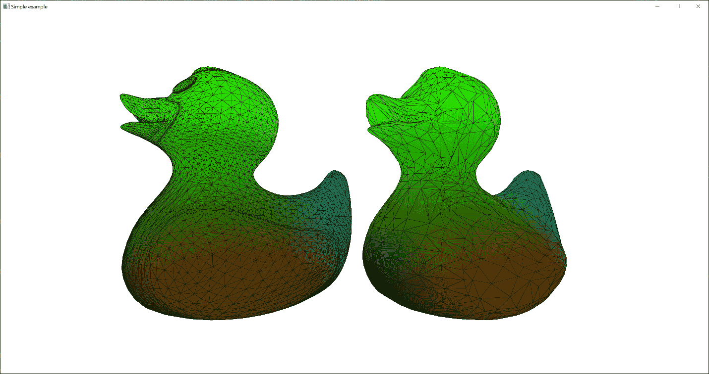
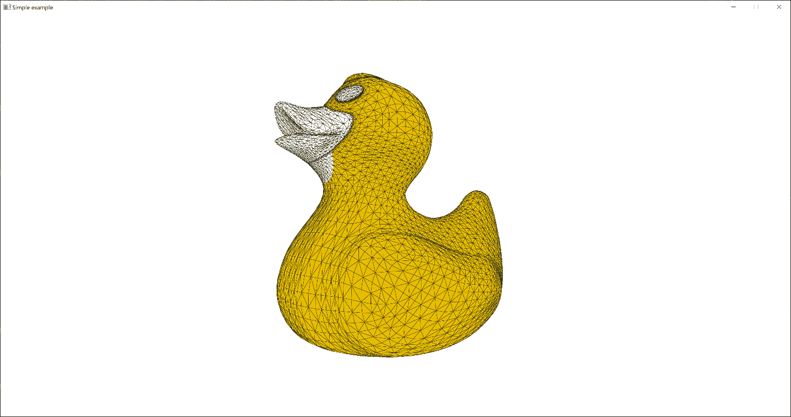
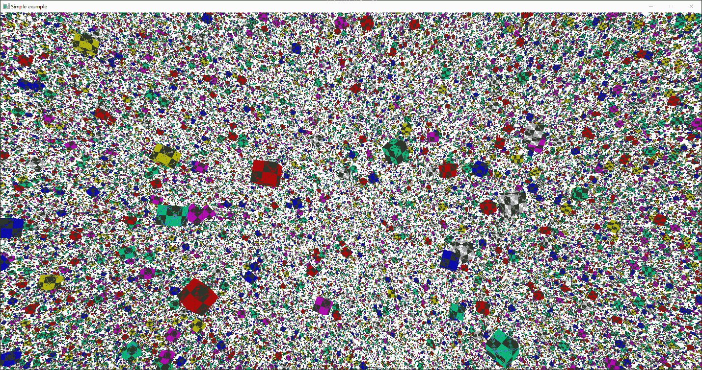
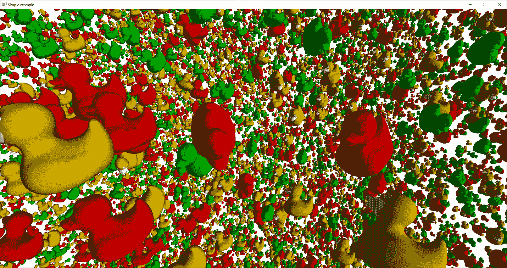
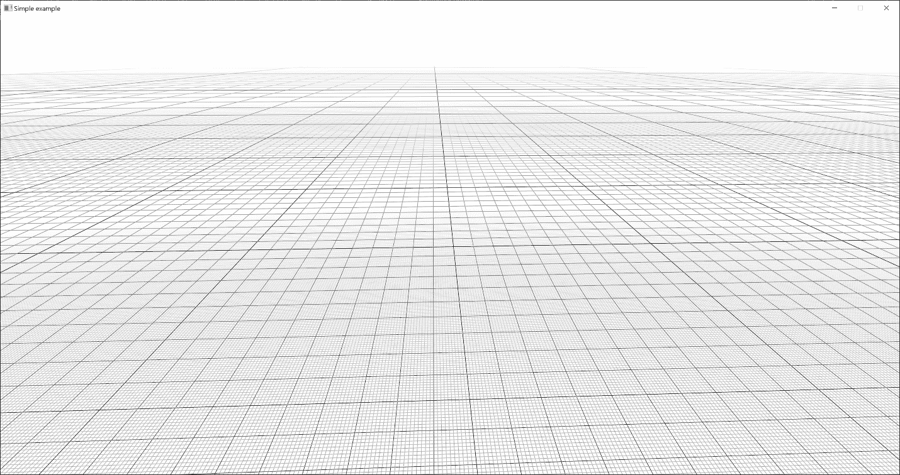
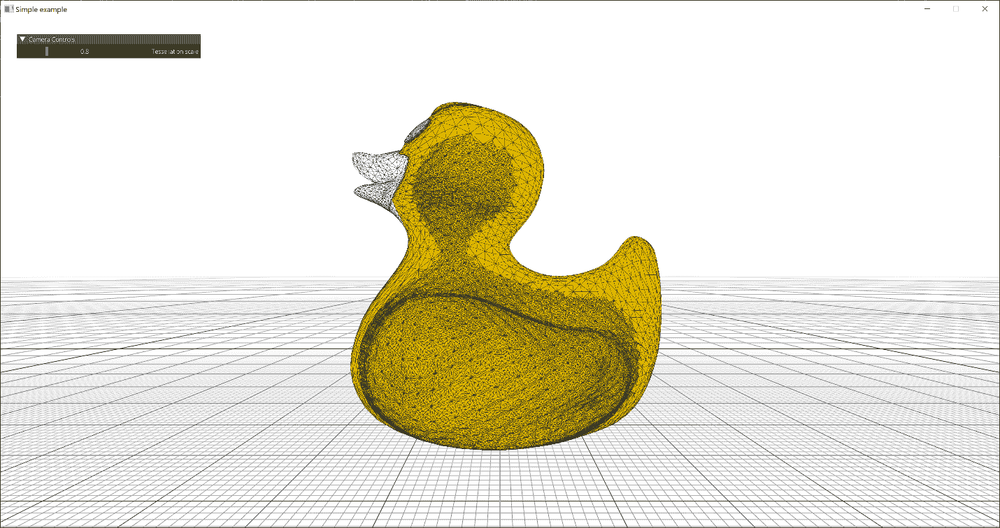
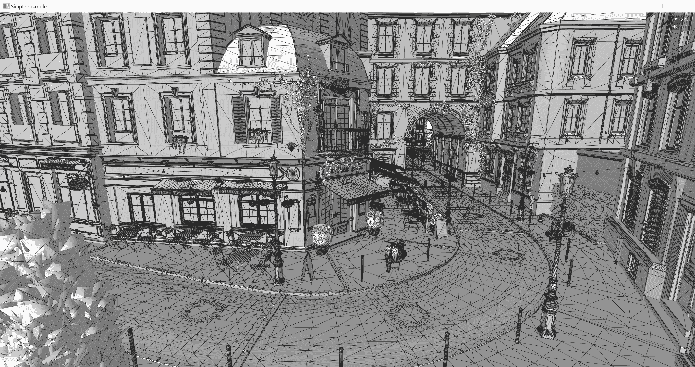
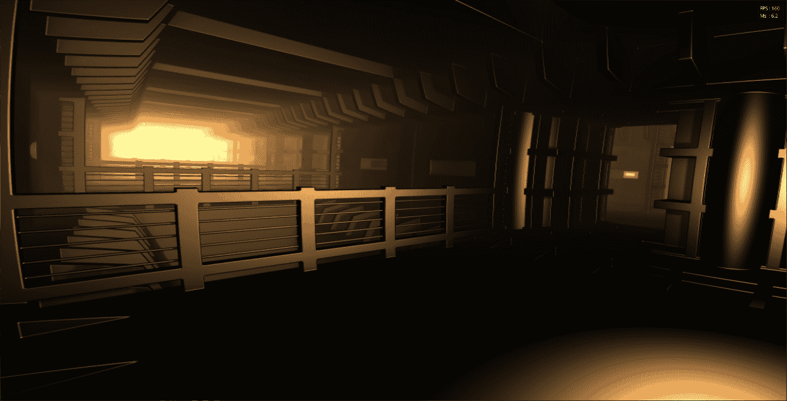
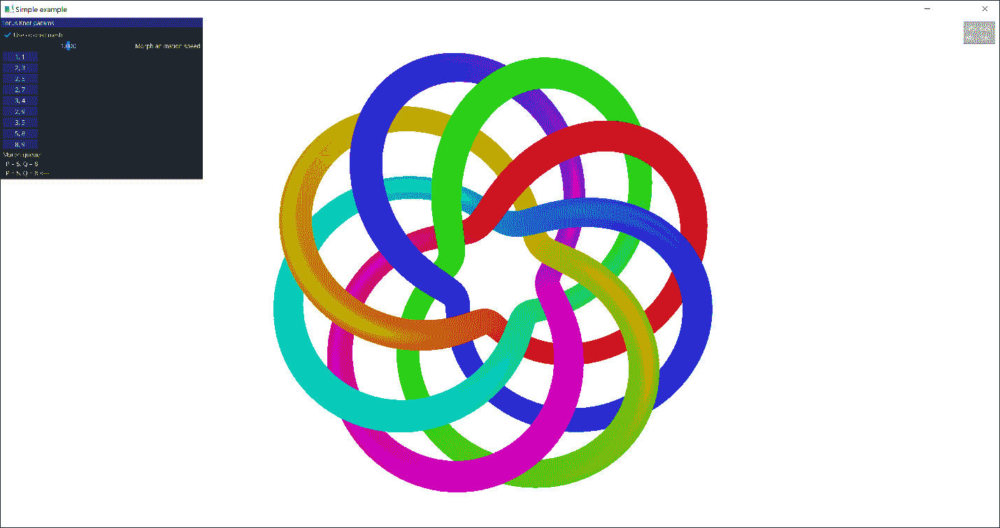

# 5 与几何数据一起工作

## 加入我们的 Discord 书籍社区


[`packt.link/unitydev`](https://packt.link/unitydev)

以前，我们尝试了不同的临时方法来存储和处理我们的图形应用程序中的 3D 几何数据。每个演示应用程序中的网格数据布局（顶点和索引缓冲区）都是硬编码的。这样，我们更容易关注图形管线中的其他重要部分。随着我们进入更复杂的图形应用程序领域，我们需要对系统内存和 GPU 缓冲区中不同 3D 网格的存储有更多的控制。然而，我们的重点仍然是在指导您了解主要原理和实践，而不是纯粹的效率。

在本章中，我们将学习如何以更组织化的方式存储和处理网格几何数据。我们将涵盖以下食谱：

+   使用 MeshOptimizer 生成细节级别网格

+   实现可编程顶点提取

+   渲染实例几何

+   使用计算着色器实现实例网格

+   实现无限网格 GLSL 着色器

+   将细分集成到图形管线中

+   组织网格数据存储

+   实现自动几何转换

+   Vulkan 中的间接渲染

+   使用计算着色器在 Vulkan 中生成纹理

+   实现计算网格

## 技术要求

要在您的 Linux 或 Windows PC 上运行本章的代码，您需要一个支持 Vulkan 1.3 的最新驱动程序的 GPU。源代码可以从 [`github.com/PacktPublishing/3D-Graphics-Rendering-Cookbook`](https://github.com/PacktPublishing/3D-Graphics-Rendering-Cookbook) 下载。

要运行本章的演示应用程序，建议您从 McGuire 计算机图形档案 [`casual-effects.com/data/index.xhtml`](http://casual-effects.com/data/index.xhtml) 下载并解压整个 Amazon Lumberyard Bistro 数据集。您可以通过运行 `deploy_deps.py` 脚本来自动完成此操作。

## 使用 MeshOptimizer 生成细节级别网格

要开始进行几何操作，让我们实现一个使用 MeshOptimizer 库的网格几何简化演示，该库除了网格优化外，还可以生成简化网格，以便我们以后可能想要使用的实时离散 **细节级别**（**LOD**）算法。简化是提高渲染性能的有效方法。

为了使 GPU 高效地渲染网格，顶点缓冲区中的所有顶点都应该是唯一的，没有重复。在任何现代 3D 内容管线中，有效地解决这个问题可能是一个复杂且计算密集的任务。MeshOptimizer 是由 Arseny Kapoulkine 开发的开源 C++ 库，它提供算法来帮助优化网格以适应现代 GPU 顶点和索引处理管线。它可以重新索引现有的索引缓冲区，或者从一个未索引的顶点缓冲区生成一组全新的索引。

让我们学习如何使用 MeshOptimizer 优化和生成简化网格。

### 准备工作

建议您重新阅读*第三章*，*与 Vulkan 对象一起工作*。本菜谱的完整源代码可以在 `Chapter05/01_MeshOptimizer` 中找到。

### 如何做到这一点...

`MeshOptimizer` 可以为指定的索引和顶点集生成所有必要的 LOD 网格。一旦我们使用 `Assimp` 加载了网格，我们就可以将其传递给 `MeshOptimizer`。下面是如何做到这一点：

1.  让我们使用 `Assimp` 从 `.gltf` 文件中加载一个网格。对于这个演示，我们只需要顶点位置和索引：

```cpp
 const aiScene* scene = aiImportFile(
    “data/rubber_duck/scene.gltf”, aiProcess_Triangulate);
  const aiMesh* mesh = scene->mMeshes[0];
  std::vector<vec3> positions;
  std::vector<uint32_t> indices;
  for (unsigned int i = 0; i != mesh->mNumVertices; i++) {
    const aiVector3D v = mesh->mVertices[i];
    positions.push_back(vec3(v.x, v.y, v.z));
  }
  for (unsigned int i = 0; i != mesh->mNumFaces; i++) {
    for (int j = 0; j != 3; j++)
      indices.push_back(mesh->mFaces[i].mIndices[j]);
  }
  aiReleaseImport(scene);
```

1.  LOD 网格表示为索引集合，这些索引从用于原始网格的相同顶点构建一个新的简化网格。这样我们只需要存储一组顶点，并且可以通过切换索引缓冲区数据来渲染相应的 LOD。像之前一样，我们为了简单起见，将所有索引存储为无符号 32 位整数。现在我们应该为现有的顶点和索引数据生成一个重映射表：

```cpp
 std::vector<uint32_t> remap(indices.size());
  const size_t vertexCount =
    meshopt_generateVertexRemap(remap.data(), indices.data(),
      indices.size(), positions.data(), indices.size(), sizeof(vec3));
```

MeshOptimizer 文档([`github.com/zeux/meshoptimizer`](https://github.com/zeux/meshoptimizer))告诉我们以下内容：

> *“…重映射表是根据输入顶点的二进制等价性生成的，因此生成的网格将以相同的方式渲染。”*

1.  返回的 `vertexCount` 值对应于重映射后保留的唯一顶点的数量。让我们分配空间并生成新的顶点和索引缓冲区：

```cpp
 std::vector<uint32_t> remappedIndices(indices.size());
  std::vector<vec3> remappedVertices(vertexCount);
  meshopt_remapIndexBuffer(remappedIndices.data(), indices.data(),
    indices.size(), remap.data());
  meshopt_remapVertexBuffer(remappedVertices.data(), positions.data(),
    positions.size(), sizeof(vec3), remap.data());
```

现在，我们可以使用其他 `MeshOptimizer` 算法进一步优化这些缓冲区。官方文档非常直接。

1.  当我们想要渲染一个网格时，GPU 必须通过顶点着色器转换每个顶点。GPU 可以通过内置的小缓存来重用转换后的顶点，通常在内部存储 16 到 32 个顶点。为了有效地使用这个小缓存，我们需要重新排序三角形以最大化顶点引用的局部性。如何在 `MeshOptimizer` 中实现这一点将在下面展示。请注意，这里只接触到了索引数据：

```cpp
 meshopt_optimizeVertexCache(remappedIndices.data(),
    remappedIndices.data(), indices.size(), vertexCount);
```

1.  转换后的顶点形成三角形，被发送进行光栅化以生成片段。通常，每个片段首先通过深度测试，通过深度测试的片段将执行片段着色器以计算最终颜色。由于片段着色器变得越来越昂贵，减少片段着色器调用的数量变得越来越重要。这可以通过减少网格中的像素过度绘制来实现，并且通常需要使用视图相关算法。然而，`MeshOptimizer` 实现了启发式算法来重新排序三角形并最小化来自各个方向的过度绘制。我们可以如下使用它：

```cpp
 meshopt_optimizeOverdraw(
    remappedIndices.data(), remappedIndices.data(),
    indices.size(), glm::value_ptr(remappedVertices[0]), vertexCount,
    sizeof(vec3), 1.05f);
```

最后一个参数，`1.05`，是确定算法可以妥协顶点缓存命中率的阈值。我们使用文档中推荐的默认值。

1.  一旦我们将网格优化以减少像素过度绘制，顶点缓冲区访问模式仍然可以优化以提高内存效率。GPU 必须从顶点缓冲区获取指定的顶点属性并将这些数据传递到顶点着色器。为了加快此获取过程，使用了一个内存缓存，这意味着优化顶点缓冲区访问的局部性非常重要。我们可以使用 MeshOptimizer 来优化我们的索引和顶点缓冲区以实现顶点获取效率，如下所示：

```cpp
 meshopt_optimizeVertexFetch(
    remappedVertices.data(), remappedIndices.data(), indices.size(),
    remappedVertices.data(), vertexCount, sizeof(vec3));
```

这个函数将重新排序顶点缓冲区中的顶点并重新生成索引以匹配顶点缓冲区的新内容。

1.  在这个配方中，我们将要做的最后一件事是简化网格。MeshOptimizer 可以生成一个新的索引缓冲区，它使用顶点缓冲区中的现有顶点，并减少三角形数量。这个新的索引缓冲区可以用来渲染 LOD 网格。以下代码片段展示了如何使用默认的阈值和目标误差值来完成这个操作：

```cpp
 const float threshold           = 0.2f;
  const size_t target_index_count =
    size_t(remappedIndices.size() * threshold);
  const float target_error        = 0.01f;
  std::vector<uint32_t> indicesLod;
  indicesLod.resize(remappedIndices.size());
  indicesLod.resize(meshopt_simplify(
    &indicesLod[0], remappedIndices.data(), remappedIndices.size(),
    &remappedVertices[0].x, vertexCount, sizeof(vec3),
    target_index_count, target_error));
  indices   = remappedIndices;
  positions = remappedVertices;
```

现在让我们看看 LOD 网格的渲染是如何工作的。

### 它是如何工作的…

为了渲染网格及其低级 LOD，我们需要存储一个顶点缓冲区和两个索引缓冲区——一个用于网格，一个用于 LOD：

1.  这是存储顶点位置的顶点缓冲区：

```cpp
 lvk::Holder<lvk::BufferHandle> vertexBuffer = ctx->createBuffer({
    .usage     = lvk::BufferUsageBits_Vertex,
    .storage   = lvk::StorageType_Device,
    .size      = sizeof(vec3) * positions.size(),
    .data      = positions.data(),
    .debugName = “Buffer: vertex” }, nullptr);
```

1.  我们使用两个索引缓冲区来存储两组索引：

```cpp
 lvk::Holder<lvk::BufferHandle> indexBuffer = ctx->createBuffer({
    .usage     = lvk::BufferUsageBits_Index,
    .storage   = lvk::StorageType_Device,
    .size      = sizeof(uint32_t) * indices.size(),
    .data      = indices.data(),
    .debugName = “Buffer: index” }, nullptr);
  lvk::Holder<lvk::BufferHandle> indexBufferLod = ctx->createBuffer({
    .usage     = lvk::BufferUsageBits_Index,
    .storage   = lvk::StorageType_Device,
    .size      = sizeof(uint32_t) * indicesLod.size(),
    .data      = indicesLod.data(),
    .debugName = “Buffer: index LOD” }, nullptr);
```

1.  渲染部分很简单，为了简洁起见，这里省略了图形管线设置。我们使用第一个索引缓冲区渲染主网格：

```cpp
 buf.cmdBindVertexBuffer(0, vertexBuffer, 0);
  buf.cmdBindRenderPipeline(pipeline);
  buf.cmdBindDepthState(dState);
  buf.cmdPushConstants(p * v1 * m);
  buf.cmdBindIndexBuffer(indexBuffer, lvk::IndexFormat_UI32);
  buf.cmdDrawIndexed(indices.size());
```

1.  然后我们使用第二个索引缓冲区渲染 LOD 网格：

```cpp
 buf.cmdPushConstants(p * v2 * m);
  buf.cmdBindIndexBuffer(indexBufferLod, lvk::IndexFormat_UI32);
  buf.cmdDrawIndexed(indicesLod.size());
```

这里是运行中的演示应用程序的屏幕截图。



图 5.1：具有离散 LOD 的网格

尝试在代码中更改 `threshold` 参数以生成具有不同 LOD 的网格。

### 还有更多...

`MeshOptimizer` 库包含许多其他有用的算法，例如三角形带生成、索引和顶点缓冲区压缩以及网格动画数据压缩。所有这些算法可能对你的几何预处理阶段非常有用，具体取决于你正在编写的图形软件类型。查看官方文档和发布页面，以获取最新的功能，请访问 [`github.com/zeux/meshoptimizer`](https://github.com/zeux/meshoptimizer)。

在 *第九章*，*高级渲染技术和优化* 中，我们将学习如何以 GPU 友好和高效的方式渲染 LOD。

## 实现可编程顶点拉取

**可编程顶点提取**（**PVP**）的概念是在 Daniel Rákos 发表的一篇文章《介绍可编程顶点提取渲染管线》中提出的，这篇文章发表在 2012 年出版的令人惊叹的书籍《OpenGL Insights》中。该文章深入探讨了当时 GPU 的架构以及为什么使用这种数据存储方法是有益的。最初，顶点提取的想法是将顶点数据存储在一维缓冲区纹理中，而不是设置标准的顶点输入绑定。然后在顶点着色器中使用`texelFetch()`和 GLSL `samplerBuffer`读取数据。内置的 OpenGL GLSL `gl_VertexID`变量被用作索引来计算用于纹理提取的纹理坐标。这种技巧的原因是，由于开发者遇到了许多 draw 调用时的 CPU 限制，将多个网格合并到单个缓冲区中并在单个 draw 调用中渲染它们，而不需要重新绑定任何顶点数组或缓冲区对象，这有助于提高 draw 调用的批处理。

现在，缓冲区纹理不再需要，顶点数据可以直接从存储或统一缓冲区中通过内置的 Vulkan GLSL `gl_VertexIndex`变量计算出的偏移量来获取。

这种技术为合并实例化提供了可能性，其中许多小网格可以合并成一个更大的网格，作为同一批次的处理部分。从*第七章*，*图形渲染管线*开始，我们将广泛使用这种技术。

在这个配方中，我们将使用存储缓冲区来实现与 Vulkan 1.3 和*LightweightVK*类似的技巧。

### 准备工作

本配方完整的源代码可以在源代码包中找到，名称为`Chapter05/02_VertexPulling`。

### 如何做到这一点...

让我们渲染之前配方中的橡胶鸭 3D 模型`data/rubber_duck/scene.gltf`。然而，这次，我们不会使用顶点属性，而是将使用可编程顶点提取技术。想法是分配两个缓冲区，一个用于索引，另一个用于存储顶点数据的缓冲区，并在顶点着色器中访问它们以获取顶点位置。这就是我们如何做到这一点：

1.  首先，我们通过`Assimp`加载 3D 模型，就像之前的配方中那样：

```cpp
const aiScene* scene = aiImportFile(
  “data/rubber_duck/scene.gltf”, aiProcess_Triangulate);
const aiMesh* mesh = scene->mMeshes[0];
```

1.  将每顶点数据转换为适合我们 GLSL 着色器的格式。我们将使用`vec3`表示位置和`vec2`表示纹理坐标：

```cpp
struct Vertex {
  vec3 pos;
  vec2 uv;
};
std::vector<Vertex> positions;
for (unsigned int i = 0; i != mesh->mNumVertices; i++) {
  const aiVector3D v = mesh->mVertices[i];
  const aiVector3D t = mesh->mTextureCoords[0][i];
  positions.push_back({
   .pos = vec3(v.x, v.y, v.z), .uv = vec2(t.x, t.y) });
}
```

1.  为了简单起见，我们将索引存储为无符号 32 位整数。在实际应用中，考虑使用 16 位索引来处理小网格，并能够在这两者之间切换：

```cpp
std::vector<uint32_t> indices;
for (unsigned int i = 0; i != mesh->mNumFaces; i++) {
  for (int j = 0; j != 3; j++)
    indices.push_back(mesh->mFaces[i].mIndices[j]);
}
aiReleaseImport(scene);
```

1.  一旦索引和顶点数据准备就绪，我们就可以将它们上传到 Vulkan 缓冲区。我们应该创建两个缓冲区，一个用于顶点，一个用于索引。注意，在这里，尽管称之为顶点缓冲区，但我们设置了使用标志为`lvk::BufferUsageBits_Storage`：

```cpp
lvk::Holder<lvk::BufferHandle> vertexBuffer = ctx->createBuffer({
  .usage     = lvk::BufferUsageBits_Storage,
  .storage   = lvk::StorageType_Device,
  .size      = sizeof(Vertex) * positions.size(),
  .data      = positions.data(),
  .debugName = “Buffer: vertex” }, nullptr);
lvk::Holder<lvk::BufferHandle> indexBuffer = ctx->createBuffer({
  .usage     = lvk::BufferUsageBits_Index,
  .storage   = lvk::StorageType_Device,
  .size      = sizeof(uint32_t) * indices.size(),
  .data      = indices.data(),
  .debugName = “Buffer: index” }, nullptr);
```

1.  现在我们可以为我们的网格创建一个渲染管线。我们将在几分钟后查看着色器代码：

```cpp
lvk::Holder<lvk::ShaderModuleHandle> vert =
  loadShaderModule(ctx, “Chapter05/02_VertexPulling/src/main.vert”);
lvk::Holder<lvk::ShaderModuleHandle> geom =
  loadShaderModule(ctx, “Chapter05/02_VertexPulling/src/main.geom”);
lvk::Holder<lvk::ShaderModuleHandle> frag =
  loadShaderModule(ctx, “Chapter05/02_VertexPulling/src/main.frag”);
lvk::Holder<lvk::RenderPipelineHandle> pipelineSolid =
  ctx->createRenderPipeline({
        .smVert      = vert,
        .smGeom      = geom,
        .smFrag      = frag,
        .color       = { { .format = ctx->getSwapchainFormat() } },
        .depthFormat = app.getDepthFormat(),
        .cullMode    = lvk::CullMode_Back,
    });
```

1.  让我们为我们的网格加载一个纹理并创建适当的深度状态：

```cpp
lvk::Holder<lvk::TextureHandle> texture =
  loadTexture(ctx, “data/rubber_duck/textures/Duck_baseColor.png”);
const lvk::DepthState dState =
  { .compareOp = lvk::CompareOp_Less, .isDepthWriteEnabled = true };
```

1.  在我们进行实际渲染之前，我们应该将纹理 ID 和存储缓冲区地址传递给我们的 GLSL 着色器。我们可以使用 Vulkan 推送常量来完成此操作。模型视图投影矩阵的计算是从之前的配方中复用的。

```cpp
const struct PushConstants {
  mat4 mvp;
  uint64_t vertices;
  uint32_t texture;
} pc {
  .mvp      = p * v * m,
  .vertices = ctx->gpuAddress(vertexBuffer),
  .texture  = texture.index(),
};
lvk::ICommandBuffer& buf = ctx->acquireCommandBuffer();
buf.cmdBeginRendering(renderPass, framebuffer);
buf.cmdPushConstants(pc);
```

1.  现在，网格渲染可以按照以下方式进行。

```cpp
buf.cmdBindIndexBuffer(indexBuffer, lvk::IndexFormat_UI32);
buf.cmdBindRenderPipeline(pipelineSolid);
buf.cmdBindDepthState(dState);
buf.cmdDrawIndexed(indices.size());
buf.cmdEndRendering();
```

其余的 C++代码可以在`Chapter05/02_VertexPulling/src/main.cpp`中找到。现在，我们必须查看 GLSL 顶点着色器，以了解如何从缓冲区中读取顶点数据。顶点着色器位于`Chapter05/02_VertexPulling/src/main.vert`：

1.  首先，我们有一些在所有着色器之间共享的声明。这样做的原因是我们的片段着色器需要访问推送常量以检索纹理 ID。请注意，`Vertex`结构不使用`vec2`和`vec3`成员字段来保持紧密填充并防止任何 GPU 对齐问题。这个结构反映了我们的 C++代码如何将顶点数据写入缓冲区。该缓冲区包含一个无界数组`in_Vertices[]`。每个元素正好对应一个顶点。

```cpp
struct Vertex {
  float x, y, z;
  float u, v;
};
layout(std430, buffer_reference) readonly buffer Vertices {
  Vertex in_Vertices[];
};
layout(push_constant) uniform PerFrameData {
  mat4 MVP;
  Vertices vtx;
  uint texture;
};
```

1.  让我们引入两个访问器函数，使着色器代码更易于阅读。组装`vec3`和`vec2`值来自存储缓冲区中的原始浮点值。

```cpp
vec3 getPosition(int i) {
  return vec3(vtx.in_Vertices[i].x,
              vtx.in_Vertices[i].y,
              vtx.in_Vertices[i].z);
}
vec2 getTexCoord(int i) {
  return vec2(vtx.in_Vertices[i].u,
              vtx.in_Vertices[i].v);
}
```

1.  剩余的着色器部分很简单。之前提到的函数用于加载顶点位置和纹理坐标，这些坐标随后被传递到图形管线中。

```cpp
layout (location=0) out vec2 uv;
void main() {
  gl_Position = MVP * vec4(getPosition(gl_VertexIndex), 1.0);
  uv = getTexCoord(gl_VertexIndex);
}
```

PVP 部分的介绍就到这里。片段着色器应用纹理，并使用前一章中描述的加权坐标技巧进行线框渲染。程序输出的结果应该看起来像以下截图：



图 5.2：使用 PVP 进行纹理网格渲染

### 还有更多...

PVP 是一个复杂的话题，并且有不同的性能影响。有一个开源项目对 PVP 性能进行了深入分析，并基于不同的顶点数据布局和访问方法，如将数据存储为结构数组或数组结构，以多个浮点数或单个向量类型读取数据等，进行了运行时度量。您可以在[`github.com/nlguillemot/ProgrammablePulling`](https://github.com/nlguillemot/ProgrammablePulling)查看它。当您在设计应用程序中的 PVP 管线时，它应该成为您的首选工具之一。

## 渲染实例化几何体

几何渲染中的一项常见任务是绘制多个具有相同几何形状但具有不同变换和材质的网格。这可能导致生成所有必要命令以指导 GPU 单独绘制每个网格的 CPU 开销增加。尽管 Vulkan API 已经具有显著较低的 CPU 开销，但这种情况仍然会发生。现代图形 API（如 Vulkan）提供的一个可能的解决方案是实例渲染。API 绘制命令可以接受多个实例作为参数，顶点着色器可以访问当前的实例编号`gl_InstanceIndex`。结合前一个配方中演示的 PVP 方法，这种技术可以变得非常灵活。实际上，`gl_InstanceIndex`可以用来从缓冲区中读取所有必要的材质属性、变换和其他数据。让我们看看一个基本的实例几何演示，以了解如何在 Vulkan 中实现它。

### 准备工作

确保阅读之前的配方，*实现可编程顶点提取*，以了解在顶点着色器内部生成顶点数据的概念。这个配方的源代码可以在`Chapter05/03_MillionCubes`中找到。

### 如何实现...

为了演示实例渲染如何工作，让我们渲染一百万个带有颜色的旋转立方体。每个立方体都应该围绕其对角线有一个独特的旋转角度，并且应该用几种不同颜色之一进行纹理覆盖。让我们看看`03_MillionCubes/src/main.cpp`中的 C++代码：

1.  首先，让我们为我们的立方体生成一个程序纹理。一个异或模式纹理看起来相当有趣。它是通过异或当前纹理单元的`x`和`y`坐标，然后将结果通过位移应用到所有三个 BGR 通道中生成的。

```cpp
const uint32_t texWidth  = 256;
const uint32_t texHeight = 256;
std::vector<uint32_t> pixels(texWidth * texHeight);
for (uint32_t y = 0; y != texHeight; y++)
  for (uint32_t x = 0; x != texWidth; x++)
    pixels[y * texWidth + x] =
      0xFF000000 + ((x^y) << 16) + ((x^y) << 8) + (x^y);
lvk::Holder<lvk::TextureHandle> texture = ctx->createTexture({
   .type       = lvk::TextureType_2D,
   .format     = lvk::Format_BGRA_UN8,
   .dimensions = {texWidth, texHeight},
   .usage      = lvk::TextureUsageBits_Sampled,
   .data       = pixels.data(),
   .debugName  = “XOR pattern”,
});
```

1.  让我们为 100 万个立方体创建`vec3`位置和`float`初始旋转角度。我们可以将这些数据组织到`vec4`容器中，并将它们存储在一个不可变存储缓冲区中。然后 GLSL 着色器代码将根据经过的时间进行计算。

```cpp
const uint32_t kNumCubes = 1024 * 1024;
std::vector<vec4> centers(kNumCubes);
for (vec4& p : centers)
  p = vec4(glm::linearRand(-vec3(500.0f), +vec3(500.0f)),
           glm::linearRand(0.0f, 3.14159f));
lvk::Holder<lvk::BufferHandle> bufferPosAngle = ctx->createBuffer({
  .usage   = lvk::BufferUsageBits_Storage,
  .storage = lvk::StorageType_Device,
  .size    = sizeof(vec4) * kNumCubes,
  .data    = centers.data(),
});
```

1.  我们跳过了传统的帧缓冲区和管线创建代码，直接进入主渲染循环。摄像机运动是硬编码的，所以它会通过立方体的群移动来来回回。

```cpp
buf.cmdBeginRendering(renderPass, framebuffer);
const mat4 view = translate(mat4(1.0f),
  vec3(0.0f, 0.0f,
       -1000.0f + 500.0f * (1.0f - cos(-glfwGetTime() * 0.5f))));
```

1.  我们使用推送常数将所有必要的数据传递给着色器。我们的顶点着色器将需要当前时间来根据初始立方体位置和旋转进行计算。

```cpp
const struct {
  mat4 viewproj;
  uint32_t textureId;
  uint64_t bufferPosAngle;
  float time;
} pc {
  .viewproj       = proj * view,
  .textureId      = texture.index(),
  .bufferPosAngle = ctx->gpuAddress(bufferPosAngle),
  .time           = (float)glfwGetTime(),
};
```

1.  渲染是通过`vkCmdDraw()`开始的，它隐藏在`cmdDraw()`中。第一个参数是我们需要生成一个立方体所使用的三角形原语的数量。我们稍后会看看它在顶点着色器中的处理方式。第二个参数`kNumCubes`是要渲染的实例数量。

```cpp
buf.cmdPushConstants(pc);
buf.cmdBindRenderPipeline(pipelineSolid);
buf.cmdBindDepthState(dState);
buf.cmdDraw(36, kNumCubes);
buf.cmdEndRendering();
```

现在，让我们看看 GLSL 代码，以了解这个实例演示在底层是如何工作的。

### 它是如何工作的...

1.  我们的顶点着色器首先声明与上面提到的 C++代码中相同的 `PerFrameData` 结构。着色器输出每个顶点的颜色和纹理坐标。存储缓冲区包含所有立方体的位置和初始角度。

```cpp
layout(push_constant) uniform PerFrameData {
  mat4 viewproj;
  uint textureId;
  uvec2 bufId;
  float time;
};
layout (location=0) out vec3 color;
layout (location=1) out vec2 uv;
layout(std430, buffer_reference) readonly buffer Positions {
  vec4 pos[]; // pos, initialAngle
};
```

1.  如您可能已经注意到的，*如何做…* 部分的 C++代码没有向着色器提供任何索引数据。相反，我们将在顶点着色器中生成顶点数据。让我们在这里声明索引映射。我们需要索引来使用三角形构造 `6` 个立方体面。每个面两个三角形给出每个面的 `6` 个点，总共 `36` 个索引。这是传递给 `vkCmdDraw()` 的索引数。

```cpp
const int indices[36] = int36;
```

1.  这里是我们立方体的每个实例的颜色。

```cpp
const vec3 colors[7] = vec37,
  vec3(0.0, 1.0, 0.0),
  vec3(0.0, 0.0, 1.0),
  vec3(1.0, 1.0, 0.0),
  vec3(0.0, 1.0, 1.0),
  vec3(1.0, 0.0, 1.0),
  vec3(1.0, 1.0, 1.0));
```

1.  由于没有传递给顶点着色器的平移和旋转矩阵，我们不得不在这里自己生成一切。这是一个 GLSL 函数，用于将向量 `v` 的平移应用于当前变换 `m`。这个函数是 C++函数 `glm::translate()` 的对应物。

```cpp
mat4 translate(mat4 m, vec3 v) {
  mat4 Result = m;
  Result[3] = m[0] * v[0] + m[1] * v[1] + m[2] * v[2] + m[3];
  return Result;
}
```

1.  旋转以类似的方式处理。这是将 `glm::rotate()` 端口到 GLSL 的类似物。

```cpp
mat4 rotate(mat4 m, float angle, vec3 v) {
  float a = angle;
  float c = cos(a);
  float s = sin(a);
  vec3 axis = normalize(v);
  vec3 temp = (float(1.0) - c) * axis;
  mat4 r;
  r[0][0] = c + temp[0] * axis[0];
  r[0][1] = temp[0] * axis[1] + s * axis[2];
  r[0][2] = temp[0] * axis[2] - s * axis[1];
  r[1][0] = temp[1] * axis[0] - s * axis[2];
  r[1][1] = c + temp[1] * axis[1];
  r[1][2] = temp[1] * axis[2] + s * axis[0];
  r[2][0] = temp[2] * axis[0] + s * axis[1];
  r[2][1] = temp[2] * axis[1] - s * axis[0];
  r[2][2] = c + temp[2] * axis[2];
  mat4 res;
  res[0] = m[0] * r[0][0] + m[1] * r[0][1] + m[2] * r[0][2];
  res[1] = m[0] * r[1][0] + m[1] * r[1][1] + m[2] * r[1][2];
  res[2] = m[0] * r[2][0] + m[1] * r[2][1] + m[2] * r[2][2];
  res[3] = m[3];
  return res;
}
```

1.  现在我们有了这个广泛的工具集，我们可以编写顶点着色器的 `main()` 函数。内置的 `gl_InstanceIndex` 变量用于索引存储缓冲区并检索位置和角度。然后，使用 `rotate()` 和 `translate()` 辅助函数计算当前立方体的模型矩阵。

```cpp
void main() {
  vec4 center = Positions(bufId).pos[gl_InstanceIndex];
  mat4 model = rotate(translate(mat4(1.0f), center.xyz),
                 time + center.w, vec3(1.0f, 1.0f, 1.0f));
```

1.  内置的 `gl_VertexIndex` 变量从 `0` 到 `35`，帮助我们提取出我们顶点的特定索引。然后我们使用这个简单的二进制公式为这 `8` 个顶点中的每一个生成 `vec3` 位置。

```cpp
 uint idx = indices[gl_VertexIndex];
  vec3 xyz = vec3(idx & 1, (idx & 4) >> 2, (idx & 2) >> 1);
```

1.  将 `0...1` 的顶点坐标重新映射到 `-1…+1` 的坐标，并按所需的 `边长` 缩放：

```cpp
 const float edge = 1.0;
  gl_Position =
    viewproj * model * vec4(edge * (xyz - vec3(0.5)), 1.0);
```

1.  UV 坐标是按面选择的，颜色是按实例分配的：

```cpp
 int face = gl_VertexIndex / 6;
  if (face == 0 || face == 3) uv = vec2(xyz.x, xyz.z);
  if (face == 1 || face == 4) uv = vec2(xyz.x, xyz.y);
  if (face == 2 || face == 5) uv = vec2(xyz.y, xyz.z);
  color = colors[gl_InstanceIndex % 7];
}
```

1.  顶点着色器中发生的所有魔法就这些。片段着色器相当简单且简短：

```cpp
layout (location=0) in vec3 color;
layout (location=1) in vec2 uv;
layout (location=0) out vec4 out_FragColor;
layout(push_constant) uniform PerFrameData {
  mat4 proj;
  uint textureId;
};
void main() {
  out_FragColor = textureBindless2D(
    textureId, 0, uv) * vec4(color, 1.0);
}
```

运行中的演示应该看起来如下截图所示。你正在飞越一百万个立方体的群体：



图 5.3：使用实例渲染的一百万个立方体

### 还有更多...

虽然这个例子是自包含的，并且与非实例渲染相比非常快，但如果将索引移出顶点着色器并存储在专用索引缓冲区中，以利用硬件顶点缓存，并且模型矩阵是按实例而不是按顶点计算的，它还可以更快。我们将在下一个菜谱中介绍这一点。

现在我们将这个实例化示例扩展得更进一步，并使用真实的网格数据绘制一些网格。

## 使用计算着色器实现实例网格

在上一个食谱中，我们学习了实例渲染的基础知识。尽管那种方法涵盖了渲染几何体实例的各个方面，例如处理模型矩阵和材质，但这还不是一种实用的实现。让我们扩展这个例子，并演示如何渲染从`.gltf`文件加载的实例网格。

为了给这个例子增加一点复杂性，我们将通过使用计算着色器预先计算每个实例的模型矩阵来增强它。

### 准备工作

确保你已经阅读了之前的食谱，*渲染实例几何体*。这个食谱的源代码可以在`Chapter05/04_InstancedMeshes`中找到。

### 如何操作...

让我们快速浏览一下 C++代码，以了解整体情况。

1.  首先，我们为我们的网格生成随机位置和初始旋转角度。我们使用 32,000 个网格，因为我们的 GPU 无法处理使用这种原始的暴力方法处理一百万个网格。将其推至一百万个网格是可能的，我们将在*第十一章*，*高级渲染技术和优化*中展示一些接近这个数字的技巧。

```cpp
const uint32_t kNumMeshes = 32 * 1024;
std::vector<vec4> centers(kNumMeshes);
for (vec4& p : centers)
   p = vec4(glm::linearRand(-vec3(500.0f), +vec3(500.0f)),
            glm::linearRand(0.0f, 3.14159f));
```

1.  中心点和角度以与上一个食谱完全相同的方式加载到存储缓冲区中：

```cpp
lvk::Holder<lvk::BufferHandle> bufferPosAngle   = ctx->createBuffer({
  .usage     = lvk::BufferUsageBits_Storage,
  .storage   = lvk::StorageType_Device,
  .size      = sizeof(vec4) * kNumMeshes,
  .data      = centers.data(),
  .debugName = “Buffer: angles & positions”,
});
```

1.  为了存储我们实例的模型矩阵，我们需要两个缓冲区。在偶数帧和奇数帧之间，我们将以轮询的方式交替使用它们，以防止不必要的同步。

```cpp
lvk::Holder<lvk::BufferHandle> bufferMatrices[] = {
  ctx->createBuffer({ .usage     = lvk::BufferUsageBits_Storage,
                      .storage   = lvk::StorageType_Device,
                      .size      = sizeof(mat4) * kNumMeshes,
                      .debugName = “Buffer: matrices 1” }),
  ctx->createBuffer({ .usage     = lvk::BufferUsageBits_Storage,
                      .storage   = lvk::StorageType_Device,
                      .size      = sizeof(mat4) * kNumMeshes,
                      .debugName = “Buffer: matrices 2” }),
};.
```

1.  橡皮鸭 3D 模型以下列方式从`.gltf`加载。这次，除了顶点位置和纹理坐标外，我们还需要法向量来进行一些即兴的照明。当我们渲染这么多网格时，我们将需要它。

```cpp
const aiScene* scene =
  aiImportFile(“data/rubber_duck/scene.gltf”, aiProcess_Triangulate);
struct Vertex {
  vec3 pos;
  vec2 uv;
  vec3 n;
};
const aiMesh* mesh = scene->mMeshes[0];
std::vector<Vertex> vertices;
std::vector<uint32_t> indices;
for (unsigned int i = 0; i != mesh->mNumVertices; i++) {
  const aiVector3D v = mesh->mVertices[i];
  const aiVector3D t = mesh->mTextureCoords[0][i];
  const aiVector3D n = mesh->mNormals[i];
  vertices.push_back({ .pos = vec3(v.x, v.y, v.z),
                       .uv  = vec2(t.x, t.y),
                       .n   = vec3(n.x, n.y, n.z) });
}
for (unsigned int i = 0; i != mesh->mNumFaces; i++)
  for (int j = 0; j != 3; j++)
    indices.push_back(mesh->mFaces[i].mIndices[j]);
aiReleaseImport(scene);
```

1.  网格数据被上传到索引和顶点缓冲区：

```cpp
lvk::Holder<lvk::BufferHandle> vertexBuffer = ctx->createBuffer({
  .usage     = lvk::BufferUsageBits_Storage,
  .storage   = lvk::StorageType_Device,
  .size      = sizeof(Vertex) * vertices.size(),
  .data      = vertices.data(),
  .debugName = “Buffer: vertex” }, nullptr);
lvk::Holder<lvk::BufferHandle> indexBuffer = ctx->createBuffer({
  .usage     = lvk::BufferUsageBits_Index,
  .storage   = lvk::StorageType_Device,
  .size      = sizeof(uint32_t) * indices.size(),
  .data      = indices.data(),
  .debugName = “Buffer: index” }, nullptr);
```

1.  让我们加载纹理并创建计算和渲染管线。计算着色器将根据已过时间生成我们实例的模型矩阵，遵循在之前食谱*渲染实例网格*中使用的顶点着色器的方法。然而，这次，我们将基于每个实例而不是每个顶点来执行。

```cpp
lvk::Holder<lvk::TextureHandle> texture =
  loadTexture(ctx, “data/rubber_duck/textures/Duck_baseColor.png”);
lvk::Holder<lvk::ShaderModuleHandle> comp =
  loadShaderModule(ctx, “Chapter05/04_InstancedMeshes/src/main.comp”);
lvk::Holder<lvk::ComputePipelineHandle> pipelineComputeMatrices =
  ctx->createComputePipeline({ smComp = comp });
lvk::Holder<lvk::ShaderModuleHandle> vert =
  loadShaderModule(ctx, “Chapter05/04_InstancedMeshes/src/main.vert”);
lvk::Holder<lvk::ShaderModuleHandle> frag =
  loadShaderModule(ctx, “Chapter05/04_InstancedMeshes/src/main.frag”);
lvk::Holder<lvk::RenderPipelineHandle> pipelineSolid =
  ctx->createRenderPipeline({
    .smVert      = vert,
    .smFrag      = frag,
    .color       = { { .format = ctx->getSwapchainFormat() } },
    .depthFormat = app.getDepthFormat(),
    .cullMode    = lvk::CullMode_Back });
```

1.  主循环是这样的。我们使用`frameId`计数器来促进在偶数帧和奇数帧之间切换包含模型矩阵的缓冲区。

```cpp
uint32_t frameId = 0;
app.run(& {
  const mat4 proj =
    glm::perspective(45.0f, aspectRatio, 0.2f, 1500.0f);
  const lvk::RenderPass renderPass = {
    .color = { { .loadOp = lvk::LoadOp_Clear,
                .clearColor = { 1.0f, 1.0f, 1.0f, 1.0f } } },
    .depth = { .loadOp = lvk::LoadOp_Clear, .clearDepth = 1.0f }
  };
  const lvk::Framebuffer framebuffer = {
    .color = { { .texture = ctx->getCurrentSwapchainTexture() } },
    .depthStencil = { .texture = app.getDepthTexture() },
  };
  lvk::ICommandBuffer& buf = ctx->acquireCommandBuffer();
```

1.  为了方便起见，推送常数在计算和渲染管线之间共享：

```cpp
 const mat4 view = translate(mat4(1.0f), vec3(0.0f, 0.0f,
    -1000.0f + 500.0f * (1.0f - cos(-glfwGetTime() * 0.5f))));
  const struct {
    mat4 viewproj;
    uint32_t textureId;
    uint64_t bufferPosAngle;
    uint64_t bufferMatrices;
    uint64_t bufferVertices;
    float time;
  } pc {
    .viewproj       = proj * view,
    .textureId      = texture.index(),
    .bufferPosAngle = ctx->gpuAddress(bufferPosAngle),
    .bufferMatrices = ctx->gpuAddress(bufferMatrices[frameId]),
    .bufferVertices = ctx->gpuAddress(vertexBuffer),
    .time           = (float)glfwGetTime(),
  };
  buf.cmdPushConstants(pc);
```

1.  分发计算着色器。每个本地工作组处理 32 个网格——许多 GPU 支持的常见便携式基线：

```cpp
 buf.cmdBindComputePipeline(pipelineComputeMatrices);
  buf.cmdDispatchThreadGroups({ .width = kNumMeshes / 32 } });
```

1.  计算着色器完成更新模型矩阵后，我们可以开始渲染。请注意，这里有一个非空的依赖参数，它指的是包含模型矩阵的缓冲区。这是必要的，以确保*LightweightVK*发出适当的 Vulkan 缓冲区内存屏障，以防止计算着色器和顶点着色器之间的竞态条件。

```cpp
 buf.cmdBeginRendering(renderPass, framebuffer,
    { .buffers = { lvk::BufferHandle(bufferMatrices[frameId]) } });
```

现在，让我们看看屏障。源和目标阶段分别是：

```cpp
VK_PIPELINE_STAGE_COMPUTE_SHADER_BIT
```

并且：

```cpp
VK_PIPELINE_STAGE_VERTEX_SHADER_BIT | VK_PIPELINE_STAGE_FRAGMENT_SHADER_BIT
```

基础的 Vulkan 屏障如下所示：

```cpp
void lvk::CommandBuffer::bufferBarrier(BufferHandle handle,
  VkPipelineStageFlags srcStage, VkPipelineStageFlags dstStage)
{
  lvk::VulkanBuffer* buf = ctx_->buffersPool_.get(handle);
  const VkBufferMemoryBarrier barrier = {
    .sType = VK_STRUCTURE_TYPE_BUFFER_MEMORY_BARRIER,
    .srcAccessMask = VK_ACCESS_SHADER_READ_BIT |
                     VK_ACCESS_SHADER_WRITE_BIT,
    .dstAccessMask = VK_ACCESS_SHADER_READ_BIT |
                     VK_ACCESS_SHADER_WRITE_BIT,
    .srcQueueFamilyIndex = VK_QUEUE_FAMILY_IGNORED,
    .dstQueueFamilyIndex = VK_QUEUE_FAMILY_IGNORED,
    .buffer = buf->vkBuffer_,
    .offset = 0,
    .size = VK_WHOLE_SIZE,
  };
  vkCmdPipelineBarrier(wrapper_->cmdBuf_, srcStage, dstStage,
    VkDependencyFlags{}, 0, nullptr, 1, &barrier, 0, nullptr);
}
```

1.  渲染代码的其余部分相当标准。*LightweightVK* 绘制调用命令 `cmdDrawIndexed()` 接收我们网格中的索引数量和实例数量 `kNumMeshes`。

```cpp
 buf.cmdBindRenderPipeline(pipelineSolid);
  buf.cmdBindDepthState({
    .compareOp = lvk::CompareOp_Less, .isDepthWriteEnabled = true });
  buf.cmdBindIndexBuffer(indexBuffer, lvk::IndexFormat_UI32);
  buf.cmdDrawIndexed(indices.size(), kNumMeshes);
  buf.cmdEndRendering();
  ctx->submit(buf, ctx->getCurrentSwapchainTexture());
  frameId = (frameId + 1) & 1;
});
```

现在，让我们深入了解 GLSL 的实现细节，以了解其内部工作原理。

### 它是如何工作的…

第一部分是计算着色器，它为渲染准备数据。让我们看看 `Chapter05/04_InstancedMeshes/src/main.comp`：

1.  计算着色器在一个局部工作组中处理 32 个网格。常量推送在计算着色器和图形管线之间共享。它们在包含文件 `Chapter05/04_InstancedMeshes/src/common.sp` 中声明。我们在此提供该文件以供您方便使用：

```cpp
layout(local_size_x = 32, local_size_y = 1, local_size_z = 1) in;
// included from <Chapter05/04_InstancedMeshes/src/common.sp>
layout(push_constant) uniform PerFrameData {
  mat4 viewproj;
  uint textureId;
  uvec2 bufPosAngleId;
  uvec2 bufMatricesId;
  uvec2 bufVerticesId;
  float time;
};
layout(std430, buffer_reference) readonly buffer Positions {
  vec4 pos[]; // pos, initialAngle
};
// end of #include
```

1.  矩阵缓冲区引用声明不共享。在这里，在计算着色器中，它被声明为 `writeonly`，而顶点着色器将声明为 `readonly`。

```cpp
layout(std430, buffer_reference) writeonly buffer Matrices {
  mat4 mtx[];
};
```

1.  辅助函数 `translate()` 和 `rotate()` 模仿 GLSL 中的 `glm::translate()` 和 `glm::rotate()` C++ 函数。它们从先前的菜谱 *Rendering instanced geometry* 完整地重用。由于它们相当长，我们在此不会重复它们。

```cpp
mat4 translate(mat4 m, vec3 v);
mat4 rotate(mat4 m, float angle, vec3 v);
```

1.  `main()` 函数读取包含中心点和初始角度的 `vec4` 值，并计算模型矩阵。这正是我们在先前的菜谱中顶点着色器中做的相同计算。然后，模型矩阵存储在由 `bufMatricesId` 引用的存储缓冲区中。

```cpp
void main() {
  uint idx = gl_GlobalInvocationID.x;
  vec4 center = Positions(bufPosAngleId).pos[idx];
  mat4 model = rotate(translate(mat4(1.0f),
    center.xyz), time + center.w, vec3(1.0f, 1.0f, 1.0f));
  Matrices(bufMatricesId).mtx[idx] = model;
}
```

由于我们将大部分计算移动到了计算着色器中，渲染管线的着色器变得显著更短。

1.  顶点着色器使用相同的共享声明用于常量推送和缓冲区引用：

```cpp
#include <Chapter05/04_InstancedMeshes/src/common.sp>
layout (location=0) out vec2 uv;
layout (location=1) out vec3 normal;
layout (location=2) out vec3 color;
layout(std430, buffer_reference) readonly buffer Matrices {
  mat4 mtx[];
};
```

1.  顶点数据包含法向量，正如在前面菜谱中用 C++ 代码声明的：

```cpp
struct Vertex {
  float x, y, z;
  float u, v;
  float nx, ny, nz;
};
layout(std430, buffer_reference) readonly buffer Vertices {
  Vertex in_Vertices[];
};
```

1.  顶点数据从“vertex”存储缓冲区检索，模型矩阵从矩阵缓冲区获得，该缓冲区由计算着色器更新：

```cpp
const vec3 colors[3] = vec33,
                               vec3(0.0, 1.0, 0.0),
                               vec3(1.0, 1.0, 1.0));
void main() {
  Vertex vtx = Vertices(bufVerticesId).in_Vertices[gl_VertexIndex];
  mat4 model = Matrices(bufMatricesId).mtx[gl_InstanceIndex];
```

1.  现在我们可以计算 `gl_Position` 的值，并将法向量和纹理坐标传递给我们的片段着色器：

```cpp
 const float scale = 10.0;
  gl_Position = viewproj * model *
    vec4(scale * vtx.x, scale * vtx.y, scale * vtx.z, 1.0);
  mat3 normalMatrix = transpose( inverse(mat3(model)) );
  uv = vec2(vtx.u, vtx.v);
  normal = normalMatrix * vec3(vtx.nx, vtx.ny, vtx.nz);
  color = colors[gl_InstanceIndex % 3];
}
```

1.  片段着色器相当直接。我们执行一些即兴的漫反射光照计算，以增强网格的区分度：

```cpp
layout (location=0) in vec2 uv;
layout (location=1) in vec3 normal;
layout (location=2) in vec3 color;
layout (location=0) out vec4 out_FragColor;
layout(push_constant) uniform PerFrameData {
  mat4 viewproj;
  uint textureId;
};
void main() {
  vec3 n = normalize(normal);
  vec3 l = normalize(vec3(1.0, 0.0, 1.0));
  float NdotL = clamp(dot(n, l), 0.3, 1.0);
  out_FragColor =
    textureBindless2D(textureId, 0, uv) * NdotL * vec4(color, 1.0);
};
```

运行的演示应用程序应该渲染一群旋转的橡皮鸭，如图下截图所示，同时摄像机穿越其中。



图 5.4：使用实例渲染的旋转橡皮鸭群

### 还有更多…

如您所注意到的，这个演示只使用了 `32,768` 个实例，而先前的菜谱中使用了 `1` 百万个实例。这种差异的原因是，先前的示例中使用的立方体只有 `36` 个索引，而在这个案例中的橡皮鸭模型有 `33,216`，几乎是前者的 1,000 倍。

对于这个数据集，简单的暴力方法是不够的。我们需要采用额外的技巧来渲染 `1` 百万只鸭子，例如剔除和 GPU 级别细节管理。我们将在 *第十一章*，*高级渲染技术和优化* 中深入研究一些这些主题。

现在，让我们转换一下思路，学习如何在继续更复杂的网格渲染示例之前渲染一些调试网格几何形状。

## 实现无限网格 GLSL 着色器

在本章前面的食谱中，我们学习了如何处理几何渲染。为了调试我们的应用程序，有一个可见的坐标系表示是有用的，这样观众可以通过查看渲染图像快速推断摄像机的方向和位置。在图像中表示坐标系的一种自然方式是渲染一个无限网格，其中网格平面与坐标平面之一对齐。让我们学习如何在 GLSL 中实现一个看起来不错的网格。

### 准备工作

本食谱的完整 C++ 源代码可以在 `Chapter05/05_Grid` 中找到。相应的 GLSL 着色器将在后续食谱中重用，因此它们位于共享数据文件夹中的 `data/shaders/Grid.vert` 和 `data/shaders/Grid.frag` 文件中。

### 如何实现...

为了参数化我们的网格，我们应该引入一些常数。它们可以在 `data/shaders/GridParameters.h` GLSL 包含文件中找到并调整。让我们看看里面：

1.  首先，我们需要定义我们的网格范围在世界坐标中的大小。这就是网格距离摄像机的可见距离：

```cpp
float gridSize = 100.0;
```

1.  一个网格单元的大小以与网格大小相同的单位指定：

```cpp
float gridCellSize = 0.025;
```

1.  让我们定义网格线的颜色。我们将使用两种不同的颜色，一种用于常规细线，另一种用于每第十行渲染的粗线。由于我们是在白色背景上渲染一切，所以我们使用黑色和 50% 灰色是合适的。

```cpp
vec4 gridColorThin = vec4(0.5, 0.5, 0.5, 1.0);
vec4 gridColorThick = vec4(0.0, 0.0, 0.0, 1.0);
```

1.  我们的网格实现将根据网格 LOD 改变渲染线条的数量。当两个相邻网格单元线条之间的像素数低于在片段着色器中计算的这个值时，我们将切换 LOD：

```cpp
const float gridMinPixelsBetweenCells = 2.0;
```

1.  让我们看看我们用来生成和变换网格顶点的简单顶点着色器。它接受当前模型视图投影矩阵、当前摄像机位置和网格原点。原点位于世界空间中，可以用来移动网格。

```cpp
layout(push_constant) uniform PerFrameData {
  mat4 MVP;
  vec4 cameraPos;
  vec4 origin;
};
layout (location=0) out vec2 uv;
layout (location=1) out vec2 out_camPos;
const vec3 pos[4] = vec34,
  vec3( 1.0, 0.0, -1.0),
  vec3( 1.0, 0.0,  1.0),
  vec3(-1.0, 0.0,  1.0)
);
const int indices[6] = int6;
```

1.  内置的 `gl_VertexIndex` 变量用于访问硬编码的四边形索引和顶点 `pos[]`。`-1…+1` 点按所需的网格大小进行缩放。生成的顶点位置在水平平面上由 2D 摄像机进行平移，然后由 3D 原点位置进行平移：

```cpp
void main() {
  int idx = indices[gl_VertexIndex];
  vec3 position = pos[idx] * gridSize;
  position.x += cameraPos.x;
  position.z += cameraPos.z;
  position += origin.xyz;
  out_camPos = cameraPos.xz;
  gl_Position = MVP * vec4(position, 1.0);
  uv = position.xz;
}
```

片段着色器稍微复杂一些。它将计算一个看起来像网格的程序化纹理。网格线是根据`uv`坐标在屏幕空间中变化的快慢来渲染的，以避免摩尔纹，因此我们需要屏幕空间导数。你的着色器中变量的屏幕空间导数衡量了该变量从一个像素到下一个像素的变化量。GLSL 函数`dFdx()`代表水平变化，而`dFdy()`代表垂直变化。它衡量了当你移动到屏幕上时 GLSL 变量的变化速度，在微积分术语中近似其偏导数。这种近似是由于依赖于每个片段的离散样本，而不是进行数学上的变化评估：

1.  首先，我们引入一系列 GLSL 辅助函数来帮助我们计算。它们可以在`data/shaders/GridCalculation.h`中找到。函数名`satf()`和`satv()`分别代表饱和浮点数和饱和向量：

```cpp
float log10(float x) {
  return log(x) / log(10.0);
}
float satf(float x) {
  return clamp(x, 0.0, 1.0);
}
vec2 satv(vec2 x) {
  return clamp(x, vec2(0.0), vec2(1.0));
}
float max2(vec2 v) {
  return max(v.x, v.y);
}
```

1.  让我们来看看`gridColor()`函数，它是在`main()`函数中被调用的，首先计算我们在顶点着色器中之前生成的`uv`坐标的导数的屏幕空间长度。我们使用内置的`dFdx()`和`dFdy()`函数来计算所需的导数：

```cpp
vec2 dudv = vec2( length(vec2(dFdx(uv.x), dFdy(uv.x))),
                  length(vec2(dFdx(uv.y), dFdy(uv.y))) );
```

1.  知道了导数，我们可以以下方式计算我们网格的当前 LOD。`gridMinPixelsBetweenCells`值控制我们想要我们的 LOD 增加的速度。在这种情况下，它是网格相邻单元格线之间的最小像素数：

```cpp
float lodLevel = max(0.0, log10((length(dudv) *
  gridMinPixelsBetweenCells) / gridCellSize) + 1.0);
float lodFade = fract(lodLevel);
```

除了 LOD 值之外，我们还需要一个衰减因子来渲染相邻级别之间的平滑过渡。这可以通过取浮点数 LOD 级别的分数部分来获得。使用以 10 为底的对数来确保每个 LOD 比前一个大小覆盖更多的单元格。

1.  LOD 级别之间相互混合。为了渲染它们，我们必须为每个 LOD 计算单元格大小。在这里，我们不是三次计算`pow()`，这纯粹是为了解释，我们可以只计算`lod0`，然后将每个后续 LOD 的单元格大小乘以`10.0`：

```cpp
float lod0 = gridCellSize * pow(10.0, floor(lodLevel));
float lod1 = lod0 * 10.0;
float lod2 = lod1 * 10.0;
```

1.  为了能够使用 alpha 透明度绘制抗锯齿线，我们需要增加我们线的屏幕覆盖率。让我们确保每条线覆盖多达`4`个像素。将网格坐标移动到抗锯齿线的中心，以便进行后续的 alpha 计算：

```cpp
dudv *= 4.0;
uv += dudv * 0.5;
```

1.  现在我们应该得到与每个计算 LOD 级别相对应的覆盖率 alpha 值。为此，我们计算每个 LOD 到单元格线中心的绝对距离，并选择最大坐标：

```cpp
float lod0a = max2( vec2(1.0) - abs(
  satv(mod(uv, lod0) / dudv) * 2.0 - vec2(1.0)) );
float lod1a = max2( vec2(1.0) - abs(
  satv(mod(uv, lod1) / dudv) * 2.0 - vec2(1.0)) );
float lod2a = max2( vec2(1.0) - abs(
  satv(mod(uv, lod2) / dudv) * 2.0 - vec2(1.0)) );
```

1.  非零的 alpha 值表示网格的非空过渡区域。让我们使用两种颜色在它们之间进行混合，以处理 LOD 过渡：

```cpp
vec4 c = lod2a > 0.0 ?
  gridColorThick :
  lod1a > 0.0 ?
    mix(gridColorThick, gridColorThin, lodFade) : gridColorThin;
```

1.  最后但同样重要的是，当网格远离摄像机时，让它消失。使用`gridSize`值来计算不透明度衰减：

```cpp
uv -= camPos;
float opacityFalloff = (1.0 - satf(length(uv) / gridSize));
```

1.  现在，我们可以混合 LOD 级别的 alpha 值，并使用不透明度衰减因子缩放结果。生成的像素颜色值可以存储在帧缓冲区中：

```cpp
c.a *= 
  lod2a > 0.0 ? lod2a : lod1a > 0.0 ? lod1a : (lod0a * (1.0-lodFade));
c.a *= opacityFalloff;
out_FragColor = c;
```

1.  在`data/shaders/GridCalculation.h`中提到的着色器应使用以下渲染管线状态进行渲染，该状态在`Chapter05/05_Grid/src/main.cpp`中创建：

```cpp
lvk::Holder<lvk::RenderPipelineHandle> pipeline =
  ctx->createRenderPipeline({
    .smVert      = vert,
    .smFrag      = frag,
    .color       = { {
      .format            = ctx->getSwapchainFormat(),
      .blendEnabled      = true,
      .srcRGBBlendFactor = lvk::BlendFactor_SrcAlpha,
      .dstRGBBlendFactor = lvk::BlendFactor_OneMinusSrcAlpha,
    } },
    .depthFormat = app.getDepthFormat() });
```

1.  同一文件中的 C++渲染代码如下所示：

```cpp
buf.cmdBindRenderPipeline(pipeline);
buf.cmdBindDepthState({});
struct {
  mat4 mvp;
  vec4 camPos;
  vec4 origin;
} pc = {
  .mvp    = glm::perspective(
    45.0f, aspectRatio, 0.1f, 1000.0f) * app.camera_.getViewMatrix(),
  .camPos = vec4(app.camera_.getPosition(), 1.0f),
  .origin = vec4(0.0f),
};
buf.cmdPushConstants(pc);
buf.cmdDraw(6);
```

查看完整的`Chapter05/05_Grid`以获取自包含的演示应用程序。可以使用 WASD 键和鼠标控制摄像机。生成的图像应类似于以下截图：



图 5.5：GLSL 网格

### 还有更多...

除了仅考虑到摄像机的距离来计算抗锯齿衰减因子外，我们还可以使用视向量与网格线之间的角度。这将使网格的整体外观和感觉更加视觉上令人愉悦，如果您想将网格不仅作为内部调试工具，还作为面向客户的产品的部分，如编辑器，这将是一个有趣的改进。

这个实现受到了*Our Machinery*博客的启发。不幸的是，它已经不再可用。然而，互联网上还有一些其他高级材料展示了如何渲染更复杂的网格，这些网格适合面向客户的渲染。请确保您阅读了 Ben Golus 的博客文章*The Best Darn Grid Shader (Yet)* [`bgolus.medium.com/the-best-darn-grid-shader-yet-727f9278b9d8`](https://bgolus.medium.com/the-best-darn-grid-shader-yet-727f9278b9d8)，该文章将网格渲染推进了很多。

在我们继续下一个菜谱之前，我们想提一下，网格渲染非常方便，我们已经将其包含在我们大多数后续的演示应用程序中。您可以使用`VulkanApp::drawGrid()`函数在任何您想要的位置渲染此网格。

## 将细分集成到图形管线中

让我们转换一下话题，学习如何将硬件细分集成到 Vulkan 图形渲染管线中。

硬件细分在图形管线中实现为一组两个新的着色器阶段类型。第一个着色器阶段称为**细分控制着色器**，第二个阶段称为**细分评估着色器**。细分控制着色器在一系列顶点上操作，这些顶点称为控制点，并定义了一个称为补丁的几何表面。着色器可以操纵控制点并计算所需的细分级别。细分评估着色器可以访问细分三角形的重心坐标，并可以使用它们来插值任何所需的每个顶点属性，如纹理坐标和颜色。让我们通过代码来看看如何使用这些新的着色器阶段根据到摄像机的距离对网格进行三角化。

使用细分着色器进行硬件细分可能不如使用网格着色器高效。遗憾的是，截至本书编写时，核心 Vulkan 中还没有标准化的网格着色器 API。因此，现在让我们继续使用旧的细分方法。

### 准备工作

此菜谱的完整源代码位于`Chapter05/06_Tessellation`。

### 如何实现...

我们现在要编写的是计算基于到相机距离的每个顶点的细分级别的着色器。这样，我们可以在靠近观察者的区域渲染更多的几何细节。为此，我们应该从`Chapter05/06_Tessellation/src/main.vert`顶点着色器开始，它将计算顶点的世界位置并将它们传递给细分控制着色器：

1.  我们每帧的数据包括通常的视图和投影矩阵，以及当前相机在世界空间中的位置，以及细分缩放因子，这是用户可控制的，并来自 ImGui 小部件。这些数据不适合放入`128`字节的推送常量中，所以我们将其全部放入缓冲区。几何体使用 PVP 技术访问，并使用`vec3`存储顶点位置和`vec2`存储纹理坐标：

```cpp
// included from <Chapter05/06_Tessellation/src/common.sp>
struct Vertex {
  float x, y, z;
  float u, v;
};
layout(std430, buffer_reference) readonly buffer Vertices {
  Vertex in_Vertices[];
};
layout(std430, buffer_reference) readonly buffer PerFrameData {
  mat4 model;
  mat4 view;
  mat4 proj;
  vec4 cameraPos;
  uint texture;
  float tesselationScale;
  Vertices vtx;
};
layout(push_constant) uniform PushConstants {
  PerFrameData pc;
};
```

1.  让我们编写一些辅助函数来使用传统的 GLSL 数据类型访问顶点位置和纹理坐标：

```cpp
vec3 getPosition(int i) {
  return vec3(pc.vtx.in_Vertices[i].x,
              pc.vtx.in_Vertices[i].y,
              pc.vtx.in_Vertices[i].z);
}
vec2 getTexCoord(int i) {
  return vec2(pc.vtx.in_Vertices[i].u,
              pc.vtx.in_Vertices[i].v);
}
```

1.  顶点着色器输出 UV 纹理坐标和每个顶点的世界位置。实际计算如下：

```cpp
layout (location=0) out vec2 uv_in;
layout (location=1) out vec3 worldPos_in;
void main() {
  vec4 pos = vec4(getPosition(gl_VertexIndex), 1.0);
  gl_Position = pc.proj * pc.view * pc.model * pos;
  uv_in = getTexCoord(gl_VertexIndex);
  worldPos_in = (pc.model * pos).xyz;
}
```

现在我们可以进一步到下一个着色器阶段，看看细分控制着色器`Chapter05/06_Tessellation/src/main.tesc`：

1.  着色器在一个由`3`个顶点组成的组上操作，这些顶点对应于输入数据中的单个三角形。`uv_in`和`worldPos_in`变量对应于顶点着色器中的那些。注意这里我们有数组而不是单个孤立的值。`PerFrameData`结构在此示例的所有着色器阶段中都应该完全相同，并来自`common.sp`。

```cpp
#include <Chapter05/06_Tessellation/src/common.sp>
layout (vertices = 3) out;
layout (location = 0) in vec2 uv_in[];
layout (location = 1) in vec3 worldPos_in[];
```

1.  让我们描述与每个单独的顶点对应的输入和输出数据结构。除了所需的顶点位置外，我们存储`vec2`纹理坐标：

```cpp
in gl_PerVertex {
  vec4 gl_Position;
} gl_in[];
out gl_PerVertex {
  vec4 gl_Position;
} gl_out[];
struct vertex {
  vec2 uv;
};
struct vertex {
  vec2 uv;
};
layout(location = 0) out vertex Out[];
```

1.  `getTessLevel()`函数根据两个相邻顶点到相机的距离计算所需的细分级别。用于切换级别的硬编码距离值使用来自 UI 的`tessellationScale`统一变量进行缩放：

```cpp
float getTessLevel(float distance0, float distance1) {
  const float distanceScale1 = 1.2;
  const float distanceScale2 = 1.7;
  const float avgDistance =
    (distance0 + distance1) / (2.0 * pc.tesselationScale);
  if (avgDistance <= distanceScale1) return 5.0;
  if (avgDistance <= distanceScale2) return 3.0;
  return 1.0;
}
```

1.  `main()`函数很简单。它直接传递位置和 UV 坐标，然后计算三角形中每个顶点到相机的距离：

```cpp
void main() {  
  gl_out[gl_InvocationID].gl_Position =
    gl_in[gl_InvocationID].gl_Position;
  Out[gl_InvocationID].uv = uv_in[gl_InvocationID];
  vec3 c = pc.cameraPos.xyz;
  float eyeToVertexDistance0 = distance(c, worldPos_in[0]);
  float eyeToVertexDistance1 = distance(c, worldPos_in[1]);
  float eyeToVertexDistance2 = distance(c, worldPos_in[2]);
```

1.  根据这些距离，我们可以以下方式计算所需的内部和外部细分级别。内部细分级别定义了三角形内部如何细分成更小的三角形。外部级别定义了三角形的外边缘如何细分，以便它们可以正确地连接到相邻的三角形：

```cpp
 gl_TessLevelOuter[0] =
    getTessLevel(eyeToVertexDistance1, eyeToVertexDistance2);
  gl_TessLevelOuter[1] =
    getTessLevel(eyeToVertexDistance2, eyeToVertexDistance0);
  gl_TessLevelOuter[2] =
    getTessLevel(eyeToVertexDistance0, eyeToVertexDistance1);
  gl_TessLevelInner[0] = gl_TessLevelOuter[2];
};
```

让我们看看细分评估着色器 `Chapter05/06_Tessellation/src/main.tese`：

1.  我们应该指定三角形作为输入。`equal_spacing` 间距模式告诉 Vulkan，细分级别 `n` 应该被限制在 `0...64` 范围内，并四舍五入到最接近的整数。之后，相应的边应该被分成 `n` 个相等的段。当细分原语生成器生成三角形时，可以通过使用标识符 `cw` 和 `ccw` 的输入布局声明来指定三角形的方向。我们使用逆时针方向：

```cpp
layout(triangles, equal_spacing, ccw) in;
struct vertex {
  vec2 uv;
};
in gl_PerVertex {
  vec4 gl_Position;
} gl_in[];
layout(location = 0) in vertex In[];
out gl_PerVertex {
  vec4 gl_Position;
};
layout (location=0) out vec2 uv;
```

1.  这两个辅助函数对于使用当前顶点的重心坐标在原始三角形的角之间插值 `vec2` 和 `vec4` 属性值很有用。内置的 `gl_TessCoord` 变量包含所需的权重坐标，`0…1`：

```cpp
vec2 interpolate2(in vec2 v0, in vec2 v1, in vec2 v2) {
  return v0 * gl_TessCoord.x +
         v1 * gl_TessCoord.y +
         v2 * gl_TessCoord.z;
}
vec4 interpolate4(in vec4 v0, in vec4 v1, in vec4 v2) {
  return v0 * gl_TessCoord.x +
         v1 * gl_TessCoord.y +
         v2 * gl_TessCoord.z;
}
```

1.  `main()` 中的实际插值代码很简单，可以写成以下方式：

```cpp
void main() {
  gl_Position = interpolate4(gl_in[0].gl_Position,
                             gl_in[1].gl_Position,
                             gl_in[2].gl_Position);
  uv = interpolate2(In[0].uv, In[1].uv, In[2].uv);
};
```

我们硬件细分图形管道的下一阶段是几何着色器 `Chapter05/06_Tessellation/src/main.geom`。我们使用它为所有的小细分三角形生成重心坐标。它用于在我们之前在本章的 *使用 MeshOptimizer 生成 LODs* 菜单中，在着色网格上渲染一个漂亮的抗锯齿线框覆盖：

1.  几何着色器消耗由硬件细分器生成的三角形，并输出由单个三角形组成的三角形带：

```cpp
#version 460 core
layout(triangles) in;
layout(triangle_strip, max_vertices = 3) out;
layout(location=0) in vec2 uv[];
layout(location=0) out vec2 uvs;
layout(loc
ation=1) out vec3 barycoords;
```

1.  使用以下硬编码常量为每个顶点分配重心坐标：

```cpp
void main() {
  const vec3 bc[3] = vec3[]( vec3(1.0, 0.0, 0.0),
                             vec3(0.0, 1.0, 0.0),
                             vec3(0.0, 0.0, 1.0) );
  for ( int i = 0; i < 3; i++ ) {
    gl_Position = gl_in[i].gl_Position;
    uvs = uv[i];
    barycoords = bc[i];
    EmitVertex();
  }
  EndPrimitive();
}
```

此渲染管道的最终阶段是片段着色器 `Chapter05/06_Tessellation/src/main.frag`：

1.  我们从几何着色器中获取重心坐标，并使用它们来计算覆盖我们网格的线框覆盖：

```cpp
#include <Chapter05/06_Tessellation/src/common.sp>
layout(location=0) in vec2 uvs;
layout(location=1) in vec3 barycoords;
layout(location=0) out vec4 out_FragColor;
```

1.  一个辅助函数根据到边的距离和所需的线框轮廓厚度返回混合因子。本质上，当 `3` 个权重坐标值之一接近 `0` 时，它表示当前片段接近三角形的一条边。到零的距离控制渲染边的可见厚度：

```cpp
float edgeFactor(float thickness) {
  vec3 a3 = smoothstep( vec3(0.0),
              fwidth(barycoords) * thickness, barycoords);
  return min( min( a3.x, a3.y ), a3.z );
}
```

1.  让我们使用提供的 UV 值采样纹理，然后结束：

```cpp
void main() {
  vec4 color = textureBindless2D(pc.texture, 0, uvs);
  out_FragColor = mix( vec4(0.1), color, edgeFactor(0.75) );
}
```

我们 Vulkan 硬件细分管道的 GLSL 着色器部分已经完成，现在是时候查看 C++ 代码了。源代码位于 `Chapter05/06_Tessellation/src/main.cpp` 文件中：

1.  细分网格渲染的着色器以下方式加载：

```cpp
lvk::Holder<lvk::ShaderModuleHandle> vert =
  loadShaderModule(ctx, “Chapter05/06_Tessellation/src/main.vert”);
lvk::Holder<lvk::ShaderModuleHandle> tesc =
  loadShaderModule(ctx, “Chapter05/06_Tessellation/src/main.tesc”);
lvk::Holder<lvk::ShaderModuleHandle> geom =
  loadShaderModule(ctx, “Chapter05/06_Tessellation/src/main.geom”);
lvk::Holder<lvk::ShaderModuleHandle> tese =
  loadShaderModule(ctx, “Chapter05/06_Tessellation/src/main.tese”);
lvk::Holder<lvk::ShaderModuleHandle> frag =
  loadShaderModule(ctx, “Chapter05/06_Tessellation/src/main.frag”);
```

1.  现在我们创建相应的渲染管道：

```cpp
lvk::Holder<lvk::RenderPipelineHandle> pipelineSolid =
  ctx->createRenderPipeline({
    .topology    = lvk::Topology_Patch,
    .smVert      = vert,
    .smTesc      = tesc,
    .smTese      = tese,
    .smGeom      = geom,
    .smFrag      = frag,
    .color       = { { .format = ctx->getSwapchainFormat() } },
    .depthFormat = app.getDepthFormat(),
    .patchControlPoints = 3,
  });;
```

`data/rubber_duck/scene.gltf` 网格加载代码与之前菜谱中的相同，所以这里我们将跳过它。更重要的是我们如何渲染网格和 ImGui 小部件来控制镶嵌缩放因子。让我们看看渲染循环的主体：

1.  首先，我们计算我们的网格的模型视图投影矩阵：

```cpp
const mat4 m = glm::rotate(mat4(1.0f),
  glm::radians(-90.0f), vec3(1, 0, 0));
const mat4 v = glm::rotate(glm::translate(mat4(1.0f),
  vec3(0.0f, -0.5f, -1.5f)),
  (float)glfwGetTime(), vec3(0.0f, 1.0f, 0.0f));
const mat4 p = glm::perspective(45.0f, aspectRatio, 0.1f, 1000.0f);
```

1.  每帧数据被上传到缓冲区。

```cpp
const PerFrameData pc = {
  .model             = v * m,
  .view              = app.camera_.getViewMatrix(),
  .proj              = p,
  .cameraPos         = vec4(app.camera_.getPosition(), 1.0f),
  .texture           = texture.index(),
  .tessellationScale = tessellationScale,
  .vertices          = ctx->gpuAddress(vertexBuffer),
};
ctx->upload(bufferPerFrame, &pc, sizeof(pc));
```

1.  使用常量推送来传递缓冲区的地址到着色器。然后我们可以使用我们的镶嵌管道渲染网格。

```cpp
lvk::ICommandBuffer& buf = ctx->acquireCommandBuffer();
buf.cmdBeginRendering(renderPass, framebuffer);
buf.cmdPushConstants(ctx->gpuAddress(bufferPerFrame));
buf.cmdBindIndexBuffer(indexBuffer, lvk::IndexFormat_UI32);
buf.cmdBindRenderPipeline(pipelineSolid);
buf.cmdBindDepthState({ .compareOp = lvk::CompareOp_Less,
                        .isDepthWriteEnabled = true });
buf.cmdDrawIndexed(indices.size());
```

1.  我们在上面添加了一个网格，正如本章前面在 *实现无限网格 GLSL 着色器* 菜谱中描述的那样。原点用于将网格放置在鸭模型下方。在我们的帧渲染循环中，我们可以像往常一样访问所有的 ImGui 渲染功能。在这里，我们只渲染一个包含镶嵌缩放因子的浮点值的单个滑块：

```cpp
app.drawGrid(buf, p, vec3(0, -0.5f, 0));
app.imgui_->beginFrame(framebuffer);
ImGui::Begin(“Camera Controls”, nullptr,
  ImGuiWindowFlags_AlwaysAutoResize);
ImGui::SliderFloat(
  “Tessellation scale”, &tessellationScale, 0.7f, 1.2f, “%.1f”);
ImGui::End();
app.imgui_->endFrame(buf);
buf.cmdEndRendering();
```

这里是运行中的演示应用程序的截图：



图 5.6：镶嵌鸭

注意不同的镶嵌级别如何根据与摄像机的距离而变化。尝试调整控制滑块以强调效果。

### 更多...

这个菜谱可以用作你在 Vulkan 应用程序中硬件网格镶嵌技术的基石。一个自然的下一步就是使用法线向量的方向将位移图应用到细粒度镶嵌的顶点上。查看这个页面以获取灵感：[`www.geeks3d.com/20100804/test-opengl-4-tessellation-with-displacement-mapping`](https://www.geeks3d.com/20100804/test-opengl-4-tessellation-with-displacement-mapping)。对于那些想要在细分表面自适应镶嵌上深入研究的人，*GPU Gems 2* 书籍中有一个章节详细介绍了这个高级主题。现在它可以在[`developer.nvidia.com/gpugems/gpugems2/part-i-geometric-complexity/chapter-7-adaptive-tessellation-subdivision-surfaces`](https://developer.nvidia.com/gpugems/gpugems2/part-i-geometric-complexity/chapter-7-adaptive-tessellation-subdivision-surfaces)在线获取。

## 组织网格数据存储

在前面的章節中，我們為我們的網格使用了固定的硬編碼頂點格式，這些格式在演示之間會變化，並隱式地包含了材料描述。例如，使用硬編碼的紋理來提供顏色信息。一個三角形網格由索引和頂點定義。每個頂點被定義為一組屬性，它們具有與 `lvk::VertexInput` 顶点输入描述相對應的獨特數據格式。一個物體的所有輔助物理屬性，如碰撞檢測數據、質量和慣量矩，都可以通過網格表示，而其他信息，如表面材料屬性，可以作為外部元數據存儲在網格之外。值得注意的是，像我們之前使用的橡皮鴨這樣的小型 3D 模型可以非常快地加載。然而，更大、更複雜的現實世界 3D 模型，尤其是在使用 `.gltf` 等傳輸格式時，可能需要幾分鐘才能加載。通過消除任何解析並用平坦緩衝區加載替換它，運行時網格格式可以通過匹配內部渲染數據結構來解決這個問題。這涉及到使用像 `fread()` 和類似的快速函數。

讓我們定義一個統一的網格存儲格式，以涵蓋本書後續部分的所有用例。

### 准備工作

本食谱描述了我们将用于在整个书中存储网格数据的基礎數據結構。完整的相應源代碼位於頭文件 `shared/Scene/VtxData.h` 中。在繼續進行之前，請確保您已經閱讀了 *第二章*，*開始使用 Vulkan*。

### 如何操作...

存儲在連續位置的均勻 **頂點屬性** 的向量被稱為 **頂點流**。這些屬性的例子包括頂點位置、紋理坐標和法向量，每個三個代表一個屬性。每個流必須有一個格式。頂點位置是 `vec3`，紋理坐標可以是 `vec2`，法向量可以使用打包格式 `Int_2_10_10_10_REV`，等等。

我們將 **LOD** 定義為一個較小尺寸的索引緩衝區，它使用現有的頂點，因此可以直接使用原始頂點緩衝區進行渲染。我們在這一章的 *使用 MeshOptimizer 生成 LOD* 製品中學習了如何創建 LOD。

我們將 **網格** 定義為所有頂點數據流和所有索引緩衝區的集合，每個 LOD 一個。每個頂點數據流中的元素數量相同，稱為“頂點數量”，我們將在下面的說明中遇到。為了讓事情簡單一點，我們總是使用 32 位偏移量和索引來存儲我們的數據。

所有的顶点数据流和 LOD 索引缓冲区都被打包到一个单一的 blob 中。这允许我们通过单个`fread()`调用加载数据，甚至可以使用内存映射来允许直接数据访问。这种简单的顶点数据表示也使得直接将网格上传到 GPU 成为可能。特别有趣的是，它能够将多个网格的数据合并到一个文件中。或者，这也可以通过将数据合并到两个大缓冲区中实现——一个用于索引，另一个用于顶点属性。这将在我们学习如何在 GPU 上实现 LOD 切换技术时非常有用。

在这个配方中，我们只处理几何数据。LOD 创建过程在配方*使用 MeshOptimizer 生成 LOD*中介绍，而材质数据导出过程在随后的章节中介绍。让我们看一下`shared/Scene/VtxData.h`并声明我们网格的主要数据结构：

1.  首先，我们需要定义一个单独的网格描述。我们故意避免使用指针，因为指针隐藏内存分配并禁止简单保存和加载数据。我们存储指向各个数据流和 LOD 索引缓冲区的偏移量，这些偏移量相当于指针，但更灵活，最重要的是，更符合 GPU 的要求。`Mesh`结构中的所有偏移量都是相对于数据块开始的位置给出的。让我们声明我们网格的主要数据结构。它包含 LOD 的数量和顶点数据流。LOD 计数，其中原始网格被视为一个 LOD，必须严格小于`kMaxLODs`，因为我们不存储 LOD 索引缓冲区的大小，而是从偏移量计算它们。为了计算这些大小，我们在末尾存储一个额外的空 LOD 级别。顶点数据流的数量直接存储，没有修改。

```cpp
constexpr const uint32_t kMaxLODs = 8;
struct Mesh final {
  uint32_t lodCount = 1;
  uint32_t indexOffset = 0;
  uint32_t vertexOffset = 0;
```

1.  `vertexCount`字段包含此网格中的顶点总数。这个数字描述了顶点缓冲区的内容，并且可能大于任何单个细节级别上的顶点数。我们将材质数据存储的问题推迟到下一章。为了优雅地完成这项工作，让我们引入一个间接级别。`materialID`字段包含一个抽象标识符，允许我们引用存储在其他地方的材料数据：

```cpp
 uint32_t vertexCount = 0;
  uint32_t materialID = 0;
```

1.  每个网格可能以不同的 LOD 显示。文件包含所有细节级别的索引和每个 LOD 开始的偏移量存储在`lodOffset`数组中。此数组在末尾包含一个额外的项，用作计算最后一个 LOD 大小的标记：

```cpp
 uint32_t lodOffset[kMaxLODs+1] = { 0 };
```

1.  而不是存储每个 LOD 的索引数，我们定义了一个小辅助函数来计算这个数字：

```cpp
 inline uint32_t getLODIndicesCount(uint32_t lod) const {
    return lod < lodCount ? lodOffset[lod + 1] - lodOffset[lod] : 0;
  }
};
```

正如你可能已经注意到的，`Mesh`结构只是对包含数据的其他缓冲区的索引，例如索引和顶点缓冲区。让我们看一下那个数据容器：

1.  顶点流的格式由结构 `lvk::VertexInput` 描述。我们在 *第二章*，*Vulkan 入门* 中已经使用过它。这种顶点流描述形式允许非常灵活的存储。

```cpp
struct MeshData {
  lvk::VertexInput streams = {};
```

1.  实际的索引和顶点缓冲区数据存储在这些容器中。它们可以容纳多个网格。为了简单起见，我们在这本书中使用 32 位索引。

```cpp
 std::vector<uint32_t> indexData;
  std::vector<uint8_t> vertexData;
```

1.  另一个 `std::vector` 存储每个单独的网格描述：

```cpp
 std::vector<Mesh> meshes;
```

1.  为了完整性，我们还将在这里为每个网格存储一个边界框。边界框对于剔除非常有用，并且预先计算它们可以显著加快加载过程。

```cpp
 std::vector<BoundingBox> boxes;
};
```

> **注意**
> 
> > 对于这本书，我们只关注紧密打包（非交错）的顶点属性流。然而，通过使用 `lvk::VertexInput::VertexInputBinding` 中的步进参数，将提出的模式扩展到支持交错数据存储并不困难。一个主要的缺点是这种数据重组将需要我们更改着色器中的所有顶点提取代码。如果您正在开发生产代码，在确定一种特定方法之前，请测量在目标硬件上哪种存储格式运行得更快。

在我们能够将这些网格数据结构存储到文件中之前，我们需要某种类型的文件标题：

1.  为了确保数据完整性和检查标题的有效性，我们在标题的前 4 个字节中存储了一个魔数十六进制值 `0x12345678`：

```cpp
struct MeshFileHeader {
  uint32_t magicValue;
```

1.  该文件中 `Mesh` 描述符的数量存储在 `meshCount` 字段中：

```cpp
 uint32_t meshCount;
```

1.  最后两个成员字段分别存储索引和顶点数据的大小（以字节为单位）。这些值在检查网格文件完整性时非常有用：

```cpp
 uint32_t indexDataSize;
  uint32_t vertexDataSize;
};
```

文件接着是 `Mesh` 结构的列表。在标题和单个网格描述符列表之后，我们存储一个大的索引和顶点数据块，可以一次性加载。

### 它是如何工作的...

让我们通过 `shared/Scene/VtxData.cpp` 中的伪代码来了解如何加载这样的文件，它只是几个看起来如下所示的 `fread()` 调用。本书文本中省略了错误检查，但在实际代码中是存在的：

1.  首先，我们使用网格数量读取文件标题。本书中省略了错误检查，但在捆绑的源代码中是存在的：

```cpp
MeshFileHeader loadMeshData(const char* meshFile, MeshData& out) {
  FILE* f = fopen(meshFile, “rb”);
  SCOPE_EXIT { fclose(f); };
  MeshFileHeader header;
  fread(&header, 1, sizeof(header), f)
  fread(&out.streams, 1, sizeof(out.streams), f);
```

1.  读取了标题后，我们调整网格描述符数组的大小，并读取所有 `Mesh` 描述：

```cpp
 out.meshes.resize(header.meshCount);
  fread(out.meshes.data(), sizeof(Mesh), header.meshCount, f);
  out.boxes.resize(header.meshCount);
  fread(out.boxes.data(), sizeof(BoundingBox), header.meshCount, f);
```

1.  然后我们读取该网格的主几何数据块，其中包含实际的索引和顶点数据：

```cpp
 out.indexData.resize(header.indexDataSize / sizeof(uint32_t));
  out.vertexData.resize(header.vertexDataSize);
  fread(out.indexData.data(), 1, header.indexDataSize, f);
  fread(out.vertexData.data(), 1, header.vertexDataSize, f);
  return header;
};
```

或者，索引和顶点缓冲区可以合并成一个单独的大字节数据缓冲区。我们将这个作为读者的练习。

之后，`indexData` 和 `vertexData` 容器可以直接上传到 GPU。我们将在本章后续的食谱中重新审视这个想法。

尽管您可以在本章的演示应用`Chapter05/07_MeshRenderer`中看到此代码的结果，但还有一些额外的功能需要实现。在我们运行并见证演示之前，让我们先探讨更多的话题。

### 还有更多...

这种几何数据格式对于存储静态网格数据来说非常简单和直接。如果网格可能会更改、重新加载或异步加载，我们可以在专用文件中存储单独的网格。

由于无法预测所有用例，而且本书主要关于渲染而不是通用游戏引擎的创建，因此添加额外功能（如网格蒙皮或其他功能）的决定取决于读者。这样一个决定的简单例子是将材质数据直接添加到网格文件中。技术上，我们只需要在`MeshFileHeader`中添加一个`materialCount`字段，并在网格列表之后存储材质描述列表。即使这样简单的事情也会立即引发更多问题。我们应该在同一个文件中打包纹理数据吗？如果是这样，纹理格式应该有多复杂？我们应该使用哪种材质模型？等等。目前，我们将网格几何数据与材质描述分开。我们将在后续章节中回到材质。

## 实现自动几何转换

在前面的章节中，我们学习了如何使用`Assimp`库加载和渲染存储在不同文件格式中的 3D 模型。在实际的图形应用中，加载模型的过程可能既繁琐又多阶段。除了加载之外，我们可能还希望以某种特定方式优化网格，例如优化几何形状和计算多个 LOD 网格。对于较大的网格，这个过程可能会变得很慢，因此在应用程序开始之前离线预处理网格，并在应用程序中稍后加载它们，就像在之前的配方*组织网格数据存储*中描述的那样，是非常合理的。让我们学习如何实现一个简单的自动几何预处理和转换框架。

> 在本书的前一版中，我们创建了一个独立的几何转换工具，需要在后续的演示应用加载转换后的数据之前执行。结果证明，这是我们疏忽大意的一个重大错误，因为许多读者直接运行了演示应用，然后报告了当事情没有像他们预期的那样立即工作时的各种问题。在这里，我们已经纠正了这个错误。如果一个应用需要转换后的数据，但找不到它，它将触发所有必要的代码来从存储资源中加载数据并将其转换为我们的运行时格式。

### 准备工作

我们几何转换框架的源代码位于`Chapter05/07_MeshRenderer`。低级加载函数定义在`shared/Scene/VtxData.cpp`中。整个演示应用程序由本章的多个配方覆盖，包括*组织网格数据存储*、*实现自动几何转换*和*Vulkan 中的间接渲染*。

### 如何做到这一点...

让我们看看如何使用`Assimp`库导出网格数据，并使用*组织网格数据存储*配方中定义的数据结构将其保存到二进制文件中：

1.  我们首先探索一个名为`convertAIMesh()`的函数，该函数将`Assimp`网格表示转换为我们的运行时格式，并将其附加到引用的`MeshData`参数。同时更新全局索引和顶点偏移量。该函数相当长，但我们将在这里详细探讨。错误检查被省略：

```cpp
Mesh convertAIMesh(const aiMesh* m, MeshData& meshData,
  uint32_t& indexOffset, uint32_t& vertexOffset)
{
  const bool hasTexCoords = m->HasTextureCoords(0);
```

1.  实际网格几何数据存储在以下两个数组中。我们无法逐个输出转换后的网格，至少在单遍工具中不能，因为我们事先不知道数据的总大小，所以我们为所有数据分配内存存储，然后将这些数据块写入输出文件。我们还需要一个全局顶点缓冲区的引用，我们将从这个`aiMesh`中添加新顶点。`outLods`容器是每个 LOD 的索引缓冲区。然后我们只需遍历`aiMesh`的所有顶点并将它们转换即可：

```cpp
 std::vector<float> srcVertices;
  std::vector<uint32_t> srcIndices;
  std::vector<uint8_t>& vertices = meshData.vertexData;
  std::vector<std::vector<uint32_t>> outLods;
```

1.  对于这个配方，我们假设只有一个 LOD，并且所有顶点数据都存储为连续的数据流。换句话说，我们有一个数据交错存储。我们还忽略了所有材质信息，目前只处理索引和顶点数据。

```cpp
 for (size_t i = 0; i != m->mNumVertices; i++) {
    const aiVector3D v = m->mVertices[i];
    const aiVector3D n = m->mNormals[i];
    const aiVector2D t = !hasTexCoords ? aiVector2D() : aiVector2D(
      m->mTextureCoords[0][i].x,
      m->mTextureCoords[0][i].y);
    if (g_calculateLODs) {
      srcVertices.push_back(v.x);
      srcVertices.push_back(v.y);
      srcVertices.push_back(v.z);
    }
```

1.  一旦我们有了顶点的流数据，我们就可以将其输出到顶点缓冲区。位置`v`以`vec3`存储。纹理坐标`uv`以半浮点`vec2`存储，以节省空间。法向量被转换为`2_10_10_10_REV`，大小为`uint32_t`——对于`3`个浮点数来说还不错。

> `put()`是一个模板函数，它将第二个参数的值从其复制到`uint8_t`的向量中：

```cpp
 put(vertices, v);
    put(vertices, glm::packHalf2x16(vec2(t.x, t.y)));
    put(vertices, glm::packSnorm3x10_1x2(vec4(n.x, n.y, n.z, 0)));
  }
```

1.  描述我们演示的顶点流：位置、纹理坐标和法向量。步长来自`vec3`位置的大小、打包到`uint32_t`的半浮点`vec2`纹理坐标，以及打包到`uint32_t`的`2_10_10_10_REV`法向量。

```cpp
 meshData.streams = {
    .attributes = {{ .location = 0,
                     .format = lvk::VertexFormat::Float3,
                     .offset = 0 },
                   { .location = 1,
                     .format = lvk::VertexFormat::HalfFloat2,
                     .offset = sizeof(vec3) },
                   { .location = 2,
                     .format = lvk::VertexFormat::Int_2_10_10_10_REV,
                     .offset = sizeof(vec3) + sizeof(uint32_t) } },
    .inputBindings = { { .stride =
      sizeof(vec3) + sizeof(uint32_t) + sizeof(uint32_t) } },
  };
```

1.  遍历所有面并创建索引缓冲区：

```cpp
 for (unsigned int i = 0; i != m->mNumFaces; i++) {
    if (m->mFaces[i].mNumIndices != 3) continue;
    for (unsigned j = 0; j != m->mFaces[i].mNumIndices; j++)
      srcIndices.push_back(m->mFaces[i].mIndices[j]);
  }
```

1.  如果不需要 LOD 计算，我们只需将`srcIndices`存储为 LOD 0 即可。否则，我们调用`processLods()`函数，该函数根据*使用 MeshOptimizer 生成 LOD*配方计算此网格的 LOD 级别。

```cpp
 if (!g_calculateLODs)
     outLods.push_back(srcIndices);
  else
     processLods(srcIndices, srcVertices, outLods);
```

1.  在更新`indexOffset`和`vertexOffset`参数之前，让我们将它们的值存储在生成的`Mesh`结构中。它们的值代表在我们开始转换此`aiMesh`之前，所有先前索引和顶点数据结束的位置。

```cpp
 Mesh result = {
    .indexOffset  = indexOffset,
    .vertexOffset = vertexOffset,
    .vertexCount  = m->mNumVertices,
  };
```

1.  依次流出到所有 LOD 级别的所有索引：

```cpp
 uint32_t numIndices = 0;
  for (size_t l = 0; l < outLods.size(); l++) {
    for (size_t i = 0; i < outLods[l].size(); i++)
      meshData.indexData.push_back(outLods[l][i]);
    result.lodOffset[l] = numIndices;
    numIndices += (int)outLods[l].size();
  }
  result.lodOffset[outLods.size()] = numIndices;
  result.lodCount                  = (uint32_t)outLods.size();
```

1.  在处理输入网格后，我们增加索引和当前起始顶点的偏移计数器：

```cpp
 indexOffset += numIndices;
  vertexOffset += m->mNumVertices;
  return result;
}
```

使用 Assimp 处理 3D 资产文件包括加载场景并将每个网格转换为内部格式。让我们看看`loadMeshFile()`函数，看看如何操作：

1.  `aiImportFile()`函数的标志列表包括允许在不进行任何额外处理的情况下进一步使用导入数据的选项。例如，所有变换层次结构都被简化，并且结果变换矩阵应用于网格顶点。

```cpp
void loadMeshFile(const char* fileName, MeshData& meshData)
{
  const unsigned int flags = aiProcess_JoinIdenticalVertices |
                             aiProcess_Triangulate |
                             aiProcess_GenSmoothNormals |
                             aiProcess_LimitBoneWeights | 
                             aiProcess_SplitLargeMeshes |
                             aiProcess_ImproveCacheLocality |
                             aiProcess_RemoveRedundantMaterials |
                             aiProcess_FindDegenerates |
                             aiProcess_FindInvalidData |
                             aiProcess_GenUVCoords;
  const aiScene* scene = aiImportFile(fileName, flags);
```

1.  在导入 Assimp 场景后，我们相应地调整网格描述容器的大小，并对场景中的每个网格调用`convertAIMesh()`。`indexOffset`和`vertexOffset`偏移量是逐步累积的：

```cpp
 meshData.meshes.reserve(scene->mNumMeshes);
  meshData.boxes.reserve(scene->mNumMeshes);
  uint32_t indexOffset = 0;
  uint32_t vertexOffset = 0;
  for (unsigned int i = 0; i != scene->mNumMeshes; i++)
    meshData.meshes.push_back(
      convertAIMesh(scene->mMeshes[i], meshData,
        indexOffset, vertexOffset));
```

1.  最后，我们预先计算网格数据的轴对齐边界框：

```cpp
 recalculateBoundingBoxes(meshData);
}
```

尽管数据加载和预处理应根据每个演示应用的需求进行定制，但保存几乎是标准的，因为`MeshData`包含了我们所需的所有信息。因此，保存函数`saveMeshData()`定义在`shared/Scene/VtxData.cpp`。

将转换后的网格保存到我们的文件格式是*组织网格数据存储*配方中描述的从文件读取网格的逆过程：

1.  首先，我们使用网格编号和偏移量填充文件头部结构：

```cpp
void saveMeshData(const char* fileName, const MeshData& m) {
  FILE* f = fopen(fileName, “wb”);
```

1.  我们计算索引和顶点数据缓冲区的字节数，并将它们存储在头部：

```cpp
 const MeshFileHeader header = {
    .magicValue    = 0x12345678,
    .meshCount     = (uint32_t)m.meshes.size(),
    .indexDataSize =
      (uint32_t)(m.indexData.size() * sizeof(uint32_t)),
    .vertexDataSize = (uint32_t)(m.vertexData.size()),
  };
```

1.  一旦所有尺寸都已知，我们就保存头部信息和网格描述列表：

```cpp
 fwrite(&header, 1, sizeof(header), f);
  fwrite(&m.streams, 1, sizeof(m.streams), f);
  fwrite(m.meshes.data(), sizeof(Mesh), header.meshCount, f);
  fwrite(m.boxes.data(), sizeof(BoundingBox), header.meshCount, f);
```

1.  在头部和其他元数据之后，存储了两个包含索引和顶点数据的块。

```cpp
 fwrite(m.indexData.data(), 1, header.indexDataSize, f);
  fwrite(m.vertexData.data(), 1, header.vertexDataSize, f);
  fclose(f);
}
```

让我们把所有这些代码应用到我们的演示应用中。

### 它是如何工作的...

网格转换框架是我们演示应用的一部分。让我们看看`Chapter05/07_MeshRenderer/src/main.cpp`文件中的这部分内容：

1.  首先，我们检查是否有有效的缓存网格数据可用。`isMeshDataValid()` 函数检查指定的缓存网格文件是否存在，并对数据大小进行一些常规的合理性检查。

```cpp
bool isMeshDataValid(const char* meshFile) {
  FILE* f = fopen(meshFile, “rb”);
  if (!f)  false;
  SCOPE_EXIT { fclose(f); };
  MeshFileHeader header;
  if (fread(&header, 1, sizeof(header), f) != sizeof(header))
    return false;
  if (fseek(f, sizeof(Mesh) * header.meshCount, SEEK_CUR))
    return false;
  if (fseek(f, sizeof(BoundingBox) * header.meshCount, SEEK_CUR))
    return false;
  if (fseek(f, header.indexDataSize, SEEK_CUR))
    return false;
  if (fseek(f, header.vertexDataSize, SEEK_CUR))
    return false;
  return true;
}
```

1.  然后，我们使用`isMeshDataValid()`函数加载 Lumberyard Bistro 数据集：

```cpp
const char* meshMeshes = “.cache/ch05_bistro.meshes”;
int main() {
  if (!isMeshDataValid(meshMeshes)) {
    printf(“No cached mesh data found. Precaching...\n\n”);
    MeshData meshData;
    loadMeshFile(“deps/src/bistro/Exterior/exterior.obj”, meshData);
    saveMeshData(meshMeshes, meshData);
  }
```

1.  如果数据已经预缓存，我们只需使用前面在本配方中描述的`loadMeshData()`加载它：

```cpp
 MeshData meshData;
  const MeshFileHeader header = loadMeshData(meshMeshes, meshData);
```

输出的网格数据被保存到文件`.cache/ch05_bistro.meshes`中。让我们继续本章的其余部分，学习如何使用 Vulkan 渲染这个网格。

## Vulkan 中的间接渲染

间接渲染是将绘图命令发送到图形 API 的过程，其中这些命令的大多数参数来自 GPU 缓冲区。它是许多现代 GPU 使用范例的一部分，并以某种形式存在于所有当代渲染 API 中。例如，我们可以使用 Vulkan 的`vkCmdDraw*Indirect*()`函数系列进行间接渲染。在这里不处理低级 Vulkan，让我们更深入地了解如何将 Vulkan 中的间接渲染与我们在*组织网格数据存储*配方中介绍的网格数据格式相结合。

### 准备工作

在前面的配方中，我们介绍了构建网格预处理管道和将 3D 网格从`.gltf2`等传输格式转换为我们的运行时网格数据格式。为了结束这一章，让我们展示如何渲染这些数据。为了探索新的内容，让我们探讨如何使用间接渲染技术实现这一点。

一旦我们定义了网格数据结构，我们还需要渲染它们。为此，我们使用之前描述的函数为顶点和索引数据分配 GPU 缓冲区，将所有数据上传到 GPU，最后渲染所有网格。

之前定义的`Mesh`数据结构的全部意义在于能够在单个 Vulkan 命令中渲染多个网格。自 API 的 1.0 版本以来，Vulkan 支持间接渲染技术。这意味着我们不需要为每个网格发出`vkCmdDraw()`命令。相反，我们创建一个 GPU 缓冲区，并用`VkDrawIndirectCommand`结构数组的填充，然后在这些结构中填充适当的偏移量到我们的索引和顶点数据缓冲区中，最后发出单个`vkCmdDrawIndirect()`调用。*组织网格数据存储*配方中描述的`Mesh`结构包含填充`VkDrawIndirectCommand`所需的数据。

本配方完整的源代码位于`Chapter05/07_MeshRenderer`。在继续阅读之前，建议重新查看*组织网格数据存储*和*实现自动几何转换*配方。

### 如何实现...

让我们实现一个简单的辅助类`VKMesh`，使用*LightweightVK*来渲染我们的网格：

1.  我们需要三个缓冲区，一个索引缓冲区、一个顶点缓冲区和间接缓冲区，以及三个着色器和渲染管线：

```cpp
class VKMesh final {
  lvk::Holder<lvk::BufferHandle> bufferIndices_;
  lvk::Holder<lvk::BufferHandle> bufferVertices_;
  lvk::Holder<lvk::BufferHandle> bufferIndirect_;
  lvk::Holder<lvk::ShaderModuleHandle> vert_;
  lvk::Holder<lvk::ShaderModuleHandle> geom_;
  lvk::Holder<lvk::ShaderModuleHandle> frag_;
  lvk::Holder<lvk::RenderPipelineHandle> pipeline_;
```

1.  构造函数接受对`MeshFileHeader`和`MeshData`的引用，我们在之前的配方*实现了自动几何转换*中加载了它们。数据缓冲区按原样使用并直接上传到相应的 Vulkan 缓冲区。索引的数量从索引缓冲区大小推断出来，假设索引以 32 位无符号整数存储。需要深度格式规范来创建相应的渲染管道，就在这个类中：

```cpp
public:
  uint32_t numIndices_ = 0;
  VKMesh(const std::unique_ptr<lvk::IContext>& ctx,
         const MeshFileHeader& header,
         const MeshData& meshData,
         lvk::Format depthFormat)
  : numIndices_(header.indexDataSize / sizeof(uint32_t)) {
    const uint32_t* indices = meshData.indexData.data();
    const uint8_t* vertexData = meshData.vertexData.data();
```

1.  创建顶点和索引缓冲区并将数据上传到它们：

```cpp
 bufferVertices_ = ctx->createBuffer({
      .usage     = lvk::BufferUsageBits_Vertex,
      .storage   = lvk::StorageType_Device,
      .size      = header.vertexDataSize,
      .data      = vertexData,
      .debugName = “Buffer: vertex” }, nullptr);
    bufferIndices_ = ctx->createBuffer({
      .usage     = lvk::BufferUsageBits_Index,
      .storage   = lvk::StorageType_Device,
      .size      = header.indexDataSize,
      .data      = indices,
      .debugName = “Buffer: index” }, nullptr);
```

1.  为我们的间接缓冲区分配数据存储：

```cpp
 std::vector<uint8_t> drawCommands;
    const uint32_t numCommands = header.meshCount;
    drawCommands.resize(
      sizeof(DrawIndexedIndirectCommand) * numCommands +
        sizeof(uint32_t));
```

1.  在间接缓冲区的开头存储绘制命令的数量。这种方法在本演示中没有使用，但在 GPU 驱动的渲染中可能很有用，当 GPU 计算绘制命令的数量并将其存储在缓冲区中时。

```cpp
 memcpy(drawCommands.data(), &numCommands, sizeof(numCommands));
    DrawIndexedIndirectCommand* cmd = std::launder(
      reinterpret_cast<DrawIndexedIndirectCommand*>(
        drawCommands.data() + sizeof(uint32_t)));
```

1.  填充我们的间接命令缓冲区的内容。每个命令对应一个单独的`Mesh`结构。间接缓冲区应该使用`BufferUsageBits_Indirect`使用标志分配。

```cpp
 for (uint32_t i = 0; i != numCommands; i++)
      *cmd++ = {
        .count         = meshData.meshes[i].getLODIndicesCount(0),
        .instanceCount = 1,
        .firstIndex    = meshData.meshes[i].indexOffset,
        .baseVertex    = meshData.meshes[i].vertexOffset,
        .baseInstance  = 0,
      };
```

> `DrawIndexedIndirectCommand`只是我们与`VkDrawIndexedIndirectCommand`的镜像，以防止将 Vulkan 头文件包含到我们的应用程序中。虽然这可能对 Vulkan 书籍来说有些夸张，但这种类型的分离在现实世界的应用程序中可能很有用，考虑到这种数据结构在 Vulkan、Metal 和 OpenGL 中都是兼容的。
> 
> > `struct DrawIndexedIndirectCommand { uint32_t count; uint32_t instanceCount; uint32_t firstIndex; uint32_t baseVertex; uint32_t baseInstance;};`

```cpp
 bufferIndirect_ = ctx->createBuffer({
      .usage     = lvk::BufferUsageBits_Indirect,
      .storage   = lvk::StorageType_Device,
      .size      = sizeof(DrawIndexedIndirectCommand) *
        numCommands + sizeof(uint32_t),
      .data      = drawCommands.data(),
      .debugName = “Buffer: indirect” }, nullptr);
```

1.  渲染管道使用一组顶点、几何和片段着色器创建。几何着色器用于生成重心坐标以渲染漂亮的线框。可以直接使用`meshData.streams`中的顶点流描述来初始化管道的顶点输入：

```cpp
 vert_ = loadShaderModule(
      ctx, “Chapter05/07_MeshRenderer/src/main.vert”);
    geom_ = loadShaderModule(
      ctx, “Chapter05/07_MeshRenderer/src/main.geom”);
    frag_ = loadShaderModule(
      ctx, “Chapter05/07_MeshRenderer/src/main.frag”);
    pipeline_ = ctx->createRenderPipeline({
      .vertexInput = meshData.streams,
      .smVert      = vert_,
      .smGeom      = geom_,
      .smFrag      = frag_,
      .color       = { { .format = ctx->getSwapchainFormat() } },
      .depthFormat = depthFormat,
      .cullMode    = lvk::CullMode_Back,
    });
  }
```

1.  `draw()`方法填充相应的 Vulkan 命令缓冲区以渲染整个网格。注意`cmdDrawIndexedIndirect()`跳过了间接缓冲区中命令数量的前 32 位。我们将在*第十一章*，*高级渲染技术和优化*中使用这个数字：

```cpp
 void draw(lvk::ICommandBuffer& buf, const MeshFileHeader& header) {
    buf.cmdBindIndexBuffer(bufferIndices_, lvk::IndexFormat_UI32);
    buf.cmdBindVertexBuffer(0, bufferVertices_);
    buf.cmdBindRenderPipeline(pipeline_);
    buf.cmdBindDepthState({ .compareOp = lvk::CompareOp_Less,
                            .isDepthWriteEnabled = true });
    buf.cmdDrawIndexedIndirect(
      bufferIndirect_, sizeof(uint32_t), header.meshCount);
  }
};
```

1.  在加载 Bistro 网格后，此类被如下使用：

```cpp
MeshData meshData;
const MeshFileHeader header = loadMeshData(meshMeshes, meshData);
const VKMesh mesh(ctx, header, meshData, app.getDepthFormat());
```

这完成了我们初始化过程的描述。现在，让我们转向 GLSL 源代码：

1.  顶点着色器`Chapter05/07_MeshRenderer/src/main.vert`相当简单。我们为了简单起见不使用可编程顶点提取。仅使用标准的顶点属性来简化示例。

```cpp
layout(push_constant) uniform PerFrameData {
  mat4 MVP;
};
layout (location=0) in vec3 in_pos;
layout (location=1) in vec2 in_tc;
layout (location=2) in vec3 in_normal;
layout (location=0) out vec2 uv;
layout (location=1) out vec3 normal;
void main() {
  gl_Position = MVP * vec4(in_pos, 1.0);
  uv = in_tc;
  normal = in_normal;
};
```

1.  几何着色器`Chapter05/07_MeshRenderer/src/main.geom`提供了必要的重心坐标，如本章前面所述：

```cpp
#version 460 core
layout(triangles) in;
layout(triangle_strip, max_vertices = 3) out;
layout(location=0) in vec2 uv[];
layout(location=1) in vec3 normal[];
layout(location=0) out vec2 uvs;
layout(location=1) out vec3 barycoords;
layout(location=2) out vec3 normals;
void main() {
  const vec3 bc[3] = vec3[](vec3(1.0, 0.0, 0.0),
                            vec3(0.0, 1.0, 0.0),
                            vec3(0.0, 0.0, 1.0) );
  for ( int i = 0; i < 3; i++ ) {
    gl_Position = gl_in[i].gl_Position;
    uvs = uv[i];
    barycoords = bc[i];
    normals = normal[i];
    EmitVertex();
  }
  EndPrimitive();
}
```

1.  片段着色器`Chapter05/07_MeshRenderer/src/main.frag`计算一些改进的光照，并根据几何着色器生成的重心坐标应用线框轮廓，如*将细分集成到图形管道*配方中所述：

```cpp
layout (location=0) in vec2 uvs;
layout (location=1) in vec3 barycoords;
layout (location=2) in vec3 normal;
layout (location=0) out vec4 out_FragColor;
float edgeFactor(float thickness) {
  vec3 a3 = smoothstep(
    vec3( 0.0 ), fwidth(barycoords) * thickness, barycoords);
  return min( min( a3.x, a3.y ), a3.z );
}
void main() {
  float NdotL = clamp(dot(normalize(normal),
                          normalize(vec3(-1,1,-1))), 0.5, 1.0);
  vec4 color = vec4(1.0, 1.0, 1.0, 1.0) * NdotL;
  out_FragColor = mix( vec4(0.1), color, edgeFactor(1.0) );
};
```

1.  最终的 C++渲染代码片段很简单，因为所有繁重的工作已经在`VKMesh`辅助类内部完成了：

```cpp
buf.cmdBeginRendering(renderPass, framebuffer);
buf.cmdPushConstants(mvp);
mesh.draw(buf, header);
app.drawGrid(buf, p, vec3(0, -0.0f, 0));
app.imgui_->beginFrame(framebuffer);
app.drawFPS();
app.imgui_->endFrame(buf);
buf.cmdEndRendering();
```

如果使用 Lumberyard Bistro 网格加载图像，运行中的应用程序将渲染以下图像：



图 5.7：Amazon Lumberyard Bistro 网格几何加载和渲染

## 使用计算着色器在 Vulkan 中生成纹理

我们在本章早期学习了如何使用基本的计算着色器，在 *使用计算着色器实现实例网格* 菜谱中。现在是时候通过一些示例来了解如何使用它们了。让我们从一些基本的程序纹理生成开始。在这个菜谱中，我们实现了一个小程序来显示动画纹理，其 texel 值是在我们的自定义计算着色器中实时计算的。为了给这个菜谱增加更多的价值，我们将从 [`www.shadertoy.com`](https://www.shadertoy.com) 将一个 GLSL 着色器移植到我们的 Vulkan 计算着色器中。

### 准备工作

计算管线创建代码和 Vulkan 应用程序初始化与 *使用计算着色器实现实例网格* 菜谱相同。在继续之前，请确保您已经阅读了它。为了使用和显示生成的纹理，我们需要一个纹理的全屏四边形渲染器。其 GLSL 源代码可以在 `data/shaders/Quad.vert` 和 `data/shaders/Quad.frag` 中找到。然而，实际使用的几何形状是一个覆盖整个屏幕的三角形。我们在这里不会关注其内部结构，因为在这个阶段，您应该能够使用前几章中的材料自己渲染全屏四边形。

我们将要在这里使用以生成 Vulkan 纹理的原始着色器，“工业综合体”，是由 Gary “Shane” Warne ([rhomboid.com](https://www.rhomboid.com)) 创建的，并且可以从 ShaderToy 下载：[`www.shadertoy.com/view/MtdSWS`](https://www.shadertoy.com/view/MtdSWS)。

### 如何做...

让我们先讨论编写纹理生成 GLSL 计算着色器的过程。最简单的着色器是生成一个 RGBA 图像，它不使用任何输入数据，通过使用内置变量 `gl_GlobalInvocationID` 来计算输出哪个像素。这直接映射到 ShaderToy 着色器的工作方式，因此我们只需添加一些针对计算着色器和 Vulkan 特定的输入和输出参数以及布局修饰符，就可以将它们转换为计算着色器。让我们看看一个创建红色-绿色渐变纹理的最小化计算着色器：

1.  与所有其他计算着色器一样，在开头有一行强制性的代码告诉驱动程序如何在 GPU 上分配工作负载。在我们的情况下，我们正在处理 16x16 像素的瓦片 - 16x16 的本地工作组大小在许多 GPU 上得到支持，我们将用它来确保兼容性：

```cpp
layout (local_size_x = 16, local_size_y = 16) in;
```

1.  我们需要指定的唯一缓冲区绑定是输出图像。这是我们在这本书中第一次使用图像类型 `image2D`。在这里，这意味着数组 `kTextures2DOut` 包含一个 2D 图像数组，其元素只是纹理的像素。`writeonly` 布局限定符指示编译器假设我们不会在着色器中从这个图像中读取。绑定是从 *第二章，Vulkan 入门* 中的 *使用 Vulkan 描述符索引* 菜谱的 C++ 代码中更新的：

```cpp
layout (set = 0, binding = 2, rgba8)
  uniform writeonly image2D kTextures2DOut[];
```

1.  GLSL 计算着色语言提供了一套辅助函数来检索各种图像属性。我们使用内置的`imageSize()`函数来确定图像的像素大小，并将图像 ID 从推送常量中加载：

```cpp
layout(push_constant) uniform uPushConstant {
  uint tex;
  float time;
} pc;
void main() {
  ivec2 dim = imageSize(kTextures2DOut[pc.tex]);
```

1.  内置的`gl_GlobalInvocationID`变量告诉我们正在处理我们的计算网格的哪个全局元素。要将它的值转换为 2D 图像坐标，我们需要将其除以图像的尺寸。由于我们处理的是 2D 纹理，只有`x`和`y`分量是重要的。从 C++侧调用的代码执行`vkCmdDispatch()`函数，并将输出图像大小作为本地工作组的 X 和 Y 数字传递：

```cpp
 vec2 uv = vec2(gl_GlobalInvocationID.xy) / dim;
```

1.  在这个着色器中我们实际要做的工作是调用`imageStore()` GLSL 函数：

```cpp
 imageStore(kTextures2DOut[pc.tex],
    ivec2(gl_GlobalInvocationID.xy), vec4(uv, 0.0, 1.0));
}
```

现在，这个例子相当有限，你只能得到一个红绿渐变图像。让我们稍作修改，使用 ShaderToy 的实际着色器代码。渲染 ShaderToy 中“Industrial Complex”着色器的 Vulkan 版本的计算着色器，可通过以下 URL 获取[`shadertoy.com/view/MtdSWS`](https://shadertoy.com/view/MtdSWS)，可以在`Chapter05/08_ComputeTexture/src/main.comp`文件中找到。

1.  首先，让我们将整个原始 ShaderToy GLSL 代码复制到我们的新计算着色器中。其中有一个名为`mainImage()`的函数，其声明如下：

```cpp
void mainImage(out vec4 fragColor, in vec2 fragCoord)
```

1.  我们应该用一个返回`vec4`颜色的函数来替换它，而不是将其存储在输出参数中：

```cpp
vec4 mainImage(in vec2 fragCoord)
```

不要忘记在最后添加一个适当的`return`语句。

1.  现在，让我们将我们的计算着色器的`main()`函数更改为正确调用`mainImage()`并执行 5x5 累积抗锯齿。这是一个相当巧妙的技巧：

```cpp
void main() {
  ivec2 dim = imageSize(kTextures2DOut[pc.tex]);
  vec4 c = vec4(0.0);
  for (int dx = -2; dx != 3; dx++)
    for (int dy = -2; dy != 3; dy++) {
      vec2 uv = vec2(gl_GlobalInvocationID.xy) / dim +
                vec2(dx, dy) / (3.0 * dim);
      c += mainImage(uv * dim);
    }
  imageStore(kTextures2DOut[pc.tex],
    ivec2(gl_GlobalInvocationID.xy), c / 25.0);
}
```

1.  在我们可以运行此代码之前，还有一个问题需要解决。ShaderToy 代码使用了两个自定义输入变量，`iTime`用于已过时间，`iResolution`包含结果的图像大小。为了防止在原始 GLSL 代码中进行任何搜索和替换，我们模拟了这些变量，一个作为推送常量，另一个使用硬编码值以简化处理。

```cpp
layout(push_constant) uniform uPushConstant {
  uint tex;
  float time;
} pc;
vec2 iResolution = vec2( 1280.0, 720.0 );
float iTime = pc.time;
```

> **注意**
> 
> > GLSL 的`imageSize()`函数可以根据我们纹理的实际大小获取`iResolution`值。我们将其留给读者作为练习。

C++代码相当简短，包括创建一个纹理，调用之前提到的计算着色器，插入一个 Vulkan 管道屏障，并渲染一个纹理的全屏四边形：

1.  使用`TextureUsageBits_Storage`使用标志创建一个纹理，使其对计算着色器可访问：

```cpp
lvk::Holder<lvk::TextureHandle> texture = ctx->createTexture({
  .type       = lvk::TextureType_2D,
  .format     = lvk::Format_RGBA_UN8,
  .dimensions = {1024, 720},
  .usage      = lvk::TextureUsageBits_Sampled |
                lvk::TextureUsageBits_Storage,
  .debugName  = “Texture: compute”,
});
```

1.  计算和渲染管道的创建方式如下：

```cpp
lvk::Holder<lvk::ShaderModuleHandle> comp = loadShaderModule(
  ctx, “Chapter05/08_ComputeTexture/src/main.comp”);
lvk::Holder<lvk::ComputePipelineHandle> pipelineComputeMatrices =
  ctx->createComputePipeline({ smComp = comp });
lvk::Holder<lvk::ShaderModuleHandle> vert = loadShaderModule(
  ctx, “data/shaders/Quad.vert”);
lvk::Holder<lvk::ShaderModuleHandle> frag = loadShaderModule(
  ctx, “data/shaders/Quad.frag”);
lvk::Holder<lvk::RenderPipelineHandle> pipelineFullScreenQuad =
  ctx->createRenderPipeline({
    .smVert = vert,
    .smFrag = frag,
    .color  = { { .format = ctx->getSwapchainFormat() } },
});
```

1.  在进行渲染时，我们通过推送常量将纹理 ID 提供给两个着色器，并将当前时间提供给计算着色器：

```cpp
lvk::ICommandBuffer& buf = ctx->acquireCommandBuffer();
const struct {
  uint32_t textureId;
  float time;
} pc {
  .textureId = texture.index(),
  .time      = (float)glfwGetTime(),
};
buf.cmdPushConstants(pc);
buf.cmdBindComputePipeline(pipelineComputeMatrices);
buf.cmdDispatchThreadGroups(
  { .width = 1024 / 16, .height = 720 / 16 });
```

1.  当我们指定所需的纹理依赖项时，LightweightVK 会创建一个管道屏障，确保计算着色器在纹理采样之前完成。查看`lvk::CommandBuffer::transitionToShaderReadOnly()`以获取低级图像屏障代码。由于我们的全屏着色器使用覆盖整个屏幕的三角形，所以绘制该三角形的 3 个顶点。

```cpp
buf.cmdBeginRendering(renderPass, framebuffer,
  { .textures = { { lvk::TextureHandle(texture) } } });
buf.cmdBindRenderPipeline(pipelineFullScreenQuad);
buf.cmdDraw(3);
buf.cmdEndRendering();
ctx->submit(buf, ctx->getCurrentSwapchainTexture());
```

运行的应用程序应渲染以下图像，该图像类似于[`www.shadertoy.com/view/MtdSWS`](https://www.shadertoy.com/view/MtdSWS)的输出：



图 5.8：使用计算着色器生成纹理

在下一个配方中，我们将继续学习 Vulkan 计算管线并实现一个网格生成计算着色器。

## 实现计算网格

在“使用计算着色器在 Vulkan 中生成纹理”的配方中，我们学习了如何从计算着色器中将像素数据写入纹理。在下一章中，我们需要这些数据来实现一个用于基于物理渲染管道的 BRDF 预计算工具。但在那之前，让我们学习一些简单而有趣的方法来在 Vulkan 中使用计算着色器，并将这一特性与 GPU 上的网格几何生成相结合。

我们将运行一个计算着色器来创建具有不同`P`和`Q`参数的 3D 环面结形状的三角化几何。

> **注意**
> 
> > 环面结是一种特殊的结，它位于三维空间中未打结的环面表面上。每个环面结由一对互质的整数 p 和 q 指定。要了解更多信息，请查看维基百科页面：[`en.wikipedia.org/wiki/Torus_knot`](https://en.wikipedia.org/wiki/Torus_knot)。

计算着色器生成顶点数据，包括位置、纹理坐标和法向量。这些数据存储在缓冲区中，稍后作为顶点缓冲区用于图形管线中的网格渲染。为了使结果更具视觉吸引力，我们将实现两个不同环面结之间的实时变形，该变形可以通过 ImGui 小部件进行控制。让我们开始吧。

### 准备工作

本例的源代码位于`Chapter05/09_ComputeMesh`。

### 如何实现...

应用程序由多个部分组成：C++部分（驱动 UI 和 Vulkan 命令）、网格生成计算着色器、纹理生成计算着色器以及一个具有简单顶点和片段着色器的渲染管线。`Chapter05/09_ComputeMesh/src/main.cpp`中的 C++部分相当简短，所以让我们先处理它：

1.  我们存储一个 P-Q 对的队列，它定义了形态的顺序。队列始终至少有两个元素，它们定义了当前和下一个环面结。我们还存储一个浮点值 `g_MorphCoef`，它是队列中相邻两个 P-Q 对之间的形态因子 `0...1`。网格在每一帧中都会重新生成，形态系数会增加，直到达到 `1.0`。在此点，我们将停止形态或，如果队列中有超过两个元素，从队列中移除顶部元素，将 `g_MorphCoef` 重置为 `zero` 并重复。`g_AnimationSpeed` 值定义了一个环面结网格如何快速地形态为另一个。`g_UseColoredMesh` 布尔标志用于在网格的彩色和纹理着色之间切换：

```cpp
std::deque<std::pair<uint32_t, uint32_t>> morphQueue =
  { { 5, 8 }, { 5, 8 } };
float morphCoef = 0.0f;
float animationSpeed = 1.0f;
bool g_UseColoredMesh = false;
```

1.  两个全局常量定义了环面结的细分级别。您可以随意调整它们：

```cpp
constexpr uint32_t kNumU = 1024;
constexpr uint32_t kNumV = 1024;
```

1.  无论 `P` 和 `Q` 参数值如何，我们都有一个顺序，应该遍历顶点以生成环面结三角形。`generateIndices()` 函数为此目的准备索引缓冲区数据。在这里，`6` 是每个由 `2` 个三角形组成的矩形网格元素生成的索引数：

```cpp
void generateIndices(uint32_t* indices) {
  for (uint32_t j = 0; j < kNumV - 1; j++) {
    for (uint32_t i = 0; i < kNumU - 1; i++) {
      uint32_t ofs = (j * (kNumU - 1) + i) * 6;
      uint32_t i1 = (j + 0) * kNumU + (i + 0);
      uint32_t i2 = (j + 0) * kNumU + (i + 1);
      uint32_t i3 = (j + 1) * kNumU + (i + 1);
      uint32_t i4 = (j + 1) * kNumU + (i + 0);
      indices[ofs + 0] = i1;
      indices[ofs + 1] = i2;
      indices[ofs + 2] = i4;
      indices[ofs + 3] = i2;
      indices[ofs + 4] = i3;
      indices[ofs + 5] = i4;
    }
  }
}
```

此外，我们的 C++ 代码运行一个 ImGui UI，用于选择环面结的配置和管理各种参数。这有助于了解代码的流程，因此让我们更仔细地检查它：

1.  每个环面结由一对互质的整数 `P` 和 `Q` 定义。在这里，我们预先选择了一些产生视觉上有趣结果的配对。

```cpp
void renderGUI(lvk::TextureHandle texture) {
  static const std::vector<std::pair<uint32_t, uint32_t>> PQ = {
    {1, 1}, {2, 3}, {2, 5}, {2, 7}, {3, 4},
    {2, 9}, {3, 5}, {5, 8}, {8, 9} };
  ImGui::SetNextWindowPos(ImVec2(0, 0), ImGuiCond_Appearing);
  ImGui::Begin(“Torus Knot params”, nullptr,
    ImGuiWindowFlags_AlwaysAutoResize | ImGuiWindowFlags_NoCollapse);
```

1.  我们可以控制形态动画的速度。这就是一个网格如何快速地形态为另一个。我们还可以在网格的彩色和纹理着色之间切换。

```cpp
 ImGui::Checkbox(“Use colored mesh”, &g_UseColoredMesh);
  ImGui::SliderFloat(
    “Morph animation speed”, &g_AnimationSpeed, 0.0f, 2.0f);
```

1.  当我们点击一个具有不同 `P`-`Q` 参数集的按钮时，我们不会立即重新生成网格。相反，我们通过向队列添加一个新对来让任何正在进行的动画完成。在主循环中，当前形态动画结束后，我们从队列中移除前面的元素并再次启动动画。

```cpp
 for (size_t i = 0; i != PQ.size(); i++) {
    const std::string title = std::to_string(PQ[i].first) + “, “ +
      std::to_string(PQ[i].second);
    if (ImGui::Button(title.c_str(), ImVec2(128, 0))) {
      if (PQ[i] != g_MorphQueue.back())
        g_MorphQueue.push_back(PQ[i]);
    }
  }
```

1.  这里打印了形态队列的内容。当前的 `P`-`Q` 对用 `“<---”` 标记：

```cpp
 ImGui::Text(“Morph queue:”);
  for (size_t i = 0; i != g_MorphQueue.size(); i++) {
    const bool isLastElement = (i + 1) == g_MorphQueue.size();
    ImGui::Text(“  P = %u, Q = %u %s”, g_MorphQueue[i].first,
      g_MorphQueue[i].second, isLastElement ? “<---” : ““);
  }
  ImGui::End();
```

1.  如果我们为网格着色应用动画纹理，让我们也使用 `ImGui::Image()` 展示它：

```cpp
 if (!g_UseColoredMesh) {
    const ImVec2 size = ImGui::GetIO().DisplaySize;
    const float  dim  = std::max(size.x, size.y);
    const ImVec2 sizeImg(0.25f * dim, 0.25f * dim);
    ImGui::SetNextWindowPos(ImVec2(size.x - sizeImg.x - 25, 0),
      ImGuiCond_Appearing);
    ImGui::Begin(“Texture”, nullptr,
      ImGuiWindowFlags_AlwaysAutoResize);
    ImGui::Image(texture.indexAsVoid(), sizeImg);
    ImGui::End();
  }
};
```

现在，让我们检查负责创建缓冲区并将初始数据填充到其中的 C++ 代码：

1.  索引是不可变的，并使用之前提到的 `generateIndices()` 函数生成。顶点缓冲区大小基于每个顶点的 `12` 个 `float` 元素计算。这是 `vec4` 位置、`vec4` 纹理坐标和 `vec4` 法向量。这种填充用于简化写入顶点缓冲区的计算着色器。

```cpp
std::vector<uint32_t> indicesGen((kNumU - 1) * (kNumV - 1) * 6);
generateIndices(indicesGen.data());
const uint32_t vertexBufferSize = 12 * sizeof(float) * kNumU * kNumV;
const uint32_t indexBufferSize  =
  sizeof(uint32_t) * (kNumU - 1) * (kNumV - 1) * 6;
lvk::Holder<lvk::BufferHandle> bufferIndex  = ctx->createBuffer({
  .usage     = lvk::BufferUsageBits_Index,
  .storage   = lvk::StorageType_Device,
  .size      = indicesGen.size() * sizeof(uint32_t),
  .data      = indicesGen.data(),
  .debugName = “Buffer: index” });
```

1.  让我们创建一个将由计算着色器生成的纹理。这与之前的配方类似，*使用计算着色器在 Vulkan 中生成纹理*。

```cpp
lvk::Holder<lvk::TextureHandle> texture = ctx->createTexture({
  .type       = lvk::TextureType_2D,
  .format     = lvk::Format_RGBA_UN8,
  .dimensions = {1024, 1024},
  .usage      = lvk::TextureUsageBits_Sampled |
                lvk::TextureUsageBits_Storage,
  .debugName  = “Texture: compute” });
```

1.  顶点缓冲区应该使用 `BufferUsageBits_Storage` 标志创建，以允许顶点着色器使用：

```cpp
lvk::Holder<lvk::BufferHandle> bufferVertex = ctx->createBuffer({
  .usage     = lvk::BufferUsageBits_Vertex |
               lvk::BufferUsageBits_Storage,
  .storage   = lvk::StorageType_Device,
  .size      = vertexBufferSize,
  .debugName = “Buffer: vertex” });
```

1.  我们创建了两个计算管线：一个用于网格生成，另一个用于纹理生成。

```cpp
lvk::Holder<lvk::ShaderModuleHandle> compMesh = loadShaderModule(ctx,
  “Chapter05/09_ComputeMesh/src/main_mesh.comp”);
lvk::Holder<lvk::ShaderModuleHandle> compTexture =
  loadShaderModule(ctx,
  “Chapter05/09_ComputeMesh/src/main_texture.comp”);
lvk::Holder<lvk::ComputePipelineHandle> pipelineComputeMesh =
  ctx->createComputePipeline({ .smComp = compMesh });
lvk::Holder<lvk::ComputePipelineHandle> pipelineComputeTexture =
  ctx->createComputePipeline({ .smComp = compTexture });
```

1.  着色器模块按常规加载。几何着色器为线框轮廓生成重心坐标。如果你将 `kNumU` 和 `kNumV` 设置为 `64` 或更低的值，将启用线框轮廓渲染。

```cpp
lvk::Holder<lvk::ShaderModuleHandle> vert =
  loadShaderModule(ctx, “Chapter05/09_ComputeMesh/src/main.vert”);
lvk::Holder<lvk::ShaderModuleHandle> geom =
  loadShaderModule(ctx, “Chapter05/09_ComputeMesh/src/main.geom”);
lvk::Holder<lvk::ShaderModuleHandle> frag =
  loadShaderModule(ctx, “Chapter05/09_ComputeMesh/src/main.frag”);
```

1.  对于顶点输入，我们使用 `vec4` 来简化填充问题——或者，更准确地说，是为了完全消除它们：

```cpp
const lvk::VertexInput vdesc = {
  .attributes  = { { .location = 0,
                     .format = VertexFormat::Float4,
                     .offset = 0 },
                   { .location = 1,
                     .format = VertexFormat::Float4,
                     .offset = sizeof(vec4) },
                   { .location = 2,
                     .format = VertexFormat::Float4,
                     .offset = sizeof(vec4)+sizeof(vec4) } },
  .inputBindings = { { .stride = 3 * sizeof(vec4) },
};
```

1.  相同的着色器代码针对纹理和彩色着色使用专用常数进行专门化：

```cpp
const uint32_t specColored = 1;
const uint32_t specNotColored = 0;
lvk::Holder<lvk::RenderPipelineHandle> pipelineMeshColored =
  ctx->createRenderPipeline({
    .vertexInput = vdesc,
    .smVert      = vert,
    .smGeom      = geom,
    .smFrag      = frag,
    .specInfo    = { .entries = { { .constantId = 0,
                                    .size = sizeof(uint32_t) } },
                     .data = &specColored,
                     .dataSize = sizeof(specColored) },
    .color       = { { .format = ctx->getSwapchainFormat() } },
    .depthFormat = app.getDepthFormat() });
lvk::Holder<lvk::RenderPipelineHandle> pipelineMeshTextured =
  ctx->createRenderPipeline({
    .vertexInput = vdesc,
    .smVert      = vert,
    .smGeom      = geom,
    .smFrag      = frag,
    .specInfo    = { .entries = { { .constantId = 0,
                                    .size = sizeof(uint32_t) } },
                     .data = &specNotColored,
                     .dataSize = sizeof(specNotColored) },
    .color       = { { .format = ctx->getSwapchainFormat() } },
    .depthFormat = app.getDepthFormat() });
```

C++ 代码的最后一部分是渲染循环。让我们探索如何填充命令缓冲区：

1.  首先，我们需要从形变队列中访问当前的 `P`-`Q` 对：

```cpp
lvk::ICommandBuffer& buf = ctx->acquireCommandBuffer();
const mat4 m = glm::translate(mat4(1.0f), vec3(0.0f, 0.0f, -18.f));
const mat4 p = glm::perspective(45.0f, aspectRatio, 0.1f, 1000.0f);
auto iter = g_MorphQueue.begin();
```

1.  着色器的参数数量比通常情况下要多，精确到 `128` 字节。为了方便起见并简化代码，推送常数在所有着色器、计算和图形之间共享。

```cpp
struct PerFrame {
  mat4 mvp;
  uint64_t buffer;
  uint32_t textureId;
  float time;
  uint32_t numU, numV;
  float minU, maxU;
  float minV, maxV;
  uint32_t p1, p2;
  uint32_t q1, q2;
  float morph;
} pc = {
  .mvp       = p * m,
  .buffer    = ctx->gpuAddress(bufferVertex),
  .textureId = texture.index(),
  .time      = (float)glfwGetTime(),
  .numU      = kNumU,
  .numV      = kNumU,
  .minU      = -1.0f,
  .maxU      = +1.0f,
  .minV      = -1.0f,
  .maxV      = +1.0f,
  .p1        = iter->first,
  .p2        = (iter + 1)->first,
  .q1        = iter->second,
  .q2        = (iter + 1)->second,
  .morph     = easing(g_MorphCoef),
};
buf.cmdPushConstants(pc);
```

1.  当我们调度网格生成计算着色器时，我们需要指定适当的内存屏障以确保前一帧已经完成渲染：

```cpp
buf.cmdBindComputePipeline(pipelineComputeMesh);
buf.cmdDispatchThreadGroups(
  { .width = (kNumU * kNumV) / 2 },
  { .buffers = { { lvk::BufferHandle(bufferVertex) } } });
```

1.  对于纹理生成着色器也做同样的处理。我们必须确保通过发出适当的管道阶段和掩码的 Vulkan 图像布局转换，纹理的重新生成与渲染正确同步。这是通过 `LightweightVK` 在 `lvk::CommandBuffer::cmdDispatchThreadGroups()` 中使用一些经验规则完成的。

```cpp
if (!g_UseColoredMesh) {
  buf.cmdBindComputePipeline(pipelineComputeTexture);
  buf.cmdDispatchThreadGroups(
    { .width = 1024 / 16, .height = 1024 / 16 },
    { .textures = { { lvk::TextureHandle(texture) } } });
}
```

1.  当我们开始渲染时，指定两个依赖项——纹理和顶点缓冲区是至关重要的。渲染管道的选择取决于我们是否旨在渲染彩色或纹理网格。

```cpp
buf.cmdBeginRendering(
  renderPass, framebuffer,
  { .textures = { { lvk::TextureHandle(texture) } },
    .buffers  = { { lvk::BufferHandle(bufferVertex) } } });
buf.cmdBindRenderPipeline(
  g_UseColoredMesh ? pipelineMeshColored : pipelineMeshTextured);
buf.cmdBindDepthState({ .compareOp = lvk::CompareOp_Less, .isDepthWriteEnabled = true });
buf.cmdBindVertexBuffer(0, bufferVertex);
buf.cmdBindIndexBuffer(bufferIndex, lvk::IndexFormat_UI32);
buf.cmdDrawIndexed(indicesGen.size());
app.imgui_->beginFrame(framebuffer);
```

1.  `renderGUI()` 函数渲染 ImGui UI，如本食谱中之前所述。在这种情况下，我们将其生成的纹理传递给它进行展示。

```cpp
renderGUI(texture);
app.drawFPS();
app.imgui_->endFrame(buf);
buf.cmdEndRendering();
```

这就涵盖了 C++ 部分。现在，让我们深入了解 GLSL 着色器，以了解整个演示是如何工作的。

### 它是如何工作的...

让我们从计算着色器开始，`Chapter05/09_ComputeMesh/src/main_mesh.comp`，它负责生成顶点数据：

1.  推送常数在 `Chapter05/09_ComputeMesh/src/common.sp` 中声明。它们在所有着色器之间共享，我们在这里粘贴它们以方便使用：

```cpp
layout (local_size_x = 2, local_size_y = 1, local_size_z = 1) in;
// included from <Chapter05/09_ComputeMesh/src/common.sp>
layout(push_constant) uniform PerFrameData {
  mat4 MVP;
  uvec2 bufferId;
  uint textureId;
  float time;
  uint numU, numV;
  float minU, maxU, minV, maxV;
  uint P1, P2, Q1, Q2;
  float morph;
} pc;
```

1.  这是包含我们旨在生成并写入由 `VertexBuffer` 引用的缓冲区中的顶点数据的结构，该缓冲区存储在 `pc.bufferId` 几行之上。

```cpp
struct VertexData {
  vec4 pos;
  vec4 tc;
  vec4 norm;
};
layout (buffer_reference) buffer VertexBuffer {
  VertexData vertices[];
} vbo;
```

1.  我们网格生成算法的核心是 `torusKnot()` 函数，它使用以下参数化来对环面结进行三角剖分 [`en.wikipedia.org/wiki/Torus_knot`](https://en.wikipedia.org/wiki/Torus_knot)：

```cpp
x = r * cos(u)
y = r * sin(u)
z = -sin(v)
```

1.  `torusKnot()` 函数相当长，并且直接从之前提到的参数化实现。您可以随意调整 `baseRadius`、`segmentRadius` 和 `tubeRadius` 的值：

```cpp
VertexData torusKnot(vec2 uv, float p, float q) {
  const float baseRadius    = 5.0;
  const float segmentRadius = 3.0;
  const float tubeRadius    = 0.5;
  float ct = cos( uv.x );
  float st = sin( uv.x );
  float qp = q / p;
  float qps = qp * segmentRadius;
  float arg = uv.x * qp;
  float sqp = sin( arg );
  float cqp = cos( arg );
  float BSQP = baseRadius + segmentRadius * cqp;
  float dxdt = -qps * sqp * ct - st * BSQP;
  float dydt = -qps * sqp * st + ct * BSQP;
  float dzdt =  qps * cqp;
  vec3 r    = vec3(BSQP * ct, BSQP * st, segmentRadius * sqp);
  vec3 drdt = vec3(dxdt, dydt, dzdt);
  vec3 v1 = normalize(cross(r, drdt));
  vec3 v2 = normalize(cross(v1, drdt));
  float cv = cos( uv.y );
  float sv = sin( uv.y );
  VertexData res;
  res.pos  = vec4(r + tubeRadius * ( v1 * sv + v2 * cv ), 1);
  res.norm = vec4(cross(v1 * cv - v2 * sv, drdt ), 0);
  return res;
}
```

1.  我们在每一帧中运行这个计算着色器，因此，而不是生成静态的顶点集，我们实际上可以预先变换它们，使网格看起来像是在旋转。这里有一些辅助函数来计算适当的旋转矩阵：

```cpp
mat3 rotY(float angle) {
  float c = cos(angle), s = sin(angle);
  return mat3(c, 0, -s, 0, 1, 0, s, 0, c);
}
mat3 rotZ(float angle) {
  float c = cos(angle), s = sin(angle);
  return mat3(c, -s, 0, s, c, 0, 0, 0, 1);
}
```

1.  使用前面提到的辅助函数，我们的计算着色器的`main()`函数现在很简单，唯一值得注意的有趣之处是实时变形，它将具有不同`P`和`Q`参数的两个环面结混合在一起。这很简单，因为顶点的总数始终保持不变：

```cpp
void main() {
  uint index = gl_GlobalInvocationID.x;
  vec2 numUV = vec2(pc.numU, pc.numV);
  vec2 ij = vec2(float(index / pc.numV), float(index % pc.numV));
```

1.  需要计算两组 UV 坐标以进行参数化：

```cpp
 const vec2 maxUV1 = 2.0 * 3.141592653 * vec2(pc.P1, 1.0);
  vec2 uv1 = ij * maxUV1 / (numUV - vec2(1));
  const vec2 maxUV2 = 2.0 * 3.141592653 * vec2(pc.P2, 1.0);
  vec2 uv2 = ij * maxUV2 / (numUV - vec2(1));
```

1.  通过组合两个旋转矩阵来计算我们的网格的模型矩阵：

```cpp
 mat3 modelMatrix = rotY(0.5 * pc.time) * rotZ(0.5 * pc.time);
```

1.  计算由两组`P`-`Q`参数定义的两个不同环面结的两个顶点位置：`P1`-`Q1`和`P2`-`Q2`。

```cpp
 VertexData v1 = torusKnot(uv1, pc.P1, pc.Q1);
  VertexData v2 = torusKnot(uv2, pc.P2, pc.Q2);
```

1.  使用`pc.morph`系数在这两者之间执行线性混合。我们只需要混合位置和法线向量。虽然法线向量可以更优雅地插值，但我们将其留作读者另一项练习：

```cpp
 vec3 pos = mix(v1.pos.xyz, v2.pos.xyz, pc.morph);
  vec3 norm = mix(v1.norm.xyz, v2.norm.xyz, pc.morph);
```

1.  填充结果`VertexData`结构并将其存储在输出顶点缓冲区中：

```cpp
 VertexData vtx;
  vtx.pos  = vec4(modelMatrix * pos, 1);
  vtx.tc   = vec4(ij / numUV, 0, 0);
  vtx.norm = vec4(modelMatrix * norm, 0);
  VertexBuffer(pc.bufferId).vertices[index] = vtx;
}
```

顶点着色器如下所示。请注意，这里的顶点属性有适当的类型：

```cpp
layout(push_constant) uniform PerFrameData {
  mat4 MVP;
};
layout (location=0) in vec4 in_pos;
layout (location=1) in vec2 in_uv;
layout (location=2) in vec3 in_normal;
layout (location=0) out vec2 uv;
layout (location=1) out vec3 normal;
void main() {
  gl_Position = MVP * in_pos;
  uv = in_uv;
  normal = in_normal;
}
```

几何着色器很简单，因为它所做的唯一事情是生成如*将细分整合到图形管线中*中所述的重心坐标。所以，让我们直接跳到片段着色器，`Chapter05/09_ComputeMesh/src/main.frag`：

1.  专用常量用于在着色器的彩色和纹理版本之间切换：

```cpp
#include <Chapter05/09_ComputeMesh/src/common.sp>
layout (location=0) in vec2 uv;
layout (location=1) in vec3 normal;
layout (location=2) in vec3 barycoords;
layout (location=0) out vec4 out_FragColor;
layout (constant_id = 0) const bool isColored = false;
```

1.  如*将细分整合到图形管线中*配方中所述的线框轮廓的边缘因子计算：

```cpp
float edgeFactor(float thickness) {
  vec3 a3 = smoothstep( vec3( 0.0 ),
    fwidth(barycoords) * thickness, barycoords);
  return min( min( a3.x, a3.y ), a3.z );
}
```

1.  一个函数，根据浮点“色调”值计算我们的网格的 RGB 颜色：

```cpp
vec3 hue2rgb(float hue) {
  float h = fract(hue);
  float r = abs(h * 6 - 3) - 1;
  float g = 2 - abs(h * 6 - 2);
  float b = 2 - abs(h * 6 - 4);
  return clamp(vec3(r,g,b), vec3(0), vec3(1));
}
void main() {
  float NdotL = dot(normalize(normal), normalize(vec3(0, 0, +1)));
  float intensity = 1.0 * clamp(NdotL, 0.75, 1);
  vec3 color = isColored ?
    intensity * hue2rgb(uv.x) :
    textureBindless2D(pc.textureId, 0, vec2(8,1) * uv).xyz;
  out_FragColor = vec4(color, 1.0);
```

1.  对于`numU`和`numV`的高值，细分级别非常密集，以至于没有明显的线框边缘可见——一切都会塌缩成一个黑色的摩尔纹混乱。我们禁用大于`64`的值上的线框叠加：

```cpp
 if (isColored && pc.numU <= 64 && pc.numV <= 64)
    out_FragColor =
      vec4( mix( vec3(0.0), color, edgeFactor(1.0) ), 1.0 );
}
```

最后但同样重要的是，有一个计算着色器负责生成动画纹理。您可以在`Chapter05/09_ComputeMesh/src/main_texture.comp`中找到它，其思路与之前配方中描述的方法相同，*使用计算着色器在 Vulkan 中生成纹理*。我们在此处不复制和粘贴该着色器。

演示应用程序将生成与以下截图类似的各种环面结。每次您从 UI 中选择新的`P`-`Q`参数对时，形态动画就会启动，将一个结转换成另一个。勾选*使用彩色网格*框将应用颜色到网格而不是计算的纹理：



图 5.9：带有实时动画的计算网格

### 还有更多…

请参考维基百科页面[`en.wikipedia.org/wiki/Torus_knot`](https://en.wikipedia.org/wiki/Torus_knot)以获取关于数学细节的额外解释。尝试将`kNumU`和`kNumV`的值设置为`32`，同时勾选“使用彩色网格”。

这是一个涉及两个独立计算着色器之间显式同步过程以及渲染过程的初始配方。*LightweightVK*实现旨在通过显式依赖指定使这种同步尽可能无缝。在更复杂的现实世界 3D 应用中，更精细的同步机制将是所希望的。请参考 Khronos 的 Vulkan 同步指南，以获取关于如何有效处理它的宝贵见解：[`github.com/KhronosGroup/Vulkan-Docs/wiki/Synchronization-Examples`](https://github.com/KhronosGroup/Vulkan-Docs/wiki/Synchronization-Examples)。
