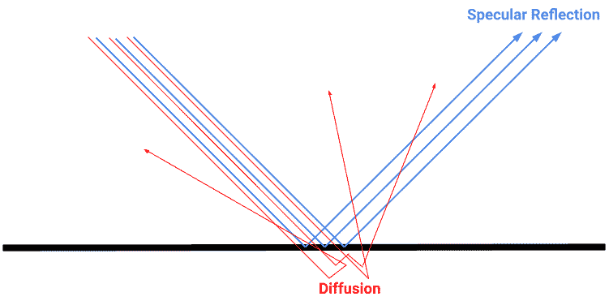
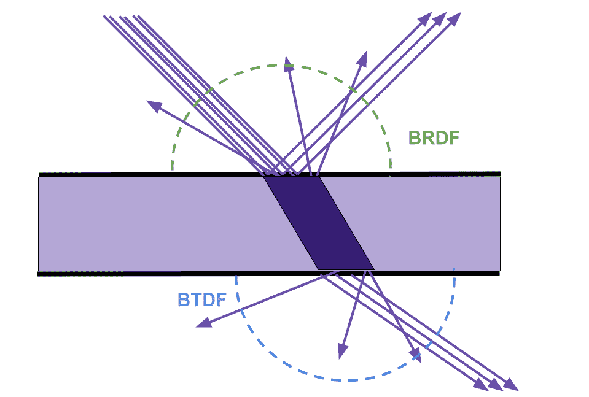
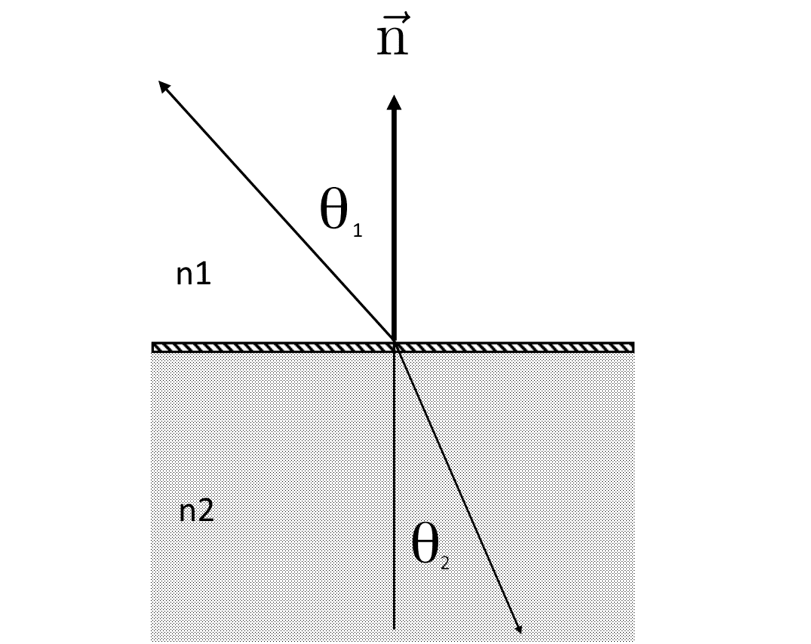
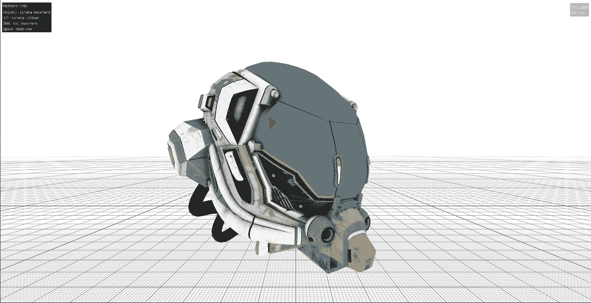
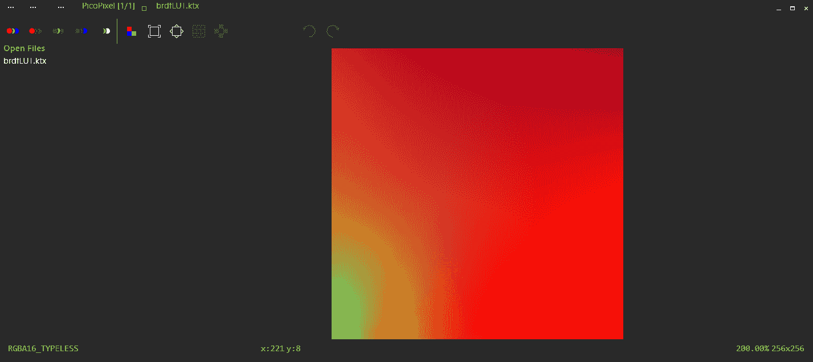
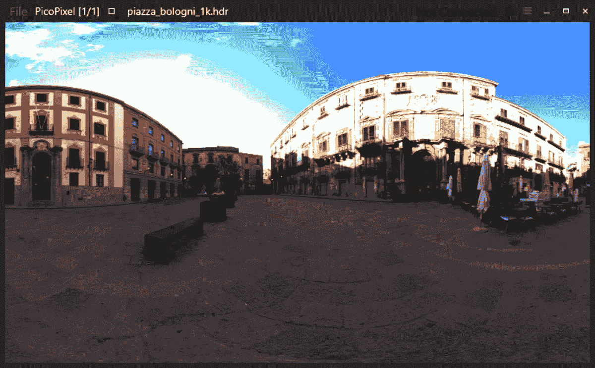
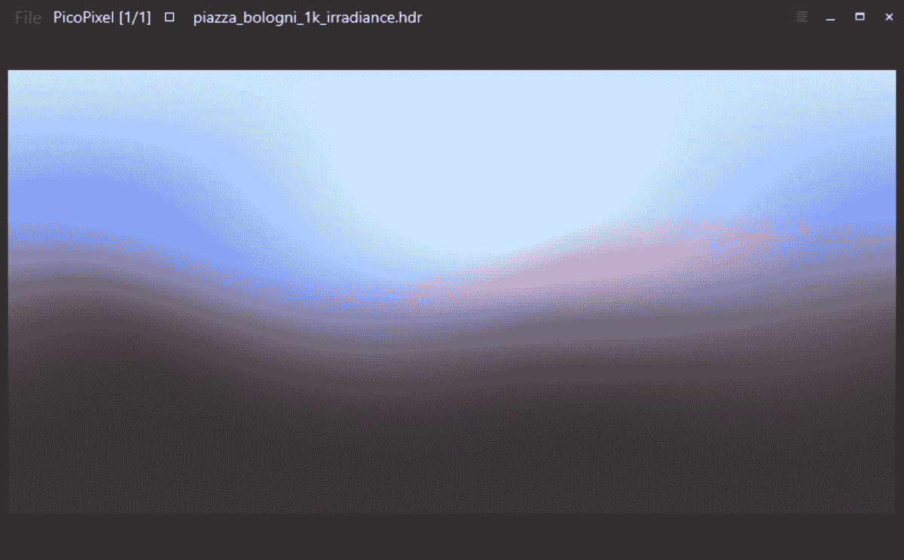
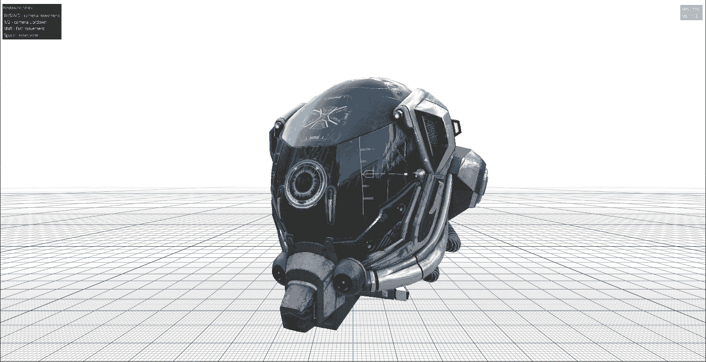
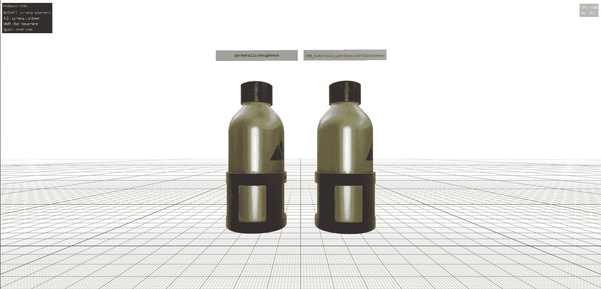

# 6 使用 glTF 2.0 着色模型进行基于物理的渲染

## 加入我们的 Discord 书籍社区


[`packt.link/unitydev`](https://packt.link/unitydev)

本章将介绍将**基于物理的渲染**（**PBR**）集成到您的图形应用程序中。我们以 glTF 2.0 着色模型为例。PBR 不是一个特定的单一技术，而是一系列概念，例如使用测量的表面值和逼真的着色模型，以准确表示现实世界的材料。将 PBR 添加到您的图形应用程序或对现有渲染引擎进行 PBR 改造可能具有挑战性，因为它需要在正确渲染图像之前同时完成多个大型任务。

1.  我们的目标是展示如何从头开始实现所有这些步骤。其中一些步骤，如预计算辐照度图或**双向反射分布函数**（**BRDF**）查找表，需要编写额外的工具。我们不会使用任何第三方工具，并将展示如何从头开始实现整个 PBR 管道骨架，包括创建基本的工具来工作。一些预计算可以使用**通用图形处理单元**（**GPGPU**）技术和计算着色器来完成，所有这些内容都将在此涵盖。

在本章中，我们将学习以下食谱：

+   glTF 2.0 物理基础着色模型的简介

+   渲染未着光的 glTF 2.0 材料实现

+   预计算 BRDF 查找表

+   预计算辐照度图和漫反射卷积

+   实现 glTF 2.0 核心金属-粗糙度着色模型

+   实现 glTF 2.0 核心光泽度着色模型

> 在所有未来对 glTF 的引用中，我们指的是 glTF 2.0 规范。由于 glTF 1.0 已过时并已弃用，我们在此书中不涉及它。

## glTF 2.0 物理基础着色模型的简介

在本节中，我们将学习 PBR 材料的基础知识，并为实际实现一些批准的 glTF 2.0 PBR 扩展提供足够的背景信息。实际的代码将在后续的食谱和章节中展示。由于 PBR 渲染的主题非常广泛，我们将关注一个简约的实现，仅为了指导您并帮助您开始。在本节中，我们将关注 glTF 2.0 PBR 着色模型的 GLSL 着色器代码。简而言之，渲染基于物理的图像不过是运行一个花哨的像素着色器，并使用一系列纹理。

### 准备工作

我们假设您已经对线性代数和微积分有了一些基本了解。建议您熟悉 glTF 2.0 规范，该规范可在 [`registry.khronos.org/glTF/specs/2.0/glTF-2.0.xhtml`](https://registry.khronos.org/glTF/specs/2.0/glTF-2.0.xhtml) 找到。

### 什么是 PBR？

**基于物理的渲染**（**PBR**）是一套旨在模拟光与真实世界材料相互作用的技术。通过使用光散射和反射的逼真模型，PBR 材质可以创造出比传统方法更逼真、更沉浸式的视觉效果。

glTF PBR 材质模型是 glTF 2.0 格式中表示基于物理材质的一种标准化方法。此模型允许您在多种平台和应用中创建高度逼真的 3D 内容，使其成为现代 3D 开发的重要工具。

### 光与物体相互作用

让我们退后一步，看看光线作为一个物理现象是什么——它是一束光线沿其传播的几何线，或者是一束光。它有一个起点和传播方向。光与表面的重要相互作用有两种：**反射**和**扩散**（分别称为“镜面”和“漫反射”）。虽然我们通过日常经验直观地理解这些概念，但它们的物理特性可能不太熟悉。

当光线遇到表面时，其中一部分会以与表面法线相反的方向弹回，就像球在墙上以角度反弹一样。这种在光滑表面上发生的反射，产生了一种称为**镜面反射**的效果（源自拉丁语中的“speculum”，意为“镜子”）。

然而，并非所有光线都会反射。有些光线穿透表面，在那里它可以被吸收、转化为热量或向各个方向散射。从表面再次散出的散射光被称为**漫射光**、**光子扩散**或**次表面散射**。这些术语都指同一物理现象——光子运动。然而，扩散和散射在如何分散光子方面是不同的。散射涉及光子被重新导向到各个方向，而扩散涉及光子均匀地扩散开来。

材料吸收和散射漫射光的方式因光的不同波长而异，赋予物体独特的颜色。例如，吸收大多数颜色但散射蓝光的物体将呈现蓝色。这种散射通常是如此混乱，以至于从所有方向看起来都一样，与镜面反射不同。



图 6.1：漫反射和镜面反射

在计算机图形学中模拟这种行为通常只需要一个输入，即**漫反射率**，它表示由各种光波长的混合比例散射回表面的颜色。术语**漫反射颜色**通常与漫反射率互换使用。

当材料具有更宽的散射角度，如人类皮肤或牛奶时，模拟它们的照明需要比简单的表面光相互作用更复杂的方法。这是因为这些材料中的光散射不仅限于表面，还发生在材料本身内部。

对于薄物体，光甚至可以散射到它们的背面，使它们变得**半透明**。随着散射进一步减少，就像在玻璃中一样，材料变得透明，允许整个图像通过它，保持其可见形状。

这些独特的光散射行为与典型的“接近表面”扩散有很大不同，需要特殊处理才能准确渲染。

### 能量守恒

PBR 的基本原则围绕着能量守恒定律。这条定律断言，在一个孤立系统中，总能量保持不变。在渲染的背景下，它表示场景中任何给定位置的入射光量等于在该位置反射、透射和吸收的光量之和。

在 PBS 中强制执行能量守恒至关重要。它允许资产在不无意中违反物理定律的情况下调整材料的反射率和反照率值，这通常会导致看起来不自然的结果。在代码中实施这些约束可以防止资产偏离现实太远或在不同的光照条件下变得不一致。

在着色系统中实现这一原则很简单。我们只需在计算漫反射之前减去反射光。这意味着高反射物体将表现出最小到没有漫反射光，因为大部分光被反射而不是穿透表面。相反，具有强烈扩散的材料不能特别具有反射性。

### 表面特性

在任何给定环境中，你可以轻松观察到各种具有独特光相互作用的复杂表面。这些独特的表面特性由称为**双向散射分布函数**（**BSDFs**）的通用数学函数表示。

将 BSDF 视为一个方程，描述光遇到表面时的散射情况。它考虑了表面的物理特性，并预测了入射光从某一方向散射到其他方向的概率。

虽然 BSDF 这个术语可能听起来很复杂，但让我们将其分解：

+   **双向性**：这指的是光与表面相互作用的两种性质。入射光从一个方向到达表面，然后向各个方向散射。

+   **散射**：这描述了入射光如何被重新导向到多个出射方向。这可能涉及反射、透射或两者的组合。

+   **分布函数**：这定义了基于表面特性的光线在特定方向上散射的概率。分布可以从完全均匀散射到单一方向上的集中反射。

在实践中，BSDF 通常分为两部分，分别处理：

+   **双向反射分布函数**（**BRDFs**）：这些函数专门描述入射光线如何从表面反射。它们解释了为什么看似白色的光源照亮香蕉会使它看起来是黄色的。BRDF 揭示了香蕉主要反射光谱中的黄色部分的光线，同时吸收或传输其他波长。

+   **双向透射分布函数**（**BTDFs**）：这些函数专门描述光线如何通过材料。这在玻璃和塑料等材料中很明显，我们可以看到入射光线如何穿过材料。

此外，还存在其他类型的 BSDF，用于解释更复杂的光相互作用现象，例如次表面散射。这发生在光线进入材料并在重新以新的方向出现之前在显著远离入射光线入射点的位置反弹。



图 6.2：BRDF 和 BTDF

### 反射类型

有四种主要的表面类型，由它们的 BRDF 定义，这些 BRDF 定义了光线在不同方向上散射的可能性：

+   **漫反射表面**在所有方向上均匀地散射光线，例如哑光油漆的均匀颜色。

+   **光滑镜面表面**优先在特定的反射方向上散射光线，表现出模糊的反射，例如塑料上的镜面高光。

+   **完美镜面表面**精确地在单一输出方向上散射光线，相对于表面法线反射入射光线——类似于在完美镜子中看到的无瑕疵反射。

+   **反光表面**主要在入射方向上散射光线，返回到光源，类似于在天鹅绒或路标上观察到的镜面高光。

然而，现实世界的表面严格遵循这些模型之一的可能性很小。因此，大多数材料都可以被建模为这些表面类型的复杂组合。

此外，每种反射类型——漫反射、光滑镜面、完美镜面和反光——都可以表现出各向同性或各向异性分布：

+   **各向同性反射**在一点上保持一致的反射光量，不受物体旋转角度的影响。这一特性与日常生活中遇到的大多数表面的行为相一致。

+   **各向异性反射**根据物体相对于光源的朝向而变化反射光量。这是由于小表面不规则性的排列主要在一个方向上，导致反射延长并模糊。这种行为在刷金属和天鹅绒等材料中尤为明显。

### 传输

反射分布类型也可以用于传输，除了全向反射。相反，当光线穿过材料时，其路径会受到材料特性的影响。为了说明这与反射的不同，考虑一束光线穿过材料，如完美的镜面透射。在完美的镜面透射中，介质的折射率决定了光传播的方向。这种行为遵循**斯涅尔定律**，该定律使用方程 n1θ1 = n2θ2 来描述。



图 6.3：折射率

在这里，`n`代表第一和第二介质的折射率，而`θ`表示入射光相对于表面法线的角度。因此，当两种介质具有相同的折射率时，光线将沿完美直线传播。相反，如果折射率不同，光线在进入下一介质时会改变方向。一个显著的例子是当光线从空气进入水中时方向改变，导致水下观察的扭曲。这与完美的镜面反射形成对比，其中入射角始终等于出射角。

### 菲涅耳方程

对于基于物理的渲染器来说，了解表面反射或透射的光量是很重要的。这些效果的组合描述了诸如蜂蜜和彩色玻璃这样的物质，它们都具有颜色且可以透过。

这些数值彼此直接相关，并由**菲涅耳方程**描述。

这些方程针对两种类型的介质，**导体**（**金属**）和**介电体**（**非金属**）。金属不透光；它们只完全反射，或者实际上完全反射。介电体具有漫反射的特性——光线穿过材料的表面，其中一些被吸收，而一些以反射的形式返回。这在这些材料的镜面高光中尤为明显——对于金属，它将是彩色的，而对于介电体，它看起来是白色的，或者更准确地说，保留了入射光的颜色。

虽然导体和介电体都受到同一组菲涅耳方程的约束，但 glTF 2.0 选择为介电体开发一个独特的评估函数。这种选择是为了利用这些方程在折射率肯定是实数时所假设的明显简单结构。

+   **非金属（电介质）**：这些材料如玻璃、塑料和陶瓷，缺乏独特的金属特性。

+   **金属（导体）**：这些材料可以在一定程度上传导热量和电流。例如，包括许多金属，如铜、银和金，尽管并非所有金属都表现出这种特性。与电介质不同，导体不传导光；相反，它们吸收一些入射光，将其转化为热量。

### 微 facet

根据微 facet 理论，粗糙表面由无数微 facet 或微小的表面元素组成，每个元素相对于表面法线都有自己的方向。由于这些微 facet 的方向不同，它们会散射入射光，从而产生漫反射而不是完美的镜面反射。

+   **Blinn-Phong 模型**：它由詹姆斯·F·布林于 1977 年提出，作为 1973 年由裴东光（Bui Tuong Phong）设计的经验 Phong 反射模型的改进。

此模型根据观察者方向与半向量 `h=(L+V)/length(L+V)` 之间的角度计算反射光的强度，半向量 `h` 位于光方向 `L` 和观察方向 `V` 之间。该模型包括一个提供表面高光的镜面项，模拟了光滑表面的效果。

+   **Cook-Torrance 模型**：1982 年，罗伯特·库克和肯尼思·托伦斯提出了一种反射模型，与 Phong 和 Blinn-Phong 模型相比，它提供了对光反射的更精确描述。微 facet BRDF 方程如下：

其中：

+   *f*[r]​(*ω*[i]​,*ω*[o]​) 是微 facet BRDF

+   *F*(*ω*[i]​,*h*) 是菲涅耳项

+   *D*(*h*) 是微 facet 分布函数

+   *G*(*ω*[i]​,*ω*[o]​,*h*) 是几何函数

+   *ω*[i] 是入射光方向

+   *ω*[o]​ 是出射光方向

+   *h* 是半向量

+   *n* 是表面法线

提出的方法具有多功能性，具有**三个可互换的成分函数**，`F`、`D` 和 `G`，可以用你偏好的方程替换。此外，它证明了在准确表示广泛的真实世界材料方面的效率。

此方程表示在特定方向 `ωo` 上反射的光量，给定入射光方向 `ωi` 和表面特性。初始成分 `F` 表示菲涅耳效应，随后的成分 `D` 是一个**正态分布函数**（**NDF**），最后的成分考虑了阴影因子 `G`，称为**G 项**。

在这个公式的所有因素中，NDF 项通常具有最大的重要性。NDF 的具体形式受到 BRDF 粗糙度的影响很大。为了有效地采样微 facet BRDF 模型，通常首先采样 NDF，获得一个符合 NDF 的随机微 facet 法线，然后沿着这个法线反射入射辐射，以确定出射方向。

微 facet 理论中 NDF 的归一化要求确保在不同粗糙度级别上，表面反射或透射的总能量保持一致。

在微 facet 理论中，NDF 描述了表面微 facet 法线的统计分布。它指定了找到具有特定方向的微 facet 的概率密度。当对所有可能的方向进行 BRDF 的积分时，积分应得到一个表示表面总反射率或透射率的值。

NDF 的归一化保证了无论表面粗糙度如何，表面反射或透射的总光量保持不变。这确保了能量守恒，这是物理学的一个基本原理，即能量不能被创造或摧毁，只能被转换或转移。

常用的几种 NDF 用于模拟具有微观粗糙度的表面行为。一些例子是 GGX、Beckmann 和 Blinn。在接下来的食谱中，我们将学习如何实现其中的一些。

### 什么是材质？

材质作为高级描述，用于表示表面，由 BRDF 和 BTDF 的组合定义。这些 BSDF 被表述为控制材料视觉特性的参数。例如，可以通过指定漫反射值来阐明光线与表面的相互作用，以及一个标量粗糙度值来表征其纹理，从而定义一个哑光材料。要从哑光材料过渡到塑料材料，只需简单地将哑光材料附加一个光泽镜面反射值，从而重现塑料典型的镜面高光。

### glTF PBR 规范

glTF PBR 规范以强调真实感、效率和在不同渲染引擎和应用程序之间的一致性为方法来处理材质表示。

glTF PBR 规范的一个关键方面是它遵循基于物理的原则。这意味着 glTF 中定义的材质能够准确模拟现实世界的特性，例如光线与表面的相互作用。如基础颜色（反照率）、粗糙度、金属和镜面等参数用于描述材质，与物理属性如表面颜色、平滑度、金属性和镜面反射率相一致。

glTF PBR 方法的一个显著特点是它的简单性和易于实现。通过标准化用于描述材质的参数，glTF 简化了创建和导出具有 PBR 材质的 3D 模型的过程。这种在不同应用程序和渲染引擎之间的一致性简化了艺术家和开发者的工作流程，使他们能够更高效、更灵活地工作。

此外，glTF PBR 规范是为实时渲染应用设计的，使其非常适合用于交互式体验、游戏和其他实时图形应用。它对材质的高效表示和优化的文件格式有助于加快加载时间并在实时渲染场景中提供更好的性能。

总体而言，glTF PBR 规范因其对物理精度、简洁性和效率的承诺而脱颖而出，使其成为 3D 图形应用中材质表示的首选选择。它在各个平台上的广泛应用和支持进一步巩固了其在 PBR 材质表示领域的领先地位。

> *Khronos 3D 格式工作组* 不断通过引入新的扩展规范来提高 PBR 材质的功能。你可以通过访问 Khronos GitHub 页面来始终了解已批准扩展的状态：[`github.com/KhronosGroup/glTF/blob/main/extensions/README.md`](https://github.com/KhronosGroup/glTF/blob/main/extensions/README.md)

### 还有更多...

对于那些希望获得更深入知识的人来说，请确保阅读由 Matt Pharr、Wenzel Jakob 和 Greg Humphreys 撰写的免费书籍 *基于物理的渲染：从理论到实现*，可在[`www.pbr-book.org`](http://www.pbr-book.org)在线获取。另一本优秀的参考书籍是 Tomas Akenine-Möller、Eric Haines 和 Naty Hoffman 撰写的 *实时渲染，第 4 版*。

此外，我们还推荐 SIGGRAPH 的 *基于物理的渲染* 课程。例如，你可以在 GitHub 上找到一个全面的链接集合：[`github.com/neil3d/awesome-pbr`](https://github.com/neil3d/awesome-pbr)。

此外，*Filament* 渲染引擎提供了对 PBR 材质的非常全面的解释：[`google.github.io/filament/Filament.md.xhtml`](https://google.github.io/filament/Filament.md.xhtml)。

## 渲染未光照的 glTF 2.0 材质

在这个菜谱中，我们将开始开发一个代码框架，使我们能够加载和渲染 glTF 2.0 资产。

我们从 `unlit` 材质开始，因为它是最简单的 glTF 2.0 PBR 材质扩展，实际的着色器实现非常简单直接。该扩展的官方名称是 `KHR_materials_unlit`。以下是其规范的链接：[`github.com/KhronosGroup/glTF/tree/main/extensions/2.0/Khronos/KHR_materials_unlit`](https://github.com/KhronosGroup/glTF/tree/main/extensions/2.0/Khronos/KHR_materials_unlit)。

从技术上讲，`unlit` 材质不是基于 PBR 的，因为它可能会破坏能量守恒的假设，或者提供不反映任何物理定律的艺术表现。`unlit` 材质的设计考虑了以下动机：

+   资源有限的移动设备，其中未光照材料提供了比高质量着色模型更高效的替代方案。

+   立体摄影测量，其中光照信息已经预先烘焙到纹理数据中，不应再应用额外的光照。

+   不希望用于美学原因的样式化材料（如类似“动漫”或手绘艺术的作品）。

让我们开始基本实现。

### 准备工作

此菜谱的源代码位于 `Chapter06/01_Unlit/main.cpp`。相应的 GLSL 顶点和片段着色器位于 `main.vert` 和 `main.frag`。

### 如何做到这一点...

在接下来的章节中，我们将创建一个功能丰富的 glTF 查看器。在本章中，我们开始构建一个简单的框架，使我们能够加载和渲染基本的 glTF 模型。

我们将使用上一章中的 `VulkanApp` 和 *Assimp* 库。与往常一样，本书文本中省略了大多数错误检查，但在实际的源代码文件中是存在的：

1.  让我们使用 *Assimp* 加载我们的 `.gltf` 文件：

```cpp
const aiScene* scene = aiImportFile(“deps/src/glTF-Sample-
  Assets/Models/DamagedHelmet/glTF/DamagedHelmet.gltf”,
    aiProcess_Triangulate);
```

1.  如您所见，加载函数是一行代码。*Assimp* 默认支持加载 `.gltf` 和 `.glb` 文件。我们使用官方 Khronos 存储库中的 *DamagedHelmet* 资产：[`github.com/KhronosGroup/glTF-Sample-Assets/tree/main/Models/DamagedHelmet`](https://github.com/KhronosGroup/glTF-Sample-Assets/tree/main/Models/DamagedHelmet)。此模型使用 **Metallic-Roughness** 材质，但出于演示目的，我们将应用 `unlit` 着色器。

1.  下一步是构建网格几何形状。`unlit` 材质仅使用材质的 `baseColor` 属性，以三种不同的输入形式：作为顶点属性、作为静态片段着色器颜色因子和作为基础颜色纹理输入。对于我们的顶点格式，这意味着我们需要提供以下三个每顶点属性：

```cpp
struct Vertex {
  vec3 position;
  vec4 color;
  vec2 uv;
};
```

1.  为了填写这些属性，我们将使用以下代码。空颜色用白色颜色值 `(1, 1, 1, 1)` 填充，空纹理坐标根据 glTF 规范用零 `(0, 0, 0)` 填充：

```cpp
std::vector<Vertex> vertices;
vertices.reserve(mesh->mNumVertices);
for (unsigned int i = 0; i != mesh->mNumVertices; i++) {
  const aiVector3D v = mesh->mVertices[i];
  const aiColor4D  c = mesh->mColors[0] ?
    mesh->mColors[0][i] : aiColor4D(1, 1, 1, 1);
  const aiVector3D t = mesh->mTextureCoords[0] ?
    mesh->mTextureCoords[0][i] : aiVector3D(0, 0, 0);
  vertices.push_back({ .position = vec3(v.x, v.y, v.z),
                       .color    = vec4(c.r, c.g, c.b, c.a),
                       .uv       = vec2(t.x, 1.0f - t.y) });
}
```

1.  如果网格中没有呈现顶点颜色，则我们将其替换为默认的白色颜色。这是一种简化最终着色器排列的便捷方式，我们可以简单地组合所有三个输入。我们将在本菜谱的后面再次提到它。

1.  我们使用 *Assimp* 网格面信息构建索引缓冲区：

```cpp
std::vector<uint32_t> indices;
indices.reserve(3 * mesh->mNumFaces);
for (unsigned int i = 0; i != mesh->mNumFaces; i++) {
  for (int j = 0; j != 3; j++)
    indices.push_back(mesh->mFaces[i].mIndices[j]);
}
```

1.  之后，我们应该加载漫反射或反照率基础颜色纹理。为了简单起见，我们将在这里使用硬编码的文件路径，而不是从 `.gltf` 模型中获取它：

```cpp
lvk::Holder<lvk::TextureHandle> baseColorTexture =
  loadTexture(ctx, “deps/src/glTF-Sample-
    Assets/Models/DamagedHelmet/glTF/Default_albedo.jpg”);
```

1.  顶点和索引数据是静态的，可以上传到相应的 Vulkan 缓冲区：

```cpp
lvk::Holder<lvk::BufferHandle> vertexBuffer = ctx->createBuffer(
  { .usage     = lvk::BufferUsageBits_Vertex,
    .storage   = lvk::StorageType_Device,
    .size      = sizeof(Vertex) * vertices.size(),
    .data      = vertices.data(),
    .debugName = “Buffer: vertex” });
lvk::Holder<lvk::BufferHandle> indexBuffer = ctx->createBuffer(
  { .usage     = lvk::BufferUsageBits_Index,
    .storage   = lvk::StorageType_Device,
    .size      = sizeof(uint32_t) * indices.size(),
    .data      = indices.data(),
    .debugName = “Buffer: index” });
```

1.  为了完成网格设置，我们需要加载 GLSL 着色器并创建渲染管线。`VertexInput` 结构的成员字段对应于上面提到的 `Vertex` 结构：

```cpp
const lvk::VertexInput vdesc = {
  .attributes    = { { .location = 0,
                       .format = lvk::VertexFormat::Float3,
                       .offset = 0  },
                   {   .location = 1,
                       .format = lvk::VertexFormat::Float4,
                       .offset = sizeof(vec3) },
                   {   .location = 2,
                       .format = lvk::VertexFormat::Float2,
                       .offset = sizeof(vec3) + sizeof(vec4) }},
  .inputBindings = { { .stride = sizeof(Vertex) } }};
lvk::Holder<lvk::ShaderModuleHandle> vert =
  loadShaderModule(ctx, “Chapter06/01_Unlit/src/main.vert”);
lvk::Holder<lvk::ShaderModuleHandle> frag =
  loadShaderModule(ctx, “Chapter06/01_Unlit/src/main.frag”);
lvk::Holder<lvk::RenderPipelineHandle> pipelineSolid =
  ctx->createRenderPipeline({
    .vertexInput = vdesc,
    .smVert      = vert,
    .smFrag      = frag,
    .color       = {{ .format = ctx->getSwapchainFormat() }},
    .depthFormat = app.getDepthFormat(),
    .cullMode    = lvk::CullMode_Back });
```

这就是准备代码。现在让我们看看应用程序的主循环内部：

1.  在渲染循环中，我们准备模型视图投影矩阵`mvp`，并通过推送常量和`PerFrameData`结构将其传递到 GLSL 着色器中，包括基色值和漫反射纹理 ID：

```cpp
const mat4 m1 = glm::rotate(
  mat4(1.0f), glm::radians(+90.0f), vec3(1, 0, 0));
const mat4 m2 = glm::rotate(
  mat4(1.0f), (float)glfwGetTime(), vec3(0.0f, 1.0f, 0.0f));
const mat4 v = app.camera_._.getViewMatrix();
const mat4 p = glm::perspective(
  45.0f, aspectRatio, 0.1f, 1000.0f);
struct PerFrameData {
  mat4 mvp;
  vec4 baseColor;
  uint32_t baseTextureId;
} perFrameData = {
  .mvp           = p * v * m2 * m1,
  .baseColor     = vec4(1, 1, 1, 1),
  .baseTextureId = baseColorTexture.index(),
};
```

1.  现在，实际的 3D 网格渲染很简单，所以我们在这里完整地发布代码：

```cpp
const lvk::RenderPass renderPass = {
  .color = { { .loadOp = lvk::LoadOp_Clear,
               .clearColor = { 1.0f, 1.0f, 1.0f, 1.0f } } },
  .depth = { .loadOp = lvk::LoadOp_Clear,
             .clearDepth = 1.0f }
};
const lvk::Framebuffer framebuffer = {
  .color  = {{ .texture = ctx->getCurrentSwapchainTexture() }},
  .depthStencil = { .texture = app.getDepthTexture() },
};
lvk::ICommandBuffer& buf = ctx->acquireCommandBuffer();
buf.cmdBeginRendering(renderPass, framebuffer);
buf.cmdBindVertexBuffer(0, vertexBuffer, 0);
buf.cmdBindIndexBuffer(indexBuffer, lvk::IndexFormat_UI32);
buf.cmdBindRenderPipeline(pipelineSolid);
buf.cmdBindDepthState({ .compareOp = lvk::CompareOp_Less,
                        .isDepthWriteEnabled = true });
buf.cmdPushConstants(perFrameData);
buf.cmdDrawIndexed(indices.size());
```

1.  最后，让我们在结束时添加一些漂亮的细节来渲染无限网格，如第五章菜谱中所述的，*实现无限网格 GLSL 着色器*，以及帧率计数器，如第四章菜谱中所述的*添加每秒帧数计数器*：

```cpp
app.drawGrid(buf, p, vec3(0, -1.0f, 0));
app.imgui_->beginFrame(framebuffer);
app.drawFPS();
app.imgui_->endFrame(buf);
buf.cmdEndRendering();
ctx->submit(buf, ctx->getCurrentSwapchainTexture());
```

这就是所有的 C++代码。现在，让我们深入到这个示例的 GLSL 着色器。它们很简单且简短：

1.  顶点着色器`Chapter06/01_Unlit/src/main.vert`执行顶点变换，并将每个顶点的颜色与提供的基色值进行预乘，该基色值来自推送常量：

```cpp
layout(push_constant) uniform PerFrameData {
  mat4 MVP;
  vec4 baseColor;
  uint textureId;
};
layout (location = 0) in vec3 pos;
layout (location = 1) in vec4 color;
layout (location = 2) in vec2 uv;
layout (location = 0) out vec2 outUV;
layout (location = 1) out vec4 outVertexColor;
void main() {
  gl_Position = MVP * vec4(pos, 1.0);
  outUV = uv;
  outVertexColor = color * baseColor;
}
```

1.  片段着色器`Chapter06/01_Unlit/src/main.frag`同样很简单。它所做的只是将预先计算的每个顶点的基色值乘以从漫反射纹理中采样的颜色值。glTF 2.0 规范保证至少提供一个`baseColorFactor`值用于金属-粗糙度属性，并且只要我们保持所有其他参数等于`1`，这保证了结果的正确性：

```cpp
layout(push_constant) uniform PerFrameData {
  mat4 MVP;
  vec4 baseColor;
  uint textureId;
};
layout (location = 0) in vec2 uv;
layout (location = 1) in vec4 vertexColor;
layout (location=0) out vec4 out_FragColor;
void main() {
  vec4 baseColorTexture = textureBindless2D(textureId, 0, uv);
  out_FragColor =
    textureBindless2D(textureId, 0, uv) * vertexColor;
}
```

1.  运行的应用程序`Chapter06/01_Unlit/src/main.cpp`应该看起来像下面的截图。



图 6.4：未光照的 glTF 2.0 模型

在这个例子中，我们强制使用漫反射纹理进行渲染以保持代码简单，使其更容易理解。在随后的章节中，我们将完全支持 glTF 2.0 规范中指定的各种材料参数组合，提供更准确和完整的 glTF 2.0 查看器实现。

## 预计算 BRDF 查找表

在之前的菜谱中，我们学习了 glTF 2.0 PBR 背后的基本理论，并实现了一个简单的未光照的 glTF 2.0 渲染器。让我们继续我们的 PBR 探索，并学习如何为即将到来的 glTF 2.0 查看器预先计算 Smith GGX BRDF**查找表（LUT）**。

1.  要渲染 PBR 图像，我们必须在渲染表面的每个点上评估 BRDF，考虑到表面特性和观察方向。这计算成本很高，包括 Khronos 的参考 glTF-Sample-Viewer 在内的许多实时实现，都使用某种预先计算的表格来查找 BRDF 值，基于表面粗糙度和观察方向。

1.  BRDF LUT 可以存储为二维纹理。X 轴表示表面法向量与观察方向的点积，而 Y 轴表示表面粗糙度值 `0...1`。每个 texel 包含三个 16 位浮点值。前两个值表示 F0 的缩放和偏移，*F0 是正常入射时的镜面反射率*。第三个值用于光泽材料扩展，将在下一章中介绍。

我们将使用 Vulkan 在 GPU 上计算这个 LUT 纹理，并实现一个计算着色器来完成它。

### 准备工作

1.  有助于回顾一下来自 *第五章* 的配方 *使用计算着色器在 Vulkan 中生成纹理* 中的 Vulkan 计算管线创建。我们的实现基于来自 [`github.com/KhronosGroup/glTF-Sample-Viewer/blob/main/source/shaders/ibl_filtering.frag`](http://github.com/KhronosGroup/glTF-Sample-Viewer/blob/main/source/shaders/ibl_filtering.frag) 的着色器，该着色器在片段着色器中执行非常相似的运算。我们的 GLSL 计算着色器可以在 `Chapter06/02_BRDF_LUT/src/main.comp` 中找到。

### 为什么预计算？

在本章早期，我们解释了什么是 BRDF，并介绍了其主要组成部分，例如 Fresnel 项 `F`、法线分布函数 `NDF` 和几何项 `G`。如您所注意到的，BRDF 的结果取决于几个因素，例如入射光和出射光的方向、表面法线和观察者的方向：

其中各个项的含义如下：

+   `D` 是 GGX NDF 微观面分布函数：

+   `G` 考虑了微观面的相互阴影，其形式如下：

+   Fresnel `F` 项定义了在给定入射角下从表面反射的光量：

如果我们检查 BRDF 的任何分量，我们会看到它们对于实时每像素计算来说都非常复杂。因此，我们可以使用离线过程预计算 BRDF 方程的一些部分。

如您所见，`G` 项和 `F` 项的一些部分只依赖于 `v`、`h` 和 `Roughness` 参数。我们将利用这一点来进行预计算。同时，请注意，我们永远不需要单独的 `n` 和 `v`，因此我们可以始终使用它们的点积。

还有一个重要的问题。我们如何迭代所有可能的 `v` 和 `n` 组合？为了做到这一点，我们需要在一个半球上对所有角度进行积分，但我们可以使用一个更简单的近似。为了使其高效，我们使用两个假设。首先，我们需要找到一种方法，用有限数量的样本进行积分。其次，我们需要明智地选择样本，而不仅仅是随机选择。

如书中*第二十章*，*基于 GPU 的重要性采样*，在《GPU Gems 3》中所述[`developer.nvidia.com/gpugems/gpugems3/part-iii-rendering/chapter-20-gpu-based-importance-sampling`](https://developer.nvidia.com/gpugems/gpugems3/part-iii-rendering/chapter-20-gpu-based-importance-sampling)，解决方案是使用**蒙特卡洛估计**配合**重要性采样**。蒙特卡洛估计允许我们通过随机样本的加权求和来近似积分。重要性采样利用了这样的想法：半球上某些随机点的值对被估计的函数有更大的影响。

由 Brian Karis 撰写的论文*Real Shading in Unreal Engine 4*提供了所有数学方面的详细解释。我们强烈建议您阅读它，以更好地理解 PBR 背后的数学：[`blog.selfshadow.com/publications/s2013-shading-course/karis/s2013_pbs_epic_notes_v2.pdf`](https://blog.selfshadow.com/publications/s2013-shading-course/karis/s2013_pbs_epic_notes_v2.pdf)。

### 如何实现...

在我们研究 GLSL 着色器代码之前，让我们实现所有必要的 C++代码来处理 GPU 上的数据数组。

为了在 GPU 上操作数据缓冲区并有效地利用数据，我们需要四个基本操作：加载着色器模块、创建计算管线、创建缓冲区以及调度计算命令。之后，我们需要将数据从 GPU 缓冲区传输到主机内存，并保存为纹理文件。让我们通过检查`Chapter06/02_BRDF_LUT/src/main.cpp`中的代码来逐步了解这些步骤：

1.  `calculateLUT()`函数实现了大部分描述的功能。我们将从加载着色器模块和创建计算管线开始。使用常量`kNumSamples`对 GLSL 着色器进行特殊化，该常量定义了 LUT 计算的蒙特卡洛试验次数。我们将在缓冲区中存储 16 位浮点 RGBA 值：

```cpp
const uint32_t kBrdfW      = 256;
const uint32_t kBrdfH      = 256;
const uint32_t kNumSamples = 1024;
const uint32_t kBufferSize =
  4u * sizeof(uint16_t) * kBrdfW * kBrdfH;
void calculateLUT(const std::unique_ptr<lvk::IContext>& ctx,
  void* output, uint32_t size)
{
  lvk::Holder<lvk::ShaderModuleHandle> comp = loadShaderModule(
    ctx, “Chapter06/02_BRDF_LUT/src/main.comp”);
  lvk:Holder<lvk::ComputePipelineHandle> computePipelineHandle =
    ctx->createComputePipeline({
      .smComp = comp,
      .specInfo = {.entries = {{ .constantId = 0,
                                 .size = sizeof(kNumSamples) }},
                   .data     = &kNumSamples,
                   .dataSize = sizeof(kNumSamples),},
  });
```

1.  下一步是为我们的输出数据创建一个 GPU 存储缓冲区：

```cpp
 lvk::Holder<lvk::BufferHandle> dstBuffer = ctx->createBuffer({
    .usage     = lvk::BufferUsageBits_Storage,
    .storage   = lvk::StorageType_HostVisible,
    .size      = size,
    .debugName = “Compute: BRDF LUT” });
```

1.  最后，我们获取一个命令缓冲区，更新推送常量，并调度计算命令：

```cpp
 lvk::ICommandBuffer& buf = ctx->acquireCommandBuffer();
  buf.cmdBindComputePipeline(computePipelineHandle);
  struct {
    uint32_t w = kBrdfW;
    uint32_t h = kBrdfH;
    uint64_t addr;
  } pc {
    .addr = ctx->gpuAddress(dstBuffer),
  };
  buf.cmdPushConstants(pc);
  buf.cmdDispatchThreadGroups({ kBrdfW / 16, kBrdfH / 16, 1 });
```

1.  在将生成的数据回读至 CPU 内存之前，我们必须等待 GPU 完成缓冲区的处理。这可以通过使用`wait()`函数来实现，该函数会等待命令缓冲区完成。我们曾在*第二章*的配方*使用 Vulkan 命令缓冲区*中讨论过这一点。一旦 GPU 完成工作，我们就可以将内存映射的缓冲区复制回 CPU 内存，该内存由指针`output`引用：

```cpp
 ctx->wait(ctx->submit(buf));
  memcpy(output, ctx->getMappedPtr(dstBuffer), kBufferSize);
}
```

那就是 C++部分。现在，让我们研究`Chapter06/02_BRDF_LUT/src/main.comp`中的 GLSL 着色器计算代码：

1.  为了将我们的工作分解成更小的部分，我们将从 BRDF LUT 计算着色器的着色器前缀和`main()`函数开始。前缀代码设置了计算着色器调度参数。在我们的情况下，LUT 纹理的 16x16 块由一个 GPU 工作组计算。数值积分的蒙特卡洛试验次数被声明为一个特殊常量，我们可以从 C++代码中覆盖它：

```cpp
layout (local_size_x=16, local_size_y=16, local_size_z=1) in;
layout (constant_id = 0) const uint NUM_SAMPLES = 1024u;
layout(std430, buffer_reference) readonly buffer Data {
  float16_t floats[];
};
```

1.  我们使用用户提供的宽度和高度来计算我们的输出缓冲区尺寸。`PI`是在着色器中使用的全局“物理”常数：

```cpp
layout (push_constant) uniform constants {
  uint BRDF_W;
  uint BRDF_H;
  Data data;
};
const float PI = 3.1415926536;
```

1.  `main()`函数封装`BRDF()`函数调用并存储结果。首先，我们重新计算工作 ID 以输出数组索引：

```cpp
void main() {
  vec2 uv;
  uv.x = (float(gl_GlobalInvocationID.x) + 0.5) / float(BRDF_W);
  uv.y = (float(gl_GlobalInvocationID.y) + 0.5) / float(BRDF_H);
```

1.  `BRDF()`函数执行所有实际工作。计算出的值被放入输出数组中：

```cpp
 vec3 v = BRDF(uv.x, 1.0 - uv.y);
  uint offset = gl_GlobalInvocationID.y * BRDF_W +
                gl_GlobalInvocationID.x;
  data.floats[offset * 4 + 0] = float16_t(v.x);
  data.floats[offset * 4 + 1] = float16_t(v.y);
  data.floats[offset * 4 + 2] = float16_t(v.z);
}
```

1.  如您所见，我们使用纹理的三个通道。`R`和`G`通道用于 GGX BRDF LUT，第三个通道用于 Charlie BRDF LUT，这是**Sheen**材质扩展所必需的，将在*第七章*，*高级 PBR 扩展*中介绍。

现在我们已经描述了我们的计算着色器的框架部分，我们可以看到 BRDF LUT 值是如何计算的。让我们看看步骤：

1.  为了在半球中生成随机方向，我们将使用所谓的 Hammersley 点，该点由以下函数计算：

```cpp
vec2 hammersley2d(uint i, uint N) {
  uint bits = (i << 16u) | (i >> 16u);
  bits = ((bits & 0x55555555u)<<1u)|((bits & 0xAAAAAAAAu)>>1u);
  bits = ((bits & 0x33333333u)<<2u)|((bits & 0xCCCCCCCCu)>>2u);
  bits = ((bits & 0x0F0F0F0Fu)<<4u)|((bits & 0xF0F0F0F0u)>>4u);
  bits = ((bits & 0x00FF00FFu)<<8u)|((bits & 0xFF00FF00u)>>8u);
  float rdi = float(bits) * 2.3283064365386963e-10;
  return vec2(float(i) / float(N), rdi);
}
```

> **重要提示**
> 
> > 代码基于以下帖子：[`holger.dammertz.org:80/stuff/notes_HammersleyOnHemisphere.xhtml`](http://holger.dammertz.org:80/stuff/notes_HammersleyOnHemisphere.xhtml)。这本书名为*Hacker’s Delight*的 Henry J. Warren 彻底检查了这种和许多其他应用的位操作魔法。感兴趣的读者还可以查找“Van der Corput 序列”以了解为什么它可以作为半球上的一系列随机方向使用。

1.  我们还需要某种类型的伪随机数生成器。我们使用输出数组索引作为输入并通过另一组神奇的公式传递：

```cpp
float random(vec2 co) {
  float a  = 12.9898;
  float b  = 78.233;
  float c  = 43758.5453;
  float dt = dot( co.xy ,vec2(a,b) );
  float sn = mod(dt, 3.14);
  return fract(sin(sn) * c);
}
```

1.  查看此链接以获取有关此代码的一些有用细节：[`byteblacksmith.com/improvements-to-the-canonical-one-liner-glsl-rand-for-opengl-es-2-0`](http://byteblacksmith.com/improvements-to-the-canonical-one-liner-glsl-rand-for-opengl-es-2-0)。

1.  让我们看看如何根据 Brian Karis 的论文*Real Shading in Unreal Engine 4*实现重要性采样。查看[`cdn2.unrealengine.com/Resources/files/2013SiggraphPresentationsNotes-26915738.pdf`](https://cdn2.unrealengine.com/Resources/files/2013SiggraphPresentationsNotes-26915738.pdf)的第四页。此函数将第`i`个 2D 点`Xi`映射到基于表面粗糙度的半球上：

```cpp
vec3 importanceSample_GGX(vec2 Xi, float roughness, vec3 normal)
{
  float alpha = roughness * roughness;
  float phi = 2.0 * PI * Xi.x + random(normal.xz) * 0.1;
  float cosTheta =
    sqrt((1.0 - Xi.y) / (1.0 + (alpha*  alpha - 1.0) * Xi.y));
  float sinTheta = sqrt(1.0 - cosTheta * cosTheta);
  vec3 H =
    vec3(sinTheta * cos(phi), sinTheta * sin(phi), cosTheta);
```

1.  计算在切线空间中进行，由向量`up`、`tangentX`和`tangentY`定义，然后转换为世界空间：

```cpp
 vec3 up = abs(normal.z) < 0.999 ?
    vec3(0.0, 0.0, 1.0) : vec3(1.0, 0.0, 0.0);
  vec3 tangentX = normalize(cross(up, normal));
  vec3 tangentY = normalize(cross(normal, tangentX));
  return normalize(tangentX * H.x +
                   tangentY * H.y +
                     normal * H.z);
}
```

1.  另一个实用函数`G_SchlicksmithGGX()`计算 GGX 几何阴影因子：

```cpp
float G_SchlicksmithGGX(
  float dotNL, float dotNV, float roughness)
{
  float k = (roughness * roughness) / 2.0;
  float GL = dotNL / (dotNL * (1.0 - k) + k);
  float GV = dotNV / (dotNV * (1.0 - k) + k);
  return GL * GV;
}
```

1.  我们还预先计算了光泽材料的 LUT，因此还有两个额外的辅助函数，`V_Ashikhmin()` 和 `D_Charlie()`。它们基于 Filament 引擎的代码：[`github.com/google/filament/blob/master/shaders/src/brdf.fs#L136`](https://github.com/google/filament/blob/master/shaders/src/brdf.fs#L136)：

```cpp
float V_Ashikhmin(float NdotL, float NdotV) {
  return clamp(
    1.0 / (4.0 * (NdotL + NdotV - NdotL * NdotV)), 0.0, 1.0);
}
float D_Charlie(float sheenRoughness, float NdotH) {
  sheenRoughness = max(sheenRoughness, 0.000001); // clamp (0,1]
  float invR = 1.0 / sheenRoughness;
  float cos2h = NdotH * NdotH;
  float sin2h = 1.0 - cos2h;
  return (2.0 + invR) * pow(sin2h, invR * 0.5) / (2.0 * PI);
}
```

1.  这里是针对光泽材料的相应采样函数，`importanceSample_Charlie()`，它与 `importanceSample_GGX()` 非常相似：

```cpp
vec3 importanceSample_Charlie(
  vec2 Xi, float roughness, vec3 normal)
{
  float alpha = roughness * roughness;
  float phi = 2.0 * PI * Xi.x;
  float sinTheta = pow(Xi.y, alpha / (2.0*  alpha + 1.0));
  float cosTheta = sqrt(1.0 - sinTheta * sinTheta);
  vec3 H = vec3(
    sinTheta * cos(phi), sinTheta * sin(phi), cosTheta);
  vec3 up = abs(normal.z) < 0.999 ?
    vec3(0.0, 0.0, 1.0) : vec3(1.0, 0.0, 0.0);
  vec3 tangentX = normalize(cross(up, normal));
  vec3 tangentY = normalize(cross(normal, tangentX));
  return normalize(tangentX * H.x +
                   tangentY * H.y +
                     normal * H.z);
}
```

1.  BRDF 的值按照以下方式计算，使用我们上面声明的所有辅助函数。蒙特卡洛试验次数 `NUM_SAMPLES` 之前设置为 `1024`。法向量 `N` 对于 2D 查找始终指向 Z 轴：

```cpp
vec3 BRDF(float NoV, float roughness) {
  const vec3 N = vec3(0.0, 0.0, 1.0);
  vec3 V = vec3(sqrt(1.0 - NoV*  NoV), 0.0, NoV);
  vec3 LUT = vec3(0.0);
```

1.  第一个循环计算我们 LUT 的 `R` 和 `G` 分量，分别对应于对 `F0` 的缩放和偏移：

```cpp
 for (uint i = 0u; i < NUM_SAMPLES; i++) {
    vec2 Xi = hammersley2d(i, NUM_SAMPLES);
    vec3 H = importanceSample_GGX(Xi, roughness, N);
    vec3 L = 2.0 * dot(V, H) * H - V;
    float dotNL = max(dot(N, L), 0.0);
    float dotNV = max(dot(N, V), 0.0);
    float dotVH = max(dot(V, H), 0.0); 
    float dotNH = max(dot(H, N), 0.0);
    if (dotNL > 0.0) {
      float G = G_SchlicksmithGGX(dotNL, dotNV, roughness);
      float G_Vis = (G * dotVH) / (dotNH * dotNV);
      float Fc = pow(1.0 - dotVH, 5.0);
      LUT.rg += vec2((1.0 - Fc) * G_Vis, Fc * G_Vis);
    }
  }
```

1.  用于光泽材料的第三个分量 `B` 在另一个循环中计算。我们将在 *第七章*，*高级 PBR 扩展* 中重新讨论它：

```cpp
 for(uint i = 0u; i < NUM_SAMPLES; i++) {
    vec2 Xi = hammersley2d(i, NUM_SAMPLES);
    vec3 H = importanceSample_Charlie(Xi, roughness, N);
    vec3 L = 2.0 * dot(V, H) * H - V;
    float dotNL = max(dot(N, L), 0.0);
    float dotNV = max(dot(N, V), 0.0);
    float dotVH = max(dot(V, H), 0.0); 
    float dotNH = max(dot(H, N), 0.0);
    if (dotNL > 0.0) {
      float sheenDistribution = D_Charlie(roughness, dotNH);
      float sheenVisibility = V_Ashikhmin(dotNL, dotNV);
      LUT.b +=
        sheenVisibility * sheenDistribution * dotNL * dotVH;
    }
  }
  return LUT / float(NUM_SAMPLES);
}
```

那就是整个用于预计算查找表的 GLSL 计算着色器。现在让我们看看它是如何与 C++ 的 `main()` 函数一起工作的。

### 它是如何工作的...

`main()` 函数使用 *KTX-Software* 库创建一个 KTX 纹理，以便我们的 16 位 RGBA LUT 纹理可以保存为 `.ktx` 格式，从而保留数据。然后，它调用我们上面讨论的 `calculateLUT()` 函数，该函数将生成的 LUT 数据输出到 KTX 纹理中。纹理保存在 `data/brdfLUT.ktx`：

```cpp
int main() {
  std::unique_ptr<lvk::IContext> ctx =
    lvk::createVulkanContextWithSwapchain(nullptr, 0, 0, {});
  ktxTextureCreateInfo createInfo = {
    .glInternalformat = GL_RGBA16F,
    .vkFormat         = VK_FORMAT_R16G16B16A16_SFLOAT,
    .baseWidth        = kBrdfW,
    .baseHeight       = kBrdfH,
    .baseDepth        = 1u,
    .numDimensions    = 2u,
    .numLevels        = 1,
    .numLayers        = 1u,
    .numFaces         = 1u,
    .generateMipmaps  = KTX_FALSE,
  };
  ktxTexture1* lutTexture = nullptr;
  ktxTexture1_Create(
    &createInfo, KTX_TEXTURE_CREATE_ALLOC_STORAGE, &lutTexture);
  calculateLUT(ctx, lutTexture->pData, kBufferSize);
  ktxTexture_WriteToNamedFile(
    ktxTexture(lutTexture), “data/brdfLUT.ktx”);
  ktxTexture_Destroy(ktxTexture(lutTexture));
  return 0;
}
```

1.  您可以使用 *Pico Pixel* ([`pixelandpolygon.com`](https://pixelandpolygon.com)) 来查看生成的图像。它应该类似于下面的截图。水平轴表示表面法向量与观察方向的点积，而垂直轴表示表面粗糙度值 `0...1`。每个纹理像素包含三个 16 位浮点值。前两个值表示对 `F0` 的缩放和偏移，`F0` 是正入射时的镜面反射率。第三个值用于光泽材料扩展，这将在下一章中介绍：



图 6.5：BRDF 查找表

这就完成了 BRDF 查找表工具的描述。我们还需要另一个工具来从环境立方体贴图计算辐照度立方体贴图，这将在下一道菜谱中介绍。

### 还有更多...

上文描述的方法可以用于使用高质量的蒙特卡洛积分预计算 BRDF 查找表，并将它们作为纹理存储。在某些移动平台上，依赖于纹理的提取可能很昂贵。Unreal Engine 中使用了一个有趣的运行时近似，它不依赖于任何预计算，如 Brian Karis 在博客文章 *Physically Based Shading on Mobile* 中所述：[`www.unrealengine.com/en-US/blog/physically-based-shading-on-mobile`](https://www.unrealengine.com/en-US/blog/physically-based-shading-on-mobile)。以下是 GLSL 源代码：

```cpp
vec3 EnvBRDFApprox(vec3 specularColor, float roughness, float NoV) {
  const vec4 c0 = vec4(-1, -0.0275, -0.572, 0.022);
  const vec4 c1 = vec4( 1,  0.0425,  1.04, -0.04 );
  vec4 r = roughness * c0 + c1;
  float a004 = min(r.x * r.x, exp2(-9.28 * NoV)) * r.x + r.y;
  vec2 AB = vec2(-1.04, 1.04) * a004 + r.zw;
  return specularColor * AB.x + AB.y;
}
```

## 预计算辐照度图和漫反射卷积

如我们在菜谱*glTF 2.0 物理着色模型简介*中之前讨论的，计算 glTF 2.0 物理着色模型所需的分割和近似法的第二部分来自辐照度立方体贴图，该立方体贴图通过卷积输入环境立方体贴图和我们的着色模型的 GGX 分布来预计算。我们的实现基于[`github.com/KhronosGroup/glTF-Sample-Viewer/blob/main/source/shaders/ibl_filtering.frag`](https://github.com/KhronosGroup/glTF-Sample-Viewer/blob/main/source/shaders/ibl_filtering.frag)中的代码。

**基于图像的照明**（**IBL**）是一种使用捕获的光信息照亮场景的技术。这些信息可以存储为全景照片图像（例如，参见*图 6.6*）。模拟整个真实世界环境非常困难，因此捕获真实世界并使用图像是如今产生逼真渲染的非常常见的技术。使用 IBL 允许我们预计算漫反射和镜面 BRDF 方程的部分，并使它们在运行时更加友好。

注意，预计算辐照度和扩散是一个相当数学的过程。如果您想了解更多关于这些计算背后的理论，请确保您阅读 Brian Karis 的论文*Real Shading in Unreal Engine 4*：[`cdn2.unrealengine.com/Resources/files/2013SiggraphPresentationsNotes-26915738.pdf`](https://cdn2.unrealengine.com/Resources/files/2013SiggraphPresentationsNotes-26915738.pdf)。

### 准备工作

在`Chapter06/03_FilterEnvmap`中查看此菜谱的源代码。

### 如何操作...

我们将在片段着色器内部进行蒙特卡洛积分，该着色器位于此处：`Chapter06/03_FilterEnvmap/src/main.frag`。

C++源代码可以在`Chapter06/03_FilterEnvmap/src/main.cpp`文件中找到。让我们通过函数`prefilterCubemap()`来预计算辐照度和漫反射图：

1.  首先，我们需要创建一个立方体贴图纹理来存储预过滤的结果。我们将使用 32 位 RGBA 浮点像素格式，因为我们的大多数颜色相关计算都在线性空间中进行。低端移动设备可能性能不足，在这种情况下，动态范围可以限制为 16 位甚至 8 位，但这可能会显著影响视觉效果。

我们使用立方体贴图 MIP 级别来预计算不同材料粗糙度`0…1`的不同值的多个查找。该函数接受`distribution`参数，该参数传递给着色器以选择适当的分布，Lambertian、GGX 或 Charlie：

```cpp
void prefilterCubemap(
  const std::unique_ptr<lvk::IContext>& ctx,
  ktxTexture1* cube, const char* envPrefilteredCubemap,
  lvk::TextureHandle envMapCube,
  Distribution distribution,
  uint32_t sampler,
  uint32_t sampleCount)
{
  lvk::Holder<lvk::TextureHandle> prefilteredMapCube =
    ctx->createTexture({
        .type         = lvk::TextureType_Cube,
        .format       = lvk::Format_RGBA_F32,
        .dimensions   = {cube->baseWidth, cube->baseHeight, 1},
        .usage        = lvk::TextureUsageBits_Sampled |
                        lvk::TextureUsageBits_Attachment,
        .numMipLevels = (uint32_t)cube->numLevels,
        .debugName    = envPrefilteredCubemap,
      }, envPrefilteredCubemap);
```

1.  我们需要 GLSL 着色器模块和渲染管线：

```cpp
 lvk::Holder<lvk::ShaderModuleHandle> vert = loadShaderModule(
    ctx, “Chapter06/03_FilterEnvmap/src/main.vert”);
  lvk::Holder<lvk::ShaderModuleHandle> frag = loadShaderModule(
    ctx, “Chapter06/03_FilterEnvmap/src/main.frag”);
  lvk::Holder<lvk::RenderPipelineHandle> pipelineSolid =
    ctx->createRenderPipeline({
      .smVert   = vert,
      .smFrag   = frag,
      .color    = { { .format =
                        ctx->getFormat(prefilteredMapCube) } },
      .cullMode = lvk::CullMode_Back,
  });
```

1.  现在，我们可以在立方体贴图中开始实际渲染。一个命令缓冲区填充了渲染`6`个立方体贴图面所需的所有命令，包括所有所需的 MIP 级别：

```cpp
 lvk::ICommandBuffer& buf = ctx,->acquireCommandBuffer();
  for (uint32_t mip = 0; mip < cube->numLevels; mip++) {
    for (uint32_t face = 0; face < 6; face++) {
```

1.  我们设置要渲染的立方体贴图面和特定的 MIP 级别：

```cpp
 buf.cmdBeginRendering(
        { .color = { { .loadOp     = lvk::LoadOp_Clear,
                       .layer      = (uint8_t)face,
                       .level      = (uint8_t)mip,
                       .clearColor = { 1.0f, 1.0f, 1.0f, 1.0f },
                   } } },
        { .color = {{ .texture = prefilteredMapCube }} });
      buf.cmdBindRenderPipeline(pipelineSolid);
      buf.cmdBindDepthState({});
```

1.  使用推送常量将所有数据传递到着色器中：

```cpp
 struct PerFrameData {
        uint32_t face;
        float roughness;
        uint32_t sampleCount;
        uint32_t width;
        uint32_t envMap;
        uint32_t distribution;
        uint32_t sampler;
      } perFrameData = {
        .face         = face,
        .roughness    = (float)(mip) / (cube->numLevels - 1),
        .sampleCount  = sampleCount,
        .width        = cube->baseWidth,
        .envMap       = envMapCube.index(),
        .distribution = uint32_t(distribution),
        .sampler      = sampler,
      };
      buf.cmdPushConstants(perFrameData);
```

1.  然后，渲染一个全屏三角形以覆盖整个立方体贴图面，并让片段着色器完成其工作。在命令缓冲区填满后，我们可以提交它：

```cpp
 buf.cmdDraw(3);
      buf.cmdEndRendering();
    }
  }
  ctx->submit(buf);
  ... // save results to a .ktx file
}
```

`prefilterCubemap()` 函数的剩余部分从 GPU 获取生成的立方体贴图数据，并将其保存为 `.ktx` 文件。让我们看看 GLSL 片段着色器代码，它位于 `Chapter06/03_FilterEnvmap/src/main.frag` 目录中，执行了所有繁重的工作：

1.  为了解开着色器逻辑，让我们从入口点 `main()` 开始。代码很简单，调用了两个函数。函数 `uvToXYZ()` 将立方体贴图面索引和 `vec2` 坐标转换为 `vec3` 立方体贴图采样方向。函数 `filterColor()` 执行实际的蒙特卡洛采样，我们稍后会回到这个话题：

```cpp
void main() {
  vec2 newUV = uv * 2.0 - vec2(1.0);
  vec3 scan = uvToXYZ(perFrameData.face, newUV);
  vec3 direction = normalize(scan);
  out_FragColor = vec4(filterColor(direction), 1.0);
}
```

1.  这是 `uvToXYZ()` 的代码，供您参考：

```cpp
vec3 uvToXYZ(uint face, vec2 uv) {
  if (face == 0) return vec3(   1., uv.y,  uv.x);
  if (face == 1) return vec3(  -1., uv.y, -uv.x);
  if (face == 2) return vec3(+uv.x,   1.,  uv.y);  
  if (face == 3) return vec3(+uv.x,  -1., -uv.y);
  if (face == 4) return vec3(+uv.x, uv.y,   -1.);
  if (face == 5) return vec3(-uv.x, uv.y,    1.);
}
```

1.  函数 `filterColor()` 为辐照度和朗伯漫反射卷积执行积分部分。参数 `N` 是立方体贴图采样方向向量。我们迭代 `sampleCount` 个样本，并获取重要性采样信息，包括重要性采样方向和该方向的 **概率密度函数**（**PDF**）。数学部分在本博客文章中有详细描述：[`bruop.github.io/ibl`](https://bruop.github.io/ibl)。在这里，我们将专注于构建一个最小化工作实现：

```cpp
vec3 filterColor(vec3 N) {
  vec3  color  = vec3(0.f);
  float weight = 0.0f;
  for(uint i = 0; i < perFrameData.sampleCount; i++) {
    vec4 importanceSample =
      getImportanceSample(i, N, perFrameData.roughness);
    vec3 H = vec3(importanceSample.xyz);
    float pdf = importanceSample.w;
```

1.  如同在 *GPU Gems 3* 的 *20.4* 节 *映射和扭曲* 中描述的那样，对米普贴样本进行过滤：在较低分辨率下采样朗伯，以避免过亮的像素，也称为 **飞火**：

```cpp
 float lod = computeLod(pdf);
    if (perFrameData.distribution == cLambertian) {
      vec3 lambertian = textureBindlessCubeLod(
        perFrameData.envMap,
        perFrameData.samplerIdx, H, lod).xyz;
      color += lambertian;
    } else if (perFrameData.distribution == cGGX ||
               perFrameData.distribution == cCharlie) {
      vec3 V = N;
      vec3 L = normalize(reflect(-V, H));
      float NdotL = dot(N, L);
      if (NdotL > 0.0) {
        if (perFrameData.roughness == 0.0) lod = 0.0;
        vec3 sampleColor = textureBindlessCubeLod(
          perFrameData.envMap,
          perFrameData.samplerIdx, L, lod).xyz;
        color += sampleColor * NdotL;
        weight += NdotL;
      }
    }
  }
```

1.  输出颜色值使用所有 `NdotL` 权重的总和进行重新归一化，或者对于朗伯情况下的样本数量：

```cpp
 color /= (weight != 0.0f) ?
    weight : float(perFrameData.sampleCount);
  return color.rgb;
}
```

1.  重要性采样函数 `getImportanceSample()` 返回一个 `vec4` 值，其中重要性采样方向位于 `.xyz` 组件中，而 PDF 标量值位于 `.w` 组件中。我们生成一个 Hammersley 点，正如我们在之前的配方中描述的，*预计算 BRDF 查找表*，然后根据分布类型（朗伯、GGX 或 Charlie）生成一个样本，并在法线方向上旋转它。此函数使用辅助结构 `MicrofacetDistributionSample`：

```cpp
struct MicrofacetDistributionSample {
  float pdf;
  float cosTheta;
  float sinTheta;
  float phi;
};
vec4 getImportanceSample(
  uint sampleIndex, vec3 N, float roughness)
{
  vec2 xi = hammersley2d(sampleIndex, perFrameData.sampleCount);
  MicrofacetDistributionSample importanceSample;
```

1.  在半球上生成点，其映射对应于所需的分布。例如，朗伯分布使用余弦重要性：

```cpp
 if (perFrameData.distribution == cLambertian)
    importanceSample = Lambertian(xi, roughness);
  else if (perFrameData.distribution == cGGX)
    importanceSample = GGX(xi, roughness);
  else if (perFrameData.distribution == cCharlie)
    importanceSample = Charlie(xi, roughness);
```

1.  将半球采样点转换为切线坐标系。辅助函数 `generateTBN()` 从提供的法线向量生成切线-切线-法线坐标系：

```cpp
 vec3 localSpaceDirection = normalize(vec3(
    importanceSample.sinTheta * cos(importanceSample.phi), 
    importanceSample.sinTheta * sin(importanceSample.phi), 
    importanceSample.cosTheta));
  mat3 TBN = generateTBN(N);
  vec3 direction = TBN * localSpaceDirection;
  return vec4(direction, importanceSample.pdf);
}
```

1.  我们将跳过个别分布计算函数 `Lambertian()`、`GGX()` 和 `Charlie()` 的细节。实际的 GLSL 着色器 `Chapter06/03_FilterEnvmap/src/main.frag` 包含所有必要的代码。

重要性采样的过程可能会引入视觉伪影。在不影响性能的情况下提高视觉质量的一种方法是通过利用硬件加速的米波映射进行快速过滤和采样。这个想法在以下论文中提出：[`cgg.mff.cuni.cz/~jaroslav/papers/2007-sketch-fis/Final_sap_0073.pdf`](https://cgg.mff.cuni.cz/~jaroslav/papers/2007-sketch-fis/Final_sap_0073.pdf)。此链接对该主题有更详细的说明：[`developer.nvidia.com/gpugems/gpugems3/part-iii-rendering/chapter-20-gpu-based-importance-sampling`](https://developer.nvidia.com/gpugems/gpugems3/part-iii-rendering/chapter-20-gpu-based-importance-sampling)。在这里，我们使用一个公式，它接受一个**PDF**值并为其计算适当的米波映射 LOD 级别：

```cpp
float computeLod(float pdf) {
  float w = float(perFrameData.width);
  float h = float(perFrameData.height);
  float sampleCount = float(perFrameData.sampleCount);
  return 0.5 * log2( 6.0 * w * h / (sampleCount * pdf));
}
```

代码的其余部分涉及纯粹机械的任务，例如从文件中加载立方体贴图图像，调用各种分布类型（朗伯、GGX 和 Charlie）的渲染函数，以及使用 KTX 库保存结果。让我们检查以下输入图像的预过滤结果：



图 6.6：环境立方体贴图

卷积后的图像应该看起来像以下截图：



图 6.7：使用漫反射卷积预过滤的环境立方体贴图

现在，我们已经准备好了所有辅助部分来渲染 PBR 图像。在下一个配方“实现 glTF 2.0 金属-粗糙度着色模型”中，我们将把所有内容组合到一个简单的应用程序中，以渲染基于物理的 glTF 2.0 3D 模型。

### 还有更多...

Paul Bourke 创建了一套工具和丰富的资源，解释了如何将立方体贴图转换为不同的格式。请确保查看：[`paulbourke.net/panorama/cubemaps/index.xhtml`](http://paulbourke.net/panorama/cubemaps/index.xhtml)。

## 实现 glTF 2.0 金属-粗糙度着色模型

本配方将介绍如何将 PBR 集成到您的图形管线中。由于 PBR 的主题非常广泛，我们将关注最小化实现，仅为了指导您并让您开始。在本节中，我们将关注金属-粗糙度着色模型和最小化 C++ 观察器实现。在接下来的章节中，我们将创建一个更复杂、功能更丰富的 glTF 观察器，包括高级材质扩展和几何特征。

### 准备工作

1.  在继续进行之前，建议您重新阅读配方《glTF 2.0 基于物理的着色模型简介》。有关 glTF 2.0 着色模型的轻量级介绍，可以在[`github.com/KhronosGroup/glTF-Sample-Viewer/tree/glTF-WebGL-PBR`](https://github.com/KhronosGroup/glTF-Sample-Viewer/tree/glTF-WebGL-PBR)找到。

1.  此配方的 C++ 源代码位于 `Chapter06/04_MetallicRoughness` 文件夹中。负责 PBR 计算的 GLSL 着色器代码可以在 `Chapter06/04_MetallicRoughness/src/PBR.sp` 中找到。

### 如何做到这一点...

在我们深入 GLSL 代码之前，我们将查看从 C++ 端设置输入数据的方式。我们将使用 Khronos 提供的 *损坏头盔* 3D 模型。您可以在以下位置找到 glTF 文件：[`github.com/KhronosGroup/glTF-Sample-Models/blob/main/2.0/DamagedHelmet/glTF/DamagedHelmet.gltf`](https://github.com/KhronosGroup/glTF-Sample-Models/blob/main/2.0/DamagedHelmet/glTF/DamagedHelmet.gltf)。

让我们先从结构和辅助函数开始：

1.  辅助结构 `GLTFGlobalSamplers` 包含了访问 glTF IBL 纹理所需的三个采样器。它在 `shared/UtilsGLTF.h` 中声明：

```cpp
struct GLTFGlobalSamplers {
  GLTFGlobalSamplers(const std::unique_ptr<lvk::IContext>& ctx);
  lvk::Holder<lvk::SamplerHandle> clamp;
  lvk::Holder<lvk::SamplerHandle> wrap;
  lvk::Holder<lvk::SamplerHandle> mirror;
};
```

1.  `GLTFGlobalSamplers` 构造函数以以下方式创建所有三个采样器：

```cpp
GLTFGlobalSamplers(const std::unique_ptr<lvk::IContext>& ctx) {
  clamp = ctx->createSampler({
    .minFilter = lvk::SamplerFilter::SamplerFilter_Linear,
    .magFilter = lvk::SamplerFilter::SamplerFilter_Linear,
    .mipMap    = lvk::SamplerMip::SamplerMip_Linear,
    .wrapU     = lvk::SamplerWrap::SamplerWrap_Clamp,
    .wrapV     = lvk::SamplerWrap::SamplerWrap_Clamp,
    .wrapW     = lvk::SamplerWrap::SamplerWrap_Clamp,
    .debugName = “Clamp Sampler” });
  wrap = ctx->createSampler({
    .minFilter = lvk::SamplerFilter::SamplerFilter_Linear,
    .magFilter = lvk::SamplerFilter::SamplerFilter_Linear,
    .mipMap    = lvk::SamplerMip::SamplerMip_Linear,
    .wrapU     = lvk::SamplerWrap::SamplerWrap_Repeat,
    .wrapV     = lvk::SamplerWrap::SamplerWrap_Repeat,
    .wrapW     = lvk::SamplerWrap::SamplerWrap_Repeat,
    .debugName = “Wrap Sampler” });
  mirror = ctx->createSampler({
    .minFilter = lvk::SamplerFilter::SamplerFilter_Linear,
    .magFilter = lvk::SamplerFilter::SamplerFilter_Linear,
    .mipMap    = lvk::SamplerMip::SamplerMip_Linear,
    .wrapU     = lvk::SamplerWrap::SamplerWrap_MirrorRepeat,
    .wrapV     = lvk::SamplerWrap::SamplerWrap_MirrorRepeat,
    .debugName = “Mirror Sampler” });
  }
```

1.  辅助结构 `EnvironmentMapTextures` 存储了所有 IBL 环境图纹理和 BRDF 查找表，为了简单起见提供了默认纹理：

```cpp
struct EnvironmentMapTextures {
  lvk::Holder<lvk::TextureHandle> texBRDF_LUT;
  lvk::Holder<lvk::TextureHandle> envMapTexture;
  lvk::Holder<lvk::TextureHandle> envMapTextureCharlie;
  lvk::Holder<lvk::TextureHandle> envMapTextureIrradiance;
```

1.  请参阅之前的配方 *预计算辐照度图和漫反射卷积*，了解如何预计算 IBL 纹理的详细信息。BRDF 查找表是在配方 *预计算 BRDF 查找表* 中预计算的。

```cpp
 explicit EnvironmentMapTextures(
    const std::unique_ptr<lvk::IContext>& ctx) :
  EnvironmentMapTextures(ctx,
    “data/brdfLUT.ktx”,
    “data/piazza_bologni_1k_prefilter.ktx”,
    “data/piazza_bologni_1k_irradiance.ktx”,
    “data/piazza_bologni_1k_charlie.ktx”) {}
  EnvironmentMapTextures(
    const std::unique_ptr<lvk::IContext>& ctx,
    const char* brdfLUT,
    const char* prefilter,
    const char* irradiance,
    const char* prefilterCharlie = nullptr)
  {
    texBRDF_LUT = loadTexture(ctx, brdfLUT, lvk::TextureType_2D);
    envMapTexture = loadTexture(
      ctx, prefilter, lvk::TextureType_Cube);
    envMapTextureIrradiance = loadTexture(
      ctx, irradiance, lvk::TextureType_Cube);
  }
};
```

1.  结构 `GLTFMaterialTextures` 包含了渲染我们演示中支持的任何 glTF 2.0 模型所需的所有纹理。它是一个包含多个 `Holder<TextureHandle>` 对象的容器，如下所示：

```cpp
struct GLTFMaterialTextures {
  // MetallicRoughness / SpecularGlossiness     
  lvk::Holder<lvk::TextureHandle> baseColorTexture;
  lvk::Holder<lvk::TextureHandle> surfacePropertiesTexture;
  // Common properties
  lvk::Holder<lvk::TextureHandle> normalTexture;
  lvk::Holder<lvk::TextureHandle> occlusionTexture;
  lvk::Holder<lvk::TextureHandle> emissiveTexture;
  // Sheen
  lvk::Holder<lvk::TextureHandle> sheenColorTexture;
  lvk::Holder<lvk::TextureHandle> sheenRoughnessTexture;
  … many other textures go here
}
```

1.  辅助函数 `loadMaterialTextures()` 不可共享，并且每个应用程序中都会有所不同。此函数的变体加载了金属-粗糙度演示所需纹理的子集：

```cpp
GLTFMaterialTextures loadMaterialTextures(
  const std::unique_ptr<lvk::IContext>& ctx,
  const char* texAOFile,
  const char* texEmissiveFile,
  const char* texAlbedoFile,
  const char* texMeRFile,
  const char* texNormalFile)
{
  glTFMaterialTextures mat;
  mat.baseColorTexture = loadTexture(
    ctx, texAlbedoFile, lvk::TextureType_2D, true);
  if (mat.baseColorTexture.empty()) return {};     
  mat.occlusionTexture = loadTexture(ctx, texAOFile);
  if (mat.occlusionTexture.empty()) return {};     
  mat.normalTexture = loadTexture(ctx, texNormalFile);
  if (mat.normalTexture.empty()) return {};
  mat.emissiveTexture = loadTexture(
    ctx, texEmissiveFile, lvk::TextureType_2D, true);
  if (mat.emissiveTexture.empty()) return {};
  mat.surfacePropertiesTexture = loadTexture(ctx, texMeRFile);
  if (mat.surfacePropertiesTexture.empty()) return {};
  mat.wasLoaded = true;
  return mat;
}} 
```

1.  一个重要步骤是加载材质数据并填写 `MetallicRoughnessDataGPU` 结构。我们将使用 Assimp API 获取材质属性并填写相应的值。glTF 规范要求非可选和可选属性有明确的默认值，因此我们也在这个片段中填写了它们。对于每个纹理，我们读取并设置采样状态和 `uv` 坐标索引的数据：

```cpp
struct MetallicRoughnessData {
  vec4 baseColorFactor = vec4(1.0f, 1.0f, 1.0f, 1.0f);
```

1.  在这里，我们将 `metallicFactor`、`roughnessFactor`、`normalScale` 和 `occlusionStrength` glTF 属性打包到一个 `vec4` 成员字段 `metallicRoughnessNormalOcclusion` 中。

1.  我们这样做是为了进行非常基本的优化。GPU 将此数据存储在向量寄存器中，如果我们将所有参数打包到一个单一的 `vec4` 值中，读取它将更加高效。另一个原因是避免任何额外的对齐要求，特别是对于 `vec3` 类型。类似的打包也用于 `vec3` glTF 属性 `emissiveFactor` 和一个 `float`，`alphaCutoff`，它们都被打包到一个单一的 `vec4` 值中：

```cpp
 vec4 metallicRoughnessNormalOcclusion =
    vec4(1.0f, 1.0f, 1.0f, 1.0f);
  vec4 emissiveFactorAlphaCutoff = vec4(0.0f, 0.0f, 0.0f, 0.5f);
```

1.  其他成员字段持有用于我们的无绑定着色器的纹理和采样器 ID。除了 `0` 以外没有默认值：

```cpp
 uint32_t occlusionTexture        = 0;
  uint32_t occlusionTextureSampler = 0;
  uint32_t occlusionTextureUV      = 0;
  uint32_t emissiveTexture         = 0;
  uint32_t emissiveTextureSampler  = 0;
  uint32_t emissiveTextureUV       = 0;
  uint32_t baseColorTexture        = 0;
  uint32_t baseColorTextureSampler = 0;
  uint32_t baseColorTextureUV              = 0;
  uint32_t metallicRoughnessTexture        = 0;
  uint32_t metallicRoughnessTextureSampler = 0;
  uint32_t metallicRoughnessTextureUV      = 0;
  uint32_t normalTexture        = 0;
  uint32_t normalTextureSampler = 0;
  uint32_t normalTextureUV      = 0;
```

1.  `alphaMode` 属性定义了如何解释 alpha 值。alpha 值本身应从金属-粗糙度材质模型的基色 `4`-th 组件中获取：

```cpp
 uint32_t alphaMode = 0;
  enum AlphaMode {
    AlphaMode_Opaque = 0,
    AlphaMode_Mask   = 1,
    AlphaMode_Blend  = 2,
  };
};
```

1.  使用辅助函数 `setupMetallicRoughnessData()` 填充 `MetallicRoughnessDataGPU` 结构。上面讨论了 `GLTFMaterialTextures` 结构：

```cpp
MetallicRoughnessDataGPU setupMetallicRoughnessData(
  const GLTFGlobalSamplers& samplers,
  const GLTFMaterialTextures& mat,
  const aiMaterial* mtlDescriptor)
{
  MetallicRoughnessDataGPU res = {
    .baseColorFactor              = vec4(1.0f, 1.0f, 1.0f, 1.0f),
    .metallicRoughnessNormalOcclusion =
      vec4(1.0f, 1.0f, 1.0f, 1.0f),
    .emissiveFactorAlphaCutoff    = vec4(0.0f, 0.0f, 0.0f, 0.5f),
    .occlusionTexture             = mat.occlusionTexture.index(),
    .emissiveTexture              = mat.emissiveTexture.index(),
    .baseColorTexture             = mat.baseColorTexture.index(),
    .metallicRoughnessTexture     =
      mat.surfacePropertiesTexture.index(),
    .normalTexture                = mat.normalTexture.index(),
  };
```

1.  函数的其余部分继续读取各种 glTF 材质属性，使用 Assimp API。我们在这里粘贴其代码的起始部分。所有其他材质属性都以类似重复的模式加载：

```cpp
 aiColor4D aiColor;
  if (mtlDescriptor->Get(AI_MATKEY_COLOR_DIFFUSE, aiColor) ==
      AI_SUCCESS) {
    res.baseColorFactor = vec4(
      aiColor.r, aiColor.g, aiColor.b, aiColor.a);
  }
  assignUVandSampler(samplers,
    mtlDescriptor,
    aiTextureType_DIFFUSE,
    res.baseColorTextureUV,
    res.baseColorTextureSampler);
  … many other glTF material properties are loaded here
```

1.  辅助函数 `assignUVandSampler()` 的样子如下：

```cpp
bool assignUVandSampler(
  const GLTFGlobalSamplers& samplers,
  const aiMaterial* mtlDescriptor,
  aiTextureType textureType,
  uint32_t& uvIndex,
  uint32_t& textureSampler, int index)
{
  aiString path;
  aiTextureMapMode mapmode[3] = {
    aiTextureMapMode_Clamp,
    aiTextureMapMode_Clamp,
    aiTextureMapMode_Clamp };
  bool res = mtlDescriptor->GetTexture(textureType, index,
    &path, 0, &uvIndex, 0, 0, mapmode) == AI_SUCCESS;
  switch (mapmode[0]) {
    case aiTextureMapMode_Clamp:
      textureSampler = samplers.clamp.index();
      break;
    case aiTextureMapMode_Wrap:
      textureSampler = samplers.wrap.index();
      break;
    case aiTextureMapMode_Mirror:
      textureSampler = samplers.mirror.index();
      break;
  }
  return res;
}
```

1.  现在，让我们通过 `main()` 函数来分析：

1.  首先，我们使用 Assimp 加载 glTF 文件。我们只支持三角化拓扑；因此，使用标志 `aiProcess_Triangulate` 指示 Assimp 在导入期间对网格进行三角化：

```cpp
const aiScene* scene = aiImportFile(“deps/src/glTF-Sample-
  Assets/Models/DamagedHelmet/glTF/DamagedHelmet.gltf”,
  aiProcess_Triangulate);
const aiMesh* mesh = scene->mMeshes[0];
const vec4 white = vec4(1.0f, 1.0f, 1.0f, 1.0f);
```

1.  我们填充顶点数据。结构 `Vertex` 在所有 glTF 演示中共享，并在 `shared/UtilsGLTF.h` 中声明：

```cpp
struct Vertex {
  vec3 position;
  vec3 normal;
  vec4 color;
  vec2 uv0;
  vec2 uv1;
};
std::vector<Vertex> vertices;
for (     uint32_t i = 0; i != mesh->mNumVertices; i++) {
  const aiVector3D v   = mesh->mVertices[i];
  const aiVector3D n   = mesh->mNormals ?
    mesh->mNormals[i] : aiVector3D(0.0f, 1.0f, 0.0f);
  const aiColor4D  c   = mesh->mColors[0] ?
    mesh->mColors[0][i] : aiColor4D(1.0f, 1.0f, 1.0f, 1.0f);
```

1.  glTF 模型通常使用两组 UV 纹理坐标。第一组，`uv0`，用于主纹理映射，例如漫反射颜色、镜面反射或法线映射。这些坐标通常用于表面细节和颜色信息。第二组，`uv1`，通常用于光照图或反射图。这些图通常需要单独的纹理坐标来正确映射到模型上，与主纹理坐标不同。glTF 规范指出，查看器应用程序应至少支持两组纹理坐标集：

```cpp
 const aiVector3D uv0 = mesh->mTextureCoords[0] ?
    mesh->mTextureCoords[0][i] : aiVector3D(0.0f, 0.0f, 0.0f);
  const aiVector3D uv1 = mesh->mTextureCoords[1] ?
    mesh->mTextureCoords[1][i] : aiVector3D(0.0f, 0.0f, 0.0f);
  vertices.push_back({ .position = vec3(v.x, v.y, v.z),
                       .normal   = vec3(n.x, n.y, n.z),
                       .color    = vec4(c.r, c.g, c.b, c.a),
                       .uv0      = vec2(uv0.x, 1.0f - uv0.y),
                       .uv1      = vec2(uv1.x, 1.0f - uv1.y) });
}
```

1.  让我们设置定义我们的三角形的索引，并将生成的顶点和索引数据上传到相应的缓冲区：

```cpp
std::vector<uint32_t> indices;
for (unsigned int i = 0; i != mesh->mNumFaces; i++)
  for (int j = 0; j != 3; j++)
    indices.push_back(mesh->mFaces[i].mIndices[j]);
lvk::Holder<BufferHandle> vertexBuffer = ctx->createBuffer({
  .usage     = lvk::BufferUsageBits_Vertex,
  .storage   = lvk::StorageType_Device,
  .size      = sizeof(Vertex) * vertices.size(),
  .data      = vertices.data(),
  .debugName = “Buffer: vertex” });
lvk::Holder<lvk::BufferHandle> indexBuffer = ctx->createBuffer({
  .usage     = lvk::BufferUsageBits_Index,
  .storage   = lvk::StorageType_Device,
  .size      = sizeof(uint32_t) * indices.size(),
  .data      = indices.data(),
  .debugName = “Buffer: index” });
```

1.  下一步是加载所有材质纹理。我们的大多数 glTF 演示使用相同的纹理组合，因此我们将它们存储在结构 `GLTFMaterialTextures` 中，该结构在 `shared/UtilsGLTF.h` 中声明：

```cpp
std::unique_ptr<GLTFMaterialTextures> mat =
  loadMaterialTextures(ctx,
    “deps/src/glTF-Sample-Assets/Models/
      DamagedHelmet/glTF/Default_AO.jpg”,
    “deps/src/glTF-Sample-Assets/Models/
      DamagedHelmet/glTF/Default_emissive.jpg”,
    “deps/src/glTF-Sample-Assets/Models/
      DamagedHelmet/glTF/Default_albedo.jpg”,
    “deps/src/glTF-Sample-Assets/Models/
      DamagedHelmet/glTF/Default_metalRoughness.jpg”,
    “deps/src/glTF-Sample-Assets/Models/
      DamagedHelmet/glTF/Default_normal.jpg”);
```

1.  在我们继续创建图形管线和渲染之前，我们必须设置 IBL 样本、纹理和 BRDF 查找表。这些数据在所有我们的演示中是共享的，因此我们引入了一些辅助结构来为我们完成所有这些工作。以下是 `main()` 函数中的定义：

```cpp
GLTFGlobalSamplers samplers(ctx);
EnvironmentMapTextures envMapTextures(ctx);
```

1.  下一步是为我们的 glTF 渲染创建一个渲染管线步骤。我们必须提供一个顶点输入描述。以下是为我们的模型创建一个描述的方法：

```cpp
 const lvk::VertexInput vdesc = {
    .attributes    = {
      { .location=0, .format=VertexFormat::Float3, .offset=0  },
      { .location=1, .format=VertexFormat::Float3, .offset=12 },
      { .location=2, .format=VertexFormat::Float4, .offset=24 },
      { .location=3, .format=VertexFormat::Float2, .offset=40 },
      { .location=4, .format=VertexFormat::Float2, .offset=48 }},
    .inputBindings = { { .stride = sizeof(Vertex) } },
  };
```

1.  渲染管线应按以下方式创建。我们将在 *How it works…* 部分研究 GLSL 着色器：

```cpp
 lvk::Holder<lvk::ShaderModuleHandle> vert = loadShaderModule(
    ctx, “Chapter06/04_MetallicRoughness/src/main.vert”);
  lvk::Holder<lvk::ShaderModuleHandle> frag = loadShaderModule(
    ctx, “Chapter06/04_MetallicRoughness/src/main.frag”);
  lvk::Holder<lvk::RenderPipelineHandle> pipelineSolid =
    ctx->createRenderPipeline({
      .vertexInput = vdesc,
      .smVert      = vert,
      .smFrag      = frag,
      .color       = { { .format = ctx->getSwapchainFormat() } },
      .depthFormat = app.getDepthFormat(),
      .cullMode    = lvk::CullMode_Back,
    });
```

1.  我们可以调用 `setupMetallicRoughnessData()` 来从 glTF 加载所有材质数据，并在 CPU 端正确打包：

```cpp
 const aiMaterial* mtlDescriptor =
    scene->mMaterials[mesh->mMaterialIndex];
  const MetallicRoughnessMaterialsPerFrame matPerFrame = {
    .materials = { setupMetallicRoughnessData(
                     samplers, mat, mtlDescriptor) },
  };
```

1.  我们将材质数据存储在一个专用的 Vulkan 缓冲区中，并在 GLSL 着色器中使用缓冲区设备地址访问它。此地址通过 Vulkan 推送常量传递到着色器中：

```cpp
 lvk::Holder<lvk::BufferHandle> matBuffer = ctx->createBuffer({
    .usage     = lvk::BufferUsageBits_Uniform,
    .storage   = lvk::StorageType_HostVisible,
    .size      = sizeof(matPerFrame),
    .data      = &matPerFrame,
    .debugName = “PerFrame materials” });
```

1.  相同的处理也适用于我们的环境纹理。它们也应该为 GPU 打包：

```cpp
 const EnvironmentsPerFrame envPerFrame = {
    .environments = { {
      .envMapTexture =
        envMapTextures.envMapTexture.index(),
      .envMapTextureSampler = samplers.clamp.index(),
      .envMapTextureIrradiance =
        envMapTextures.envMapTextureIrradiance.index(),
      .envMapTextureIrradianceSampler = samplers.clamp.index(),
      .lutBRDFTexture = envMapTextures.texBRDF_LUT.index(),
      .lutBRDFTextureSampler = samplers.clamp.index() } },
  };
  lvk::Holder<lvk::BufferHandle> envBuffer = ctx->createBuffer({
    .usage     = lvk::BufferUsageBits_Uniform,
    .storage   = lvk::StorageType_HostVisible,
    .size      = sizeof(envPerFrame),
    .data      = &envPerFrame,
    .debugName = “PerFrame materials” });
```

1.  允许的最大推送常量大小为 128 字节。为了处理超出此大小的数据，我们将设置几个循环缓冲区：

```cpp
 struct PerDrawData {
    mat4 model;
    mat4 view;
    mat4 proj;
    vec4 cameraPos;
    uint32_t matId;
    uint32_t envId;
  };
  lvk::Holder<lvk::BufferHandle> drawableBuffers[2] = {
    ctx->createBuffer({
          .usage     = lvk::BufferUsageBits_Uniform,
          .storage   = lvk::StorageType_HostVisible,
          .size      = sizeof(PerDrawData),
          .debugName = “PerDraw 1” }),
    ctx->createBuffer({
          .usage     = lvk::BufferUsageBits_Uniform,
          .storage   = lvk::StorageType_HostVisible,
          .size      = sizeof(PerDrawData),
          .debugName = “PerDraw 2” }),
  };
```

1.  其他一切都是网格渲染，类似于前几章中执行的方式。以下是生成渲染 glTF 网格的 `draw` 命令的方式：

```cpp
buf.cmdBindVertexBuffer(0, vertexBuffer, 0);
buf.cmdBindIndexBuffer(indexBuffer, lvk::IndexFormat_UI32);
buf.cmdBindRenderPipeline(pipelineSolid);
buf.cmdBindDepthState({ .compareOp = lvk::CompareOp_Less,
                        .isDepthWriteEnabled = true });
struct PerFrameData {
  uint64_t draw;
  uint64_t materials;
  uint64_t environments;
} perFrameData = {
  .draw        = ctx->gpuAddress(drawableBuffers[currentBuffer]),
  .materials   = ctx->gpuAddress(matBuffer),
  .environments= ctx->gpuAddress(envBuffer),
};
buf.cmdPushConstants(perFrameData);
buf.cmdDrawIndexed(indices.size());
…
```

让我们跳过其余的 C++ 代码，这些代码包含平凡的命令缓冲区提交和其他框架，并检查 GLSL 着色器是如何工作的。

### 它是如何工作的…

有两个 GLSL 着色器用于渲染我们的金属-粗糙度 PBR 模型，一个是顶点着色器 `Chapter06/04_MetallicRoughness/src/main.vert`，另一个是片段着色器 `Chapter06/04_MetallicRoughness/src/main.frag`，它们包括用于共享输入声明和我们的 glTF PBR 代码 GLSL 库的附加文件。顶点着色器使用可编程顶点提取来从缓冲区读取顶点数据。顶点着色器最重要的方面是我们定义了自己的函数，例如 `getModel()` 或 `getTexCoord()`，以隐藏顶点提取的实现细节。这允许我们在想要更改输入数据结构时更加灵活。我们为片段着色器采用类似的方法。

实际工作是由片段着色器完成的。让我们看看：

1.  首先，我们检查我们的输入。我们将使用与 C++ 结构 `MetallicRoughnessDataGPU` 和 `EnvironmentMapDataGPU` 对应的材料和环境缓冲区的引用：

```cpp
layout(std430, buffer_reference) buffer Materials;
layout(std430, buffer_reference) buffer Environments;
layout(std430, buffer_reference) buffer PerDrawData {
  mat4 model;
  mat4 view;
  mat4 proj;
  vec4 cameraPos;
  uint matId;
  uint envId;
};
```

1.  我们使用四个辅助函数，`getMaterialId()`、`getMaterial()`、`getEnvironmentId()` 和 `getEnvironment()`，作为访问推送常量中提供的缓冲区引用的快捷方式：

```cpp
layout(push_constant) uniform PerFrameData {
  PerDrawData drawable;
  Materials materials;
  Environments environments;
} perFrame;
uint getMaterialId() {
  return perFrame.drawable.matId;
}
uint getEnvironmentId() {
  return perFrame.drawable.envId;
}
MetallicRoughnessDataGPU getMaterial(uint idx) {
  return perFrame.materials.material[idx];
}
EnvironmentMapDataGPU getEnvironment(uint idx) {
  return perFrame.environments.environment[idx];
}
```

1.  在文件 `Chapter06/04_MetallicRoughness/src/inputs.frag` 中，有一系列辅助函数，例如 `sampleAO()`、`samplerEmissive()`、`sampleAlbedo()` 以及许多其他函数，它们根据材料 `mat` 从各种 glTF PBR 纹理贴图中采样。所有这些函数都使用无绑定纹理和采样器：

```cpp
vec4 sampleAO(InputAttributes tc, MetallicRoughnessDataGPU mat) {
  return textureBindless2D(
    mat.occlusionTexture,
    mat.occlusionTextureSampler,
    tc.uv[mat.occlusionTextureUV]);
}
vec4 sampleEmissive(
  InputAttributes tc, MetallicRoughnessDataGPU mat) {
  return textureBindless2D(
      mat.emissiveTexture,
      mat.emissiveTextureSampler,
      tc.uv[mat.emissiveTextureUV]
    ) * vec4(mat.emissiveFactorAlphaCutoff.xyz, 1.0f);
}
vec4 sampleAlbedo(
  InputAttributes tc, MetallicRoughnessDataGPU mat) {
  return textureBindless2D(
    mat.baseColorTexture,
    mat.baseColorTextureSampler,
    tc.uv[mat.baseColorTextureUV]) * mat.baseColorFactor;
}
```

1.  在片段着色器的 `main()` 函数中，我们使用这些辅助函数根据 `getMaterialId()` 返回的材料 ID 值采样纹理贴图：

```cpp
layout (location=0) in vec4 uv0uv1;
layout (location=1) in vec3 normal;
layout (location=2) in vec3 worldPos;
layout (location=3) in vec4 color;
layout (location=0) out vec4 out_FragColor;
void main() {
  InputAttributes tc;
  tc.uv[0] = uv0uv1.xy;
  tc.uv[1] = uv0uv1.zw;
  MetallicRoughnessDataGPU mat = getMaterial(getMaterialId());
  vec4 Kao = sampleAO(tc, mat);
  vec4 Ke  = sampleEmissive(tc, mat);
  vec4 Kd  = sampleAlbedo(tc, mat) * color;
  vec4 mrSample = sampleMetallicRoughness(tc, mat);
```

1.  为了根据提供的法线贴图计算适当的标准法线映射效果，我们评估每个像素的法线向量。我们在世界空间中执行此操作。法线贴图位于切线空间中。因此，`perturbNormal()` 函数使用纹理坐标的导数来计算每个像素的切线空间，该函数在 `data/shaders/UtilsPBR.sp` 中实现，并将扰动的法线转换到世界空间。

    最后一步是对双面材料的法线取反。我们使用 `gl_FrontFacing` 内置变量进行检查：

```cpp
 vec3 n = normalize(normal); // world-space normal
  vec3 normalSample = sampleNormal(tc, getMaterialId()).xyz;
  n = perturbNormal(
    n, worldPos, normalSample, getNormalUV(tc, mat));
  if (!gl_FrontFacing) n *= -1.0f;
```

1.  现在，我们准备填写 `PBRInfo` 结构，该结构包含多个输入，这些输入随后在 PBR 着色方程中的各种函数中使用：

```cpp
 PBRInfo pbrInputs = calculatePBRInputsMetallicRoughness(
    Kd, n, perFrame.drawable.cameraPos.xyz, worldPos, mrSample);
```

1.  下一步是计算 IBL 环境光照的镜面和漫反射颜色贡献。我们可以直接将`diffuse_color`和`specular_color`相加，因为我们的预计算的 BRDF LUT 已经处理了能量守恒：

```cpp
 vec3 specular_color =
    getIBLRadianceContributionGGX(pbrInputs, 1.0);
  vec3 diffuse_color = getIBLRadianceLambertian(
    pbrInputs.NdotV, n, pbrInputs.perceptualRoughness,
    pbrInputs.diffuseColor, pbrInputs.reflectance0, 1.0);
  vec3 color = specular_color + diffuse_color;
```

1.  对于这个演示应用程序，我们只使用一个硬编码的方向性光源`(0, 0, -5)`。让我们计算它的光照贡献：

```cpp
 vec3 lightPos = vec3(0, 0, -5);
  color += calculatePBRLightContribution(
    pbrInputs, normalize(lightPos - worldPos), vec3(1.0) );
```

1.  现在，我们应该将颜色乘以环境遮蔽因子。如果没有环境遮蔽纹理可用，则使用`1.0`：

```cpp
 color = color * ( Kao.r < 0.01 ? 1.0 : Kao.r );
```

1.  最后，我们应用发射颜色贡献。在写入帧缓冲区输出之前，我们使用硬编码的伽玛值`2.2`将结果颜色转换回 sRGB 颜色空间：

```cpp
 color = pow( Ke.rgb + color, vec3(1.0/2.2) );
  out_FragColor = vec4(color, 1.0);
}
```

我们提到了一些使用`PBRInfo`结构的辅助函数，例如`getIBLRadianceContributionGGX()`、`getIBLRadianceLambertian()`和`calculatePBRLightContribution()`。让我们查看`Chapter06/04_MetallicRoughness/src/PBR.sp`文件，看看它们是如何工作的。我们的实现基于 Khronos 的 glTF 2.0 Sample Viewer 的参考实现：[`github.com/KhronosGroup/glTF-Sample-Viewer/tree/glTF-WebGL-PBR`](https://github.com/):

1.  首先，这是`PBRInfo`结构，它包含我们金属-粗糙度 glTF PBR 着色模型的多个输入参数。前几个值代表当前点的表面几何属性：

```cpp
struct PBRInfo {
  float NdotL; // cos angle between normal and light direction
  float NdotV; // cos angle between normal and view direction
  float NdotH; // cos angle between normal and half vector
  float LdotH; // cos angle between light dir and half vector
  float VdotH; // cos angle between view dir and half vector
  vec3 n;      // normal at surface point
  vec3 v;      // vector from surface point to camera
```

1.  以下值代表材料属性：

```cpp
 float perceptualRoughness; // roughness value (input to shader)
  vec3 reflectance0;    // full reflectance color
  vec3 reflectance90;   // reflectance color at grazing angle
  float alphaRoughness; // remapped linear roughness
  vec3 diffuseColor;    // contribution from diffuse lighting
  vec3 specularColor;   // contribution from specular lighting
};
```

1.  sRGB 到线性颜色空间的转换例程是这样实现的。这是一个为了简单而做的流行近似：

```cpp
vec4 SRGBtoLINEAR(vec4 srgbIn) {
  vec3 linOut = pow( srgbIn.xyz,vec3(2.2) );
  return vec4(linOut, srgbIn.a);
}
```

1.  基于图像的光源的光照贡献计算分为两部分——漫反射辐照度和镜面辐射率。首先，让我们从辐射率部分开始。我们将使用 Lambertian 漫反射项。Khronos 的实现相当复杂；在这里，我们将跳过其中的一些细节。对于想要了解底层数学理论的读者，请参阅[`bruop.github.io/ibl/#single_scattering_results`](https://bruop.github.io/ibl/#single_scattering_results):

```cpp
vec3 getIBLRadianceLambertian(float NdotV, vec3 n,
  float roughness, vec3 diffuseColor, vec3 F0,
  float specularWeight)
{
  vec2 brdfSamplePoint =
    clamp(vec2(NdotV, roughness), vec2(0., 0.), vec2(1., 1.));
  EnvironmentMapDataGPU envMap =
    getEnvironment(getEnvironmentId());
  vec2 f_ab =
    sampleBRDF_LUT(brdfSamplePoint, envMap).rg;
  vec3 irradiance =
    sampleEnvMapIrradiance(n.xyz, envMap).rgb;
  vec3 Fr = max(vec3(1.0 - roughness), F0) - F0;
  vec3 k_S = F0 + Fr * pow(1.0 - NdotV, 5.0);
  vec3 FssEss = specularWeight * k_S * f_ab.x + f_ab.y;
  float Ems = (1.0 - (f_ab.x + f_ab.y));
  vec3 F_avg = specularWeight * (F0 + (1.0 - F0) / 21.0);
  vec3 FmsEms = Ems * FssEss * F_avg / (1.0 - F_avg * Ems);
  vec3 k_D = diffuseColor * (1.0 - FssEss + FmsEms);
  return (FmsEms + k_D) * irradiance;
}
```

1.  辐射率贡献使用 GGX 模型。请注意，我们将粗糙度用作预计算米普查找的 LOD 级别。这个技巧允许我们节省性能，避免过多的纹理查找和积分：

```cpp
vec3 getIBLRadianceContributionGGX(
  PBRInfo pbrInputs, float specularWeight)
{
  vec3 n = pbrInputs.n;
  vec3 v =  pbrInputs.v;
  vec3 reflection = -normalize(reflect(v, n));
  EnvironmentMapDataGPU envMap =
    getEnvironment(getEnvironmentId());
  float mipCount =
    float(sampleEnvMapQueryLevels(envMap));
  float lod = pbrInputs.perceptualRoughness * (mipCount - 1);
```

1.  从 BRDF 查找表中检索`F0`的缩放和偏移量：

```cpp
 vec2 brdfSamplePoint = clamp(
    vec2(pbrInputs.NdotV, pbrInputs.perceptualRoughness),
    vec2(0.0, 0.0),
    vec2(1.0, 1.0));
  vec3 brdf =
    sampleBRDF_LUT(brdfSamplePoint, envMap).rgb;
```

1.  从立方体贴图中获取值。不需要转换为线性颜色空间，因为 HDR 立方体贴图已经是线性的：

```cpp
 vec3 specularLight =
    sampleEnvMapLod(reflection.xyz, lod, envMap).rgb;
  vec3 Fr = max(vec3(1.0 - pbrInputs.perceptualRoughness),
                pbrInputs.reflectance0
            ) - pbrInputs.reflectance0;
  vec3 k_S =
    pbrInputs.reflectance0 + Fr * pow(1.0-pbrInputs.NdotV, 5.0);
  vec3 FssEss = k_S * brdf.x + brdf.y;
  return specularWeight * specularLight * FssEss;
}
```

现在，让我们逐一查看所有必要的辅助函数，这些函数用于计算渲染方程的不同部分：

1.  函数 `diffuseBurley()` 实现了漫反射项，如布伦特·伯利在论文《迪士尼的基于物理的着色》中所述：[`blog.selfshadow.com/publications/s2012-shading-course/burley/s2012_pbs_disney_brdf_notes_v3.pdf`](http://blog.selfshadow.com/publications/s2012-shading-course/burley/s2012_pbs_disney_brdf_notes_v3.pdf)：

```cpp
vec3 diffuseBurley(PBRInfo pbrInputs) {
  float f90 = 2.0 * pbrInputs.LdotH * pbrInputs.LdotH *
    pbrInputs.alphaRoughness - 0.5;
  return (pbrInputs.diffuseColor / M_PI) * 
    (1.0 + f90 * pow((1.0 - pbrInputs.NdotL), 5.0)) *
    (1.0 + f90 * pow((1.0 - pbrInputs.NdotV), 5.0));
}
```

1.  下一个函数模拟了渲染方程中的菲涅耳镜面反射率项，也称为 `F` 项：

```cpp
vec3 specularReflection(PBRInfo pbrInputs) {
  return pbrInputs.reflectance0 +
    (pbrInputs.reflectance90 - pbrInputs.reflectance0) *
     pow(clamp(1.0 - pbrInputs.VdotH, 0.0, 1.0), 5.0);
}
```

1.  函数 `geometricOcclusion()` 计算镜面几何衰减 `G`，其中粗糙度较高的材料将反射较少的光线给观察者：

```cpp
float geometricOcclusion(PBRInfo pbrInputs) {
  float NdotL = pbrInputs.NdotL;
  float NdotV = pbrInputs.NdotV;
  float rSqr =
    pbrInputs.alphaRoughness * pbrInputs.alphaRoughness;
  float attenuationL = 2.0 * NdotL /
    (NdotL + sqrt(rSqr + (1.0 - rSqr) * (NdotL * NdotL)));
  float attenuationV = 2.0 * NdotV /
    (NdotV + sqrt(rSqr + (1.0 - rSqr) * (NdotV * NdotV)));
  return attenuationL * attenuationV;
}
```

1.  函数 `microfacetDistribution()` 模拟了正在绘制区域上微面法线分布 `D`：

```cpp
float microfacetDistribution(PBRInfo pbrInputs) {
  float roughnessSq =
    pbrInputs.alphaRoughness * pbrInputs.alphaRoughness;
  float f = (pbrInputs.NdotH * roughnessSq - pbrInputs.NdotH) *
    pbrInputs.NdotH + 1.0;
  return roughnessSq / (M_PI * f * f);
}
```

1.  此实现基于 T. S. Trowbridge 和 K. P. Reitz 的论文《粗糙化表面的平均不规则性表示法，用于光线反射》：

1.  实用函数 `perturbNormal()` 根据输入提供世界空间中的法线。它期望从法线图 `normalSample` 中采样，采样在 `uv` 纹理坐标上，一个顶点法线 `n` 和一个顶点位置 `v`：

```cpp
vec3 perturbNormal(vec3 n, vec3 v, vec3 normalSample, vec2 uv) {
  vec3 map = normalize( 2.0 * normalSample - vec3(1.0) );
  mat3 TBN = cotangentFrame(n, v, uv);
  return normalize(TBN * map);
}
```

1.  函数 `cotangentFrame()` 基于顶点位置 `p`、每个顶点的法线向量 `N` 和 `uv` 纹理坐标创建切线空间。这不是获取切线基的最佳方式，因为它受到 `uv` 映射不连续性的影响，但在没有提供每个顶点预先计算的切线基的情况下，使用它是可以接受的：

```cpp
mat3 cotangentFrame( vec3 N, vec3 p, vec2 uv ) {
  vec3 dp1 = dFdx( p );
  vec3 dp2 = dFdy( p );
  vec2 duv1 = dFdx( uv );
  vec2 duv2 = dFdy( uv );
  vec3 dp2perp = cross( dp2, N );
  vec3 dp1perp = cross( N, dp1 );
  vec3 T = dp2perp * duv1.x + dp1perp * duv2.x;
  vec3 B = dp2perp * duv1.y + dp1perp * duv2.y;
  float invmax = inversesqrt( max( dot(T,T), dot(B,B) ) );
```

1.  计算结果切线框架的右手性，并在必要时调整切线向量：

```cpp
 float w = dot(cross(N, T), B) < 0.0 ? -1.0 : 1.0;
  T = T * w;
  return mat3( T * invmax, B * invmax, N );
}
```

1.  有很多所谓的脚手架是必要的，以实现 glTF PBR 着色模型。在我们能够从光源计算光贡献之前，我们应该填写 `PBRInfo` 结构的字段。让我们看看 `calculatePBRInputsMetallicRoughness()` 函数的代码，以了解这是如何完成的：

1.  正如 glTF 2.0 中所预期的，粗糙度存储在 `green` 通道中，而金属度存储在 `blue` 通道中。这种布局有意保留了 `red` 通道用于可选的遮挡图数据。我们将最小粗糙度值设置为 `0.04`。这是许多 PBR 实现中广泛使用的常数，它来源于即使介电体至少有 4% 的镜面反射的假设：

```cpp
PBRInfo calculatePBRInputsMetallicRoughness( vec4 albedo,
  vec3 normal, vec3 cameraPos, vec3 worldPos, vec4 mrSample)
{
  PBRInfo pbrInputs;
  MetallicRoughnessDataGPU mat = getMaterial(getMaterialId());
  float perceptualRoughness = 
    getRoughnessFactor(mat) * mrSample.g;
  float metallic = getMetallicFactor(mat) * mrSample.b;
  const float c_MinRoughness = 0.04;
  perceptualRoughness =
    clamp(perceptualRoughness, c_MinRoughness, 1.0);
```

1.  粗糙度被编写为感知粗糙度；按照惯例，我们通过平方感知粗糙度将其转换为材料粗糙度。感知粗糙度是由 Burley ([`disneyanimation.com/publications/physically-based-shading-at-disney`](https://disneyanimation.com/publications/physically-based-shading-at-disney)) 引入的，以使粗糙度分布更加线性。漫反射值可以从基础纹理或纯色中定义。让我们以下这种方式计算镜面反射率：

```cpp
 float alphaRoughness = perceptualRoughness *
                         perceptualRoughness;
  vec4 baseColor = albedo;
  vec3 f0 = vec3(0.04);
  vec3 diffuseColor = mix(baseColor.rgb, vec3(0), metallic);
  vec3 specularColor = mix(f0, baseColor.rgb, metallic);
  float reflectance =
    max(max(specularColor.r, specularColor.g), specularColor.b);
```

1.  对于典型的入射反射率范围在 4% 到 100% 之间，我们应该将掠射反射率设置为 100% 以获得典型的菲涅耳效应。对于高度漫反射物体上的非常低的反射率范围，低于 4%，逐步将掠射反射率降低到 0%：

```cpp
 float reflectance90 = clamp(reflectance * 25.0, 0.0, 1.0);
  vec3 specularEnvironmentR0 = specularColor.rgb;
  vec3 specularEnvironmentR90 =
    vec3(1.0, 1.0, 1.0) * reflectance90;
  vec3 n = normalize(normal);
  vec3 v = normalize(cameraPos - worldPos);
```

1.  最后，我们应该用这些值填充 `PBRInfo` 结构。它用于计算场景中每个单独光线的贡献：

```cpp
 pbrInputs.NdotV = clamp(abs(dot(n, v)), 0.001, 1.0);
  pbrInputs.perceptualRoughness = perceptualRoughness;
  pbrInputs.reflectance0 = specularEnvironmentR0;
  pbrInputs.reflectance90 = specularEnvironmentR90;
  pbrInputs.alphaRoughness = alphaRoughness;
  pbrInputs.diffuseColor = diffuseColor;
  pbrInputs.specularColor = specularColor;
  pbrInputs.n = n;
  pbrInputs.v = v;
  return pbrInputs;
}
```

1.  可以使用以下方式计算单个光源的光照贡献，使用从 `PBRInfo` 预先计算出的值：

1.  这里，`ld` 是从表面点到光源的向量，而 `h` 是 `ld` 和 `v` 之间的半向量：

```cpp
vec3 calculatePBRLightContribution(
  inout PBRInfo pbrInputs, vec3 lightDirection, vec3 lightColor)
{
  vec3 n = pbrInputs.n;
  vec3 v = pbrInputs.v;
  vec3 ld = normalize(lightDirection);
  vec3 h = normalize(ld +  v);
  float NdotV = pbrInputs.NdotV;
  float NdotL = clamp(dot(n, ld), 0.001, 1.0);
  float NdotH = clamp(dot(n, h), 0.0, 1.0);
  float LdotH = clamp(dot(ld, h), 0.0, 1.0);
  float VdotH = clamp(dot(v, h), 0.0, 1.0);
  vec3 color = vec3(0);
```

1.  检查光的方向是否正确，并使用本食谱中前面描述的辅助函数计算微 facet 镜面反射光照模型的阴影项 `F`、`G` 和 `D`：

```cpp
 if (NdotL > 0.0 || NdotV > 0.0) {
    pbrInputs.NdotL = NdotL;
    pbrInputs.NdotH = NdotH;
    pbrInputs.LdotH = LdotH;
    pbrInputs.VdotH = VdotH;
    vec3  F = specularReflection(pbrInputs);
    float G = geometricOcclusion(pbrInputs);
    float D = microfacetDistribution(pbrInputs);
```

1.  计算分析光照贡献。我们得到最终强度作为反射率（BRDF），并按光的能量（余弦定律）进行缩放：

```cpp
 vec3 diffuseContrib = (1.0 - F) * diffuseBurley(pbrInputs);
    vec3 specContrib = F * G * D / (4.0 * NdotL * NdotV);
    color = NdotL * lightColor * (diffuseContrib + specContrib);
  }
  return color;
}
```

1.  就这些了，应该足够实现 glTF 金属-粗糙度 PBR 光照模型。生成的演示应用程序应该渲染以下图像。也可以尝试使用不同的 glTF 2.0 文件：



图 6.8：损坏头盔 glTF 2.0 模型的基于物理的渲染

### 还有更多...

基于物理的渲染的整个领域非常广泛，鉴于本书的篇幅限制，我们只能触及其表面。在现实生活中，可以创建更复杂的 PBR 实现，这些实现通常基于内容制作流程的要求。为了获得无尽的灵感，我们建议查看 GitHub 上免费提供的 Unreal Engine 源代码：[`github.com/EpicGames/UnrealEngine/tree/release/Engine/Shaders/Private`](https://github.com/EpicGames/UnrealEngine/tree/release/Engine/Shaders/Private)。

在下一个食谱中，我们将探索另一个重要的 PBR 光照模型，即 glTF 2.0 镜面-光泽度模型，并为其实现一个演示应用程序。

## 实现 glTF 2.0 镜面-光泽度光照模型

镜面光泽度是官方 Khronos 存储库中已弃用和存档的扩展，但我们要演示如何使用它，因为它仍然适用于许多现有资产。在下一章中，我们将介绍一个新的 glTF 镜面扩展，它取代了这个旧的镜面光泽度着色模型。我们将展示如何将旧的镜面光泽度转换为新的镜面扩展。镜面光泽度模型最初被添加到 glTF PBR 中作为一个扩展，以解决艺术驱动的方法。例如，游戏开发通常需要更大的灵活性来控制镜面效果的确切性，而在这种情况下调整光泽度是一个常见的需求。后来，glTF PBR 着色模型收到了更多高级扩展，与最初的这一扩展相矛盾。引入了一个新的镜面扩展，以提供与标准金属-粗糙度模型类似的功能。因此，Khronos 建议停止使用此扩展，并将其存档。然而，我们将探讨它，考虑到许多现有的 3D 模型都是使用这个镜面光泽度着色模型创建的。

### 什么是镜面光泽度？

如您从上面的 PBR 部分注意到的那样，PBR 并不强制规定材质模型应该如何表达。金属-粗糙度模型使用一种简化和直观的方式来描述任何表面为非金属-金属和光滑-粗糙。这些参数仍然不符合物理规律，但它们可以表达我们周围现实物体中广泛的各种材料。在某些情况下，仅表达材料外观的变化是不够的，而镜面光泽度模型提供了这种灵活性。

镜面光泽度工作流程是一种基于材质镜面特征的表征技术。在这个方法中，材质使用三个图来描述：漫反射图、镜面图和光泽度图。漫反射图决定了材质的颜色，镜面图定义了其反射性或材质的镜面颜色，光泽度图定义了其光泽度或光滑度。

金属-粗糙度工作流程和镜面光泽度工作流程之间的一个区别在于指定材料在 RGB 通道中反射性的镜面属性。每个通道——红色、绿色和蓝色——代表不同角度的反射性，与金属-粗糙度相比，提供了更广泛的各种材质外观。另一个区别是，这个属性有一个重要的流程，不能在 glTF PBR 模型中使用。由于其本质，这个值不能区分介电体和金属，这也是为什么大多数 glTF PBR 扩展与镜面光泽度模型不兼容的原因。Khronos 小组引入了**KHR 材质镜面**扩展，允许您向金属-粗糙度模型添加光谱镜面颜色。

### 准备工作

本食谱的 C++ 源代码位于 `Chapter06/05_SpecularGlossiness` 文件夹中。负责 PBR 计算的 GLSL 着色器代码可以在 `Chapter06/05_ SpecularGlossiness/src/PBR.sp` 中找到。

### 如何做到这一点...

这个食谱与上一个非常相似。实际上，大部分的模型加载和渲染代码保持不变，除了获取不同材质属性值。我们将金属粗糙度数据扩展到包括镜面光泽度参数，然后根据材质类型将这些参数应用于着色器中。

我们将使用 Khronos 提供的 3D 模型 *SpecGlossVsMetalRough*。它提供了使用金属粗糙度着色和镜面光泽度着色渲染的相同模型的并排比较。您可以在以下位置找到 glTF 文件：`deps/src/glTF-Sample-Assets/Models/SpecGlossVsMetalRough/glTF/`。

让我们开始吧。以下是必要的 C++ 代码更改，以适应镜面光泽度参数：

1.  我们将通过添加两个新的数据成员来修改我们的材质数据结构，`vec4 specularGlossiness` 和 `uint32_t materialType`。第一个将提供镜面光泽度材质所需的参数，第二个将指定确切的材质类型。

1.  请注意结构体末尾的填充成员。我们需要它来保持此结构体的二进制表示与 GLSL 着色器输入对齐。GLSL `st430` 布局和对齐规则并不复杂，但可能不会由不同的硬件供应商正确实现，尤其是在移动设备上。在这种情况下，手动填充只是简单且足够好的方法来修复所有 GPU 之间的兼容性。为了进一步阅读，我们推荐官方 Khronos Vulkan 指南文档（[`github.com/KhronosGroup/Vulkan-Guide/blob/main/chapters/shader_memory_layout.adoc`](https://github.com/KhronosGroup/Vulkan-Guide/blob/main/chapters/shader_memory_layout.adoc)）：

```cpp
struct SpecularGlossinessDataGPU {
  vec4 baseColorFactor = vec4(1.0f, 1.0f, 1.0f, 1.0f);
  vec4 metallicRoughnessNormalOcclusion =
    vec4(1.0f, 1.0f, 1.0f, 1.0f);
  vec4 specularGlossiness = vec4(1.0f, 1.0f, 1.0f, 1.0f);
  … everything else remains the same 
      as in the structure MetallicRoughnessDataGPU …
  uint32_t materialType = 0;
  uint32_t padding[3]   = {};
  enum AlphaMode : uint32_t {
    AlphaMode_Opaque = 0,
    AlphaMode_Mask   = 1,
    AlphaMode_Blend  = 2,
  };
};
```

1.  这是我们识别 glTF 材质类型的方法。我们在 `shared/UtilsGLTF.cpp` 中实现了一个辅助函数，`detectMaterialType()`：

```cpp
MaterialType detectMaterialType(const aiMaterial* mtl) {
  aiShadingMode shadingMode = aiShadingMode_NoShading;
  if (mtl->Get(AI_MATKEY_SHADING_MODEL, shadingMode) ==
      AI_SUCCESS) {
    if (shadingMode == aiShadingMode_Unlit)
      return MaterialType_Unlit;
  }
  if (shadingMode == aiShadingMode_PBR_BRDF) {
    ai_real factor = 0;
    if (mtl->Get(AI_MATKEY_GLOSSINESS_FACTOR, factor) ==
        AI_SUCCESS) {
      return MaterialType_SpecularGlossiness;
    } else if (mtl->Get(AI_MATKEY_METALLIC_FACTOR, factor) ==
               AI_SUCCESS) {
      return MaterialType_MetallicRoughness;
    }
  }
  LLOGW(“Unknown material type\n”);
  return MaterialType_Invalid;
}
```

1.  下一个差异是我们如何加载额外的材质属性。这里没有太多有趣的内容；只需使用 Assimp API 加载并分配值即可：

```cpp
SpecularGlossinessDataGPU res;
…
if (materialType == MaterialType_SpecularGlossiness) {
  ai_real specularFactor[3];
  if (mtlDescriptor->Get(AI_MATKEY_SPECULAR_FACTOR,
      specularFactor) == AI_SUCCESS) {
    res.specularGlossiness.x = specularFactor[0];
    res.specularGlossiness.y = specularFactor[1];
    res.specularGlossiness.z = specularFactor[2];
  }
  assignUVandSampler(      samplers, mtlDescriptor,
    aiTextureType_SPECULAR, res.surfacePropertiesTextureUV,
    res.surfacePropertiesTextureSampler);
  ai_real glossinessFactor;
  if (mtlDescriptor->Get(AI_MATKEY_GLOSSINESS_FACTOR,
                         glossinessFactor) == AI_SUCCESS) {
    res.specularGlossiness.w = glossinessFactor;
  }
}
```

其余的 C++ 代码与上一个食谱基本相同，*实现 glTF 2.0 金属粗糙度着色模型*。突出显示的差异与调整不同材质属性和提供必要数据相关。

现在，让我们看看相应的 GLSL 着色器。

差异体现在片段着色器 `05_SpecularGlossinesss/src/main.frag` 的代码中，我们在其中计算并应用 `PBRInfo` 参数：

1.  首先，我们将识别镜面光泽度材质类型：

```cpp
PBRInfo calculatePBRInputsMetallicRoughness( vec4 albedo,
  vec3 normal, vec3 cameraPos, vec3 worldPos, vec4 mrSample)
{
  PBRInfo pbrInputs;
  SpecularGlossinessDataGPU mat = getMaterial(getMaterialId());
  bool isSpecularGlossiness =
    getMaterialType(mat) == MaterialType_SpecularGlossiness;
```

1.  根据材料类型，我们将计算`perceptualRoughness`和`f0`，以及漫反射和镜面反射的颜色贡献。我们将遵循官方 Khronos 推荐（[`kcoley.github.io/glTF/extensions/2.0/Khronos/KHR_materials_pbrSpecularGlossiness`](https://kcoley.github.io/glTF/extensions/2.0/Khronos/KHR_materials_pbrSpecularGlossiness)）将值从镜面光泽度转换为金属粗糙度：

```cpp
 float perceptualRoughness = isSpecularGlossiness ?
    getGlossinessFactor(mat):
    getRoughnessFactor(mat);
  float metallic = getMetallicFactor(mat) * mrSample.b;
  metallic = clamp(metallic, 0.0, 1.0);
  vec3 f0 = isSpecularGlossiness ?
    getSpecularFactor(mat) * mrSample.rgb :
    vec3(0.04);
  const float c_MinRoughness = 0.04;
  perceptualRoughness = isSpecularGlossiness ?
    1.0 - mrSample.a * perceptualRoughness :
    clamp(mrSample.g * perceptualRoughness, c_MinRoughness, 1.0);
  float alphaRoughness = perceptualRoughness *
                         perceptualRoughness;
  vec4 baseColor = albedo;
  vec3 diffuseColor = isSpecularGlossiness ?
    baseColor.rgb * (1.0 - max(max(f0.r, f0.g), f0.b)) :
    mix(baseColor.rgb, vec3(0), metallic);
  vec3 specularColor = isSpecularGlossiness ?
    f0 : mix(f0, baseColor.rgb, metallic);
  …
}
```

剩余的片段着色器代码保持不变。此示例产生的图像应该看起来像以下截图：



图 6.9：镜面光泽度与金属粗糙度材料对比

一个瓶子使用了金属粗糙度材料，另一个则使用了镜面光泽度材料。正如你所见，物体看起来完全相同，通过在兼容范围内调整镜面和光泽度值，你可以使用两种不同的着色模型达到完全相同的结果。

### 还有更多...

这里有一篇由 Don McCurdy 撰写的文章，解释了从镜面光泽度着色模型切换到金属粗糙度模型的原因：[`www.donmccurdy.com/2022/11/28/converting-gltf-pbr-materials-from-specgloss-to-metalrough`](https://www.donmccurdy.com/2022/11/28/converting-gltf-pbr-materials-from-specgloss-to-metalrough)。
