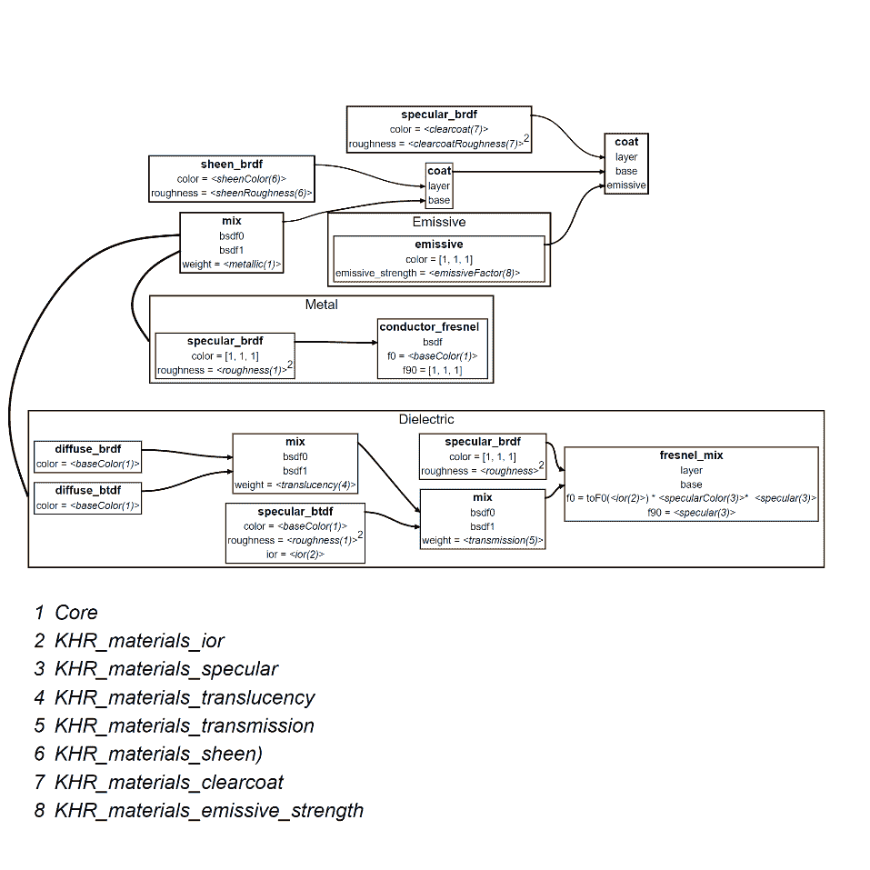
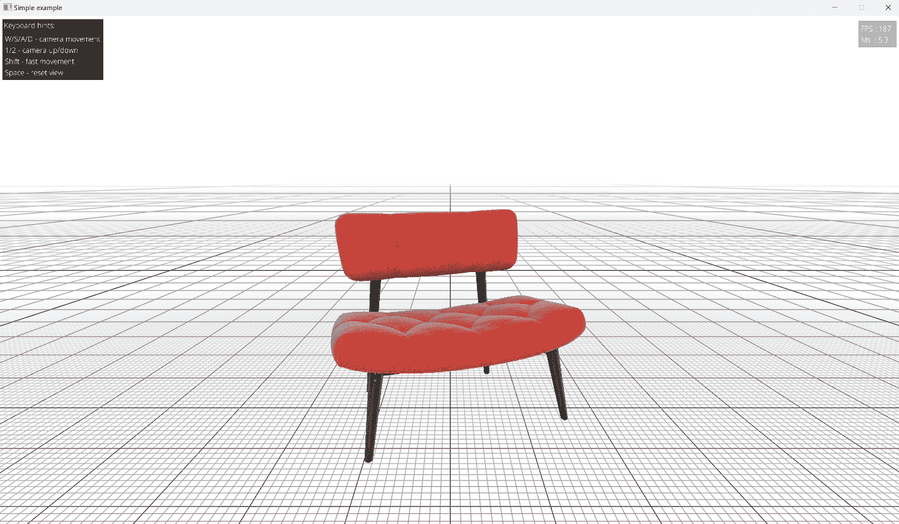
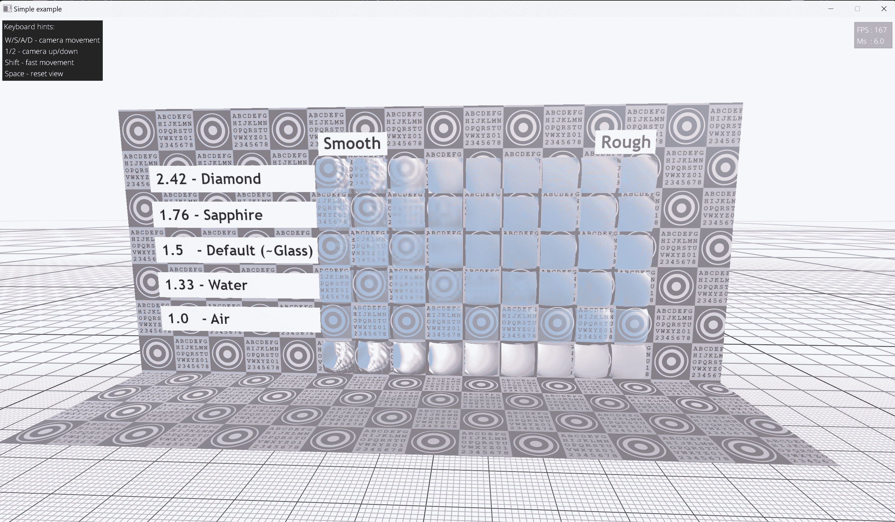
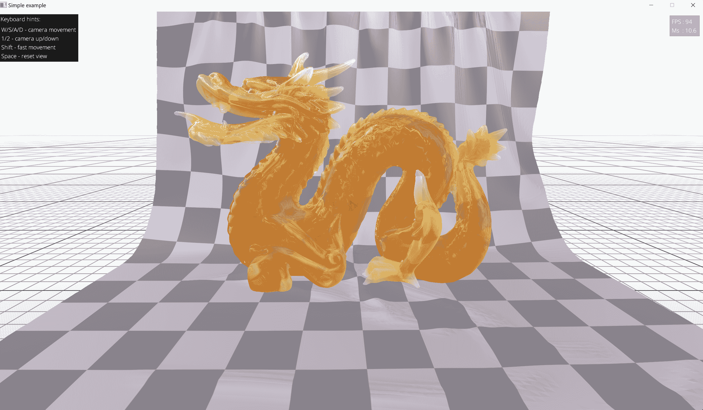
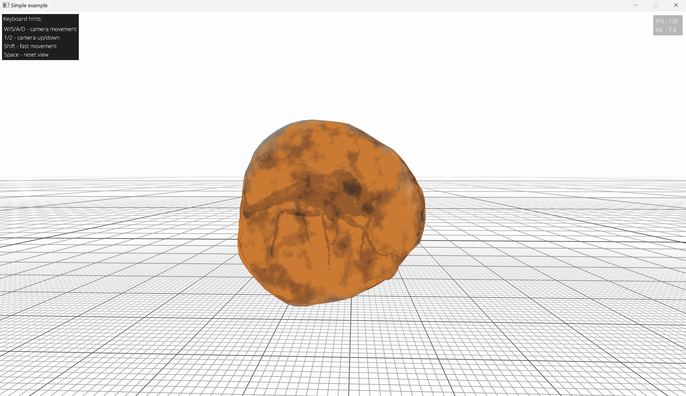
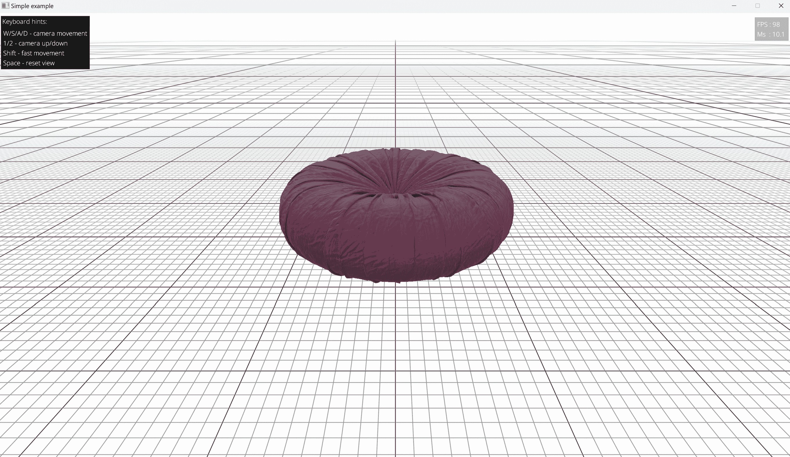
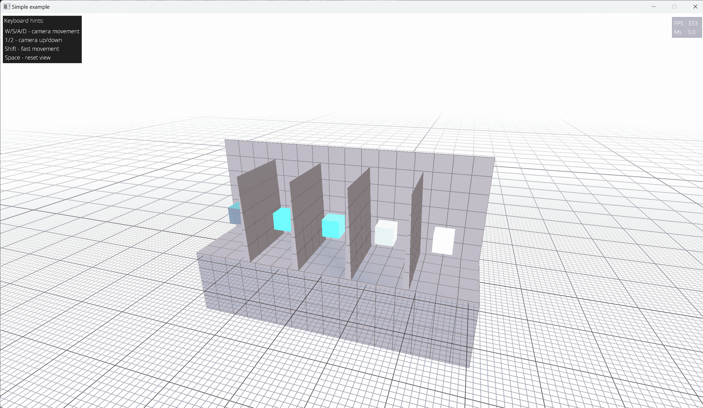
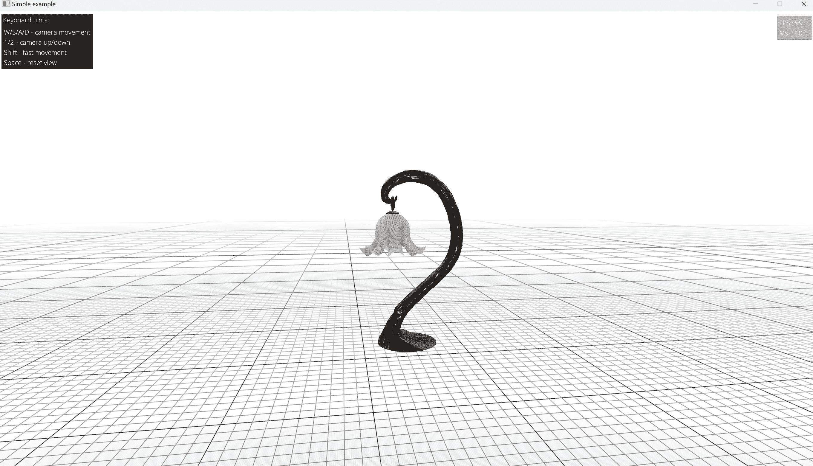

# 7 高级 PBR 扩展

## 加入我们的 Discord 书籍社区


[`packt.link/unitydev`](https://packt.link/unitydev)

在本章中，我们将深入探讨基于基础金属-粗糙度模型的 glTF 高级 PBR 扩展。虽然基础金属-粗糙度模型提供了一个起点，但它无法完全捕捉现实生活材料的全谱。为了解决这个问题，glTF 引入了额外的材质层，每个层都有特定的参数来定义其独特的表现。我们的目标是引导你从零开始实现这些层。我们将介绍层的概念，分解它们背后的某些数学原理，然后展示如何将每一层集成到 GLSL 着色器代码中。

本章提供的 C++ 代码大多适用于我们在这里和本书其余部分将要涵盖的所有食谱。

在本章中，你将学习以下食谱：

+   glTF PBR 扩展简介

+   实现 `KHR_materials_clearcoat` 扩展

+   实现 `KHR_materials_sheen` 扩展

+   实现 `KHR_materials_transmission` 扩展

+   实现 `KHR_materials_volume` 扩展

+   实现 `KHR_materials_ior` 扩展

+   实现 `KHR_materials_specular` 扩展

+   实现 `KHR_materials_emissive_strength` 扩展

+   使用 `KHR_lights_punctual` 扩展增强分析光支持

> 我们的 GLSL 着色器代码基于官方的 Khronos 示例查看器，并作为这些扩展的示例实现。

## glTF PBR 扩展简介

在这个食谱中，我们将探讨 PBR 材料扩展的设计方法，提供丰富的上下文来帮助你实现各种 glTF PBR 扩展。实际代码将在后续食谱中分享，章节结构将遵循 Khronos 开发这些 PBR 扩展的顺序。

PBR 规范迅速发展，读者应意识到，到阅读时，一些扩展可能会被弃用或过时。

### 准备工作

我们假设读者对线性代数和微积分有一些基本了解。建议手头备有 glTF 2.0 认可的扩展规范列表，可以在 [`github.com/KhronosGroup/glTF/blob/main/extensions/README.md`](https://github.com/KhronosGroup/glTF/blob/main/extensions/README.md) 找到。

### glTF 2.0 PBR 模型是如何设计的？

在上一章中，我们探讨了核心的金属-粗糙度 PBR 模型。这个模型非常适合描绘多种金属和非金属材质，但现实世界要复杂得多。

为了更好地捕捉这种复杂性，Khronos 决定不仅仅扩展金属-粗糙度模型。相反，他们引入了一种分层方法，就像洋葱的层一样。这种方法允许你逐渐向 PBR 材料添加复杂性，类似于如何在 Adobe 标准表面[`github.com/Autodesk/standard-surfacehttps://github.com/Autodesk/standard-surface`](https://github.com/Autodesk/standard-surfacehttps://github.com/Autodesk/standard-surface)中构建层。

**分层**通过堆叠多个层来模拟现实世界的材料结构，每个层都有其自己的光交互属性。为了保持物理准确性，第一层，称为基层，应该是完全不透明（如金属表面）或完全透明（如玻璃或皮肤）。之后，可以逐个添加额外的层，称为电介质板。

当光线击中两层之间的边界时，它可以反射并反弹到相反的方向。然而，我们在这里的主要关注点是继续通过材料堆栈的光线。当这束光穿过底层时，它可能被材料吸收。

混合操作为材料建模提供了一种独特的方法。你可以将其视为两种不同材料的统计加权混合，其中你将一定比例的材料`A`与一定比例的材料`B`相结合。虽然这种技术在创造新材料方面非常出色，但重要的是要记住，并非所有组合都是物理上现实的。例如，混合油和水不会产生可信的材料。

当混合操作以线性插值的方式进行时，它自然遵循能量守恒的原则。这意味着结果材料中的总能量保持不变，与物理学的基本定律一致。



图 7.1：glTF PBR 分层和混合

在以下配方中，我们将深入了解几个高级材料层：镜面反光（光泽）、涂层镜面反射和漫反射透射。我们还将探讨如何将这些层组合起来以创建更广泛的外观材料。

### 准备工作

本章使用单个 glTF 查看器示例代码来展示所有配方。`main.cpp`文件在配方之间只有两种变化：它们使用不同的模型文件来演示所涵盖的特定 glTF PBR 扩展，并且初始相机位置被调整以展示模型的美观。

glTF 查看器的源代码本身位于文件`shared/UtilsGLTF.cpp`中。相应的 GLSL 顶点和片段着色器位于`data/shaders/gltf/`文件夹中。

> 这些 GLSL 着色器的结构不同于上一章中介绍的那些。我们将探索每个单独配方中的具体实现差异。

### 如何做到这一点…

让我们回顾一下前一章中我们的 glTF 观察器实现和最新提出的统一版本之间的主要区别。

1.  我们重构了代码，并在 `shared/UtilsGLTF.h` 中引入了一个非常基本的结构来存储所有必要的应用程序数据。本章将解释所有结构成员字段。

```cpp
struct GLTFContext {
  explicit GLTFContext(VulkanApp& app_)
  : app(app_)
  , samplers(app_.ctx_)
  , envMapTextures(app_.ctx_) {}
  GLTFDataHolder glTFDataholder;
  MaterialsPerFrame matPerFrame;
  GLTFGlobalSamplers samplers;
  EnvironmentMapTextures envMapTextures;
  GLTFFrameData frameData;
  std::vector<GLTFTransforms> transforms;
  std::vector<GLTFNode> nodesStorage;
  std::vector<GLTFMesh> meshesStorage;
  std::vector<uint32_t> opaqueNodes;
  std::vector<uint32_t> transmissionNodes;
  std::vector<uint32_t> transparentNodes;
  lvk::Holder<lvk::BufferHandle> envBuffer;
  lvk::Holder<lvk::BufferHandle> perFrameBuffer;
  lvk::Holder<lvk::BufferHandle> transformBuffer;
  lvk::Holder<lvk::RenderPipelineHandle> pipelineSolid;
  lvk::Holder<lvk::RenderPipelineHandle> pipelineTransparent;
  lvk::Holder<lvk::ShaderModuleHandle> vert;
  lvk::Holder<lvk::ShaderModuleHandle> frag;
  lvk::Holder<lvk::BufferHandle> vertexBuffer;
  lvk::Holder<lvk::BufferHandle> indexBuffer;
  lvk::Holder<lvk::BufferHandle> matBuffer;
  lvk::Holder<lvk::TextureHandle> offscreenTex[3] = {};
  uint32_t currentOffscreenTex = 0;
  GLTFNodeRef root;
  VulkanApp& app;
  bool volumetricMaterial = false;
  bool isScreenCopyRequired() const {
    return volumetricMaterial;
  }
};
```

1.  让我们为它引入一个非常基本的加载和渲染 API。`rebuildRenderList` 参数表示应该重建 glTF 节点的模型到世界变换：

```cpp
void loadglTF(GLTFContext& context,
  const char* gltfName, const char* glTFDataPath);
void renderglTF(GLTFContext& context,
  const mat4& model, const mat4& view, const mat4& proj,
  bool rebuildRenderList = false);
```

1.  我们扩展了 GPU 数据结构以包括所需的材质属性，并添加了一个名为 `MaterialType` 的新 `enum`，允许我们根据需要提供材质 ID。上一章 *第六章，使用 glTF 2.0 着色模型的基于物理的渲染* 覆盖了旧材质：未光照、金属-粗糙度和镜面-光泽度。新材质将在本章后续的食谱中介绍。

```cpp
enum MaterialType : uint32_t {
  MaterialType_Invalid            = 0,
  MaterialType_Unlit              = 0xF,
  MaterialType_MetallicRoughness  = 0x1,
  MaterialType_SpecularGlossiness = 0x2,
  MaterialType_Sheen              = 0x4,
  MaterialType_ClearCoat          = 0x8,
  MaterialType_Specular           = 0x10,
  MaterialType_Transmission       = 0x20,
  MaterialType_Volume             = 0x40,
};
```

1.  我们添加了 `3` 个不同的向量容器来保存 glTF 节点的列表：不透明、透明和透射。以下是 `buildTransformsList()` 函数，用于构建节点变换并收集其他节点数据：

```cpp
void buildTransformsList(GLTFContext& gltf) {
  gltf.transforms.clear();
  gltf.opaqueNodes.clear();
  gltf.transmissionNodes.clear();
  gltf.transparentNodes.clear();
```

1.  我们的递归遍历函数的主体被声明为一个局部 C++ lambda。它将所有变换收集到 `gltf.transforms` 中，并将不透明、透明和透射节点添加到它们相应的容器中：

```cpp
 std::function<void(GLTFNodeRef gltfNode)> traverseTree =
    & {
      const GLTFNode& node = gltf.nodesStorage[nodeRef];
      for (GLTFNodeRef meshId : node.meshes) {
        const GLTFMesh& mesh = gltf.meshesStorage[meshId];
        gltf.transforms.push_back({
          .model = node.transform,
          .matId = mesh.matIdx,
          .nodeRef = nodeRef,
          .meshRef = meshId,
          .sortingType = mesh.sortingType });
```

1.  将刚刚添加到 `gltf.transforms` 中的变换索引推送到上述代码块中。

```cpp
 uint32_t lastTransformIndex = gltf.transforms.size() – 1;
        if (mesh.sortingType == SortingType_Transparent) {
          gltf.transparentNodes.push_back(lastTransformIndex);
        } else if (mesh.sortingType==SortingType_Transmission) {
          gltf.transmissionNodes.push_back(lastTransformIndex);
        } else {
          gltf.opaqueNodes.push_back(lastTransformIndex );
        }
      }
      for (GLTFNodeRef child : node.children)
        traverseTree(child);
    };
```

1.  调用 lambda 函数遍历从根节点开始的整个 glTF 节点树，并将所有结果变换存储在缓冲区中：

```cpp
 traverseTree(gltf.root);
  gltf.transformBuffer = gltf.app.ctx_->createBuffer({
    .usage     = lvk::BufferUsageBits_Uniform,
    .storage   = lvk::StorageType_HostVisible,
    .size      = gltf.transforms.size() * sizeof(GLTFTransforms),
    .data      = &gltf.transforms[0],
    .debugName = “Per Frame data” });
};
```

1.  让我们添加一个节点排序函数，以正确渲染 glTF 节点并支持透明度。我们使用一个非常简单的算法，根据相机到节点中心的距离对节点进行排序。为了正确渲染透明节点，它们应该从后向前依次渲染。

```cpp
void sortTransparentNodes(
  GLTFContext& gltf, const vec3& cameraPos) {
  std::sort(
    gltf.transparentNodes.begin(),
    gltf.transparentNodes.end(),
    & {
      float sqrDistA = glm::length2(
        cameraPos-vec3(gltf.transforms[a].model[3]));
      float sqrDistB = glm::length2(
        cameraPos-vec3(gltf.transforms[b].model[3]));
      return sqrDistA < sqrDistB;
  });
}
```

1.  现在我们必须更改实际的渲染函数 `renderGLTF()` 以适应上述所有更改。

1.  首先，我们必须更新变换列表并根据当前相机到 glTF 节点的距离对 glTF 节点进行排序。

```cpp
void renderGLTF(GLTFContext& gltf,
  const mat4& model, const mat4& view, const mat4& proj,
  bool rebuildRenderList)
{
  auto& ctx = gltf.app.ctx_;
  const vec4 camPos = glm::inverse(view)[3];
  if (rebuildRenderList || gltf.transforms.empty()) {
    buildTransformsList(gltf);
  }
  sortTransparentNodes(gltf, camPos);
```

1.  存储每帧的相机参数并准备所有必要的缓冲区和纹理的推送常量：

```cpp
 gltf.frameData = {
    .model     = model,
    .view      = view,
    .proj      = proj,
    .cameraPos = camPos,
  };
  struct PushConstants {
    uint64_t draw;
    uint64_t materials;
    uint64_t environments;
    uint64_t transforms;
    uint32_t envId;
    uint32_t transmissionFramebuffer;
    uint32_t transmissionFramebufferSampler;
  } pushConstants = {
    .draw         = ctx->gpuAddress(gltf.perFrameBuffer),
    .materials    = ctx->gpuAddress(gltf.matBuffer),
    .environments = ctx->gpuAddress(gltf.envBuffer),
    .transforms   = ctx->gpuAddress(gltf.transformBuffer),
    .envId        = 0,
    .transmissionFramebuffer = 0,
    .transmissionFramebufferSampler =
      gltf.samplers.clamp.index(),
  };
  ctx->upload(
    gltf.perFrameBuffer, &gltf.frameData, sizeof(GLTFFrameData));
  …
```

1.  让我们渲染所有不透明节点。对于这个传递，不需要透射帧缓冲区：

```cpp
 const lvk::RenderPass renderPass = {
    .color = { { .loadOp = lvk::LoadOp_Clear,
                 .clearColor = { 1.0f, 1.0f, 1.0f, 1.0f } } },
    .depth = { .loadOp = lvk::LoadOp_Clear, .clearDepth = 1.0f },
  };
  const lvk::Framebuffer framebuffer = {
    .color        = { {
     .texture = screenCopy ?
       gltf.offscreenTex[gltf.currentOffscreenTex] : 
       ctx->getCurrentSwapchainTexture() } },
    .depthStencil = { .texture = gltf.app.getDepthTexture() },
  };
  buf.cmdBeginRendering(renderPass, framebuffer);
  buf.cmdBindVertexBuffer(0, gltf.vertexBuffer, 0);
  buf.cmdBindIndexBuffer(
    gltf.indexBuffer, lvk::IndexFormat_UI32);
  buf.cmdBindDepthState({ .compareOp = lvk::CompareOp_Less,
                          .isDepthWriteEnabled = true });
  buf.cmdBindRenderPipeline(gltf.pipelineSolid);
  buf.cmdPushConstants(pushConstants);
  for (uint32_t transformId : gltf.opaqueNodes) {
    GLTFTransforms transform = gltf.transforms[transformId];
    buf.cmdPushDebugGroupLabel(
      gltf.nodesStorage[transform.nodeRef].name.c_str(),
      0xff0000ff);
    const GLTFMesh submesh =
      gltf.meshesStorage[transform.meshRef];
```

1.  我们使用内置的 GLSL 变量 `gl_BaseInstance` 将 `transformId` 的值传递到着色器中。这样，我们就不必为每个绘制调用更新推送常量。这是最有效的方法。

    > `vkCmdDrawIndexed()` 的 `firstInstance` 参数被分配给内置的 GLSL 变量 `gl_BaseInstance`。这允许你在不涉及任何缓冲区或推送常量的情况下，将任意每绘制调用的 `uint32_t` 值传递到顶点着色器中。这是一个非常快速的技术，应该尽可能使用。

    ```cpp
    vkCmdDrawIndexed(VkCommandBuffer commandBuffer,
                     uint32_t        indexCount,    
                     uint32_t        instanceCount, 
                     uint32_t        firstIndex,
                     int32_t         vertexOffset,
                     uint32_t        firstInstance);
    ```

```cpp
 buf.cmdDrawIndexed(submesh.indexCount, 1,
      submesh.indexOffset, submesh.vertexOffset, transformId);
    buf.cmdPopDebugGroupLabel();
  }
  buf.cmdEndRendering();
  …
```

1.  现在，我们应该在非透明节点之上渲染透明节点。一些透明节点可能需要屏幕拷贝来渲染各种效果，例如体积或折射率。这是一个非常简单的方法来获得它：

```cpp
 if (screenCopy) {
    buf.cmdCopyImage(
      gltf.offscreenTex[gltf.currentOffscreenTex],
      ctx->getCurrentSwapchainTexture(),
      ctx->getDimensions(ctx->getCurrentSwapchainTexture()));
    buf.cmdGenerateMipmap(
      gltf.offscreenTex[gltf.currentOffscreenTex]);
    pushConstants.transmissionFramebuffer =
      gltf.offscreenTex[gltf.currentOffscreenTex].index();
    buf.cmdPushConstants(pushConstants);
  }
```

1.  当我们开始下一个渲染通道并使用离屏纹理时，我们必须正确同步它：

```cpp
 buf.cmdBeginRendering(renderPass, framebuffer, {
    .textures = { lvk::TextureHandle(
      gltf.offscreenTex[gltf.currentOffscreenTex]) } });
  buf.cmdBindVertexBuffer(0, gltf.vertexBuffer, 0);
  buf.cmdBindIndexBuffer(
    gltf.indexBuffer, lvk::IndexFormat_UI32);
  buf.cmdBindDepthState({ .compareOp = lvk::CompareOp_Less,
                          .isDepthWriteEnabled = true });
```

1.  现在我们渲染透射节点：

```cpp
 buf.cmdBindRenderPipeline(gltf.pipelineSolid);
  for (uint32_t transformId : gltf.transmissionNodes) {
    const GLTFTransforms transform =
      gltf.transforms[transformId];
    buf.cmdPushDebugGroupLabel(
      gltf.nodesStorage[transform.nodeRef].name.c_str(),
      0x00FF00ff);
    const GLTFMesh submesh =
      gltf.meshesStorage[transform.meshRef];
    buf.cmdDrawIndexed(submesh.indexCount, 1,
      submesh.indexOffset, submesh.vertexOffset, transformId);
    buf.cmdPopDebugGroupLabel();
  }
```

1.  透明节点最后处理。使用相同的 `gl_BaseInstance` 技巧传递每个 glTF 网格的 `transformId` 值：

```cpp
 buf.cmdBindRenderPipeline(gltf.pipelineTransparent);
  for (uint32_t transformId : gltf.transparentNodes) {
    const GLTFTransforms transform =
      gltf.transforms[transformId];
    buf.cmdPushDebugGroupLabel(
      gltf.nodesStorage[transform.nodeRef].name.c_str(),
      0x00FF00ff);
    const GLTFMesh submesh =
      gltf.meshesStorage[transform.meshRef];
    buf.cmdDrawIndexed(submesh.indexCount, 1,
      submesh.indexOffset, submesh.vertexOffset, transformId);
    buf.cmdPopDebugGroupLabel();
  }
```

1.  一旦命令缓冲区被填满，我们就可以提交它，并以轮询方式使用另一个离屏纹理。

```cpp
 buf.cmdEndRendering();
  ctx->submit(buf, ctx->getCurrentSwapchainTexture());
  gltf.currentOffscreenTex = (gltf.currentOffscreenTex + 1) %
    LVK_ARRAY_NUM_ELEMENTS(gltf.offscreenTex);
```

这是对我们通用 glTF 渲染代码的完整概述。真正的魔法发生在 GLSL 着色器内部。在下一系列的菜谱中，我们将逐步学习如何实现不同的 glTF 材料扩展。

### 还有更多...

Khronos *3D Formats Working Group* 正在通过引入新的扩展规范来不断改进 PBR 材料的功能。要了解已批准扩展的状态，您可以访问 Khronos GitHub 页面：[`github.com/KhronosGroup/glTF/blob/main/extensions/README.md`](https://github.com/KhronosGroup/glTF/blob/main/extensions/README.md)

## 实现 KHR_materials_clearcoat 扩展

**KHR_materials_clearcoat** 扩展通过在另一种材料或表面之上添加一个清晰、反射的层来改进 glTF 的核心 **基于物理的渲染**（**PBR**）模型。此层既反射来自自身的光线，也反射来自下层的光线。此效果包括汽车漆面的光泽效果或抛光鞋的光泽。

这里有一个链接到 Khronos glTF PBR 扩展：[`github.com/KhronosGroup/glTF/blob/main/extensions/2.0/Khronos/KHR_materials_clearcoat/README.md`](https://github.com/KhronosGroup/glTF/blob/main/extensions/2.0/Khronos/KHR_materials_clearcoat/README.md)

### 清漆参数

以下参数由 `KHR_materials_clearcoat` 扩展提供：

*clearcoatFactor / clearcoatTexture*: 此参数表示涂层的强度。可以使用标量因子或纹理进行设置。`0` 的值表示没有涂层，而 `1` 的值表示存在涂层。介于两者之间的值应仅用于涂层和非涂层区域之间的边界。

*clearcoatNormalTexture:* 此参数允许将法线图应用于涂层层，为涂层表面引入变化和细节。

*clearcoatRoughnessFactor / clearcoatRoughnessTexture:* 此参数表示涂层的粗糙度。它可以设置为粗糙度标量因子或粗糙度纹理。它的工作方式与基材料的粗糙度参数类似，但应用于涂层层。

### 清漆层的镜面 BRDF

清漆层的镜面 BRDF 使用了 glTF 2.0 金属-粗糙度材质中的镜面项。然而，为了在使用简单的分层函数时在材料内部保持能量守恒，进行了一些微调。

微面 Fresnel 项使用`NdotV`项而不是`VdotH`项来计算，实际上忽略了清漆层内部的微观表面方向。这种简化是合理的，因为清漆层通常具有非常低的粗糙度，这意味着微面主要与法线方向对齐。因此，`NdotV`变得大约等同于`NdotL`。这种方法通过简单的分层函数确保材料内部的能量守恒，并通过省略`VdotH`项来保持计算效率。

> 如前一章*使用 glTF 2.0 着色模型的物理渲染*中所述，`N`代表表面点的法向量，`V`是从表面指向观察者的向量，`L`是从表面点指向光源的向量，而`H`是位于光源`L`和观察者`V`方向之间的半向量。

在 BRDF 框架内提供的`clearcoat`层实现中，做出了一些假设，这些假设忽略了某些现实世界的材料属性。以下是这些限制的分解：

+   **无限薄的层**：清漆层被视为无限薄，忽略了其实际厚度。

+   **忽略折射**：折射，即光通过清漆层时的弯曲，没有被考虑在内。

+   **独立的 Fresnel 项**：清漆层和底层的折射率被视为独立，它们的 Fresnel 项分别计算，不考虑它们之间的任何相互作用。

+   **省略的散射**：当前模型没有考虑清漆层和底层之间的光散射。

+   **忽略衍射**：衍射效应，即光在微观面边缘的轻微弯曲，没有被考虑在内。

尽管存在这些限制，但清漆层 BRDF 在材料建模中模拟清漆效果是一个有价值的工具。它在计算效率和产生视觉上可信的结果之间取得了良好的平衡，特别是对于低粗糙度的清漆层。

> 重要通知
> 
> > 清漆扩展旨在与 glTF 的核心 PBR 着色模型一起工作，并且与 Unlit 或 Specular-glossiness 等其他着色模型不兼容。然而，它仍然可以与其他 PBR 参数一起使用，例如发射材料，其中发射的光受到清漆层的影响。

### 准备工作

这个菜谱的源代码可以在`Chapter07/01_Clearcoat/`中找到。

### 如何做到这一点...

让我们看看`Chapter07/01_Clearcoat/src/main.cpp`中的 C++代码。

1.  首先，让我们使用我们新的 glTF API 加载一个`.gltf`文件：

```cpp
 VulkanApp app({
      .initialCameraPos    = vec3(0.0f, -0.2f, -1.5f),
      .initialCameraTarget = vec3(0.0f, -0.5f, 0.0f),
  });
  GLTFContext gltf(app);
  loadGLTF(gltf,
    “deps/src/glTF-Sample-Assets/Models/ClearcoatWicker/
      glTF/ClearcoatWicker.gltf”,
    “deps/src/glTF-Sample-Assets/Models/ClearcoatWicker/glTF/”);
```

1.  然后我们使用之前菜谱 *glTF PBR 扩展简介* 中描述的 `renderGLTF()` 函数进行渲染：

```cpp
 const mat4 t = glm::translate(mat4(1.0f), vec3(0, -1, 0));
  app.run(& {
    const mat4 m = t * glm::rotate(
      mat4(1.0f),  (float)glfwGetTime(), vec3(0.0f, 1.0f, 0.0f));
    const mat4 v = app.camera_.getViewMatrix();
    const mat4 p = glm::perspective(
      45.0f, aspectRatio, 0.01f, 100.0f);
    renderGLTF(gltf, m, v, p);
  });
```

为了从 `.gltf` 文件中加载 clearcoat 参数，我们必须对我们的 GLTF 材料加载器进行一些更改。让我们看看完成此操作所需的步骤。

1.  首先，我们应该在文件 `shared/UtilsGLTF.h` 中的 `GLTFMaterialDataGPU` 结构体中添加一些新的成员字段来存储标量值和相应的纹理：

```cpp
struct GLTFMaterialDataGPU {
  …
  vec4 clearcoatTransmissionThickness = vec4(1, 1, 1, 1);
  uint32_t clearCoatTexture                 = 0;
  uint32_t clearCoatTextureSampler          = 0;
  uint32_t clearCoatTextureUV               = 0;
  uint32_t clearCoatRoughnessTexture        = 0;
  uint32_t clearCoatRoughnessTextureSampler = 0;
  uint32_t clearCoatRoughnessTextureUV      = 0;
  uint32_t clearCoatNormalTexture           = 0;
  uint32_t clearCoatNormalTextureSampler    = 0;
  uint32_t clearCoatNormalTextureUV         = 0;
  …
}
```

1.  让我们使用 Assimp 库在 `shared/UtilsGLTF.cpp` 中加载纹理和属性。在这里，我们只强调与 clearcoat 扩展相关的属性：

```cpp
GLTFMaterialDataGPU setupglTFMaterialData(
  const std::unique_ptr<lvk::IContext>& ctx,
  const GLTFGlobalSamplers& samplers,
  const aiMaterial* mtlDescriptor,
  const char* assetFolder,
  GLTFDataHolder& glTFDataholder,
  bool& useVolumetric)
{
  …
  // clearcoat
  loadMaterialTexture(mtlDescriptor, aiTextureType_CLEARCOAT,
    assetFolder, mat.clearCoatTexture, ctx, true, 0);
  loadMaterialTexture(mtlDescriptor, aiTextureType_CLEARCOAT,
    assetFolder, mat.clearCoatRoughnessTexture, ctx, false, 1);
  loadMaterialTexture(mtlDescriptor, aiTextureType_CLEARCOAT,
    assetFolder, mat.clearCoatNormalTexture, ctx, false, 2);
  …
  bool useClearCoat = !mat.clearCoatTexture.empty() ||
                      !mat.clearCoatRoughnessTexture.empty() ||
                      !mat.clearCoatNormalTexture.empty();
  ai_real clearcoatFactor;
  if (mtlDescriptor->Get(AI_MATKEY_CLEARCOAT_FACTOR,
    clearcoatFactor) == AI_SUCCESS) {
    res.clearcoatTransmissionThickness.x = clearcoatFactor;
    useClearCoat = true;
  }
  ai_real clearcoatRoughnessFactor;
  if (mtlDescriptor->Get(AI_MATKEY_CLEARCOAT_ROUGHNESS_FACTOR,
    clearcoatRoughnessFactor) == AI_SUCCESS) {
    res.clearcoatTransmissionThickness.y =
      clearcoatRoughnessFactor;
    useClearCoat = true;
  }
  if (assignUVandSampler(
        samplers, mtlDescriptor, aiTextureType_CLEARCOAT,
        res.clearCoatTextureUV,
        res.clearCoatNormalTextureSampler, 0)) {
    useClearCoat = true;
  }
  if (assignUVandSampler(
        samplers, mtlDescriptor, aiTextureType_CLEARCOAT,
        res.clearCoatRoughnessTextureUV, 
        res.clearCoatRoughnessTextureSampler, 1)) {
    useClearCoat = true;
  }
  if (assignUVandSampler(
        samplers, mtlDescriptor, aiTextureType_CLEARCOAT,
        res.clearCoatNormalTextureUV,
        res.clearCoatNormalTextureSampler, 2)) {
    useClearCoat = true;
  }
  if (useClearCoat) 
    res.materialTypeFlags |= MaterialType_ClearCoat;
```

> 请注意，我们只有在检查通过并且扩展存在于 `.gltf` 文件中时才设置 `MaterialType_ClearCoat` 标志。虽然从技术上讲，始终启用 clearcoat 层是可能的——因为默认设置实际上禁用了它——但这样做效率非常低。clearcoat 层增加了二级 BRDF 样本，这计算成本很高。最好只使用实际需要的昂贵功能！

C++ 的更改到此为止。现在，让我们看看 GLSL 着色器更改，实际的渲染工作就在这里进行：

1.  与为新参数进行的 C++ 更改类似，我们在 `data/shaders/gltf/inputs.frag` 中添加了 GLSL 工具函数，用于从纹理和输入缓冲区中读取 clearcoat 数据。clearcoat 因子和粗糙度分别打包到纹理的 `r` 和 `g` 通道中：

```cpp
float getClearcoatFactor(InputAttributes tc,
                         MetallicRoughnessDataGPU mat)
{
  return textureBindless2D(mat.clearCoatTexture,
    mat.clearCoatTextureSampler,
    tc.uv[mat.clearCoatTextureUV]
  ).r * mat.clearcoatTransmissionThickness.x;
}
float getClearcoatRoughnessFactor(InputAttributes tc,
                                  MetallicRoughnessDataGPU mat)
{
  return textureBindless2D(mat.clearCoatRoughnessTexture,
    mat.clearCoatRoughnessTextureSampler,
    tc.uv[mat.clearCoatRoughnessTextureUV]
  ).g * mat.clearcoatTransmissionThickness.y;
}
```

1.  我们按照本菜谱开头描述的方法计算 clearcoat 贡献。我们使用 GGX BRDF 进行额外的查找，并在 `data/shaders/gltf/main.frag` 中提供 clearcoat 粗糙度、反射率 `clearcoatF0` 和法线作为输入。请注意，我们使用了 IOR 参数，它将在菜谱 *实现 IOR 扩展* 中稍后介绍：

```cpp
 vec3 clearCoatContrib = vec3(0);
  if (isClearCoat) {
    pbrInputs.clearcoatFactor = getClearcoatFactor(tc, mat);
    pbrInputs.clearcoatRoughness =
      clamp(getClearcoatRoughnessFactor(tc, mat), 0.0, 1.0);
    pbrInputs.clearcoatF0 = vec3(pow((pbrInputs.ior - 1.0) /
                            (pbrInputs.ior + 1.0), 2.0));
    pbrInputs.clearcoatF90 = vec3(1.0);
    if (mat.clearCoatNormalTextureUV > -1) {
      pbrInputs.clearcoatNormal = mat3(
        pbrInputs.t, pbrInputs.b, pbrInputs.ng) *
        sampleClearcoatNormal(tc, mat).rgb;
    } else {
      pbrInputs.clearcoatNormal = pbrInputs.ng;
    }
    clearCoatContrib = getIBLRadianceGGX(
      pbrInputs.clearcoatNormal, pbrInputs.v,
      pbrInputs.clearcoatRoughness,
      pbrInputs.clearcoatF0, 1.0, envMap);
  }
```

1.  我们使用类似的方法计算 clearcoat 层的 Fresnel 项。我们应用 Schlick 近似，但使用针对 clearcoat 的特定输入数据：

```cpp
 vec3 clearcoatFresnel = vec3(0);
  if (isClearCoat) {
    clearcoatFresnel = F_Schlick(
      pbrInputs.clearcoatF0,
      pbrInputs.clearcoatF90,
      clampedDot(pbrInputs.clearcoatNormal, pbrInputs.v));
  }
```

1.  最后，在片段着色器 `data/shaders/gltf/main.frag` 的最后，我们在所有层（包括发射层）之上应用 clearcoat 贡献！注意这里的 `sheenColor` 值，它将在下一道菜谱 *实现 sheen 材料扩展* 中介绍。

```cpp
 vec3 color =
    specularColor + diffuseColor + emissiveColor + sheenColor;
  color = color *
    (1.0 - pbrInputs.clearcoatFactor * clearcoatFresnel) +
    clearCoatContrib;
```

这就完成了实现 clearcoat 扩展所需的所有必要的 GLSL 更改。演示应用应该看起来像下面的截图：


图 7.2：glTF PBR KHR_materials_clearcoat 示例

注意球体顶部的光泽层——这就是 clearcoat！恭喜你，我们已经完成了我们的第一个高级 PBR 扩展。

### 还有更多...

Khronos glTF 扩展存储库包括清晰涂层材料的综合参考列表：[`github.com/KhronosGroup/glTF/blob/main/extensions/2.0/Khronos/KHR_materials_clearcoat/README.md`](https://github.com/KhronosGroup/glTF/blob/main/extensions/2.0/Khronos/KHR_materials_clearcoat/README.md)

## 实现 KHR_materials_sheen 扩展

`KHR_materials_sheen` 扩展通过添加模拟丝绸或刷金属等织物上光泽效果的层来改进 glTF 2.0 金属-粗糙度材质。这种增强创造了更真实和视觉上吸引人的光泽高光。

**Sheen BRDF** 位于 glTF 2.0 金属-粗糙度材质之上。如果之前的扩展 `KHR_materials_clearcoat` 也处于活动状态，它将叠加在光泽效果之上。

`sheenColorFactor` 属性控制光泽效果的基本强度，独立于观察角度。值为 `0` 将完全禁用 **光泽**。

### 光泽参数

*sheenColorTexture / sheenColorFactor*: 如果定义了纹理，光泽颜色通过将 `sheenColorFactor` 与纹理的 RGB 值相乘来计算。

*sheenRoughnessTexture / sheenRoughnessFactor:* 如果定义了，光泽粗糙度通过乘以纹理的 alpha 通道值来计算。

如果没有指定纹理，`sheenColorFactor` 直接控制光泽颜色，而 `sheenRoughnessFactor` 直接控制光泽粗糙度。

### 模拟光泽效果

**sheen BRDF** 模拟了光线从绒面材料上散射的方式。它模拟了光线如何从垂直于表面的微小纤维上反射。光泽粗糙度控制这些纤维偏离该方向的程度：

+   较低的光泽粗糙度：纤维更整齐，当光线掠过表面时，会创建更锐利的光泽高光。

+   较高的光泽粗糙度：纤维更分散，导致更柔和的光泽高光。

光泽 BRDF 在数学上基于指数正弦分布，该分布源自微面理论（Conty & Kulla，2017 [`blog.selfshadow.com/publications/s2017-shading-course/#course_content`](https://blog.selfshadow.com/publications/s2017-shading-course/#course_content)）。粗糙度通过 `r=sheenRoughness²` 映射，以便更直观地理解粗糙度变化。

光泽粗糙度独立于材质的基本粗糙度。这使得材质可以具有粗糙的表面纹理（高基本粗糙度），同时仍然显示出锐利的光泽效果（低光泽粗糙度）。

并非所有入射光都与微纤维相互作用。一些光可能直接到达底层，或者在与纤维碰撞之前在其之间反射。这种光的行为受底层 glTF 2.0 PBR 金属-粗糙度材质属性的控制。

### 准备工作

本食谱的源代码可在 `Chapter07/02_Sheen/` 中找到。

### 如何实现它…

与之前的小节 *实现清漆材质扩展* 类似，我们引入了一组新的材质参数。让我们看看 C++ 代码。

1.  让我们加载一个 `.gltf` 文件来演示效果 `Chapter07/02_Sheen/src/main.cpp`：

```cpp
 GLTFContext gltf(app);
  loadGLTF(gltf,
    “deps/src/glTF-Sample-Assets/Models/
      SheenChair/glTF/SheenChair.gltf”,
    “deps/src/glTF-Sample-Assets/Models/SheenChair/glTF/”);
```

1.  在文件 `shared/UtilsGLTF.h` 中，我们在 `GLTFMaterialDataGPU` 结构体中添加了新的成员字段：

```cpp
struct GLTFMaterialDataGPU {
  …
  vec4 sheenFactors       = vec4(1.0f, 1.0f, 1.0f, 1.0f);
  uint32_t sheenColorTexture            = 0;
  uint32_t sheenColorTextureSampler     = 0;
  uint32_t sheenColorTextureUV          = 0;
  uint32_t sheenRoughnessTexture        = 0;
  uint32_t sheenRoughnessTextureSampler = 0;
  uint32_t sheenRoughnessTextureUV      = 0;
```

1.  让我们通过 Assimp 在 `shared/UtilsGLTF.cpp` 中加载新的参数并将它们存储到光泽度材质中。光泽度颜色纹理是 `sRGB`，索引为 `0`，粗糙度纹理的索引为 `1`：

```cpp
 loadMaterialTexture(mtlDescriptor, aiTextureType_SHEEN,
    assetFolder, mat.sheenColorTexture, ctx, true, 0);
  loadMaterialTexture(mtlDescriptor, aiTextureType_SHEEN,
    assetFolder, mat.sheenRoughnessTexture, ctx, false, 1);
  bool useSheen = !mat.sheenColorTexture.empty() ||
                  !mat.sheenRoughnessTexture.empty();
  aiColor4D sheenColorFactor;
  if (mtlDescriptor->Get(AI_MATKEY_SHEEN_COLOR_FACTOR,
      sheenColorFactor) == AI_SUCCESS) {
    res.sheenFactors = vec4(sheenColorFactor.r,
                            sheenColorFactor.g,
                            sheenColorFactor.b,
                            sheenColorFactor.a);
    useSheen      = true;
  }
  ai_real sheenRoughnessFactor;
  if (mtlDescriptor->Get(AI_MATKEY_SHEEN_ROUGHNESS_FACTOR,
      sheenRoughnessFactor) == AI_SUCCESS) {
    res.sheenFactors.w = sheenRoughnessFactor;
    useSheen = true;
  }
  if (assignUVandSampler(samplers, mtlDescriptor,
      aiTextureType_SHEEN, res.sheenColorTextureUV,
      res.sheenColorTextureSampler, 0)) {
    useSheen = true;
  }
  if (assignUVandSampler(samplers, mtlDescriptor,
      aiTextureType_SHEEN, res.sheenRoughnessTextureUV,
      res.sheenRoughnessTextureSampler, 1)) {
    useSheen = true;
  }
  if (useSheen) res.materialTypeFlags |= MaterialType_Sheen;
  …
```

如您所见，我们遵循与清漆扩展相同的模式，并且仅在使用此扩展时设置标志 `MaterialType_Sheen`。这就是主要的 C++ 代码。

光泽度扩展需要一个不同的 BRDF 函数，这在之前的 *第六章，使用 glTF 2.0 着色模型进行基于物理的渲染* 中的 *预计算 BRDF 查找表* 小节中讨论过。我们建议回顾那个小节以刷新您对预计算 BRDF LUT 工作原理的理解，并重新审视实现细节。

现在，让我们看看遵循类似模式的 GLSL 着色器代码更改：

1.  让我们在 `data/shaders/gltf/inputs.frag` 中引入一些实用函数。我们可以通过预先乘以光泽度因子来简化这些函数。在 C++ 代码中，我们将 `sheenColorTexture` 和 `sheenRoughnessTexture` 设置为使用白色 1x1 纹理，以防在 `.gltf` 资产中没有提供纹理数据。在这种情况下，总是正确地将这些值乘以单位因子。我们仍然会对这个小型纹理进行纹理查找，但开销最小。这些小型纹理应该始终适合 GPU 的最快缓存：

```cpp
vec4 getSheenColorFactor(InputAttributes tc,
  MetallicRoughnessDataGPU mat) {
  return vec4(mat.sheenFactors.xyz, 1.0f) *
    textureBindless2D(mat.sheenColorTexture,
                      mat.sheenColorTextureSampler,
                      tc.uv[mat.sheenColorTextureUV]);
}
float getSheenRoughnessFactor(InputAttributes tc,
  MetallicRoughnessDataGPU mat) {
  return mat.sheenFactors.a * textureBindless2D(
    mat.sheenRoughnessTexture,
    mat.sheenRoughnessTextureSampler,
    tc.uv[mat.sheenRoughnessTextureUV]).a;
}
```

1.  光泽度扩展的 GLSL 代码分散在主片段着色器 `data/shaders/gltf/main.frag` 和 PBR 模块 `data/shaders/gltf/PBR.sp` 之间。在 `main.frag` 中，我们应用光泽度参数：

```cpp
 …
  if (isSheen) {
    pbrInputs.sheenColorFactor =
      getSheenColorFactor(tc, mat).rgb;
    pbrInputs.sheenRoughnessFactor =
      getSheenRoughnessFactor(tc, mat);
  }
  …
```

在 IBL 计算的下一步中，我们累积使用 Charlie 分布计算的光泽度贡献：

```cpp
 vec3 sheenColor = vec3(0);
  if (isSheen) {
    sheenColor += getIBLRadianceCharlie(pbrInputs, envMap);
  }
```

1.  让我们看看文件 `data/shaders/gltf/PBR.sp` 中 `getIBLRadianceCharlie()` 的实现。这个函数与用于金属-粗糙度的 `getIBLRadianceGGX()` 类似，但更简单。光泽度扩展提供了自己的粗糙度值，因此不需要感知调整。我们在这里要做的只是将 `sheenRoughnessFactor` 乘以总的米普级数 `mipCount` 以确定正确的米普级，采样预计算的环境图，然后将其乘以 `BRDF` 和 `sheenColor`。

```cpp
vec3 getIBLRadianceCharlie(PBRInfo pbrInputs,
  EnvironmentMapDataGPU envMap) {
  float sheenRoughness = pbrInputs.sheenRoughnessFactor;
  vec3 sheenColor = pbrInputs.sheenColorFactor;
  float mipCount = float(sampleEnvMapQueryLevels(envMap));
  float lod = sheenRoughness * float(mipCount - 1);
  vec3 reflection =
    normalize(reflect(-pbrInputs.v, pbrInputs.n));
  vec2 brdfSamplePoint = clamp(vec2(pbrInputs.NdotV,
    sheenRoughness), vec2(0.0, 0.0), vec2(1.0, 1.0));
  float brdf = sampleBRDF_LUT(brdfSamplePoint, envMap).b;
  vec3 sheenSample = sampleCharlieEnvMapLod(
    reflection.xyz, lod, envMap).rgb;
  return sheenSample * sheenColor * brdf;
}
```

1.  让我们回到 `data/shaders/gltf/main.frag`。我们根据 `occlusionStrength` 的值修改光泽度贡献。光的 l 光泽度计算 `lights_sheen` 将在本章的最后一个小节 *扩展分析光支持* 中介绍。现在，假设它只是零。

```cpp
 vec3 lights_sheen = vec3(0);
  sheenColor = lights_sheen +
    mix(sheenColor, sheenColor * occlusion, occlusionStrength);
```

这是实现 Sheen 扩展所需的所有额外代码。运行中的演示应用应该看起来如下截图所示：



图 7.3：glTF PBR KHR_materials_sheen 示例

### 还有更多...

Khronos glTF 扩展存储库有一个关于 Sheen 材料的综合参考列表：[`github.com/KhronosGroup/glTF/blob/main/extensions/2.0/Khronos/KHR_materials_sheen/README.md`](https://github.com/KhronosGroup/glTF/blob/main/extensions/2.0/Khronos/KHR_materials_sheen/README.md)。

## 实现 KHR_materials_transmission 扩展

glTF 2.0 核心规范使用了一种处理透明度的基本方法，称为 **alpha-as-coverage**。虽然这种方法对于像纱或麻布这样的简单材料效果很好，但它并不能很好地表示像玻璃或塑料这样的更复杂透明材料。这些材料涉及复杂的光学相互作用——如反射、折射、吸收和散射——而 alpha-as-coverage 无法独立准确地模拟这些相互作用。

Alpha-as-coverage 基本上决定了表面是否存在。值为 `0` 表示没有任何东西可见，而值为 `1` 表示表面是实心的。这种方法对于有孔或缝隙的材料效果很好，这些缝隙可以让光线通过而不实际进入材料。然而，对于像玻璃这样的材料，光线与表面的相互作用更为复杂——如反射、折射，甚至吸收。Alpha-as-coverage 无法处理这些类型的相互作用。此外，它还会影响反射的强度，使得更透明的材料反射更弱。这与现实世界中的透明材料相反，后者即使在透明时也常常有强烈的反射。

为了克服 alpha-as-coverage 的限制，`KHR_materials_transmission` 扩展提供了一种在 glTF 中更真实地渲染透明材料的方法。它允许根据入射角和光的波长来模拟吸收、反射和透射光线的材料。这个扩展对于准确表示像塑料和玻璃这样的薄表面材料特别有用。

`KHR_materials_transmission` 扩展针对的是光学透明度最简单的情况：无限薄的、无折射、散射或色散的材料。这种简化使得折射和吸收的计算变得高效。

### 透射参数

`KHR_materials_transmission` 扩展为定义材料的透射特性添加了新的属性：

*transmissionFactor*：一个介于 `0` 和 `1` 之间的标量值，表示材料的整体不透明度。值为 `0` 表示材料完全不透明，而值为 `1` 表示材料完全透明。

*transmissionFilter*：一个颜色值，会改变通过材料的灯光颜色。

### 透射 BTDF

`KHR_materials_transmission` 扩展引入了一个基于微 facet 模型的镜面 **BTDF**（双向透射分布函数）。它使用与镜面 **BRDF**（双向反射分布函数）相同的 **Trowbridge-Reitz** 分布，但沿着视向量而不是反射方向进行采样。这种方法模拟了微 facet 如何像微小的棱镜一样作用，使透射光变得模糊。

透射过程被建模为两个背对背的表面，代表一种薄材料。这种方法通过避免平均折射的复杂性，而是专注于微 facet 层的折射，简化了过程。粗糙度参数影响反射和透射，因为微 facet 分布影响表面的两侧。让我们看看如何实现这个 glTF 扩展。

### 准备工作

本食谱的源代码位于 `Chapter07/03_Transmission/`。

### 如何做到这一点…

这是本章讨论的最复杂的扩展，需要更改 C++ 代码以处理透明度渲染的复杂性。除了更新 C++ 渲染代码外，我们还需要在 GLSL 着色器代码中实现镜面 BTDF，并将两层混合结合起来，以准确地表示薄材料。

让我们从 C++ 代码更改开始。

1.  首先，我们应该在 `Chapter07/03_Transmission/src/main.cpp` 中加载相应的 `.gltf` 样本模型：

```cpp
 GLTFContext gltf(app);
  loadGLTF(gltf, “deps/src/glTF-Sample-Assets/Models/
      TransmissionRoughnessTest/glTF/
      TransmissionRoughnessTest.gltf”,
    “deps/src/glTF-Sample-Assets/Models/
      TransmissionRoughnessTest/glTF/”);
```

1.  参数解析在 `shared/UtilsGLTF.cpp` 中，相当简单：

```cpp
 loadMaterialTexture(mtlDescriptor, aiTextureType_TRANSMISSION,
    assetFolder, mat.transmissionTexture, ctx, true, 0);
  …
  bool useTransmission = !mat.transmissionTexture.empty();
  ai_real transmissionFactor = 0.0f;
  if (mtlDescriptor->Get(AI_MATKEY_TRANSMISSION_FACTOR,
      transmissionFactor) == AI_SUCCESS) {
    res.clearcoatTransmissionThickness.z = transmissionFactor;
    useTransmission = true;
  }
  if (useTransmission) {
    res.materialTypeFlags |= MaterialType_Transmission;
    useVolumetric = true;
  }
  assignUVandSampler(samplers, mtlDescriptor,
    aiTextureType_TRANSMISSION, res.transmissionTextureUV,
    res.transmissionTextureSampler, 0);
```

对渲染函数 `renderGLTF()` 已进行了重大更改。我们在第一个食谱 *glTF PBR 扩展简介* 中提到了一些这些更改。现在，让我们更详细地看看这些更改。为了有效地渲染透明和透射表面，我们需要遵循以下步骤：

1.  准备完全不透明、透射和透明节点的列表，因为这些节点应该按照特定顺序渲染：首先是不透明节点，然后是透射，最后是透明节点。

    > 请记住，渲染透射节点并不会自动使它们变得透明！相反，我们需要使用渲染不透明节点的结果。为此，我们必须创建渲染表面的副本，并将其用作透射节点的输入。

1.  预分配一个离屏纹理来存储渲染的不透明节点：

```cpp
 if (gltf.offscreenTex[0].empty() || isSizeChanged) {
    const lvk::Dimensions res =
      ctx->getDimensions(ctx->getCurrentSwapchainTexture());
    for (Holder<TextureHandle>& holder : gltf.offscreenTex) {
      holder = ctx->createTexture({
          .type         = lvk::TextureType_2D,
          .format       = ctx->getSwapchainFormat(),
          .dimensions   = {res.width, res.height},
          .usage        = lvk::TextureUsageBits_Attachment |
                          lvk::TextureUsageBits_Sampled,
          .numMipLevels = lvk::calcNumMipLevels(res.width,
                                                res.height),
          .debugName    = “offscreenTex” });
    }
  }
```

1.  在必要时创建屏幕副本，并将其句柄作为 `transmissionFramebuffer:` 传递。

```cpp
 const bool screenCopy = gltf.isScreenCopyRequired();
  if (screenCopy) {
    buf.cmdCopyImage(
      gltf.offscreenTex[gltf.currentOffscreenTex],],
      ctx->getCurrentSwapchainTexture(),
      ctx->getDimensions(ctx->getCurrentSwapchainTexture()));
    buf.cmdGenerateMipmap(
      gltf.offscreenTex[gltf.currentOffscreenTex]);
    pushConstants.transmissionFramebuffer =
      gltf.offscreenTex[gltf.currentOffscreenTex].index();
    buf.cmdPushConstants(pushConstants);
  }
```

1.  现在，我们可以使用屏幕副本作为输入来渲染透射节点。重要的是要注意，我们在这个过程中不使用 alpha 混合。节点仍然以不透明的方式渲染，我们通过采样屏幕副本来模拟透明度。我们还在这里为 LightweightVK 指定了一个纹理依赖项，以确保应用正确的 Vulkan 障碍：

```cpp
 buf.cmdBeginRendering(renderPass, framebuffer, { .textures = {
      lvk::TextureHandle(
        gltf.offscreenTex[gltf.currentOffscreenTex]) } });
  buf.cmdBindVertexBuffer(0, gltf.vertexBuffer, 0);
  buf.cmdBindIndexBuffer(
    gltf.indexBuffer, lvk::IndexFormat_UI32);
  buf.cmdBindDepthState({ .compareOp = lvk::CompareOp_Less,
                          .isDepthWriteEnabled = true });
  buf.cmdBindRenderPipeline(gltf.pipelineSolid);
  for (uint32_t transformId : gltf.transmissionNodes) {
    const GLTFTransforms transform =
      gltf.transforms[transformId];
    const GLTFMesh submesh =
      gltf.meshesStorage[transform.meshRef];
    buf.cmdDrawIndexed(submesh.indexCount, 1,
      submesh.indexOffset, submesh.vertexOffset, transformId);
  }
```

1.  下一步是按照前后顺序渲染所有透明节点。我们没有更改推送常量，这些透明节点使用与输入相同的离屏纹理：

```cpp
 buf.cmdBindRenderPipeline(gltf.pipelineTransparent);
  for (uint32_t transformId : gltf.transparentNodes) {
    const GLTFTransforms transform =
      gltf.transforms[transformId];

    const GLTFMesh submesh =
      gltf.meshesStorage[transform.meshRef];
    buf.cmdDrawIndexed(submesh.indexCount, 1,
      submesh.indexOffset, submesh.vertexOffset, transformId);
  }}
```

C++的更改就到这里。现在让我们看看 GLSL 着色器的更改。

1.  首先，我们在`data/shaders/gltf/inputs.frag`中引入一个实用函数来读取材料输入。传输因子存储在纹理的`r`通道中：

```cpp
float getTransmissionFactor(InputAttributes tc,
  MetallicRoughnessDataGPU mat) {
  return mat.clearcoatTransmissionThickness.z
         textureBindless2D(mat.transmissionTexture,
           mat.transmissionTextureSampler,
           tc.uv[mat.transmissionTextureUV]
         ).r;
}
```

1.  然后，如果此材料的传输扩展被启用，我们在`data/shaders/gltf/main.frag`中填充输入：

```cpp
 if (isTransmission) {
    pbrInputs.transmissionFactor =
      getTransmissionFactor(tc, mat);
  }
```

1.  我们计算传输贡献。体积部分将在我们关于`KHR_materials_volume`扩展的下一个配方中详细说明：*实现体积扩展*。在没有体积扩展的纯传输实现中，传输部分将与 GGX/Lambertian 类似，但不是使用反射向量，而是使用点积`NdotV`。仅实现传输扩展而不支持体积是不切实际的，因为体积扩展提供了更大的灵活性来表示折射、吸收或散射等效果，而不会在传输之上增加过多的复杂性：

```cpp
 vec3 transmission = vec3(0,0,0);
  if (isTransmission) {
    transmission += getIBLVolumeRefraction(
      pbrInputs.n,
      pbrInputs.v,
      pbrInputs.perceptualRoughness,
      pbrInputs.diffuseColor,
      pbrInputs.reflectance0,
      pbrInputs.reflectance90,
      worldPos, getModel(), getViewProjection(),
      pbrInputs.ior,
      pbrInputs.thickness,
      pbrInputs.attenuation.rgb,
      pbrInputs.attenuation.a);
  }
```

1.  最后，我们将计算出的传输值添加到由`transmissionFactor`缩放的漫反射贡献中：

```cpp
 if (isTransmission) {
    diffuseColor = mix(diffuseColor, transmission,
                       pbrInputs.transmissionFactor);
  }
```

生成的渲染 3D 模型应如下截图所示：



图 7.4：glTF PBR KHR_materials_transmission 示例

### 还有更多...

在实时中高效且准确地渲染透明物体具有挑战性，尤其是在处理重叠的透明多边形时。依赖于顺序的透明度和需要为吸收和反射执行单独的混合操作等问题增加了复杂性。我们将在*第十一章，高级渲染技术和优化*中解决一些这些问题。

Khronos 扩展存储库为传输扩展提供了全面的参考材料：[`github.com/KhronosGroup/glTF/blob/main/extensions/2.0/Khronos/KHR_materials_transmission/README.md`](https://github.com/KhronosGroup/glTF/blob/main/extensions/2.0/Khronos/KHR_materials_transmission/README.md)。

## 实现 KHR_materials_volume 扩展

`KHR_materials_volume`扩展为 glTF 2.0 生态系统添加了体积效果，使得可以创建具有深度和内部结构的材料。这对于准确渲染烟雾、雾、云和半透明物体至关重要。

体积效果与基于表面的材料不同。基于表面的材料关注光线与表面的相互作用，而体积材料描述光线通过介质的方式。这包括模拟光线在通过体积时的散射和吸收。

为了创建逼真的体积效果，`KHR_materials_volume` 扩展需要与其他定义材料表面与光线交互的扩展协同工作。`KHR_materials_transmission` 扩展在这里是关键，因为它允许光线穿过表面并进入体积。一旦进入，光线与材料的交互不再受表面属性的影响。相反，光线穿过体积，经历折射和衰减。当它离开体积时，其方向由它离开体积边界的角度决定。

让我们探索如何将此扩展添加到我们的 glTF 渲染器中。

### 体积参数

`KHR_materials_volume` 扩展定义以下参数来描述体积材料：

+   **thicknessFactor**：一个表示体积基础厚度的标量浮点值。此值乘以厚度纹理值（如果可用）以确定表面任何点的最终厚度。

+   **attenuationDistance**：一个表示体积密度随距离降低的距离的浮点值。此参数控制体积不透明度随光线通过而迅速减淡的速度。

+   **attenuationColor**：一个表示体积衰减的基础颜色的颜色值。此颜色影响光线在穿过体积时的吸收情况。

+   **thicknessTexture**：一个可选的纹理，它提供了关于体积厚度额外的细节。纹理中的值会乘以 `thicknessFactor` 以确定表面每个点的最终厚度。

这些参数是如何一起工作的：

+   **Thickness**：`thicknessFactor` 和 `thicknessTexture` 相乘以定义体积的深度。较高的厚度值会导致体积更厚。

+   **Attenuation**：`attenuationDistance` 和 `attenuationColor` 控制光线在穿过体积时的吸收情况。`attenuationDistance` 的较小值会导致更快的衰减。`attenuationColor` 的值决定了由于吸收而产生的颜色变化。

> 目前，`KHR_materials_volume` 扩展假设体积是均匀的，其中材料属性在整个体积中是均匀的。未来的扩展可能会添加对具有不同属性的非均匀体积的支持。

### 准备工作

此菜谱的源代码可以在 `Chapter07/04_Volume/` 中找到。请查阅之前的菜谱 *实现传输扩展*，其中我们介绍了传输和体积 C++ 渲染流程。

### 如何实现...

此扩展只需要在我们的现有 C++ 和 GLSL 着色器代码中进行少量更改。此扩展需要 `KHR_materials_transmission` 支持，并且仅与其一起工作。

让我们探索如何使用 C++.++ 代码创建高级体积效果，如折射、吸收或散射。

1.  首先，我们在 `Chapter07/04_Volume/main.cpp` 中加载相应的 `.gltf` 模型：

```cpp
 GLTFContext gltf(app);
  loadGLTF(gltf, “deps/src/glTF-Sample-Assets/Models/
    DragonAttenuation/glTF/DragonAttenuation.gltf”,
   “deps/src/glTF-Sample-Assets/Models/DragonAttenuation/glTF/”);
```

1.  使用 Assimp 在`shared/UtilsGLTF.cpp`中解析体积参数：

```cpp
 …
  loadMaterialTexture(mtlDescriptor, aiTextureType_TRANSMISSION,
    assetFolder, mat.thicknessTexture, ctx, true, 1);
  bool useVolume = !mat.thicknessTexture.empty();
  ai_real thicknessFactor = 0.0f;
  if (mtlDescriptor->Get(AI_MATKEY_VOLUME_THICKNESS_FACTOR,
      thicknessFactor) == AI_SUCCESS) {
    res.clearcoatTransmissionThickness.w = thicknessFactor;
    useVolume = true;
  }
  ai_real attenuationDistance = 0.0f;
  if (mtlDescriptor->Get(AI_MATKEY_VOLUME_ATTENUATION_DISTANCE,
      attenuationDistance) == AI_SUCCESS) {
    res.attenuation.w = attenuationDistance;
    useVolume =      true;
  }
  aiColor4D volumeAttnuationColorvolumeAttnuationColore;
  if (mtlDescriptor->Get(AI_MATKEY_VOLUME_ATTENUATION_COLOR,
      volumeAttnuationColorvolumeAttnuationColore)==AI_SUCCESS) {
    res.attenuation.x =
      volumeAttnuationColorvolumeAttnuationColore.r;
    res.attenuation.y =
      volumeAttnuationColorvolumeAttnuationColore.g;
    res.attenuation.z =
      volumeAttnuationColorvolumeAttnuationColore.b;
    useVolume = true;
  }
  if (useVolume) {
    res.materialTypeFlags |= MaterialType_Transmission |
                             MaterialType_Volume;
    useVolumetric = true;
  }
  assignUVandSampler(samplers, mtlDescriptor,
    aiTextureType_TRANSMISSION, res.thicknessTextureUV,
    res.thicknessTextureSampler, 1);
  …
```

大部分的魔法都隐藏在 GLSL 着色器中。让我们进入`data/shaders/gltf/PBR.sp`并检查重要的辅助函数。

1.  函数`getVolumeTransmissionRay()`计算折射光线的方向`refractionVector`，并使用`modelScale`因子在体积内获取实际的查找向量。请注意，`thickness`因子被设计为归一化到网格的实际比例。

```cpp
vec3 getVolumeTransmissionRay(
  vec3 n, vec3 v, float thickness, float ior, mat4 modelMatrix)
{
  vec3 refractionVector = refract(-v, n, 1.0 / ior);
```

1.  计算模型矩阵的旋转无关缩放。`thickness`因子在局部空间中指定：

```cpp
 vec3 modelScale = vec3(length(modelMatrix[0].xyz),
                         length(modelMatrix[1].xyz),
                         length(modelMatrix[2].xyz));
  return
    normalize(refractionVector) * thickness * modelScale.xyz;
}
```

另一个辅助函数是`getIBLVolumeRefraction()`。此函数有几个重要步骤：

1.  第一步是获取一个透射光线`transmissionRay`并计算最终的折射位置：

```cpp
vec3 getIBLVolumeRefraction(vec3 n, vec3 v,
  float perceptualRoughness, vec3 baseColor, vec3 f0, vec3 f90,
  vec3 position, mat4 modelMatrix, mat4 viewProjMatrix,
  float ior, float thickness, vec3 attenuationColor,
  float attenuationDistance)
{
  vec3 transmissionRay =
    getVolumeTransmissionRay(n, v, thickness, ior, modelMatrix);
  vec3 refractedRayExit = position + transmissionRay;
```

1.  我们将折射向量投影到帧缓冲区，并将其映射到归一化设备坐标以采样折射光线击中帧缓冲区的像素的颜色。折射的帧缓冲区坐标应从`-1...+1`范围转换为`0...1`，然后垂直翻转：

```cpp
 vec4 ndcPos = viewProjMatrix * vec4(refractedRayExit, 1.0);
  vec2 refractionCoords = ndcPos.xy / ndcPos.w;
  refractionCoords += 1.0;
  refractionCoords /= 2.0;
  refractionCoords.y = 1.0 - refractionCoords.y;
  vec3 transmittedLight = getTransmissionSample(
    refractionCoords, perceptualRoughness, ior);
```

1.  之后，我们应用体积衰减并采样 GGX BRDF 以获取镜面分量，并通过`baseColor`和`attenuatedColor`对其进行调制：

```cpp
 vec3 attenuatedColor = applyVolumeAttenuation(
    transmittedLight,
    length(transmissionRay), attenuationColor,
    attenuationDistance);
  float NdotV = clampedDot(n, v);
  vec2 brdfSamplePoint = clamp(vec2(NdotV, perceptualRoughness),
    vec2(0.0, 0.0), vec2(1.0, 1.0));
  vec2 brdf = sampleBRDF_LUT(brdfSamplePoint,
    getEnvironmentMap(getEnvironmentId())).rg;
  vec3 specularColor = f0 * brdf.x + f90 * brdf.y;
  return (1.0 - specularColor) * attenuatedColor * baseColor;
}
```

1.  这是函数`getTransmissionSample()`。我们使用先前的配方*实现透射扩展*中解释的帧缓冲区副本：

```cpp
vec3 getTransmissionSample(
  vec2 fragCoord, float roughness, float ior)
{
  const ivec2 size =
    textureBindlessSize2D(perFrame.transmissionFramebuffer);
  const vec2 uv = fragCoord;
  float framebufferLod =
    log2(float(size.x)) * applyIorToRoughness(roughness, ior);
  vec3 transmittedLight = textureBindless2DLod(
    perFrame.transmissionFramebuffer,
    perFrame.transmissionFramebufferSampler,
    uv, framebufferLod).rgb;
  return transmittedLight;
}
```

1.  辅助函数`applyVolumeAttenuation()`看起来如下。`0`的衰减距离意味着透射颜色完全没有衰减。光衰减是使用 Beer-Lambert 定律计算的[`en.wikipedia.org/wiki/Beer%E2%80%93Lambert_law`](https://en.wikipedia.org/wiki/Beer%E2%80%93Lambert_law)：

```cpp
vec3 applyVolumeAttenuation(vec3 radiance,
  float transmissionDistance, vec3 attenuationColor,
  float attenuationDistance)
{
  if (attenuationDistance == 0.0) return radiance;
  vec3 attenuationCoefficient =
    -log(attenuationColor) / attenuationDistance;
  vec3 transmittance =
    exp(-attenuationCoefficient * transmissionDistance);
  return transmittance * radiance;
}
```

1.  现在，我们可以回到`data/shaders/gltf/main.frag`并使用`getIBLVolumeRefraction()`，以及其他在先前的配方*实现透射扩展*中描述的辅助函数：

```cpp
 …
  vec3 transmission = vec3(0,0,0);
  if (isTransmission) {
    transmission += getIBLVolumeRefraction(
      pbrInputs.n, pbrInputs.v,
      pbrInputs.perceptualRoughness,
      pbrInputs.diffuseColor, pbrInputs.reflectance0,
      pbrInputs.reflectance90,
      worldPos, getModel(), getViewProjection(),
      pbrInputs.ior, pbrInputs.thickness,
      pbrInputs.attenuation.rgb, pbrInputs.attenuation.w);
  }
```

结果的演示应用程序应该渲染一个半透明的龙，类似于下面的截图。你可以围绕龙移动相机来观察光线从不同角度与体积的交互。这将允许你看到光线如何穿过介质并与体积材料交互。



在我们探索了一系列复杂的 PBR glTF 扩展之后，是时候转换方向了。让我们看看一些更直接的东西：实现**折射率**扩展。这个更简单的扩展是继续构建你的理解的好方法，同时让你从我们之前覆盖的更复杂主题中休息一下。

### 还有更多...

实现此扩展的另一种方法可能涉及体积光线投射或光线追踪。我们将此留作读者练习。

Khronos 扩展存储库为此扩展提供了全面的参考材料：[`github.com/KhronosGroup/glTF/blob/main/extensions/2.0/Khronos/KHR_materials_volume/README.md#overview`](https://github.com/KhronosGroup/glTF/blob/main/extensions/2.0/Khronos/KHR_materials_volume/README.md#overview)。

## 实现 KHR_materials_ior 扩展

glTF 2.0 的 `KHR_materials_ior` 扩展为材质添加了**折射率**（**IOR**）的概念，允许更精确和逼真的透明物体模拟。折射率是关键材质属性，决定了光线通过物质时的弯曲程度 [`en.wikipedia.org/wiki/Refractive_index`](https://en.wikipedia.org/wiki/Refractive_index)。

**IOR** 是一个无量纲数，表示光在真空中速度与在特定介质中速度的比值。不同材料有不同的 IOR 值，这影响了光线进入或离开材料时的弯曲程度。较高的 IOR 意味着更多的折射。例如，空气的 IOR 接近 `1`，水的 IOR 大约是 `1.33`，而玻璃的 IOR 大约是 `1.5`。

### IOR 参数

`KHR_materials_ior` 扩展向 glTF 材质定义添加了一个属性：

*ior*：表示材料折射率的浮点值。

此值与 `KHR_materials_transmission` 扩展结合使用，以计算光线通过材料时的折射方向。

### 准备工作

此菜谱的源代码可在 `Chapter07/05_IOR/` 中找到。查看菜谱 *实现传输扩展* 以回顾 `KHR_materials_transmission` 的实现方式。

### 如何实现它...

此扩展只需对 C++ 和 GLSL 着色器代码进行少量更改。让我们从 C++ 开始。

1.  在 `Chapter07/05_IOR/main.cpp` 中，加载相应的 `.gltf` 模型：

```cpp
 GLTFContext gltf(app);
  loadGLTF(gltf,
    “deps/src/glTF-Sample-Assets/Models/
      MosquitoInAmber/glTF/MosquitoInAmber.gltf”,
    “deps/src/glTF-Sample-Assets/Models/MosquitoInAmber/glTF/”);
```

1.  这里是 `shared/UtilsGLTF.cpp` 中用于使用 Assimp 解析 IOR 材质参数的代码。你会注意到我们没有设置任何材质标志，这不是必需的。IOR 只是一个值，不会改变着色器的功能。

```cpp
ai_real ior;
if (mtlDescriptor->Get(AI_MATKEY_REFRACTI, ior) == AI_SUCCESS) {
  res.ior = ior;
}
```

下面是 GLSL 着色器代码。我们需要修改几行：

1.  第一行在 PBR 模块 `data/shaders/gltf/PBR.sp` 中的函数 `calculatePBRInputsMetallicRoughness()` 中。默认折射率值 `ior = 1.5` 导致 `f0` 项计算为 `0.04`：

```cpp
PBRInfo calculatePBRInputsMetallicRoughness(InputAttributes tc,
  vec4 albedo, vec4 mrSample, MetallicRoughnessDataGPU mat) {
  PBRInfo pbrInputs;
  …
  vec3 f0 = isSpecularGlossiness ?
    getSpecularFactor(mat) * mrSample.rgb :
    vec3(pow((pbrInputs.ior - 1)/( pbrInputs.ior + 1), 2));
```

第二行在 `data/shaders/gltf/main.frag` 中，并修改了清漆反射率值：

```cpp
 if (isClearCoat) {
    …
    pbrInputs.clearcoatF0 = vec3(
      pow((pbrInputs.ior - 1.0) / (pbrInputs.ior + 1.0), 2.0));
    …
  }
```

就这样！应用程序现在应该可以渲染出被琥珀包裹的蚊子，如下面的截图所示：



图 7.6：glTF PBR KHR_materials_ior 示例

### 还有更多...

官方扩展规范包括一个规范性部分，解释了此 glTF 扩展`KHR_material_ior`如何与其他扩展交互：[`github.com/KhronosGroup/glTF/blob/main/extensions/2.0/Khronos/KHR_materials_ior/README.md`](https://github.com/KhronosGroup/glTF/blob/main/extensions/2.0/Khronos/KHR_materials_ior/README.md)。

## 实现 KHR_materials_specular 扩展

在上一章中，我们讨论了**镜面-光泽度**PBR 模型。其主要问题之一是与大多数其他扩展不兼容。这是因为它引入了非物理基础的材料属性，包括在镜面-光泽度模式下对介电质和金属的模糊区分，这使得它无法与金属-粗糙度模型或其他扩展属性结合。

作为一种替代方案，Khronos 提出了`KHR_materials_specular`扩展，它解决了这些问题，并提供了`KHR_materials_pbrSpecularGlossiness`的功能，同时不牺牲**金属-粗糙度**PBR 模型的物理精度。这使得它与大多数 glTF PBR 扩展兼容。在撰写本文时，`KHR_materials_specular`扩展仅与`KHR_materials_pbrSpecularGlossiness`和`KHR_materials_unlit`扩展不兼容。

`KHR_materials_specular`扩展允许对 glTF 材质中的镜面反射进行更精确的控制。虽然核心的 glTF 规范包括基本的镜面 BRDF，但此扩展引入了额外的参数，以更好地微调镜面高光的外观。

### 镜面参数

`KHR_materials_specular`扩展引入了几个参数以增强镜面反射：

+   **specularFactor/specularTexture**: 一个标量值，用于缩放整体镜面反射的强度。

+   **specularColorFactor/specularColorTexture**: 一个颜色值，用于修改镜面反射的颜色。

### 镜面-光泽度转换

您可以使用上一节中描述的`KHR_materials_ior`扩展将**镜面-光泽度**材质转换为**金属-粗糙度**工作流程。通过将`IOR`参数设置为`0`，材质被视为具有最大镜面反射的介电质。`IOR`参数控制镜面反射强度的上限，将其设置为`0`将最大化这种强度，允许通过`specularColorFactor`完全控制镜面反射。这种方法消除了将材料分类为介电质或金属的需求。需要注意的是，使用`KHR_materials_volume`扩展的材料与此转换不兼容，因为它们的`IOR`值不为零。对于新材料，通常直接使用**金属-粗糙度**模型会更好。

### 准备工作

这个菜谱的源代码可以在`Chapter07/06_Specular/`中找到。重新阅读两个之前的菜谱*实现折射率扩展*和*实现体积扩展*，因为这个扩展与它们交互。

### 如何做到这一点...

除了通过 Assimp 读取额外的材质属性之外，这个扩展不需要对 C++代码进行任何重大更改：

1.  让我们在`Chapter07/06_Specular/src/main.cpp`中加载一个新的`.gltf`模型：

```cpp
 VulkanApp app({
      .initialCameraPos    = vec3(0.0f, -0.5f, -1.0f),
      .initialCameraTarget = vec3(0.0f, -1.0f, 0.0f),
  });
  GLTFContext gltf(app);
  loadGLTF(gltf, “deps/src/glTF-Sample-Assets/Models/
    SpecularSilkPouf/glTF/SpecularSilkPouf.gltf”,
    “deps/src/glTF-Sample-Assets/Models/SpecularSilkPouf/glTF/”);
```

1.  为了使这个例子更有趣，我们在我们的 3D 模型中添加了旋转：

```cpp
 const bool rotateModel = true;
  const mat4 t = glm::translate(mat4(1.0f), vec3(0, -1, 0));
  app.run(&
  {
    const mat4 m = t * glm::rotate(mat4(1.0f),
      rotateModel ? (float)glfwGetTime() : 0.0f,
      vec3(0.0f, 1.0f, 0.0f));
    const mat4 p =
      glm::perspective(45.0f, aspectRatio, 0.01f, 100.0f);
    renderGLTF(gltf, m, app.camera_.getViewMatrix(), p);
  });
```

1.  现在，让我们在`shared/UtilsGLTF.cpp`中加载材质属性：

```cpp
 loadMaterialTexture(mtlDescriptor, aiTextureType_SPECULAR,
    assetFolder, mat.specularTexture, ctx, true, 0);
  loadMaterialTexture(mtlDescriptor, aiTextureType_SPECULAR,
    assetFolder, mat.specularColorTexture, ctx, true, 1);…
  bool useSpecular = !mat.specularColorTexture.empty() ||
                     !mat.specularTexture.empty();
  ai_real specularFactor;
  if (mtlDescriptor->Get(AI_MATKEY_SPECULAR_FACTOR,
      specularFactor) == AI_SUCCESS) {
    res.specularFactors.w = specularFactor;
    useSpecular           = true;
  }
  assignUVandSampler(samplers, mtlDescriptor,
    aiTextureType_SPECULAR, res.specularTextureUV,
    res.specularTextureSampler, 0);
  aiColor4D specularColorFactor;
  if (mtlDescriptor->Get(AI_MATKEY_COLOR_SPECULAR,
      specularColorFactor) == AI_SUCCESS) {
    res.specularFactors = vec4(specularColorFactor.r,
                               specularColorFactor.g,
                               specularColorFactor.b,
                               res.specularFactors.w);
    useSpecular = true;
  }
  assignUVandSampler(samplers, mtlDescriptor,
    aiTextureType_SPECULAR, res.specularColorTextureUV,
    res.specularColorTextureSampler, 1);
  if (useSpecular)
    res.materialTypeFlags |= MaterialType_Specular;
}
```

GLSL 着色器更改稍微复杂一些。`specularColor`参数将颜色变化引入到镜面反射中。它集成到菲涅耳项中，影响不同观察角度的镜面反射率。在正常入射时，镜面颜色直接缩放基础反射率（`F0`），而在掠射角时，反射率接近`1.0`，无论镜面颜色如何。为了保持能量守恒，使用镜面颜色的最大分量来计算菲涅耳项的缩放因子，防止镜面反射中能量过多。

1.  首先，我们在`data/shaders/gltf/inputs.frag`中引入一些实用函数：

```cpp
vec3 getSpecularColorFactor(InputAttributes tc,
  MetallicRoughnessDataGPU mat) {
  return mat.specularFactors.rgb *
    textureBindless2D(mat.specularColorTexture,
                      mat.specularColorTextureSampler,
                      tc.uv[mat.specularColorTextureUV]).rgb;
}
float getSpecularFactor(InputAttributes tc,
  MetallicRoughnessDataGPU mat) {
  return mat.specularFactors.a *
    textureBindless2D(mat.specularTexture,
                      mat.specularTextureSampler,
                      tc.uv[mat.specularTextureUV]).a;
}
```

1.  我们在`data/shaders/gltf/PBR.sp`中的`PBRInfo`结构中添加了一个新的字段`specularWeight`。

```cpp
struct PBRInfo {
  …
  float specularWeight;
};
```

1.  我们修改了获取`F0`反射率的方法，并在`calculatePBRInputsMetallicRoughness()`函数中填充`specularWeigthspecularWeigthh`字段：

```cpp
PBRInfo calculatePBRInputsMetallicRoughness(InputAttributes tc,
  vec4 albedo, vec4 mrSample, MetallicRoughnessDataGPU mat) { 
  …
  if (isSpecular) {
    vec3 dielectricSpecularF0 =
      min(f0 *       getSpecularColorFactor(tc, mat), vec3(1.0));
    f0 = mix(dielectricSpecularF0, pbrInputs.baseColor.rgb,
             metallic);
    pbrInputs.specularWeight = getSpecularFactor(tc, mat);
  }
  …
  vec3 specularColor = isSpecularGlossiness ? f0 :
    mix(f0, pbrInputs.baseColor.rgb, metallic);
  float reflectance = max(
    max(specularColor.r, specularColor.g), specularColor.b);
  …
```

1.  现在，我们可以在`data/shaders/gltf/main.frag`中使用这些参数来计算 IBL 贡献的镜面和漫反射分量：

```cpp
 vec3 specularColor = getIBLRadianceContributionGGX(
    pbrInputs, pbrInputs.specularWeight, envMap);
  vec3 diffuseColor = getIBLRadianceLambertian(pbrInputs.NdotV,
    n, pbrInputs.perceptualRoughness, pbrInputs.diffuseColor,
    pbrInputs.reflectance0, pbrInputs.specularWeight, envMap);
```

1.  这里是如何计算镜面贡献的。请注意，我们在`getIBLRadianceContributionGGX()`函数的末尾乘以`specularWeight`：

```cpp
vec3 getIBLRadianceContributionGGX(PBRInfo pbrInputs,
  float specularWeight, EnvironmentMapDataGPU envMap) {
  vec3 n = pbrInputs.n;
  vec3 v = pbrInputs.v;
  vec3 reflection = normalize(reflect(-v, n));
  float mipCount = float(sampleEnvMapQueryLevels(envMap));
  float lod = pbrInputs.perceptualRoughness * (mipCount - 1);
  vec2 brdfSamplePoint = clamp(
    vec2(pbrInputs.NdotV, pbrInputs.perceptualRoughness),
    vec2(0.0, 0.0), vec2(1.0, 1.0));
  vec3 brdf = sampleBRDF_LUT(brdfSamplePoint, envMap).rgb;
  vec3 specularLight =
    sampleEnvMapLod(reflection.xyz, lod, envMap).rgb;
  vec3 Fr = max(vec3(1.0 - pbrInputs.perceptualRoughness),
                pbrInputs.reflectance0) - pbrInputs.reflectance0;
  vec3 k_S =
    pbrInputs.reflectance0 + Fr * pow(1.0-pbrInputs.NdotV, 5.0);
  vec3 FssEss = k_S * brdf.x + brdf.y;
  return specularWeight * specularLight * FssEss;
}
```

1.  漫反射贡献看起来是这样的。注意，我们缩放菲涅耳项，并用`vec3` RGB 值替换它，以将`specularColor`贡献纳入`F0`：

```cpp
vec3 getIBLRadianceLambertian(float NdotV, vec3 n,
  float roughness, vec3 diffuseColor, vec3 F0,
  float specularWeight, EnvironmentMapDataGPU envMap) {
  vec2 brdfSamplePoint =
    clamp(vec2(NdotV, roughness), vec2(0., 0.), vec2(1., 1.));
  vec2 f_ab = sampleBRDF_LUT(brdfSamplePoint, envMap).rg;
  vec3 irradiance = sampleEnvMapIrradiance(n.xyz, envMap).rgb;
  vec3 Fr = max(vec3(1.0 - roughness), F0) - F0;
  vec3 k_S = F0 + Fr * pow(1.0 - NdotV, 5.0);
  vec3 FssEss = specularWeight * k_S * f_ab.x + f_ab.y;
  float Ems = (1.0 - (f_ab.x + f_ab.y));
  vec3 F_avg = specularWeight * (F0 + (1.0 - F0) / 21.0);
  vec3 FmsEms = Ems * FssEss * F_avg / (1.0 - F_avg * Ems);
  vec3 k_D = diffuseColor * (1.0 - FssEss + FmsEms);
  return (FmsEms + k_D) * irradiance;
}
```

这些就是实现我们 glTF 渲染器中的`KHR_materials_specular`扩展所需的所有更改。演示应用程序应该渲染一个如以下截图所示的旋转环：



图 7.7：glTF PBR KHR_materials_specular 示例

关于这种方法的动机的更多细节，请参阅 Khronos 规范[`github.com/KhronosGroup/glTF/blob/main/extensions/2.0/Khronos/KHR_materials_specular/README.md#implementation`](https://github.com/KhronosGroup/glTF/blob/main/extensions/2.0/Khronos/KHR_materials_specular/README.md#implementation)。

### 还有更多...

Khronos 扩展页面 [`github.com/KhronosGroup/glTF/blob/main/extensions/2.0/Khronos/KHR_materials_specular/README.md`](https://github.com/KhronosGroup/glTF/blob/main/extensions/2.0/Khronos/KHR_materials_specular/README.md) 提供了关于扩展各个方面的全面信息。它包括对 BRDF 的详细解释以及不同 PBR 模型之间转换的额外见解。

## 实现 KHR_materials_emissive_strength 扩展

金属-粗糙度核心模型支持光发射，但在 `KHR_materials_emissive_strength` 扩展引入之前，控制材质光发射的强度很困难。这使得创建逼真的发光物体或场景中作为光源的材质变得具有挑战性。

`KHR_materials_emissive_strength` 扩展通过引入一个名为 *emissiveStrength* 的新属性来克服这一限制。这个属性允许对材质发出的光强度进行精确控制。从 `0.0`（无发射）到更高的值（增加强度），艺术家和设计师可以更好地控制场景中的照明。

### 准备工作

本菜谱的源代码可在 `Chapter07/07_EmissiveStrength/` 中找到。

### 如何实现...

这个扩展是最容易实现的之一。它只需要加载一个强度值并将其应用于现有的发射值。本质上，你只需要从 Assimp 中获取 `emissiveStrength` 属性，该属性决定了材质发出的光应该有多强烈，并将其乘以发射颜色。

1.  让我们在 `Chapter07/07_EmissiveStrength/src/main.cpp` 中加载一个新的 3D 模型来演示这个扩展。

```cpp
 VulkanApp app({
    .initialCameraPos    = vec3(0.0f, 5.0f, -10.0f),
  });
  GLTFContext gltf(app);
  loadGLTF(gltf, “deps/src/glTF-Sample-Assets/Models/
      EmissiveStrengthTest/glTF/EmissiveStrengthTest.gltf”,
    “deps/src/glTF-Sample-Assets/Models/
      EmissiveStrengthTest/glTF/”);
```

1.  下面是存储在 `shared/UtilsGLTF.cpp` 中的 C++ 代码，用于从 Assimp 中检索材质属性：

```cpp
 if (mtlDescriptor->Get(AI_MATKEY_COLOR_EMISSIVE,
     aiColor) == AI_SUCCESS) {
    res.emissiveFactorAlphaCutoff = vec4(aiColor.r,
                                         aiColor.g,
                                         aiColor.b, 0.5f);
  }
  assignUVandSampler(samplers, mtlDescriptor,
    aiTextureType_EMISSIVE,
    res.emissiveTextureUV,
    res.emissiveTextureSampler);
  ai_real emissiveStrength = 1.0f;
  if (mtlDescriptor->Get(AI_MATKEY_EMISSIVE_INTENSITY,
     emissiveStrength) == AI_SUCCESS) {
    res.emissiveFactorAlphaCutoff *= vec4(
      emissiveStrength, emissiveStrength, emissiveStrength, 1.0);
  }
```

最终的演示应用程序应该渲染一组五个发光的立方体，如下面的截图所示：



图 7.8：glTF PBR KHR_materials_emissive_strength 示例

现在，让我们跳到本章的最后一道菜谱，我们将深入实现对 glTF 分析光的支持。

## 使用 KHR_lights_punctual 扩展扩展分析光支持

这是本章的最后一道菜谱，我们将为我们的 glTF 查看器添加对分析光源的支持。在下一章中，我们将介绍 `KHR_lights_punctual` 扩展，它将允许我们直接从 glTF 资产中加载照明信息。在这个菜谱中，我们只处理着色器更改。

在 glTF PBR 的背景下，术语“分析”和“点光源”经常互换使用，以描述同一种类型的光源：

+   **分析光**: 这指的是由数学方程定义的光源，能够精确计算其对照明效果的影响。

+   **点光源**：这描述了无限小的点光源，在特定方向和强度上发射光线。

我们将在下一章中更详细地探讨这些概念。在本食谱中，为了简单起见，我们将这两个术语交替使用。

### 基于图像的光照与点光源

让我们回顾一下基于图像（IBL）和点光源之间的区别。

IBL 使用预计算的环境图模拟环境中的间接光照。在 glTF PBR 中，该环境图根据粗糙度和法线方向进行过滤，以近似入射辐射。反射光使用基于表面材料属性的 **BRDF**（**双向反射分布函数**）进行计算，通过半球进行积分，以考虑来自所有方向的光。另一方面，点光源表示特定的光源，如点光源、聚光灯和方向性光源。对于每个表面点，计算光的方向和距离，并根据光源的远近应用衰减。还考虑了阴影，以检查光线是否到达表面。然后，使用 BRDF 根据光方向、表面法线和材料属性计算反射光。由于需要为每个单独的光源计算光照，因此这种方法比 IBL 计算成本更高。

让我们看看如何将 glTF 点光源添加到我们的查看器中。

### 准备工作

本食谱的源代码可以在 `Chapter07/08_AnalyticalLight` 中找到。

### 如何实现它...

C++ 代码更改很小且直接。我们引入了额外的结构来提供光照信息数据。

1.  首先，让我们在 `Chapter07/08_AnalyticalLight/src/main.cpp` 中加载相应的 `.gltf` 模型。

```cpp
 VulkanApp app({
    .initialCameraPos    = vec3(0.0f, 3.5f, -5.0f),
    .initialCameraTarget = vec3(0.0f, 2.0f, 0.0f),
  });
  GLTFContext gltf(app);
  loadGLTF(gltf, “deps/src/glTF-Sample-Assets/Models/
      LightsPunctualLamp/glTF/LightsPunctualLamp.gltf”,
    “deps/src/glTF-Sample-Assets/Models/
      LightsPunctualLamp/glTF/”);
```

1.  在 `shared/UtilsGLTF.h` 中声明一个用于不同光照类型的枚举：

```cpp
enum LightType : uint32_t {
  LightType_Directional = 0,
  LightType_Point       = 1,
  LightType_Spot        = 2,
};
```

1.  这里有一个名为 `LightDataGPU` 的结构，用于在 GPU 缓冲区中存储光照信息。它具有定义一个虚拟方向光源的默认值：

```cpp
struct LightDataGPU {
  vec3 direction     = vec3(0, 0, 1);
  float range        = 10000.0;
  vec3 color         = vec3(1, 1, 1);
  float intensity    = 1.0;
  vec3 position      = vec3(0, 0, -5);
  float innerConeCos = 0.0;
  float outerConeCos = 0.78;
  LightType type     = LightType_Directional;
  int padding[2];
};
struct EnvironmentsPerFrame {
  EnvironmentMapDataGPU environments[kMaxEnvironments];
  LightDataGPU lights[kMaxLights];
  uint32_t lightCount;
};
```

1.  我们在 `shared/UtilsGLTF.cpp` 中将光源设置为每帧常量的一部分：

```cpp
const EnvironmentsPerFrame envPerFrame = {
  .environments = { {
      …
    } },
  .lights     = { LightDataGPU() },
  .lightCount = 1,
};
```

GLSL 着色器代码的更改很大。我们需要重新实现金属-粗糙度和其他扩展的镜面和漫反射贡献，并对每个光源单独应用这些计算。在本食谱中，我们不会深入探讨实现细节，但强烈建议您查看注释中提供的实际着色器和参考材料，以全面理解这个主题。以下是更改的简要概述。

1.  让我们在 `data/shaders/gltf/inputs.frag` 中引入一些实用函数，以便方便地访问光照数据：

```cpp
uint getLightsCount() {
  return perFrame.environments.lightsCount;
}
Light getLight(uint i) {
  return perFrame.environments.lights[i];
}
```

1.  在 `data/shaders/gltf/main.frag` 中，我们为每个单独的贡献组件引入累积变量：

```cpp
 vec3 lights_diffuse      = vec3(0);
  vec3 lights_specular     = vec3(0);
  vec3 lights_sheen        = vec3(0);
  vec3 lights_clearcoat    = vec3(0);
  vec3 lights_transmission = vec3(0);
  float albedoSheenScaling = 1.0;
```

1.  我们遍历所有光源，计算每个光源所需的项，并检查光源是否可以从渲染点看到。然后我们计算光强度：

```cpp
 for (int i = 0; i < getLightsCount(); ++i) {
    Light light = getLight(i);
    vec3 l = normalize(pointToLight);
    vec3 h = normalize(l + v);
    float NdotL = clampedDot(n, l);
    float NdotV = clampedDot(n, v);
    float NdotH = clampedDot(n, h);
    float LdotH = clampedDot(l, h);
    float VdotH = clampedDot(v, h);
    if (NdotL > 0.0 || NdotV > 0.0) {
      vec3 intensity = getLightIntensity(light, pointToLight);
```

> 为每个对象评估所有光源可能会相当昂贵。在这种情况下，集群或延迟着色等替代方案可以帮助提高性能。

1.  然后我们计算这个光源的漫反射和镜面反射贡献：

```cpp
 lights_diffuse += intensity * NdotL *
        getBRDFLambertian(pbrInputs.reflectance0,
          pbrInputs.reflectance90, pbrInputs.diffuseColor,
          pbrInputs.specularWeight, VdotH);
      lights_specular += intensity * NdotL *
        getBRDFSpecularGGX(pbrInputs.reflectance0,
          pbrInputs.reflectance90, pbrInputs.alphaRoughness,
          pbrInputs.specularWeight, VdotH, NdotL, NdotV, NdotH);
```

1.  光泽贡献现在是按照以下方式计算的：

```cpp
 if (isSheen) {
        lights_sheen += intensity *
          getPunctualRadianceSheen(pbrInputs.sheenColorFactor,
            pbrInputs.sheenRoughnessFactor, NdotL, NdotV, NdotH);
        albedoSheenScaling =
          min(1.0 - max3(pbrInputs.sheenColorFactor) *
            albedoSheenScalingFactor(NdotV,
            pbrInputs.sheenRoughnessFactor),
          1.0 - max3(pbrInputs.sheenColorFactor) *
          albedoSheenScalingFactor(NdotL,
            pbrInputs.sheenRoughnessFactor));
      }
```

1.  新的清漆贡献以类似的方式计算。为了简洁，这里省略了传输和体积贡献：

```cpp
 if (isClearCoat) {
        lights_clearcoat += intensity *
          getPunctualRadianceClearCoat(
            pbrInputs.clearcoatNormal, v, l, h, VdotH,
        pbrInputs.clearcoatF0, pbrInputs.clearcoatF90,
          pbrInputs.clearcoatRoughness);
      }
      … // transmission & volume effects are skipped for brevity
    }
  }
```

1.  我们使用了一个辅助函数 `getLightIntensity()`，该函数在 `data/shaders/gltf/PBR.sp` 文件中声明：

```cpp
vec3 getLightIntensity(Light light, vec3 pointToLight) {
  float rangeAttenuation = 1.0;
  float spotAttenuation = 1.0;
  if (light.type != LightType_Directional) {
    rangeAttenuation =
      getRangeAttenuation(light.range, length(pointToLight));
  }
  if (light.type == LightType_Spot) {
    spotAttenuation = getSpotAttenuation(pointToLight,
      light.direction, light.outerConeCos, light.innerConeCos);
  }
  return rangeAttenuation * spotAttenuation *
    light.intensity * light.color;
}
```

其他辅助函数，例如 `getBRDFLambertian()`、`getBRDFSpecularGGX()`、`getBRDFSpecularSheen()`、`getPunctualRadianceSheen()` 以及在前面提到的 GLSL 代码中提到的许多其他函数，都在 `data/shaders/gltf/PBR.sp` 文件中定义。这些函数包含了计算特定项的数学公式。为了简洁，我们在此不包括它们。

运行的应用程序应该渲染一个由分析方向光源照亮的网格，如下面的截图所示：



图 7.9：分析光源示例

通过这个例子，我们结束了关于高级 glTF PBR 扩展的章节。我们深入探讨了复杂主题，并扩展了我们如何使用各种光照模型和扩展的理解。在下一章，*图形渲染管线*中，我们将关注 3D 场景的更广泛组织。我们将探讨需要高效管理和渲染多个 3D 模型的各种数据结构和策略。这将涉及对如何结构和优化数据以进行渲染的详细分析，以确保复杂场景的平滑和有效可视化。
