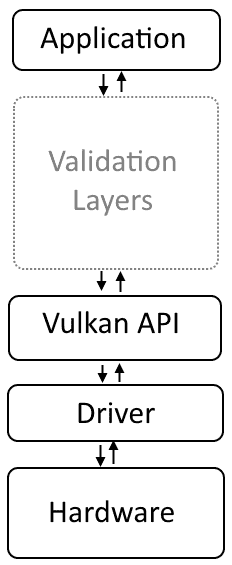
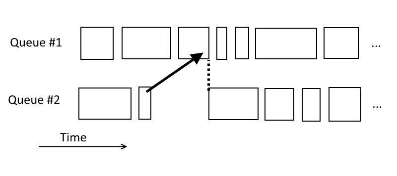
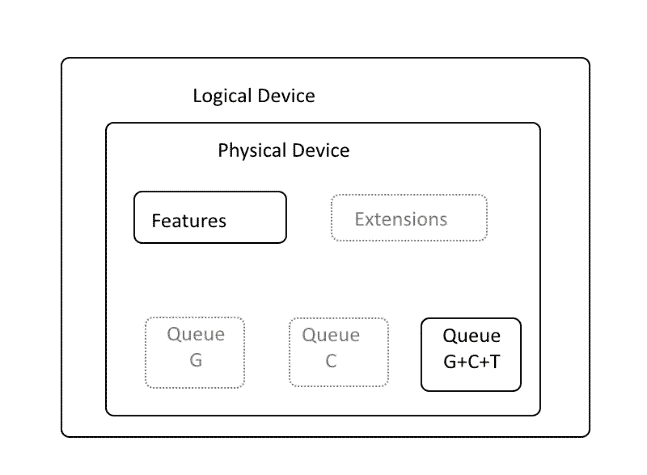

# 实例和设备

在本章中，我们将介绍以下食谱：

+   下载 Vulkan SDK

+   启用验证层

+   与 Vulkan Loader 库连接

+   准备加载 Vulkan API 函数

+   加载从 Vulkan Loader 库导出的函数

+   加载全局级函数

+   检查可用的实例扩展

+   创建一个 Vulkan 实例

+   加载实例级函数

+   列举可用的物理设备

+   检查可用的设备扩展

+   获取物理设备的功能和属性

+   检查可用的队列家族及其属性

+   选择具有所需功能的队列家族的索引

+   创建逻辑设备

+   加载设备级函数

+   获取设备队列

+   使用几何着色器和图形以及计算队列创建逻辑设备

+   销毁逻辑设备

+   销毁 Vulkan 实例

+   释放 Vulkan Loader 库

# 简介

Vulkan 是由 Khronos Consortium 开发的新图形 API。它被视为 OpenGL 的继任者：它是开源的且跨平台的。然而，由于 Vulkan 可以在不同的设备和操作系统上使用，我们需要创建一些基本设置代码，以便在我们的应用程序中使用 Vulkan。

在本章中，我们将介绍特定于在 Microsoft Windows 和 Ubuntu Linux 操作系统上使用 Vulkan 的主题。我们将学习 Vulkan 基础知识，例如下载 **软件开发工具包**（**SDK**）和设置 **验证层**，这些验证层使我们能够调试使用 Vulkan API 的应用程序。我们将开始使用 **Vulkan Loader** 库，加载所有 Vulkan API 函数，创建一个 Vulkan 实例，并选择我们的工作将在其上执行设备。

# 下载 Vulkan 的 SDK

要开始使用 Vulkan API 开发应用程序，我们需要下载一个 SDK 并在我们的应用程序中使用其一些资源。

Vulkan 的 SDK 可以在 [`vulkan.lunarg.com`](https://vulkan.lunarg.com/) 找到。

# 准备就绪

在我们能够执行任何使用 Vulkan API 的应用程序之前，我们还需要安装支持 Vulkan API 的图形驱动程序。这些可以在图形硬件供应商的网站上找到。

# 如何操作...

在 Windows 操作系统家族中：

1.  前往 [`vulkan.lunarg.com`](https://vulkan.lunarg.com/)。

1.  将页面滚动到最底部并选择 WINDOWS 操作系统。

1.  下载并保存 SDK 安装程序文件。

1.  运行安装程序并选择您想要安装 SDK 的目标位置。默认情况下，它被安装到 `C:\VulkanSDK\<version>\` 文件夹中。

1.  安装完成后，打开 Vulkan SDK 安装文件夹，然后打开 `RunTimeInstaller` 子文件夹。执行 `VulkanRT-<version>-Installer` 文件。这将安装最新的 Vulkan Loader 版本。

1.  再次，前往 SDK 安装的文件夹，并打开 `Include\vulkan` 子文件夹。将 `vk_platform.h` 和 `vulkan.h` 头文件复制到您想要开发的应用的工程文件夹中。我们将这两个文件称为 *Vulkan 头文件*。

在 Linux 操作系统系列中：

1.  通过运行以下命令更新系统包：

```cpp
 sudo apt-get update sudo apt-get dist-upgrade

```

1.  要能够从 SDK 中构建和执行 Vulkan 示例，通过运行以下命令安装额外的开发包：

```cpp
       sudo apt-get install libglm-dev graphviz libxcb-dri3-0 
       libxcb-present0 libpciaccess0 cmake libpng-dev libxcb-dri3-
       dev libx11-dev

```

1.  前往 [`vulkan.lunarg.com`](https://vulkan.lunarg.com)。

1.  滚动到页面底部并选择 LINUX 操作系统。

1.  下载 SDK 的 Linux 包并将其保存到所需的文件夹中。

1.  打开终端，将当前目录更改为 SDK 软件包下载的文件夹。

1.  通过执行以下命令更改下载文件的访问权限：

```cpp
       chmod ugo+x vulkansdk-linux-x86_64-<version>.run

```

1.  使用以下命令运行下载的 SDK 软件包安装程序文件：

```cpp
       ./vulkansdk-linux-x86_64-<version>.run

```

1.  将当前目录更改为由 SDK 软件包安装程序创建的 `VulkanSDK/<version>` 文件夹。

1.  通过执行以下命令设置环境变量：

```cpp
 sudo su VULKAN_SDK=$PWD/x86_64
 echo export PATH=$PATH:$VULKAN_SDK/bin >> /etc/environment
 echo export VK_LAYER_PATH=$VULKAN_SDK/etc/explicit_layer.d >> 
      /etc/environment
 echo $VULKAN_SDK/lib >> /etc/ld.so.conf.d/vulkan.conf
 ldconfig

```

1.  将当前目录更改为 `x86_64/include/vulkan` 文件夹。

1.  将 `vk_platform.h` 和 `vulkan.h` 头文件复制到您想要开发的应用的工程文件夹中。我们将这两个文件称为 *Vulkan 头文件*。

1.  重新启动计算机以使更改生效。

# 它是如何工作的...

SDK 包含创建使用 Vulkan API 的应用程序所需的资源。Vulkan 头文件（`vk_platform.h` 和 `vulkan.h` 文件）需要包含在我们的应用程序源代码中，这样我们就可以在代码中使用 Vulkan API 函数、结构、枚举等。

Vulkan 加载器（Windows 上的 `vulkan-1.dll` 文件，Linux 系统上的 `libvulkan.so.1` 文件）是一个动态库，负责公开 Vulkan API 函数并将它们转发给图形驱动程序。我们在应用中与之连接，并从其中加载 Vulkan API 函数。

# 参见

本章中的以下配方：

+   *启用验证层*

+   *连接到 Vulkan 加载器库*

+   *释放 Vulkan 加载器库*

# 启用验证层

Vulkan API 是以性能为设计理念的。提高其性能的一种方法是通过降低驱动程序执行的状态和错误检查。这也是为什么 Vulkan 被称为“瘦 API”或“瘦驱动”的原因之一，它是对硬件的最小抽象，这使得 API 能够跨多个硬件供应商和设备类型（高性能桌面计算机、移动电话、集成和低功耗嵌入式系统）移植。

然而，与传统的传统高级 API（如 OpenGL）相比，这种方法使得使用 Vulkan API 创建应用程序变得更加困难。这是因为驱动程序向开发者提供的反馈非常有限，因为它期望程序员会正确使用 API 并遵守 Vulkan 规范中定义的规则。

为了减轻这个问题，Vulkan 也被设计成一个分层 API。最低层，核心，就是 **Vulkan API** 本身，它与 **驱动程序** 通信，使我们能够编程 **硬件**（如前图所示）。在其之上（在 **应用程序** 和 **Vulkan API** 之间），开发者可以启用额外的层，以简化调试过程。



# 如何操作...

在 Windows 操作系统家族中：

1.  前往 SDK 安装文件夹，然后打开 `Config` 子目录。

1.  将 `vk_layer_settings.txt` 文件复制到要调试的可执行文件目录中（要执行的应用程序文件夹中）。

1.  创建一个名为 `VK_INSTANCE_LAYERS` 的环境变量：

    1.  打开命令行控制台（命令提示符/`cmd.exe`）。

    1.  输入以下内容：

```cpp
              setx VK_INSTANCE_LAYERS 
              VK_LAYER_LUNARG_standard_validation

```

3. 关闭控制台。

1.  再次重新打开命令提示符。

1.  将当前目录更改为要执行的应用程序文件夹。

1.  运行应用程序；潜在警告或错误将在命令提示符的标准输出中显示。

在 Linux 操作系统家族中：

1.  前往 SDK 安装文件夹，然后打开 `Config` 子目录。

1.  将 `vk_layer_settings.txt` 文件复制到要调试的可执行文件目录中（要执行的应用程序文件夹中）。

1.  创建一个名为 `VK_INSTANCE_LAYERS` 的环境变量：

    1.  打开终端窗口。

    1.  输入以下内容：

```cpp
              export
              VK_INSTANCE_LAYERS=VK_LAYER_LUNARG_standard_validation

```

1.  运行应用程序；潜在警告或错误将在终端窗口的标准输出中显示。

# 它是如何工作的...

Vulkan 验证层包含一组库，这些库有助于在创建的应用程序中找到潜在问题。它们的调试功能包括但不限于验证传递给 Vulkan 函数的参数、验证纹理和渲染目标格式、跟踪 Vulkan 对象及其生命周期和用法，以及检查潜在的内存泄漏或转储（显示/打印）Vulkan API 函数调用。这些功能由不同的验证层启用，但大多数都汇集到一个名为 `VK_LAYER_LUNARG_standard_validation` 的单个层中，该层在本食谱中启用。其他层的名称示例包括 `VK_LAYER_LUNARG_swapchain`、`VK_LAYER_LUNARG_object_tracker`、`VK_LAYER_GOOGLE_threading` 或 `VK_LAYER_LUNARG_api_dump` 等。可以同时启用多个层，方法与这里在食谱中展示的类似。只需将您想要激活的层的名称分配给 `VK_INSTANCE_LAYERS` 环境变量。如果您是 Windows 操作系统用户，请记住用分号分隔它们，如下例所示：

```cpp
setx VK_INSTANCE_LAYERS VK_LAYER_LUNARG_api_dump;VK_LAYER_LUNARG_core_validation

```

如果您是 Linux 操作系统用户，请用冒号分隔它们。以下是一个示例：

```cpp
export VK_INSTANCE_LAYERS=VK_LAYER_LUNARG_api_dump:VK_LAYER_LUNARG _core_validation

```

命名为 `VK_INSTANCE_LAYERS` 的环境变量也可以通过其他操作系统特定的方式设置，例如，在 Windows 上的高级操作系统设置或 Linux 上的 `/etc/environment`。

上述示例使验证层在全局范围内对所有应用程序生效，但它们也可以仅对我们自己的应用程序生效，在其源代码中创建实例时启用。然而，这种方法要求我们每次想要启用或禁用不同的层时都要重新编译整个程序。因此，使用上述方法启用它们更容易。这样，我们也不会忘记在发布应用程序的最终版本时禁用它们。要禁用验证层，我们只需删除 `VK_INSTANCE_LAYERS` 环境变量。

验证层不应在发布（发货）的应用程序的版本中启用，因为它们可能会大幅降低性能。

有关可用的所有验证层的完整列表，请参阅文档，这些文档可以在安装 Vulkan SDK 的目录中的 `Documentation` 子目录中找到。

# 参见

本章中的以下食谱：

+   *下载 Vulkan 的 SDK*

+   *连接到 Vulkan 加载器库*

+   *释放 Vulkan 加载器库*

# 连接到 Vulkan 加载器库

Vulkan API 的支持由图形硬件供应商实现，并通过图形驱动程序提供。每个供应商都可以选择任何动态库来实现它，甚至可以在驱动程序更新中更改它。

因此，除了驱动程序之外，Vulkan 加载库也被安装。我们也可以从 SDK 安装文件夹中安装它。它允许开发者通过 Windows OS 上的 `vulkan-1.dll` 库或 Linux OS 上的 `libvulkan.so.1` 库访问 Vulkan API 的入口点，无论安装了什么驱动程序，来自哪个供应商。

Vulkan 加载库负责将 Vulkan API 调用传输到适当的图形驱动程序。在给定的计算机上，可能有更多支持 Vulkan 的硬件组件，但有了 Vulkan 加载库，我们就不需要猜测应该使用哪个驱动程序，或者应该连接哪个库才能使用 Vulkan。开发者只需要知道 Vulkan 库的名称：Windows 上的 `vulkan-1.dll` 或 Linux 上的 `libvulkan.so.1`。当我们想在应用程序中使用 Vulkan 时，我们只需在代码中连接它（加载它）。

在 Windows OS 上，Vulkan 加载库被命名为 `vulkan-1.dll`。

在 Linux OS 上，Vulkan 加载库被命名为 `libvulkan.so.1`。

# 如何操作...

在 Windows 操作系统家族中：

1.  准备一个名为 `vulkan_library` 的 `HMODULE` 类型的变量。

1.  调用 `LoadLibrary( "vulkan-1.dll" )` 并将此操作的返回结果存储在 `vulkan_library` 变量中。

1.  通过检查 `vulkan_library` 变量的值是否不同于 `nullptr` 来确认此操作已成功执行。

在 Linux 操作系统家族中：

1.  准备一个名为 `vulkan_library` 的 `void*` 类型的变量。

1.  调用 `dlopen( "libvulkan.so.1", RTLD_NOW )` 并将此操作的返回结果存储在 `vulkan_library` 变量中。

1.  通过检查 `vulkan_library` 变量的值是否不同于 `nullptr` 来确认此操作已成功执行。

# 它是如何工作的...

`LoadLibrary()` 是 Windows 操作系统上可用的一项功能。`dlopen()` 是 Linux 操作系统上可用的一项功能。它们两者都将指定的动态链接库加载（打开）到我们的应用程序的内存空间中。这样我们就可以加载（获取）从给定库实现并导出的函数，并在我们的应用程序中使用它们。

在我们最感兴趣的从 Vulkan API 导出的函数的情况下，我们按照以下方式在 Windows 上加载 `vulkan-1.dll` 库或在 Linux 上加载 `libvulkan.so.1` 库：

```cpp
#if defined _WIN32 
vulkan_library = LoadLibrary( "vulkan-1.dll" ); 
#elif defined __linux 
vulkan_library = dlopen( "libvulkan.so.1", RTLD_NOW ); 
#endif 

if( vulkan_library == nullptr ) { 
  std::cout << "Could not connect with a Vulkan Runtime library." << std::endl; 
  return false; 
} 
return true;

```

在成功调用之后，我们可以加载一个用于获取所有其他 Vulkan API 程序地址的特定于 Vulkan 的函数。

# 参见

本章中的以下配方：

+   *下载 Vulkan SDK*

+   *启用验证层*

+   *释放 Vulkan 加载库*

# 准备加载 Vulkan API 函数

当我们想在应用程序中使用 Vulkan API 时，我们需要获取 Vulkan 文档中指定的过程。为了做到这一点，我们可以在项目中添加对 Vulkan 加载器库的依赖，将其静态链接到我们的项目中，并使用`vulkan.h`头文件中定义的函数原型。第二种方法是禁用`vulkan.h`头文件中定义的函数原型，并在我们的应用程序中动态加载函数指针。

第一种方法稍微简单一些，但它使用的是直接在 Vulkan 加载器库中定义的函数。当我们对一个给定的设备执行操作时，Vulkan 加载器需要根据我们提供的作为参数的设备句柄将函数调用重定向到适当的实现。这种重定向需要一些时间，从而影响性能。

第二种方法需要在应用程序方面做更多的工作，但允许我们跳过前面的重定向（跳转）并节省一些性能。这是通过直接从我们想要使用的设备中加载函数来实现的。这样，如果我们不需要所有功能，我们还可以选择只使用 Vulkan 函数的子集。

在这本书中，介绍了第二种方法，因为它让开发者能够更好地控制应用程序中的事情。为了从 Vulkan 加载器库中动态加载函数，将所有 Vulkan API 函数的名称包装成一组简单的宏，并将声明、定义和函数加载分成多个文件是很方便的。

# 如何操作...

1.  在项目中定义`VK_NO_PROTOTYPES`预处理器定义：在项目属性中进行此操作（当使用 Microsoft Visual Studio 或 Qt Creator 等开发环境时），或者通过在源代码中包含`vulkan.h`文件之前使用`#define VK_NO_PROTOTYPES`预处理器指令。

1.  创建一个名为`ListOfVulkanFunctions.inl`的新文件。

1.  将以下内容输入到文件中：

```cpp
      #ifndef EXPORTED_VULKAN_FUNCTION 
      #define EXPORTED_VULKAN_FUNCTION( function ) 
      #endif 

      #undef EXPORTED_VULKAN_FUNCTION 
      // 
      #ifndef GLOBAL_LEVEL_VULKAN_FUNCTION 
      #define GLOBAL_LEVEL_VULKAN_FUNCTION( function ) 
      #endif 

      #undef GLOBAL_LEVEL_VULKAN_FUNCTION 
      // 
      #ifndef INSTANCE_LEVEL_VULKAN_FUNCTION 
      #define INSTANCE_LEVEL_VULKAN_FUNCTION( function ) 
      #endif 

      #undef INSTANCE_LEVEL_VULKAN_FUNCTION 
      // 
      #ifndef INSTANCE_LEVEL_VULKAN_FUNCTION_FROM_EXTENSION 
      #define INSTANCE_LEVEL_VULKAN_FUNCTION_FROM_EXTENSION( function,       extension ) 
      #endif 

      #undef INSTANCE_LEVEL_VULKAN_FUNCTION_FROM_EXTENSION 
      // 
      #ifndef DEVICE_LEVEL_VULKAN_FUNCTION 
      #define DEVICE_LEVEL_VULKAN_FUNCTION( function ) 
      #endif 

      #undef DEVICE_LEVEL_VULKAN_FUNCTION 
      // 
      #ifndef DEVICE_LEVEL_VULKAN_FUNCTION_FROM_EXTENSION 
      #define DEVICE_LEVEL_VULKAN_FUNCTION_FROM_EXTENSION( function,
      extension ) 
      #endif 

      #undef DEVICE_LEVEL_VULKAN_FUNCTION_FROM_EXTENSION

```

1.  创建一个名为`VulkanFunctions.h`的新头文件。

1.  将以下内容插入到文件中：

```cpp
      #include "vulkan.h" 

      namespace VulkanCookbook { 

      #define EXPORTED_VULKAN_FUNCTION( name ) extern PFN_##name name; 
      #define GLOBAL_LEVEL_VULKAN_FUNCTION( name ) extern PFN_##name 
      name; 
      #define INSTANCE_LEVEL_VULKAN_FUNCTION( name ) extern PFN_##name 
      name; 
      #define INSTANCE_LEVEL_VULKAN_FUNCTION_FROM_EXTENSION( name,
      extension ) extern PFN_##name name; 
      #define DEVICE_LEVEL_VULKAN_FUNCTION( name ) extern PFN_##name 
      name; 
      #define DEVICE_LEVEL_VULKAN_FUNCTION_FROM_EXTENSION( name, 
      extension ) extern PFN_##name name; 

      #include "ListOfVulkanFunctions.inl" 

      } // namespace VulkanCookbook

```

1.  创建一个名为`VulkanFunctions.cpp`的新源代码文件。

1.  将以下内容插入到文件中：

```cpp
      #include "VulkanFunctions.h" 

      namespace VulkanCookbook { 

      #define EXPORTED_VULKAN_FUNCTION( name ) PFN_##name name; 
      #define GLOBAL_LEVEL_VULKAN_FUNCTION( name ) PFN_##name name; 
      #define INSTANCE_LEVEL_VULKAN_FUNCTION( name ) PFN_##name name; 
      #define INSTANCE_LEVEL_VULKAN_FUNCTION_FROM_EXTENSION( name, 
      extension ) PFN_##name name; 
      #define DEVICE_LEVEL_VULKAN_FUNCTION( name ) PFN_##name name; 
      #define DEVICE_LEVEL_VULKAN_FUNCTION_FROM_EXTENSION( name, 
      extension ) PFN_##name name; 

      #include "ListOfVulkanFunctions.inl" 

      } // namespace VulkanCookbook

```

# 它是如何工作的...

这一系列文件一开始可能看起来是不必要的，甚至令人不知所措。`VulkanFunctions.h`和`VulkanFunctions.cpp`文件用于声明和定义我们将存储指向 Vulkan API 函数的指针的变量。声明和定义是通过方便的宏定义和包含`ListOfVulkanFunctions.inl`文件来完成的。我们将更新此文件并添加许多来自不同级别的 Vulkan 函数的名称。这样，我们就不需要在多个地方多次重复函数名称，这有助于我们避免犯错误和打字错误。我们只需在`ListOfVulkanFunctions.inl`文件中一次写入所需的 Vulkan 函数名称，并在需要时包含它。

我们如何知道用于存储指向 Vulkan API 函数指针的变量的类型？这很简单。每个函数的原型类型直接从函数名称派生。当一个函数被命名为 `<name>` 时，其类型是 `PFN_<name>`。例如，创建图像的函数被命名为 `vkCreateImage()`，因此这个函数的类型是 `PFN_vkCreateImage`。这就是为什么在提供的文件集中定义的宏只有一个参数，即函数名称，可以从它轻松地推导出类型。

最后，但同样重要的是，记住我们将存储 Vulkan 函数地址的变量声明和定义应该放在命名空间、类或结构体内部。这是因为，如果它们被设置为全局的，这可能会在某些操作系统上导致问题。记住命名空间并增加我们代码的可移植性会更好。

将包含 Vulkan API 函数指针的变量声明和定义放在结构体、类或命名空间内。

现在我们已经准备好了，我们可以开始加载 Vulkan 函数。

# 参见

本章中的以下食谱：

+   *加载从 Vulkan Loader 库导出的函数*

+   *加载全局级函数*

+   *加载实例级函数*

+   *加载设备级函数*

# 加载从 Vulkan Loader 库导出的函数

当我们加载（连接）Vulkan Loader 库时，我们需要加载其函数才能在我们的应用程序中使用 Vulkan API。不幸的是，不同的操作系统有不同的方式来获取从动态库（Windows 上的 `.dll` 文件或 Linux 上的 `.so` 文件）导出的函数的地址。然而，Vulkan API 力求跨许多操作系统实现可移植性。因此，为了允许开发者加载 API 中可用的所有函数，无论他们针对的是哪个操作系统，Vulkan 引入了一个可以用来加载所有其他 Vulkan API 函数的函数。然而，这个单一函数只能以操作系统特定的方式加载。

# 如何做...

在 Windows 操作系统家族中：

1.  创建一个名为 `vkGetInstanceProcAddr` 的 `PFN_vkGetInstanceProcAddr` 类型的变量。

1.  调用 `GetProcAddress( vulkan_library, "vkGetInstanceProcAddr" )`，将此操作的返回结果转换为 `PFN_vkGetInstanceProcAddr` 类型，并将其存储在 `vkGetInstanceProcAddr` 变量中。

1.  通过检查 `vkGetInstanceProcAddr` 变量的值是否不等于 `nullptr` 来确认此操作是否成功。

在 Linux 操作系统家族中：

1.  创建一个名为 `vkGetInstanceProcAddr` 的 `PFN_vkGetInstanceProcAddr` 类型的变量。

1.  调用 `dlsym( vulkan_library, "vkGetInstanceProcAddr" )`，将此操作的返回结果转换为 `PFN_vkGetInstanceProcAddr` 类型，并将其存储在 `vkGetInstanceProcAddr` 变量中。

1.  通过检查 `vkGetInstanceProcAddr` 变量的值是否不等于 `nullptr` 来确认此操作是否成功。

# 它是如何工作的...

`GetProcAddress()` 是在 Windows 操作系统上可用的函数。`dlsym()` 是在 Linux 操作系统上可用的函数。它们都从已加载的动态链接库中获取指定函数的地址。所有 Vulkan 实现必须公开导出的唯一函数称为 `vkGetInstanceProcAddr()`。它允许我们以与操作系统无关的方式加载任何其他 Vulkan 函数。

为了简化并自动化加载多个 Vulkan 函数的过程，并降低出错的可能性，我们应该将声明、定义和加载函数的过程封装成一组方便的宏定义，如 *准备加载 Vulkan API 函数* 食谱中所述。这样，我们就可以将所有 Vulkan API 函数保存在一个文件中，该文件包含所有 Vulkan 函数的宏封装名称列表。然后我们可以将此单个文件包含在多个位置，并利用 C/C++ 预处理器。通过重新定义宏，我们可以声明和定义我们将存储函数指针的变量，也可以加载所有这些函数。

这里是 `ListOfVulkanFunctions.inl` 文件更新的片段：

```cpp
#ifndef EXPORTED_VULKAN_FUNCTION 
#define EXPORTED_VULKAN_FUNCTION( function ) 
#endif 

EXPORTED_VULKAN_FUNCTION( vkGetInstanceProcAddr ) 

#undef EXPORTED_VULKAN_FUNCTION

```

其余的文件（`VulkanFunctions.h` 和 `VulkanFunctions.h`）保持不变。声明和定义是通过预处理器宏自动执行的。然而，我们仍然需要加载从 Vulkan Loader 库导出的函数。前一个食谱的实现可能如下所示：

```cpp
#if defined _WIN32 
#define LoadFunction GetProcAddress 
#elif defined __linux 
#define LoadFunction dlsym 
#endif 

#define EXPORTED_VULKAN_FUNCTION( name )                          \
name = (PFN_##name)LoadFunction( vulkan_library, #name );         \
if( name == nullptr ) {                                           \
  std::cout << "Could not load exported Vulkan function named: "  \
    #name << std::endl;                                           \
  return false;                                                   \
} 

#include "ListOfVulkanFunctions.inl" 

return true;

```

首先，我们定义一个负责获取 `vkGetInstanceProcAddr()` 函数地址的宏。它从表示为 `vulkan_library` 变量的库中获取它，将此操作的结果转换为 `PFN_kGetInstanceProcAddr` 类型，并将其存储在名为 `vkGetInstanceProcAddr` 的变量中。之后，该宏检查操作是否成功，并在失败的情况下在屏幕上显示适当的消息。

所有预处理器“魔法”都是在包含 `ListOfVulkanFunctions.inl` 文件并执行此文件中定义的每个函数的前置操作时完成的。在这种情况下，它仅针对 `vkGetInstanceProcAddr()` 函数执行，但对于其他级别的函数也能达到相同的行为。

现在，当我们有一个函数加载函数时，我们可以以操作系统无关的方式获取其他 Vulkan 程序的指针。

# 参见

本章中以下食谱：

+   *与 Vulkan Loader 库连接*

+   *准备加载 Vulkan API 函数*

+   *加载全局级别的函数*

+   *加载实例级别的函数*

+   *加载设备级别的函数*

# 加载全局级别的函数

我们已经获取了一个 `vkGetInstanceProcAddr()` 函数，通过它可以以操作系统无关的方式加载所有其他 Vulkan API 入口点。

Vulkan 函数可以分为三个级别，分别是 **全局**、**实例** 和 **设备**。设备级别函数用于执行典型的操作，如绘图、着色器模块创建、图像创建或数据复制。实例级别函数允许我们创建 **逻辑设备**。为了完成所有这些，并加载设备和实例级别函数，我们需要创建一个实例。这个操作是通过全局级别函数执行的，我们首先需要加载这些函数。

# 如何操作...

1.  创建一个名为 `vkEnumerateInstanceExtensionProperties` 的 `PFN_vkEnumerateInstanceExtensionProperties` 类型的变量。

1.  创建一个名为 `vkEnumerateInstanceLayerProperties` 的 `PFN_vkEnumerateInstanceLayerProperties` 类型的变量。

1.  创建一个名为 `vkCreateInstance` 的 `PFN_vkCreateInstance` 类型的变量。

1.  调用 `vkGetInstanceProcAddr( nullptr, "vkEnumerateInstanceExtensionProperties" )`，将此操作的输出转换为 `PFN_vkEnumerateInstanceExtensionProperties` 类型，并将其存储在 `vkEnumerateInstanceExtensionProperties` 变量中。

1.  调用 `vkGetInstanceProcAddr( nullptr, "vkEnumerateInstanceLayerProperties" )`，将此操作的输出转换为 `PFN_vkEnumerateInstanceLayerProperties` 类型，并将其存储在 `vkEnumerateInstanceLayerProperties` 变量中。

1.  调用 `vkGetInstanceProcAddr( nullptr, "vkCreateInstance" )`，将此操作的输出转换为 `PFN_vkCreateInstance` 类型，并将其存储在 `vkCreateInstance` 变量中。

1.  通过检查所有前面的变量值是否不等于 `nullptr` 来确认操作是否成功。

# 它是如何工作的...

在 Vulkan 中，只有三个全局级别函数：`vkEnumerateInstanceExtensionProperties()`、`vkEnumerateInstanceLayerProperties()` 和 `vkCreateInstance()`。它们在实例创建期间用于检查可用的实例级别扩展和层，并创建实例本身。

获取全局级别函数的过程与从 Vulkan Loader 导出的加载函数类似。这就是为什么最方便的方法是将全局级别函数的名称添加到 `ListOfVulkanFunctions.inl` 文件中，如下所示：

```cpp
#ifndef GLOBAL_LEVEL_VULKAN_FUNCTION 
#define GLOBAL_LEVEL_VULKAN_FUNCTION( function ) 
#endif 

GLOBAL_LEVEL_VULKAN_FUNCTION( vkEnumerateInstanceExtensionProperties ) 
GLOBAL_LEVEL_VULKAN_FUNCTION( vkEnumerateInstanceLayerProperties ) 
GLOBAL_LEVEL_VULKAN_FUNCTION( vkCreateInstance ) 

#undef GLOBAL_LEVEL_VULKAN_FUNCTION

```

我们不需要更改 `VulkanFunctions.h` 和 `VulkanFunctions.h` 文件，但我们仍然需要实现前面的食谱，并按如下方式加载全局级别函数：

```cpp
#define GLOBAL_LEVEL_VULKAN_FUNCTION( name )                      \
name = (PFN_##name)vkGetInstanceProcAddr( nullptr, #name );       \
if( name == nullptr ) {                                           \
  std::cout << "Could not load global-level function named: "     \
    #name << std::endl;                                           \
  return false;                                                   \
} 

#include "ListOfVulkanFunctions.inl" 

return true;

```

一个自定义的 `GLOBAL_LEVEL_VULKAN_FUNCTION` 宏接受函数名称并将其提供给 `vkGetInstanceProcAddr()` 函数。它尝试加载给定的函数，如果失败，则返回 `nullptr`。`vkGetInstanceProcAddr()` 函数返回的任何结果都将转换为 `PFN_<name>` 类型并存储在适当的变量中。

如果失败，将显示一条消息，以便用户知道哪个函数无法加载。

# 参见

本章中的以下食谱：

+   *准备加载 Vulkan API 函数*

+   *加载从 Vulkan Loader 库导出的函数*

+   *加载实例级别函数*

+   *加载设备级函数*

# 检查可用的实例扩展

Vulkan 实例收集每个应用程序的状态，并允许我们创建一个逻辑设备，几乎所有操作都在这个设备上执行。在我们能够创建实例对象之前，我们应该考虑我们想要启用的实例级扩展。其中最重要的实例级扩展之一是与交换链相关的扩展，这些扩展用于在屏幕上显示图像。

与 OpenGL 不同，Vulkan 中的扩展是显式启用的。我们不能创建一个不支持的扩展的 Vulkan 实例，因为实例创建操作将失败。这就是为什么我们需要检查在给定的硬件平台上支持哪些扩展。

# 如何做...

1.  准备一个名为 `extensions_count` 的 `uint32_t` 类型的变量。

1.  调用 `vkEnumerateInstanceExtensionProperties( nullptr, &extensions_count, nullptr )`。所有参数都应设置为 `nullptr`，除了第二个参数，它应指向 `extensions_count` 变量。

1.  如果函数调用成功，总可用实例级扩展的数量将存储在 `extensions_count` 变量中。

1.  为扩展属性列表准备一个存储空间。它必须包含类型为 `VkExtensionProperties` 的元素。最佳解决方案是使用 `std::vector` 容器。可以将其命名为 `available_extensions`。

1.  调整向量的大小，以便至少可以容纳 `extensions_count` 个元素。

1.  调用 `vkEnumerateInstanceExtensionProperties( nullptr, &extensions_count, &available_extensions[0] )`。第一个参数再次设置为 `nullptr`；第二个参数应指向 `extensions_count` 变量；第三个参数必须指向一个至少包含 `extensions_count` 个元素的 `VkExtensionProperties` 类型的数组。在这里，在第三个参数中，提供 `available_extensions` 向量第一个元素的地址。

1.  如果函数返回成功，`available_extensions` 向量变量将包含在给定硬件平台上支持的所有扩展的列表。

# 它是如何工作的...

获取实例级扩展的代码可以分为两个阶段。首先，我们获取可用扩展的总数，如下所示：

```cpp
uint32_t extensions_count = 0; 
VkResult result = VK_SUCCESS; 

result = vkEnumerateInstanceExtensionProperties( nullptr, &extensions_count, nullptr ); 
if( (result != VK_SUCCESS) || 
    (extensions_count == 0) ) { 
  std::cout << "Could not get the number of Instance extensions." << std::endl; 
  return false; 
}

```

当最后一个参数设置为 `nullptr` 时，`vkEnumerateInstanceExtensionProperties()` 函数将可用扩展的数量存储在第二个参数指向的变量中。这样，我们就知道在给定平台上有多少扩展，以及我们需要多少空间来存储所有这些扩展的参数。

当我们准备好获取扩展属性时，我们可以再次调用该函数。这次最后一个参数应指向准备好的空间（一个 `VkExtensionProperties` 元素数组，或者在我们的情况下是一个向量），其中将存储这些属性：

```cpp
available_extensions.resize( extensions_count ); 
result = vkEnumerateInstanceExtensionProperties( nullptr, &extensions_count, &available_extensions[0] ); 
if( (result != VK_SUCCESS) || 
    (extensions_count == 0) ) { 
  std::cout << "Could not enumerate Instance extensions." << std::endl; 
  return false; 
} 

return true;

```

在 Vulkan 中，调用同一函数两次的模式很常见。有多个函数，当它们的最后一个参数设置为 `nullptr` 时，它们会存储查询返回的元素数量。当它们的最后一个元素指向一个适当的变量时，它们会返回数据本身。

现在我们有了这个列表，我们可以查看它并检查我们想要启用的扩展是否在给定的平台上可用。

# 参见

+   本章中的以下配方：

    +   *检查可用的设备扩展*

+   在 第二章 中的以下配方，*图像展示*：

    +   *创建启用了 WSI 扩展的 Vulkan 实例*

# 创建 Vulkan 实例

Vulkan 实例是一个收集应用程序状态的对象。它包含诸如应用程序名称、用于创建应用程序的引擎名称和版本，或启用的实例级扩展和层等信息。

通过实例，我们还可以枚举可用的物理设备并在其上创建逻辑设备，在这些设备上执行典型的操作，如图像创建或绘图。因此，在我们使用 Vulkan API 之前，我们需要创建一个新的实例对象。

# 如何做到这一点...

1.  准备一个名为 `desired_extensions` 的 `std::vector<char const *>` 类型的变量。将所有想要启用的扩展的名称存储在 `desired_extensions` 变量中。

1.  创建一个名为 `available_extensions` 的 `std::vector<VkExtensionProperties>` 类型的变量。获取所有可用扩展的列表并将其存储在 `available_extensions` 变量中（参考 *Checking available Instance extensions* 配方）。

1.  确保从 `desired_extensions` 变量中每个扩展的名称也存在于 `available_extensions` 变量中。

1.  准备一个名为 `application_info` 的 `VkApplicationInfo` 类型的变量。为 `application_info` 变量的成员分配以下值：

    1.  `VK_STRUCTURE_TYPE_APPLICATION_INFO` 的 `sType` 值。

    1.  `pNext` 的 `nullptr` 值。

    1.  应用程序名称为 `pApplicationName`。

    1.  应用程序版本的 `applicationVersion` 结构成员；通过使用 `VK_MAKE_VERSION` 宏并指定其中的主要、次要和补丁值来实现。

    1.  用于创建应用程序的引擎名称为 `pEngineName`。

    1.  用于创建应用程序的引擎版本为 `engineVersion` 的版本；通过使用 `VK_MAKE_VERSION` 宏来实现。

    1.  `VK_MAKE_VERSION( 1, 0, 0 )` 用于 `apiVersion`。

1.  创建一个名为 `instance_create_info` 的 `VkInstanceCreateInfo` 类型的变量。为 `instance_create_info` 变量的成员分配以下值：

    1.  `VK_STRUCTURE_TYPE_INSTANCE_CREATE_INFO` 的 `sType` 值。

    1.  `pNext` 的 `nullptr` 值。

    1.  `flags` 的 `0` 值。

    1.  指向 `application_info` 变量的 `pApplicationInfo` 指针。

    1.  `enabledLayerCount` 的 `0` 值。

    1.  `ppEnabledLayerNames` 的 `nullptr` 值。

    1.  `desired_extensions` 向量的元素数量为 `enabledExtensionCount`。

    1.  指向`desired_extensions`向量第一个元素的指针（如果为空，则为`nullptr`）用于`ppEnabledExtensionNames`。

1.  创建一个名为`instance`的`VkInstance`类型的变量。

1.  调用`vkCreateInstance( &instance_create_info, nullptr, &instance )`函数。在第一个参数中提供一个指向`instance_create_info`变量的指针，在第二个参数中提供一个`nullptr`值，在第三个参数中提供一个指向`instance`变量的指针。

1.  通过检查`vkCreateInstance()`函数调用返回的值是否等于`VK_SUCCESS`来确保操作成功。

# 它是如何工作的...

要创建实例，我们需要准备一些信息。首先，我们需要创建一个包含我们想要启用的实例级扩展名称的数组。接下来，我们需要检查它们是否在给定的硬件上受支持。这是通过获取所有可用实例级扩展的列表并检查它是否包含我们想要启用的所有扩展的名称来完成的：

```cpp
std::vector<VkExtensionProperties> available_extensions; 
if( !CheckAvailableInstanceExtensions( available_extensions ) ) { 
  return false; 
} 

for( auto & extension : desired_extensions ) { 
  if( !IsExtensionSupported( available_extensions, extension ) ) { 
    std::cout << "Extension named '" << extension << "' is not supported." << std::endl; 
    return false; 
  } 
}

```

接下来，我们需要创建一个变量，我们将在此变量中提供有关我们的应用程序的信息，例如其名称和版本、用于创建应用程序的引擎的名称和版本，以及我们想要使用的 Vulkan API 的版本（目前 API 只支持第一个版本）：

```cpp
VkApplicationInfo application_info = { 
  VK_STRUCTURE_TYPE_APPLICATION_INFO, 
  nullptr, 
  application_name, 
  VK_MAKE_VERSION( 1, 0, 0 ), 
  "Vulkan Cookbook", 
  VK_MAKE_VERSION( 1, 0, 0 ), 
  VK_MAKE_VERSION( 1, 0, 0 ) 
};

```

在前面的代码示例中，`application_info`变量的指针通过一个包含用于创建实例的实际参数的第二个变量提供。在其中，除了之前提到的指针外，我们还提供了我们想要启用的扩展的数量和名称，以及我们想要启用的层和名称。扩展和层都不是创建有效的实例对象所必需的，我们可以跳过它们。然而，有一些非常重要的扩展，没有它们将很难创建一个功能齐全的应用程序，因此建议使用它们。层可以安全地省略。以下是为定义实例参数的变量准备示例代码：

```cpp
VkInstanceCreateInfo instance_create_info = { 
  VK_STRUCTURE_TYPE_INSTANCE_CREATE_INFO, 
  nullptr, 
  0, 
  &application_info, 
  0, 
  nullptr, 
  static_cast<uint32_t>(desired_extensions.size()), 
  desired_extensions.size() > 0 ? &desired_extensions[0] : nullptr 
};

```

最后，当我们准备好了前面的数据后，我们可以创建一个实例对象。这是通过`vkCreateInstance()`函数完成的。其第一个参数必须指向类型为`VkInstanceCreateInfo`的变量。第三个参数必须指向类型为`VkInstance`的变量。创建的实例句柄将存储在其中。第二个参数很少使用：它可能指向一个类型为`VkAllocationCallbacks`的变量，在其中定义了分配器回调函数。这些函数控制主机内存的分配，主要用于调试目的。大多数情况下，定义分配回调的第二个参数可以设置为`nullptr`：

```cpp
VkResult result = vkCreateInstance( &instance_create_info, nullptr, &instance ); 
if( (result != VK_SUCCESS) || 
    (instance == VK_NULL_HANDLE) ) { 
  std::cout << "Could not create Vulkan Instance." << std::endl; 
  return false; 
} 

return true;

```

# 参见

+   本章中的以下食谱：

    +   *检查可用的实例扩展*

    +   *销毁 Vulkan 实例*

+   在第二章的以下食谱中，*图像呈现*：

    +   *启用 WSI 扩展的 Vulkan 实例创建*

# 加载实例级函数

我们已经创建了一个 Vulkan 实例对象。下一步是枚举物理设备，从中选择一个，并从它创建一个逻辑设备。这些操作是通过实例级函数执行的，我们需要获取它们的地址。

# 如何操作...

1.  获取已创建的 Vulkan 实例的句柄。将其提供在名为 `instance` 的 `VkInstance` 类型变量中。

1.  选择您想要加载的实例级函数的名称（表示为 `<function name>`）。

1.  创建一个名为 `<function name>` 的 `PFN_<function name>` 类型的变量。

1.  调用 `vkGetInstanceProcAddr( instance, "<function name>" )`。在第一个参数中提供一个创建的实例的句柄，在第二个参数中提供一个函数名。将此操作的结果转换为 `PFN_<function name>` 类型，并将其存储在 `<function name>` 变量中。

1.  通过检查 `<function name>` 变量的值是否不等于 `nullptr` 来确认此操作是否成功。

# 它是如何工作的...

实例级函数主要用于对物理设备进行操作。其中包含多个实例级函数，如 `vkEnumeratePhysicalDevices()`、`vkGetPhysicalDeviceProperties()`、`vkGetPhysicalDeviceFeatures()`、`vkGetPhysicalDeviceQueueFamilyProperties()`、`vkCreateDevice()`、`vkGetDeviceProcAddr()`、`vkDestroyInstance()` 或 `vkEnumerateDeviceExtensionProperties()` 等。然而，这个列表并不包括所有实例级函数。

我们如何判断一个函数是实例级还是设备级？所有设备级函数的第一个参数类型为 `VkDevice`、`VkQueue` 或 `VkCommandBuffer`。因此，如果一个函数没有这样的参数，并且不是全局级别的，那么它就是实例级的。如前所述，实例级函数用于操作物理设备，检查它们的属性、能力，并创建逻辑设备。

记住，扩展也可以引入新的功能。您需要将它们的函数添加到功能加载代码中，以便能够在应用程序中使用扩展。然而，在实例创建期间，您不应该在没有启用扩展的情况下加载由特定扩展引入的函数。如果这些函数在特定平台上不受支持，加载它们将失败（它将返回一个空指针）。

因此，为了加载实例级函数，我们应该按照以下方式更新 `ListOfVulkanFunctions.inl` 文件：

```cpp
#ifndef INSTANCE_LEVEL_VULKAN_FUNCTION 
#define INSTANCE_LEVEL_VULKAN_FUNCTION( function ) 
#endif 

INSTANCE_LEVEL_VULKAN_FUNCTION( vkEnumeratePhysicalDevices ) 
INSTANCE_LEVEL_VULKAN_FUNCTION( vkGetPhysicalDeviceProperties ) 
INSTANCE_LEVEL_VULKAN_FUNCTION( vkGetPhysicalDeviceFeatures ) 
INSTANCE_LEVEL_VULKAN_FUNCTION( vkCreateDevice ) 
INSTANCE_LEVEL_VULKAN_FUNCTION( vkGetDeviceProcAddr ) 
//... 

#undef INSTANCE_LEVEL_VULKAN_FUNCTION 

// 

#ifndef INSTANCE_LEVEL_VULKAN_FUNCTION_FROM_EXTENSION 
#define INSTANCE_LEVEL_VULKAN_FUNCTION_FROM_EXTENSION( function, extension ) 
#endif 

INSTANCE_LEVEL_VULKAN_FUNCTION_FROM_EXTENSION( vkGetPhysicalDeviceSurfaceSupportKHR, VK_KHR_SURFACE_EXTENSION_NAME ) 
INSTANCE_LEVEL_VULKAN_FUNCTION_FROM_EXTENSION( vkGetPhysicalDeviceSurfaceCapabilitiesKHR, VK_KHR_SURFACE_EXTENSION_NAME ) 
INSTANCE_LEVEL_VULKAN_FUNCTION_FROM_EXTENSION( vkGetPhysicalDeviceSurfaceFormatsKHR, VK_KHR_SURFACE_EXTENSION_NAME ) 

#ifdef VK_USE_PLATFORM_WIN32_KHR 
INSTANCE_LEVEL_VULKAN_FUNCTION_FROM_EXTENSION( vkCreateWin32SurfaceKHR, VK_KHR_WIN32_SURFACE_EXTENSION_NAME ) 
#elif defined VK_USE_PLATFORM_XCB_KHR 
INSTANCE_LEVEL_VULKAN_FUNCTION_FROM_EXTENSION( vkCreateXcbSurfaceKHR, VK_KHR_XLIB_SURFACE_EXTENSION_NAME ) 
#elif defined VK_USE_PLATFORM_XLIB_KHR 
INSTANCE_LEVEL_VULKAN_FUNCTION_FROM_EXTENSION( vkCreateXlibSurfaceKHR, VK_KHR_XCB_SURFACE_EXTENSION_NAME ) 
#endif 

#undef INSTANCE_LEVEL_VULKAN_FUNCTION_FROM_EXTENSION

```

在前面的代码中，我们添加了几个（但不是所有）实例级函数的名称。每个函数都被包装在 `INSTANCE_LEVEL_VULKAN_FUNCTION` 或 `INSTANCE_LEVEL_VULKAN_FUNCTION_FROM_EXTENSION` 宏中，并放置在 `#ifndef` 和 `#undef` 预处理器定义之间。

要使用前面的宏实现实例级函数加载配方，我们应该编写以下代码：

```cpp
#define INSTANCE_LEVEL_VULKAN_FUNCTION( name )                        \  
name = (PFN_##name)vkGetInstanceProcAddr( instance, #name );          \ 
if( name == nullptr ) {                                               \ 
  std::cout << "Could not load instance-level Vulkan function named: "\
    #name << std::endl;                                               \ 
  return false;                                                       \ 
} 

#include "ListOfVulkanFunctions.inl" 

return true;

```

前面的宏调用了一个`vkGetInstanceProcAddr()`函数。这是用于加载全局级函数的相同函数，但这次，在第一个参数中提供了 Vulkan 实例的句柄。这样，我们可以加载只有在实例对象创建时才能正常工作的函数。

此函数返回一个指向第二参数中提供的函数名称的指针。返回值是`void*`类型，这就是为什么它随后被转换为一个适合我们获取地址的函数类型。

给定函数的原型类型是根据其名称定义的，在其名称前有一个`PFN_`前缀。因此，在示例中，`vkEnumeratePhysicalDevices()`函数的原型类型将被定义为`PFN_vkEnumeratePhysicalDevices`。

如果`vkGetInstanceProcAddr()`函数找不到请求的过程的地址，它将返回`nullptr`。这就是为什么我们应该进行检查，并在出现任何问题时记录适当的消息。

下一步是加载由扩展引入的函数。我们的函数加载代码获取了在`ListOfVulkanFunctions.inl`文件中用适当宏指定的所有函数的指针，但我们不能以相同的方式提供特定于扩展的函数，因为它们只能在适当的扩展启用时加载。当我们没有启用任何扩展时，只能加载核心 Vulkan API 函数。这就是为什么我们需要区分核心 API 函数和特定于扩展的函数。我们还需要知道哪些扩展被启用，以及哪个函数来自哪个扩展。这就是为什么为扩展引入的函数使用了一个单独的宏。这样的宏指定了一个函数名称，但也指定了一个给定函数被指定的扩展的名称。为了加载这样的函数，我们可以使用以下代码：

```cpp
#define INSTANCE_LEVEL_VULKAN_FUNCTION_FROM_EXTENSION( name, extension )                                                                 \
for( auto & enabled_extension : enabled_extensions ) {            \
  if( std::string( enabled_extension ) == std::string( extension ) ) 
{                                                                 \  
    name = (PFN_##name)vkGetInstanceProcAddr( instance, #name );  \
    if( name == nullptr ) {                                       \
      std::cout << "Could not load instance-level Vulkan function named: "                                                          \
        #name << std::endl;                                       \
      return false;                                               \
    }                                                             \
  }                                                               \
} 

#include "ListOfVulkanFunctions.inl" 

return true;

```

`enabled_extensions`是一个类型为`std::vector<char const *>`的变量，它包含所有启用实例级扩展的名称。我们遍历其所有元素，检查给定扩展的名称是否与引入提供函数的扩展的名称匹配。如果是，我们将以与正常核心 API 函数相同的方式加载该函数。否则，我们跳过指针加载代码。如果我们没有启用给定的扩展，我们就无法加载它引入的函数。

# 参见

本章中的以下食谱：

+   *准备加载 Vulkan API 函数*

+   *从 Vulkan 加载器库中加载导出的函数*

+   *加载全局级函数*

+   *加载设备级函数*

# 列出可用的物理设备

几乎所有的 Vulkan 工作都是在逻辑设备上完成的：我们在它们上创建资源，管理它们的内存，记录从它们创建的命令缓冲区，并将处理命令提交给它们的队列。在我们的应用程序中，逻辑设备代表那些已启用一组特性和扩展的物理设备。要创建一个逻辑设备，我们需要在给定的硬件平台上选择一个物理设备。我们如何知道在给定的计算机上有多少个以及哪些物理设备可用？我们需要枚举它们。

# 如何操作...

1.  获取创建的 Vulkan 实例的句柄。通过一个名为`instance`的`VkInstance`类型变量提供它。

1.  准备一个名为`devices_count`的`uint32_t`类型变量。

1.  调用`vkEnumeratePhysicalDevices(instance, &devices_count, nullptr)`。在第一个参数中，提供一个 Vulkan 实例的句柄；在第二个参数中，提供一个指向`devices_count`变量的指针，并将第三个参数现在设置为`nullptr`。

1.  如果函数调用成功，`devices_count`变量将包含可用物理设备总数。

1.  准备物理设备列表的存储空间。最好的解决方案是使用一个名为`available_devices`的`std::vector`变量，其元素类型为`VkPhysicalDevice`。调用它`available_devices`。

1.  调整向量的大小，以便至少可以容纳`devices_count`个元素。

1.  调用`vkEnumeratePhysicalDevices(instance, &devices_count, &available_devices[0])`。再次，第一个参数应设置为 Vulkan 实例对象的句柄，第二个参数应仍然指向`devices_count`变量，第三个参数必须指向一个至少包含`devices_count`个`VkPhysicalDevice`元素的数组。在这里，在第三个参数中，提供一个指向`available_devices`向量第一个元素的地址。

1.  如果函数调用成功，`available_devices`向量将包含在给定硬件平台上安装的所有支持 Vulkan API 的物理设备的列表。

# 它是如何工作的...

可用物理设备的枚举操作分为两个阶段：首先，我们检查在任意给定的硬件上可用的物理设备数量。这是通过调用`vkEnumeratePhysicalDevices()`函数并设置最后一个参数为`nullptr`来完成的，如下所示：

```cpp
uint32_t devices_count = 0; 
VkResult result = VK_SUCCESS; 

result = vkEnumeratePhysicalDevices( instance, &devices_count, nullptr ); 
if( (result != VK_SUCCESS) || 
    (devices_count == 0) ) { 
  std::cout << "Could not get the number of available physical devices." << std::endl; 
  return false; 
}

```

这样，我们就知道有多少设备支持 Vulkan 以及我们需要为它们的句柄准备多少存储空间。当我们准备就绪并且已经准备了足够的空间时，我们可以进入第二阶段，获取物理设备的实际句柄。这是通过调用相同的`vkEnumeratePhysicalDevices()`函数来完成的，但这次，最后一个参数必须指向一个`VkPhysicalDevice`元素的数组：

```cpp
available_devices.resize( devices_count ); 
result = vkEnumeratePhysicalDevices( instance, &devices_count, &available_devices[0] ); 
if( (result != VK_SUCCESS) || 
    (devices_count == 0) ) { 
  std::cout << "Could not enumerate physical devices." << std::endl; 
  return false; 
} 

return true;

```

当调用成功时，准备好的存储空间将被填充上安装在我们应用程序执行的任何计算机上的物理设备的句柄。

现在我们有了设备列表，我们可以查看它，并检查每个设备的属性，检查我们可以对其执行的操作，并查看它支持哪些扩展。

# 参见

本章以下食谱：

+   *加载实例级函数*

+   *检查可用的设备扩展*

+   *检查可用的队列家族及其属性*

+   *创建逻辑设备*

# 检查可用的设备扩展

我们希望使用的某些 Vulkan 功能要求我们显式启用某些扩展（与自动/隐式启用的 OpenGL 相反）。有两种或两个级别的扩展：实例级和设备级。与实例扩展一样，设备扩展在逻辑设备创建期间启用。如果某个物理设备不支持设备扩展，我们无法为其创建逻辑设备。因此，在我们开始创建逻辑设备之前，我们需要确保所有请求的扩展都由给定的物理设备支持，或者我们需要寻找支持它们的另一个设备。

# 如何做到...

1.  取 `vkEnumeratePhysicalDevices()` 函数返回的一个物理设备句柄，并将其存储在一个名为 `physical_device` 的 `VkPhysicalDevice` 类型变量中。

1.  准备一个名为 `extensions_count` 的 `uint32_t` 类型变量。

1.  调用 `vkEnumerateDeviceExtensionProperties( physical_device, nullptr, &extensions_count, nullptr )`。在第一个参数中，提供给定硬件平台上可用的物理设备的句柄：`physical_device` 变量；第二个和最后一个参数应设置为 `nullptr`，第三个参数应指向 `extensions_count` 变量。

1.  如果函数调用成功，`extensions_count` 变量将包含所有可用的设备级扩展的总数。

1.  为扩展属性列表准备存储空间。最佳方案是使用一个元素类型为 `VkExtensionProperties` 的 `std::vector` 类型的变量。将其命名为 `available_extensions`。

1.  将向量的大小调整为至少可以容纳 `extensions_count` 个元素。

1.  调用 `vkEnumerateDeviceExtensionProperties( physical_device, nullptr, &extensions_count, &available_extensions[0] )`。然而，这次，将最后一个参数替换为指向一个元素类型为 `VkExtensionProperties` 的数组第一个元素的指针。这个数组必须有足够的空间来容纳至少 `extensions_count` 个元素。在这里，提供指向 `available_extensions` 变量第一个元素的指针。

1.  如果函数调用成功，`available_extensions` 向量将包含给定物理设备支持的所有扩展的列表。

# 它是如何工作的...

获取支持设备级扩展列表的过程可以分为两个阶段：首先，我们检查给定物理设备支持多少扩展。这是通过调用名为`vkEnumerateDeviceExtensionProperties()`的函数并设置其最后一个参数为`nullptr`来完成的：

```cpp
uint32_t extensions_count = 0; 
VkResult result = VK_SUCCESS; 

result = vkEnumerateDeviceExtensionProperties( physical_device, nullptr, &extensions_count, nullptr ); 
if( (result != VK_SUCCESS) || 
    (extensions_count == 0) ) { 
  std::cout << "Could not get the number of device extensions." << std::endl; 
  return false; 
}

```

其次，我们需要准备一个数组，该数组能够存储足够类型的`VkExtensionProperties`元素。在示例中，我们创建了一个向量变量，并将其调整大小，使其具有`extensions_count`数量的元素。在第二个`vkEnumerateDeviceExtensionProperties()`函数调用中，我们提供了`available_extensions`变量第一个元素的地址。当调用成功时，该变量将填充所有由给定物理设备支持的扩展的属性（名称和版本）。

```cpp
available_extensions.resize( extensions_count ); 
result = vkEnumerateDeviceExtensionProperties( physical_device, nullptr, &extensions_count, &available_extensions[0] ); 
if( (result != VK_SUCCESS) || 
    (extensions_count == 0) ) { 
  std::cout << "Could not enumerate device extensions." << std::endl; 
  return false; 
} 

return true;

```

再次，我们可以看到调用同一函数两次的模式：第一次调用（最后一个参数设置为`nullptr`）通知我们第二次调用返回的元素数量。第二次调用（最后一个参数指向一个`VkExtensionProperties`元素数组）返回所需的数据，在这种情况下是设备扩展，我们可以遍历并检查我们感兴趣的扩展是否在给定物理设备上可用。

# 参见

+   本章中以下食谱：

    +   *检查可用的实例扩展*

    +   *枚举可用的物理设备*

+   以下第二章中的食谱，*图像展示：*

    +   *创建启用 WSI 扩展的逻辑设备*

# 获取物理设备的特性和属性

当我们创建一个启用 Vulkan 的应用程序时，它可以在许多不同的设备上执行。这可能是一台台式计算机、一台笔记本电脑或一部移动电话。每种这样的设备可能具有不同的配置，并且可能包含不同的图形硬件，提供不同的性能，或者，更重要的是，不同的功能。一台计算机可能安装了多个显卡。因此，为了找到满足我们需求且能够执行我们想在代码中实现的操作的设备，我们不仅需要检查有多少设备，而且为了能够正确选择其中一个，我们还需要检查每个设备的特性。

# 如何做到...

1.  准备由`vkEnumeratePhysicalDevices()`函数返回的物理设备句柄。将其存储在名为`physical_device`的`VkPhysicalDevice`类型的变量中。

1.  创建一个名为`device_features`的`VkPhysicalDeviceFeatures`类型的变量。

1.  创建一个名为`device_properties`的`VkPhysicalDeviceProperties`类型的第二个变量。

1.  要获取给定设备的支持功能列表，调用`vkGetPhysicalDeviceFeatures( physical_device, &device_features )`。设置由返回的物理设备句柄。

    `vkEnumeratePhysicalDevices()` 函数的第一个参数。第二个参数必须指向 `device_features` 变量。

1.  要获取给定物理设备的功能，请调用 `vkGetPhysicalDeviceProperties( physical_device, &device_properties )` 函数。在第一个参数中提供物理设备的句柄。这个句柄必须是由 `vkEnumeratePhysicalDevices()` 函数返回的。第二个参数必须是指向 `device_properties` 变量的指针。

# 它是如何工作的...

在这里你可以找到前面菜谱的实现：

```cpp
vkGetPhysicalDeviceFeatures( physical_device, &device_features ); 

vkGetPhysicalDeviceProperties( physical_device, &device_properties );

```

这段代码虽然简短简单，但为我们提供了关于可以使用 Vulkan API 执行操作所依赖的图形硬件的大量信息。

`VkPhysicalDeviceProperties` 结构体包含了关于给定物理设备的一般信息。通过它，我们可以检查设备的名称、驱动程序的版本以及支持的 Vulkan API 版本。我们还可以检查设备的类型：它是否是一个**集成**设备（集成在主处理器中）或一个**独立**（专用）的显卡，或者甚至是一个 CPU 本身。我们还可以读取给定硬件的限制（限制），例如，可以在其上创建多大的图像（纹理），在着色器中可以使用多少缓冲区，或者我们可以检查绘图操作期间使用的顶点属性的上限。

`VkPhysicalDeviceFeatures` 结构体列出了给定硬件可能支持但不是核心 Vulkan 规范要求的附加功能。功能包括诸如**几何**和**细分**着色器、**深度裁剪**和**偏移**、**多个视口**或**宽线**等项目。你可能想知道为什么几何和细分着色器会在列表上。图形硬件已经支持这些功能多年了。然而，不要忘记 Vulkan API 是可移植的，并且可以在许多不同的硬件平台上得到支持，不仅限于高端 PC，还包括移动电话甚至专用、便携式设备，这些设备应该尽可能节能。这就是为什么这些性能需求高的功能不在核心规范中。这允许某些驱动程序具有灵活性，更重要的是，提高能效和降低内存消耗。

关于物理设备功能，还有一件额外的事情你应该知道。像扩展一样，它们默认是未启用的，不能直接使用。它们必须在逻辑设备创建期间隐式启用。我们无法在此操作中请求所有功能，因为如果存在任何不支持的功能，逻辑设备创建过程将失败。如果我们对某个特定功能感兴趣，我们需要检查它是否可用，并在创建逻辑设备时指定它。如果该功能不受支持，我们无法在此设备上使用该功能，我们需要寻找支持它的其他设备。

如果我们想启用给定物理设备支持的所有功能，我们只需查询可用的功能，并在创建逻辑设备时提供获取的数据。

# 参见

本章中的以下食谱：

+   *创建逻辑设备*

+   *创建具有几何着色器、图形和计算队列的逻辑设备*

# 检查可用的队列家族及其属性

在 Vulkan 中，当我们想在硬件上执行操作时，我们将它们提交到队列。单个队列中的操作按提交的顺序依次处理--这就是为什么它被称为**队列**。然而，提交到不同队列的操作是独立处理的（如果需要，我们可以同步它们）：



不同的队列可能代表硬件的不同部分，因此可能支持不同类型的操作。并非所有操作都可以在所有队列上执行。

具有相同能力的队列被分组到家族中。一个设备可以暴露任意数量的队列家族，每个家族可以包含一个或多个队列。为了检查可以在给定硬件上执行哪些操作，我们需要查询所有队列家族的属性。

# 如何做到这一点...

1.  取`vkEnumeratePhysicalDevices()`函数返回的物理设备句柄之一，并将其存储在名为`physical_device`的类型为`VkPhysicalDevice`的变量中。

1.  准备一个名为`queue_families_count`的类型为`uint32_t`的变量。

1.  调用`vkGetPhysicalDeviceQueueFamilyProperties( physical_device, &queue_families_count, nullptr )`。第一个参数提供一个物理设备的句柄；第二个参数应指向`queue_families_count`变量，最后一个参数应设置为`nullptr`。

1.  成功调用后，`queue_families_count`变量将包含由给定物理设备暴露的所有队列家族的数量。

1.  为队列家族及其属性列表准备存储空间。一个非常方便的解决方案是使用类型为`std::vector`的变量。其元素必须是类型为`VkQueueFamilyProperties`。将变量命名为`queue_families`。

1.  将向量的大小调整为至少可以容纳`queue_families_count`个元素。

1.  调用`vkGetPhysicalDeviceQueueFamilyProperties( physical_device, &queue_families_count, &queue_families[0] )`。第一个和第二个参数应与上一个调用相同；最后一个参数应指向`queue_families`向量的第一个元素。

1.  为了确保一切顺利，请检查`queue_families_count`变量是否大于零。如果成功，所有队列家族的属性将存储在`queue_families`向量中。

# 它是如何工作的...

与其他查询类似，先前的食谱实现可以分为两个阶段：首先，我们获取有关给定物理设备上可用的队列家族总数的信息。这是通过调用一个 `vkGetPhysicalDeviceQueueFamilyProperties()` 函数来完成的，最后一个参数设置为 `nullptr`：

```cpp
uint32_t queue_families_count = 0; 

vkGetPhysicalDeviceQueueFamilyProperties( physical_device, &queue_families_count, nullptr ); 
if( queue_families_count == 0 ) { 
  std::cout << "Could not get the number of queue families." << std::endl; 
  return false; 
}

```

其次，当我们知道有多少个队列家族时，我们可以准备足够的内存来存储所有这些队列家族的属性。在所提供的示例中，我们创建了一个类型为 `std::vector` 的变量，其元素为 `VkQueueFamilyProperties`，并将其调整大小为第一次查询返回的值。之后，我们执行第二次 `vkGetPhysicalDeviceQueueFamilyProperties()` 函数调用，最后一个参数指向创建的向量的第一个元素。在这个向量中，将存储所有可用队列家族的参数。

```cpp
queue_families.resize( queue_families_count ); 
vkGetPhysicalDeviceQueueFamilyProperties( physical_device, &queue_families_count, &queue_families[0] ); 
if( queue_families_count == 0 ) { 
  std::cout << "Could not acquire properties of queue families." << std::endl; 
  return false; 
} 

return true;

```

我们可以从属性中获取的最重要信息是给定家族中队列可以执行的操作类型。队列支持的操作类型分为：

+   **图形**: 用于创建图形管道和绘制

+   **计算**: 用于创建计算管道和调度计算着色器

+   **传输**: 用于非常快速的内存复制操作

+   **稀疏**: 允许额外的内存管理功能

给定家族的队列可能支持多种操作类型。也可能存在不同队列家族支持完全相同类型的操作的情况。

家族属性还告诉我们给定家族中可用的队列数量、时间戳支持（用于时间测量）以及图像传输操作的粒度（在复制/复制操作期间可以指定图像的小部分）。

通过了解队列家族的数量、它们的属性以及每个家族中可用的队列数量，我们可以为逻辑设备创建做准备。所有这些信息都是必需的，因为我们不是自己创建队列。我们只是在逻辑设备创建期间请求它们，我们必须指定需要多少个队列以及来自哪些家族。当创建设备时，队列会自动与其一起创建。我们只需要获取所有请求队列的句柄。

# 参见

+   本章中的以下食谱：

    +   *选择具有所需功能的队列家族索引*

    +   *创建逻辑设备*

    +   *获取设备队列*

    +   *使用几何着色器、图形和计算队列创建逻辑设备*

+   第二章中的以下食谱，*图像呈现*：

    +   *选择支持向给定表面呈现的队列家族*

# 选择具有所需功能的队列家族索引

在我们能够创建逻辑设备之前，我们需要考虑我们想要在它上执行哪些操作，因为这会影响我们从其中请求队列的队列家族（或家族）的选择。

对于简单的用例，一个支持图形操作的家族的单个队列应该足够。更高级的场景将需要支持图形和计算操作，或者甚至需要一个额外的传输队列以实现非常快速的内存复制。

在这个菜谱中，我们将探讨如何搜索支持所需操作类型的队列家族。

# 如何实现...

1.  取 `vkEnumeratePhysicalDevices()` 函数返回的物理设备句柄之一，并将其存储在名为 `physical_device` 的 `VkPhysicalDevice` 类型变量中。

1.  准备一个名为 `queue_family_index` 的 `uint32_t` 类型变量。我们将在此存储支持所选操作类型的队列家族的索引。

1.  创建一个名为 `desired_capabilities` 的 `VkQueueFlags` 类型的位字段变量。将所需的操作类型存储在 `desired_capabilities` 变量中——它可以是 `VK_QUEUE_GRAPHICS_BIT`、`VK_QUEUE_COMPUTE_BIT`、`VK_QUEUE_TRANSFER_BIT` 或 `VK_QUEUE_SPARSE_BINDING_BIT` 中的任何一个值的逻辑“或”操作。

1.  创建一个名为 `queue_families` 的 `std::vector` 类型变量，其元素为 `VkQueueFamilyProperties`。

1.  按照在 *检查可用的队列家族及其属性* 菜谱中描述的方法检查可用的队列家族数量并获取它们的属性。将此操作的成果存储在 `queue_families` 变量中。

1.  使用名为 `index` 的 `uint32_t` 类型变量遍历 `queue_families` 向量的所有元素。

1.  对于 `queue_families` 变量的每个元素：

    1.  检查当前元素中的队列数量（由 `queueCount` 成员指示）是否大于零。

    1.  检查 `desired_capabilities` 变量和当前迭代元素 `queueFlags` 成员之间的逻辑“与”操作是否不等于零。

    1.  如果两个检查都为正，将 `index` 变量（当前循环迭代）的值存储在 `queue_family_index` 变量中，并完成迭代。

1.  重复从 **7.1** 到 **7.3** 的步骤，直到查看 `queue_families` 向量的所有元素。

# 它是如何工作的...

首先，我们获取给定物理设备上可用的队列家族属性。这是在 *检查可用的队列家族及其属性* 菜谱中描述的操作。我们将查询结果存储在 `queue_families` 变量中，该变量是具有 `VkQueueFamilyProperties` 元素的 `std::vector` 类型：

```cpp
std::vector<VkQueueFamilyProperties> queue_families; 
if( !CheckAvailableQueueFamiliesAndTheirProperties( physical_device, queue_families ) ) { 
  return false; 
}

```

接下来，我们开始检查 `queue_families` 向量的所有元素：

```cpp
for( uint32_t index = 0; index < static_cast<uint32_t>(queue_families.size()); ++index ) { 
  if( (queue_families[index].queueCount > 0) && 
      (queue_families[index].queueFlags & desired_capabilities ) ) { 
    queue_family_index = index; 
    return true; 
  } 
} 
return false;

```

`queue_families` 向量的每个元素代表一个单独的队列家族。其 `queueCount` 成员包含给定家族中可用的队列数量。`queueFlags` 成员是一个位字段，其中每个位代表不同类型的操作。如果某个位被设置，则表示相应的操作类型由给定的队列家族支持。我们可以检查任何支持的组合操作，但我们可能需要为每种操作类型分别搜索单独的队列。这完全取决于硬件支持和 Vulkan API 驱动程序。

为了确保我们所获得的数据是正确的，我们还检查每个家族是否至少暴露一个队列。

更高级的现实场景可能需要我们存储每个家族暴露的队列总数。这是因为我们可能想要请求多个队列，但我们不能请求比给定家族中可用的队列更多的队列。在简单用例中，一个给定家族中的一个队列就足够了。

# 参见

+   本章中的以下食谱：

    +   *检查可用的队列家族及其属性*

    +   *创建逻辑设备*

    +   *获取设备队列*

    +   *创建具有几何着色器、图形和计算队列的逻辑设备*

+   以下食谱在第二章，*图像展示*：

    +   *选择支持向给定表面展示的队列家族*

# 创建逻辑设备

逻辑设备是我们应用程序中创建的最重要对象之一。它代表真实硬件，以及为其启用的所有扩展和功能，以及从其请求的所有队列：



逻辑设备使我们能够执行渲染应用程序中通常执行的所有工作，例如创建图像和缓冲区、设置管线状态或加载着色器。它赋予我们最重要的能力是记录命令（例如发出绘制调用或调度计算工作）并将它们提交到队列中，在那里它们由指定的硬件执行和处理。在执行之后，我们获取提交操作的结果。这些可以是计算着色器计算的一组值，或者由绘制调用生成的其他数据（不一定是图像）。所有这些都是在逻辑设备上执行的，因此现在我们将探讨如何创建一个。

# 准备工作

在本食谱中，我们将使用自定义结构类型的变量。该类型称为 `QueueInfo`，其定义如下：

```cpp
struct QueueInfo { 
  uint32_t           FamilyIndex; 
  std::vector<float> Priorities; 
};

```

在此类变量中，我们将存储关于我们想要请求的给定逻辑设备的队列信息。数据包含我们想要从哪个家族创建队列的索引，从这个家族请求的总队列数，以及分配给每个队列的优先级列表。由于优先级的数量必须等于从给定家族请求的队列数，因此我们从给定家族请求的总队列数等于`Priorities`向量中的元素数。

# 如何实现...

1.  根据特征、限制、可用扩展和支持的操作类型，选择使用`vkEnumeratePhysicalDevices()`函数调用获取的一个物理设备（参考*枚举可用物理设备*配方）。获取其句柄并将其存储在名为`physical_device`的`VkPhysicalDevice`类型变量中。

1.  准备一个你想启用的设备扩展列表。将所需扩展的名称存储在名为`desired_extensions`的`std::vector<char const *>`类型变量中。

1.  创建一个名为`available_extensions`的`std::vector<VkExtensionProperties>`类型变量。获取所有可用扩展的列表并将其存储在`available_extensions`变量中（参考*检查可用设备扩展*配方）。

1.  确保从`desired_extensions`变量中每个扩展的名称也存在于`available_extensions`变量中。

1.  创建一个名为`desired_features`的`VkPhysicalDeviceFeatures`类型的变量。

1.  获取由`physical_device`句柄表示的物理设备支持的一组特征，并将其存储在`desired_features`变量中（参考*获取物理设备的特征和属性*配方）。

1.  确保由`physical_device`变量表示的给定物理设备支持所有必需的特征。通过检查获取的`desired_features`结构中的相应成员是否设置为 1 来实现。清除`desired_features`结构中的其余成员（将它们设置为 0）。

1.  根据属性（支持的操作类型），准备一个队列家族列表，从这些家族请求队列。为每个选定的队列家族准备要请求的队列数量。为给定家族中的每个队列分配一个优先级：一个从`0.0f`到`1.0f`的浮点值（多个队列可能具有相同的优先级值）。创建一个名为`queue_infos`的`std::vector`变量，其元素为自定义类型`QueueInfo`。在`queue_infos`向量中存储队列家族的索引和优先级列表，`Priorities`向量的大小应等于每个家族的队列数。

1.  创建一个名为`queue_create_infos`的`std::vector<VkDeviceQueueCreateInfo>`类型变量。对于存储在`queue_infos`变量中的每个队列家族，向`queue_create_infos`向量中添加一个新元素。为新元素分配以下值：

    1.  `sType`的值为`VK_STRUCTURE_TYPE_DEVICE_QUEUE_CREATE_INFO`。

    1.  `pNext`的值为`nullptr`。

    1.  `flags`的值为`0`。

    1.  队列家族的索引用于`queueFamilyIndex`。

    1.  从给定家族请求的队列数量用于`queueCount`。

    1.  指向给定家族队列优先级列表的第一个元素的指针用于`pQueuePriorities`。

1.  创建一个类型为`VkDeviceCreateInfo`的变量，命名为`device_create_info`。为`device_create_info`变量的成员分配以下值：

    1.  `sType`的值为`VK_STRUCTURE_TYPE_DEVICE_CREATE_INFO`。

    1.  `pNext`的值为`nullptr`。

    1.  `flags`的值为`0`。

    1.  `queue_create_infos`向量变量的元素数量用于`queueCreateInfoCount`。

    1.  指向`pQueueCreateInfos`中`queue_create_infos`向量变量的第一个元素的指针。

    1.  `enabledLayerCount`的值为`0`。

    1.  `ppEnabledLayerNames`的值为`nullptr`。

    1.  `desired_extensions`向量变量的元素数量用于`enabledExtensionCount`。

    1.  指向`ppEnabledExtensionNames`中`desired_extensions`向量变量的第一个元素（如果为空，则为`nullptr`）。

    1.  指向`pEnabledFeatures`中`desired_features`变量的指针。

1.  创建一个类型为`VkDevice`的变量，命名为`logical_device`。

1.  调用`vkCreateDevice(physical_device, &device_create_info, nullptr, &logical_device)`。在第一个参数中提供物理设备的句柄，在第二个参数中提供`device_create_info`变量的指针，在第三个参数中使用`nullptr`值，在最后一个参数中提供`logical_device`变量的指针。

1.  通过检查`vkCreateDevice()`函数调用返回的值是否等于`VK_SUCCESS`来确保操作成功。

# 它是如何工作的...

要创建逻辑设备，我们需要准备相当多的数据。首先，我们需要获取给定物理设备支持的扩展列表，然后我们需要检查我们想要启用的所有扩展是否都包含在支持的扩展列表中。类似于实例创建，我们不能使用不支持扩展来创建逻辑设备。这样的操作将失败：

```cpp
std::vector<VkExtensionProperties> available_extensions; 
if( !CheckAvailableDeviceExtensions( physical_device, available_extensions ) ) { 
  return false; 
} 

for( auto & extension : desired_extensions ) { 
  if( !IsExtensionSupported( available_extensions, extension ) ) { 
    std::cout << "Extension named '" << extension << "' is not supported by a physical device." << std::endl; 
    return false; 
  } 
}

```

接下来，我们准备一个名为`queue_create_infos`的向量变量，它将包含我们想要请求的逻辑设备的相关队列和队列家族信息。这个向量中的每个元素都是`VkDeviceQueueCreateInfo`类型。它包含的最重要信息是队列家族的索引和请求该家族的队列数量。向量中不能有两个元素指向同一个队列家族。

在 `queue_create_infos` 向量变量中，我们还提供了有关队列优先级的信息。给定家族中的每个队列可能具有不同的优先级：一个介于 `0.0f` 和 `1.0f` 之间的浮点值，值越大表示优先级越高。这意味着硬件将尝试根据此优先级调度在多个队列上执行的操作，并且可能会为具有更高优先级的队列分配更多处理时间。然而，这只是一个提示，并不能保证。它也不会影响来自其他设备的队列：

```cpp
std::vector<VkDeviceQueueCreateInfo> queue_create_infos; 

for( auto & info : queue_infos ) { 
  queue_create_infos.push_back( { 
    VK_STRUCTURE_TYPE_DEVICE_QUEUE_CREATE_INFO, 
    nullptr, 
    0, 
    info.FamilyIndex, 
    static_cast<uint32_t>(info.Priorities.size()), 
    info.Priorities.size() > 0 ? &info.Priorities[0] : nullptr 
  } ); 
};

```

`queue_create_infos` 向量变量被提供给一个类型为 `VkDeviceCreateInfo` 的变量。在这个变量中，我们存储了有关我们请求逻辑设备队列的不同队列家族数量的信息，启用层和名称的数量，以及我们想要为设备启用的扩展，以及我们想要使用的功能。

层和扩展不是设备正常工作的必需品，但有一些非常有用的扩展，如果我们想在屏幕上显示由 Vulkan 生成的图像，则必须启用它们。

功能也不是必需的，因为核心 Vulkan API 为我们提供了足够的功能，使我们能够生成美丽的图像或执行复杂的计算。如果我们不想启用任何功能，我们可以为 `pEnabledFeatures` 成员提供一个 `nullptr` 值，或者提供一个填充为零的变量。然而，如果我们想使用更高级的功能，例如**几何**或**细分**着色器，我们需要通过提供一个指向适当变量的指针来启用它们，之前获取支持的功能列表，并确保我们需要的那些是可用的。不必要的功能可以（甚至应该）被禁用，因为有些功能可能会影响性能。这种情况非常罕见，但最好记住这一点。在 Vulkan 中，我们应该只做和只使用需要做和需要使用的事情：

```cpp
VkDeviceCreateInfo device_create_info = { 
  VK_STRUCTURE_TYPE_DEVICE_CREATE_INFO, 
  nullptr, 
  0, 
  static_cast<uint32_t>(queue_create_infos.size()), 
  queue_create_infos.size() > 0 ? &queue_create_infos[0] : nullptr, 
  0, 
  nullptr, 
  static_cast<uint32_t>(desired_extensions.size()), 
  desired_extensions.size() > 0 ? &desired_extensions[0] : nullptr, 
  desired_features 
};

```

`device_create_info` 变量被提供给 `vkCreateDevice()` 函数，该函数创建一个逻辑设备。为了确保操作成功，我们需要检查 `vkCreateDevice()` 函数调用返回的值是否等于 `VK_SUCCESS`。如果是，创建的逻辑设备的句柄将被存储在函数调用最后一个参数所指向的变量中：

```cpp
VkResult result = vkCreateDevice( physical_device, &device_create_info, nullptr, &logical_device ); 
if( (result != VK_SUCCESS) || 
    (logical_device == VK_NULL_HANDLE) ) { 
  std::cout << "Could not create logical device." << std::endl; 
  return false; 
} 

return true;

```

# 参见

本章中的以下食谱：

+   *枚举可用的物理设备*

+   *检查可用的设备扩展*

+   *获取物理设备的特性和属性*

+   *检查可用的队列家族及其属性*

+   *选择具有所需功能的队列家族的索引*

+   *摧毁逻辑设备*

# 加载设备级函数

我们已经创建了一个逻辑设备，我们可以在这个设备上执行任何所需的操作，例如渲染 3D 场景、计算游戏中的物体碰撞或处理视频帧。这些操作是通过设备级函数执行的，但它们在我们获取它们之前是不可用的。

# 如何实现...

1.  获取创建的逻辑设备对象的句柄。将其存储在类型为 `VkDevice` 的变量 `logical_device` 中。

1.  选择你想要加载的设备级函数的名称（表示为 `<function name>`）。

1.  对于每个将要加载的设备级功能，创建一个类型为 `PFN_<function name>` 的变量，命名为 `<function name>`。

1.  调用 `vkGetDeviceProcAddr( device, "<function name>" )`，其中你提供创建的逻辑设备句柄作为第一个参数，函数名称作为第二个参数。将此操作的结果转换为 `PFN_<function name>` 类型，并存储在 `<function name>` 变量中。

1.  通过检查 `<function name>` 变量的值是否不等于 `nullptr` 来确认操作是否成功。

# 它是如何工作的...

几乎所有在 3D 渲染应用程序中完成的典型工作都是使用设备级函数来完成的。它们用于创建缓冲区、图像、采样器或着色器。我们使用设备级函数来创建管线对象、同步原语、帧缓冲区以及许多其他资源。最重要的是，它们用于记录随后提交（也使用设备级函数）到队列中的操作，这些操作由硬件处理。所有这些操作都是通过设备级函数完成的。

设备级函数，就像所有其他 Vulkan 函数一样，可以使用 `vkGetInstanceProcAddr()` 函数来加载，但这种方法并不理想。Vulkan 被设计成一个灵活的 API。它提供了在单个应用程序中执行多个设备操作的选择，但当我们调用 `vkGetInstanceProcAddr()` 函数时，我们不能提供与逻辑设备相关的任何参数。因此，该函数返回的函数指针无法与我们要在其实际执行给定操作的设备相关联。这个设备在调用 `vkGetInstanceProcAddr()` 函数时可能甚至不存在。这就是为什么 `vkGetInstanceProcAddr()` 函数返回一个调度函数，该函数根据其参数调用适合给定逻辑设备的函数实现。然而，这种跳跃有性能成本：它非常小，但仍然需要一些处理器时间来调用正确的函数。

如果我们想要避免这种不必要的跳跃并获取直接对应于给定设备的函数指针，我们应该通过使用 `vkGetDeviceProcAddr()` 来实现。这样，我们可以避免中间函数调用并提高我们应用程序的性能。这种做法也有一些缺点：我们需要为应用程序中创建的每个设备获取函数指针。如果我们想在许多不同的设备上执行操作，我们需要为每个逻辑设备准备一个单独的函数指针列表。我们不能使用从一个设备获取的函数在另一个设备上执行操作。但是，使用 C++ 语言的预处理器，获取特定于给定设备的函数指针相当容易：


我们如何知道一个函数来自设备级别而不是全局或实例级别？设备级别函数的第一个参数是 `VkDevice`、`VkQueue` 或 `VkCommandBuffer` 类型。从现在开始介绍的大部分函数都属于设备级别。

要加载设备级别函数，我们应该按照以下方式更新 `ListOfVulkanFunctions.inl` 文件：

```cpp
#ifndef DEVICE_LEVEL_VULKAN_FUNCTION 
#define DEVICE_LEVEL_VULKAN_FUNCTION( function ) 
#endif 

DEVICE_LEVEL_VULKAN_FUNCTION( vkGetDeviceQueue ) 
DEVICE_LEVEL_VULKAN_FUNCTION( vkDeviceWaitIdle ) 
DEVICE_LEVEL_VULKAN_FUNCTION( vkDestroyDevice ) 

DEVICE_LEVEL_VULKAN_FUNCTION( vkCreateBuffer ) 
DEVICE_LEVEL_VULKAN_FUNCTION( vkGetBufferMemoryRequirements ) 
// ... 

#undef DEVICE_LEVEL_VULKAN_FUNCTION 

// 

#ifndef DEVICE_LEVEL_VULKAN_FUNCTION_FROM_EXTENSION 
#define DEVICE_LEVEL_VULKAN_FUNCTION_FROM_EXTENSION( function, extension ) 
#endif 

DEVICE_LEVEL_VULKAN_FUNCTION_FROM_EXTENSION( vkCreateSwapchainKHR, VK_KHR_SWAPCHAIN_EXTENSION_NAME ) 
DEVICE_LEVEL_VULKAN_FUNCTION_FROM_EXTENSION( vkGetSwapchainImagesKHR, VK_KHR_SWAPCHAIN_EXTENSION_NAME ) 
DEVICE_LEVEL_VULKAN_FUNCTION_FROM_EXTENSION( vkAcquireNextImageKHR, VK_KHR_SWAPCHAIN_EXTENSION_NAME ) 
DEVICE_LEVEL_VULKAN_FUNCTION_FROM_EXTENSION( vkQueuePresentKHR, VK_KHR_SWAPCHAIN_EXTENSION_NAME ) 
DEVICE_LEVEL_VULKAN_FUNCTION_FROM_EXTENSION( vkDestroySwapchainKHR, VK_KHR_SWAPCHAIN_EXTENSION_NAME ) 

#undef DEVICE_LEVEL_VULKAN_FUNCTION_FROM_EXTENSION

```

在前面的代码中，我们添加了多个设备级别函数的名称。每个函数都被 `DEVICE_LEVEL_VULKAN_FUNCTION` 宏（如果它在核心 API 中定义）或 `DEVICE_LEVEL_VULKAN_FUNCTION_FROM_EXTENSION` 宏（如果它由扩展引入）包装，并放置在适当的 `#ifndef` 和 `#undef` 预处理器指令之间。当然，这个列表是不完整的，因为函数太多，无法在这里全部展示。

记住，我们不应该在没有首先在逻辑设备创建期间启用扩展的情况下加载由给定扩展引入的函数。如果扩展不受支持，其函数不可用，加载它们的操作将失败。这就是为什么，类似于加载实例级别函数，我们需要将函数加载代码分成两个块。

首先，为了使用前面的宏实现设备级别核心 API 函数的加载，我们应该编写以下代码：

```cpp
#define DEVICE_LEVEL_VULKAN_FUNCTION( name )                      \
name = (PFN_##name)vkGetDeviceProcAddr( device, #name );          \
if( name == nullptr ) {                                           \
  std::cout << "Could not load device-level Vulkan function named: " #name << std::endl;                                      \
  return false;                                                   \
} 

#include "ListOfVulkanFunctions.inl" 

return true;

```

在此代码示例中，我们创建了一个宏，该宏对于在 `ListOfVulkanFunctions.inl` 文件中找到的每个 `DEVICE_LEVEL_VULKAN_FUNCTION()` 定义，调用 `vkGetDeviceProcAddr()` 函数，并提供我们想要加载的过程名称。此操作的结果被转换为适当的数据类型，并存储在一个与获取到的函数名称完全相同的变量中。如果失败，任何附加信息都会显示在屏幕上。

接下来，我们需要加载由扩展引入的函数。这些扩展必须在逻辑设备创建期间已启用：

```cpp
#define DEVICE_LEVEL_VULKAN_FUNCTION_FROM_EXTENSION( name, 
extension )                                                         \         
for( auto & enabled_extension : enabled_extensions ) {              \         
  if( std::string( enabled_extension ) == std::string( extension )
 ) {                                                                \  
    name = (PFN_##name)vkGetDeviceProcAddr( logical_device, #name );\                                                          
    if( name == nullptr ) {                                         \        
      std::cout << "Could not load device-level Vulkan function named: "                                                                   \  
        #name << std::endl;                                         \         
      return false;                                                 \         
    }                                                               \         
  }                                                                 \         
} 

#include "ListOfVulkanFunctions.inl" 

return true;

```

在前面的代码中，我们定义了一个宏，该宏遍历所有启用的扩展。它们定义在一个名为 `enabled_extensions` 的 `std::vector<char const*>` 类型的变量中。在每次循环迭代中，从向量中比较启用的扩展名称与为给定函数指定的扩展名称。如果它们匹配，则加载函数指针；如果不匹配，则跳过给定的函数，因为我们无法从未启用的扩展中加载函数。

# 参见

本章中的以下食谱：

+   *准备加载 Vulkan API 函数*

+   *加载从 Vulkan 加载库导出的函数*

+   *加载全局级别的函数*

+   *加载实例级别的函数*

# 获取设备队列

在 Vulkan 中，为了利用给定设备的处理能力，我们需要向设备的队列提交操作。队列不是由应用程序显式创建的。它们在设备创建期间请求：我们检查哪些族可用以及每个族包含多少队列。我们只能请求现有队列族中可用队列的子集，并且我们不能请求比给定族公开的队列更多的队列。

请求的队列将与逻辑设备自动创建。我们不需要管理它们，也不需要显式创建它们。我们也不能销毁它们；它们也会与逻辑设备一起销毁。为了使用它们并能够向设备的队列提交任何工作，我们只需要获取它们的句柄。

# 如何做到这一点...

1.  获取创建的逻辑设备对象的句柄。将其存储在名为 `logical_device` 的 `VkDevice` 类型变量中。

1.  在 `VkDeviceQueueCreateInfo` 结构的 `queueFamilyIndex` 成员中获取在逻辑设备创建期间提供的队列族索引。将其存储在名为 `queue_family_index` 的 `uint32_t` 类型变量中。

1.  获取请求的队列族中的一个队列的索引：该索引必须小于 `VkDeviceQueueCreateInfo` 结构的 `queueCount` 成员中请求的给定族的总队列数。将索引存储在名为 `queue_index` 的 `uint32_t` 类型变量中。

1.  准备一个名为 `queue` 的 `VkQueue` 类型变量。

1.  调用 `vkGetDeviceQueue(logical_device, queue_family_index, queue_index, &queue)`。在第一个参数中提供创建的逻辑设备的句柄；第二个参数必须等于所选的队列族索引；第三个参数必须包含请求给定族中的一个队列的数量；然后，在最后一个参数中提供一个指向 `queue` 变量的指针。设备队列的句柄将存储在这个变量中。

1.  对所有请求的所有队列族重复步骤 2 到 5。

# 它是如何工作的...

获取给定队列句柄的代码非常简单：

```cpp
vkGetDeviceQueue( logical_device, queue_family_index, queue_index, &queue );

```

我们提供创建的逻辑设备的句柄、队列族的索引以及请求给定族中的队列索引。我们必须提供一个在逻辑设备创建期间提供的族索引之一。这意味着我们不能从在逻辑设备创建期间未指定的族中获取队列的句柄。同样，我们只能提供一个小于给定族请求的队列总数的队列索引。

让我们想象以下情况：一个给定的物理设备在队列族 No. 3 中支持五个队列。在创建逻辑设备期间，我们只从这个队列族 No. 3 中请求两个队列。因此，当我们调用 `vkGetDeviceQueue()` 函数时，我们必须提供值 3 作为队列族索引。对于队列索引，我们只能提供 0 和 1 的值。

请求的队列句柄存储在一个变量中，我们在`vkGetDeviceQueue()`函数调用的最后一个参数中提供这个变量的指针。我们可以多次请求同一个队列的句柄。这个调用不会创建队列——它们在逻辑设备创建过程中隐式创建。在这里，我们只是请求一个现有队列的句柄，因此我们可以多次这样做（尽管这样做可能没有太多意义）。

# 参见

本章中的以下配方：

+   *检查可用的队列家族及其属性*

+   *选择具有所需功能的队列家族索引*

+   *创建逻辑设备*

+   *创建具有几何着色器、图形和计算队列的逻辑设备*

# 创建具有几何着色器、图形和计算队列的逻辑设备

在 Vulkan 中，当我们创建各种对象时，我们需要准备许多不同的结构来描述创建过程本身，但它们可能还需要创建其他对象。

逻辑设备也不例外：我们需要枚举物理设备，检查它们的属性和受支持的队列家族，并准备一个需要更多信息的`VkDeviceCreateInfo`结构。

为了组织这些操作，我们将展示一个示例配方，它从一个支持几何着色器和图形以及计算队列的可用物理设备中创建一个逻辑设备。

# 如何做到这一点...

1.  准备一个名为`logical_device`的`VkDevice`类型的变量。

1.  创建两个名为`graphics_queue`和`compute_queue`的`VkQueue`类型的变量。

1.  创建一个名为`physical_devices`的`std::vector<VkPhysicalDevice>`类型的变量。

1.  获取给定平台上所有可用物理设备的列表并将其存储在`physical_devices`向量中（参考*枚举可用物理设备*配方）。

1.  对于`physical_devices`向量中的每个物理设备：

    1.  创建一个名为`device_features`的`VkPhysicalDeviceFeatures`类型的变量。

    1.  获取给定物理设备支持的特性的列表并将其存储在`device_features`变量中。

    1.  检查`device_features`变量的`geometryShader`成员是否等于`VK_TRUE`（不是`0`）。如果是，则重置`device_features`变量的所有其他成员（将它们的值设置为零）；如果不是，则从另一个物理设备重新开始。

    1.  创建两个名为`graphics_queue_family_index`和`compute_queue_family_index`的`uint32_t`类型的变量。

    1.  获取支持图形和计算操作的队列家族的索引，并将它们分别存储在`graphics_queue_family_index`和`compute_queue_family_index`变量中（参考*选择具有所需功能的队列家族索引*配方）。如果这些操作中的任何一个不受支持，则寻找另一个物理设备。

    1.  创建一个包含`QueueInfo`类型元素的`std::vector`变量（参考*创建逻辑设备*配方）。将此变量命名为`requested_queues`。

    1.  将`graphics_queue_family_index`变量和一个包含`1.0f`值的单元素`floats`向量存储在`requested_queues`变量中。如果`compute_queue_family_index`变量的值与`graphics_queue_family_index`变量的值不同，则向`requested_queues`向量添加另一个元素，包含`compute_queue_family_index`变量和一个包含`1.0f`值的单元素`floats`向量。

    1.  使用`physical_device`、`requested_queues`、`device_features`和`logical_device`变量创建一个逻辑设备（参考*创建逻辑设备*配方）。如果此操作失败，请使用另一个物理设备重复前面的操作。

    1.  如果逻辑设备创建成功，加载设备级别的函数（参考*加载设备级别的函数*配方）。从`graphics_queue_family_index`家族获取队列句柄并将其存储在`graphics_queue`变量中。从`compute_queue_family_index`家族获取队列并将其存储在`compute_queue`变量中。

# 它是如何工作的...

要开始创建逻辑设备的流程，我们需要获取给定计算机上所有可用物理设备的句柄：

```cpp
std::vector<VkPhysicalDevice> physical_devices; 
EnumerateAvailablePhysicalDevices( instance, physical_devices );

```

接下来，我们需要遍历所有可用的物理设备。对于每个这样的设备，我们需要获取其特性。这将告诉我们给定的物理设备是否支持几何着色器：

```cpp
for( auto & physical_device : physical_devices ) { 
  VkPhysicalDeviceFeatures device_features; 
  VkPhysicalDeviceProperties device_properties; 
  GetTheFeaturesAndPropertiesOfAPhysicalDevice( physical_device, device_features, device_properties ); 

  if( !device_features.geometryShader ) { 
    continue; 
  } else { 
    device_features = {}; 
    device_features.geometryShader = VK_TRUE; 
  }

```

如果支持几何着色器，我们可以重置返回的特征列表中的所有其他成员。我们将在创建逻辑设备时提供此列表，但我们不想启用任何其他功能。在这个例子中，几何着色器是我们想要使用的唯一附加功能。

接下来，我们需要检查给定的物理设备是否公开支持图形和计算操作的队列家族。这可能是一个单一的家族或两个不同的家族。我们获取此类队列家族的索引：

```cpp
  uint32_t graphics_queue_family_index; 
  if( !SelectIndexOfQueueFamilyWithDesiredCapabilities( physical_device, VK_QUEUE_GRAPHICS_BIT, graphics_queue_family_index ) ) { 
    continue; 
  } 

  uint32_t compute_queue_family_index; 
  if( !SelectIndexOfQueueFamilyWithDesiredCapabilities( physical_device, VK_QUEUE_COMPUTE_BIT, compute_queue_family_index ) ) { 
    continue; 
  }

```

接下来，我们需要准备一个队列家族列表，从中我们想要请求队列。我们还需要为每个家族中的每个队列分配优先级：

```cpp
  std::vector<QueueInfo> requested_queues = { { graphics_queue_family_index, { 1.0f } } }; 
  if( graphics_queue_family_index != compute_queue_family_index ) { 
    requested_queues.push_back( { compute_queue_family_index, { 1.0f } } ); 
  }

```

如果图形和计算队列家族具有相同的索引，我们只从一个队列家族请求一个队列。如果它们不同，我们需要请求两个队列：一个来自图形家族，一个来自计算家族。

我们准备创建一个逻辑设备，并为它提供准备好的数据。成功后，我们可以加载设备级别的函数并获取请求队列的句柄：

```cpp
  if( !CreateLogicalDevice( physical_device, requested_queues, {}, &device_features, logical_device ) ) { 
    continue; 
  } else { 
    if( !LoadDeviceLevelFunctions( logical_device, {} ) ) { 
      return false; 
    } 
    GetDeviceQueue( logical_device, graphics_queue_family_index, 0, graphics_queue ); 
    GetDeviceQueue( logical_device, compute_queue_family_index, 0, compute_queue ); 
    return true; 
  } 
} 
return false;

```

# 参见

本章中的以下配方：

+   *枚举可用的物理设备*

+   *获取物理设备的特性和属性*

+   *选择具有所需功能的队列家族索引*

+   *创建逻辑设备*

+   *加载设备级别的函数*

+   *获取设备队列*

+   *销毁逻辑设备*

# 销毁逻辑设备

在我们完成之后并想要退出应用程序时，我们应该清理我们的工作。尽管在销毁 Vulkan 实例时，所有资源应该由驱动程序自动销毁，但我们也应该在应用程序中显式地这样做，以遵循良好的编程指南。销毁资源的顺序应该与它们创建的顺序相反。

资源应该按照它们创建的相反顺序释放。

在本章中，逻辑设备是最后创建的对象，因此它将首先被销毁。

# 如何操作...

1.  获取存储在名为 `logical_device` 的 `VkDevice` 类型变量中的逻辑设备句柄。

1.  调用 `vkDestroyDevice( logical_device, nullptr )`; 在第一个参数中提供 `logical_device` 变量，在第二个参数中提供一个 `nullptr` 值。

1.  为了安全起见，将 `VK_NULL_HANDLE` 值赋给 `logical_device` 变量。

# 它是如何工作的...

实现逻辑设备销毁的步骤非常直接：

```cpp
if( logical_device ) { 
  vkDestroyDevice( logical_device, nullptr ); 
  logical_device = VK_NULL_HANDLE; 
}

```

首先，我们需要检查逻辑设备句柄是否有效，因为我们不应该销毁尚未创建的对象。然后，我们使用 `vkDestroyDevice()` 函数调用销毁设备，并将 `VK_NULL_HANDLE` 值赋给存储逻辑设备句柄的变量。我们这样做是为了以防万一——如果我们的代码中存在错误，我们不会两次销毁同一个对象。

记住，当我们销毁逻辑设备时，我们不能使用从它获得的设备级函数。

# 参见

+   本章中的*创建逻辑设备*步骤

# 销毁 Vulkan 实例

在销毁所有其他资源之后，我们可以销毁 Vulkan 实例。

# 如何操作...

1.  获取存储在名为 `instance` 的 `VkInstance` 类型变量中的已创建 Vulkan 实例对象的句柄。

1.  调用 `vkDestroyInstance( instance, nullptr )`，将 `instance` 变量作为第一个参数，将 `nullptr` 值作为第二个参数。

1.  为了安全起见，将 `VK_NULL_HANDLE` 值赋给 `instance` 变量。

# 它是如何工作的...

在我们关闭应用程序之前，我们应该确保所有创建的资源都已释放。以下代码销毁 Vulkan 实例：

```cpp
if( instance ) { 
  vkDestroyInstance( instance, nullptr ); 
  instance = VK_NULL_HANDLE; 
}

```

# 参见

+   本章中的*创建 Vulkan 实例*步骤

# 发布 Vulkan 加载器库

动态加载的库必须显式关闭（释放）。为了能够在我们的应用程序中使用 Vulkan，我们打开了 Vulkan 加载器（Windows 上的 `vulkan-1.dll` 库，或 Linux 上的 `libvulkan.so.1` 库）。因此，在我们关闭应用程序之前，我们应该释放它。

# 如何操作...

在 Windows 操作系统系列中：

1.  获取存储在名为 `vulkan_library` 的 `HMODULE` 类型变量中的已加载 Vulkan 加载器句柄（参见*连接到 Vulkan 加载器库*步骤）。

1.  调用 `FreeLibrary( vulkan_library )` 并提供 `vulkan_library` 变量作为唯一参数。

1.  为了安全起见，将 `nullptr` 值分配给 `vulkan_library` 变量。

在 Linux 操作系统家族中：

1.  使用名为 `vulkan_library` 的 `void*` 类型的变量，其中存储了已加载的 Vulkan Loader 的句柄（参考 *连接到 Vulkan Loader 库* 菜谱）。

1.  调用 `dlclose( vulkan_library )`，将 `vulkan_library` 变量作为唯一参数提供。

1.  为了安全起见，将 `nullptr` 值分配给 `vulkan_library` 变量。

# 它是如何工作的...

在 Windows 操作系统家族中，使用 `LoadLibrary()` 函数打开动态库。这些库必须通过调用 `FreeLibrary()` 函数来关闭（释放），其中必须提供先前打开的库的句柄。

在 Linux 操作系统家族中，使用 `dlopen()` 函数打开动态库。这些库必须通过调用 `dlclose()` 函数来关闭（释放），其中必须提供先前打开的库的句柄：

```cpp
#if defined _WIN32 
FreeLibrary( vulkan_library ); 
#elif defined __linux 
dlclose( vulkan_library ); 
#endif 
vulkan_library = nullptr;

```

# 参见

+   本章中的菜谱 *连接到 Vulkan Loader 库*
