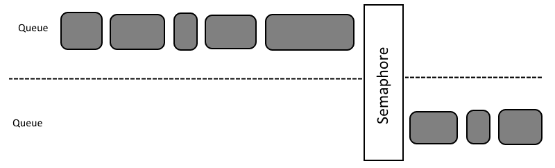
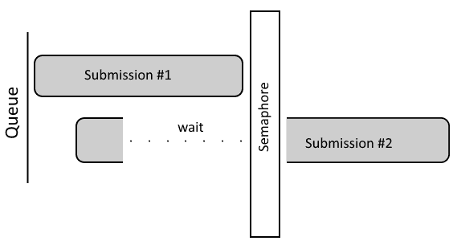

# 第三章：命令缓冲区和同步

在本章中，我们将涵盖以下内容：

+   创建命令池

+   分配命令缓冲区

+   开始命令缓冲区记录操作

+   结束命令缓冲区记录操作

+   重置命令缓冲区

+   重置命令池

+   创建信号量

+   创建栅栏

+   等待栅栏

+   重置栅栏

+   将命令缓冲区提交到队列

+   同步两个命令缓冲区

+   检查提交的命令缓冲区的处理是否完成

+   等待直到队列中提交的所有命令完成

+   等待所有提交的命令完成

+   销毁栅栏

+   销毁信号量

+   释放命令缓冲区

+   销毁命令池

# 简介

与 OpenGL 等高级 API 相比，Vulkan 等低级 API 给我们提供了对硬件的更多控制。这种控制不仅通过我们可以创建、管理和操作的资源来实现，而且特别通过与硬件的通信和交互来实现。Vulkan 给我们的控制是细粒度的，因为我们明确指定了哪些命令被发送到硬件，如何以及何时发送。为此，引入了**命令缓冲区**；这些是 Vulkan API 向开发者公开的最重要对象之一。它们允许我们记录操作并将它们提交给硬件，在那里它们被处理或执行。更重要的是，我们可以多线程记录它们，而在 OpenGL 等高级 API 中，不仅命令在单个线程中记录，而且它们由驱动程序隐式记录并发送到硬件，开发者没有任何控制。Vulkan 还允许我们重用现有的命令缓冲区，节省额外的处理时间。所有这些都给我们提供了更多的灵活性，但也带来了更多的责任。

由于这个原因，我们需要控制的不只是我们提交的操作，还有它们的时间。特别是当某些操作依赖于其他操作的结果时，我们需要格外小心，并适当地同步提交的命令。为此，引入了信号量和栅栏。

在本章中，我们将学习如何分配、记录和提交命令缓冲区，如何创建同步原语并使用它们来控制提交操作的执行，如何内部同步命令缓冲区，直接在 GPU 上，以及如何同步应用程序与硬件处理的工作。

# 创建命令池

命令池是从中获取命令缓冲区内存的对象。内存本身是隐式和动态分配的，但没有它，命令缓冲区就没有存储空间来保存记录的命令。这就是为什么，在我们能够分配命令缓冲区之前，我们首先需要为它们创建一个内存池。

# 如何做到这一点...

1.  创建一个名为 `logical_device` 的 `VkDevice` 类型的变量，并用已创建的逻辑设备的句柄初始化它。

1.  取逻辑设备请求的队列家族之一的索引。将此索引存储在名为 `queue_family` 的 `uint32_t` 类型的变量中。

1.  创建一个名为 `command_pool_create_info` 的 `VkCommandPoolCreateInfo` 类型的变量。为此变量的成员使用以下值：

    +   `VK_STRUCTURE_TYPE_COMMAND_POOL_CREATE_INFO` 值用于 `sType`

    +   `nullptr` 值用于 `pNext`

    +   表示 `VkCommandPoolCreateFlags` 类型选择参数的位字段，用于 `flags`

    +   `queue_family` 变量用于 `queueFamilyIndex`

1.  创建一个名为 `command_pool` 的 `VkCommandPool` 类型的变量，其中将存储命令池的句柄。

1.  使用 `logical_device` 变量、指向 `command_pool_create_info` 变量的指针、`nullptr` 值和指向 `command_pool` 变量的指针调用 `vkCreateCommandPool(logical_device, &command_pool_create_info, nullptr, &command_pool)`。

1.  确保调用返回了 `VK_SUCCESS` 值。

# 它是如何工作的...

命令池主要用于作为命令缓冲区的内存来源，但这并不是它们被创建的唯一原因。它们通知驱动程序从它们分配的命令缓冲区的预期用途，以及我们是否必须批量重置或释放它们，或者是否可以单独对每个命令缓冲区进行操作。这些参数通过 `VkCommandPoolCreateInfo` 类型变量的 `flags` 成员（如下通过 `parameters` 变量表示）指定，如下所示：

```cpp
VkCommandPoolCreateInfo command_pool_create_info = { 
  VK_STRUCTURE_TYPE_COMMAND_POOL_CREATE_INFO, 
  nullptr, 
  parameters, 
  queue_family 
};

```

当我们指定 `VK_COMMAND_POOL_CREATE_TRANSIENT_BIT` 位时，这意味着从给定池分配的命令缓冲区将存活很短的时间，它们将被提交很少的次数，并将立即重置或释放。当我们使用 `VK_COMMAND_POOL_CREATE_RESET_COMMAND_BUFFER_BIT` 时，我们可以单独重置命令缓冲区。如果没有此标志，我们只能在组中这样做 - 在所有从给定池分配的命令缓冲区上。隐式记录命令缓冲区会重置它，因此如果没有此标志，我们只能记录命令缓冲区一次。如果我们想再次记录它，我们需要重置从它分配的整个池。

命令池还控制可以提交到哪些队列。这是通过队列家族索引实现的，我们必须在创建池时提供该索引（只有逻辑设备创建期间请求的家族才能提供）。从给定池分配的命令缓冲区只能提交到指定的家族的队列。

要创建一个池，我们需要准备以下代码：

```cpp
VkResult result = vkCreateCommandPool( logical_device, &command_pool_create_info, nullptr, &command_pool ); 
if( VK_SUCCESS != result ) { 
  std::cout << "Could not create command pool." << std::endl; 
  return false; 
} 
return true;

```

命令池不能从多个线程同时访问（同一池的命令缓冲区不能同时在多个线程上记录）。这就是为什么每个将记录命令缓冲区的应用程序线程都应该使用单独的命令池。

现在，我们已经准备好分配命令缓冲区。

# 参见

本章中的以下配方：

+   *分配命令缓冲区*

+   *重置命令缓冲区*

+   *重置命令池*

+   *销毁命令池*

# 分配命令缓冲区

命令缓冲区用于存储（记录）稍后提交到队列中的命令，在那里它们由硬件执行和处理，以给我们结果。当我们创建了一个命令池，我们可以使用它来分配命令缓冲区。

# 如何做...

1.  拿到一个已创建的逻辑设备的句柄，并将其存储在名为 `logical_device` 的 `VkDevice` 类型的变量中。

1.  拿到一个命令池的句柄，并使用它来初始化一个名为 `command_pool` 的 `VkCommandPool` 类型的变量。

1.  创建一个名为 `command_buffer_allocate_info` 的 `VkCommandBufferAllocateInfo` 类型的变量，并为其成员使用以下值：

    +   `VK_STRUCTURE_TYPE_COMMAND_BUFFER_ALLOCATE_INFO` 值用于 `sType`

    +   `nullptr` 值用于 `pNext`

    +   `command_pool` 变量用于 `commandPool`

    +   `VK_COMMAND_BUFFER_LEVEL_PRIMARY` 值或 `VK_COMMAND_BUFFER_LEVEL_SECONDARY` 值用于 `level`

    +   我们想要为 `commandBufferCount` 分配的命令缓冲区数量

1.  创建一个名为 `command_buffers` 的 `std::vector<VkCommandBuffer>` 类型的向量。将向量的大小调整为能够容纳我们想要创建的命令缓冲区数量。

1.  调用 `vkAllocateCommandBuffers( logical_device, &command_buffer_allocate_info, &command_buffers[0] )`，为它提供一个逻辑设备的句柄，`command_buffer_allocate_info` 变量的指针以及 `command_buffers` 向量第一个元素的指针。

1.  成功时，通过调用返回的 `VK_SUCCESS` 值指示，所有创建的命令缓冲区的句柄都将存储在 `command_buffers` 向量中。

# 它是如何工作的...

命令缓冲区是从命令池中分配的。这允许我们控制它们的一些属性在整个组中。首先，我们只能将命令缓冲区提交到在命令池创建期间选择的家族的队列。其次，由于命令池不能并发使用，我们应该为我们的应用程序中想要记录命令的每个线程创建单独的命令池，以最小化同步并提高性能。

但是，命令缓冲区也有它们各自的属性。其中一些在开始记录操作时指定，但在命令缓冲区分配期间我们需要选择一个非常重要的参数——我们是否想要分配**主**或**次**命令缓冲区：

+   主命令缓冲区可以直接提交到队列。它们也可以执行（调用）次级命令缓冲区。

+   次级命令缓冲区只能从主命令缓冲区执行，并且不允许提交它们。

这些参数通过类型为 `VkCommandBufferAllocateInfo` 的变量指定，如下所示：

```cpp
VkCommandBufferAllocateInfo command_buffer_allocate_info = { 
  VK_STRUCTURE_TYPE_COMMAND_BUFFER_ALLOCATE_INFO, 
  nullptr, 
  command_pool, 
  level, 
  count 
};

```

接下来，为了分配命令缓冲区，我们需要以下代码：

```cpp
command_buffers.resize( count ); 

VkResult result = vkAllocateCommandBuffers( logical_device, &command_buffer_allocate_info, &command_buffers[0] ); 
if( VK_SUCCESS != result ) { 
  std::cout << "Could not allocate command buffers." << std::endl; 
  return false; 
} 
return true;

```

现在我们已经分配了命令缓冲区，我们可以在我们的应用程序中使用它们。为此，我们需要在一个或多个命令缓冲区中记录操作，然后将它们提交到队列。

# 参见

本章中的以下食谱：

+   *创建命令池*

+   *开始命令缓冲区记录操作*

+   *结束命令缓冲区记录操作*

+   *将命令缓冲区提交到队列*

+   *释放命令缓冲区*

# 开始命令缓冲区记录操作

当我们想要使用硬件执行操作时，我们需要记录它们并将它们提交到队列。命令被记录在命令缓冲区中。因此，当我们想要记录它们时，我们需要开始一个选定命令缓冲区的记录操作，实际上将其设置为记录状态。

# 如何操作...

1.  获取应记录命令的命令缓冲区的句柄，并将其存储在名为`command_buffer`的`VkCommandBuffer`类型变量中。确保命令缓冲区是从设置了`VK_COMMAND_POOL_CREATE_RESET_COMMAND_BUFFER_BIT`标志的池中分配的，或者它处于初始状态（它已被重置）。

1.  创建一个名为`usage`的`VkCommandBufferUsageFlags`类型的位字段变量，并根据满足的条件设置以下位：

    1.  如果命令缓冲区只提交一次然后重置或重新记录，设置`VK_COMMAND_BUFFER_USAGE_ONE_TIME_SUBMIT_BIT`位。

    1.  如果它是辅助命令缓冲区并且被认为是完全在渲染通道内，设置`VK_COMMAND_BUFFER_USAGE_RENDER_PASS_CONTINUE_BIT`位。

    1.  如果命令缓冲区需要在设备上执行时重新提交到队列（在之前提交的此命令缓冲区结束之前），设置`VK_COMMAND_BUFFER_USAGE_SIMULTANEOUS_USE_BIT`位。

1.  创建一个名为`secondary_command_buffer_info`的`VkCommandBufferInheritanceInfo *`类型变量。如果它是主命令缓冲区，则使用`nullptr`值初始化变量。如果是辅助命令缓冲区，则使用`VkCommandBufferInheritanceInfo`类型变量的地址初始化变量，其成员使用以下值初始化：

    +   `VK_STRUCTURE_TYPE_COMMAND_BUFFER_INHERITANCE_INFO`的`sType`值。

    +   `pNext`的`nullptr`值。

    +   对于`renderPass`，使用兼容的渲染通道的句柄，其中命令缓冲区将被执行；如果命令缓冲区不会在渲染通道内执行，则此值被忽略（参考第六章中的*创建渲染通道*配方，*渲染通道和帧缓冲区*）。

    +   在渲染通道中，命令缓冲区将要执行的子通道的索引，对于`subpass`（如果命令缓冲区不会在渲染通道内执行，则此值被忽略）。

    +   对于`framebuffer`，使用一个可选的帧缓冲区句柄，该句柄将用于命令缓冲区渲染，或者如果不知道帧缓冲区或者命令缓冲区不会在渲染通道内执行，则使用`VK_NULL_HANDLE`值。

    +   对于 `occlusionQueryEnable` 成员，如果命令缓冲区可以在执行此二级命令缓冲区的主命令缓冲区中活动遮挡查询时执行，则使用 `VK_TRUE` 值。否则，使用 `VK_FALSE` 值来表示命令缓冲区不能与启用的遮挡查询一起执行。

    +   一组可以由活动遮挡查询用于 `queryFlags` 的标志。

    +   一组可以通过活动查询 `pipelineStatistics` 计数的统计信息。

1.  创建一个名为 `command_buffer_begin_info` 的 `VkCommandBufferBeginInfo` 类型的变量。使用以下值初始化其成员：

    +   `VK_STRUCTURE_TYPE_COMMAND_BUFFER_BEGIN_INFO` 的 `sType` 值。

    +   `nullptr` 值用于 `pNext`。

    +   `usage` 变量用于 `flags`。

    +   `secondary_command_buffer_info` 变量用于 `pInheritanceInfo`。

1.  调用 `vkBeginCommandBuffer(command_buffer, &command_buffer_begin_info)` 并在第一个参数中提供命令缓冲区的句柄，在第二个参数中提供一个指向 `command_buffer_begin_info` 变量的指针。

1.  通过检查调用返回的值是否等于 `VK_SUCCESS` 来确保调用成功。

# 它是如何工作的...

记录命令缓冲区是我们可以在 Vulkan 中执行的最重要操作。这是唯一告诉硬件它应该做什么以及如何做的途径。当我们开始记录命令缓冲区时，它们的状态是未定义的。一般来说，命令缓冲区不会继承任何状态（与 OpenGL 相反，OpenGL 会保持当前状态）。因此，当我们记录操作时，我们还需要记得设置与这些操作相关的状态。这样一个状态的例子是一个绘图命令，它使用顶点属性和索引。在我们记录绘图操作之前，我们需要绑定带有顶点数据和顶点索引的适当缓冲区。

主命令缓冲区可以调用（执行）在二级命令缓冲区中记录的命令。已执行的二级命令缓冲区不会从执行它们的 主命令缓冲区继承状态。更重要的是，二级命令缓冲区记录后，主命令缓冲区的状态也是未定义的（当我们记录主命令缓冲区，并在其中执行二级命令缓冲区，我们想要继续记录主命令缓冲区，我们需要再次设置其状态）。状态继承规则只有一个例外 - 当主命令缓冲区在渲染通道内，并且我们从其中执行二级命令缓冲区时，主命令缓冲区的渲染通道和子通道状态被保留。

在我们开始记录操作之前，我们需要准备一个 `VkCommandBufferBeginInfo` 类型的变量，通过它我们提供记录参数：

```cpp
VkCommandBufferBeginInfo command_buffer_begin_info = { 
  VK_STRUCTURE_TYPE_COMMAND_BUFFER_BEGIN_INFO, 
  nullptr, 
  usage, 
  secondary_command_buffer_info 
};

```

为了性能原因，我们应该避免记录带有 `VK_COMMAND_BUFFER_USAGE_SIMULTANEOUS_USE_BIT` 标志的命令缓冲区。

接下来，我们可以开始记录操作：

```cpp
VkResult result = vkBeginCommandBuffer( command_buffer, &command_buffer_begin_info ); 
if( VK_SUCCESS != result ) { 
  std::cout << "Could not begin command buffer recording operation." << std::endl; 
  return false; 
} 
return true;

```

从现在起，我们可以将选定的操作记录到命令缓冲区中。但我们如何知道哪些命令可以记录到命令缓冲区中？所有这些函数的名称都以`vkCmd`前缀开头，并且它们的第一参数始终是命令缓冲区（`VkCommandBuffer`类型的变量）。但是，我们需要记住，并非所有命令都可以记录到主命令缓冲区和次级命令缓冲区中。

# 相关内容

本章中的以下配方：

+   *分配命令缓冲区*

+   *结束命令缓冲区记录操作*

+   *重置命令缓冲区*

+   *重置命令池*

+   *将命令缓冲区提交到队列*

# 结束命令缓冲区记录操作

当我们不想在命令缓冲区中记录更多命令时，我们需要停止记录。

# 如何操作...

1.  获取处于记录状态（记录操作已开始）的命令缓冲区的句柄。将句柄存储在名为`command_buffer`的`VkCommandBuffer`类型变量中。

1.  调用`vkEndCommandBuffer(command_buffer)`并提供`command_buffer`变量。

1.  通过检查调用是否返回`VK_SUCCESS`值来确保记录操作成功。

# 它是如何工作的...

命令在`vkBeginCommandBuffer()`和`vkEndCommandBuffer()`函数调用之间记录到命令缓冲区中。在停止记录之前，我们不能提交命令缓冲区。换句话说，当我们完成命令缓冲区的记录后，它处于可执行状态，可以被提交。

为了使记录操作尽可能快，并尽可能减少对性能的影响，记录的命令不报告任何错误。如果发生任何问题，它们将由`vkEndCommandBuffer()`函数报告。

因此，当我们停止记录命令缓冲区时，我们应该确保记录操作成功。我们可以这样做：

```cpp
VkResult result = vkEndCommandBuffer( command_buffer ); 
if( VK_SUCCESS != result ) { 
  std::cout << "Error occurred during command buffer recording." << std::endl; 
  return false; 
} 
return true;

```

如果在记录操作过程中出现错误（`vkEndCommandBuffer()`函数返回的值不等于`VK_SUCCESS`），我们无法提交这样的命令缓冲区，我们需要重置它。

# 相关内容

本章中的以下配方：

+   *开始命令缓冲区记录操作*

+   *将命令缓冲区提交到队列*

+   *重置命令缓冲区*

# 重置命令缓冲区

当命令缓冲区之前已被记录，或者记录操作过程中出现错误时，在可以再次重录之前，必须重置命令缓冲区。我们可以通过开始另一个记录操作隐式地做到这一点。但，我们也可以显式地做到这一点。

# 如何操作...

1.  从使用带有`VK_COMMAND_POOL_CREATE_RESET_COMMAND_BUFFER_BIT`标志创建的池中分配命令缓冲区的句柄。将句柄存储在名为`command_buffer`的`VkCommandBuffer`类型变量中。

1.  创建一个名为 `release_resources` 的 `VkCommandBufferResetFlags` 类型的变量。如果想要释放缓冲区分配的内存并将其返回到池中，则在变量中存储 `VK_COMMAND_BUFFER_RESET_RELEASE_RESOURCES_BIT` 的值。否则，在变量中存储 `0` 值。

1.  调用 `vkResetCommandBuffer( command_buffer, release_resources )` 并在第一个参数中提供命令缓冲区的句柄，在第二个参数中提供 `release_resources` 变量。

1.  通过检查返回值是否等于 `VK_SUCCESS` 来确保调用成功。

# 它是如何工作的...

命令缓冲区可以通过重置整个命令池或单独重置来批量重置。只有当创建命令池时带有 `VK_COMMAND_POOL_CREATE_RESET_COMMAND_BUFFER_BIT` 标志时，才能执行单独的重置。

重置命令缓冲区是在开始记录时隐式执行的，或者通过调用 `vkResetCommandBuffer()` 函数显式执行。显式重置使我们能够控制命令缓冲区从其池中分配的内存。在显式重置期间，我们可以决定是否要将内存返回到池中，或者命令缓冲区是否应该保留它并在下一次命令记录期间重用它。

单个命令缓冲区的重置是显式执行的，如下所示：

```cpp
VkResult result = vkResetCommandBuffer( command_buffer, release_resources ? VK_COMMAND_BUFFER_RESET_RELEASE_RESOURCES_BIT : 0 ); 
if( VK_SUCCESS != result ) { 
  std::cout << "Error occurred during command buffer reset." << std::endl; 
  return false; 
} 
return true;

```

# 参见

本章中的以下食谱：

+   *创建命令池*

+   *开始命令缓冲区记录操作*

+   *重置命令池*

# 重置命令池

当我们不希望单独重置命令缓冲区，或者如果我们没有带有 `VK_COMMAND_POOL_CREATE_RESET_COMMAND_BUFFER_BIT` 标志创建池时，我们可以一次性重置从给定池分配的所有命令缓冲区。

# 如何做到这一点...

1.  获取逻辑设备的句柄并将其存储在一个名为 `logical_device` 的 `VkDevice` 类型的变量中。

1.  获取已创建的命令池的句柄。使用它来初始化一个名为 `command_pool` 的 `VkCommandPool` 类型的变量。

1.  创建一个名为 `release_resources` 的 `VkCommandPoolResetFlags` 类型的变量，并将其初始化为 `VK_COMMAND_POOL_RESET_RELEASE_RESOURCES_BIT`，如果应该释放由命令池分配的所有命令缓冲区保留的内存并将其返回到池中，否则初始化为 `0` 值。

1.  调用 `vkResetCommandPool( logical_device, command_pool, release_resources )` 并提供 `logical_device`、`command_pool` 和 `release_resources` 变量。

1.  确保调用返回了 `VK_SUCCESS` 值，这表示操作成功。

# 它是如何工作的...

重置命令池会导致从它分配的所有命令缓冲区返回到其初始状态，就像它们从未被记录过一样。这与分别重置所有命令缓冲区类似，但更快，我们不需要创建一个带有 `VK_COMMAND_POOL_CREATE_RESET_COMMAND_BUFFER_BIT` 标志的命令池。

当记录命令缓冲区时，它们从池中获取它们的内存。这是自动完成的，不受我们的控制。当我们重置命令池时，我们可以选择命令缓冲区是否应该保留它们的内存以供以后使用，或者是否应该将其返回到池中。

要一次性重置从指定池分配的所有命令缓冲区，我们需要以下代码：

```cpp
VkResult result = vkResetCommandPool( logical_device, command_pool, release_resources ? VK_COMMAND_POOL_RESET_RELEASE_RESOURCES_BIT : 0 ); 
if( VK_SUCCESS != result ) { 
  std::cout << "Error occurred during command pool reset." << std::endl; 
  return false; 
} 
return true;

```

# 参见

本章中的以下食谱：

+   *创建命令池*

+   *分配命令缓冲区*

+   *重置命令缓冲区*

# 创建信号量

在我们能够提交命令并利用设备的处理能力之前，我们需要知道如何同步操作。信号量是用于同步的原始数据之一。它们允许我们协调提交到队列的操作，不仅限于一个队列内部，还可以在不同的逻辑设备队列之间。

当我们向队列提交命令时使用信号量。因此，在我们能够在提交命令缓冲区时使用它们之前，我们需要创建它们。

# 如何操作...

1.  拿到一个已创建的逻辑设备的句柄。将句柄存储在一个名为 `logical_device` 的 `VkDevice` 类型的变量中。

1.  创建一个名为 `semaphore_create_info` 的 `VkSemaphoreCreateInfo` 类型的变量。使用以下值初始化其成员：

    +   `VK_STRUCTURE_TYPE_SEMAPHORE_CREATE_INFO` 的 `sType` 值

    +   `pNext` 的 `nullptr` 值

    +   `flags` 的 `0` 值

1.  创建一个名为 `semaphore` 的 `VkSemaphore` 类型的变量。在这个变量中，将存储创建的信号量的句柄。

1.  调用以下函数：`vkCreateSemaphore( logical_device, &semaphore_create_info, nullptr, &semaphore )`。为此调用使用 `logical_device` 变量，`semaphore_create_info` 变量的指针，一个 `nullptr` 值和一个 `semaphore` 变量的指针。

1.  通过检查返回值是否等于 `VK_SUCCESS` 来确保信号量创建成功。

# 它是如何工作的...

作为同步原语，信号量只有两种不同的状态：已信号量或未信号量。信号量在命令缓冲区提交期间使用。当我们将它们提供给要信号量的信号量列表时，一旦给定批次中提交的所有工作完成，它们的状态就会变为已信号量。以类似的方式，当我们向队列提交命令时，我们可以指定提交的命令应等待直到指定列表中的所有信号量都变为已信号量。这样，我们可以协调提交到队列的工作，并推迟依赖于其他命令结果的命令的处理。

当信号量被信号量并所有等待它们的命令恢复时，信号量会自动重置（它们的状态变为未信号量）并可以再次使用。

当我们从交换链获取图像时，也会使用信号量。在这种情况下，在提交引用已获取图像的命令时，必须使用此类信号量。这些命令应等待直到交换链图像不再被呈现引擎使用，这由信号量标记操作指示。这在下图中显示：



信号量是通过 `vkCreateSemaphore()` 函数调用创建的。创建过程中所需的参数通过 `VkSemaphoreCreateInfo` 类型的变量提供，如下所示：

```cpp
VkSemaphoreCreateInfo semaphore_create_info = { 
  VK_STRUCTURE_TYPE_SEMAPHORE_CREATE_INFO, 
  nullptr, 
  0 
};

```

要创建一个信号量，我们需要准备一段类似于以下的代码：

```cpp
VkResult result = vkCreateSemaphore( logical_device, &semaphore_create_info, nullptr, &semaphore ); 
if( VK_SUCCESS != result ) { 
  std::cout << "Could not create a semaphore." << std::endl; 
  return false; 
} 
return true;

```

信号量只能用于同步提交到队列的工作，因为它们在内部协调图形硬件。应用程序无法访问信号量的状态。如果应用程序应该与提交的命令同步，则需要使用栅栏。

# 参见

在 第二章 的 *图像呈现* 中，查看以下食谱：

+   *获取交换链图像*

+   *呈现图像*

本章中的以下食谱：

+   *创建栅栏*

+   *将命令缓冲区提交到队列*

+   *同步两个命令缓冲区*

+   *销毁信号量*

# 创建一个栅栏

与信号量相反，栅栏用于同步应用程序与提交到图形硬件的命令。它们通知应用程序已提交的工作处理已完成。但在我们可以使用栅栏之前，我们需要创建它们。

# 如何做到这一点...

1.  使用创建的逻辑设备并使用其句柄初始化一个名为 `logical_device` 的 `VkDevice` 类型的变量。

1.  创建一个名为 `fence_create_info` 的 `VkFenceCreateInfo` 类型的变量。使用以下值初始化其成员：

    +   `VK_STRUCTURE_TYPE_FENCE_CREATE_INFO` 的 `sType` 值

    +   `pNext` 的值为 `nullptr`。

    +   对于 `flags`，如果创建的栅栏应该是未标记的，则使用 `0` 值；如果创建的栅栏应该是标记的，则使用 `VK_FENCE_CREATE_SIGNALED_BIT` 值。

1.  创建一个名为 `fence` 的 `VkFence` 类型的变量，它将保存创建的栅栏的句柄。

1.  调用 `vkCreateFence(logical_device, &fence_create_info, nullptr, &fence)` 并提供 `logical_device` 变量，`fence_create_info` 变量的指针，一个 `nullptr` 值和 `fence` 变量的指针。

1.  通过将返回值与 `VK_SUCCESS` 枚举值进行比较，确保调用成功。

# 它是如何工作的...

栅栏，与其他同步原语类似，只有两种状态：已标记和未标记。它们可以在这两种状态中的任何一种创建，但它们的状态由应用程序重置--这将从已标记状态变为未标记状态。

为了标记一个栅栏，我们需在命令缓冲区提交时提供它。这样的栅栏，类似于信号量，一旦与栅栏一起提交的所有工作完成，就会立即被标记。但是，栅栏不能用来同步命令缓冲区。应用程序可以查询栅栏的状态，并且可以在栅栏被标记之前等待。

信号量用于同步提交的命令缓冲区之间。栅栏用于同步应用程序与提交的命令。

要创建一个栅栏，我们需要准备一个名为`VkFenceCreateInfo`的变量，在其中我们必须选择是否希望创建的栅栏已经处于标记状态，或者它应该是未标记的：

```cpp
VkFenceCreateInfo fence_create_info = { 
  VK_STRUCTURE_TYPE_FENCE_CREATE_INFO, 
  nullptr, 
  signaled ? VK_FENCE_CREATE_SIGNALED_BIT : 0 
};

```

接下来，此结构被提供给`vkCreateFence()`函数，该函数使用指定的参数创建一个栅栏：

```cpp
VkResult result = vkCreateFence( logical_device, &fence_create_info, nullptr, &fence ); 
if( VK_SUCCESS != result ) { 
  std::cout << "Could not create a fence." << std::endl; 
  return false; 
} 
return true;

```

# 参见

本章中的以下食谱：

+   *创建一个信号量*

+   *等待栅栏*

+   *重置栅栏*

+   *将命令缓冲区提交到队列*

+   *检查提交的命令缓冲区的处理是否完成*

+   *销毁一个栅栏*

# 等待栅栏

当我们想知道提交的命令处理何时完成时，我们需要使用一个栅栏，并在命令缓冲区提交时提供它。然后，应用程序可以检查栅栏的状态，并等待它被标记。

# 如何做到这一点...

1.  取已创建的逻辑设备，并使用其句柄初始化一个名为`logical_device`的`VkDevice`类型的变量。

1.  创建一个应用程序应该等待的栅栏列表。将所有栅栏的句柄存储在一个名为`std::vector<VkFence>`的变量`fences`中。

1.  创建一个名为`wait_for_all`的`VkBool32`类型的变量。如果应用程序应该等待直到所有指定的栅栏都被标记，则用`VK_TRUE`的值初始化它。如果应用程序应该等待直到任何栅栏被标记（至少有一个），则用`VK_FALSE`的值初始化该变量。

1.  创建一个名为`timeout`的`uint64_t`类型的变量。用表示应用程序应该等待多长时间（以纳秒为单位）的值初始化该变量。

1.  调用`vkWaitForFences(logical_device, static_cast<uint32_t>(fences.size()), &fences[0], wait_for_all, timeout)`。提供逻辑设备的句柄、`fences`向量的元素数量、`fences`变量的第一个元素的指针、`wait_for_all`和`timeout`变量。

1.  检查调用返回的值。如果它等于`VK_SUCCESS`，则表示条件得到满足——一个或所有栅栏（取决于`wait_for_all`变量的值）在指定时间内被标记。如果条件未满足，则返回`VK_TIMEOUT`。

# 它是如何工作的...

`vkWaitForFences()` 函数会阻塞应用程序一段时间，或者直到提供的栅栏变为已发出信号。这样，我们可以将应用程序与提交到设备队列的工作同步。这也是我们了解提交的命令处理何时完成的方法。

在调用过程中，我们可以提供多个栅栏，而不仅仅是其中一个。我们还可以等待直到所有栅栏都变为已发出信号，或者任何一个都行。如果在指定的时间内条件未满足，函数将返回 `VK_TIMEOUT` 值。否则，它返回 `VK_SUCCESS`。

我们还可以通过简单地提供其句柄并指定超时值为 `0` 来检查栅栏的状态。这样，`vkWaitForFences()` 函数不会阻塞，并立即返回表示提供的栅栏当前状态的值 - 如果栅栏未发出信号（尽管没有进行真正的等待），则返回 `VK_TIMEOUT` 值；如果栅栏已经发出信号，则返回 `VK_SUCCESS` 值。

导致应用程序等待的代码可能看起来像这样：

```cpp
if( fences.size() > 0 ) { 
  VkResult result = vkWaitForFences( logical_device, static_cast<uint32_t>(fences.size()), &fences[0], wait_for_all, timeout ); 
  if( VK_SUCCESS != result ) { 
    std::cout << "Waiting on fence failed." << std::endl; 
    return false; 
  } 
  return true; 
} 
return false;

```

# 相关内容

本章以下菜谱：

+   *创建一个栅栏*

+   *重置栅栏*

+   *将命令缓冲区提交到队列*

+   *检查提交的命令缓冲区处理是否完成*

# 重置栅栏

信号量会自动重置。但是，当栅栏变为已发出信号时，将栅栏重置回未发出信号状态是应用程序的责任。

# 如何操作...

1.  将创建的逻辑设备句柄存储在名为 `logical_device` 的 `VkDevice` 类型变量中。

1.  创建一个名为 `fences` 的向量变量。它应包含 `VkFence` 类型的元素。在变量中存储所有应重置的栅栏的句柄。

1.  调用 `vkResetFences( logical_device, static_cast<uint32_t>(fences.size()), &fences[0] )` 并提供 `logical_device` 变量、`fences` 向量中的元素数量以及 `fences` 向量第一个元素指针。

1.  通过检查调用返回的值是否等于 `VK_SUCCESS` 来确保函数调用成功。

# 它是如何工作的...

当我们想知道提交的命令何时完成时，我们使用栅栏。但我们不能提供一个已经发出信号的栅栏。我们必须首先重置它，这意味着我们将它的状态从已发出信号变为未发出信号。栅栏是由应用程序显式重置的，而不是像信号量那样自动。重置栅栏的操作如下：

```cpp
if( fences.size() > 0 ) { 
  VkResult result = vkResetFences( logical_device, static_cast<uint32_t>(fences.size()), &fences[0] ); 
  if( VK_SUCCESS != result ) { 
    std::cout << "Error occurred when tried to reset fences." << std::endl; 
    return false; 
  } 
  return VK_SUCCESS == result; 
} 
return false;

```

# 相关内容

本章以下菜谱：

+   *创建一个栅栏*

+   *等待栅栏*

+   *将命令缓冲区提交到队列*

+   *检查提交的命令缓冲区处理是否完成*

# 将命令缓冲区提交到队列

我们已经记录了命令缓冲区，并希望利用图形硬件处理准备好的操作。接下来该做什么？我们需要将准备好的工作提交到选定的队列中。

# 准备工作

在这个菜谱中，我们将使用自定义的 `WaitSemaphoreInfo` 类型的变量。它定义如下：

```cpp
struct WaitSemaphoreInfo { 
  VkSemaphore           Semaphore; 
  VkPipelineStageFlags  WaitingStage; 
};

```

通过它，我们提供一个句柄，硬件在处理给定的 `command buffer` 之前应等待该句柄，并且我们还指定了等待应发生的管道阶段。

# 如何做到这一点...

1.  获取应提交工作的工作队列的句柄。使用该句柄初始化一个名为 `queue` 的 `VkQueue` 类型的变量。

1.  创建一个名为 `wait_semaphore_handles` 的 `std::vector<VkSemaphore>` 类型的变量。如果提交的命令应该等待其他命令结束，则在变量中存储所有给定队列在处理提交的命令缓冲区之前应等待的句柄。

1.  创建一个名为 `wait_semaphore_stages` 的 `std::vector<VkPipelineStageFlags>` 类型的变量。如果提交的命令应该等待其他命令结束，则使用 `wait_semaphore_handles` 变量中的管道阶段初始化该向量，以便队列在等待相应的信号时等待。

1.  准备一个名为 `command_buffers` 的 `std::vector<VkCommandBuffer>` 类型的变量。存储所有应提交到所选队列的已记录命令缓冲区的句柄。确保这些命令缓冲区中没有任何一个正在由设备处理，或者使用 `VK_COMMAND_BUFFER_USAGE_SIMULTANEOUS_USE_BIT` 标志记录。

1.  创建一个名为 `signal_semaphores` 的 `std::vector<VkSemaphore>` 类型的变量。在此向量中，存储所有在 `command_buffers` 变量中提交的所有命令缓冲区的处理完成后应发出信号的句柄。

1.  创建一个名为 `fence` 的 `VkFence` 类型的变量。如果应在 `command_buffers` 变量中提交的所有命令缓冲区的处理完成后发出信号，则在该变量中存储此围栏的句柄。否则，使用 `VK_NULL_HANDLE` 值初始化此变量。

1.  创建一个名为 `submit_info` 的 `VkSubmitInfo` 类型的变量。使用以下值初始化其成员：

    +   `VK_STRUCTURE_TYPE_SUBMIT_INFO` 值用于 `sType`

    +   `nullptr` 值用于 `pNext`

    +   `wait_semaphore_handles` 向量中 `waitSemaphoreCount` 的元素数量

    +   指向 `wait_semaphore_handles` 向量第一个元素的指针或一个 `nullptr` 值，如果该向量为空，用于 `pWaitSemaphores`

    +   指向 `wait_semaphore_stages` 向量第一个元素的指针或一个 `nullptr` 值，如果该向量为空，用于 `pWaitDstStageMask`

    +   提交的命令缓冲区数量（`command_buffers` 向量中的元素数量）用于 `commandBufferCount`

    +   指向 `command_buffers` 向量第一个元素的指针或一个 `nullptr` 值，如果该向量为空，用于 `pCommandBuffers`

    +   `signal_semaphores` 向量中 `signalSemaphoreCount` 的元素数量

    +   指向 `signal_semaphores` 向量第一个元素的指针或一个 `nullptr` 值，如果该向量为空，用于 `pSignalSemaphores`

1.  调用 `vkQueueSubmit(queue, 1, &submit_info, fence)` 并提供应该提交工作的队列句柄，一个 `1` 值，`submit_info` 变量的指针，以及 `fence` 变量。

1.  通过检查它是否返回了 `VK_SUCCESS` 值来确保调用成功。

# 它是如何工作的...

当我们将命令缓冲区提交到设备的队列时，它们将在之前提交到同一队列的命令处理完成后立即执行。从应用程序的角度来看，我们不知道命令将在何时执行。它可能立即开始，也可能在一段时间后。

当我们想要推迟提交命令的处理时，我们需要通过提供一个信号量列表来同步它们，在提交的命令缓冲区执行之前，给定的队列应该在列表上的信号量上等待。

当我们提交命令缓冲区并提供一个信号量列表时，每个信号量都与一个管线阶段相关联。命令将执行，直到它们达到指定的管线阶段，在那里它们将被暂停并等待信号量被触发。

在提交过程中，信号量和管线阶段位于不同的数组中。因此，我们需要将包含自定义类型 `WaitSemaphoreInfo` 元素的向量拆分为两个单独的向量：

```cpp
std::vector<VkSemaphore>          wait_semaphore_handles; 
std::vector<VkPipelineStageFlags> wait_semaphore_stages; 

for( auto & wait_semaphore_info : wait_semaphore_infos ) { 
  wait_semaphore_handles.emplace_back( wait_semaphore_info.Semaphore ); 
  wait_semaphore_stages.emplace_back( wait_semaphore_info.WaitingStage ); 
}

```

现在，我们已经准备好进行常规提交。对于提交，指定命令缓冲区应该等待的信号量、执行等待的管线阶段、命令缓冲区以及应该被触发的另一个信号量列表，都是通过类型为 `VkSubmitInfo` 的变量来指定的：

```cpp
VkSubmitInfo submit_info = { 
  VK_STRUCTURE_TYPE_SUBMIT_INFO, 
  nullptr, 
  static_cast<uint32_t>(wait_semaphore_infos.size()), 
  wait_semaphore_handles.size() > 0 ? &wait_semaphore_handles[0] : nullptr, 
  wait_semaphore_stages.size() > 0 ? &wait_semaphore_stages[0] : nullptr, 
  static_cast<uint32_t>(command_buffers.size()), 
  command_buffers.size() > 0 ? &command_buffers[0] : nullptr, 
  static_cast<uint32_t>(signal_semaphores.size()), 
  signal_semaphores.size() > 0 ? &signal_semaphores[0] : nullptr 
};

```

这批数据随后以这种方式提交：

```cpp
VkResult result = vkQueueSubmit( queue, 1, &submit_info, fence ); 
if( VK_SUCCESS != result ) { 
  std::cout << "Error occurred during command buffer submission." << std::endl; 
  return false; 
} 
return true;

```

当我们提交命令缓冲区时，设备将执行记录的命令并产生预期的结果，例如，它将在屏幕上绘制一个 3D 场景。

在这里，我们只提交了一批命令缓冲区，但可能提交多个批次。

为了性能原因，我们应该尽可能少地使用函数调用提交尽可能多的批次。

如果命令缓冲区已经被提交且其执行尚未结束，我们不应该提交命令缓冲区。我们只能在命令缓冲区使用 `VK_COMMAND_BUFFER_USAGE_SIMULTANEOUS_USE_BIT` 标志记录时这样做，但出于性能原因，我们应该避免使用此标志。

# 参见

本章中接下来的菜谱：

+   *开始命令缓冲区记录操作*

+   *结束命令缓冲区记录操作*

+   *创建一个信号量*

+   *创建一个栅栏*

# 同步两个命令缓冲区

我们知道如何准备工作和将其提交到队列中。我们也知道如何创建信号量。在这个示例菜谱中，我们将看到如何使用信号量来同步两个命令缓冲区。更具体地说，我们将学习如何推迟处理一个命令缓冲区，直到另一个命令缓冲区的处理完成。

# 准备就绪

在这个菜谱中，我们将使用在 *将命令缓冲区提交到队列* 菜谱中引入的 `WaitSemaphoreInfo` 结构。为了参考，以下是它的定义：

```cpp
struct WaitSemaphoreInfo { 
  VkSemaphore           Semaphore; 
  VkPipelineStageFlags  WaitingStage; 
};

```

# 如何做到这一点...

1.  获取将第一批次命令缓冲区提交到的队列的句柄。将此句柄存储在名为`first_queue`的`VkQueue`类型的变量中。

1.  创建在第一批次命令缓冲区的处理完成后应该被触发的信号量（参考*创建信号量*配方）。将这些信号量存储在名为`synchronizing_semaphores`的`std::vector<WaitSemaphoreInfo>`类型的变量中。准备一个列表，指定第二批次命令缓冲区在每个信号量处应该等待的阶段。将这些阶段包含在`synchronizing_semaphores`向量中。

1.  准备第一批次命令缓冲区并将它们提交到由`first_queue`变量表示的队列中。在要触发的信号量列表中包含来自`synchronizing_semaphores`向量的信号量（参见*将命令缓冲区提交到队列*配方）。

1.  获取将第二批次命令缓冲区提交到的队列的句柄。将此句柄存储在名为`second_queue`的`VkQueue`类型的变量中。

1.  准备第二批次命令缓冲区并将它们提交到由`second_queue`变量表示的队列中。在等待的信号量和阶段列表中包含来自`synchronizing_semaphores`向量的信号量和阶段（参见*将命令缓冲区提交到队列*配方）。

# 它是如何工作的...

在这个配方中，我们提交了两批命令缓冲区。当第一批次由硬件处理并完成时，它将向要触发的信号量列表中的所有信号量发出信号。我们只取信号量的句柄，因为在信号量的信号过程中不需要管道阶段：

```cpp
std::vector<VkSemaphore> first_signal_semaphores; 
for( auto & semaphore_info : synchronizing_semaphores ) { 
  first_signal_semaphores.emplace_back( semaphore_info.Semaphore ); 
} 
if( !SubmitCommandBuffersToQueue( first_queue, first_wait_semaphore_infos, first_command_buffers, first_signal_semaphores, VK_NULL_HANDLE ) ) { 
  return false; 
}

```

接下来，我们使用这些相同的信号量，在提交第二批次命令缓冲区时使用它们。这次，我们使用两个句柄和管道阶段。第二批次将等待在指定的管道阶段提供的所有信号量。这意味着提交的命令缓冲区的某些部分可能开始被处理，但当它们达到提供的阶段时，处理将暂停，如下面的图所示：



```cpp
if( !SubmitCommandBuffersToQueue( second_queue, synchronizing_semaphores, second_command_buffers, second_signal_semaphores, second_fence ) ) { 
  return false; 
} 
return true;

```

这展示了如何同步来自同一逻辑设备的不同队列提交的多个命令缓冲区的工作。第二次提交的命令缓冲区的处理将被推迟，直到第一批次的所有命令都完成。

# 参见

本章中的以下配方：

+   *创建信号量*

+   *将命令缓冲区提交到队列*

# 检查提交的命令缓冲区的处理是否完成

当我们使用信号量时，应用程序不参与同步命令缓冲区的过程。它不知道提交的命令的处理何时完成以及何时开始处理其他命令。所有这些都发生在“阶段之后”，对应用程序来说是透明的。

但是，当我们想知道给定命令缓冲区的处理何时结束时，我们需要使用栅栏。这样，我们可以检查提交的命令缓冲区何时被设备完全处理。

# 如何实现...

1.  创建一个未触发的栅栏并将其存储在名为`fence`的`VkFence`类型变量中。

1.  准备一批命令缓冲区、等待提交的信号量以及提交完成后发出信号的信号量。在将命令缓冲区提交到所选队列时使用准备好的数据。在提交期间使用`fence`变量（参考*将命令缓冲区提交到队列*配方）。

1.  通过提供逻辑设备的句柄（所有利用的资源都由此设备创建）、`fence`变量、定义是否等待所有提供的栅栏的`VK_FALSE`值以及选定的超时值来等待创建的栅栏对象（参考*等待栅栏*配方）。

1.  当等待完成并且返回`VK_SUCCESS`值时，这意味着在`fence`变量所在的批次中提交到队列的所有命令缓冲区的处理已成功完成。

# 它是如何工作的...

将应用程序与提交的命令缓冲区同步分为两步进行。首先我们创建一个栅栏，准备命令缓冲区并将它们提交到队列。我们需要记住在同一个提交中提供创建的栅栏：

```cpp
if( !SubmitCommandBuffersToQueue( queue, wait_semaphore_infos, command_buffers, signal_semaphores, fence ) ) { 
  return false; 
}

```

然后，我们只需要在我们的应用程序中等待，直到栅栏被触发。

```cpp
return WaitForFences( logical_device, { fence }, VK_FALSE, timeout );

```

这样，我们可以确保提交的命令缓冲区已被设备成功处理。

但是，典型的渲染场景不应该导致我们的应用程序完全暂停，因为这只是浪费时间。我们应该检查栅栏是否被触发。如果没有，我们应该把剩余的时间花在其他任务上，例如提高人工智能或更精确地计算物理，并定期检查栅栏的状态。当栅栏被触发时，我们然后执行依赖于已提交命令的任务。

当我们想要重用命令缓冲区时，也可以使用栅栏。在我们能够重新记录它们之前，我们必须确保它们不再被设备执行。我们应该记录并提交一系列命令缓冲区。只有当我们使用完所有这些缓冲区后，我们才开始等待栅栏（每个提交的批次都应该有一个相关的栅栏）。我们拥有的独立的命令缓冲区批次越多，我们在等待栅栏上花费的时间就越少（参考第九章，*命令记录和绘制*中的*通过增加单独渲染帧的数量来提高性能*配方）。

# 参见

本章中的以下配方：

+   *创建栅栏*

+   *等待栅栏*

+   *重置栅栏*

+   *将命令缓冲区提交到队列*

# 等待直到队列中提交的所有命令完成

当我们想要将应用程序与应用程序提交给选定队列的工作同步时，我们并不总是必须使用栅栏。应用程序等待直到选定队列提交的所有任务完成是可能的。

# 如何做到这一点...

1.  拿到提交任务的队列句柄。将其存储在一个名为 `queue` 的 `VkQueue` 类型的变量中。

1.  调用 `vkQueueWaitIdle( queue )` 并提供 `queue` 变量。

1.  我们可以通过检查调用返回的值是否等于 `VK_SUCCESS` 来确保没有发生错误。

# 它是如何工作的...

`vkQueueWaitIdle()` 函数使应用程序暂停，直到提交给指定队列的所有工作（所有命令缓冲区的处理）完成。这样，我们就不需要创建栅栏。

但这种同步操作只应在非常罕见的情况下进行。图形硬件（GPU）通常比通用处理器（CPU）快得多，可能需要不断提交工作以使应用程序充分利用其性能。

在应用程序端执行等待可能会在图形硬件的管道中引入停滞，这会导致设备效率低下地被利用。

要等待队列直到它完成所有提交的工作，我们需要准备以下代码：

```cpp
VkResult result = vkQueueWaitIdle( queue ); 
if( VK_SUCCESS != result ) { 
  std::cout << "Waiting for all operations submitted to queue failed." << std::endl; 
  return false; 
} 
return true;

```

# 参见

本章中的以下食谱：

+   *等待栅栏*

+   *将命令缓冲区提交到队列*

+   *等待所有命令完成*

# 等待所有提交的命令完成

有时我们希望等待直到提交给所有逻辑设备队列的所有工作完成。这种等待通常在我们关闭应用程序并希望销毁所有创建或分配的资源之前进行。

# 如何做到这一点...

1.  拿到一个创建的逻辑设备的句柄，并将其存储在一个名为 `logical_device` 的 `VkDevice` 类型的变量中。

1.  进行以下调用：`vkDeviceWaitIdle( logical_device )`，为它提供逻辑设备的句柄。

1.  您可以通过将返回值与 `VK_SUCCESS` 进行比较来检查是否没有错误。

# 它是如何工作的...

`vkDeviceWaitIdle()` 函数使我们的应用程序等待，直到逻辑设备不再忙碌。这类似于等待请求给定设备的所有队列--直到提交给所有队列的命令完成。

通常在退出我们的应用程序之前调用上述函数。当我们想要销毁资源时，我们必须确保它们不再被逻辑设备使用。此函数保证我们可以安全地进行此类销毁。

等待提交给设备的所有命令是这样进行的：

```cpp
VkResult result = vkDeviceWaitIdle( logical_device ); 
if( VK_SUCCESS != result ) { 
  std::cout << "Waiting on a device failed." << std::endl; 
  return false; 
} 
return true;

```

# 参见

本章中的以下食谱：

+   *等待栅栏*

+   *等待直到提交给队列的所有命令完成*

# 销毁一个栅栏

栅栏可以被多次重用。但当我们不再需要它们时，通常是在我们关闭应用程序之前，我们应该销毁它们。

# 如何做到这一点...

1.  拿起逻辑设备的把手并将其存储在一个名为 `logical_device` 的 `VkDevice` 类型的变量中。

1.  拿起应该被摧毁的栅栏把手。使用把手初始化一个名为 `fence` 的 `VkFence` 类型的变量。

1.  调用 `vkDestroyFence( logical_device, fence, nullptr )` 并提供逻辑设备的把手、`fence` 变量和一个 `nullptr` 值。

1.  出于安全原因，将 `VK_NULL_HANDLE` 值分配给 `fence` 变量。

# 它是如何工作的...

使用 `vkDestroyFence()` 函数摧毁栅栏，如下所示：

```cpp
if( VK_NULL_HANDLE != fence ) { 
  vkDestroyFence( logical_device, fence, nullptr ); 
  fence = VK_NULL_HANDLE; 
}

```

我们不需要检查 `fence` 变量的值是否不等于 `VK_NULL_HANDLE` 值，因为驱动程序会忽略空把手的摧毁。但是，我们这样做是为了跳过一个不必要的函数调用。

但是，我们不能摧毁一个无效的对象——一个没有在给定的逻辑设备上创建或已经被摧毁的对象。这就是为什么我们将 `VK_NULL_HANDLE` 值分配给带有栅栏把手的变量。

# 参见

+   在本章中，菜谱：*创建一个栅栏*。

# 摧毁一个信号量

信号量可以被多次重用，所以通常在应用程序执行时我们不需要删除它们。但是，当我们不再需要信号量，并且我们确信它没有被设备使用（既没有挂起的等待，也没有挂起的信号操作），我们可以摧毁它。

# 如何做...

1.  拿起逻辑设备的把手。将这个把手存储在一个名为 `logical_device` 的 `VkDevice` 类型的变量中。

1.  使用要被摧毁的信号量的把手初始化一个名为 `semaphore` 的 `VkSemaphore` 类型的变量。确保它没有被任何提交引用。

1.  进行以下调用：`vkDestroySemaphore( logical_device, semaphore, nullptr )`，为它提供逻辑设备的把手、信号量的把手和一个 `nullptr` 值。

1.  出于安全原因，将 `VK_NULL_HANDLE` 值分配给 `semaphore` 变量。

# 它是如何工作的...

删除一个信号量相当简单：

```cpp
if( VK_NULL_HANDLE != semaphore ) { 
  vkDestroySemaphore( logical_device, semaphore, nullptr ); 
  semaphore = VK_NULL_HANDLE; 
}

```

在我们能够摧毁一个信号量之前，我们必须确保它不再被任何执行的队列提交所引用。

如果我们执行了一个提交，并在要触发的信号量列表中提供了信号量，或者在给定提交应等待的信号量列表中提供了信号量，我们必须确保提交的命令已经完成。为此，我们需要使用应用程序应该等待的栅栏，或者使用等待将所有操作提交到给定队列或整个设备完成的函数之一（参考 *等待栅栏*、*等待直到队列中所有命令完成* 和 *等待所有提交的命令完成* 菜谱）。

# 参见

本章中的以下菜谱：

+   *创建一个信号量*

+   *等待栅栏完成*

+   *等待直到队列中所有命令完成*

+   *等待所有提交的命令完成*

# 释放命令缓冲区

当命令缓冲区不再需要，并且它们在设备上没有挂起执行时，它们可以被释放。

# 如何做到这一点...

1.  获取逻辑设备的句柄并使用它来初始化一个名为 `logical_device` 的 `VkDevice` 类型变量。

1.  获取从逻辑设备创建的命令池的句柄，并将其存储在名为 `command_pool` 的 `VkCommandPool` 类型变量中。

1.  创建一个类型为 `VkCommandBuffer` 的向量变量，命名为 `command_buffers`。将向量的大小调整为能够容纳所有应该被释放的命令缓冲区。使用应该被释放的所有命令缓冲区的句柄初始化向量元素。

1.  调用 `vkFreeCommandBuffers( logical_device, command_pool, static_cast<uint32_t>(command_buffers.size()), &command_buffers[0] )`。在调用过程中，提供逻辑设备的句柄和命令池，提供 `command_buffers` 向量中的元素数量（要释放的命令缓冲区数量）以及 `command_buffers` 向量第一个元素的指针。

1.  为了安全起见，清除 `command_buffers` 向量。

# 它是如何工作的...

命令缓冲区可以成组释放，但在单个 `vkFreeCommandBuffers()` 函数调用中，我们只能释放来自同一命令池的命令缓冲区。我们可以一次性释放任意数量的命令缓冲区：

```cpp
if( command_buffers.size() > 0 ) { 
  vkFreeCommandBuffers( logical_device, command_pool, static_cast<uint32_t>(command_buffers.size()), &command_buffers[0] ); 
  command_buffers.clear(); 
}

```

在我们能够释放命令缓冲区之前，我们必须确保它们没有被逻辑设备引用，并且所有提供命令缓冲区的提交都已经完成。

当我们销毁命令池时，从该池分配的命令缓冲区会隐式释放。因此，当我们想要销毁一个池时，我们不需要单独释放从它分配的所有命令缓冲区。

# 参见

本章中的以下食谱：

+   *创建命令池*

+   *分配命令缓冲区*

+   *等待栅栏*

+   *等待所有命令完成*

+   *销毁命令池*

# 销毁命令池

当从给定池分配的所有命令缓冲区不再使用，并且我们也不再需要该池时，我们可以安全地销毁它。

# 如何做到这一点...

1.  获取逻辑设备的句柄并将其存储在名为 `logical_device` 的 `VkDevice` 类型变量中。

1.  使用应该被销毁的池的句柄来初始化一个名为 `command_pool` 的 `VkCommandPool` 类型变量。

1.  调用 `vkDestroyCommandPool( logical_device, command_pool, nullptr )`，为它提供逻辑设备的句柄和命令池，以及一个 `nullptr` 值。

1.  为了安全起见，将 `VK_NULL_HANDLE` 值分配给 `command_pool` 变量。

# 它是如何工作的...

命令池的销毁使用以下代码：

```cpp
if( VK_NULL_HANDLE != command_pool ) { 
  vkDestroyCommandPool( logical_device, command_pool, nullptr ); 
  command_pool = VK_NULL_HANDLE; 
}

```

但是，我们不能销毁该池，直到从它分配的所有命令缓冲区不再在设备上挂起等待执行。为了做到这一点，我们可以等待栅栏（fences）或使用那些会导致应用程序等待直到所选队列停止处理命令，或者整个设备忙碌（从给定设备提交到所有队列的工作仍在处理）的函数。只有在这种情况下，我们才能安全地销毁命令池。

# 参见

本章中的以下食谱：

+   *创建命令池*

+   *等待所有提交的命令完成*
