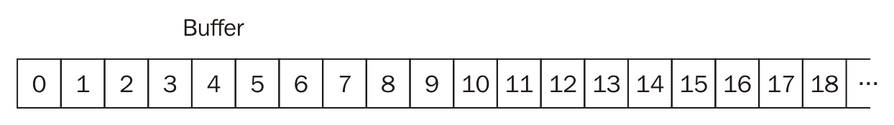
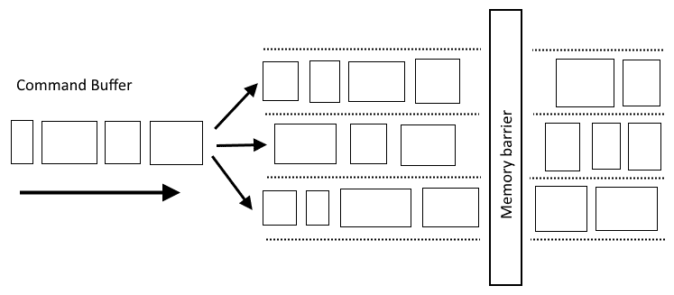
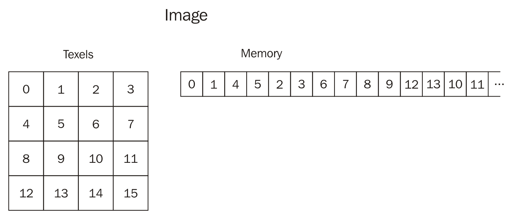
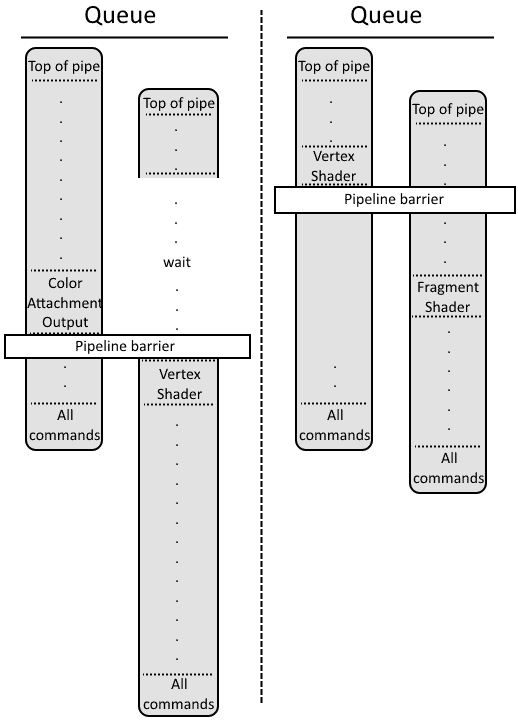

# 资源和内存

在本章中，我们将介绍以下食谱：

+   创建缓冲区

+   为缓冲区分配和绑定内存对象

+   设置缓冲区内存屏障

+   创建缓冲区视图

+   创建图像

+   分配并绑定内存对象到图像

+   设置图像内存屏障

+   创建图像视图

+   创建 2D 图像和视图

+   创建具有 CUBEMAP 视图的分层 2D 图像

+   映射、更新和取消映射主机可见内存

+   在缓冲区之间复制数据

+   从缓冲区复制数据到图像

+   从图像复制数据到缓冲区

+   使用阶段缓冲区更新具有设备本地内存绑定的缓冲区

+   使用阶段缓冲区更新具有设备本地内存绑定的图像

+   销毁图像视图

+   销毁图像

+   销毁缓冲区视图

+   释放内存对象

+   销毁缓冲区

# 简介

在 Vulkan 中，有两种非常重要的资源类型可以存储数据--缓冲区和图像。缓冲区表示数据的线性数组。图像，类似于 OpenGL 的纹理，表示一维、二维或三维数据，其组织方式（通常）针对特定硬件是特定的（因此我们不知道内部内存结构）。缓冲区和图像可用于各种目的：在着色器中，我们可以从它们读取或采样数据，或者在其中存储数据。图像可以用作颜色或深度/模板附件（渲染目标），这意味着我们可以向它们渲染。缓冲区还可以存储用于间接绘制的顶点属性、索引或参数。

非常重要的是，在资源创建期间必须指定提到的每种用法（我们一次可以提供许多）。我们还需要在应用程序中更改给定资源的使用方式时通知驱动程序。

与像 OpenGL 这样的高级 API 不同，Vulkan 中的缓冲区和图像没有自己的存储。它们需要我们特别创建和绑定适当的内存对象。

在本章中，我们将学习如何使用这些资源，以及如何为它们分配内存并将它们绑定。我们还将学习如何从 CPU 上传数据到 GPU，以及如何在资源之间复制数据。

# 创建缓冲区

缓冲区是最简单的资源，因为它们代表的数据只能在内存中线性布局，就像典型的 C/C++数组一样：



缓冲区可用于各种目的。它们可以通过描述符集在管道中使用，作为统一缓冲区、存储缓冲区或 texel 缓冲区等数据存储的 backing store，它们可以是顶点索引或属性的数据源，或者可以用作**阶段资源**--从 CPU 到 GPU 数据传输的中间资源。对于所有这些用途，我们只需要创建一个缓冲区并指定其使用方式。

# 如何做到这一点...

1.  获取存储在名为`logical_device`的`VkDevice`类型变量中的已创建逻辑设备的句柄。

1.  创建一个名为 `size` 的 `VkDeviceSize` 类型的变量，在其中存储一个表示缓冲区能够存储的数据大小（以字节为单位）的值。

1.  考虑到缓冲区将被用于的预期场景。创建一个名为 `usage` 的 `VkBufferUsageFlags` 类型的位域变量。分配一个值，它是所有期望的缓冲区使用的逻辑和（`OR`）。

1.  创建一个名为 `buffer_create_info` 的 `VkBufferCreateInfo` 类型的变量。将其成员分配以下值：

    +   `VK_STRUCTURE_TYPE_BUFFER_CREATE_INFO` 的值为 `sType`

    +   `nullptr` 的值用于 `pNext`

    +   `flags` 的值为 `0`

    +   `size` 变量用于 `size`

    +   `usage` 变量用于 `usage`

    +   `VK_SHARING_MODE_EXCLUSIVE` 的值为 `sharingMode`

    +   `0` 的值为 `queueFamilyIndexCount`

    +   `nullptr` 的值为 `pQueueFamilyIndices`

1.  创建一个名为 `buffer` 的 `VkBuffer` 类型的变量，在其中存储已创建的缓冲区的句柄。

1.  调用 `vkCreateBuffer(logical_device, &buffer_create_info, nullptr, &buffer)`，并在第一个参数中提供一个逻辑设备的句柄，在第二个参数中提供一个指向 `buffer_create_info` 变量的指针，在第三个参数中使用 `nullptr` 值，并在最后一个参数中提供一个指向 `buffer` 变量的指针。

1.  通过检查返回值是否等于 `VK_SUCCESS` 来确保函数调用成功。

# 它是如何工作的...

在我们能够创建缓冲区之前，我们需要知道缓冲区应该有多大以及我们希望如何使用它。缓冲区的大小由我们希望存储在其中的数据量决定。缓冲区在应用程序中将如何使用，由缓冲区的使用情况指定。我们不能以在缓冲区创建期间未定义的方式使用缓冲区。

缓冲区只能用于创建时指定的目的（使用情况）。

这里是一个支持缓冲区使用的列表：

+   `VK_BUFFER_USAGE_TRANSFER_SRC_BIT` 指定缓冲区可以作为复制操作的数据源

+   `VK_BUFFER_USAGE_TRANSFER_DST_BIT` 指定我们可以将数据复制到缓冲区

+   `VK_BUFFER_USAGE_UNIFORM_TEXEL_BUFFER_BIT` 表示缓冲区可以作为均匀像素缓冲区在着色器中使用

+   `VK_BUFFER_USAGE_STORAGE_TEXEL_BUFFER_BIT` 指定缓冲区可以作为存储像素缓冲区在着色器中使用

+   `VK_BUFFER_USAGE_UNIFORM_BUFFER_BIT` 表示缓冲区可以作为着色器中均匀变量的值的来源使用

+   `VK_BUFFER_USAGE_STORAGE_BUFFER_BIT` 表示我们可以在着色器中从缓冲区存储数据

+   `VK_BUFFER_USAGE_INDEX_BUFFER_BIT` 指定缓冲区可以作为绘制期间顶点索引的源使用

+   `VK_BUFFER_USAGE_VERTEX_BUFFER_BIT` 表示缓冲区可以作为绘制期间指定的顶点属性的源

+   `VK_BUFFER_USAGE_INDIRECT_BUFFER_BIT` 表示缓冲区可以包含在间接绘制过程中使用的数据

要创建缓冲区，我们需要准备一个 `VkBufferCreateInfo` 类型的变量，在其中提供以下数据：

```cpp
VkBufferCreateInfo buffer_create_info = { 
  VK_STRUCTURE_TYPE_BUFFER_CREATE_INFO, 
  nullptr, 
  0, 
  size, 
  usage, 
  VK_SHARING_MODE_EXCLUSIVE, 
  0, 
  nullptr 
};

```

`size`和`usage`变量分别定义了缓冲区可以存储的数据量以及我们在应用程序中使用缓冲区的方式。

为`sharingMode`成员提供的先前`VK_SHARING_MODE_EXCLUSIVE`值是另一个非常重要的参数。通过它，我们指定多个家族的队列是否可以同时访问缓冲区。**独占共享模式**告诉驱动程序，缓冲区只能由一个家族的队列在某一时刻引用。如果我们想使用提交给另一个家族队列的命令中的缓冲区，我们必须明确告诉驱动程序所有权的变更（当我们从一个家族转移到另一个家族时）。这个选项给我们带来了更好的性能，但代价是更多的劳动。

我们还可以指定`VK_SHARING_MODE_CONCURRENT`共享模式。使用它，多个家族的多个队列可以同时访问一个缓冲区，我们不需要执行所有权转移。但是，权衡是并发访问可能具有较低的性能。

在我们准备好了创建数据后，我们可以创建一个缓冲区如下：

```cpp
VkResult result = vkCreateBuffer( logical_device, &buffer_create_info, nullptr, &buffer ); 
if( VK_SUCCESS != result ) { 
  std::cout << "Could not create a buffer." << std::endl; 
  return false; 
} 
return true;

```

# 参见

本章中的以下食谱：

+   *为缓冲区分配和绑定内存对象*

+   *设置缓冲区内存屏障*

+   *创建缓冲区视图*

+   *使用阶段缓冲区更新具有设备本地内存绑定的缓冲区*

+   *销毁缓冲区*

# 为缓冲区分配和绑定内存对象

在 Vulkan 中，缓冲区没有自己的内存。为了能够在我们的应用程序中使用缓冲区并在其中存储任何数据，我们需要分配一个内存对象并将其绑定到缓冲区。

# 如何操作...

1.  从创建逻辑设备所用的物理设备中获取句柄。将其存储在名为`physical_device`的`VkPhysicalDevice`类型变量中。

1.  创建一个名为`physical_device_memory_properties`的`VkPhysicalDeviceMemoryProperties`类型变量。

1.  调用`vkGetPhysicalDeviceMemoryProperties( physical_device, &physical_device_memory_properties )`，为它提供物理设备的句柄和指向`physical_device_memory_properties`变量的指针。这个调用将存储用于处理的物理设备的内存参数（堆的数量、它们的大小和类型）。

1.  从物理设备创建的逻辑设备，由`physical_device`变量表示。将句柄存储在名为`logical_device`的`VkDevice`类型变量中。

1.  获取由名为`buffer`的`VkBuffer`类型变量表示的已创建缓冲区的句柄。

1.  创建一个名为`memory_requirements`的`VkMemoryRequirements`类型变量。

1.  获取用于缓冲区的内存参数。通过调用`vkGetBufferMemoryRequirements( logical_device, buffer, &memory_requirements )`来完成，第一个参数提供逻辑设备的句柄，第二个参数提供创建的缓冲区的句柄，第三个参数提供指向`memory_requirements`变量的指针。

1.  创建一个名为`memory_object`的`VkDeviceMemory`类型的变量，它将表示创建的缓冲区的内存对象，并将其分配一个`VK_NULL_HANDLE`值。

1.  创建一个名为`memory_properties`的`VkMemoryPropertyFlagBits`类型的变量，并将额外的（选择的）内存属性存储在该变量中。

1.  遍历由`physical_device_memory_properties`变量的`memoryTypeCount`成员表示的可用物理设备内存类型。通过使用名为`type`的`uint32_t`类型的变量来完成此操作。对于每次循环迭代，执行以下步骤：

    1.  确保在`memory_requirements`变量的`memoryTypeBits`成员中，由`type`变量表示的位置上的位是设置的。

    1.  确保`memory_properties`变量具有与`memoryTypes`数组中索引`type`的内存类型的`propertyFlags`成员相同的位设置。

    1.  如果 1 和 2 点不成立，则继续迭代循环。

    1.  创建一个名为`buffer_memory_allocate_info`的`VkMemoryAllocateInfo`类型的变量，并为其成员分配以下值：

        +   `VK_STRUCTURE_TYPE_MEMORY_ALLOCATE_INFO`值用于`sType`

        +   `pNext`的`nullptr`值

        +   `memory_requirements.size`变量用于`allocationSize`

        +   `type`变量用于`memoryTypeIndex`

    1.  调用`vkAllocateMemory(logical_device, &buffer_memory_allocate_info, nullptr, &memory_object)`，为它提供逻辑设备的句柄、指向`buffer_memory_allocate_info`变量的指针、一个`nullptr`值以及指向`memory_object`变量的指针。

    1.  通过检查调用返回的值是否等于`VK_SUCCESS`来确保调用成功，并停止循环迭代。

1.  确保循环内内存对象的分配成功，通过检查`memory_object`变量是否不等于`VK_NULL_HANDLE`。

1.  通过调用`vkBindBufferMemory(logical_device, buffer, memory_object, 0)`将内存对象绑定到缓冲区，为它提供`logical_device`、`buffer`、`memory_object`变量和一个`0`值。

1.  确保调用成功，并且返回值等于`VK_SUCCESS`。

# 它是如何工作的...

为了为缓冲区（或一般内存对象）分配内存对象，我们需要知道在给定的物理设备上可用的内存类型有哪些，以及它们的数量。这通过调用`vkGetPhysicalDeviceMemoryProperties()`函数来完成，如下所示：

```cpp
VkPhysicalDeviceMemoryProperties physical_device_memory_properties; 
vkGetPhysicalDeviceMemoryProperties( physical_device, &physical_device_memory_properties );

```

接下来，我们需要知道给定缓冲区需要多少存储空间（缓冲区的内存可能需要比缓冲区的大小更大）以及与之兼容的内存类型。所有这些信息都存储在一个类型为`VkMemoryRequirements`的变量中：

```cpp
VkMemoryRequirements memory_requirements; 
vkGetBufferMemoryRequirements( logical_device, buffer, &memory_requirements );

```

接下来，我们需要检查哪种内存类型对应于缓冲区的内存需求：

```cpp
memory_object = VK_NULL_HANDLE; 
for( uint32_t type = 0; type < physical_device_memory_properties.memoryTypeCount; ++type ) { 
  if( (memory_requirements.memoryTypeBits & (1 << type)) && 
      ((physical_device_memory_properties.memoryTypes[type].propertyFlags & memory_properties) == memory_properties) ) { 

    VkMemoryAllocateInfo buffer_memory_allocate_info = { 
      VK_STRUCTURE_TYPE_MEMORY_ALLOCATE_INFO, 
      nullptr, 
      memory_requirements.size, 
      type 
    }; 

    VkResult result = vkAllocateMemory( logical_device, &buffer_memory_allocate_info, nullptr, &memory_object ); 
    if( VK_SUCCESS == result ) { 
      break; 
    } 
  } 
}

```

在这里，我们遍历所有可用的内存类型，并检查给定的类型是否可以用于我们的缓冲区。我们还可以请求一些需要满足的额外内存属性。例如，如果我们想直接从我们的应用程序（从 CPU）上传数据，内存映射必须得到支持。在这种情况下，我们需要使用一个**主机可见**的内存类型。

当我们找到一个合适的内存类型时，我们可以用它来分配一个内存对象，并且我们可以停止循环。之后，我们确保内存被正确分配（如果我们没有在未分配对象的情况下离开循环），然后我们将其绑定到我们的缓冲区：

```cpp
if( VK_NULL_HANDLE == memory_object ) { 
  std::cout << "Could not allocate memory for a buffer." << std::endl; 
  return false; 
} 

VkResult result = vkBindBufferMemory( logical_device, buffer, memory_object, 0 ); 
if( VK_SUCCESS != result ) { 
  std::cout << "Could not bind memory object to a buffer." << std::endl; 
  return false; 
} 
return true;

```

在绑定过程中，我们指定一个内存偏移量，以及其他参数。这允许我们绑定不在内存对象开始处的内存的一部分。我们可以（并且应该）使用`offset`参数将内存对象的不同部分绑定到多个缓冲区。

从现在起，缓冲区可以在我们的应用程序中使用。

# 更多...

这个配方展示了如何分配和绑定一个内存对象到缓冲区。但通常，我们不应该为每个缓冲区使用一个单独的内存对象。我们应该分配更大的内存对象，并使用它们的一部分为多个缓冲区服务。

在这个配方中，我们还通过调用`vkGetPhysicalDeviceMemoryProperties()`函数获取了物理设备可用内存类型的参数。但通常，为了提高我们应用程序的性能，我们不需要每次想要分配内存对象时都调用它。我们只需调用一次这个函数，在我们选择用于逻辑设备的物理设备之后（参考第一章的*创建逻辑设备*配方[d10e8284-6122-4d0a-8f86-ab0bc0bba47e.xhtml]，*实例和设备*)，并使用存储参数的变量。

# 参见

本章中的以下配方：

+   *创建缓冲区*

+   *设置缓冲区内存屏障*

+   *映射、更新和取消映射主机可见内存*

+   *使用阶段缓冲区更新具有设备本地内存限制的缓冲区*

+   *释放内存对象*

+   *销毁缓冲区*

# 设置缓冲区内存屏障

缓冲区可用于各种目的。对于每个缓冲区，我们可以向其上传数据或从中复制数据；我们可以通过描述符集将缓冲区绑定到管道并在着色器内部将其用作数据源，或者我们可以在着色器内部将数据存储在缓冲区中。

我们必须通知驱动程序关于此类使用的每个情况，不仅是在缓冲区创建期间，而且在预期使用之前。当我们已经使用缓冲区完成一个目的，而现在我们想要以不同的方式使用它时，我们必须告诉驱动程序关于缓冲区使用的变化。这是通过缓冲区内存屏障来完成的。它们在命令缓冲区记录期间的管道屏障部分被设置（参考第三章的*开始命令缓冲区记录操作*配方[fc38e0ae-51aa-4f6f-8fb3-551861273018.xhtml]，*命令缓冲区和同步*)。

# 准备工作

在本食谱中，我们将使用一个名为 `BufferTransition` 的自定义结构体类型，其定义如下：

```cpp
struct BufferTransition { 
    VkBuffer        Buffer; 
    VkAccessFlags   CurrentAccess; 
    VkAccessFlags   NewAccess; 
    uint32_t        CurrentQueueFamily; 
    uint32_t        NewQueueFamily; 
  };

```

通过这个结构，我们将定义我们想要用于缓冲区内存屏障的参数。在 `CurrentAccess` 和 `NewAccess` 中，我们存储有关缓冲区到目前为止的使用情况和将来如何使用的相关信息（在这种情况下，使用定义为将涉及给定缓冲区的内存操作类型）。当我们在缓冲区创建期间指定 **独占共享模式** 时，使用 `CurrentQueueFamily` 和 `NewQueueFamily` 成员。

# 如何做到这一点...

1.  为你想要为每个缓冲区设置屏障的每个缓冲区准备参数。将它们存储在一个名为 `buffer_transitions` 的 `std::vector<BufferTransition>` 类型的向量中。对于每个缓冲区，存储以下参数：

    1.  `Buffer` 成员中的缓冲区句柄。

    1.  到目前为止已涉及该缓冲区的内存操作类型在 `CurrentAccess` 成员中。

    1.  从现在开始（在屏障之后）将在缓冲区上执行的内存操作类型在 `NewAccess` 成员中。

    1.  到目前为止一直引用该缓冲区的队列家族的索引（或者如果不想转移队列所有权，则使用 `VK_QUEUE_FAMILY_IGNORED` 值）在 `CurrentQueueFamily` 成员中。

    1.  从现在开始引用该缓冲区的队列家族的索引（或者如果不想转移队列所有权，则使用 `VK_QUEUE_FAMILY_IGNORED` 值）在 `NewQueueFamily` 成员中。

1.  创建一个名为 `buffer_memory_barriers` 的 `std::vector<VkBufferMemoryBarrier>` 类型的向量变量。

1.  对于 `buffer_transitions` 变量的每个元素，向 `buffer_memory_barriers` 向量中添加一个新元素。为新元素成员使用以下值：

    +   `sType` 成员的值为 `VK_STRUCTURE_TYPE_BUFFER_MEMORY_BARRIER`。

    +   `pNext` 的值为 `nullptr`。

    +   `srcAccessMask` 当前元素的 `CurrentAccess` 值。

    +   `dstAccessMask` 当前元素的 `NewAccess` 值。

    +   `srcQueueFamilyIndex` 当前元素的 `CurrentQueueFamily` 值。

    +   `dstQueueFamilyIndex` 当前元素的 `NewQueueFamily` 值。

    +   `buffer` 的缓冲区句柄。

    +   `offset` 的值为 `0`。

    +   `size` 的值为 `VK_WHOLE_SIZE`。

1.  拿到命令缓冲区的句柄并将其存储在一个名为 `command_buffer` 的 `VkCommandBuffer` 类型的变量中。

1.  确保由 `command_buffer` 句柄表示的命令缓冲区处于记录状态（记录操作已为命令缓冲区启动）。

1.  创建一个名为 `generating_stages` 的位字段类型 `VkPipelineStageFlags` 变量。在这个变量中，存储表示到目前为止已使用该缓冲区的管道阶段的值。

1.  创建一个名为 `consuming_stages` 的位字段类型 `VkPipelineStageFlags` 变量。在这个变量中，存储表示屏障之后将使用该缓冲区的管道阶段的值。

1.  调用 `vkCmdPipelineBarrier(command_buffer, generating_stages, consuming_stages, 0, 0, nullptr, static_cast<uint32_t>(buffer_memory_barriers.size()), &buffer_memory_barriers[0], 0, nullptr)`，并在第一个参数中提供命令缓冲区的句柄，在第二个和第三个参数中分别提供 `generating_stages` 和 `consuming_stages` 变量。应在第七个参数中提供 `buffer_memory_barriers` 向量的元素数量，第八个参数应指向 `buffer_memory_barriers` 向量的第一个元素。

# 它是如何工作的...

在 Vulkan 中，提交到队列的操作是按顺序执行的，但它们是独立的。有时，某些操作可能在之前的操作完成之前开始。这种并行执行是当前图形硬件最重要的性能因素之一。但有时，某些操作等待早期操作的结果是至关重要的：这时内存屏障就派上用场了。

内存屏障用于定义命令缓冲区执行中的时刻，在这些时刻，后续的命令应该等待早期命令完成其工作。它们还导致这些操作的结果对其他操作可见。

在缓冲区的情况下，通过内存屏障，我们指定了缓冲区的使用方式和在放置屏障之前使用它的管道阶段。接下来，我们需要定义在屏障之后将使用它的管道阶段以及如何使用。有了这些信息，驱动程序可以暂停需要等待早期操作结果成为可用的操作，但执行不会引用缓冲区的操作。

缓冲区只能用于创建时定义的目的。每个这样的用途都与可以通过哪种内存操作访问缓冲区内容的内存操作类型相对应。以下是支持的内存访问类型列表：

+   当缓冲区的内容是间接绘制数据源时，使用 `VK_ACCESS_INDIRECT_COMMAND_READ_BIT`

+   `VK_ACCESS_INDEX_READ_BIT` 表示缓冲区的内容在绘制操作期间用作索引

+   `VK_ACCESS_VERTEX_ATTRIBUTE_READ_BIT` 指定缓冲区是绘制期间读取的顶点属性的源

+   当缓冲区将通过着色器作为统一缓冲区访问时，使用 `VK_ACCESS_UNIFORM_READ_BIT`

+   `VK_ACCESS_SHADER_READ_BIT` 表示缓冲区可以在着色器内部读取（但不能作为统一缓冲区）

+   `VK_ACCESS_SHADER_WRITE_BIT` 指定着色器将数据写入缓冲区

+   当我们想要从缓冲区复制数据时，使用 `VK_ACCESS_TRANSFER_READ_BIT`

+   当我们想要将数据复制到缓冲区时，使用 `VK_ACCESS_TRANSFER_WRITE_BIT`

+   `VK_ACCESS_HOST_READ_BIT` 指定应用程序将读取缓冲区的内容（通过内存映射）

+   当应用程序将通过内存映射将数据写入缓冲区时，使用 `VK_ACCESS_HOST_WRITE_BIT`

+   当缓冲区的内存将以任何未在上文中指定的其他方式读取时，使用`VK_ACCESS_MEMORY_READ_BIT`

+   当缓冲区的内存将通过上述未描述的任何其他方式写入时，使用`VK_ACCESS_MEMORY_WRITE_BIT`

为了使内存操作对后续命令可见，需要设置障碍。如果没有它们，读取缓冲区内容的命令可能会在之前操作尚未正确写入内容之前就开始读取。但是，这种在命令缓冲区执行中的中断会导致图形硬件处理管道中的停滞。不幸的是，这可能会影响我们应用程序的性能：



我们应该尽可能在尽可能少的障碍中聚合尽可能多的缓冲区的使用和所有权转换。

要为缓冲区设置内存障碍，我们需要准备一个类型为`VkBufferMemoryBarrier`的变量。如果可能，我们应该在一个内存障碍中聚合多个缓冲区的数据。这就是为什么一个包含类型为`VkBufferMemoryBarrier`的元素的向量在这个原因上看起来非常有用，并且可以像这样填充：

```cpp
std::vector<VkBufferMemoryBarrier> buffer_memory_barriers; 

for( auto & buffer_transition : buffer_transitions ) { 
  buffer_memory_barriers.push_back( { 
    VK_STRUCTURE_TYPE_BUFFER_MEMORY_BARRIER, 
    nullptr, 
    buffer_transition.CurrentAccess, 
    buffer_transition.NewAccess, 
    buffer_transition.CurrentQueueFamily, 
    buffer_transition.NewQueueFamily, 
    buffer_transition.Buffer, 
    0, 
    VK_WHOLE_SIZE 
  } ); 
}

```

接下来，我们在命令缓冲区中设置一个内存障碍。这是在命令缓冲区的记录操作期间完成的：

```cpp
if( buffer_memory_barriers.size() > 0 ) { 
  vkCmdPipelineBarrier( command_buffer, generating_stages, consuming_stages, 0, 0, nullptr, static_cast<uint32_t>(buffer_memory_barriers.size()), &buffer_memory_barriers[0], 0, nullptr ); 
}

```

在障碍中，我们指定在障碍之后执行的命令的哪些管道阶段应该等待在障碍之前执行的命令的哪些管道阶段的结果。

记住，我们只有在使用改变时才需要设置障碍。如果缓冲区多次用于同一目的，我们不需要这样做。想象一下这样的情况，我们想要将数据复制到缓冲区两次，来自两个不同的资源。首先，我们需要设置一个障碍，通知驱动程序我们将执行涉及`VK_ACCESS_TRANSFER_WRITE_BIT`类型内存访问的操作。之后，我们可以将数据复制到缓冲区，次数不限。接下来，如果我们想使用缓冲区，例如，作为顶点缓冲区（渲染期间顶点属性的来源），我们需要设置另一个障碍，表明我们将从缓冲区读取顶点属性数据--这些操作由`VK_ACCESS_VERTEX_ATTRIBUTE_READ_BIT`内存访问表示。当我们完成绘制并且缓冲区将用于另一个目的时，即使我们再次想要将数据复制到缓冲区，我们仍然需要设置一个带有正确参数的内存障碍。

# 更多内容...

我们不需要为整个缓冲区设置障碍。我们只能为缓冲区内存的一部分设置。为此，我们只需要为给定缓冲区定义的类型为`VkBufferMemoryBarrier`的变量的`offset`和`size`成员指定适当的值。通过这些成员，我们定义内存内容的起始位置，以及我们想要定义障碍的内存的大小。这些值以机器单位（字节）指定。

# 参见

本章中的以下配方：

+   *开始命令缓冲区记录操作*

+   *创建缓冲区*

+   *将内存对象分配和绑定到缓冲区*

+   *设置图像内存屏障*

+   *使用阶段缓冲区更新绑定设备本地内存的缓冲区*

+   *使用阶段缓冲区更新绑定设备本地内存的图像*

# 创建缓冲区视图

当我们想要将给定的缓冲区用作统一纹理缓冲区或存储纹理缓冲区时，我们需要为它创建一个缓冲区视图。

# 如何做...

1.  从创建给定缓冲区的逻辑设备中获取句柄。将其存储在名为 `logical_device` 的 `VkDevice` 类型的变量中。

1.  获取创建的缓冲区的句柄，并将其存储在名为 `buffer` 的 `VkBuffer` 类型的变量中。

1.  为缓冲区视图选择一个格式（如何解释缓冲区的内容）并使用它初始化一个名为 `format` 的 `VkFormat` 类型的变量。

1.  选择应创建视图的缓冲区内存的一部分。在名为 `memory_offset` 的 `VkDeviceSize` 类型的变量中设置此内存的起始点（从缓冲区内存的起始点偏移）。通过名为 `memory_range` 的 `VkDeviceSize` 类型的变量定义此内存的大小。

1.  创建一个名为 `buffer_view_create_info` 的 `VkBufferViewCreateInfo` 类型的变量。使用以下值初始化其成员：

    +   `VK_STRUCTURE_TYPE_BUFFER_VIEW_CREATE_INFO` 值用于 `sType`

    +   `nullptr` 值用于 `pNext`

    +   `0` 值用于 `flags`

    +   `buffer` 变量用于 `buffer`

    +   `format` 变量用于 `format`

    +   `memory_offset` 变量用于 `offset`

    +   `memory_range` 变量用于 `range`

1.  创建一个名为 `buffer_view` 的 `VkBufferView` 类型的变量。它将用于存储创建的缓冲区视图的句柄。

1.  调用 `vkCreateBufferView( logical_device, &buffer_view_create_info, nullptr, &buffer_view )`，其中在第一个参数中提供逻辑设备的句柄，在第二个参数中提供一个指向 `buffer_view_create_info` 变量的指针，第三个参数为 `nullptr` 值，在最后一个参数中提供一个指向 `buffer_view` 变量的指针。

1.  通过检查调用返回的值是否等于 `VK_SUCCESS` 来确保调用成功。

# 它是如何工作的...

要创建缓冲区视图，我们需要考虑的最重要的事情是视图的格式和视图将创建的内存部分。这样，在着色器内部，缓冲区的内容可以像图像（纹理）一样被解释。我们定义以下参数：

```cpp
VkBufferViewCreateInfo buffer_view_create_info = { 
  VK_STRUCTURE_TYPE_BUFFER_VIEW_CREATE_INFO, 
  nullptr, 
  0, 
  buffer, 
  format, 
  memory_offset, 
  memory_range 
};

```

接下来，我们使用指定的参数创建缓冲区本身：

```cpp
VkResult result = vkCreateBufferView( logical_device, &buffer_view_create_info, nullptr, &buffer_view ); 
if( VK_SUCCESS != result ) { 
  std::cout << "Could not creat buffer view." << std::endl; 
  return false; 
} 
return true;

```

# 参见

本章中的以下食谱：

+   *创建缓冲区*

+   *将内存对象分配和绑定到缓冲区*

+   *销毁图像视图*

在 第五章 的 *描述符集* 中，查看以下食谱：

+   *创建描述符集布局*

+   *更新描述符集*

# 创建图像

图像表示具有一维、二维或三维的数据，并且可以具有额外的米普贴层和层。图像数据的每个元素（一个纹理元素）也可以有一个或多个样本。

图像可用于许多不同的目的。我们可以将它们用作复制操作的数据源。我们可以通过描述符集将图像绑定到管线，并将它们用作纹理（类似于 OpenGL）。我们可以将渲染结果输出到图像中，在这种情况下，我们使用图像作为颜色或深度附件（渲染目标）。

我们在创建图像时指定图像参数，如大小、格式和其预期用途。

# 如何做到这一点...

1.  获取我们想要在其上创建图像的逻辑设备的句柄。将其存储在名为 `logical_device` 的 `VkDevice` 类型的变量中。

1.  选择图像类型（如果图像应该有一个、两个或三个维度）并使用适当的值初始化一个名为 `type` 的 `VkImageType` 类型的变量。

1.  选择图像的格式--每个图像元素应包含的组件数和位数。将格式存储在名为 `format` 的 `VkFormat` 类型的变量中。

1.  选择图像的大小（维度）并使用它来初始化一个名为 `size` 的 `VkExtent3D` 类型的变量。

1.  选择应为图像定义的米普级别数。将米普级别数存储在名为 `num_mipmaps` 的 `uint32_t` 类型的变量中。

1.  选择应为图像定义的层数并将其存储在名为 `num_layers` 的 `uint32_t` 类型的变量中。如果图像将用作立方体贴图，则层数必须是六的倍数。

1.  创建一个名为 `samples` 的 `VkSampleCountFlagBits` 类型的变量，并用表示样本数的值初始化它。

1.  选择预期的图像用途。在名为 `usage_scenarios` 的 `VkImageUsageFlags` 类型的变量中定义它们。

1.  创建一个名为 `image_create_info` 的 `VkImageCreateInfo` 类型的变量。为其成员使用以下值：

    +   `sType` 的 `VK_STRUCTURE_TYPE_IMAGE_CREATE_INFO` 值

    +   `pNext` 的 `nullptr` 值

    +   对于 `flags`，如果图像应用作立方体贴图，则使用 `VK_IMAGE_CREATE_CUBE_COMPATIBLE_BIT` 值，否则使用 `0` 值。

    +   `imageType` 的 `type` 变量

    +   `format` 的 `format` 变量

    +   `extent` 的 `size` 变量

    +   `mipLevels` 的 `num_mipmaps` 变量

    +   `arrayLayers` 的 `num_layers` 变量

    +   `samples` 的 `samples` 变量

    +   `tiling` 的 `VK_IMAGE_TILING_OPTIMAL` 值

    +   `usage` 的 `usage_scenarios` 变量

    +   `sharingMode` 的 `VK_SHARING_MODE_EXCLUSIVE` 值

    +   `queueFamilyIndexCount` 的 `0` 值

    +   `pQueueFamilyIndices` 的 `nullptr` 值

    +   `initialLayout` 的 `VK_IMAGE_LAYOUT_UNDEFINED` 值

1.  创建一个名为 `image` 的 `VkImage` 类型的变量。在其中，将存储创建的图像的句柄。

1.  调用 `vkCreateImage(logical_device, &image_create_info, nullptr, &image)`，其中提供逻辑设备的句柄、`image_create_info` 变量的指针、一个 `nullptr` 值和 `image` 变量的指针。

1.  确保由 `vkCreateImage()` 调用返回的值等于 `VK_SUCCESS`。

# 它是如何工作的...

当我们想要创建一个图像时，我们需要准备多个参数：图像的类型、维度（大小）、组件数量以及每个组件的位数（格式）。我们还需要知道图像是否包含多级细节图（mipmap）或是否具有多个层（一个普通图像至少包含一个，立方体贴图图像至少包含六个）。我们还应该考虑预期的使用场景，这些场景也在图像创建时定义。我们不能以创建时未定义的方式使用图像。

图像只能用于创建时指定的目的（用途）。

这里列出了可以使用图像的目的：

+   `VK_IMAGE_USAGE_TRANSFER_SRC_BIT` 表示图像可以用作复制操作的数据源

+   `VK_IMAGE_USAGE_TRANSFER_DST_BIT` 表示我们可以将数据复制到图像中

+   `VK_IMAGE_USAGE_SAMPLED_BIT` 表示我们可以在着色器内部从图像中采样数据

+   `VK_IMAGE_USAGE_STORAGE_BIT` 表示图像可以用作着色器中的存储图像

+   `VK_IMAGE_USAGE_COLOR_ATTACHMENT_BIT` 表示我们可以将内容渲染到图像中（在帧缓冲区中使用它作为颜色渲染目标/附件）

+   `VK_IMAGE_USAGE_DEPTH_STENCIL_ATTACHMENT_BIT` 表示图像可以用作深度和/或模板缓冲区（作为帧缓冲区中的深度渲染目标/附件）

+   `VK_IMAGE_USAGE_TRANSIENT_ATTACHMENT_BIT` 表示绑定到图像的内存将按需分配（延迟分配）

+   `VK_IMAGE_USAGE_INPUT_ATTACHMENT_BIT` 指定图像可以用作着色器中的输入附件

不同的使用场景需要使用不同的图像布局。这些布局通过图像内存屏障进行更改（转换）。但在创建时，我们只能指定 `VK_IMAGE_LAYOUT_UNDEFINED`（如果我们不关心初始内容）或 `VK_IMAGE_LAYOUT_PREINITIALIZED`（如果我们想通过映射**主机可见**的内存来上传数据），并且我们总是在实际使用之前将其转换为另一个布局。

所有图像参数都通过类型为 `VkImageCreateInfo` 的变量指定，如下所示：

```cpp
VkImageCreateInfo image_create_info = { 
  VK_STRUCTURE_TYPE_IMAGE_CREATE_INFO, 
  nullptr, 
  cubemap ? VK_IMAGE_CREATE_CUBE_COMPATIBLE_BIT : 0u, 
  type, 
  format, 
  size, 
  num_mipmaps, 
  cubemap ? 6 * num_layers : num_layers, 
  samples, 
  VK_IMAGE_TILING_OPTIMAL, 
  usage_scenarios, 
  VK_SHARING_MODE_EXCLUSIVE, 
  0, 
  nullptr, 
  VK_IMAGE_LAYOUT_UNDEFINED 
};

```

当我们创建图像时，我们还需要指定平铺。它定义了图像的内存结构。有两种可用的图像平铺类型：线性和平滑。

当使用**线性平铺**时，正如其名所示，图像的数据在内存中线性排列，类似于缓冲区或 C/C++ 数组。这使我们能够映射图像的内存并直接从我们的应用程序中读取或初始化它，因为我们知道内存是如何组织的。不幸的是，它限制了我们可以使用图像的许多目的；例如，我们不能将图像用作深度纹理或立方体贴图（某些驱动程序可能支持它，但它不是规范所要求的，并且通常我们不应该依赖它）。线性平铺也可能降低我们应用程序的性能。

为了获得最佳性能，建议使用最佳平铺方式创建图像。

具有最佳贴图的图像可用于所有目的；它们还具有更好的性能。但这也带来了权衡——我们不知道图像的内存是如何组织的。在以下图中，我们可以看到一个图像的数据及其内部结构的示例：



每种类型的图形硬件都可以以对其最优的方式存储图像数据。正因为如此，我们无法映射图像的内存并直接从我们的应用程序中初始化或读取它。在这种情况下，我们需要使用 **阶段资源**。

当我们准备好时，我们可以使用以下代码创建一个图像：

```cpp
VkResult result = vkCreateImage( logical_device, &image_create_info, nullptr, &image ); 
if( VK_SUCCESS != result ) { 
  std::cout << "Could not create an image." << std::endl; 
  return false; 
} 
return true;

```

# 参见

本章中的以下食谱：

+   *分配和绑定内存对象到图像*

+   *设置图像内存屏障*

+   *创建图像视图*

+   *创建二维图像和视图*

+   *使用阶段缓冲区更新具有设备本地内存绑定的图像*

+   *销毁图像*

# 分配和绑定内存对象到图像

与缓冲区类似，图像不是与绑定内存存储一起创建的。我们需要隐式创建一个内存对象并将其绑定到图像上。我们也可以为此目的使用现有的内存对象。

# 如何做到这一点...

1.  获取从物理设备创建的逻辑设备的句柄。将其存储在名为 `physical_device` 的 `VkPhysicalDevice` 类型变量中。

1.  创建一个名为 `physical_device_memory_properties` 的 `VkPhysicalDeviceMemoryProperties` 类型的变量。

1.  调用 `vkGetPhysicalDeviceMemoryProperties( physical_device, &physical_device_memory_properties )`，其中提供物理设备的句柄以及指向 `physical_device_memory_properties` 变量的指针。此调用将存储用于处理提交操作的物理设备的内存参数（堆的数量、它们的大小和类型）。

1.  获取由 `physical_device` 变量表示的从物理设备创建的逻辑设备的句柄。将句柄存储在名为 `logical_device` 的 `VkDevice` 类型变量中。

1.  获取由名为 `image` 的 `VkImage` 类型变量表示的已创建图像的句柄。

1.  创建一个名为 `memory_requirements` 的 `VkMemoryRequirements` 类型的变量。

1.  获取用于图像所需的内存的参数。通过调用 `vkGetImageMemoryRequirements( logical_device, image, &memory_requirements )` 并在第一个参数中提供逻辑设备的句柄，在第二个参数中提供创建的图像的句柄，以及在第三个参数中提供指向 `memory_requirements` 变量的指针来完成此操作。

1.  创建一个名为 `memory_object` 的 `VkDeviceMemory` 类型的变量，该变量将表示为图像创建的内存对象，并将其赋值为 `VK_NULL_HANDLE`。

1.  创建一个名为 `memory_properties` 的 `VkMemoryPropertyFlagBits` 类型的变量。将额外的（选择的）内存属性存储在变量中，或者如果不需要额外的属性，则存储 `0` 值。

1.  遍历由`physical_device_memory_properties`变量的`memoryTypeCount`成员表示的可用的物理设备内存类型。通过一个名为`type`的`uint32_t`类型的变量来完成此操作。对于每次循环迭代：

    1.  确保由`memory_requirements`变量中的`memoryTypeBits`成员的`type`变量表示的位置上的位被设置。

    1.  确保`memory_properties`变量具有与`memoryTypes`内存类型的`propertyFlags`成员相同的位，在`physical_device_memory_properties`变量中的索引为`type`。

    1.  如果 1 和 2 点不成立，则继续迭代循环。

    1.  创建一个名为`image_memory_allocate_info`的`VkMemoryAllocateInfo`类型的变量，并为其成员分配以下值：

        +   `VK_STRUCTURE_TYPE_MEMORY_ALLOCATE_INFO`值用于`sType`

        +   `pNext`的`nullptr`值

        +   `memory_requirements.size`变量用于`allocationSize`

        +   `type`变量用于`memoryTypeIndex`

    1.  调用`vkAllocateMemory(logical_device, &image_memory_allocate_info, nullptr, &memory_object)`，为此提供逻辑设备的句柄、`image_memory_allocate_info`变量的指针、一个`nullptr`值以及`memory_object`变量的指针。

    1.  通过检查调用返回的值是否等于`VK_SUCCESS`来确保调用成功，并停止迭代循环。

1.  通过检查`memory_object`变量是否不等于`VK_NULL_HANDLE`，确保在循环内内存对象分配成功。

1.  通过调用`vkBindImageMemory(logical_device, image, memory_object, 0)`将内存对象绑定到图像，为此提供`logical_device`、`image`和`memory_object`变量以及一个`0`值。

1.  确保调用成功，并且返回值等于`VK_SUCCESS`。

# 它是如何工作的...

与为缓冲区创建的内存对象类似，我们首先检查给定物理设备上可用的内存类型及其属性。当然，我们可以省略这些步骤，并在我们应用程序的初始化阶段一次性收集这些信息：

```cpp
VkPhysicalDeviceMemoryProperties physical_device_memory_properties; 
vkGetPhysicalDeviceMemoryProperties( physical_device, &physical_device_memory_properties );

```

接下来，我们获取给定图像的具体内存需求。这些可能（并且很可能）对每个图像都不同，因为它们取决于图像的格式、大小、mipmap 数量和层数以及其他属性：

```cpp
VkMemoryRequirements memory_requirements; 
vkGetImageMemoryRequirements( logical_device, image, &memory_requirements );

```

下一步是找到一个具有适当参数且与图像内存需求兼容的内存类型：

```cpp
memory_object = VK_NULL_HANDLE; 
for( uint32_t type = 0; type < physical_device_memory_properties.memoryTypeCount; ++type ) { 
  if( (memory_requirements.memoryTypeBits & (1 << type)) && 
    ((physical_device_memory_properties.memoryTypes[type].propertyFlags & memory_properties) == memory_properties) ) { 

    VkMemoryAllocateInfo image_memory_allocate_info = { 

      VK_STRUCTURE_TYPE_MEMORY_ALLOCATE_INFO,    
      nullptr,                                  
      memory_requirements.size,                
      type                                     
    }; 

    VkResult result = vkAllocateMemory( logical_device, &image_memory_allocate_info, nullptr, &memory_object ); 
    if( VK_SUCCESS == result ) { 
      break; 
    } 
  } 
}

```

在这里，我们遍历所有可用的内存类型。如果一个图像内存属性的`memoryTypeBits`成员的给定位被设置，这意味着具有相同编号的内存类型与图像兼容，我们可以用它来创建内存对象。我们还可以检查内存类型的其他属性，找到适合我们需求的类型。例如，我们可能想要使用可以映射到 CPU 上的内存（一个**主机可见**的内存）。

接下来，我们检查循环内内存对象分配是否成功。如果是，我们将创建的内存对象与我们的图像绑定：

```cpp
if( VK_NULL_HANDLE == memory_object ) { 
  std::cout << "Could not allocate memory for an image." << std::endl; 
  return false; 
} 

VkResult result = vkBindImageMemory( logical_device, image, memory_object, 0 ); 
if( VK_SUCCESS != result ) { 
  std::cout << "Could not bind memory object to an image." << std::endl; 
  return false; 
} 
return true;

```

从现在起，我们可以使用图像进行其创建期间定义的所有目的。

# 更多...

类似于将内存对象绑定到缓冲区，我们应该分配更大的内存对象，并将它们的部分绑定到多个图像。这样，我们执行更少的内存分配，驱动程序需要跟踪的内存对象数量更少。这可能会提高我们应用程序的性能。它还可能允许我们节省一些内存，因为每次分配可能需要比分配时请求的更多内存（换句话说，其大小可能总是向上舍入到内存页面大小的倍数）。分配更大的内存对象并重复使用它们的部分来为多个图像节省了浪费的空间。

# 相关内容

本章中的以下菜谱：

+   *创建图像*

+   *设置图像内存屏障*

+   *映射、更新和取消映射主机可见内存*

+   *使用阶段缓冲区更新具有设备本地内存绑定的图像*

+   *销毁图像*

+   *释放内存对象*

# 设置图像内存屏障

图像被创建用于各种目的——它们被用作纹理，通过将它们绑定到管道的描述符集，作为渲染目标，或作为交换链中的可呈现图像。我们可以将数据复制到或从图像中——这些也是在图像创建期间定义的单独使用方式。

在我们开始使用图像进行任何目的之前，以及每次我们想要更改给定图像的当前使用方式时，我们需要通知驱动程序此操作。我们通过在命令缓冲区记录期间设置图像内存屏障来完成此操作。

# 准备工作

为了本菜谱的目的，引入了一个自定义结构类型 `ImageTransition`。它具有以下定义：

```cpp
struct ImageTransition { 
  VkImage             Image; 
  VkAccessFlags       CurrentAccess; 
  VkAccessFlags       NewAccess; 
  VkImageLayout       CurrentLayout; 
  VkImageLayout       NewLayout; 
  uint32_t            CurrentQueueFamily; 
  uint32_t            NewQueueFamily; 
  VkImageAspectFlags  Aspect; 
};

```

`CurrentAccess` 和 `NewAccess` 成员定义了在屏障之前和之后针对给定图像进行的内存操作类型。

在 Vulkan 中，用于不同目的的图像可能具有不同的内部内存组织。换句话说，给定图像的内存可能对不同图像使用具有不同的布局。当我们想要以不同的方式开始使用图像时，我们也需要更改此内存布局。这是通过 `CurrentLayout` 和 `NewLayout` 成员来完成的。

内存屏障还允许我们在图像以独占共享模式创建时转移队列家族所有权。在 `CurrentQueueFamily` 成员中，我们定义了一个家族的索引，该家族的队列到目前为止一直在使用图像。在 `NewQueueFamily` 中，我们需要定义一个队列家族索引，该索引用于屏障之后将使用图像的队列。我们还可以在两种情况下使用 `VK_QUEUE_FAMILY_IGNORED` 特殊值，即当我们不想转移所有权时。

`Aspect` 成员定义了图像的使用“上下文”。我们可以从颜色、深度或模板方面进行选择。

# 如何操作...

1.  为你想要设置障碍的每个图像准备参数。将它们存储在名为`image_transitions`的类型为`std::vector<ImageTransition>`的向量中。对于每个图像，使用以下值：

    +   图像在`Image`成员中的句柄。

    +   到目前为止涉及图像的内存操作类型在`CurrentAccess`成员中。

    +   在障碍之后，从现在开始将在图像上执行的内存操作类型在`NewAccess`成员中。

    +   当前图像在`CurrentLayout`成员中的内部内存布局。

    +   在`NewLayout`成员中，图像的内存布局应在障碍后更改。

    +   在`CurrentQueueFamily`成员中，引用图像的队列家族的索引（或如果不想转移队列所有权，则为`VK_QUEUE_FAMILY_IGNORED`值）。

    +   从现在开始将引用图像的队列家族的索引（或如果不想转移队列所有权，则为`VK_QUEUE_FAMILY_IGNORED`值）在`NewQueueFamily`成员中。

    +   图像在`Aspect`成员中的方面（颜色、深度或模板）。

1.  创建一个名为`image_memory_barriers`的类型为`std::vector<VkImageMemoryBarrier>`的向量变量。

1.  对于`image_transitions`变量的每个元素，向`image_memory_barriers`向量添加一个新元素。为新元素成员使用以下值：

    +   `sType`成员的`VK_STRUCTURE_TYPE_IMAGE_MEMORY_BARRIER`值。

    +   `pNext`的`nullptr`值。

    +   当前元素的`srcAccessMask`的`CurrentAccess`值。

    +   当前元素的`dstAccessMask`的`NewAccess`值。

    +   当前元素的`oldLayout`的`CurrentLayout`成员。

    +   当前元素的`newLayout`的`NewLayout`值。

    +   当前元素的`srcQueueFamilyIndex`的`CurrentQueueFamily`值。

    +   当前元素的`dstQueueFamilyIndex`的`NewQueueFamily`值。

    +   图像的`image`句柄。

    +   新元素`subresourceRange`成员的以下值：

        +   当前元素的`aspectMask`的`Aspect`成员。

        +   `baseMipLevel`的`0`值。

        +   `levelCount`的`VK_REMAINING_MIP_LEVELS`值。

        +   `baseArrayLayer`的`0`值。

        +   `layerCount`的`VK_REMAINING_ARRAY_LAYERS`值。

1.  捕获命令缓冲区的句柄，并将其存储在名为`command_buffer`的类型为`VkCommandBuffer`的变量中。

1.  确保由`command_buffer`句柄表示的命令缓冲区处于记录状态（记录操作已开始用于命令缓冲区）。

1.  创建一个名为`generating_stages`的位字段类型`VkPipelineStageFlags`变量。在这个变量中，存储表示到目前为止已经使用图像的管道阶段的值。

1.  创建一个名为`consuming_stages`的位字段类型`VkPipelineStageFlags`变量。在这个变量中，存储表示图像在障碍之后将被引用的管道阶段的值。

1.  调用 `vkCmdPipelineBarrier( command_buffer, generating_stages, consuming_stages, 0, 0, nullptr, 0, nullptr, static_cast<uint32_t>(image_memory_barriers.size()), &image_memory_barriers[0] )` 并在第一个参数中提供命令缓冲区的句柄，以及在第二个和第三个参数中分别提供 `generating_stages` 和 `consuming_stages` 变量。应在倒数第二个参数中提供 `image_memory_barriers` 向量的元素数量，最后一个参数应指向 `image_memory_barriers` 向量的第一个元素。

# 它是如何工作的...

在 Vulkan 中，操作在管道中处理。尽管操作的执行需要按照它们提交的顺序开始，但管道的某些部分仍可能并发执行。但有时，我们可能需要同步这些操作，并告知驱动程序我们希望其中一些操作等待其他操作的结果。

内存障碍用于定义命令缓冲区执行中的时刻，在此时刻后续命令应等待早期命令完成其工作。它们还导致这些操作的结果对其他操作可见。

为了使内存操作在后续命令中可见，需要设置障碍。在操作将数据写入图像且后续操作将从中读取的情况下，我们需要使用图像内存障碍。相反的情况也需要使用内存障碍——覆盖图像数据的操作应该等待早期操作停止从它们那里读取数据。在两种情况下，不这样做都会使图像的内容无效。但这种情况应该尽可能少发生，否则我们的应用程序可能会遭受性能损失。这是因为命令缓冲区执行中的这种暂停会导致图形硬件处理管道中的停滞，从而浪费时间：

为了避免对我们应用程序性能的负面影响，我们应该尽可能在尽可能少的障碍中为尽可能多的图像设置参数。


图像内存屏障也用于定义图像使用方式的变化。这种使用变化通常还需要我们同步提交的操作；这就是为什么这也通过内存屏障来完成。为了改变图像的使用，我们需要定义在屏障（内存访问）之前和之后在图像上执行的记忆操作类型。我们还指定了屏障之前的内存布局，以及屏障之后内存应该如何布局。这是因为图像在用于不同目的时可能具有不同的内存组织。例如，从着色器内部采样图像数据可能需要它们以这种方式缓存，以便相邻的纹理元素在内存中也是相邻的。但是，当内存线性布局时，写入图像数据可能执行得更快。这就是为什么在 Vulkan 中引入了图像布局。每个图像使用都有自己的、指定的布局。有一个通用的布局，可以用于所有目的。但是，不建议使用通用布局，因为它可能会影响某些硬件平台上的性能。

为了获得最佳性能，建议使用特定用途指定的图像内存布局，尽管如果布局转换过于频繁，则需要小心。

定义使用变化的参数通过`VkImageMemoryBarrier`类型的变量指定，如下所示：

```cpp
std::vector<VkImageMemoryBarrier> image_memory_barriers; 

for( auto & image_transition : image_transitions ) { 
  image_memory_barriers.push_back( { 
    VK_STRUCTURE_TYPE_IMAGE_MEMORY_BARRIER, 
    nullptr, 
    image_transition.CurrentAccess, 
    image_transition.NewAccess, 
    image_transition.CurrentLayout, 
    image_transition.NewLayout, 
    image_transition.CurrentQueueFamily, 
    image_transition.NewQueueFamily, 
    image_transition.Image, 
    { 
      image_transition.Aspect, 
      0, 
      VK_REMAINING_MIP_LEVELS, 
      0, 
      VK_REMAINING_ARRAY_LAYERS 
    } 
  } ); 
}

```

但是，为了让屏障正常工作，我们还需要定义已经使用过图像的管道阶段，以及从现在开始将使用图像的管道阶段：



在前面的图中，我们可以看到两个管道屏障的例子。在左侧，颜色是由片段着色器生成的，在所有片段测试（深度测试、混合）之后，颜色数据被写入图像。然后，这个图像被用于后续命令的顶点着色器。这种情况很可能在管道中产生停滞。

右侧的示例显示了图形命令中的另一个依赖关系。在这里，数据被写入顶点着色器中的资源。然后，这些数据被下一个命令的片段着色器使用。这一次，所有顶点着色器的实例很可能在下一个命令的片段着色器开始执行之前完成它们的工作。这就是为什么减少管道屏障的数量，并在需要时正确设置绘图命令和选择屏障的管道阶段很重要。屏障的参数（生成和消耗阶段）通过以下调用对所有在屏障中指定的图像进行聚合：

```cpp
if( image_memory_barriers.size() > 0 ) { 
  vkCmdPipelineBarrier( command_buffer, generating_stages, consuming_stages, 0, 0, nullptr, 0, nullptr, static_cast<uint32_t>(image_memory_barriers.size()), &image_memory_barriers[0] ); 
}

```

如果图像以相同的方式多次使用，并且在之间没有用于其他目的，我们实际上在使用图像之前不需要设置屏障。我们设置它来表示使用的变化，而不是使用本身。

# 参见

在第三章，*命令缓冲区和同步*中，查看以下食谱：

+   *开始命令缓冲区记录操作*

在本章中查看以下食谱：

+   *创建图像*

+   *分配和绑定内存对象到图像*

+   *使用阶段缓冲区更新绑定设备本地内存的图像*

# 创建图像视图

图像很少直接在 Vulkan 命令中使用。帧缓冲区和着色器（通过描述符集）通过图像视图访问图像。图像视图定义了图像内存的一部分，并指定了正确读取图像数据所需的其他信息。这就是为什么我们需要知道如何创建图像视图。

# 如何做到...

1.  获取逻辑设备的句柄，并使用它来初始化一个名为`logical_device`的`VkDevice`类型的变量。

1.  使用创建的图像的句柄来初始化一个名为`image`的`VkImage`类型的变量。

1.  创建一个名为`image_view_create_info`的`VkImageViewCreateInfo`类型的变量。为其成员使用以下值：

    +   `VK_STRUCTURE_TYPE_IMAGE_VIEW_CREATE_INFO`值用于`sType`

    +   `nullptr`值用于`pNext`

    +   `0`值用于`flags`

    +   `image`变量用于`image`

    +   图像视图的类型用于`viewType`

    +   图像或其他兼容格式（如果您想在视图中重新解释它）的格式用于`format`

    +   `VK_COMPONENT_SWIZZLE_IDENTITY`值用于`components`成员的所有成员

    +   使用以下值作为`subresourceRange`成员的成员：

        +   图像的方面（颜色、深度或模板）用于`aspectMask`

        +   `0`值用于`baseMipLevel`

        +   `VK_REMAINING_MIP_LEVELS`值用于`levelCount`

        +   `0`用于`baseArrayLayer`

        +   `VK_REMAINING_ARRAY_LAYERS`用于`layerCount`

1.  创建一个名为`image_view`的`VkImageView`类型的变量。我们将存储创建的图像视图的句柄。

1.  调用`vkCreateImageView(logical_device, &image_view_create_info, nullptr, &image_view)`，为它提供逻辑设备的句柄、`image_view_create_info`变量的指针、`nullptr`值和`image_view`变量的指针。

1.  通过将返回值与`VK_SUCCESS`值进行比较，确保调用成功。

# 它是如何工作的...

图像视图定义了用于访问图像的附加元数据。通过它，我们可以指定命令应访问图像的哪些部分。尽管这个食谱展示了如何为整个图像数据创建图像视图，但也可以指定一个更小的资源范围，该范围应被访问。例如，当我们在一个渲染通道内渲染图像时，我们可以指定只更新一个 mipmap 级别。

图像视图还定义了图像内存应该如何被解释。一个很好的例子是多层的图像。对于它，我们可以定义一个直接解释图像为分层图像的图像视图，或者我们可以使用图像视图从它创建一个立方体贴图。

这些参数指定如下：

```cpp
VkImageViewCreateInfo image_view_create_info = { 
  VK_STRUCTURE_TYPE_IMAGE_VIEW_CREATE_INFO, 
  nullptr, 
  0, 
  image, 
  view_type, 
  format, 
  { 
    VK_COMPONENT_SWIZZLE_IDENTITY, 
    VK_COMPONENT_SWIZZLE_IDENTITY, 
    VK_COMPONENT_SWIZZLE_IDENTITY, 
    VK_COMPONENT_SWIZZLE_IDENTITY 
  }, 
  { 
    aspect, 
    0, 
    VK_REMAINING_MIP_LEVELS, 
    0, 
    VK_REMAINING_ARRAY_LAYERS 
  } 
};

```

图像视图的创建是通过 `vkCreateImageView()` 函数的单次调用来执行的。以下是一个此类调用的示例：

```cpp
VkResult result = vkCreateImageView( logical_device, &image_view_create_info, nullptr, &image_view ); 
if( VK_SUCCESS != result ) { 
  std::cout << "Could not create an image view." << std::endl; 
  return false; 
} 
return true;

```

# 参见

本章中的以下食谱：

+   *创建图像*

+   *创建 2D 图像和视图*

+   *销毁图像视图*

# 创建 2D 图像和视图

在许多流行的应用程序或游戏中使用的最常见图像类型是典型的具有四个 RGBA 分量和每 texel 32 位的 2D 纹理。要在 Vulkan 中创建此类资源，我们需要创建一个 2D 图像和一个合适的图像视图。

# 如何做到这一点...

1.  获取一个逻辑设备句柄并使用它来初始化一个名为 `logical_device` 的 `VkDevice` 类型的变量。

1.  选择图像中使用的数据格式，并使用所选值初始化一个名为 `format` 的 `VkFormat` 类型的变量。

1.  选择图像的大小。将其存储在一个名为 `size` 的 `VkExtent2D` 类型的变量中。

1.  选择应组成图像的 mipmap 级数数量。使用所选的 mipmap 数量初始化一个名为 `num_mipmaps` 的 `uint32_t` 类型的变量。

1.  使用一个名为 `num_layers` 的 `uint32_t` 类型的变量指定图像层数。

1.  选择每 texel 样本的数量，并将其存储在一个名为 `samples` 的 `VkSampleCountFlagBits` 类型的变量中。

1.  考虑图像在应用程序中将用于的所有目的。将这些用途的逻辑和（**或**）存储在一个名为 `usage` 的 `VkImageUsageFlags` 类型的变量中。

1.  使用 `logical_device`、`format`、`size`、`num_mipmaps`、`num_layers`、`samples` 和 `usage` 变量创建一个 `VK_IMAGE_TYPE_2D` 类型的图像。将创建的图像句柄存储在一个名为 `image` 的 `VkImage` 类型的变量中（参考 *创建图像* 食谱）。

1.  从获取 `logical_device` 处理器的物理设备中获取句柄。将物理设备的句柄存储在一个名为 `physical_device` 的 `VkPhysicalDevice` 类型的变量中。

1.  获取 `physical_device` 的内存属性，并使用它们来分配一个将绑定到由 `image` 变量表示的图像的内存对象。确保使用具有 `VK_MEMORY_PROPERTY_DEVICE_LOCAL_BIT` 属性的内存类型。将分配的内存对象存储在一个名为 `memory_object` 的 `VkDeviceMemory` 类型的变量中（参考 *分配和绑定内存对象到图像* 食谱）。

1.  选择用于创建图像视图的图像的方面（颜色或深度和/或模板）并将其存储在一个名为 `aspect` 的 `VkImageAspectFlags` 类型的变量中。

1.  创建一个 `VK_IMAGE_VIEW_TYPE_2D` 类型的图像视图。在创建图像视图时使用 `logical_device`、`image`、`format` 和 `aspect` 变量。将创建的句柄存储在一个名为 `image_view` 的 `VkImageView` 类型的变量中（参考 *创建图像视图* 食谱）。

# 它是如何工作的...

图像创建需要我们执行三个一般步骤：

1.  创建一个图像。

1.  创建一个内存对象（或使用现有的一个）并将其绑定到图像。

1.  创建一个图像视图。

对于通常用作纹理的图像，我们需要创建一个类型为`VK_IMAGE_TYPE_2D`和格式为`VK_FORMAT_R8G8B8A8_UNORM`的图像，但我们可以根据需要设置这些参数。图像的其余属性取决于图像的大小（换句话说，我们正在从现有的图像文件创建纹理，我们需要匹配其尺寸），应用于图像的过滤类型（如果我们想使用米级贴图），样本数（如果它应该是多采样），以及所需的用法场景。

在*创建图像*的说明中定义的图像创建可以简化为以下代码：

```cpp
if( !CreateImage( logical_device, VK_IMAGE_TYPE_2D, format, { size.width, size.height, 1 }, num_mipmaps, num_layers, samples, usage, false, image ) ) { 
  return false; 
}

```

接下来，我们需要按照*将内存对象分配和绑定到图像*的说明将内存对象分配并绑定到图像上。为了获得最佳性能，内存对象应该分配在快速、**设备本地**的内存上，如下所示：

```cpp
if( !AllocateAndBindMemoryObjectToImage( physical_device, logical_device, image, VK_MEMORY_PROPERTY_DEVICE_LOCAL_BIT, memory_object ) ) { 
  return false; 
}

```

如果现有的内存对象满足图像的内存要求并且有足够的存储空间，我们当然可以使用它。

之后，我们必须创建一个图像视图。有了它，我们可以告诉硬件如何解释图像数据。我们还可以为图像视图使用不同的（但仍然兼容）格式。但对于许多（如果不是大多数）用途，这并不是必要的，我们将指定与图像相同的格式。对于标准的 2D 纹理，我们也在创建视图时使用颜色方面，但对于具有深度数据的图像（换句话说，用于深度附件的图像），必须指定深度方面。有关图像视图创建的更多详细信息，请参阅*创建图像视图*的说明：

```cpp
if( !CreateImageView( logical_device, image, VK_IMAGE_VIEW_TYPE_2D, format, aspect, image_view ) ) { 
  return false; 
}

```

现在，图像已准备好在我们的应用程序中使用。我们可以从文件上传数据到图像，并在着色器（在这种情况下，我们还需要一个采样器和描述符集）内部将其用作纹理。我们还可以将图像视图绑定到帧缓冲区，并将其用作颜色附件（渲染目标）。

# 参见

本章中的以下说明：

+   *创建图像*

+   *将内存对象分配和绑定到图像*

+   *创建图像视图*

+   *销毁图像视图*

+   *销毁图像*

+   *释放内存对象*

# 创建具有 CUBEMAP 视图的分层 2D 图像

在 3D 应用程序或游戏中使用的图像的一个相当常见的例子是 CUBEMAPs，用于模拟对象反射其环境。为此目的，我们不创建 CUBEMAP 图像。我们需要创建一个分层图像，并通过图像视图告诉硬件它应该将其层解释为六个 CUBEMAP 面。

# 如何操作...

1.  获取逻辑设备的句柄。将其存储在名为`logical_device`的`VkDevice`类型变量中。

1.  选择图像的大小，并记住它必须是正方形。将图像的尺寸保存到名为`size`的`uint32_t`类型变量中。

1.  选择图像的米级贴图级别数量。将名为`num_mipmaps`的`uint32_t`类型变量初始化为所选的数量。

1.  考虑所有不同的场景，在这些场景中，图像将被使用。将这些使用的逻辑和（OR）存储在名为`usage`的`VkImageUsageFlags`类型变量中。

1.  创建一个`VK_IMAGE_TYPE_2D`类型、`VK_FORMAT_R8G8B8A8_UNORM`格式、六个层和一个 texel 每个样本的图像。使用`logical_device`、`size`、`num_mipmaps`和`usage`变量设置其余图像参数。将创建的图像句柄存储在名为`image`的`VkImage`类型变量中（参考*创建图像*配方）。

1.  从获取`logical_device`句柄的物理设备中获取句柄。将其存储在名为`physical_device`的`VkPhysicalDevice`类型变量中。

1.  获取`physical_device`的内存属性。使用具有`VK_MEMORY_PROPERTY_DEVICE_LOCAL_BIT`属性的内存类型来分配内存对象。将分配的内存对象的句柄存储在名为`memory_object`的`VkDeviceMemory`类型变量中，并将其绑定到图像（参考*将内存对象绑定到图像上*配方）。

1.  选择颜色方面并将其存储在一个`VkImageAspectFlags`类型的变量中

    类型名为`aspect`。

1.  创建一个`VK_IMAGE_VIEW_TYPE_CUBE`类型和`VK_FORMAT_R8G8B8A8_UNORM`格式的图像视图。在创建图像视图时使用`logical_device`、`image`和`aspect`变量。将创建的句柄存储在名为`image_view`的`VkImageView`类型变量中（参考*创建图像视图*配方）。

# 它是如何工作的...

创建 CUBEMAP 的过程与创建任何其他类型的图像非常相似。首先，我们创建图像本身。我们只需记住图像应该至少有六个层，这些层将被解释为六个 CUBEMAP 面。对于 CUBEMAP，我们也不能在每个 texel 上使用超过一个样本：

```cpp
if( !CreateImage( logical_device, VK_IMAGE_TYPE_2D, VK_FORMAT_R8G8B8A8_UNORM, { size, size, 1 }, num_mipmaps, 6, VK_SAMPLE_COUNT_1_BIT, usage, true, image ) ) { 
  return false; 
}

```

接下来，我们以与其他资源相同的方式分配和绑定一个内存对象：

```cpp
if( !AllocateAndBindMemoryObjectToImage( physical_device, logical_device, image, VK_MEMORY_PROPERTY_DEVICE_LOCAL_BIT, memory_object ) ) { 
  return false; 
}

```

最后，我们需要创建一个图像视图。通过它，我们指定 CUBEMAP 视图类型：

```cpp
if( !CreateImageView( logical_device, image, VK_IMAGE_VIEW_TYPE_CUBE, VK_FORMAT_R8G8B8A8_UNORM, aspect, image_view ) ) { 
  return false; 
}

```

当使用 CUBEMAP 图像视图时，图像层按照顺序对应于+X、-X、+Y、-Y、+Z 和-Z 的各个面。

# 参见

本章中的以下配方：

+   *创建图像*

+   *将内存对象绑定到图像上*

+   *创建图像视图*

+   *销毁图像视图*

+   *销毁图像*

+   *释放内存对象*

# 映射、更新和取消映射主机可见内存

对于在渲染过程中使用的图像和缓冲区，建议绑定位于图形硬件上的内存（**设备本地**内存）。这给我们提供了最佳性能。但我们不能直接访问此类内存，我们需要使用中间（准备）资源，这些资源在 GPU（设备）和 CPU（主机）之间介导数据传输。

**准备资源**，另一方面，需要使用**主机可见**的内存。要将数据上传到此类内存或从中读取数据，我们需要将其映射。

# 如何做到这一点...

1.  获取创建的逻辑设备的句柄，并将其存储在一个名为 `logical_device` 的 `VkDevice` 类型的变量中。

1.  选择一个在具有 `VK_MEMORY_PROPERTY_HOST_VISIBLE_BIT` 属性的内存类型上分配的内存对象。将内存对象的句柄存储在一个名为 `memory_object` 的 `VkDeviceMemory` 类型的变量中。

1.  选择一个应该被映射和更新的内存区域。将内存对象内存的起始偏移量（以字节为单位）存储在一个名为 `offset` 的 `VkDeviceSize` 类型的变量中。

1.  选择要复制到所选内存对象区域的数据大小。使用一个名为 `data_size` 的 `VkDeviceSize` 类型的变量表示数据大小。

1.  准备要复制到内存对象中的数据。设置一个指向数据开始的指针，并使用它来初始化一个名为 `data` 的 `void*` 类型的变量。

1.  创建一个名为 `pointer` 的 `void*` 类型的变量。它将包含指向映射内存范围的指针。

1.  使用 `vkMapMemory( logical_device, memory_object, offset, data_size, 0, &local_pointer )` 调用映射内存。提供逻辑设备和内存对象的句柄、从开始处的偏移量以及我们想要映射的区域的大小（以字节为单位）、一个 `0` 值以及指向 `pointer` 变量的指针。

1.  确保调用成功，通过检查返回值是否等于 `VK_SUCCESS`。

1.  将准备好的数据复制到由 `pointer` 变量指向的内存中。可以使用以下调用完成：`std::memcpy( local_pointer, data, data_size )`。

1.  创建一个名为 `memory_ranges` 的 `std::vector<VkMappedMemoryRange>` 类型的变量。对于每个修改的范围，向向量中添加一个元素，并使用以下值初始化其成员：

    +   `VK_STRUCTURE_TYPE_MAPPED_MEMORY_RANGE` 值用于 `sType`

    +   `nullptr` 值用于 `pNext`

    +   `memory` 的 `memory_object` 变量

    +   每个范围的偏移量用于 `offset`

    +   每个范围的尺寸用于 `size`

1.  通知驱动程序哪些内存部分已更改。通过调用 `vkFlushMappedMemoryRanges( logical_device, static_cast<uint32_t>(memory_ranges.size()), &memory_ranges[0] )` 来完成此操作，并提供 `logical_device` 变量、修改的范围数量（`memory_ranges` 向量中的元素数量）以及 `memory_ranges` 向量第一个元素的指针。

1.  确保刷新成功，并且调用返回了 `VK_SUCCESS` 值。

1.  要取消映射内存，调用 `vkUnmapMemory( logical_device, memory_object )`。

# 它是如何工作的...

映射内存是将数据上传到 Vulkan 资源的最简单方法。在映射过程中，我们指定应该映射内存的哪一部分（从内存对象开始的偏移量和映射范围的尺寸）：

```cpp
VkResult result; 
void * local_pointer; 
result = vkMapMemory( logical_device, memory_object, offset, data_size, 0, &local_pointer );  
if( VK_SUCCESS != result ) { 
  std::cout << "Could not map memory object." << std::endl; 
  return false; 
}

```

映射为我们提供了请求的内存部分的指针。我们可以像在典型的 C++ 应用程序中使用其他指针一样使用这个指针。在写入或从此类内存读取数据方面没有限制。在这个菜谱中，我们从应用程序复制数据到内存对象：

```cpp
std::memcpy( local_pointer, data, data_size );

```

当我们更新映射的内存范围时，我们需要通知驱动程序内存内容已被修改，或者上传的数据可能不会立即对提交到队列的其他操作可见。通知 CPU（主机）执行的内存数据修改操作称为刷新。为此，我们准备一个更新内存范围的列表，该列表不需要覆盖整个映射内存：

```cpp
std::vector<VkMappedMemoryRange> memory_ranges = { 
  { 
  VK_STRUCTURE_TYPE_MAPPED_MEMORY_RANGE, 
  nullptr, 
  memory_object, 
  offset, 
  data_size 
  } 
}; 

vkFlushMappedMemoryRanges( logical_device, static_cast<uint32_t>(memory_ranges.size()), &memory_ranges[0] ); 
if( VK_SUCCESS != result ) { 
  std::cout << "Could not flush mapped memory." << std::endl; 
  return false; 
}

```

在我们完成处理映射内存后，我们可以取消映射它。内存映射不应影响我们应用程序的性能，并且我们可以保留获取的指针，直到我们应用程序的整个生命周期。但是，在关闭应用程序和销毁所有资源之前，我们应该释放它（取消映射）：

```cpp
if( unmap ) { 
  vkUnmapMemory( logical_device, memory_object ); 
} else if( nullptr != pointer ) { 
  *pointer = local_pointer; 
} 

return true;

```

# 参见

本章以下配方：

+   *分配并绑定内存对象到缓冲区*

+   *分配并绑定内存对象到图像*

+   *使用阶段缓冲区更新与设备本地内存绑定的缓冲区*

+   *使用阶段缓冲区更新与设备本地内存绑定的图像*

+   *释放内存对象*

# 在缓冲区之间复制数据

在 Vulkan 中，上传数据到缓冲区不仅限于内存映射技术。可以在不同内存类型分配的内存对象之间复制数据。

# 如何做...

1.  获取命令缓冲区的句柄。将其存储在名为 `command_buffer` 的类型为 `VkCommandBuffer` 的变量中。确保命令缓冲区处于记录状态（参考第三章 *开始命令缓冲区记录操作* 的配方，*命令缓冲区和同步*）。

1.  从将要复制数据的缓冲区中取出。使用名为 `source_buffer` 的类型为 `VkBuffer` 的变量来表示此缓冲区。

1.  从将要上传数据的缓冲区中取出。使用名为 `destination_buffer` 的类型为 `VkBuffer` 的变量来表示此缓冲区。

1.  创建一个名为 `regions` 的类型为 `std::vector<VkBufferCopy>` 的变量。对于应该从中复制数据的每个内存区域，向 `regions` 向量中添加一个元素。在每个元素中，指定从源缓冲区中复制数据的内存偏移量、要复制到目标缓冲区的内存偏移量以及从给定区域复制的数据大小。

1.  调用 `vkCmdCopyBuffer(command_buffer, source_buffer, destination_buffer, static_cast<uint32_t>(regions.size()), &regions[0])`，其中使用 `command_buffer`、`source_buffer` 和 `destination_buffer` 变量、`regions` 向量中的元素数量以及该向量第一个元素的指针。

# 它是如何工作的...

在缓冲区之间复制数据是更新给定资源内存内容的一种另一种方式。此操作需要记录到命令缓冲区中，如下所示：

```cpp
if( regions.size() > 0 ) { 
  vkCmdCopyBuffer( command_buffer, source_buffer, destination_buffer, static_cast<uint32_t>(regions.size()), &regions[0] ); 
}

```

为了获得最佳性能，在渲染期间使用的资源应该具有设备本地内存绑定。但是，我们不能映射此类内存。使用 `vkCmdCopyBuffer()` 函数，我们可以从具有主机可见内存绑定的另一个缓冲区将数据复制到此类缓冲区。此类内存可以直接从我们的应用程序映射和更新。

可以从其中复制数据的缓冲区必须使用 `VK_BUFFER_USAGE_TRANSFER_SRC_BIT` 用法创建。

我们必须使用 `VK_BUFFER_USAGE_TRANSFER_DST_BIT` 用法创建用于传输数据的缓冲区。

当我们想要将缓冲区用作传输操作的目标（我们想要将数据复制到缓冲区）时，我们应该设置一个内存屏障，告知驱动程序从现在开始，在缓冲区上执行的操作将由 `VK_ACCESS_TRANSFER_WRITE_BIT` 内存访问方案表示。在将数据复制到目标缓冲区并完成复制后，我们想要使用它来完成所需的目的，我们应该设置另一个内存屏障。这次，我们应该指定之前我们正在将数据传输到缓冲区（因此操作由 `VK_ACCESS_TRANSFER_WRITE_BIT` 内存访问类型表示），但在屏障之后，缓冲区将以不同的方式使用，使用另一个内存访问类型来表示对其执行的操作（参考 *设置缓冲区内存屏障* 菜谱）。

# 参见

本章中的以下菜谱：

+   *创建缓冲区*

+   *设置缓冲区内存屏障*

+   *映射、更新和取消映射主机可见内存*

+   *使用阶段缓冲区更新设备本地内存绑定的缓冲区*

# 从缓冲区复制数据到图像

对于图像，我们可以绑定从不同内存类型分配的内存对象。只有主机可见内存可以直接从我们的应用程序映射和更新。当我们想要更新使用设备本地内存的图像的内存时，我们需要从缓冲区复制数据。

# 如何做到这一点...

1.  取出命令缓冲区的句柄，并将其存储在一个名为 `command_buffer` 的 `VkCommandBuffer` 类型的变量中。确保命令缓冲区已经处于记录状态（参考第三章 *命令缓冲区和同步* 中的 *开始命令缓冲区记录操作* 菜谱）。

1.  取出一个将要复制数据的缓冲区。将其句柄存储在一个名为 `source_buffer` 的 `VkBuffer` 类型的变量中。

1.  取出将要复制数据的图像。使用一个名为 `destination_image` 的 `VkImage` 类型的变量来表示这个图像。

1.  创建一个名为 `image_layout` 的 `VkImageLayout` 类型的变量，用于存储图像的当前布局。

1.  创建一个名为 `regions` 的 `std::vector<VkBufferImageCopy>` 类型的变量。对于应该从中复制数据的每个内存区域，向 `regions` 向量添加一个元素。为每个元素的成员指定以下值：

    +   从缓冲区内存的起始位置偏移量，从该位置复制数据到 `bufferOffset`。

    +   缓冲区中代表单行数据的长度，或者如果数据紧密打包（根据目标图像的大小）则为`0`值，对于`bufferRowLength`。

    +   缓冲区中存储的虚拟图像的高度或如果缓冲区数据紧密打包（根据目标图像的大小）则为`0`值，对于`bufferImageHeight`。

    +   使用以下值初始化`imageSubresource`成员：

        +   图像的方面（颜色、深度或模板），对于`aspectMask`。

        +   要更新的 mipmap 级别的数量（索引），对于`mipLevel`。

        +   要更新的第一个数组层的编号，对于`baseArrayLayer`。

        +   将更新的数组层数量，对于`layerCount`。

    +   图像子区域初始偏移量（以 texels 为单位），该子区域应更新为`imageOffset`。

    +   图像的大小（维度），对于`imageExtent`。

1.  调用`vkCmdCopyBufferToImage(command_buffer, source_buffer, destination_image, image_layout, static_cast<uint32_t>(regions.size()), &regions[0])`，其中使用`command_buffer`、`source_buffer`、`destination_image`和`image_layout`变量，`regions`向量的元素数量，以及该向量第一个元素的指针。

# 它是如何工作的...

在命令缓冲区中通过命令执行缓冲区在缓冲区和图像之间复制数据，其中我们记录以下操作：

```cpp
if( regions.size() > 0 ) { 
  vkCmdCopyBufferToImage( command_buffer, source_buffer, destination_image, image_layout, static_cast<uint32_t>(regions.size()), &regions[0] ); 
}

```

我们需要知道图像数据在缓冲区内的布局，以便正确上传图像的内存。我们需要提供内存偏移量（从缓冲区内存的起始位置），数据行长度和数据在缓冲区中的高度。这允许驱动程序正确地寻址内存并将缓冲区的内容复制到图像中。我们还可以提供行长度和高度为零，这意味着缓冲区包含紧密打包的数据，并且与目标图像的维度相对应。

我们还需要提供有关数据传输操作目标的信息。这涉及到定义从图像原点（以 texels 为单位从左上角开始）的 x、y 和 z 维度的偏移量，数据将要复制到的 mipmap 级别和基本数组层，以及要更新的层数量。我们还需要指定目标图像的维度。

所有的前一个参数都是通过`VkBufferImageCopy`元素数组指定的。我们可以一次性提供多个区域，并复制非连续的内存范围。

在由物理设备暴露的多个不同内存类型的硬件架构上，建议仅使用设备本地内存来存储在渲染过程中使用的资源（我们应用程序的性能关键路径）。这种内存通常比同时可见于主机的内存更快。仅应为主机可见内存使用阶段资源，这些资源用于从 CPU 上传数据或向 CPU 下载数据（我们的应用程序）。

在只有一种既是设备本地又是主机可见的内存类型的架构上，我们不需要为数据上传而烦恼中间阶段资源。但是，所提出的方法仍然有效，并且可能在不同执行环境中统一应用程序的行为。这可能会使我们的应用程序维护更容易。

在这两种情况下，我们可以轻松地将阶段资源的内存进行映射，并在我们的应用程序中访问它。接下来，我们可以使用它将数据从设备本地内存传输到和从它，这（通常）不能进行映射。这是通过本食谱中描述的复制操作实现的。

可以从中复制数据的缓冲区必须使用具有 `VK_BUFFER_USAGE_TRANSFER_SRC_BIT` 用法的创建。

我们将数据传输到其中的图像必须使用具有 `VK_BUFFER_USAGE_TRANSFER_DST_BIT` 用法的创建。在传输操作之前，我们还需要将图像布局转换为 `VK_IMAGE_LAYOUT_TRANSFER_DST_OPTIMAL`。

在我们能够将数据传输到图像之前，我们必须更改其内存布局。我们只能将数据复制到当前内存布局设置为 `VK_IMAGE_LAYOUT_TRANSFER_DST_OPTIMAL` 的图像。我们也可以使用 `VK_IMAGE_LAYOUT_GENERAL` 布局，但由于性能较低，不推荐这样做。

因此，在我们能够将数据复制到图像之前，我们应该设置一个内存屏障，该屏障将图像的内存访问类型从迄今为止发生的类型更改为 `VK_ACCESS_TRANSFER_WRITE_BIT`。屏障还应执行从当前布局到 `VK_IMAGE_LAYOUT_TRANSFER_DST_OPTIMAL` 布局的布局转换。在我们完成将数据复制到图像并希望将其用于其他目的之后，我们应该设置另一个内存屏障。这次，我们应该将内存访问类型从 `VK_ACCESS_TRANSFER_WRITE_BIT` 更改为与图像将用于的目的相对应的访问类型。我们还应该将图像的布局从 `VK_IMAGE_LAYOUT_TRANSFER_DST_OPTIMAL` 转换为与图像的下一个使用兼容的布局（参考 *设置图像内存屏障* 食谱）。如果没有这些屏障，数据传输操作可能无效，而且数据可能不会对图像上执行的其他操作可见。

如果用作数据源的数据缓冲区用于其他目的，我们还应该为它设置一个内存屏障，并在传输操作前后执行类似的内存访问更改。但是，由于缓冲区是数据源，我们在第一个屏障中设置 `VK_ACCESS_TRANSFER_READ_BIT` 访问类型。可以使用与更改图像参数相同的管道屏障来完成。有关更多详细信息，请参阅 *设置缓冲区内存屏障* 食谱。

# 参见

本章中的以下食谱：

+   *创建缓冲区*

+   *分配和绑定内存对象到缓冲区*

+   *设置缓冲区内存屏障*

+   *创建图像*

+   *分配和绑定内存对象到图像*

+   *设置图像内存屏障*

+   *映射、更新和取消映射主机可见内存*

+   *从图像到缓冲区的数据复制*

# 从图像到缓冲区的数据复制

在 Vulkan 中，我们不仅可以从缓冲区传输数据到图像，还可以反过来--我们可以从图像复制数据到缓冲区。不管绑定到它们上的内存对象的属性是什么。但是，数据复制操作是唯一一种更新无法映射的设备本地内存的方法。

# 如何操作...

1.  拿到一个命令缓冲区的句柄并将其存储在名为 `command_buffer` 的 `VkCommandBuffer` 类型变量中。确保命令缓冲区已经处于记录状态（参考第三章 *命令缓冲区和同步* 中的 *开始命令缓冲区记录操作* 菜谱 Chapter 3）。

1.  拿到一个将要复制数据的图像。将其句柄存储在名为 `source_image` 的 `VkImage` 类型变量中。

1.  拿到源图像的当前内存布局并使用它来初始化一个名为 `image_layout` 的 `VkImageLayout` 类型的变量。

1.  拿到将要复制数据的缓冲区。在名为 `destination_buffer` 的 `VkBuffer` 类型变量中准备其句柄。

1.  创建一个名为 `regions` 的 `std::vector<VkBufferImageCopy>` 类型的变量。对于应该从内存中复制数据的每个区域，向 `regions` 向量中添加一个元素。为每个元素的成员指定以下值：

    +   从缓冲区内存开始到要复制数据的偏移量，对于 `bufferOffset`。

    +   将组成缓冲区中单行数据的长度或如果数据紧密打包（根据源图像的大小）则为 `0` 值的 `bufferRowLength`。

    +   缓冲区中图像的高度（行数）或如果缓冲区的数据紧密打包（根据源图像的大小）则为 `0` 值的 `bufferImageHeight`。

    +   使用以下值初始化 `imageSubresource` 成员：

        +   `aspectMask` 的图像的方面（颜色、深度或模板）。

        +   将要复制数据的米普级别（索引）的编号，对于 `mipLevel`。

        +   将要复制内容的第一层数组索引，对于 `baseArrayLayer`。

        +   要复制的数组层数，对于 `layerCount`。

    +   图像子区域的初始偏移量（以像素为单位），从该子区域读取并复制到缓冲区，对于 `imageOffset`。

    +   `imageExtent` 的图像大小。

1.  调用 `vkCmdCopyImageToBuffer( command_buffer, source_image, image_layout, destination_buffer, static_cast<uint32_t>(regions.size()), &regions[0] )`，其中使用 `command_buffer`、`source_image`、`image_layout` 和 `destination_buffer` 变量，`regions` 向量中的元素数量，以及该向量第一个元素的指针。

# 它是如何工作的...

从图像到缓冲区的数据复制是一个记录到命令缓冲区的操作，如下所示：

```cpp
if( regions.size() > 0 ) { 
  vkCmdCopyImageToBuffer( command_buffer, source_image, image_layout, destination_buffer, static_cast<uint32_t>(regions.size()), &regions[0] ); 
}

```

命令缓冲区必须已经处于记录状态。

为了正确复制数据，我们需要提供多个参数来定义数据的源和目标。这些参数包括从图像原点（从左上角的 texels 开始）到 x、y 和 z 维度的偏移量，mipmap 级别以及从其中复制数据的基数组层，以及将成为数据源的层数。还需要图像尺寸。

对于目标缓冲区，我们指定内存偏移量（从缓冲区内存的开始处），数据行长度和缓冲区中的数据高度。我们也可以为行长度和高度提供零，这意味着复制到缓冲区的数据将紧密打包，并对应于源图像的尺寸。

之前指定的参数使用`VkBufferImageCopy`元素数组，类似于在*从缓冲区复制数据到图像*的说明中描述的从缓冲区到图像的数据复制。我们可以提供许多区域，并将非连续的内存范围作为一次复制操作的一部分。

我们从其中复制数据的图像必须使用`VK_BUFFER_USAGE_TRANSFER_SRC_BIT`用途创建。在传输操作之前，我们还需要将图像的布局转换为`VK_IMAGE_LAYOUT_TRANSFER_SRC_OPTIMAL`。

可以复制数据的缓冲区必须使用`VK_BUFFER_USAGE_TRANSFER_DST_BIT`用途创建。

在我们可以从图像复制数据之前，我们应该设置内存屏障并将图像的布局从当前使用的布局转换为`VK_IMAGE_LAYOUT_TRANSFER_SRC_OPTIMAL`布局。我们还应该将内存访问类型从迄今为止发生的类型更改为`VK_ACCESS_TRANSFER_READ_BIT`。在从图像复制数据完成后，如果它将用于其他目的，我们还应设置一个屏障。这次，我们应该将内存访问类型从`VK_ACCESS_TRANSFER_READ_BIT`更改为与图像将用于的目的相对应的访问类型。同时，我们应该将布局从`VK_IMAGE_LAYOUT_TRANSFER_SRC_OPTIMAL`转换为与图像的下一个使用兼容的布局（参考*设置图像内存屏障*的说明）。如果没有这些屏障，不仅数据传输操作可能会以错误的方式进行，而且后续命令可能会在传输操作完成之前覆盖图像的内容。

应为缓冲区设置类似的屏障（但它们可以是同一管道屏障的一部分）。如果之前缓冲区用于其他目的，我们应在传输操作之前将内存访问更改为`VK_ACCESS_TRANSFER_WRITE_BIT`，如*设置缓冲区内存屏障*的说明中所述。

# 参见

本章以下内容：

+   *创建缓冲区*

+   *分配和绑定内存对象到缓冲区*

+   *设置缓冲区内存屏障*

+   *创建图像*

+   *分配和绑定内存对象到图像*

+   *设置图像内存屏障*

+   *映射、更新和取消映射主机可见内存*

+   *从缓冲区到图像复制数据*

# 使用阶段缓冲区更新具有设备本地内存绑定的缓冲区

阶段资源用于更新非主机可见的内存内容。这种内存无法映射，因此我们需要一个中间缓冲区，其内容可以轻松映射和更新，并且可以从其中传输数据。

# 如何做到这一点...

1.  拿到一个名为 `logical_device` 的 `VkDevice` 类型的变量中存储的逻辑设备的句柄。

1.  准备要上传到目标缓冲区的数据。设置一个指向数据源开头的指针，并将其存储在名为 `data` 的 `void*` 类型的变量中。数据的大小（以字节为单位）应使用名为 `data_size` 的 `VkDeviceSize` 类型的变量表示。

1.  创建一个名为 `staging_buffer` 的 `VkBuffer` 类型的变量。在其中，将存储阶段缓冲区的句柄。

1.  创建一个足够大的缓冲区以容纳 `data_size` 字节数。在创建缓冲区时指定 `VK_BUFFER_USAGE_TRANSFER_SRC_BIT` 用法。在创建过程中使用 `logical_device` 变量，并将创建的句柄存储在 `staging_buffer` 变量中（参考 *创建缓冲区* 菜谱）。

1.  从创建 `logical_device` 句柄的物理设备中获取句柄。使用物理设备的句柄初始化一个名为 `physical_device` 的 `VkPhysicalDevice` 类型的变量。

1.  创建一个名为 `memory_object` 的 `VkDeviceMemory` 类型的变量，该变量将用于为阶段缓冲区创建内存对象。

1.  使用 `physical_device`、`logical_device` 和 `staging_buffer` 变量分配一个内存对象。从具有 `VK_MEMORY_PROPERTY_HOST_VISIBLE_BIT` 属性的内存类型中分配一个内存对象。将创建的句柄存储在 `memory_object` 变量中，并将其绑定到阶段缓冲区（参考 *将内存对象分配和绑定到缓冲区* 菜谱）。

1.  使用 `logical_device` 变量、`0` 偏移量和 `data_size` 变量作为映射内存的大小来映射 `memory_object` 的内存。将数据从 `data` 指针复制到由获取的指针指向的内存。取消映射内存（参考 *映射、更新和取消映射主机可见内存* 菜谱）。

1.  拿到分配的主命令缓冲区的句柄，并使用它来初始化一个名为 `command_buffer` 的 `VkCommandBuffer` 类型的变量。

1.  开始记录 `command_buffer`。提供一个 `VK_COMMAND_BUFFER_USAGE_ONE_TIME_SUBMIT_BIT` 标志（参考第三章 *开始命令缓冲区记录操作* 菜谱，*命令缓冲区和同步*）。

1.  拿到将要传输数据的缓冲区的句柄。确保它是以 `VK_BUFFER_USAGE_TRANSFER_DST_BIT` 用法创建的。将其句柄存储在名为 `destination_buffer` 的 `VkBuffer` 类型的变量中。

1.  在`command_buffer`变量中为`destination_buffer`记录一个内存屏障。提供至今为止引用了`destination_buffer`的管道阶段，并为生成阶段使用`VK_PIPELINE_STAGE_TRANSFER_BIT`阶段，对于消费阶段使用。提供至今为止引用了该缓冲区的内存访问操作类型，并为新的内存访问类型使用`VK_ACCESS_TRANSFER_WRITE_BIT`值。忽略队列家族索引--为两个索引都提供`VK_QUEUE_FAMILY_IGNORED`（参考*设置缓冲区内存屏障*配方）。

1.  创建一个名为`destination_offset`的`VkDeviceSize`类型变量，并用数据应传输到目标缓冲区内存中的偏移值初始化它。

1.  使用`command_buffer`变量从`staging_buffer`复制数据到`destination_buffer`。为源偏移提供`0`值，为目的地偏移提供`destination_offset`变量，为要传输的数据大小提供`data_size`变量（参考*在缓冲区之间复制数据*配方）。

1.  在`command_buffer`变量中为`destination_buffer`记录另一个内存屏障。为生成阶段提供一个`VK_PIPELINE_STAGE_TRANSFER_BIT`值，并为`destination_buffer`将要从现在开始使用的管道阶段集合。使用`VK_ACCESS_TRANSFER_WRITE_BIT`值作为当前内存访问类型，以及适合缓冲区在内存传输后使用方式的值。为队列家族索引使用`VK_QUEUE_FAMILY_IGNORED`值（参考*设置缓冲区内存屏障*配方）。

1.  结束`command_buffer`的记录（参考第三章，*命令缓冲区和同步*中的*结束命令缓冲区记录操作*配方）。

1.  获取将要执行传输操作的队列句柄，并将其存储在名为`queue`的`VkQueue`类型变量中。

1.  创建一个当传输操作完成时应发出信号的信号量列表。将它们的句柄存储在名为`signal_semaphores`的`std::vector<VkSemaphore>`类型变量中。

1.  创建一个名为`fence`的`VkFence`类型变量。

1.  使用`logical_device`变量创建一个未发出信号的门。将创建的句柄存储在`fence`变量中（参考[第三章](https://cdp.packtpub.com/vulkancookbook/wp-admin/post.php?post=207&action=edit#post_201)，*命令缓冲区和同步*中的*创建门*配方）。

1.  将`command_buffer`提交到`queue`。提供一个来自`signal_semaphores`向量的信号信号量列表，以及用于信号的门变量（参考第三章，*命令缓冲区和同步*中的*将命令缓冲区提交到队列*配方）。

1.  使用`logical_device`和`fence`变量等待栅栏对象被信号。提供一个期望的超时值（参考第三章，*命令缓冲区和同步*中的*等待栅栏*食谱）。

1.  销毁由`staging_buffer`变量表示的缓冲区（参考*销毁缓冲区*食谱）。

1.  释放由`memory_object`变量表示的内存对象（参考*释放内存对象*食谱）。

# 它是如何工作的...

要使用预存资源进行传输操作，我们需要一个可以映射的内存缓冲区。我们可以使用现有的缓冲区或创建一个新的，如下所示：

```cpp
VkBuffer staging_buffer; 
if( !CreateBuffer( logical_device, data_size, VK_BUFFER_USAGE_TRANSFER_SRC_BIT, staging_buffer ) ) { 
  return false; 
} 

VkDeviceMemory memory_object; 
if( !AllocateAndBindMemoryObjectToBuffer( physical_device, logical_device, staging_buffer, VK_MEMORY_PROPERTY_HOST_VISIBLE_BIT, memory_object ) ) { 
  return false; 
}

```

接下来，我们需要映射缓冲区的内存并更新其内容：

```cpp
if( !MapUpdateAndUnmapHostVisibleMemory( logical_device, memory_object, 0, data_size, data, true, nullptr ) ) { 
  return false; 
}

```

预存缓冲区准备就绪后，我们可以开始一个传输操作，将数据复制到目标缓冲区。首先，我们开始记录命令缓冲区操作，并为目标缓冲区设置一个内存屏障，以将其使用改变为目标，以便进行数据复制操作。我们不需要为预存缓冲区设置内存屏障。当我们映射和更新缓冲区的内存时，其内容对其他命令可见，因为我们开始命令缓冲区记录时设置了一个隐式屏障：

```cpp
if( !BeginCommandBufferRecordingOperation( command_buffer, VK_COMMAND_BUFFER_USAGE_ONE_TIME_SUBMIT_BIT, nullptr ) ) { 
  return false; 
} 

SetBufferMemoryBarrier( command_buffer, destination_buffer_generating_stages, VK_PIPELINE_STAGE_TRANSFER_BIT, { { destination_buffer, destination_buffer_current_access, VK_ACCESS_TRANSFER_WRITE_BIT, VK_QUEUE_FAMILY_IGNORED, VK_QUEUE_FAMILY_IGNORED } } );

```

接下来，我们可以记录从**预存资源**到目标缓冲区的数据复制：

```cpp
CopyDataBetweenBuffers( command_buffer, staging_buffer, destination_buffer, { { 0, destination_offset, data_size } } );

```

之后，我们需要为目标缓冲区设置第二个内存屏障。这次，我们将它的使用从复制操作的目标改为数据传输后缓冲区将用于的状态。我们还可以结束命令缓冲区记录：

```cpp
SetBufferMemoryBarrier( command_buffer, VK_PIPELINE_STAGE_TRANSFER_BIT, destination_buffer_consuming_stages, { { destination_buffer, VK_ACCESS_TRANSFER_WRITE_BIT, destination_buffer_new_access, VK_QUEUE_FAMILY_IGNORED, VK_QUEUE_FAMILY_IGNORED } } ); 

if( !EndCommandBufferRecordingOperation( command_buffer ) ) { 
  return false; 
}

```

接下来，我们创建一个栅栏并将命令缓冲区提交到队列，在那里它将被处理，并且数据传输将实际执行：

```cpp
VkFence fence; 
if( !CreateFence( logical_device, false, fence ) ) { 
  return false; 
} 
if( !SubmitCommandBuffersToQueue( queue, {}, { command_buffer }, signal_semaphores, fence ) ) { 
  return false; 
}

```

如果我们不再想使用预存缓冲区，我们可以将其销毁。但是，我们无法这样做，直到提交到队列的命令不再使用预存缓冲区：这就是为什么我们需要一个栅栏。我们等待它，直到驱动程序信号处理提交的命令缓冲区的处理已完成。然后，我们可以安全地销毁一个预存缓冲区并释放与其绑定的内存对象：

```cpp
if( !WaitForFences( logical_device, { fence }, VK_FALSE, 500000000 ) ) { 
  return false; 
} 

DestroyBuffer( logical_device, staging_buffer ); 
FreeMemoryObject( logical_device, memory_object ); 
return true;

```

在现实场景中，我们应该使用现有的缓冲区，尽可能多地将其作为预存缓冲区重用，以避免不必要的缓冲区创建和销毁操作。这样，我们也避免了等待栅栏。

# 参见

在[第三章](https://cdp.packtpub.com/vulkancookbook/wp-admin/post.php?post=207&action=edit#post_201)，*命令缓冲区和同步*中，查看以下食谱：

+   *开始命令缓冲区记录操作*

+   *结束命令缓冲区记录操作*

+   *创建栅栏*

+   *等待栅栏*

+   *将命令缓冲区提交到队列*

在本章中查看以下食谱：

+   *创建缓冲区*

+   *为缓冲区分配和绑定内存对象*

+   *设置图像内存屏障*

+   *映射、更新和取消映射主机可见内存*

+   *从缓冲区复制数据到图像*

+   *使用具有设备本地内存绑定的暂存缓冲区更新图像*

+   *释放内存对象*

+   *销毁缓冲区*

# 使用具有设备本地内存绑定的暂存缓冲区更新图像

**暂存**缓冲区不仅可以用于在缓冲区之间传输数据，还可以用于图像之间。在这里，我们将展示如何映射缓冲区的内存并将内容复制到所需的图像中。

# 如何操作...

1.  创建一个足够大的暂存缓冲区以容纳要传输的全部数据。为该缓冲区指定`VK_BUFFER_USAGE_TRANSFER_SRC_BIT`的使用方式，并将其句柄存储在名为`staging_buffer`的`VkBuffer`类型变量中。分配一个支持`VK_MEMORY_PROPERTY_HOST_VISIBLE_BIT`属性的内存对象，并将其绑定到暂存缓冲区。将内存对象的句柄存储在名为`memory_object`的`VkDeviceMemory`类型变量中。映射内存并使用要传输到图像的数据更新其内容。取消映射内存。按照在*使用暂存缓冲区更新具有设备本地内存绑定的缓冲区*菜谱中更详细描述的步骤执行这些操作。

1.  获取主命令缓冲区的句柄，并使用它初始化一个名为`command_buffer`的`VkCommandBuffer`类型变量。

1.  开始记录`command_buffer`。提供一个`VK_COMMAND_BUFFER_USAGE_ONE_TIME_SUBMIT_BIT`标志（参考第三章的*开始命令缓冲区记录操作*菜谱，*命令缓冲区和同步*）。

1.  获取要传输数据的目标图像的句柄，并确保它是通过指定`VK_IMAGE_USAGE_TRANSFER_DST_BIT`创建的。使用句柄初始化一个名为`destination_image`的`VkImage`类型变量。

1.  在`command_buffer`中记录一个图像内存屏障。指定图像迄今为止使用过的阶段，并使用`VK_PIPELINE_STAGE_TRANSFER_BIT`阶段作为消费阶段。使用`destination_image`变量，提供图像的当前访问权限，并使用`VK_ACCESS_TRANSFER_WRITE_BIT`值作为新访问权限。指定图像的当前布局，并使用`VK_IMAGE_LAYOUT_TRANSFER_DST_OPTIMAL`值作为新布局。提供图像的方面，但忽略队列家族索引--对于两者都使用`VK_QUEUE_FAMILY_IGNORED`值（参考*设置图像内存屏障*菜谱）。

1.  在`command_buffer`中，记录从`staging_buffer`到`destination_image`的数据传输操作。提供一个`VK_IMAGE_LAYOUT_TRANSFER_DST_OPTIMAL`值作为图像布局，`0`值作为缓冲区的偏移量，`0`值作为缓冲区的行长度，以及`0`值作为缓冲区的图像高度。指定应将数据复制到的图像内存区域，通过提供所需的 mipmap 级别、基本数组层索引和要更新的层数来实现。也提供图像的方面。指定图像的 x、y 和 z 坐标（以 texels 为单位）的偏移量以及图像的大小（参考*从缓冲区复制数据到图像*菜谱）。

1.  将另一个图像内存屏障记录到`command_buffer`中。这次，指定一个`VK_PIPELINE_STAGE_TRANSFER_BIT`值来生成阶段，并设置在数据传输后目标图像将使用的适当阶段。在屏障中，将图像的布局从`VK_IMAGE_LAYOUT_TRANSFER_DST_OPTIMAL`更改为适合新使用的值。为两个队列家族设置`VK_QUEUE_FAMILY_IGNORED`值，并提供图像的方面（参考*设置图像内存屏障*配方）。

1.  结束命令缓冲区记录操作，创建一个未通知的栅栏并使用它，在提交命令缓冲区到队列时，与应通知的信号量一起使用。等待创建的栅栏被通知，销毁临时缓冲区，并按照*使用临时缓冲区更新具有设备本地内存绑定的缓冲区*配方释放其内存对象。

# 它是如何工作的...

这个配方与*使用临时缓冲区更新具有设备本地内存绑定的缓冲区*配方非常相似；这就是为什么只详细描述了差异。

首先，我们创建一个临时缓冲区，为其分配一个内存对象，将其绑定到缓冲区，并将其映射到从我们的应用程序上传数据到 GPU：

```cpp
VkBuffer staging_buffer; 
if( !CreateBuffer( logical_device, data_size, VK_BUFFER_USAGE_TRANSFER_SRC_BIT, staging_buffer ) ) { 
  return false; 
} 

VkDeviceMemory memory_object; 
if( !AllocateAndBindMemoryObjectToBuffer( physical_device, logical_device, staging_buffer, VK_MEMORY_PROPERTY_HOST_VISIBLE_BIT, memory_object ) ) { 
  return false; 
} 

if( !MapUpdateAndUnmapHostVisibleMemory( logical_device, memory_object, 0, data_size, data, true, nullptr ) ) { 
  return false; 
}

```

接下来，我们开始命令缓冲区记录，并为目标图像设置一个屏障，使其可以作为数据传输的目标。我们还记录了数据传输操作：

```cpp
if( !BeginCommandBufferRecordingOperation( command_buffer, VK_COMMAND_BUFFER_USAGE_ONE_TIME_SUBMIT_BIT, nullptr ) ) { 
  return false; 
} 

SetImageMemoryBarrier( command_buffer, destination_image_generating_stages, VK_PIPELINE_STAGE_TRANSFER_BIT, 
{ 
  { 
    destination_image, 
    destination_image_current_access, 
    VK_ACCESS_TRANSFER_WRITE_BIT, 
    destination_image_current_layout, 
    VK_IMAGE_LAYOUT_TRANSFER_DST_OPTIMAL, 
    VK_QUEUE_FAMILY_IGNORED, 
    VK_QUEUE_FAMILY_IGNORED, 
    destination_image_aspect 
  } } ); 

CopyDataFromBufferToImage( command_buffer, staging_buffer, destination_image, VK_IMAGE_LAYOUT_TRANSFER_DST_OPTIMAL, 
{ 
  { 
    0, 
    0, 
    0, 
    destination_image_subresource, 
    destination_image_offset, 
    destination_image_size, 
  } } );

```

接下来，我们记录另一个屏障，将图像的使用从复制操作的目标更改为适用于图像将被用于下一个目的的屏障。我们还结束了命令缓冲区记录操作：

```cpp
SetImageMemoryBarrier( command_buffer, VK_PIPELINE_STAGE_TRANSFER_BIT, destination_image_consuming_stages, 
{ 
  { 
    destination_image, 
    VK_ACCESS_TRANSFER_WRITE_BIT, 
    destination_image_new_access, 
    VK_IMAGE_LAYOUT_TRANSFER_DST_OPTIMAL, 
    destination_image_new_layout, 
    VK_QUEUE_FAMILY_IGNORED, 
    VK_QUEUE_FAMILY_IGNORED, 
    destination_image_aspect 
  } } ); 

if( !EndCommandBufferRecordingOperation( command_buffer ) ) { 
  return false; 
}

```

之后，我们创建一个栅栏并将命令缓冲区提交到队列。然后我们在栅栏上等待，以知道何时可以安全地删除临时缓冲区和其内存对象。我们之后这样做：

```cpp
VkFence fence; 
if( !CreateFence( logical_device, false, fence ) ) { 
  return false; 
} 

if( !SubmitCommandBuffersToQueue( queue, {}, { command_buffer }, signal_semaphores, fence ) ) { 
  return false; 
} 

if( !WaitForFences( logical_device, { fence }, VK_FALSE, 500000000 ) ) { 
  return false; 
} 

DestroyBuffer( logical_device, staging_buffer ); 
FreeMemoryObject( logical_device, memory_object ); 

return true;

```

如果我们将现有的缓冲区作为临时资源重复使用，我们不需要栅栏，因为缓冲区将存活得更久，可能整个应用程序的生命周期。这样，我们可以避免频繁且不必要的缓冲区创建和删除，以及内存对象的分配和释放。

# 参见

在[第三章](https://cdp.packtpub.com/vulkancookbook/wp-admin/post.php?post=207&action=edit#post_201)，*命令缓冲区和同步*，查看以下配方：

+   *开始命令缓冲区记录操作*

+   *结束命令缓冲区记录操作*

+   *创建一个栅栏*

+   *等待栅栏*

+   *将命令缓冲区提交到队列*

在本章中查看以下配方：

+   *创建一个缓冲区*

+   *分配和绑定内存对象到缓冲区*

+   *设置图像内存屏障*

+   *映射、更新和取消映射主机可见内存*

+   *从缓冲区复制数据到图像*

+   *使用临时缓冲区更新具有设备本地内存绑定的图像*

+   *释放内存对象*

+   *销毁一个缓冲区*

# 销毁图像视图

当我们不再需要图像视图时，我们应该销毁它。

# 如何做到这一点...

1.  取一个逻辑设备的句柄并将它存储在名为 `logical_device` 的 `VkDevice` 类型变量中。

1.  取一个存储在名为 `image_view` 的 `VkImageView` 类型变量中的图像视图句柄。

1.  调用 `vkDestroyImageView(logical_device, image_view, nullptr)` 并提供逻辑设备的句柄、图像视图的句柄以及一个 `nullptr` 值。

1.  为了安全起见，将 `VK_NULL_HANDLE` 值赋给 `image_view` 变量。

# 它是如何工作的...

销毁图像视图需要我们使用其句柄以及创建图像视图的逻辑设备的句柄。操作如下：

```cpp
if( VK_NULL_HANDLE != image_view ) { 
  vkDestroyImageView( logical_device, image_view, nullptr ); 
  image_view = VK_NULL_HANDLE; 
}

```

首先，我们检查句柄是否不为空。我们不需要这样做--销毁一个空句柄会被静默忽略。但跳过不必要的函数调用是个好习惯。接下来，我们销毁图像视图并将一个空句柄赋值给存储句柄的变量。

# 相关内容

+   *在本章中创建一个图像视图* 菜单

# 销毁图像

不再使用的图像应该被销毁以释放其资源。

# 如何做...

1.  取一个逻辑设备并将它的句柄存储在名为 `logical_device` 的 `VkDevice` 类型变量中。

1.  使用图像的句柄并使用它初始化一个名为 `image` 的 `VkImage` 类型变量。

1.  调用 `vkDestroyImage(logical_device, image, nullptr)`。提供逻辑设备的句柄、图像的句柄以及一个 `nullptr` 值。

1.  为了安全起见，将 `VK_NULL_HANDLE` 值赋给 `image` 变量。

# 它是如何工作的...

图像通过 `vkDestroyImage()` 函数的单次调用被销毁。为此，我们提供逻辑设备的句柄、图像的句柄以及一个 `nullptr` 值，如下所示：

```cpp
if( VK_NULL_HANDLE != image ) { 
  vkDestroyImage( logical_device, image, nullptr ); 
  image = VK_NULL_HANDLE; 
}

```

我们还通过检查图像的句柄是否不为空来尝试避免不必要的函数调用。

# 相关内容

+   *在本章中创建一个图像* 菜单

# 销毁缓冲区视图

当我们不再需要缓冲区视图时，我们应该销毁它。

# 如何做...

1.  取一个逻辑设备并将它的句柄存储在名为 `logical_device` 的 `VkDevice` 类型变量中。

1.  使用缓冲区的视图句柄并使用它初始化一个名为 `buffer_view` 的 `VkBufferView` 类型变量。

1.  调用 `vkDestroyBufferView(logical_device, buffer_view, nullptr)`。提供逻辑设备的句柄、缓冲区视图的句柄以及一个 `nullptr` 值。

1.  为了安全起见，将 `VK_NULL_HANDLE` 值赋给 `buffer_view` 变量。

# 它是如何工作的...

缓冲区视图通过 `vkDestroyBufferView()` 函数被销毁：

```cpp
if( VK_NULL_HANDLE != buffer_view ) { 
  vkDestroyBufferView( logical_device, buffer_view, nullptr ); 
  buffer_view = VK_NULL_HANDLE; 
}

```

在调用缓冲区视图销毁函数之前，我们检查缓冲区视图的句柄是否不为空，以避免不必要的函数调用。

# 相关内容

+   *在本章中创建一个缓冲区视图* 菜单

# 释放内存对象

在 Vulkan 中，当我们创建资源时，我们稍后会销毁它们。另一方面，代表不同内存对象或池的资源被分配和释放。绑定到图像和缓冲区的内存对象也被释放。我们应该在我们不再需要它们时释放它们。

# 如何操作...

1.  获取逻辑设备的句柄并将其存储在名为`logical_device`的`VkDevice`类型变量中。

1.  获取名为`memory_object`的`VkDeviceMemory`类型变量，其中存储了内存对象的句柄。

1.  调用`vkFreeMemory(logical_device, memory_object, nullptr)`。使用逻辑设备的句柄、内存对象的句柄和一个`nullptr`值。

1.  由于安全原因，将`VK_NULL_HANDLE`值分配给`memory_object`变量。

# 工作原理...

内存对象可以在使用它们的资源被销毁之前被释放。但我们不能再使用这些资源了，我们只能销毁它们。一般来说，我们不能将一个内存对象绑定到资源，释放它，然后再将另一个内存对象绑定到同一个资源。

要释放内存对象，我们可以编写以下代码：

```cpp
if( VK_NULL_HANDLE != memory_object ) { 
  vkFreeMemory( logical_device, memory_object, nullptr ); 
  memory_object = VK_NULL_HANDLE; 
}

```

内存对象必须是从由`logical_device`变量表示的逻辑设备中分配的。

# 参见

本章中的以下配方：

+   *分配和绑定内存对象到缓冲区*

+   *分配和绑定内存对象到图像*

# 销毁缓冲区

当一个缓冲区不再被使用时，我们应该销毁它。

# 如何操作...

1.  获取逻辑设备的句柄并将其存储在名为`logical_device`的`VkDevice`类型变量中。

1.  将缓冲区的句柄存储在名为`buffer`的`VkBuffer`类型变量中。

1.  调用`vkDestroyBuffer(logical_device, buffer, nullptr)`并提供逻辑设备的句柄、缓冲区的句柄和一个`nullptr`值。

1.  由于安全原因，将`VK_NULL_HANDLE`值分配给`buffer`变量。

# 工作原理...

使用`vkDestroyBuffer()`函数销毁缓冲区，如下所示：

```cpp
if( VK_NULL_HANDLE != buffer ) { 
  vkDestroyBuffer( logical_device, buffer, nullptr ); 
  buffer = VK_NULL_HANDLE; 
}

```

`logical_device`是一个表示创建缓冲区的逻辑设备的变量。当我们销毁一个缓冲区时，我们将一个空句柄分配给表示此缓冲区的变量，这样我们就不会尝试两次销毁相同的资源。

# 参见

+   本章中的*创建缓冲区视图*配方
