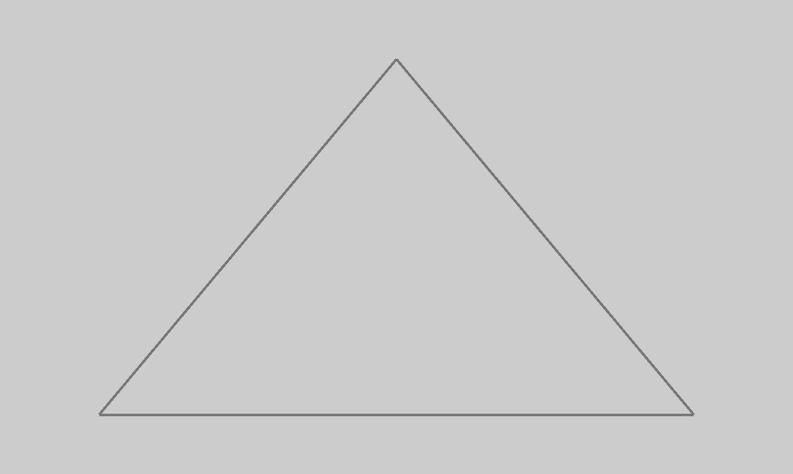
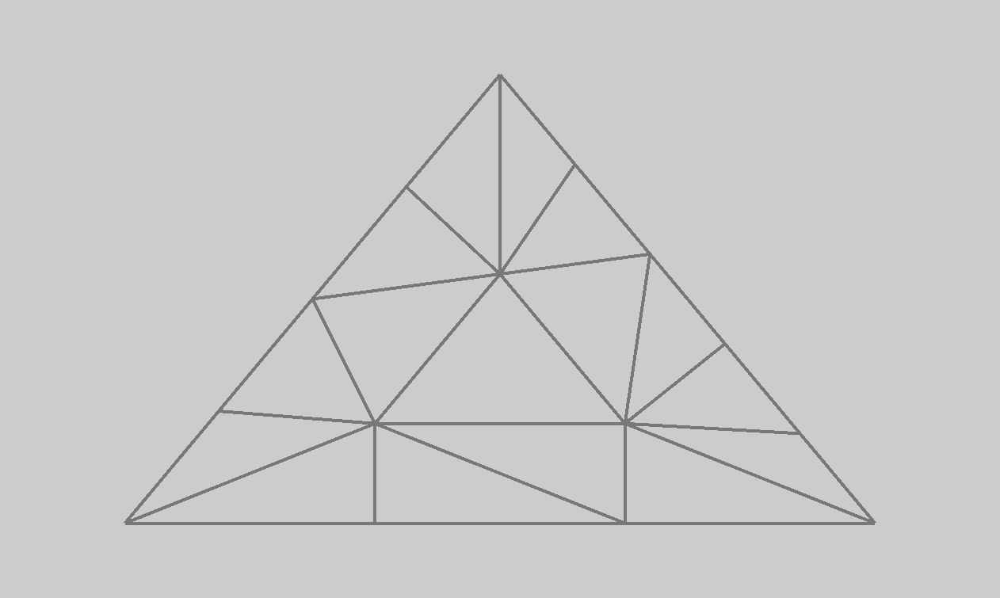
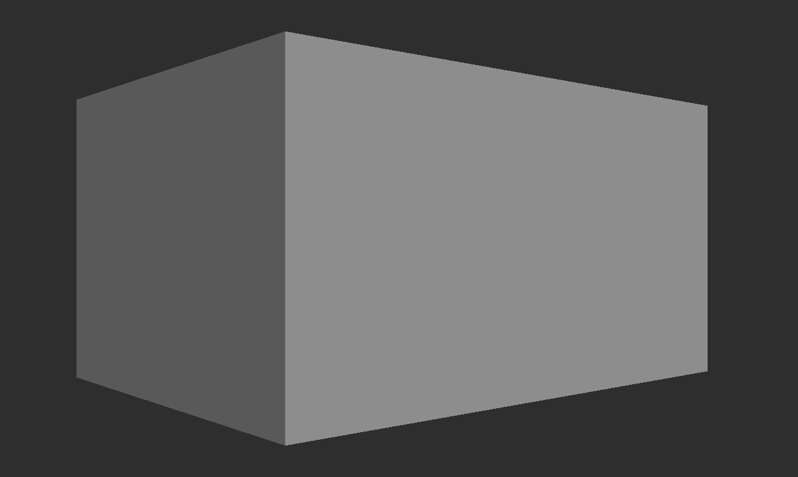
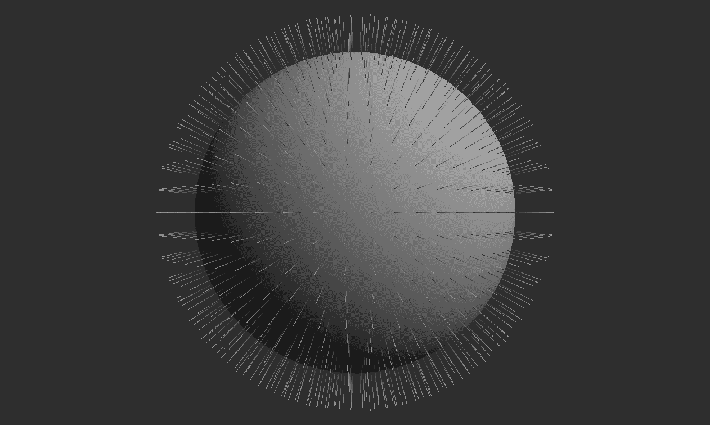

# 第七章：着色器

在本章中，我们将涵盖以下菜谱：

+   将 GLSL 着色器转换为 SPIR-V 汇编

+   编写顶点着色器

+   编写细分控制着色器

+   编写细分评估着色器

+   编写几何着色器

+   编写片段着色器

+   编写计算着色器

+   编写一个将顶点位置乘以投影矩阵的顶点着色器

+   在着色器中使用推送常量

+   编写纹理顶点和片段着色器

+   使用几何着色器显示多边形法线

# 简介

大多数现代图形硬件平台使用可编程管线渲染图像。3D 图形数据，如顶点和片段/像素，在一系列称为阶段的步骤中处理。某些阶段始终执行相同的操作，我们只能将其配置到一定程度。然而，还有一些阶段需要编程。控制这些阶段行为的程序称为着色器。

在 Vulkan 中，有五个可编程图形管线阶段--顶点、细分控制、评估、几何和片段。我们还可以为计算管线编写计算着色器程序。在核心 Vulkan API 中，我们使用 SPIR-V 编写的程序来控制这些阶段。它是一种中间语言，允许我们对图形数据进行处理，并在向量、矩阵、图像、缓冲区或采样器上执行数学计算。这种语言的底层特性提高了编译时间。然而，这也使得编写着色器变得更加困难。这就是为什么 Vulkan SDK 中包含一个名为 glslangValidator 的工具。

glslangValidator 允许我们将用 OpenGL 着色语言（简称 GLSL）编写的着色器程序转换为 SPIR-V 汇编。这样，我们可以用更方便的高级着色语言编写着色器，也可以轻松验证它们，然后在将它们与我们的 Vulkan 应用程序一起发布之前，将它们转换为 Vulkan API 所接受的表示形式。

在本章中，我们将学习如何使用 GLSL 编写着色器。我们将了解如何实现所有可编程阶段的着色器，如何实现细分或纹理，以及如何使用几何着色器进行调试。我们还将了解如何使用与 Vulkan SDK 一起分发的 glslangValidator 程序将用 GLSL 编写的着色器转换为 SPIR-V 汇编。

# 将 GLSL 着色器转换为 SPIR-V 汇编

Vulkan API 要求我们以 SPIR-V 汇编的形式提供着色器。它是一种二进制、中间表示形式，因此手动编写它是一项非常困难且繁琐的任务。在 GLSL 等高级着色语言中编写着色器程序要容易得多。之后，我们只需使用 glslangValidator 工具将它们转换为 SPIR-V 格式即可。

# 如何做到这一点...

1.  下载并安装 Vulkan SDK（请参阅第一章下载 Vulkan SDK，*实例和设备*）。

1.  打开命令提示符/终端，转到包含应转换的着色器文件的文件夹。

1.  要将存储在`<input>`文件中的 GLSL 着色器转换为存储在`<output>`文件中的 SPIR-V 汇编，请运行以下命令：

```cpp
      glslangValidator -H -o <output> <input> > <output_txt>

```

# 它是如何工作的...

glslangValidator 工具与 Vulkan SDK 一起分发。它位于 SDK 的`VulkanSDK/<version>/bin`（64 位版本）或`VulkanSDK/<version>/bin32`（32 位版本）子文件夹中。它具有许多功能，但其主要功能之一是将 GLSL 着色器转换为 SPIR-V 汇编，这些汇编可以被 Vulkan 应用程序消费。

将 GLSL 着色器转换为 SPIR-V 汇编的 glslangValidator 工具与 Vulkan SDK 一起分发。

工具会自动根据`<input>`文件的扩展名检测着色器阶段。可用选项包括：

+   `vert`用于顶点着色器阶段

+   `tesc`用于细分控制着色器阶段

+   `tese`用于细分评估着色器阶段

+   `geom`用于几何着色器阶段

+   `frag`用于片段着色器阶段

+   `comp`用于计算着色器

工具还可以以可读的文本形式显示 SPIR-V 汇编。本配方中提供的命令将此类形式存储在选定的`<output_txt>`文件中。

在将 GLSL 着色器转换为 SPIR-V 之后，这些着色器可以在应用程序中加载并用于创建着色器模块（参考第八章，“图形和计算管线”中的“创建着色器模块”配方）。

# 参见

+   在第一章，“实例和设备”中，查看以下配方：

    +   *下载 Vulkan SDK*

+   本章中的以下配方：

    +   *编写顶点着色器*

    +   *编写细分控制着色器*

    +   *编写细分评估着色器*

    +   *编写几何着色器*

    +   *编写片段着色器*

    +   *编写计算着色器*

    +   *创建着色器模块*

# 编写顶点着色器

顶点处理是第一个可编程的图形管线阶段。其主要目的是将构成我们几何形状的顶点的位置从它们的局部坐标系转换为称为裁剪空间的坐标系。裁剪坐标系用于允许图形硬件以更简单、更优化的方式执行所有后续步骤。其中一步是裁剪，它将处理后的顶点裁剪到可能可见的顶点，因此得名该坐标系。除此之外，我们还可以执行所有其他操作，这些操作对绘制的几何形状的每个顶点执行一次。

# 如何操作...

1.  创建一个文本文件。为文件选择一个名称，但使用`vert`扩展名（例如，`shader.vert`）。

1.  在文件的第一行插入`#version 450`。

1.  定义一组顶点输入变量（属性），这些变量将应用于每个顶点（除非另有说明）。对于每个输入变量：

    1.  使用位置布局限定符和属性索引定义其位置：

        ` layout( location = <index> )`

    1.  提供一个 `in` 存储限定符

    1.  指定输入变量的类型（例如 `vec4`、`float`、`int3`）

    1.  提供输入变量的唯一名称

1.  如有必要，定义一个输出（可变）变量，该变量将被传递（除非另有说明，否则将进行插值）到后续管道阶段。要定义每个输出变量：

    1.  使用位置布局限定符和索引提供变量的位置：

        `layout( location = <index> )`

    1.  指定一个 `out` 存储限定符

    1.  指定输出变量的类型（例如 `vec3` 或 `int`）

    1.  选择输出变量的唯一名称

1.  如有必要，定义与应用程序中创建的描述符资源对应的统一变量。要定义统一变量：

    1.  指定描述符集的数量和绑定号，其中可以访问给定资源：

        `layout (set=<set index>, binding=<binding index>)`

    1.  提供一个 `uniform` 存储限定符

    1.  指定变量的类型（例如 `sampler2D`、`imageBuffer`）

    1.  为变量定义一个唯一的名称

1.  在 `void main()` 函数中创建：

    1.  执行所需的操作

    1.  将输入变量传递到输出变量（带有或不带变换）

    1.  将处理过的顶点（可能已变换）的位置存储在 `gl_Position` 内置变量中。

# 它是如何工作的...

顶点处理（通过顶点着色器）是图形管道中的第一个可编程阶段。在 Vulkan 中创建的每个图形管道都必须包含它。其主要目的是将应用程序传递的顶点位置从局部坐标系转换为裁剪空间。如何进行转换取决于我们；我们可以省略它并提供已在裁剪空间中的坐标。如果后续阶段（细分或几何着色器）计算位置并将它们传递到管道中，则顶点着色器也可以完全不执行任何操作。

通常情况下，顶点着色器将应用程序提供的位置作为输入变量（坐标）之一，并将其（在左侧）与模型视图投影矩阵相乘。

顶点着色器的主要目的是获取顶点的位置，将其与模型视图投影矩阵相乘，并将结果存储在 `gl_Position` 内置变量中。

顶点着色器还可以执行其他操作，将结果传递到图形管道的后续阶段，或将它们存储在存储图像或缓冲区中。然而，我们必须记住，所有计算都是针对绘制几何体的每个顶点单独执行的。

在以下图像中，使用管线对象中启用了线框渲染的单个三角形被绘制。为了能够绘制非实体几何体，我们需要在创建逻辑设备时启用`fillModeNonSolid`功能（请参阅第一章，*实例和设备*中的*获取物理设备的特性和属性*和*创建逻辑设备*食谱）。



要绘制这个三角形，使用了简单的顶点着色器。以下是此着色器的源代码，使用 GLSL 编写：

```cpp
#version 450 

layout( location = 0 ) in vec4 app_position; 

void main() { 
  gl_Position = app_position; 
}

```

# 参见

+   本章中的以下食谱：

    +   *将 GLSL 着色器转换为 SPIR-V 汇编*

    +   *编写乘以投影矩阵的顶点位置的顶点着色器*

+   在第八章，*图形和计算管线*中，查看以下食谱：

    +   *创建着色器模块*

    +   *指定管线顶点绑定描述、属性描述和输入状态*

    +   *创建图形管线*

# 编写细分控制着色器

细分是一个将几何体分成更小部分的过程。在图形编程中，它允许我们以更灵活的方式提高渲染对象的细节数量，或动态地改变它们的参数，如平滑度或形状。

在 Vulkan 中，细分是可选的。如果启用，它将在顶点着色器之后执行。它有三个步骤，其中两个是可编程的。第一个可编程细分阶段用于设置控制细分如何执行参数。我们通过编写细分控制着色器来指定细分因子的值。

# 如何做到...

1.  创建一个文本文件。为文件选择一个名称，但使用`tesc`扩展名（例如，`shader.tesc`）。

1.  在文件的第一行插入`#version 450`。

1.  定义将形成输出补丁的顶点数量：

```cpp
      layout( vertices = <count> ) out;

```

1.  定义一组从（写入）顶点着色器阶段提供的输入变量（属性）。对于每个输入变量：

    1.  使用位置布局限定符和属性索引定义其位置：

        `layout( location = <index> )`

    1.  提供一个`in`存储限定符

    1.  指定输入变量的类型（例如`vec3`，`float`)

    1.  提供输入变量的唯一名称

1.  如果需要，定义一个输出（可变）变量，该变量将被传递（除非另有说明，否则将进行插值）到后续管线阶段。为了定义每个输出变量：

    1.  使用位置布局限定符和索引提供变量的位置：

        `layout( location = <index> )`

    1.  指定一个`out`存储限定符

    1.  指定输出变量的类型（例如`ivec2`或`bool`)

    1.  选择输出变量的唯一名称

    1.  确保它被定义为无大小数组

1.  如果需要，定义与在应用程序中创建的描述符资源对应的统一变量，这些变量可以在细分控制阶段访问。为了定义一个统一变量：

    1.  通过布局限定符，指定可以访问给定资源的描述符集数量和绑定号：

        `layout (set=<集合索引>, binding=<绑定索引>)`

    1.  提供一个 `uniform` 存储限定符。

    1.  指定变量的类型（例如 `sampler`, `image1D`）。

    1.  定义变量的唯一名称。

1.  在其中创建一个 `void main()` 函数：

    1.  执行所需的操作。

    1.  将输入变量传递到变量的输出数组中（带有或不带变换）。

    1.  通过 `gl_TessLevelInner` 变量指定内部细分级别因子。

    1.  通过 `gl_TessLevelOuter` 变量指定外部细分级别因子。

    1.  将处理过的补丁顶点的位置（可能已变换）存储在 `gl_out[gl_InvocationID].gl_Position` 变量中。

# 它是如何工作的...

在 Vulkan 中，细分着色器是可选的；我们不必使用它们。当我们想要使用它们时，我们总是需要同时使用细分控制和细分评估着色器。我们还需要在创建逻辑设备时启用 `tessellationShader` 功能。

当我们想要在我们的应用程序中使用细分时，我们需要在创建逻辑设备时启用 `tessellationShader` 功能，并且在创建图形管线时需要指定细分控制和评估着色器阶段。

细分阶段在补丁上操作。补丁由顶点形成，但（与传统多边形相反）每个补丁可能具有任意数量的顶点--从 1 个到至少 32 个。

如其名所示，细分控制着色器指定由补丁形成的几何形状的细分方式。这是通过在着色器代码中指定的内部和外部细分因子来完成的。内部因子由内置的 `gl_TessLevelInner[]` 数组表示，指定补丁内部部分的细分方式。外部因子对应于 `gl_TessLevelOuter[]` 内置数组，定义补丁外部边缘的细分方式。每个数组元素对应于补丁的给定边缘。

着色器细分控制阶段为输出补丁中的每个顶点执行一次。当前顶点的索引可在内置的 `gl_InvocationID` 变量中找到。只能写入当前正在处理的顶点（对应于当前调用），但着色器可以通过 `gl_in[].gl_Position` 变量访问输入补丁的所有顶点。

一个指定任意细分因子并传递未修改位置的细分控制着色器的示例可能如下所示：

```cpp
#version 450 

layout( vertices = 3 ) out; 

void main() { 
  if( 0 == gl_InvocationID ) { 
    gl_TessLevelInner[0] = 3.0; 
    gl_TessLevelOuter[0] = 3.0; 
    gl_TessLevelOuter[1] = 4.0; 
    gl_TessLevelOuter[2] = 5.0; 
  } 
  gl_out[gl_InvocationID].gl_Position = gl_in[gl_InvocationID].gl_Position; 
}

```

与在 *编写顶点着色器* 配方中看到的相同三角形，使用前面的细分控制着色器和来自 *编写细分评估着色器* 配方的细分评估着色器绘制，应该看起来像这样：



# 相关内容

+   本章中的以下配方：

    +   *将 GLSL 着色器转换为 SPIR-V 汇编*

    +   *编写细分评估着色器*

+   在第八章 *图形和计算管线* 中，查看以下配方：

    +   *创建着色器模块*

    +   *指定管线细分状态*

    +   *创建图形管线*

# 编写细分评估着色器

细分评估是细分过程中的第二个可编程阶段。它在几何体已经细分（细分）时执行，用于收集细分结果以形成新顶点并进一步修改它们。当启用细分时，我们需要编写细分评估着色器以获取生成顶点的位置并将它们提供给后续的管线阶段。

# 如何做到这一点...

1.  创建一个文本文件。为文件选择一个名称，并使用`tese`扩展名（例如，`shader.tese`）。

1.  在文件的第一行插入`#version 450`。

1.  使用`in`布局限定符，定义形成的原语类型（`isolines`、`triangles`或`quads`），形成顶点之间的间距（`equal_spacing`、`fractional_even_spacing`或`fractional_odd_spacing`），以及生成三角形的绕行顺序（`cw`以保持应用程序中提供的绕行或`ccw`以反转应用程序中提供的绕行）：

```cpp
      layout( <primitive>, <spacing>, <winding> ) in;

```

1.  定义一组从细分控制阶段提供的输入数组变量。对于每个输入变量：

    1.  使用位置布局限定符和属性索引定义其位置：

        `layout( location = <index> )`

    1.  提供一个`in`存储限定符

    1.  指定输入变量的类型（例如`vec2`或`int3`）

    1.  提供输入变量的唯一名称

    1.  确保它被定义为数组。

1.  如果需要，定义一个输出（可变）变量，该变量将被传递（除非另有说明，否则将插值）到后续的管线阶段。为了定义每个输出变量：

    1.  使用位置布局限定符和索引提供变量的位置：

        `layout( location = <index> )`

    1.  指定`out`存储限定符

    1.  指定输出变量的类型（例如`vec4`）

    1.  选择输出变量的唯一名称。

1.  如果需要，定义与在应用程序中创建的描述符资源对应的统一变量。为了定义统一变量：

    1.  指定描述符集的数量和绑定号，以便可以访问给定的资源：

        `layout (set=<set index>, binding=<binging index>)`

    1.  提供一个`uniform`存储限定符

    1.  指定变量的类型（例如`sampler`、`image1D`）

    1.  定义变量的唯一名称。

1.  创建一个`void main()`函数，在其中：

    1.  执行所需的操作

    1.  使用内置的`gl_TessCoord`向量变量，使用所有补丁顶点的位置生成新顶点的位置；修改结果以实现所需的结果，并将其存储在内置变量`gl_Position`中

    1.  以类似的方式，使用`gl_TessCoord`生成所有其他输入变量的插值值，并将它们存储在输出变量中（如果需要，进行额外的转换）。

# 它是如何工作的...

细分控制着色器和评估着色器是细分正确工作所需的两个可编程阶段。它们之间是一个基于控制阶段提供的参数执行实际细分的阶段。细分的结果在评估阶段获得，在该阶段它们被应用于形成新几何形状。

通过细分评估，我们可以控制新基本类型的对齐和形成方式：我们指定它们的绕行顺序和生成顶点之间的间距。我们还可以选择是否希望细分阶段创建`等高线`、`三角形`或`四边形`。

新顶点不是直接创建的--细分器只为新顶点（权重）生成重心的细分坐标，这些坐标在内置的`gl_TessCoord`变量中提供。我们可以使用这些坐标在形成补丁的原顶点位置之间进行插值，并将新顶点放置在正确的位置。这就是为什么评估着色器，尽管它对每个生成的顶点只执行一次，但可以访问形成补丁的所有顶点。它们的位置通过内置数组变量`gl_in[]`的`gl_Position`成员提供。

对于常用的三角形，仅传递新顶点而不进行进一步修改的细分评估着色器可能看起来像这样：

```cpp
#version 450 

layout( triangles, equal_spacing, cw ) in; 

void main() { 
  gl_Position = gl_in[0].gl_Position * gl_TessCoord.x + 
                gl_in[1].gl_Position * gl_TessCoord.y + 
                gl_in[2].gl_Position * gl_TessCoord.z; 
}

```

# 参见

+   本章中的以下配方：

    +   *将 GLSL 着色器转换为 SPIR-V 汇编*

    +   *编写细分控制着色器*

+   在第八章，*图形和计算管线*中，查看以下配方：

    +   *创建着色器模块*

    +   *指定管线细分状态*

    +   *创建图形管线*

# 编写几何着色器

3D 场景由称为网格的对象组成。网格是由形成对象外部表面的顶点集合。这个表面通常由三角形表示。当我们渲染一个对象时，我们提供顶点并指定它们构成的基本类型（`points`、`lines`、`triangles`）。在顶点和可选的细分阶段处理顶点之后，它们被组装成指定的基本类型。我们还可以启用（也是可选的）几何阶段，并编写控制或改变从顶点形成基本类型过程的几何着色器。在几何着色器中，我们甚至可以创建新的基本类型或销毁现有的基本类型。

# 如何做...

1.  创建一个文本文件。为文件选择一个名称，并使用`geom`扩展名（例如，`shader.geom`）。

1.  在文件的第一行插入`#version 450`。

1.  使用`in`布局限定符，定义在应用程序中绘制的原语类型：`points`、`lines`、`lines_adjacency`、`triangles`或`triangles_adjacency`：

```cpp
      layout( <primitive type> ) in;

```

1.  使用 `out` 布局限定符，定义几何着色器形成的原语类型（输出）（`points`, `line_strip` 或 `triangle_strip`），以及着色器可能生成的最大顶点数：

```cpp
      layout( <primitive type>, max_vertices = <count> ) out;

```

1.  定义一组从顶点或细分评估阶段提供的输入数组变量。对于每个输入变量：

    1.  使用位置布局限定符和属性索引定义其位置：

        `layout( location = <index> )`

    1.  提供一个 `in` 存储限定符

    1.  指定输入变量的类型（例如 `ivec4`, `int` 或 `float`）

    1.  提供输入变量的唯一名称

    1.  确保变量被定义为无大小数组

1.  如果需要，定义一个输出（可变）变量，该变量将被传递（除非另有说明，否则将进行插值）到片段着色器阶段。要定义每个输出变量：

    1.  使用位置布局限定符和索引提供变量的位置：

        `layout( location = <index> )`

    1.  指定一个 `out` 存储限定符

    1.  指定输出变量的类型（例如 `vec3` 或 `uint`）

    1.  选择输出变量的唯一名称

1.  如果需要，定义与在应用程序中创建的描述符资源对应的统一变量。要定义统一变量：

    1.  指定描述符集的数量和一个绑定号，以便可以访问给定的资源：

        `layout (set=<set index>, binding=<binging index>)`

    1.  提供一个 `uniform` 存储限定符

    1.  指定变量的类型（例如 `image2D`, `sampler1DArray`）

    1.  定义变量的唯一名称

1.  在 `void main()` 函数中创建：

    1.  执行所需的操作

    1.  对于每个生成的或传递的顶点：

        +   将值写入输出变量

        +   将顶点的位置（可能已变换）存储在内置的 `gl_Position` 变量中

        +   调用 `EmitVertex()` 向原语添加顶点

    1.  通过调用 `EndPrimitive()` 函数完成原语的生成（隐式地开始另一个原语）。

# 它是如何工作的...

几何阶段是图形管线中的一个可选阶段。如果没有它，当我们绘制几何图形时，基于在图形管线创建期间指定的类型，会自动生成原语。几何着色器允许我们创建额外的顶点和原语，销毁应用程序中绘制的原语，或者更改由顶点形成原语的类型。

几何着色器对应用程序绘制的每个几何原语执行一次。它可以访问构成原语的所有顶点，甚至相邻的顶点。有了这些数据，它可以传递相同的或创建新的顶点和原语。我们必须记住，我们不应该在几何着色器中创建太多的顶点。如果我们想创建许多新的顶点，细分着色器更适合这项任务（并且性能更好）。仅仅增加几何着色器可能创建的最大顶点数，即使我们并不总是形成它们，也可能降低我们应用程序的性能。

我们应该尽可能降低几何着色器发出的顶点数。

几何着色器始终生成条带原语。如果我们想创建不形成条带的单独原语，我们只需在适当的时候结束原语即可--在原语结束后发出的顶点被添加到下一个条带中，这样我们就可以创建我们选择的任意数量的单独条带。以下是一个示例，它创建了原始三角形角落中的三个单独的三角形：

```cpp
#version 450 

layout( triangles ) in; 
layout( triangle_strip, max_vertices = 9 ) out; 

void main() { 

  for( int vertex = 0; vertex < 3; ++vertex ) { 
    gl_Position = gl_in[vertex].gl_Position + vec4( 0.0, -0.2, 0.0, 0.0 ); 
    EmitVertex(); 

    gl_Position = gl_in[vertex].gl_Position + vec4( -0.2, 0.2, 0.0, 0.0 ); 
    EmitVertex(); 

    gl_Position = gl_in[vertex].gl_Position + vec4( 0.2, 0.2, 0.0, 0.0 ); 
    EmitVertex(); 

    EndPrimitive(); 
  } 
}

```

当使用简单的透传顶点着色器和片段着色器绘制单个三角形，并且使用前面的几何着色器时，结果应该看起来像这样：


# 参见

+   本章中的以下食谱：

    +   *将 GLSL 着色器转换为 SPIR-V 汇编*

    +   *使用几何着色器显示多边形法线*

+   在第八章，*图形和计算管道*中，查看以下食谱：

    +   *创建着色器模块*

    +   *指定管道输入装配状态*

    +   *创建图形管道*

# 编写片段着色器

片段（或像素）是图像的组成部分，可能显示在屏幕上。它们是通过称为光栅化的过程从几何（绘制的原语）创建的。它们具有特定的屏幕空间坐标（x、y 和深度），但没有其他数据。我们需要编写一个片段着色器来指定需要在屏幕上显示的颜色。在片段着色器中，我们还可以选择一个附件，将给定的颜色写入其中。

# 如何操作...

1.  创建一个文本文件。为文件选择一个名称，但使用一个`frag`扩展名（例如，`shader.frag`）。

1.  在文件的第一行插入`#version 450`。

1.  定义一组从早期管道阶段提供的输入变量（属性）。对于每个输入变量：

    1.  使用位置布局限定符和属性索引定义其位置：

        `layout( location = <index> )`

    1.  提供一个`in`存储限定符

    1.  指定输入变量的类型（例如`vec4`、`float`、`ivec3`）

    1.  提供输入变量的唯一名称

1.  定义一个输出变量，用于写入颜色。要定义每个输出变量：

    1.  使用位置布局限定符和数字提供变量的位置（附件的索引）：

        `layout( location = <index> )`

    1.  指定一个`out`存储限定符

    1.  指定输出变量的类型（例如`vec3`或`vec4`）

    1.  选择输出变量的唯一名称

1.  如果需要，定义与在应用程序中创建的描述符资源对应的统一变量。要定义一个统一变量：

    1.  指定描述符集的数量和一个绑定号，以便可以访问给定的资源：

        `layout (set=<set index>, binding=<binding index>)`

    1.  提供一个`uniform`存储限定符

    1.  指定变量的类型（例如`sampler1D`、`subpassInput`或`imageBuffer`）

    1.  定义变量的唯一名称

1.  在其中创建一个`void main()`函数：

    1.  执行所需的操作和计算

    1.  将处理过的片段的颜色存储在输出变量中

# 它是如何工作的...

我们在应用程序中绘制的几何形状由原语组成。这些原语在称为光栅化的过程中被转换为片段（像素）。对于每个这样的片段，都会执行一个片段着色器。片段可能在着色器内部或在进行帧缓冲区测试（如深度、模板或裁剪测试）时被丢弃，因此它们甚至不会成为像素——这就是为什么它们被称为片段而不是像素。

片段着色器的主要目的是设置将被（可能）写入附件的颜色。我们通常使用它们来执行光照计算和纹理映射。与计算着色器一样，片段着色器常用于后处理效果，如辉光或延迟着色/光照。此外，只有片段着色器可以访问在渲染过程中定义的输入附件（参考第五章中的*创建输入附件*配方，*描述符集*）。


要绘制前面图中的三角形，使用了一个简单的片段着色器，它存储了一个选择的、硬编码的颜色：

```cpp
#version 450 

layout( location = 0 ) out vec4 frag_color; 

void main() { 
  frag_color = vec4( 0.8, 0.4, 0.0, 1.0 ); 
}

```

# 参见

+   本章中的以下配方：

    +   *将 GLSL 着色器转换为 SPIR-V 汇编*

    +   *编写纹理着色器顶点和片段着色器*

+   在第八章，图形和计算管线中，查看以下配方：

    +   *创建着色器模块*

    +   *指定管线光栅化状态*

    +   *创建图形管线*

# 编写计算着色器

计算着色器，正如其名所示，用于通用数学计算。它们在定义的、三维大小的（本地）组中执行，这些组可能可以访问一组公共数据。同时，可以执行许多本地组以更快地生成结果。

# 如何做到这一点...

1.  创建一个文本文件。为文件选择一个名称，但使用 `comp` 扩展名（例如，`shader.comp`）。

1.  在文件的第一行插入 `#version 450`。

1.  使用输入布局限定符，定义本地工作组的尺寸：

```cpp
layout( local_size_x = <x size>, local_size_y = <y size>, local_size_z = <z size> ) in;

```

1.  定义与应用程序中创建的描述符资源对应的统一变量。要定义统一变量：

    1.  指定描述符集的数量和绑定号，以便可以访问给定的资源：

        `layout (set=<set index>, binding=<binding index>)`

    1.  提供一个 `uniform` 存储限定符

    1.  指定变量的类型（例如 `image2D` 或 `buffer`)

    1.  定义变量的唯一名称

1.  创建一个 `void main()` 函数，其中：

    1.  执行所需的操作和计算

    1.  将结果存储在选定的统一变量中

# 它是如何工作的...

计算着色器只能在专用计算管线中使用。它们也不能在渲染过程中（调度）执行。

计算着色器没有从早期或传递到后续管线阶段的输入或输出（用户定义）变量--它是计算管线中的唯一阶段。必须使用统一变量作为计算着色器数据的来源。同样，在计算着色器中执行的计算结果只能存储在统一变量中。

有一些内置输入变量可以提供有关给定着色器调用在局部工作组中的索引（通过`uvec3 gl_LocalInvocationID`变量）、同时分发的作业组数量（通过`uvec3 gl_NumWorkGroups`变量）或当前工作组的数量（`uvec3 gl_WorkGroupID`变量）的信息。还有一个变量可以唯一标识所有工作组中所有调用中的当前着色器--`uvec3 gl_GlobalInvocationID`。其值计算如下：

```cpp
gl_WorkGroupID * gl_WorkGroupSize + gl_LocalInvocationID

```

通过输入布局限定符定义局部工作组的大小。在着色器内部，定义的大小也通过内置变量`uvec3 gl_WorkGroupSize`可用。

在以下代码中，你可以找到一个使用`gl_GlobalInvocationID`变量生成简单静态分形图像的计算着色器示例：

```cpp
#version 450 

layout( local_size_x = 32, local_size_y = 32 ) in; 

layout( set = 0, binding = 0, rgba8 ) uniform image2D StorageImage; 

void main() { 

  vec2 z = gl_GlobalInvocationID.xy * 0.001 - vec2( 0.0, 0.4 ); 
  vec2 c = z; 

  vec4 color = vec4( 0.0 ); 

  for( int i=0; i<50; ++I ) { 
    z.x = z.x * z.x-- z.y * z.y + c.x; 
    z.y = 2.0 * z.x * z.y + c.y; 
    if( dot( z, z ) > 10.0 ) { 
      color = i * vec4( 0.1, 0.15, 0.2, 0.0 ); 
      break; 
    } 
  } 

  imageStore( StorageImage, ivec2( gl_GlobalInvocationID.xy ), color ); 
}

```

前面的计算着色器在分发时生成以下结果：


# 参见

+   本章中的以下食谱：

    +   *将 GLSL 着色器转换为 SPIR-V 汇编*

+   在第八章，*图形和计算管线*中，查看以下食谱：

    +   *创建着色器模块*

    +   *创建计算管线*

# 编写乘以投影矩阵的顶点位置的计算着色器

将几何体从局部空间转换到裁剪空间通常由顶点着色器执行，尽管任何其他顶点处理阶段（细分或几何）也可能完成此任务。转换是通过指定模型、视图和投影矩阵，并将它们作为三个单独的矩阵或一个连接的模型-视图-投影矩阵（简称 MVP）从应用程序提供给着色器来完成的。最常见和简单的方法是通过统一缓冲区提供这样的矩阵。

# 如何操作...

1.  在名为`shader.vert`的文本文件中创建一个顶点着色器（参考*编写顶点着色器*食谱）。

1.  定义一个通过它将顶点位置提供给顶点着色器的输入变量（属性）：

```cpp
      layout(location = 0) in vec4 app_position;

```

1.  定义一个包含`mat4`类型变量的统一缓冲区，通过该缓冲区提供组合模型-视图-投影矩阵的数据：

```cpp
      layout(set=0, binding=0) uniform UniformBuffer { 
        mat4 ModelViewProjectionMatrix; 
      };

```

1.  在`void main()`函数内部，通过将`ModelViewProjectionMatrix`统一变量与`app_position`输入变量相乘，并在以下方式中将结果存储在内置变量`gl_Position`中，计算裁剪空间中的顶点位置：

```cpp
      gl_Position = ModelViewProjectionMatrix * app_position;

```

# 它是如何工作的...

当我们准备在 3D 应用程序中绘制的几何体时，几何体通常在局部坐标系中建模——这是艺术家创建模型更方便的坐标系。然而，图形管线期望顶点被转换到裁剪空间，因为这个坐标系进行许多操作更容易（并且更快）。通常，是顶点着色器执行这个转换。为此，我们需要准备一个表示透视或正交投影的矩阵。从局部空间到裁剪空间的转换只需将矩阵乘以顶点的位置。

除了投影之外，相同的矩阵还可能包含其他操作，通常称为模型视图变换。由于绘制的几何体可能包含数百或数千个顶点，通常在应用程序中乘以模型、视图和投影矩阵会更优，并提供一个单一的、连接的 MVP 矩阵给需要执行单个乘法的着色器：

```cpp
#version 450 

layout(location = 0) in vec4 app_position; 

layout(set=0, binding=0) uniform UniformBuffer { 
  mat4 ModelViewProjectionMatrix; 
}; 

void main() { 
  gl_Position = ModelViewProjectionMatrix * app_position; 
}

```

前面的着色器要求应用程序准备一个缓冲区，其中存储矩阵数据（参考第五章，*描述符集*中的*创建统一缓冲区*食谱）。然后，这个缓冲区（在当前示例中）被绑定到描述符集的`0`号绑定，该描述符集随后被绑定到命令缓冲区作为`0`号集（参考第五章，*描述符集*中的*更新描述符集*和*绑定描述符集*食谱）。



# 参见

+   在第五章，*描述符集*中，查看以下食谱：

    +   *创建统一缓冲区*

    +   *更新描述符集*

    +   *绑定描述符集*

+   本章中的以下食谱：

    +   *将 GLSL 着色器转换为 SPIR-V 汇编*

    +   *编写顶点着色器*

+   在第八章，*图形和计算管线*中，查看以下食谱：

    +   *创建着色器模块*

    +   *创建图形管线*

# 在着色器中使用推送常量

当我们向着色器提供数据时，通常使用统一缓冲区、存储缓冲区或其他类型的描述符资源。不幸的是，更新这些资源可能并不太方便，尤其是当我们需要提供频繁变化的数据时。

为了这个目的，引入了推送常量。通过它们，我们可以以简化和更快的方式提供数据，而不是通过更新描述符资源。然而，我们需要适应更小的可用空间。

在 GLSL 着色器中访问推送常量与使用统一缓冲区类似。

# 如何做到这一点...

1.  创建着色器文件。

1.  定义一个统一块：

    1.  提供一个`push_constant`布局限定符：

        `layout(push_constant)`

    1.  使用`uniform`存储限定符

1.  1.  提供块的唯一名称

    1.  在大括号内，定义一组统一变量

    1.  指定块实例的名称`<instance name>`。

1.  在`void main()`函数内部，使用块实例名称访问统一变量：

```cpp
      <instance name>.<variable name>

```

# 它是如何工作的...

推送常量的定义和访问方式类似于在 GLSL 着色器中指定统一块，但有一些差异我们需要记住：

1.  我们需要在块的定义之前使用`layout(push_constant)`限定符

1.  我们必须为该块指定一个实例名称

1.  我们可以在每个着色器中定义这样一个块

1.  我们通过在变量名前加上块的实例名称来访问推送常量变量：

```cpp
      <instance name>.<variable name>

```

推送常量对于提供频繁变化的小量数据非常有用，例如变换矩阵或当前时间值--更新推送常量块应该比更新描述符资源（如统一缓冲区）快得多。我们只需要记住数据大小，它比描述符资源小得多。规范要求推送常量至少存储 128 字节的数据。每个硬件平台可能允许更多的存储空间，但可能不会显著更大。

推送常量可以存储至少 128 字节的数据。

定义和使用推送常量的一个示例，通过片段着色器提供颜色，可能看起来像这样：

```cpp
#version 450 

layout( location = 0 ) out vec4 frag_color; 

layout( push_constant ) uniform ColorBlock { 
  vec4 Color; 
} PushConstant; 

void main() { 
  frag_color = PushConstant.Color; 
}

```

# 参见

+   本章中的以下食谱：

    +   *将 GLSL 着色器转换为 SPIR-V 汇编*

    +   *编写一个乘以投影矩阵的顶点位置的顶点着色器*

+   在第八章，*图形和计算管线*中，查看以下食谱：

    +   *创建着色器模块*

    +   *创建管线布局*

+   在第九章，*命令记录和绘制*中，查看以下食谱：

    +   *通过推送常量向着色器提供数据*

# 编写纹理化的顶点着色器和片段着色器

纹理化是一种常见的技巧，它可以显著提高渲染图像的质量。它允许我们加载一个图像并将其像壁纸一样包裹在对象周围。这会增加内存使用量，但可以节省性能，否则这些性能会被浪费在处理更复杂的几何形状上。

# 如何做到...

1.  在名为`shader.vert`的文本文件中创建一个顶点着色器（参考*编写顶点着色器*食谱）。

1.  除了顶点位置之外，在顶点着色器中定义一个额外的输入变量（属性），通过该变量从应用程序提供纹理坐标：

```cpp
      layout( location = 1 ) in vec2 app_tex_coordinates;

```

1.  在顶点着色器中，定义一个输出（可变）变量，通过该变量将从顶点着色器传递纹理坐标到片段着色器：

```cpp
      layout( location = 0 ) out vec2 vert_tex_coordinates;

```

1.  在顶点着色器的`void main()`函数中，将`app_tex_coordinates`变量赋值给`vert_tex_coordinates`变量：

```cpp
      vert_tex_coordinates = app_tex_coordinates;

```

1.  创建一个片段着色器（参考*编写片段着色器*食谱）。

1.  在片段着色器中，定义一个输入变量，其中将从顶点着色器提供的纹理坐标传递过来：

```cpp
      layout( location = 0 ) in vec2 vert_tex_coordinates;

```

1.  创建一个统一的 `sampler2D` 变量，它将代表应用于几何体的纹理：

```cpp
      layout( set=0, binding=0 ) uniform sampler2D TextureImage;

```

1.  定义一个输出变量，其中将存储片段的最终颜色（从纹理中读取）：

```cpp
      layout( location = 0 ) out vec4 frag_color;

```

1.  在片段着色器的 `void main()` 函数中，采样纹理并将结果存储在 `frag_color` 变量中：

```cpp
      frag_color = texture( TextureImage, vert_tex_coordinates );

```

# 它是如何工作的...

要绘制一个对象，我们需要它的所有顶点。为了能够使用纹理并将其应用于模型，除了顶点位置外，我们还需要为每个顶点指定纹理坐标。这些属性（位置和纹理坐标）传递给顶点着色器。它将位置转换到裁剪空间（如果需要），并将纹理坐标传递给片段着色器：

```cpp
#version 450 

layout( location = 0 ) in vec4 app_position; 
layout( location = 1 ) in vec2 app_tex_coordinates; 

layout( location = 0 ) out vec2 vert_tex_coordinates; 

void main() { 
  gl_Position = app_position; 
  vert_tex_coordinates = app_tex_coordinates; 
}

```

纹理操作在片段着色器中执行。构成多边形的所有顶点的纹理坐标进行插值并提供给片段着色器。它使用这些坐标从纹理中读取（采样）一个颜色。此颜色存储在输出中，并（可能）在附加中：

```cpp
#version 450 

layout( location = 0 ) in vec2 vert_tex_coordinates; 

layout( set=0, binding=0 ) uniform sampler2D TextureImage; 

layout( location = 0 ) out vec4 frag_color; 

void main() { 
  frag_color = texture( TextureImage, vert_tex_coordinates ); 
}

```

除了向着色器提供纹理坐标外，应用程序还需要准备纹理本身。通常，这是通过创建一个组合图像采样器（参考 第五章，*描述符集* 中的 *创建组合图像采样器* 食谱）并将其提供给描述符集在第 `0` 个绑定（在本示例中）来实现。描述符集必须绑定到第 `0` 个集合索引。


# 参见

+   在 第五章，*描述符集*，查看以下食谱：

    +   *创建组合图像采样器*

    +   *更新描述符集*

    +   *绑定描述符集*

+   本章中的以下食谱：

    +   *将 GLSL 着色器转换为 SPIR-V 汇编*

    +   *编写顶点着色器*

    +   *编写片段着色器*

+   在 第八章，*图形和计算管线*，查看以下食谱：

    +   *创建着色器模块*

    +   *创建图形管线*

# 使用几何着色器显示多边形法线

在渲染几何体时，我们通常为每个顶点提供多个属性--用于绘制模型的顶点位置、用于纹理化的纹理坐标以及用于光照计算的法线向量。检查所有这些数据是否正确可能并不容易，但有时，当我们的渲染技术没有按预期工作，这可能是有必要的。

在图形编程中，有一些常用的调试方法。纹理坐标，通常是二维的，显示为通常的颜色。我们可以用同样的方式显示法线向量，但因为是三维的，我们也可以以线条的形式显示它们。为此，可以使用几何着色器。

# 如何做到...

1.  创建一个名为 `normals.vert` 的顶点着色器（参考 *编写顶点着色器* 食谱）。

1.  定义一个输入变量，其中顶点位置将被提供给顶点着色器：

```cpp
      layout( location = 0 ) in vec4 app_position;

```

1.  定义第二个输入变量，其中将提供顶点法线向量：

```cpp
      layout( location = 1 ) in vec3 app_normal;

```

1.  定义一个包含两个矩阵的统一块——一个用于模型视图变换，另一个用于投影矩阵：

```cpp
      layout( set = 0, binding = 0 ) uniform UniformBuffer { 
        mat4 ModelViewMatrix; 
        mat4 ProjectionMatrix; 
      };

```

1.  定义一个输出变量，通过该变量我们将提供一个从局部空间转换为视图空间的法线向量给几何着色器：

```cpp
      layout( location = 0 ) out vec4 vert_normal;

```

1.  通过将`ModelViewMatrix`变量与顶点位置相乘，将顶点位置转换为视图空间，并将结果存储在`gl_Position`内置变量中：

```cpp
      gl_Position = ModelViewMatrix * app_position;

```

1.  以类似的方式，将顶点法线转换为视图空间，将结果按选定的值缩放，并将结果存储在`vert_normal`输出变量中：

```cpp
      vert_normal = vec4( mat3( ModelViewMatrix ) * app_normal * 
      <scale>, 0.0 );

```

1.  创建一个名为`normal.geom`的几何着色器（参考*编写几何着色器*配方）。

1.  定义一个`triangle`输入原语类型：

```cpp
      layout( triangles ) in;

```

1.  定义一个输入变量，通过该变量将从顶点着色器提供视图空间顶点法线：

```cpp
      layout( location = 0 ) in vec4 vert_normal[];

```

1.  定义一个包含两个矩阵的统一块——一个用于模型视图变换，另一个用于投影矩阵：

```cpp
      layout( set = 0, binding = 0 ) uniform UniformBuffer { 
        mat4 ModelViewMatrix; 
        mat4 ProjectionMatrix; 
      };

```

1.  通过输出布局限定符，指定一个最多有六个顶点的`line_strip`作为生成的原语类型。

```cpp
      layout( line_strip, max_vertices = 6 ) out;

```

1.  定义一个输出变量，通过该变量将从几何着色器提供颜色给片段着色器：

```cpp
      layout( location = 0 ) out vec4 geom_color;

```

1.  在`void main()`函数内部，使用名为`vertex`的`int`类型变量来遍历所有输入顶点。对每个输入顶点执行以下操作：

    1.  将`ProjectionMatrix`与输入顶点位置相乘，并将结果存储在`gl_Position`内置变量中：

        `gl_Position = ProjectionMatrix * gl_in[vertex].gl_Position;`

    1.  在`geom_color`输出变量中，存储在几何（顶点）与顶点法线线接触点处的顶点法线所需颜色：

        `geom_color = vec4( <chosen color> );`

    1.  通过调用`EmitVertex()`函数生成一个新的顶点。

    1.  将`ProjectionMatrix`与通过`vert_normal`输入变量偏移的输入顶点位置相乘。将结果存储在`gl_Position`内置变量中：

        `gl_Position = ProjectionMatrix * (gl_in[vertex].gl_Position + vert_normal[vertex]);`

    1.  将顶点法线端点的颜色存储在`geom_color`输出变量中：

        `geom_color = vec4( <chosen color> );`

    1.  通过调用`EmitVertex()`函数生成一个新的顶点。

    1.  通过调用`EndPrimitive()`函数生成一个原语（一个有两个点的线）。

1.  创建一个名为`normals.frag`的片段着色器（参考*编写片段着色器*配方）。

1.  通过一个输入变量定义一个颜色，该颜色通过几何着色器生成的线的两个顶点之间的插值提供给片段着色器：

```cpp
      layout( location = 0 ) in vec4 geom_color;

```

1.  定义一个输出变量用于片段的颜色：

```cpp
      layout( location = 0 ) out vec4 frag_color;

```

1.  在`void main()`函数内部，将`geom_color`输入变量的值存储在`frag_color`输出变量中：

```cpp
      frag_color = geom_color;

```

# 它是如何工作的...

从应用程序端显示顶点法向量分为两个步骤：首先，我们以常规方式使用一组常规着色器绘制几何图形。第二步是绘制相同的模型，但使用在此食谱中指定的顶点、几何和片段着色器的管线对象。

顶点着色器只需将顶点位置和法向量传递给几何着色器。它可以将两者都转换到视图空间，但相同的操作也可以在几何着色器中执行。以下代码展示了通过统一缓冲区提供的执行转换的顶点着色器的示例源代码：

```cpp
#version 450 

layout( location = 0 ) in vec4 app_position; 
layout( location = 1 ) in vec3 app_normal; 

layout( set = 0, binding = 0 ) uniform UniformBuffer { 
  mat4 ModelViewMatrix; 
  mat4 ProjectionMatrix; 
}; 

layout( location = 0 ) out vec4 vert_normal; 

void main() { 
  gl_Position = ModelViewMatrix * app_position; 
  vert_normal = vec4( mat3( ModelViewMatrix ) * app_normal * 0.2, 0.0 ); 
}

```

在前面的代码中，位置和法向量都使用模型视图矩阵转换到视图空间。如果我们打算非均匀地缩放模型（不是所有维度的缩放相同），则必须使用模型视图矩阵的逆转置来转换法向量。

代码最重要的部分是在几何内部执行的。它接收构成原始原语类型（通常是三角形）的顶点，但输出构成线段的顶点。它接收一个输入顶点，将其转换到裁剪空间并传递出去。相同的顶点被第二次使用，但这次它偏移了顶点法向量。在平移之后，它被转换到裁剪空间并传递到输出。这些操作对构成原始原语的所有顶点都执行。整个几何着色器的源代码可能看起来像这样：

```cpp
#version 450 

layout( triangles ) in; 

layout( location = 0 ) in vec4 vert_normal[]; 

layout( set = 0, binding = 0 ) uniform UniformBuffer { 
  mat4 ModelViewMatrix; 
  mat4 ProjectionMatrix; 
}; 

layout( line_strip, max_vertices = 6 ) out; 

layout( location = 0 ) out vec4 geom_color; 

void main() { 
  for( int vertex = 0; vertex < 3; ++vertex ) { 
    gl_Position = ProjectionMatrix * gl_in[vertex].gl_Position; 
    geom_color = vec4( 0.2 ); 
    EmitVertex(); 

    gl_Position = ProjectionMatrix * (gl_in[vertex].gl_Position + vert_normal[vertex]); 
    geom_color = vec4( 0.6 ); 
    EmitVertex(); 

    EndPrimitive(); 
  } 
}

```

几何着色器接收由顶点着色器转换到视图空间的顶点，并将它们进一步转换到裁剪空间。这是通过在顶点着色器中使用的相同统一缓冲区提供的投影矩阵来完成的。如果我们只在顶点着色器中使用一个矩阵变量，而在几何着色器中使用第二个矩阵变量，为什么我们定义单个统一缓冲区中的两个矩阵变量？这种做法更方便，因为我们只需要创建一个缓冲区，并且只需要将一个描述符集绑定到命令缓冲区。一般来说，我们执行或记录在命令缓冲区中的操作越少，我们获得的性能就越高。因此，这种方法也应该更快。

片段着色器很简单，因为它只传递由几何着色器存储的插值颜色：

```cpp
#version 450 

layout( location = 0 ) in vec4 geom_color; 

layout( location = 0 ) out vec4 frag_color; 

void main() { 
  frag_color = geom_color; 
}

```

使用前面的着色器绘制几何图形的结果，以及以常规方式绘制的模型，可以在以下图像中看到：



# 参见

+   本章中的以下食谱：

    +   *将 GLSL 着色器转换为 SPIR-V 汇编*

    +   *编写顶点着色器*

    +   *编写几何着色器*

    +   *编写片段着色器*

+   在第八章，*图形和计算管线*中，查看以下食谱：

    +   *创建着色器模块*

    +   *创建图形管线*
