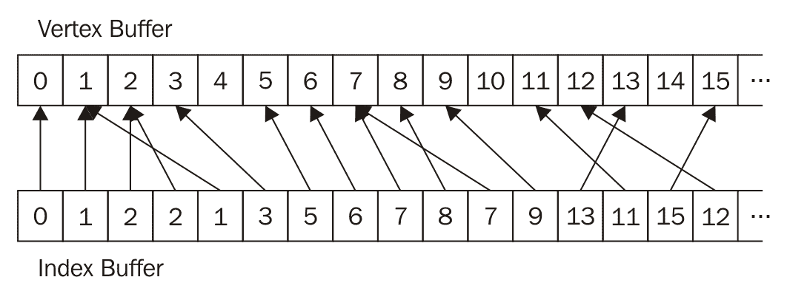
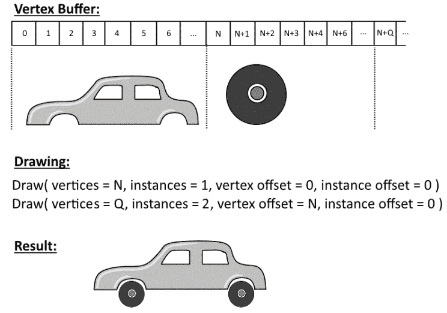
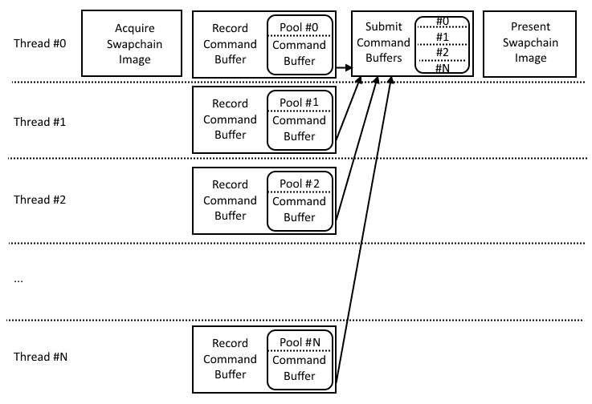

# 第九章：命令记录和绘制

在本章中，我们将涵盖以下菜谱：

+   清除颜色图像

+   清除深度-模板图像

+   清除渲染通道附件

+   绑定顶点缓冲区

+   绑定索引缓冲区

+   通过推送常数向着色器提供数据

+   动态设置视口状态

+   动态设置裁剪状态

+   动态设置线宽状态

+   动态设置深度偏差状态

+   动态设置混合常数状态

+   绘制几何图形

+   绘制索引几何图形

+   调度计算工作

+   在主命令缓冲区内部执行次级命令缓冲区

+   记录一个具有动态视口和裁剪状态的几何图形的命令缓冲区

+   在多个线程上记录命令缓冲区

+   准备动画的单帧

+   通过增加单独渲染的帧数来提高性能

# 简介

Vulkan 被设计为一个图形和计算 API。其主要目的是允许我们使用由不同厂商生产的图形硬件生成动态图像。我们已经知道如何创建和管理资源，并将它们用作着色器的数据源。我们学习了不同的着色器阶段和管道对象，它们控制着渲染状态或调度计算工作。我们还知道如何记录命令缓冲区并将操作顺序放入渲染通道中。我们必须学习的最后一个步骤是如何利用这些知识来渲染图像。

在本章中，我们将了解我们可以记录哪些附加命令以及需要记录哪些命令，以便我们可以正确地渲染几何图形或执行计算操作。我们还将学习绘制命令，并在源代码中以这种方式组织它们，以最大化应用程序的性能。最后，我们将利用 Vulkan API 最伟大的优势之一——能够在多个线程中记录命令缓冲区。

# 清除颜色图像

在传统的图形 API 中，我们通过清除渲染目标或后缓冲区来开始渲染一个帧。在 Vulkan 中，我们应该通过指定渲染通道附件描述中的 `loadOp` 成员的 `VK_ATTACHMENT_LOAD_OP_CLEAR` 值来执行清除操作（参考第六章中的 *指定附件描述* 菜谱 Chapter 6，*渲染通道和帧缓冲区*)。但有时，我们无法在渲染通道内清除图像，我们需要隐式地执行此操作。

# 如何做...

1.  获取存储在名为 `command_buffer` 的 `VkCommandBuffer` 类型变量中的命令缓冲区句柄。确保命令缓冲区处于记录状态且没有渲染通道已开始。

1.  获取应清除的图像句柄。通过名为 `image` 的 `VkImage` 类型变量提供它。

1.  将在清除时 `image` 将具有的布局存储在名为 `image_layout` 的 `VkImageLayout` 类型变量中。

1.  准备一个包含`image`和应清除的数组层的所有米普级别的列表，并将其存储在名为`image_subresource_ranges`的`std::vector<VkImageSubresourceRange>`类型变量中。对于`image`的每个子资源范围，向`image_subresource_ranges`向量添加一个新元素，并使用以下值初始化其成员：

    +   对于`aspectMask`，图像的方面（颜色、深度和/或模板方面不能提供）

    +   对于`baseMipLevel`，在给定范围内需要清除的第一个米普级别

    +   在给定范围内需要清除的连续米普级别数量，对于`levelCount`

    +   在给定范围内应清除的第一个数组层编号，对于`baseArrayLayer`

    +   需要清除的连续数组层数量，对于`layerCount`

1.  使用名为`VkClearColorValue`的变量`clear_color`的以下成员提供图像应清除的颜色：

    +   `int32`: 当图像具有有符号整数格式时

    +   `uint32`: 当图像具有无符号整数格式时

    +   `float32`: 对于其余的格式

1.  调用`vkCmdClearColorImage( command_buffer, image, image_layout, &clear_color, static_cast<uint32_t>(image_subresource_ranges.size()), image_subresource_ranges.data() )`命令，它提供了`command_buffer`、`image`、`image_layout`变量，`clear_color`变量的指针，`image_subresource_ranges`向量的元素数量，以及`image_subresource_ranges`向量第一个元素的指针。

# 它是如何工作的...

通过在命令缓冲区中记录`vkCmdClearColorImage()`函数来执行清除颜色图像。`vkCmdClearColorImage()`命令不能在渲染通道内部记录。

它要求我们提供图像的句柄、其布局以及应清除的子资源（米普级别和/或数组层）的数组。我们还必须指定图像应清除的颜色。这些参数可以使用以下方式使用：

```cpp
vkCmdClearColorImage( command_buffer, image, image_layout, &clear_color, static_cast<uint32_t>(image_subresource_ranges.size()), image_subresource_ranges.data() );

```

记住，通过使用此函数，我们只能清除颜色图像（具有颜色方面和颜色格式之一）。

`vkCmdClearColorImage()`函数只能用于使用**传输目标**用途创建的图像。

# 参见

+   在第三章，*命令缓冲区和同步*，查看以下配方：

    +   *开始命令缓冲区记录操作*

+   在第四章，*资源和内存*，查看以下配方：

    +   *创建图像*

+   在第六章，*渲染通道和帧缓冲区*，查看以下配方：

    +   *指定附件描述*

    +   *清除渲染通道附件*

    +   *清除深度-模板图像*

# 清除深度-模板图像

类似于颜色图像，我们有时需要在渲染通道之外手动清除深度-模板图像。

# 如何操作...

1.  取一个处于记录状态且当前没有在其中启动渲染通道的命令缓冲区。使用其句柄，初始化一个名为`command_buffer`的`VkCommandBuffer`类型的变量。

1.  取深度-模板图像的句柄并将其存储在名为`image`的`VkImage`类型的变量中。

1.  将表示清除期间`image`将具有的布局的值存储在名为`image_layout`的`VkImageLayout`类型的变量中。

1.  创建一个名为`image_subresource_ranges`的`std::vector<VkImageSubresourceRange>`类型的变量，它将包含所有`image`的米普级别和数组层的列表，这些层应该被清除。对于这样的范围，向`image_subresource_ranges`向量添加一个新元素，并使用以下值来初始化其成员：

    +   对于`aspectMask`，深度和/或模板方面

    +   对于`baseMipLevel`，给定范围内要清除的第一个米普级别

    +   对于`levelCount`，给定范围内连续的米普级别数

    +   对于`baseArrayLayer`，应该清除的第一个数组层的编号

    +   在`layerCount`的范围中要清除的连续数组层数

1.  提供一个值，该值应用于使用名为`clear_value`的`VkClearDepthStencilValue`类型变量的以下成员来清除（填充）图像：

    +   `depth`当需要清除深度方面时

    +   `stencil`用于清除模板方面的值

1.  调用`vkCmdClearDepthStencilImage(command_buffer, image, image_layout, &clear_value, static_cast<uint32_t>(image_subresource_ranges.size()), image_subresource_ranges.data())`并提供`command_buffer`、`image`和`image_layout`变量，`clear_value`变量的指针，`image_subresource_ranges`向量的元素数量，以及`image_subresource_ranges`向量第一个元素的指针。

# 它是如何工作的...

在渲染通道之外清除深度-模板图像的操作如下：

```cpp
vkCmdClearDepthStencilImage( command_buffer, image, image_layout, &clear_value, static_cast<uint32_t>(image_subresource_ranges.size()), image_subresource_ranges.data() );

```

我们只能使用此函数来创建具有传输目标使用情况（清除被视为传输操作）的图像。

# 参见

+   在第三章，*命令缓冲区和同步*，查看食谱：

    +   *开始命令缓冲区记录操作*

+   在第四章，*资源和内存*，查看食谱：

    +   *创建一个图像*

+   在第六章，*渲染通道和帧缓冲区*，查看以下食谱：

    +   *指定附加项描述*

    +   *清除渲染通道附加项*

+   本章中的*清除颜色图像*食谱

# 清除渲染通道附加项

有一些情况，我们不能仅仅依赖于作为初始渲染通道操作执行的隐式附加清除，我们需要在子通道之一中显式清除附加项。我们可以通过调用一个`vkCmdClearAttachments()`函数来实现。

# 如何做到这一点...

1.  取一个处于记录状态的命令缓冲区，并将其句柄存储在名为 `command_buffer` 的 `VkCommandBuffer` 类型的变量中。

1.  创建一个名为 `attachments` 的 `std::vector<VkClearAttachment>` 类型的变量。对于渲染通道当前子通道中应清除的每个 `framebuffer` 附件，向向量中添加一个元素，并用以下值初始化它：

    +   `aspectMask` 的附件的方面（颜色、深度或模板）

    +   如果 `aspectMask` 设置为 `VK_IMAGE_ASPECT_COLOR_BIT`，则指定当前子通道中的颜色附件的索引 `colorAttachment`；否则，此参数被忽略

    +   颜色、深度或模板方面的期望清除值 `clearValue`

1.  创建一个名为 `rects` 的 `std::vector<VkClearRect>` 类型的变量。对于所有指定附件中应清除的每个区域，向向量中添加一个元素，并用以下值初始化它：

    +   要清除的矩形（左上角和宽高）`rect`

    +   要清除的第一个层的索引 `baseArrayLayer`

    +   要清除的层数 `layerCount`

1.  调用 `vkCmdClearAttachments(command_buffer, static_cast<uint32_t>(attachments.size()), attachments.data(), static_cast<uint32_t>(rects.size()), rects.data())`。对于函数调用，提供命令缓冲区的句柄、`attachments` 向量中的元素数量、其第一个元素的指针、`rects` 向量中的元素数量以及其第一个元素的指针。

# 它是如何工作的...

当我们想在已开始的渲染通道内显式清除用作帧缓冲区附件的图像时，我们不能使用通常的图像清除函数。我们只能通过选择哪些附件应该被清除来实现这一点。这通过 `vkCmdClearAttachments()` 函数来完成，如下所示：

```cpp
vkCmdClearAttachments( command_buffer, static_cast<uint32_t>(attachments.size()), attachments.data(), static_cast<uint32_t>(rects.size()), rects.data() );

```

使用此函数，我们可以清除所有指示附件的多个区域。

我们只能在渲染通道内调用 `vkCmdClearAttachments()` 函数。

# 参见

+   在 第三章 中，*命令缓冲区和同步*，查看以下内容：

    +   *开始命令缓冲区记录操作*

+   在 第六章 中，*渲染通道和帧缓冲区*，查看以下内容：

    +   *指定附件描述*

    +   *指定子通道描述*

    +   *开始渲染通道*

+   本章以下内容：

    +   *清除颜色图像*

    +   *清除深度-模板图像*

# 绑定顶点缓冲区

当我们绘制几何体时，我们需要指定顶点的数据。至少，需要顶点位置，但我们还可以指定其他属性，如法线、切线或双切线向量、颜色或纹理坐标。这些数据来自使用 **顶点缓冲区** 用法创建的缓冲区。在我们可以发出绘制命令之前，我们需要将这些缓冲区绑定到指定的绑定上。

# 准备工作

在本食谱中，引入了一个自定义的 `VertexBufferParameters` 类型。它具有以下定义：

```cpp
struct VertexBufferParameters { 
  VkBuffer      Buffer; 
  VkDeviceSize  MemoryOffset; 
};

```

此类型用于指定缓冲区的参数：其句柄（在 `Buffer` 成员中）和从缓冲区内存起始位置开始的数据偏移（在 `MemoryOffset` 成员中）。

# 如何实现...

1.  获取处于记录状态的命令缓冲区的句柄，并使用它初始化一个名为 `command_buffer` 的 `VkCommandBuffer` 类型的变量。

1.  创建一个名为 `buffers` 的 `std::vector<VkBuffer>` 类型的变量。对于应绑定到命令缓冲区中特定绑定的每个缓冲区，将缓冲区的句柄添加到 `buffers` 向量中。

1.  创建一个名为 `offsets` 的 `std::vector<VkDeviceSize>` 类型的变量。对于 `buffers` 向量中的每个缓冲区，在 `offsets` 向量中添加一个新的成员，其偏移值从对应缓冲区内存的起始位置（`buffers` 向量中相同索引的缓冲区）计算得出。

1.  调用 `vkCmdBindVertexBuffers( command_buffer, first_binding, static_cast<uint32_t>(buffers_parameters.size()), buffers.data(), offsets.data() )`，提供命令缓冲区的句柄、第一个应绑定到其上的绑定编号、`buffers`（和 `offsets`）向量中的元素数量，以及 `buffers` 向量第一个元素和 `offsets` 向量第一个元素的指针。

# 它是如何工作的...

在图形管线创建过程中，我们指定在绘制期间将使用（提供给着色器）的顶点属性。这是通过顶点绑定和属性描述来完成的（参考 第八章，*图形和计算管线*中的*指定管线顶点绑定描述、属性描述和输入状态*食谱）。通过它们，我们定义了属性的数量、它们的格式、着色器可以通过哪个位置访问它们，以及内存属性，如偏移和步进。我们还提供了从该绑定中读取给定属性的绑定索引。使用此绑定，我们需要将选定的缓冲区与给定属性（或属性集）的数据存储关联起来。关联是通过在给定命令缓冲区中将缓冲区绑定到选定的绑定索引来完成的，如下所示：

```cpp
std::vector<VkBuffer>     buffers; 
std::vector<VkDeviceSize> offsets; 
for( auto & buffer_parameters : buffers_parameters ) { 
  buffers.push_back( buffer_parameters.Buffer ); 
  offsets.push_back( buffer_parameters.MemoryOffset ); 
} 
vkCmdBindVertexBuffers( command_buffer, first_binding, static_cast<uint32_t>(buffers_parameters.size()), buffers.data(), offsets.data() );

```

在前面的代码中，通过一个名为 `buffers_parameters` 的 `std::vector<VertexBufferParameters>` 类型的变量提供了所有应绑定及其内存偏移的缓冲区句柄。

记住，我们只能绑定使用顶点缓冲区用途创建的缓冲区。

# 参见

+   在 第三章，*命令缓冲区和同步*，参见以下食谱：

    +   *开始命令缓冲区记录操作*

+   在 第四章，*资源和内存*，参见以下食谱：

    +   *创建缓冲区*

+   在 第八章，*图形和计算管线*，查看以下食谱：

    +   *指定管线顶点绑定描述*

    +   *属性描述和输入状态*

+   本章中的以下食谱：

    +   *绘制几何体*

    +   *绘制索引几何体*

# 绑定索引缓冲区

要绘制几何体，我们可以以两种方式提供顶点列表（及其属性）。第一种方式是一个典型的列表，其中顶点一个接一个地读取。第二种方法需要我们提供额外的索引，指示应读取哪些顶点以形成多边形。这个特性被称为索引绘制。它允许我们减少内存消耗，因为我们不需要多次指定相同的顶点。当每个顶点与多个属性相关联，并且每个这样的顶点被多个多边形使用时，这一点尤为重要。

索引存储在一个名为 **索引缓冲区** 的缓冲区中，在我们可以绘制索引几何体之前必须绑定它。

# 如何实现...

1.  将命令缓冲区的句柄存储在名为 `command_buffer` 的 `VkCommandBuffer` 类型的变量中。确保它处于记录状态。

1.  取存储索引的缓冲区的句柄。使用其句柄初始化一个名为 `buffer` 的 `VkBuffer` 类型的变量。

1.  取一个偏移值（从缓冲区内存的起始位置），表示索引数据的开始。将偏移量存储在名为 `memory_offset` 的 `VkDeviceSize` 类型的变量中。

1.  提供用于索引的数据类型。使用 `VK_INDEX_TYPE_UINT16` 值表示 16 位无符号整数或使用 `VK_INDEX_TYPE_UINT32` 值表示 32 位无符号整数。将值存储在名为 `index_type` 的 `VkIndexType` 类型的变量中。

1.  调用 `vkCmdBindIndexBuffer( command_buffer, buffer, memory_offset, index_type )`，并提供命令缓冲区和缓冲区的句柄、内存偏移量值以及用于索引的数据类型（作为最后一个参数的 `index_type` 变量）。

# 它是如何工作的...

要将缓冲区用作顶点索引的来源，我们需要使用 *索引缓冲区* 用法创建它，并用适当的数据填充它--索引指示应使用哪些顶点进行绘制。索引必须紧密打包（一个接一个），它们应该仅指向顶点数据数组中的一个给定索引，因此得名。这在下图中显示：



在我们能够记录索引绘制命令之前，我们需要绑定一个索引缓冲区，如下所示：

```cpp
vkCmdBindIndexBuffer( command_buffer, buffer, memory_offset, index_type );

```

对于调用，我们需要提供一个命令缓冲区，我们将记录函数和应作为索引缓冲区的缓冲区。还需要提供从缓冲区内存开始处的内存偏移量。它显示了驱动程序应该从缓冲区内存的哪些部分开始读取索引。上一个示例中的最后一个参数，`index_type`变量，指定了存储在缓冲区中的索引的数据类型--如果它们被指定为 16 位或 32 位的无符号整数。

# 参见

+   在第三章，*命令缓冲区和同步*中，查看食谱：

    +   *开始命令缓冲区记录操作*

+   在第四章，*资源和内存*中，查看食谱：

    +   *创建缓冲区*

+   本章以下食谱：

    +   *绑定顶点缓冲区*

    +   *绘制索引几何体*

# 通过推送常量提供数据给着色器

在绘制或调度计算工作期间，执行特定的着色器阶段--在管道创建期间定义的。因此，着色器可以完成其工作，我们需要向它们提供数据。大多数时候我们使用描述符集，因为它们允许我们通过缓冲区或图像提供千字节甚至兆字节的数据。但是使用它们相当复杂。更重要的是，描述符集的频繁更改可能会影响我们应用程序的性能。但是有时，我们需要以快速简单的方式提供少量数据。我们可以使用推送常量来完成此操作。

# 如何做...

1.  将命令缓冲区的句柄存储在名为`command_buffer`的`VkCommandBuffer`类型变量中。确保它处于记录状态。

1.  取一个使用推送常量范围的管道布局。将布局的句柄存储在名为`pipeline_layout`的`VkPipelineLayout`类型变量中。

1.  通过名为`pipeline_stages`的`VkShaderStageFlags`类型变量定义将访问给定推送常量数据范围的着色器阶段。

1.  在名为`offset`的`uint32_t`类型变量中指定一个偏移量（以字节为单位），从该偏移量更新推送常量内存。`offset`必须是 4 的倍数。

1.  在名为`size`的`uint32_t`类型变量中定义更新内存部分的字节大小。`size`必须是 4 的倍数。

1.  使用名为`data`的`void *`类型变量，提供一个指向内存的指针，从该内存中复制数据以推送常量内存。

1.  进行以下调用：

```cpp
      vkCmdPushConstants( command_buffer, pipeline_layout, 
      pipeline_stages, offset, size, data )

```

1.  对于调用，提供（按相同顺序）从 1 到 6 的子弹描述的变量。

# 它是如何工作的...

推送常量允许我们快速向着色器提供一小块数据（参考第七章中的*在着色器中使用推送常量*配方，*着色器*）。驱动程序需要提供至少 128 字节用于推送常量数据的内存。这并不多，但预计推送常量比在描述符资源中更新数据要快得多。这就是我们应该使用它们来提供非常频繁变化的数据的原因，即使是在每次绘制或计算着色器的分发中。

要推送常量数据的数据从提供的内存地址复制。记住，我们只能更新大小为 4 的倍数的数据。推送常量内存（我们复制数据的内存）中的偏移量也必须是 4 的倍数。例如，要复制四个浮点值，我们可以使用以下代码：

```cpp
std::array<float, 4> color = { 0.0f, 0.7f, 0.4f, 0.1f }; 
ProvideDataToShadersThroughPushConstants( CommandBuffer, *PipelineLayout, VK_SHADER_STAGE_FRAGMENT_BIT, 0, static_cast<uint32_t>(sizeof( color[0] ) * color.size()), &color[0] );

```

`ProvideDataToShadersThroughPushConstants()` 是一个函数，它以下列方式实现此配方：

```cpp
vkCmdPushConstants( command_buffer, pipeline_layout, pipeline_stages, offset, size, data );

```

# 参见

+   在第七章，*着色器*中，查看以下配方：

    +   *在着色器中使用推送常量*

+   在第八章，*图形和计算管线*中，查看以下配方：

    +   *创建管线布局*

# 动态设置视口状态

图形管线定义了在渲染过程中使用的许多不同状态参数。每次我们需要使用这些参数中的一些略微不同的值时，都创建单独的管线对象将会很繁琐且非常不实用。这就是为什么在 Vulkan 中有动态状态。我们可以定义一个视口变换作为其中之一。在这种情况下，我们通过记录在命令缓冲区中的函数调用来指定其参数。

# 如何做到这一点...

1.  拿到一个处于记录状态的命令缓冲区的句柄。使用其句柄，初始化一个名为 `command_buffer` 的 `VkCommandBuffer` 类型的变量。

1.  指定应设置参数的第一个视口的编号。将数字存储在名为 `first_viewport` 的 `uint32_t` 类型的变量中。

1.  创建一个名为 `viewports` 的 `std::vector<VkViewport>` 类型的变量。对于在管线创建过程中定义的每个视口，向 `viewports` 向量中添加一个新元素。通过它，使用以下值指定相应视口的参数：

    +   上左角（以像素为单位）的左侧对于 `x`

    +   上左角（以像素为单位）的顶部对于 `y`

    +   视口的宽度对于 `width`

    +   视口的宽度对于 `height`

    +   在片段深度计算过程中使用的最小深度值 `minDepth`

    +   对于 `maxDepth`，片段计算的最大深度值

1.  调用 `vkCmdSetViewport(command_buffer, first_viewport, static_cast<uint32_t>(viewports.size()), viewports.data())` 并提供 `command buffer` 的句柄、`first_viewport` 变量、`viewports` 向量中的元素数量以及指向 `viewports` 向量第一个元素的指针。

# 它是如何工作的...

视口状态可以指定为动态管线状态之一。我们在创建管线时这样做（参考第八章，*图形和计算管线*中的*指定管线动态状态*配方）。在这里，视口的尺寸通过如下函数调用指定：

```cpp
vkCmdSetViewport( command_buffer, first_viewport, static_cast<uint32_t>(viewports.size()), viewports.data() );

```

定义在渲染过程中使用的每个视口维度的参数（参考第八章，*指定管线视口和剪裁测试状态*配方，来自*图形和计算管线*）通过一个数组指定，其中数组的每个元素对应一个给定的视口（通过`firstViewport`函数参数指定的值偏移，即前述代码中的`first_viewport`变量）。

我们只需要记住，在渲染过程中使用的视口数量始终在管线中静态指定，无论视口状态是否指定为动态。

# 参见

+   在第三章，*命令缓冲区和同步*中，查看以下配方：

    +   *开始命令缓冲区记录操作*

+   在第八章，*图形和计算管线*中，查看以下配方：

    +   *指定管线视口和剪裁测试状态*

    +   *指定管线动态状态*

# 动态设置剪裁状态

视口定义了附件（图像）的一部分，其中剪辑空间将被映射。剪裁测试允许我们在指定的视口尺寸内进一步限制绘图到指定的矩形。剪裁测试始终启用；我们只能设置其参数的各种值。这可以在管线创建期间静态完成，也可以动态完成。后者是通过在命令缓冲区中记录的函数调用完成的。

# 如何实现...

1.  将处于记录状态的命令缓冲区的句柄存储在名为`command_buffer`的`VkCommandBuffer`类型变量中。

1.  在名为`first_scissor`的`uint32_t`类型变量中指定第一个剪裁矩形的编号。请记住，剪裁矩形的数量对应于视口的数量。

1.  创建一个名为`scissors`的`std::vector<VkRect2D>`类型变量。对于我们要指定的每个剪裁矩形，向`scissors`变量添加一个元素。使用以下值来指定其成员：

    +   对于`offset`的`x`成员，从视口左上角开始的水平偏移（以像素为单位）

    +   对于`offset`的`y`成员，从视口左上角开始的垂直偏移（以像素为单位）

    +   对于`extent`的`width`成员的剪裁矩形的宽度（以像素为单位）

    +   对于`extent`的`height`成员的剪裁矩形的宽度（以像素为单位）

1.  调用`vkCmdSetScissor(command_buffer, first_scissor, static_cast<uint32_t>(scissors.size()), scissors.data())`，并提供`command_buffer`和`first_scissor`变量、`scissors`向量的元素数量以及指向`scissors`向量第一个元素的指针。

# 它是如何工作的...

剪裁测试允许我们将渲染限制为视图端口内部指定的矩形区域。此测试始终启用，并且在创建管道期间必须为所有定义的视图端口指定。换句话说，指定的剪裁矩形数量必须与视图端口数量相同。如果我们动态地提供剪裁测试的参数，我们不需要在单个函数调用中完成。但在记录绘图命令之前，必须定义所有视图端口的剪裁矩形。

要定义用于剪裁测试的一组矩形，我们需要使用以下代码：

```cpp
vkCmdSetScissor( command_buffer, first_scissor, static_cast<uint32_t>(scissors.size()), scissors.data() );

```

`vkCmdSetScissor()`函数允许我们仅定义视图端口子集的剪裁矩形。在`scissors`数组（向量）中指定索引`i`的参数对应于索引`first_scissor + i`的视图端口。

# 参见

+   在第三章，*命令缓冲区和同步*中，查看以下配方：

    +   *开始命令缓冲区记录操作*

+   在第八章，*图形和计算管道*中，查看以下配方：

    +   *指定管道视口和剪裁测试状态*

    +   *指定管道动态状态*

+   *动态设置视口状态*，在本章中

# 动态设置线宽状态

在创建图形管道期间定义的参数之一是绘制线的宽度。我们可以静态地定义它。但如果我们打算绘制具有不同宽度的多条线，我们应该将线宽指定为动态状态之一。这样，我们可以使用相同的管道对象，并通过函数调用指定绘制线的宽度。

# 如何做到这一点...

1.  获取正在记录的命令缓冲区的句柄，并使用它来初始化一个名为`command_buffer`的`VkCommandBuffer`类型的变量。

1.  通过创建一个名为`line_width`的`float`类型的变量，通过该变量提供绘制线的宽度。

1.  调用`vkCmdSetLineWidth(command_buffer, line_width)`，提供`command_buffer`和`line_width`变量。

# 它是如何工作的...

使用`vkCmdSetLineWidth()`函数调用动态设置给定图形管道的线宽。我们只需记住，为了使用不同的宽度，我们必须在创建逻辑设备时启用`wideLines`功能。否则，我们只能指定`1.0f`的值。在这种情况下，我们不应创建具有动态线宽状态的管道。但是，如果我们已启用所述功能并且想要指定不同的线宽值，我们可以这样做：

```cpp
vkCmdSetLineWidth( command_buffer, line_width );

```

# 参见

+   在第三章，*命令缓冲区和同步*中，查看以下配方：

    +   *开始命令缓冲区记录操作*

+   在第八章，*图形和计算管线*中，查看以下配方：

    +   *指定管线输入装配状态*

    +   *指定管线光栅化状态*

    +   *指定管线动态状态*

# 动态设置深度偏移状态

当启用光栅化时，在此过程中生成的每个片段都有自己的坐标（屏幕上的位置）和深度值（距离摄像机的距离）。深度值用于深度测试，允许某些不透明物体覆盖其他物体。

启用深度偏移允许我们修改片段的计算深度值。我们可以在创建管线时提供对片段深度进行偏移的参数。但是，当深度偏移被指定为动态状态之一时，我们通过函数调用来实现。

# 如何做到这一点...

1.  获取正在记录的命令缓冲区的句柄。使用句柄初始化一个名为`command_buffer`的`VkCommandBuffer`类型变量。

1.  将添加到片段深度中的常量偏移值存储在名为`constant_factor`的`float`类型变量中。

1.  创建一个名为`clamp`的`float`类型变量。使用它来提供可以应用于未修改深度的最大（或最小）深度偏移。

1.  准备一个名为`slope_factor`的`float`类型变量，在其中存储应用于深度偏移计算期间使用的片段斜率的值。

1.  调用`vkCmdSetDepthBias( command_buffer, constant_factor, clamp, slope_factor )`函数，提供已准备的`command_buffer`、`constant_factor`、`clamp`和`slope_factor`变量，这些变量在之前的步骤中已提及。

# 它是如何工作的...

深度偏移用于偏移给定片段的深度值（或者更确切地说，从给定多边形生成的所有片段）。通常，当我们要绘制非常靠近其他物体的对象时使用它；例如，墙上的图片或海报。由于深度计算的性质，这些物体在从远处观看时可能会被错误地绘制（部分隐藏）。这个问题被称为深度冲突或 Z 冲突。

深度偏移修改了计算出的深度值——深度测试期间使用的值和存储在深度附加中的值，但以任何方式都不会影响渲染的图像（即，它不会增加海报与它所附着的墙壁之间的可见距离）。修改基于一个常量因子和片段的斜率。我们还指定了可以应用的深度偏移的最大或最小值（`clamp`）。这些参数提供如下：

```cpp
vkCmdSetDepthBias( command_buffer, constant_factor, clamp, slope_factor );

```

# 参见

+   在第三章，*命令缓冲区和同步*中，查看以下配方：

    +   *开始命令缓冲区记录操作*

+   在第八章，*图形和计算管线*中，查看以下食谱：

    +   *指定管线光栅化状态*

    +   *指定管线深度和模板状态*

    +   *指定管线动态状态*

# 动态设置混合常数状态

混合是将存储在给定附件中的颜色与处理片段的颜色混合的过程。它通常用于模拟透明物体。

有多种方式可以将片段的颜色和存储在附件中的颜色组合在一起——对于混合，我们指定因子（权重）和操作，这些操作生成最终颜色。在这些计算中，也可能使用一个额外的、恒定的颜色。在管线创建过程中，我们可以指定动态提供恒定颜色的组件。在这种情况下，我们使用记录在命令缓冲区中的函数来设置它们。

# 如何做到...

1.  获取命令缓冲区的句柄，并使用它来初始化一个名为`command_buffer`的`VkCommandBuffer`类型的变量。

1.  创建一个名为`blend_constants`的`std::array<float, 4>`类型的变量。在数组的四个元素中，存储混合计算过程中使用的恒定颜色的红色、绿色、蓝色和 alpha 分量。

1.  调用`vkCmdSetBlendConstants(command_buffer, blend_constants.data())`并提供`command_buffer`变量以及`blend_constants`数组第一个元素的指针。

# 它是如何工作的...

在创建图形管线时，混合被启用（静态）。当我们启用它时，我们必须提供多个参数来定义此过程的行为（参考第八章，*图形和计算管线*中的*指定管线混合状态*食谱）。这些参数中包括混合常数——在混合计算过程中使用的恒定颜色的四个分量。通常，它们在管线创建过程中静态定义。但是，如果我们启用混合并打算为混合常数使用多个不同的值，我们应该指定我们将动态提供它们（参考第八章，*图形和计算管线*中的*指定管线动态状态*食谱）。这将使我们能够避免创建多个类似的图形管线对象。

混合常数的值通过单个函数调用提供，如下所示：

```cpp
vkCmdSetBlendConstants( command_buffer, blend_constants.data() );

```

# 参考以下内容

+   在第三章，*命令缓冲区和同步*中，查看以下食谱：

    +   *开始命令缓冲区记录操作*

+   在第八章，*图形和计算管线*中，查看以下食谱：

    +   *指定管线混合状态*

    +   *指定管线动态状态*

# 绘制几何图形

绘图是我们通常想要使用图形 API（如 OpenGL 或 Vulkan）执行的操作。它将应用程序提供的几何形状（顶点）通过顶点缓冲区发送到图形管线，在那里它通过可编程着色器和固定功能阶段逐步处理。

绘图需要我们提供我们想要处理的顶点数量（显示）。它还允许我们一次性显示同一几何形状的多个实例。

# 如何实现...

1.  将命令缓冲区的句柄存储在类型为`VkCommandBuffer`的变量`command_buffer`中。确保命令缓冲区目前正在被记录，并且渲染期间使用的所有状态的参数已经设置在其中（绑定到它）。还要确保渲染传递已在命令缓冲区中启动。

1.  使用一个类型为`uint32_t`的变量，命名为`vertex_count`，来保存我们想要绘制的顶点数量。

1.  创建一个类型为`uint32_t`的变量，命名为`instance_count`，并将其初始化为应显示的几何实例数量。

1.  准备一个类型为`uint32_t`的变量，命名为`first_vertex`。存储从该顶点开始绘图的第一个顶点的编号。

1.  在变量`first_instance`中创建一个类型为`uint32_t`的变量，用于存储第一个实例（实例偏移量）的编号。

1.  调用以下函数：`vkCmdDraw(command_buffer, vertex_count, instance_count, first_vertex, first_instance)`。对于调用，以相同的顺序提供所有前面的变量。

# 它是如何工作的...

绘图是通过调用`vkCmdDraw()`函数来执行的：

```cpp
vkCmdDraw( command_buffer, vertex_count, instance_count, first_vertex, first_instance );

```

它允许我们绘制任意数量的顶点，其中顶点（及其属性）依次存储在顶点缓冲区中（不使用索引缓冲区）。在调用过程中，我们需要提供一个偏移量--从哪个顶点开始绘制。这可以在我们有一个顶点缓冲区中存储多个模型（例如，模型的化合物）并且我们只想绘制其中一个时使用。

前面的函数使我们能够绘制单个网格（模型），以及同一网格的多个实例。这在指定某些属性按实例而不是按顶点变化时特别有用（请参阅第八章，*图形和计算管线*中的*指定管线顶点绑定描述、属性描述和输入状态*配方）。这样，同一模型的每个绘制实例可能略有不同。



在 Vulkan 中，我们做的几乎所有事情都是在绘图时使用的。因此，在我们将绘图命令记录到命令缓冲区之前，我们必须确保所有所需的数据和参数都已正确设置。记住，每次我们记录命令缓冲区时，它没有任何状态。因此，在我们能够绘制任何内容之前，我们必须相应地设置状态。

在 Vulkan 中，没有默认状态这一说法。

一个例子可以是描述符集或动态管线状态。每次我们开始记录命令缓冲区时，在我们能够绘制任何内容之前，所有必需的描述符集（那些由着色器使用的）都必须绑定到命令缓冲区。同样，所有指定为动态的管线状态都必须通过相应的函数提供其参数。另一件需要记住的事情是渲染通道，它必须在命令缓冲区中启动，以便正确执行绘制。

绘制只能在渲染通道内执行。

# 参见

+   在第三章，*命令缓冲区和同步*中，查看以下食谱：

    +   *开始命令缓冲区记录操作*

+   在第四章，*资源和内存*中，查看以下食谱：

    +   *创建一个缓冲区*

+   在第五章，*描述符集*中，查看以下食谱：

    +   *绑定描述符集*

+   在第六章，*渲染通道和帧缓冲区*中，查看以下食谱：

    +   *创建渲染通道*

    +   *创建帧缓冲区*

    +   *开始渲染通道*

+   在第八章，*图形和计算管线*中，查看以下食谱：

    +   *创建图形管线*

    +   *绑定管线对象*

+   本章中的以下食谱：

    +   *绑定顶点缓冲区*

    +   *动态设置视口状态*

    +   *动态设置裁剪状态*

# 绘制索引几何图形

很常见的是，更方便地重用存储在顶点缓冲区中的顶点。就像立方体的角属于多个面一样，任意几何形状的顶点可能属于整个模型的多个部分。

逐个绘制对象顶点将需要我们多次存储相同的顶点（及其所有属性）。一个更好的解决方案是指出哪些顶点应该用于绘制，无论它们在顶点缓冲区中的顺序如何。为此，Vulkan API 中引入了索引绘制。要使用存储在索引缓冲区中的索引绘制几何图形，我们需要调用 `vkCmdDrawIndexed()` 函数。

# 如何做到...

1.  创建一个名为 `command_buffer` 的 `VkCommandBuffer` 类型的变量，在其中存储命令缓冲区的句柄。确保命令缓冲区处于记录状态。

1.  使用要绘制的索引（和顶点）的数量初始化一个名为 `index_count` 的 `uint32_t` 类型的变量。

1.  使用要绘制的（相同几何形状的）实例数量初始化一个名为 `instance_count` 的 `uint32_t` 类型的变量。

1.  将索引缓冲区开头的偏移量（以索引数量计）存储在一个名为 `first_index` 的 `uint32_t` 类型的变量中。从这个索引开始，将开始绘制。

1.  准备一个名为 `vertex_offset` 的 `uint32_t` 类型的变量，在其中存储顶点偏移量（添加到每个索引的值）。

1.  创建一个名为`first_instance`的`uint32_t`类型的变量，该变量应包含要绘制的第一个几何实例的编号。

1.  调用以下函数：`vkCmdDrawIndexed( command_buffer, index_count, instance_count, first_index, vertex_offset, first_instance )`。对于调用，提供所有前面的变量，顺序相同。

# 它是如何工作的...

索引绘制是减少内存消耗的方法。它允许我们从顶点缓冲区中删除重复的顶点，因此我们可以分配更小的顶点缓冲区。需要一个额外的索引缓冲区，但通常顶点数据需要更多的内存空间。这在每个顶点除了位置属性外还有更多属性（如法线、切线、双切线向量和两个纹理坐标）的情况下尤其如此，这些属性被非常频繁地使用。

索引绘制还允许图形硬件通过顶点缓存的形式重用已处理顶点的数据。在常规（非索引）绘制中，硬件需要处理每个顶点。当使用索引时，硬件有关于处理顶点的额外信息，并知道给定的顶点是否最近被处理过。如果相同的顶点最近被使用过（最后几十个处理的顶点），在许多情况下，硬件可能会重用该顶点之前处理的结果。

要使用顶点索引绘制几何体，我们需要在记录索引绘制命令之前绑定一个索引缓冲区（参考*绑定索引缓冲区*配方）。我们还需要启动一个渲染通道，因为索引绘制（类似于常规绘制）只能在渲染通道内记录。我们还需要绑定图形管线和所有其他所需状态（取决于图形管线使用的资源），然后我们可以调用以下函数：

```cpp
vkCmdDrawIndexed( command_buffer, index_count, instance_count, first_index, vertex_offset, first_instance );

```

索引绘制，类似于常规绘制，只能在渲染通道内执行。

# 参见

+   在第三章，*命令缓冲区和同步*，查看配方：

    +   *开始命令缓冲区记录操作*

+   在第四章，*资源和内存*，查看配方：

    +   *创建缓冲区*

+   在第五章，*描述符集*，查看配方：

    +   *绑定描述符集*

+   在第六章，*渲染通道和帧缓冲区*，查看以下配方：

    +   *创建渲染通道*

    +   *创建帧缓冲区*

    +   *开始渲染通道*

+   在第八章，*图形和计算管线*，查看以下配方：

    +   *创建图形管线*

    +   *绑定管线对象*

+   本章中的以下配方：

    +   *绑定顶点缓冲区*

    +   *绑定索引缓冲区*

    +   *动态设置视口状态*

    +   *动态设置剪裁状态*

# 分派计算工作

除了绘图之外，Vulkan 还可以用于执行通用计算。为此，我们需要编写计算着色器并执行它们——这被称为分发。

当我们想要发出要执行的计算工作负载时，我们需要指定应该执行多少个单独的计算着色器实例以及它们如何被划分为工作组。

# 如何实现...

1.  获取命令缓冲区的句柄并将其存储在名为`command_buffer`的`VkCommandBuffer`类型变量中。确保命令缓冲区处于录制状态且当前没有启动渲染通道。

1.  将沿`x`维度的本地工作组数量存储在名为`x_size`的`uint32_t`类型变量中。

1.  应将`y`维度的本地工作组数量存储在名为`y_size`的`uint32_t`类型变量中。

1.  使用沿`z`维度的本地工作组数量来初始化一个名为`z_size`的`uint32_t`类型变量。

1.  使用前面定义的变量作为参数记录`vkCmdDispatch(command_buffer, x_size, y_size, z_size)`函数。

# 它是如何工作的...

当我们分发计算工作负载时，我们使用已绑定的计算管道中的计算着色器来执行它们被编程要完成的任务。计算着色器使用通过描述符集提供的资源。它们的计算结果也可以仅存储在通过描述符集提供的资源中。

计算着色器没有特定的目标或用例场景，它们必须满足。它们可以用于执行对从描述符资源读取的数据进行操作的计算。我们可以使用它们来执行图像后处理，例如色彩校正或模糊。我们可以执行物理计算并在缓冲区中存储变换矩阵或计算变形几何的新位置。可能性的限制仅限于所需的性能和硬件能力。

计算着色器以组的形式分发。在着色器源代码中指定了`x`、`y`和`z`维度中的局部调用次数（请参阅第七章中的*编写计算着色器*配方，*着色器*）。这些调用的集合称为工作组。在分发计算着色器时，我们指定每个`x`、`y`和`z`维度中应执行多少个工作组。这是通过`vkCmdDispatch()`函数的参数来完成的：

```cpp
vkCmdDispatch( command_buffer, x_size, y_size, z_size );

```

我们只需要记住，给定维度中的工作组数量不能大于物理设备`maxComputeWorkGroupCount[3]`限制中相应索引的值。目前，硬件必须允许在给定维度中至少分发 65,535 个工作组。

在渲染通道内不能执行计算工作组的分发。在 Vulkan 中，渲染通道只能用于绘图。如果我们想在计算着色器内绑定计算管道并执行一些计算，我们必须结束渲染通道。

计算着色器不能在渲染通道内分发。

# 参见

+   在第三章，*命令缓冲区和同步*，查看菜谱：

    +   *开始命令缓冲区记录操作*

+   在第五章，*描述符集*，查看菜谱：

    +   *绑定描述符集*

+   在第六章，*渲染通道和帧缓冲区*，查看菜谱：

    +   *结束渲染通道*

+   在第七章，*着色器*，查看以下菜谱：

    +   *编写计算着色器*

    +   *创建计算管道*

    +   *绑定管道对象*

# 在主命令缓冲区内部执行次级命令缓冲区

在 Vulkan 中，我们可以记录两种类型的命令缓冲区——主命令缓冲区和次级命令缓冲区。主命令缓冲区可以直接提交到队列中。次级命令缓冲区只能在主命令缓冲区内部执行。

# 如何做...

1.  获取命令缓冲区的句柄。将其存储在名为`command_buffer`的`VkCommandBuffer`类型的变量中。确保命令缓冲区处于记录状态。

1.  准备一个名为`secondary_command_buffers`的`std::vector<VkCommandBuffer>`类型的变量，包含应在`command_buffer`内部执行的次级命令缓冲区。

1.  记录以下命令：`vkCmdExecuteCommands(command_buffer, static_cast<uint32_t>(secondary_command_buffers.size()), secondary_command_buffers.data())`。提供主命令缓冲区的句柄，`secondary_command_buffers`向量的元素数量，以及指向其第一个元素的指针。

# 它是如何工作的...

次级命令缓冲区的记录方式与主命令缓冲区类似。在大多数情况下，主命令缓冲区足以执行渲染或计算工作。但可能存在需要将工作分为两种命令缓冲区类型的情况。当我们记录了次级命令缓冲区，并希望图形硬件处理它们时，我们可以像这样在主命令缓冲区内部执行它们：

```cpp
vkCmdExecuteCommands( command_buffer, static_cast<uint32_t>(secondary_command_buffers.size()), secondary_command_buffers.data() );

```

# 参见

+   在第三章，*命令缓冲区和同步*，查看菜谱：

    +   *开始命令缓冲区记录操作*

# 记录一个带有动态视口和裁剪状态的几何图形绘制命令缓冲区

现在我们已经拥有了使用 Vulkan API 绘制图像所需的所有知识。在这个示例菜谱中，我们将汇总一些之前的菜谱，并看看如何使用它们来记录一个显示几何图形的命令缓冲区。

# 准备工作

要绘制几何图形，我们将使用一个自定义结构类型，其定义如下：

```cpp
struct Mesh { 
  std::vector<float>    Data; 
  std::vector<uint32_t> VertexOffset; 
  std::vector<uint32_t> VertexCount; 
};

```

`Data`成员包含给定顶点的所有属性值，一个顶点接一个顶点。例如，位置属性有三个分量，法向量有三个分量，第一个顶点有两个纹理坐标。之后，是第二个顶点的位置、法向量和**TexCoords**的数据，依此类推。

`VertexOffset` 成员用于存储几何形状各个部分的顶点偏移。`VertexCount` 向量包含每个此类部分中的顶点数量。

在我们可以绘制存储在前述类型变量中的模型之前，我们需要将 `Data` 成员的内容复制到一个将绑定到命令缓冲区的缓冲区中作为顶点缓冲区。

# 如何做到这一点...

1.  获取主命令缓冲区的句柄并将其存储在一个名为 `command_buffer` 的 `VkCommandBuffer` 类型的变量中。

1.  开始记录 `command_buffer`（参考第三章 *开始命令缓冲区记录操作* 的配方，*命令缓冲区和同步*）。

1.  获取已获取的交换链图像的句柄，并使用它初始化一个名为 `swapchain_image` 的 `VkImage` 类型的变量（参考第二章 *获取交换链图像句柄* 和 *获取交换链图像* 的配方，*图像呈现*）。

1.  将用于交换链图像呈现的队列家族的索引存储在一个名为 `present_queue_family_index` 的 `uint32_t` 类型的变量中。

1.  将用于执行图形操作的队列家族的索引存储在一个名为 `graphics_queue_family_index` 的 `uint32_t` 类型的变量中。

1.  如果存储在 `present_queue_family_index` 和 `graphics_queue_family_index` 变量中的值不同，在 `command_buffer` 中设置一个图像内存屏障（参考第四章 *设置图像内存屏障* 的配方，*资源和内存*）。为 `generating_stages` 参数使用 `VK_PIPELINE_STAGE_TOP_OF_PIPE_BIT` 值，为 `consuming_stages` 参数使用 `VK_PIPELINE_STAGE_COLOR_ATTACHMENT_OUTPUT_BIT` 值。对于屏障，提供一个类型为 `ImageTransition` 的单个变量，并使用以下值初始化其成员：

    +   `Image` 的 `swapchain_image` 变量

    +   `CurrentAccess` 的 `VK_ACCESS_MEMORY_READ_BIT` 值

    +   `NewAccess` 的 `VK_ACCESS_COLOR_ATTACHMENT_WRITE_BIT` 值

    +   `CurrentLayout` 的 `VK_IMAGE_LAYOUT_PRESENT_SRC_KHR` 值

    +   `NewLayout` 的 `VK_IMAGE_LAYOUT_PRESENT_SRC_KHR` 值

    +   `CurrentQueueFamily` 的 `present_queue_family_index` 变量

    +   `NewQueueFamily` 的 `graphics_queue_family_index` 变量

    +   `Aspect` 的 `VK_IMAGE_ASPECT_COLOR_BIT` 值

1.  获取 `render pass` 的句柄并将其存储在一个名为 `render_pass` 的 `VkRenderPass` 类型的变量中。

1.  将与 `render_pass` 兼容的 `framebuffer` 的句柄存储在一个名为 `framebuffer` 的 `VkFramebuffer` 类型的变量中。

1.  将 `framebuffer` 的大小存储在一个名为 `framebuffer_size` 的 `VkExtent2D` 类型的变量中。

1.  创建一个名为 `clear_values` 的 `std::vector<VkClearValue>` 类型的变量。对于在 `render_pass`（和 `framebuffer`）中使用的每个附件，向 `clear_values` 变量添加一个元素，并指定相应的附件应该清除的值。

1.  在`command_buffer`中记录一个`render pass`开始操作。使用`render_pass`、`framebuffer`、`framebuffer_size`和`clear_values`变量以及一个`VK_SUBPASS_CONTENTS_INLINE`值（参考第六章，*渲染通道和帧缓冲区*中的*开始一个渲染通道*配方）。

1.  获取图形管道的句柄并使用它来初始化一个名为`graphics_pipeline`的`VkPipeline`类型变量。确保管道是用动态视口和剪刀状态创建的。

1.  将管道绑定到`command_buffer`。提供一个`VK_PIPELINE_BIND_POINT_GRAPHICS`值和`graphics_pipeline`变量（参考第八章，*图形和计算管道*中的*绑定管道对象*配方）。

1.  创建一个名为`viewport`的`VkViewport`类型变量。使用以下值初始化其成员：

    +   `x`的`0.0f`值

    +   `y`的`0.0f`值

    +   `framebuffer_size`变量的`width`成员用于`width`

    +   `framebuffer_size`变量的`height`成员用于`height`

    +   `minDepth`的`0.0f`值

    +   `maxDepth`的`1.0f`值

1.  在`command_buffer`中动态设置视口状态。将`first_viewport`参数设置为`0`值，并将一个包含`viewport`变量的`std::vector<VkViewport>`类型的向量作为`viewports`参数（参考*动态设置视口状态*配方）。

1.  创建一个名为`scissor`的`VkRect2D`类型变量。使用以下值初始化其成员：

    +   `offset`成员的`x`值为`0`

    +   `offset`成员的`y`值为`0`

    +   `extent`的`width`成员变量用于`width`

    +   `extent`的`height`成员变量用于`height`

1.  在`command_buffer`中动态设置剪刀状态。将`first_scissor`参数设置为`0`值，并将一个包含`scissor`变量的`std::vector<VkRect2D>`类型的向量作为`scissors`参数（参考本章中的*动态设置剪刀状态*配方）。

1.  创建一个名为`vertex_buffers_parameters`的`std::vector<VertexBufferParameters>`类型变量。对于每个应绑定到`command_buffer`作为顶点缓冲区的缓冲区，向`vertex_buffers_parameters`向量中添加一个元素。使用以下值初始化新元素的成员：

    +   应用于`Buffer`的顶点缓冲区的缓冲区句柄

    +   从缓冲区内存开始（应绑定到顶点缓冲区的内存部分）的字节偏移量用于`memoryoffset`

1.  将第一个绑定（第一个顶点缓冲区应绑定的绑定）的值存储在一个名为`first_vertex_buffer_binding`的`uint32_t`类型变量中。

1.  使用`first_vertex_buffer_binding`和`vertex_buffers_parameters`变量将顶点缓冲区绑定到`command_buffer`（参考*绑定顶点缓冲区*配方）。

1.  如果在绘图过程中需要使用任何描述符资源，请执行以下操作：

    1.  获取一个管道布局的句柄并将其存储在名为`pipeline_layout`的类型为`VkPipelineLayout`的变量中（参考第八章，*图形和计算管道*中的*创建管道布局*配方）。

    1.  将要用于绘图的每个描述符集添加到名为`descriptor_sets`的类型为`std::vector<VkDescriptorSet>`的向量变量中。

    1.  在名为`index_for_first_descriptor_set`的类型为`uint32_t`的变量中存储第一个描述符集应绑定的索引。

    1.  使用`VK_PIPELINE_BIND_POINT_GRAPHICS`值和`pipeline_layout`、`index_for_first_descriptor_set`和`descriptor_sets`变量将描述符集绑定到`command_buffer`。

1.  在`command_buffer`中绘制几何形状，指定`vertex_count`、`instance_count`、`first_vertex`和`first_instance`参数的期望值（参考*绘制几何形状*配方）。

1.  在`command_buffer`中结束一个渲染通道（参考第六章，*渲染通道和帧缓冲区*中的*结束渲染通道*配方）。

1.  如果存储在`present_queue_family_index`和`graphics_queue_family_index`变量中的值不同，在`command_buffer`中设置另一个图像内存屏障（参考第四章，*资源和内存*中的*设置图像内存屏障*配方）。对于屏障，提供一个类型为`ImageTransition`的单个变量，并使用以下值初始化：

    +   `Image`的`swapchain_image`变量

    +   `CurrentAccess`的`VK_ACCESS_COLOR_ATTACHMENT_WRITE_BIT`值

    +   `NewAccess`的`VK_ACCESS_MEMORY_READ_BIT`值

    +   `CurrentLayout`的`VK_IMAGE_LAYOUT_PRESENT_SRC_KHR`值

    +   `NewLayout`的`VK_IMAGE_LAYOUT_PRESENT_SRC_KHR`值

    +   `CurrentQueueFamily`的`graphics_queue_family_index`变量和`NewQueueFamily`的`present_queue_family_index`变量

    +   `Aspect`的`VK_IMAGE_ASPECT_COLOR_BIT`值

1.  停止记录`command_buffer`（参考第三章，*命令缓冲区和同步*中的*结束命令缓冲区记录操作*配方）。

# 它是如何工作的...

假设我们想要绘制单个对象。我们希望该对象直接显示在屏幕上，因此在我们开始之前，我们必须获取一个 swapchain 图像（参考第二章的*获取 swapchain 图像*配方，*图像展示*）。接下来，我们开始记录命令缓冲区（参考第三章的*开始命令缓冲区记录操作*配方，*命令缓冲区和同步*）：

```cpp
if( !BeginCommandBufferRecordingOperation( command_buffer, VK_COMMAND_BUFFER_USAGE_ONE_TIME_SUBMIT_BIT, nullptr ) ) { 
  return false; 
}

```

我们首先需要记录的是将 swapchain 图像的布局更改为`VK_IMAGE_LAYOUT_COLOR_ATTACHMENT_OPTIMAL`布局。此操作应通过适当的渲染传递参数（初始和子传递布局）隐式执行。但是，如果用于展示和图形操作的队列来自两个不同的家族，我们必须执行所有权转移。这不能隐式完成--为此，我们需要设置一个图像内存屏障（参考第四章的*设置图像内存屏障*配方，*资源和内存*）：

```cpp
if( present_queue_family_index != graphics_queue_family_index ) { 
  ImageTransition image_transition_before_drawing = { 
    swapchain_image, 
    VK_ACCESS_MEMORY_READ_BIT, 
    VK_ACCESS_COLOR_ATTACHMENT_WRITE_BIT, 
    VK_IMAGE_LAYOUT_PRESENT_SRC_KHR, 
    VK_IMAGE_LAYOUT_PRESENT_SRC_KHR, 
    present_queue_family_index, 
    graphics_queue_family_index, 
    VK_IMAGE_ASPECT_COLOR_BIT 
  }; 
  SetImageMemoryBarrier( command_buffer, VK_PIPELINE_STAGE_TOP_OF_PIPE_BIT, VK_PIPELINE_STAGE_COLOR_ATTACHMENT_OUTPUT_BIT, { image_transition_before_drawing } ); 
}

```

下一步是开始一个渲染传递（参考第六章的*开始渲染传递*配方，*渲染传递和帧缓冲区*）。我们还需要绑定一个管道对象（参考第八章的*绑定管道对象*配方，*图形和计算管道*）。我们必须在设置任何与管道相关的状态之前完成此操作：

```cpp
BeginRenderPass( command_buffer, render_pass, framebuffer, { { 0, 0 }, framebuffer_size }, clear_values, VK_SUBPASS_CONTENTS_INLINE ); 

BindPipelineObject( command_buffer, VK_PIPELINE_BIND_POINT_GRAPHICS, graphics_pipeline );

```

当管道绑定时，我们必须设置在管道创建期间标记为动态的任何状态。在这里，我们分别设置视口和剪裁测试状态（参考*动态设置视口状态*和*动态设置剪裁状态*配方）。我们还绑定了一个应该作为顶点数据源的缓冲区（参考*绑定顶点缓冲区*配方）。此缓冲区必须包含从类型为`Mesh`的变量中复制的数据：

```cpp
VkViewport viewport = { 
  0.0f, 
  0.0f, 
  static_cast<float>(framebuffer_size.width), 
  static_cast<float>(framebuffer_size.height), 
  0.0f, 
  1.0f, 
}; 
SetViewportStateDynamically( command_buffer, 0, { viewport } ); 

VkRect2D scissor = { 
  { 
    0, 
    0 
  }, 
  { 
    framebuffer_size.width, 
    framebuffer_size.height 
  } 
}; 
SetScissorStateDynamically( command_buffer, 0, { scissor } ); 

BindVertexBuffers( command_buffer, first_vertex_buffer_binding, vertex_buffers_parameters );

```

在这个例子中最后要做的另一件事是绑定描述符集，这些集可以在着色器内部访问（参考第五章的*绑定描述符集*配方，*描述符集*）：

```cpp
BindDescriptorSets( command_buffer, VK_PIPELINE_BIND_POINT_GRAPHICS, pipeline_layout, index_for_first_descriptor_set, descriptor_sets, {} );

```

现在我们已经准备好绘制几何图形。当然，在更高级的场景中，我们可能需要设置其他状态参数并绑定其他资源。例如，我们可能需要使用索引缓冲区并提供推送常数的值。但是，前面的设置对于许多情况也足够了：

```cpp
for( size_t i = 0; i < geometry.Parts.size(); ++i ) { 
  DrawGeometry( command_buffer, geometry.Parts[i].VertexCount,   instance_count, geometry.Parts[i].VertexOffset, first_instance ); 
}

```

要绘制几何图形，我们必须提供我们想要绘制的几何实例数量以及第一个实例的索引。顶点偏移量和要绘制的顶点数量来自类型为`Mesh`的变量的成员。

在我们能够停止记录命令缓冲区之前，我们需要结束一个渲染通道（参考第六章，*渲染通道和帧缓冲区*中的*结束渲染通道*配方）。之后，还需要在交换链图像上进行另一个转换。当我们完成单个动画帧的渲染后，我们希望展示（显示）一个交换链图像。为此，我们需要将其布局更改为`VK_IMAGE_LAYOUT_PRESENT_SRC_KHR`布局，因为这个布局是展示引擎正确显示图像所必需的。这个转换也应该通过渲染通道参数（最终布局）隐式执行。但是，如果用于图形操作和展示的队列不同，则需要进行队列所有权转移。这是通过另一个图像内存屏障来完成的。之后，我们停止记录命令缓冲区（参考第三章，*命令缓冲区和同步*中的*结束命令缓冲区记录操作*配方）：

```cpp
EndRenderPass( command_buffer ); 

if( present_queue_family_index != graphics_queue_family_index ) { 
  ImageTransition image_transition_before_present = { 
    swapchain_image, 
    VK_ACCESS_COLOR_ATTACHMENT_WRITE_BIT, 
    VK_ACCESS_MEMORY_READ_BIT, 
    VK_IMAGE_LAYOUT_PRESENT_SRC_KHR, 
    VK_IMAGE_LAYOUT_PRESENT_SRC_KHR, 
    graphics_queue_family_index, 
    present_queue_family_index, 
    VK_IMAGE_ASPECT_COLOR_BIT 
  }; 
  SetImageMemoryBarrier( command_buffer, VK_PIPELINE_STAGE_COLOR_ATTACHMENT_OUTPUT_BIT, VK_PIPELINE_STAGE_BOTTOM_OF_PIPE_BIT, { image_transition_before_present } ); 
} 

if( !EndCommandBufferRecordingOperation( command_buffer ) ) { 
  return false; 
} 
return true;

```

这标志着命令缓冲区记录操作的结束。我们可以使用这个命令缓冲区并将其提交到一个（图形）队列中。它只能提交一次，因为它是以`VK_COMMAND_BUFFER_USAGE_ONE_TIME_SUBMIT_BIT`标志记录的。但是，当然，我们也可以不使用这个标志来记录命令缓冲区，并多次提交。

在提交命令缓冲区后，我们可以展示一个交换链图像，因此它会在屏幕上显示。但是，我们必须记住，提交和展示操作应该是同步的（参考*准备单个动画帧*配方）。

# 参见

+   在第二章，*图像展示*，查看以下配方：

    +   *获取交换链图像*

    +   *展示图像*

+   在第三章，*命令缓冲区和同步*，查看以下配方：

    +   *开始命令缓冲区记录操作*

    +   *结束命令缓冲区记录操作*

+   在第四章，*资源和内存*，查看以下配方：

    +   *设置图像内存屏障*

+   在第五章，*描述符集*，查看以下配方：

    +   *绑定描述符集*

+   在第六章，*渲染通道和帧缓冲区*，查看以下配方：

    +   *开始渲染通道*

    +   *结束渲染通道*

+   在第八章，*图形和计算管线*，查看以下配方：

    +   *绑定管线对象*

+   本章中的以下配方：

    +   *绑定顶点缓冲区*

    +   *动态设置视口状态*

    +   *动态设置裁剪状态*

    +   *绘制几何体*

    +   *准备单个动画帧*

# 在多个线程上记录命令缓冲区

高级图形 API，如 OpenGL，使用起来更容易，但它们在许多方面也受到限制。其中一个方面是缺乏在多个线程上渲染场景的能力。Vulkan 填补了这个空白。它允许我们在多个线程上记录命令缓冲区，利用图形硬件以及主处理器的处理能力。

# 准备工作

为了本菜谱的目的，引入了一个新的类型。它具有以下定义：

```cpp
struct CommandBufferRecordingThreadParameters { 
VkCommandBuffer                         CommandBuffer; 

  std::function<bool( VkCommandBuffer )>  RecordingFunction; 

};

```

前面的结构用于存储用于记录命令缓冲区的每个线程的特定参数。将在给定线程上记录的命令缓冲区的句柄存储在 `CommandBuffer` 成员中。`RecordingFunction` 成员用于定义一个函数，在其中我们将记录命令缓冲区在单独的线程上。

# 如何做...

1.  创建一个名为 `threads_parameters` 的 `std::vector<CommandBufferRecordingThreadParameters>` 类型的变量。对于每个用于记录命令缓冲区的线程，向前面的向量中添加一个新元素。使用以下值初始化该元素：

    +   将要在单独的线程上记录的命令缓冲区的句柄用于 `CommandBuffer`

    +   用于记录给定命令缓冲区的函数（接受命令缓冲区句柄）用于 `RecordingFunction`

1.  创建一个名为 `threads` 的 `std::vector<std::thread>` 类型的变量。将其大小调整为能够容纳与 `threads_parameters` 向量相同数量的元素。

1.  对于 `threads_parameters` 向量中的每个元素，启动一个新的线程，该线程将使用 `RecordingFunction` 并将 `CommandBuffer` 作为函数的参数提供。将创建的线程的句柄存储在 `threads` 向量中的相应位置。

1.  等待所有创建的线程通过连接 `threads` 向量中的所有元素来完成它们的执行。

1.  将所有记录的命令缓冲区收集到一个名为 `command_buffers` 的 `std::vector<VkCommandBuffer>` 类型的变量中。

# 它是如何工作的...

当我们想在多线程应用程序中使用 Vulkan 时，我们必须记住几个规则。首先，我们不应该在多个线程上修改同一个对象。例如，我们不能从一个单一的池中分配命令缓冲区，或者我们不能从多个线程更新描述符集。

我们只能从多个线程访问只读资源或引用不同的资源。但是，由于可能难以追踪哪些资源是在哪个线程上创建的，通常，资源创建和修改应该只在单个 *主* 线程（我们也可以称之为 *渲染线程*）上执行。

在 Vulkan 中使用多线程最常见的情况是同时记录命令缓冲区。这个操作消耗了大部分处理器时间。从性能角度来看，这也是最重要的操作，因此将其分成多个线程是非常合理的。

当我们想要并行记录多个命令缓冲区时，我们不仅需要为每个线程使用独立的命令缓冲区，还需要使用独立的命令池。

我们需要为每个线程使用一个独立的命令池，命令缓冲区将记录在这个池中。换句话说——每个线程上记录的命令缓冲区必须从独立的命令池中分配。

命令缓冲区记录不会影响其他资源（除了池）。我们只准备将被提交到队列的命令，因此我们可以记录使用任何资源的任何操作。例如，我们可以记录访问相同图像或相同描述符集的操作。相同的管道可以在记录期间同时绑定到不同的命令缓冲区。我们还可以记录绘制到相同附件的操作。我们只记录（准备）操作。

在多个线程上记录命令缓冲区可以这样做：

```cpp
std::vector<std::thread> threads( threads_parameters.size() ); 
for( size_t i = 0; i < threads_parameters.size(); ++i ) { 
  threads[i] = std::thread::thread( threads_parameters[i].RecordingFunction, threads_parameters[i].CommandBuffer ); 
}

```

在这里，每个线程都拥有一个独立的`RecordingFunction`成员，其中记录了相应的命令缓冲区。当所有线程完成它们的命令缓冲区记录后，我们需要收集这些命令缓冲区并将它们提交到队列，以便执行。

在实际应用中，我们可能希望避免以这种方式创建和销毁线程。相反，我们应该使用现有的作业/任务系统，并利用它来记录必要的命令缓冲区。但是，所展示的示例易于使用和理解。此外，它还擅长说明在使用多线程应用程序中的 Vulkan 时需要执行的操作步骤。

提交也必须只能从单个线程执行（队列，与其他资源类似，不能并发访问），因此我们需要等待所有线程完成它们的工作：

```cpp
std::vector<VkCommandBuffer> command_buffers( threads_parameters.size() ); 
for( size_t i = 0; i < threads_parameters.size(); ++i ) { 
  threads[i].join(); 
  command_buffers[i] = threads_parameters[i].CommandBuffer; 
} 

if( !SubmitCommandBuffersToQueue( queue, wait_semaphore_infos, command_buffers, signal_semaphores, fence ) ) { 
  return false; 
} 
return true;

```

只能从单个线程提交命令缓冲区到队列。

上述情况在以下图中展示：



与 swapchain 对象类似，我们只能在给定时刻从单个线程获取和展示 swapchain 图像。我们不能并发执行此操作。

swapchain 对象不能在多个线程上并发访问（修改）。获取图像和展示它应该在单个线程上完成。

但是，在单个线程上获取 swapchain 图像，然后并发记录多个渲染到该 swapchain 图像的命令缓冲区是有效的操作。我们只需确保第一个提交的命令缓冲区执行一个从`VK_IMAGE_LAYOUT_PRESENT_SRC_KHR`（或`VK_IMAGE_LAYOUT_UNDEFINED`）布局的转换。转换回`VK_IMAGE_LAYOUT_PRESENT_SRC_KHR`布局必须在提交到队列的最后一个命令缓冲区内部执行。这些命令缓冲区记录的顺序并不重要；只有提交顺序是关键的。

当然，当我们想要记录修改资源（例如，在缓冲区中存储值）的操作时，我们还必须记录适当的同步操作（例如，管道屏障）。这对于正确的执行是必要的，但从记录的角度来看并不重要。

# 参见

+   在第二章，*图像展示*中，查看以下配方：

    +   *获取 swapchain 图像*

    +   *展示图像*

+   在第三章，*命令缓冲区和同步*中，查看以下配方：

    +   *向队列提交命令缓冲区*

# 准备动画的单帧

通常，当我们创建渲染图像的 3D 应用程序时，我们希望图像显示在屏幕上。为此，在 Vulkan 中创建了一个 swapchain 对象。我们知道如何从 swapchain 获取图像。我们也学习了如何展示它们。在这里，我们将看到如何连接图像获取和展示，如何在其中记录命令缓冲区，以及我们应该如何同步所有这些操作以渲染动画的单帧。

# 如何做到这一点...

1.  获取逻辑设备的句柄并将其存储在一个名为`logical_device`的`VkDevice`类型的变量中。

1.  使用创建的 swapchain 的句柄初始化一个名为`swapchain`的`VkSwapchainKHR`类型的变量。

1.  在一个名为`image_acquired_semaphore`的`VkSemaphore`类型的变量中准备一个信号量句柄。确保信号量未被触发或未被用于任何尚未完成的先前提交。

1.  创建一个名为`image_index`的`uint32_t`类型的变量。

1.  使用`logical_device`、`swapchain`和`image_acquired_semaphore`变量从`swapchain`获取一个图像，并将它的索引存储在`image_index`变量中（参考第二章中的*获取 swapchain 图像*配方，*图像展示*）。

1.  准备一个将在记录绘图操作期间使用的渲染通道句柄。将其存储在一个名为`render_pass`的`VkRenderPass`类型的变量中。

1.  为所有 swapchain 图像准备图像视图。将它们存储在一个名为`swapchain_image_views`的`std::vector<VkImageView>`类型的变量中。

1.  将 swapchain 图像的大小存储在一个名为`swapchain_size`的`VkExtent2D`类型的变量中。

1.  创建一个名为`framebuffer`的`VkFramebuffer`类型的变量。

1.  使用`logical_device`、`swapchain_image_views[image_index]`和`swapchain_size`变量为`render_pass`创建一个帧缓冲区（至少包含一个对应于 swapchain 图像在`image_index`位置的图像视图）。将创建的句柄存储在帧缓冲区变量中（参考第六章中的*创建帧缓冲区*配方，*渲染通道和帧缓冲区*）。

1.  使用获取到的交换链图像在 `image_index` 位置和 `framebuffer` 变量中记录一个命令缓冲区。将记录的命令缓冲区的句柄存储在名为 `command_buffer` 的 `VkCommandBuffer` 类型的变量中。

1.  准备一个将处理 `command_buffer` 中记录的命令的队列。将队列的句柄存储在名为 `graphics_queue` 的 `VkQueue` 类型的变量中。

1.  获取一个未标记的信号量句柄并将其存储在名为 `VkSemaphore` 类型的变量 `ready_to_present_semaphore` 中。

1.  准备一个未标记的栅栏并将其手柄存储在名为 `finished_drawing_fence` 的 `VkFence` 类型的变量中。

1.  创建一个名为 `wait_semaphore_info` 的 `WaitSemaphoreInfo` 类型的变量（参考第三章 *将命令缓冲区提交到队列* 的配方，*命令缓冲区和同步*）。使用以下值初始化此变量的成员：

    +   `image_acquired_semaphore` 变量用于信号量

    +   `VK_PIPELINE_STAGE_COLOR_ATTACHMENT_OUTPUT_BIT` 值用于 `WaitingStage`

1.  将 `command_buffer` 提交到 `graphics_queue`，指定一个包含 `wait_semaphore_info` 变量的 `wait_semaphore_infos` 参数的单元素向量，`ready_to_present_semaphore` 变量作为要发出信号的信号量，以及 `finished_drawing_fence` 变量作为要发出信号的栅栏（参考第三章 *将命令缓冲区提交到队列* 的配方，*命令缓冲区和同步*）。

1.  准备用于展示的队列的句柄。将其存储在名为 `present_queue` 的 `VkQueue` 类型的变量中。

1.  创建一个名为 `present_info` 的 `PresentInfo` 类型的变量（参考第二章 *展示图像* 的配方，*图像展示*）。使用以下值初始化此变量的成员：

    +   `swapchain` 变量用于 `Swapchain`

    +   `image_index` 变量用于 `ImageIndex`

1.  将获取到的交换链图像展示给 `present_queue` 队列。提供一个包含 `ready_to_present_semaphore` 变量的 `rendering_semaphores` 参数的单元素向量，以及一个包含 `present_info` 变量的 `images_to_present` 参数的单元素向量（参考第二章 *展示图像* 的配方，*图像展示*）。

# 它是如何工作的...

准备一个动画的单帧可以分为五个步骤：

1.  获取一个交换链图像。

1.  创建一个帧缓冲区。

1.  记录命令缓冲区。

1.  将命令缓冲区提交到队列。

1.  展示一个图像。

首先，我们必须获取一个可以渲染的交换链图像。渲染是在一个定义了附件参数的渲染通道内进行的。用于这些附件的特定资源在帧缓冲区中定义。

由于我们想要渲染到 swapchain 图像中（以在屏幕上显示图像），因此必须将此图像指定为帧缓冲区中定义的附件之一。看起来，在早期创建帧缓冲区并在渲染期间重用它是好主意。当然，这是一个有效的方法，但它有其缺点。最重要的缺点是，在应用程序的生命周期内可能很难维护它。我们只能渲染从 swapchain 获取的图像。但由于我们不知道哪个图像将被获取，我们需要为所有 swapchain 图像准备单独的帧缓冲区。更重要的是，每次创建 swapchain 对象时，我们都需要重新创建它们。如果我们的渲染算法需要更多的附件来渲染，我们将开始为 swapchain 图像和由我们创建的图像的所有组合创建多个帧缓冲区变体。这变得非常繁琐。

正因如此，在开始记录命令缓冲区之前创建帧缓冲区要容易得多。我们只使用渲染这一帧所需的资源来创建帧缓冲区。我们只需记住，我们只能在提交的命令缓冲区执行完成后销毁这样的帧缓冲区。

直到队列停止处理使用帧缓冲区的命令缓冲区之前，帧缓冲区不能被销毁。

当获取图像并创建帧缓冲区时，我们可以记录一个命令缓冲区。这些操作可以按如下方式进行：

```cpp
uint32_t image_index; 
if( !AcquireSwapchainImage( logical_device, swapchain, image_acquired_semaphore, VK_NULL_HANDLE, image_index ) ) { 
  return false; 
} 

std::vector<VkImageView> attachments = { swapchain_image_views[image_index] }; 
if( VK_NULL_HANDLE != depth_attachment ) { 
  attachments.push_back( depth_attachment ); 
} 
if( !CreateFramebuffer( logical_device, render_pass, attachments, swapchain_size.width, swapchain_size.height, 1, *framebuffer ) ) { 
  return false; 
} 

if( !record_command_buffer( command_buffer, image_index, *framebuffer ) ) { 
  return false; 
}

```

之后，我们就准备好将命令缓冲区提交到队列中。记录在命令缓冲区中的操作必须等待直到显示引擎允许我们使用获取到的图像。为此，我们在获取图像时指定一个信号量。这个信号量也必须在提交命令缓冲区时作为等待信号量之一提供：

```cpp
std::vector<WaitSemaphoreInfo> wait_semaphore_infos = wait_infos; 
wait_semaphore_infos.push_back( { 
  image_acquired_semaphore, 
  VK_PIPELINE_STAGE_COLOR_ATTACHMENT_OUTPUT_BIT 
} ); 
if( !SubmitCommandBuffersToQueue( graphics_queue, wait_semaphore_infos, { command_buffer }, { ready_to_present_semaphore }, finished_drawing_fence ) ) { 
  return false; 
} 

PresentInfo present_info = { 
  swapchain, 
  image_index 
}; 
if( !PresentImage( present_queue, { ready_to_present_semaphore }, { present_info } ) ) { 
  return false; 
} 
return true;

```

当队列停止处理命令缓冲区时，渲染的图像可以被呈现（显示在屏幕上），但我们不希望等待并检查何时发生这种情况。这就是为什么我们使用一个额外的信号量（前述代码中的`ready_to_present_semaphore`变量），当命令缓冲区的执行完成时，该信号量将被触发。然后，当呈现 swapchain 图像时，提供相同的信号量。这样，我们可以在 GPU 上内部同步操作，这比在 CPU 上同步要快得多。如果我们没有使用信号量，我们就需要等待直到栅栏被触发，然后才能呈现图像。这将使我们的应用程序停滞，并大大降低性能。

你可能会 wonder 为什么我们需要栅栏（`finished_drawing_fence` 在前面的代码中），因为当命令缓冲区处理完成时它也会被信号。信号量不是足够吗？不，存在一些情况下应用程序也需要知道给定命令缓冲区的执行何时结束。这种情况之一就是在销毁创建的帧缓冲区时。我们无法在先前的栅栏被信号之前销毁它。只有应用程序可以销毁它创建的资源，因此它必须知道何时可以安全地销毁它们（当它们不再被使用时）。另一个例子是命令缓冲区的重新记录。我们无法在队列上完成其执行之前再次记录它。所以我们需要知道何时发生这种情况。而且，由于应用程序无法检查信号量的状态，所以必须使用栅栏。

使用信号量和栅栏可以让我们立即提交命令缓冲区和呈现图像，而不需要不必要的等待。并且我们可以独立地对多个帧执行这些操作，从而进一步提高性能。

# 参见

+   在 [第二章](https://cdp.packtpub.com/vulkancookbook/wp-admin/post.php?post=605&action=edit#post_29)，*图像呈现*，查看以下菜谱：

    +   *获取交换链图像的句柄*

    +   *获取交换链图像*

    +   *呈现一个图像*

+   在 第三章，*命令缓冲区和同步*，查看以下菜谱：

    +   *创建一个信号量*

    +   *创建一个栅栏*

    +   *将命令缓冲区提交到队列*

    +   *检查提交的命令缓冲区的处理是否完成*

+   在 第六章，*渲染通道和帧缓冲区*，查看以下菜谱：

    +   *创建一个渲染通道*

    +   *创建一个帧缓冲区*

# 通过增加独立渲染帧的数量来提高性能

渲染单个动画帧并将其提交到队列是 3D 图形应用程序（如游戏和基准测试）的目标。但一个帧是不够的。我们希望渲染和显示多个帧，否则我们无法达到动画的效果。

不幸的是，我们无法在提交它后立即重新记录相同的命令缓冲区；我们必须等待直到队列停止处理它。但是，等待直到命令缓冲区处理完成是浪费时间，并且会损害我们应用程序的性能。这就是为什么我们应该独立渲染多个动画帧的原因。

# 准备工作

为了本菜谱的目的，我们将使用自定义 `FrameResources` 类型的变量。它具有以下定义：

```cpp
struct FrameResources { 
  VkCommandBuffer             CommandBuffer; 
  VkDestroyer<VkSemaphore>    ImageAcquiredSemaphore; 
  VkDestroyer<VkSemaphore>    ReadyToPresentSemaphore; 
  VkDestroyer<VkFence>        DrawingFinishedFence; 
  VkDestroyer<VkImageView>    DepthAttachment; 
  VkDestroyer<VkFramebuffer>  Framebuffer; 
};

```

前面的类型用于定义管理单个动画帧生命周期的资源。

`CommandBuffer` 成员存储用于记录单个、独立动画帧操作的命令缓冲区的句柄。在实际应用中，单个帧可能由多个线程中记录的多个命令缓冲区组成。但在基本代码示例中，一个命令缓冲区就足够了。

`ImageAcquiredSemaphore` 成员用于存储在从交换链获取图像时传递给呈现引擎的信号量句柄。然后，这个信号量必须作为提交命令缓冲区到队列时的一个等待信号量提供。

`ReadyToPresentSemaphore` 成员指示一个当队列停止处理我们的命令缓冲区时被信号量的信号量。我们应在图像呈现时使用它，以便呈现引擎知道图像何时准备好。

`DrawingFinishedFence` 成员包含一个围栏句柄。我们在提交命令缓冲区时提供它。类似于 `ReadyToPresentSemaphore` 成员，当命令缓冲区不再在队列上执行时，这个围栏会被信号。但围栏是必要的，用于在 CPU 端（我们应用程序执行的操作）而不是 GPU（以及呈现引擎）上同步操作。当这个围栏被信号时，我们知道我们可以重新记录命令缓冲区并销毁帧缓冲区。

`DepthAttachment` 成员用于存储作为子通道内部深度附加的图像视图。

`Framebuffer` 成员用于存储为单个动画帧的生命周期创建的临时帧缓冲区句柄。

大多数前面的成员都被包装成 `VkDestroyer` 类型的对象。这个类型负责在对象不再必要时隐式销毁所拥有的对象。

# 如何做到这一点...

1.  获取逻辑设备的句柄并将其存储在名为 `logical_device` 的 `VkDevice` 类型变量中。

1.  创建一个名为 `frame_resources` 的 `std::vector<FrameResources>` 类型的变量。将其大小调整为可以容纳所需数量的独立渲染帧的资源（推荐大小为三个），并使用以下值初始化每个元素（每个元素中存储的值必须是唯一的）：

+   为 `commandbuffer` 创建的命令缓冲区的句柄

+   为 `ImageAcquiredSemaphore` 和 `ReadyToPresentSemaphore` 创建的两个句柄

+   为 `DrawingFinishedFence` 创建的处于已信号状态的围栏的句柄

+   作为 `DepthAttachment` 深度附加的图像视图的句柄

+   `Framebuffer` 的 `VK_NULL_HANDLE` 值

1.  创建一个名为 `frame_index` 的 `uint32_t` 类型的（可能静态的）变量。用 `0` 值初始化它。

1.  创建一个名为 `current_frame` 的 `FrameResources` 类型的变量，该变量引用由 `frame_index` 变量指向的 `frame_resources` 向量中的一个元素。

1.  等待直到`current_frame.DrawingFinishedFence`被触发。提供`logical_device`变量和一个等于`2000000000`的超时值（参考第三章中的*等待围栏*配方，*命令缓冲区和同步*）。

1.  重置`current_frame.DrawingFinishedFence`围栏的状态（参考第三章中的*重置围栏*配方，*命令缓冲区和同步*）。

1.  如果`current_frame.Framebuffer`成员包含创建的`framebuffer`的句柄，销毁它并将`VK_NULL_HANDLE`值分配给该成员（参考第六章中的*销毁帧缓冲区*配方，*渲染通道和帧缓冲区*）。

1.  使用`current_frame`变量的所有成员准备单个动画帧（参考*准备单个动画帧*配方）：

    1.  在此操作期间获取 swapchain 图像，提供`current_frame.ImageAcquiredSemaphore`变量。

    1.  创建一个帧缓冲区并将它的句柄存储在`current_frame.Framebuffer`成员中。

    1.  记录存储在`current_frame.CommandBuffer`成员中的命令缓冲区。

    1.  将`current_frame.CommandBuffer`成员提交给一个选定的队列，提供`current_frame.ImageAcquiredSemaphore`信号量作为等待的信号量之一，将`current_frame.ReadyToPresentSemaphore`信号量作为要触发的信号量，将`current_frame.DrawingFinishedFence`围栏作为在命令缓冲区执行完成后要触发的围栏。

1.  将 swapchain 图像展示给一个选定的队列，提供包含`current_frame.ReadyToPresentSemaphore`变量的一个元素向量作为`rendering_semaphores`参数。

1.  增加存储在`frame_index`变量中的值。如果它等于`frame_resources`向量的元素数量，将变量重置为`0`。

# 它是如何工作的...

渲染动画在一个循环中执行。渲染一帧并展示一个图像，然后通常处理操作系统消息。接下来，渲染并展示另一帧，依此类推。

当我们只有一个命令缓冲区以及准备、渲染和显示帧所需的其他资源时，我们无法立即重用它们。在之前的提交中使用过的信号量不能用于另一个提交，直到之前的提交完成。这种情况要求我们等待命令缓冲区处理的结束。但这样的等待是非常不希望的。我们在 CPU 上等待的时间越长，我们引入的图形硬件停滞就越多，我们达到的性能就越差。

为了缩短我们在应用程序中等待的时间（直到为前一帧记录的命令缓冲区执行），我们需要准备几组渲染和呈现一帧所需的资源。当我们为某一帧记录和提交命令缓冲区，并希望准备另一帧时，我们只需获取另一组资源。对于下一帧，我们使用另一组资源，直到用完所有资源。然后我们只需取最不常用的那一组——当然，我们需要检查是否可以重用它，但在这个时候，它已经被硬件处理过的可能性很高。使用多组**帧资源**渲染动画的过程在以下图中展示：


我们应该准备多少组资源呢？我们可能会认为资源越多越好，因为我们根本不需要等待。但不幸的是，情况并不那么简单。首先，我们增加了应用程序的内存占用。但更重要的是，我们增加了输入延迟。通常，我们根据用户的输入渲染动画，用户可能想要旋转虚拟相机、查看模型或移动角色。我们希望应用程序能够尽可能快地响应用户的输入。当我们增加独立渲染的帧数时，我们也增加了用户输入和渲染图像上的效果之间的时间。

我们需要平衡单独渲染的帧数、应用程序的性能、内存使用和输入延迟。

那么，我们应该有多少帧资源呢？这当然取决于渲染场景的复杂性、应用程序执行硬件的性能以及它实现的渲染场景类型（即我们正在创建的游戏类型——是快速的第一人称视角（**FPP**）射击游戏、赛车游戏，还是节奏较慢的基于**角色扮演**的**游戏**（**RPG**））。因此，没有一个确切的值可以适用于所有可能的场景。测试表明，将帧资源的数量从一组增加到两组可能会将性能提高 50%。增加第三组可以进一步提高性能，但这次增长并不像之前那么大。因此，每增加一组帧资源，性能提升的幅度就较小。三组渲染资源看起来是一个不错的选择，但我们应该进行自己的测试，看看什么最适合我们的特定需求。

我们可以看到使用一组、两组和三组独立资源记录和提交命令缓冲区的三个示例，如下所示：


现在我们知道了为什么我们应该使用多个独立的帧资源，我们可以看看如何使用它们来渲染一帧。

首先，我们开始检查是否可以使用给定的一组资源来准备一个帧。我们通过检查栅栏的状态来完成此操作。如果它已信号，我们就准备好了。你可能想知道，当我们渲染第一个帧时我们应该做什么——我们还没有向队列提交任何内容，所以栅栏没有机会被信号。这是真的，这就是为什么，为了准备帧资源，我们应该在已信号的状态下创建栅栏：

```cpp
static uint32_t frame_index = 0; 
FrameResources & current_frame = frame_resources[frame_index]; 

if( !WaitForFences( logical_device, { *current_frame.DrawingFinishedFence }, false, 2000000000 ) ) { 
  return false; 
} 
if( !ResetFences( logical_device, { *current_frame.DrawingFinishedFence } ) ) { 
  return false; 
}

```

我们还应该检查用于该帧的帧缓冲区是否已创建。如果是，我们应该销毁它，因为它将在稍后创建。对于已获取的 swapchain 图像，`InitVkDestroyer()`函数使用一个新的空对象句柄初始化提供的变量，并在必要时销毁之前拥有的对象。之后，我们渲染帧并呈现图像。为此，我们需要一个命令缓冲区和两个信号量（参考*准备单个动画帧*食谱）：

```cpp
InitVkDestroyer( logical_device, current_frame.Framebuffer ); 

if( !PrepareSingleFrameOfAnimation( logical_device, graphics_queue, present_queue, swapchain, swapchain_size, swapchain_image_views, 
*current_frame.DepthAttachment, wait_infos, *current_frame.ImageAcquiredSemaphore, *current_frame.ReadyToPresentSemaphore, 
*current_frame.DrawingFinishedFence, record_command_buffer, current_frame.CommandBuffer, render_pass, current_frame.Framebuffer ) ) { 
  return false; 
} 

frame_index = (frame_index + 1) % frame_resources.size(); 
return true;

```

最后一件事情是增加当前使用的帧资源集的索引。对于下一个动画帧，我们将使用另一组，直到我们使用完所有这些，然后我们从开始：

```cpp
frame_index = (frame_index + 1) % frame_resources.size(); 
return true;

```

# 参见也

+   在第三章，*命令缓冲区和同步*，查看以下食谱：

    +   *等待栅栏*

    +   *重置栅栏*

+   在第六章，*渲染通道和帧缓冲区*，查看以下食谱：

    +   *销毁帧缓冲区*

+   本章中的*准备单个动画帧*食谱
