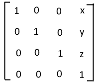
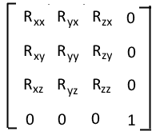
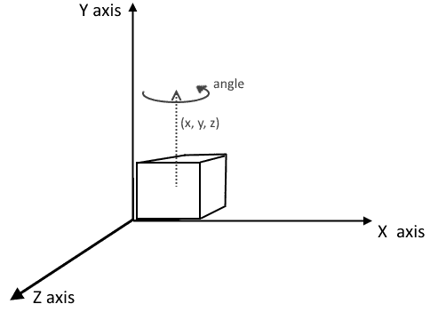
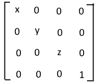
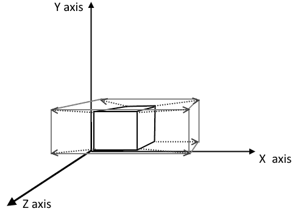
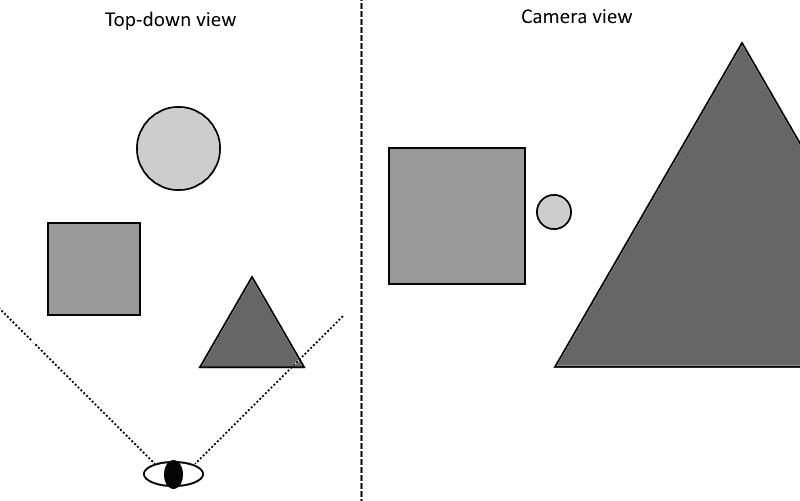
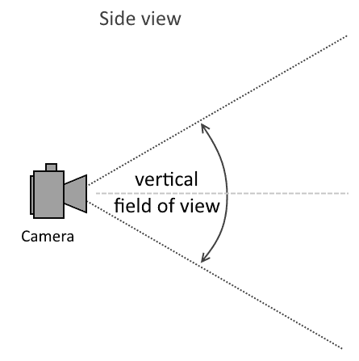

# 第十章：辅助菜谱

在本章中，我们将介绍以下内容：

+   准备平移矩阵

+   准备旋转矩阵

+   准备缩放矩阵

+   准备透视投影矩阵

+   准备正交投影矩阵

+   从文件加载纹理数据

+   从 OBJ 文件加载 3D 模型

# 简介

在前面的章节中，我们学习了 Vulkan API 的各个方面。我们现在知道如何使用图形库以及如何创建渲染 3D 图像和执行数学计算的应用程序。但是，仅了解 Vulkan API 可能不足以生成更复杂的场景和实现各种渲染算法。有几个非常有用的操作可以帮助我们创建、操作和显示 3D 对象。

在本章中，我们将学习如何准备用于移动、旋转和缩放 3D 网格的变换矩阵。我们还将了解如何生成投影矩阵。最后，我们将使用简单但非常强大的单头库来加载存储在文件中的图像和 3D 模型。

# 准备平移矩阵

在 3D 模型上可以执行的基本操作包括将对象移动到选定的方向上，移动的距离为选定的单位数。

# 如何做...

1.  准备三个名为`x`、`y`和`z`的`float`类型变量，并将它们初始化为沿`x`（右/左）、`y`（上/下）和`z`（近/远）方向应用于对象的平移（移动距离）量。

1.  创建一个名为`translation_matrix`的`std::array<float, 16>`类型的变量，它将保存表示所需操作的矩阵。用以下值初始化`translation_matrix`数组的元素：

    +   所有元素都初始化为`0.0f`值

    +   第 0 个、第 5 个、第 10 个和第 15 个元素（主对角线）具有`1.0f`值

    +   存储在`x`变量中的第 12 个元素

    +   存储在`y`变量中的第 13 个元素

    +   存储在`z`变量中的第 14 个元素

1.  将`translation_matrix`变量的所有元素传递给着色器（可能通过统一缓冲区或推送常量），或者将其与另一个矩阵相乘以在一个矩阵中累积多个操作。

# 它是如何工作的...

平移是可应用于对象的三种基本变换之一（其余的是旋转和缩放）。它允许我们将 3D 模型移动到选定的方向上，移动的距离为选定的距离：


平移也可以应用于相机，从而改变我们观察整个渲染场景的视角。

创建平移矩阵是一个简单的过程。我们需要一个单位 4x4 矩阵--除了主对角线上的元素外，所有元素都必须初始化为零（`0.0f`），主对角线上的元素必须初始化为一（`1.0f`）。现在我们将第四列的前三个元素初始化为我们想要在`x`、`y`和`z`轴上应用的距离，如下所示：



以下代码创建了一个平移矩阵：

```cpp
std::array<float, 16> translation_matrix = { 
  1.0f, 0.0f, 0.0f, 0.0f, 
  0.0f, 1.0f, 0.0f, 0.0f, 
  0.0f, 0.0f, 1.0f, 0.0f, 
     x,    y,    z, 1.0f 
}; 
return translation_matrix;

```

在前面的代码中，我们假设矩阵具有 `column_major` 顺序（前四个元素组成矩阵的第一列，接下来的四个元素组成第二列，依此类推），因此它与前面的图相比是转置的。但提供给着色器的矩阵元素的顺序取决于在着色器源代码中指定的 `row_major` 或 `column_major` **布局限定符**。

请记住在着色器中定义的矩阵元素的顺序。它通过 `row_major` 或 `column_major` 布局限定符来指定。

# 参见

+   在第五章，*描述符集*，参见以下配方：

    +   *创建统一缓冲区*

+   在第七章，*着色器*，参见以下配方：

    +   *编写乘以投影矩阵的顶点着色器*

    +   *在着色器中使用推送常量*

+   在第九章，*命令记录和绘图*，参见以下配方：

    +   *通过推送常量向着色器提供数据*

+   本章中的以下配方：

    +   *准备缩放矩阵*

    +   *准备旋转矩阵*

# 准备旋转矩阵

当我们创建一个 3D 场景并操作其对象时，我们通常需要旋转它们，以便正确地将它们放置和定位在其他对象之间。旋转对象是通过旋转矩阵实现的。为此，我们需要指定一个旋转将围绕进行的向量以及一个角度——我们想要应用多少旋转。

# 如何做到这一点...

1.  准备三个名为 `x`、`y` 和 `z` 的 `float` 类型的变量。用定义任意向量的值初始化它们，该向量是旋转应围绕进行的。确保该向量是归一化的（长度等于 `1.0f`）。

1.  准备一个名为 `angle` 的 `float` 类型的变量，并将旋转角度（以弧度为单位）存储在其中。

1.  创建一个名为 `c` 的 `float` 类型的变量。将角度的余弦值存储在其中。

1.  创建一个名为 `s` 的 `float` 类型的变量。将角度的正弦值存储在其中。

1.  创建一个名为 `rotation_matrix` 的 `std::array<float, 16>` 类型的变量，它将保存表示所需操作的矩阵。用以下值初始化 `rotation_matrix` 数组的元素：

    +   第 0 个元素使用公式 `x * x * (1.0f - c) + c`

    +   第 1 个元素使用公式 `y * x * (1.0f - c) - z * s`

    +   第 2 个元素使用公式 `z * x * (1.0f - c) + y * s`

    +   第 4 个元素使用公式 `x * y * (1.0f - c) + z * s`

    +   第 5 个元素使用公式 `y * y * (1.0f - c) + c`

    +   第 6 个元素使用公式 `z * y * (1.0f - c) - x * s`

    +   第 8 个元素使用公式 `x * z * (1.0f - c) - y * s`

    +   第 9 个元素使用公式 `y * z * (1.0f - c) + x * s`

    +   第 10 个元素使用公式 `z * z * (1.0f - c) + c`

    +   其余元素使用 `0.0f` 值初始化

    +   除了第 15 个元素应包含 `1.0f` 值外

1.  向着色器提供`rotation_matrix`变量所有元素的价值（可能通过统一缓冲区或推送常量）或者乘以另一个矩阵以在一个矩阵中累积多个操作。

# 它是如何工作的...

准备表示一般旋转变换的矩阵相当复杂。它可以分为三个独立的矩阵——分别表示围绕每个`x`、`y`和`z`轴的旋转——稍后相乘以生成相同的结果。每个这样的旋转都更容易准备，但总的来说，它需要执行更多的操作，因此可能性能较差。

正因如此，最好准备一个表示围绕所选（任意）向量旋转的矩阵。为此，我们需要指定一个角度，它定义了要应用的旋转量，以及一个向量。这个向量应该是归一化的，否则应用旋转的量将按比例缩放向量的长度。

执行旋转的向量应该被归一化。

以下图显示了旋转矩阵。执行旋转变换所需的数据放置在上左边的 3x3 矩阵中。该矩阵的每一列分别定义了旋转后`x`、`y`和`z`轴的方向。更重要的是，转置的旋转矩阵定义了完全相反的变换：



例如，如果我们想旋转摄像机以模拟我们控制的角色左右环顾，或者如果我们想显示一辆正在左转或右转的汽车，我们应该指定一个向上指的向量(`0.0f, 1.0f, 0.0f`)。我们也可以指定一个向下指的向量(`0.0f, -1.0f, 0.0f`)。在这种情况下，对象将以相同的角度旋转，但方向相反。我们需要选择对我们来说更方便的选项：



以下是为创建旋转矩阵的代码。它首先检查我们是否想要归一化向量，并相应地修改其分量。接下来，准备辅助变量以存储临时结果。最后，初始化旋转矩阵的所有元素：

```cpp
if( normalize ) { 
  std::array<float, 3> normalized = Normalize( x, y, z ); 
  x = normalized[0]; 
  y = normalized[1]; 
  z = normalized[2]; 
} 
const float c = cos( Deg2Rad( angle ) ); 
const float _1_c = 1.0f - c; 
const float s = sin( Deg2Rad( angle ) ); 
std::array<float, 16> rotation_matrix = { 
  x * x * _1_c + c, 
  y * x * _1_c - z * s, 
  z * x * _1_c + y * s, 
  0.0f, 
  x * y * _1_c + z * s, 
  y * y * _1_c + c, 
  z * y * _1_c - x * s, 
  0.0f, 
  x * z * _1_c - y * s, 
  y * z * _1_c + x * s, 
  z * z * _1_c + c, 
  0.0f, 
  0.0f, 
  0.0f, 
  0.0f, 
  1.0f 
}; 
return rotation_matrix;

```

我们需要记住数组（应用程序）中元素和着色器源代码中定义的矩阵中元素的顺序。在着色器内部，我们通过`row_major`或`column_major`布局限定符来控制它。

# 参见

+   在第五章的*描述符集*中，查看以下配方：

    +   *创建统一缓冲区*

+   在第七章的*着色器*中，查看以下配方：

    +   *编写乘以投影矩阵的顶点着色器*

    +   *在着色器中使用推送常量*

+   在第九章的*命令记录和绘制*中，查看以下配方：

    +   *通过推送常量向着色器提供数据*

+   本章中的以下配方：

    +   *准备平移矩阵*

    +   *准备缩放矩阵*

# 准备缩放矩阵

在 3D 模型上可以执行的第三个变换是缩放。这允许我们改变对象的大小。

# 如何做到...

1.  准备三个名为`x`、`y`和`z`的类型为`float`的变量，它们将分别存储应用于模型在 x（宽度）、y（高度）和 z（深度）维度上的缩放因子。

1.  创建一个名为`scaling_matrix`的类型为`std::array<float, 16>`的变量，其中将存储表示所需操作的矩阵。使用以下值初始化`scaling_matrix`数组的元素：

    +   所有元素都初始化为`0.0f`值

    +   第 0 个元素存储在`x`变量中的值

    +   第 5 个元素存储在`y`变量中的值

    +   第 10 个元素存储在`z`变量中的值

    +   第 15 个元素具有`1.0f`值

1.  将`scaling_matrix`变量的所有元素值提供给着色器（可能通过统一缓冲区或推送常量）或将其与另一个矩阵相乘以在一个矩阵中累积多个操作。

# 它是如何工作的...

有时我们需要改变对象的大小（与其他场景中的对象相比）。例如，由于魔法咒语的效果，我们的角色缩小以适应一个非常小的洞。这种变换是通过以下这样的缩放矩阵实现的：



使用缩放矩阵，我们可以在每个维度上以不同的方式调整模型的大小：



如果我们不均匀地缩放对象，我们必须谨慎行事。通常，为了简化代码并提高性能，我们向着色器提供一个组合变换矩阵，并使用相同的矩阵来变换不仅顶点，还有法向量。当我们均匀缩放对象时，我们只需在变换后对着色器中的法向量进行归一化。但是，当我们使用在每个维度上以不同方式缩放对象的变换时，我们不能将其应用于法向量，因为光照计算将不正确（由法向量表示的方向将改变）。如果我们确实需要执行此类缩放，我们需要使用法向量变换的逆转置矩阵。我们必须单独准备它并将其提供给着色器。

当对象在每个维度上以不同的方式缩放时，必须使用逆变换矩阵变换法向量。

准备缩放矩阵可以通过以下代码执行：

```cpp
std::array<float, 16> scaling_matrix = { 
     x, 0.0f, 0.0f, 0.0f, 
  0.0f,    y, 0.0f, 0.0f, 
  0.0f, 0.0f,    z, 0.0f, 
  0.0f, 0.0f, 0.0f, 1.0f 
}; 
return scaling_matrix;

```

与所有其他矩阵一样，我们需要记住在我们应用程序（CPU）中定义的元素顺序以及着色器源代码中矩阵元素的顺序（`column_major`与`row_major`顺序）。

# 参见

+   在第五章，*描述符集*中，查看以下食谱：

    +   *创建统一缓冲区*

+   在第七章，*着色器*中，查看以下食谱：

    +   *编写乘以投影矩阵的顶点着色器*

    +   *在着色器中使用推送常量*

+   在第九章的*命令录制和绘图*部分，查看以下配方：

    +   *通过推送常量向着色器提供数据*

+   本章中的以下配方：

    +   *准备平移矩阵*

    +   *准备旋转矩阵*

# 准备透视投影矩阵

3D 应用程序通常试图模拟我们感知周围世界的效果——远处的物体看起来比靠近我们的物体小。为了实现这种效果，我们需要使用透视投影矩阵。

# 如何做到这一点...

1.  准备一个名为 `aspect_ratio` 的 `float` 类型的变量，它将保存可渲染区域的纵横比（图像宽度除以高度）。

1.  创建一个名为 `field_of_view` 的 `float` 类型的变量。用相机垂直视场角（以弧度为单位）初始化它。

1.  创建一个名为 `near_plane` 的 `float` 类型的变量，并用相机位置到近裁剪平面的距离初始化它。

1.  创建一个名为 `far_plane` 的 `float` 类型的变量。将相机与远裁剪平面之间的距离存储在该变量中。

1.  计算一个值，即 `1.0f` 除以 `field_of_view` 半部的正切（`1.0f / tan(Deg2Rad(0.5f * field_of_view))`），并将结果存储在名为 `f` 的 `float` 类型的变量中。

1.  创建一个名为 `perspective_projection_matrix` 的 `std::array<float, 16>` 类型的变量，它将保存表示所需投影的矩阵。用以下值初始化 `perspective_projection_matrix` 数组的元素：

    +   第 0 个元素具有 `f / aspect_ratio`

    +   第 5 个元素具有 `-f`

    +   第 10 个元素具有 `far_plane / (near_plane - far_plane)`

    +   第 11 个元素具有 `-1.0f` 值

    +   第 14 个元素具有 `(near_plane * far_plane) / (near_plane - far_plane)`

    +   其余元素使用 `0.0f` 值初始化

1.  向着色器提供 `perspective_projection_matrix` 变量的所有元素（可能通过统一缓冲区或推送常量）或将其乘以另一个矩阵以在一个矩阵中累积多个操作。

# 它是如何工作的...

图形管线在所谓的裁剪空间中操作顶点位置。通常，我们在局部（模型）坐标系中指定顶点，并直接将它们提供给顶点着色器。这就是为什么我们需要在某个顶点处理阶段（顶点、细分控制、细分评估或几何着色器）中将提供的顶点位置从其局部空间转换为裁剪空间。这种转换是通过投影矩阵完成的。如果我们想模拟透视除法的效果，我们需要使用透视投影矩阵并将其乘以顶点位置：



要创建一个透视投影矩阵，我们需要知道可渲染区域的尺寸，以计算其纵横比（宽度除以高度）。我们还需要指定一个（垂直）视野，我们可以将其视为虚拟相机的缩放：



创建透视投影矩阵所需的一个最后要素是近裁剪面和远裁剪面的两个距离。由于它们影响深度计算，它们应尽可能接近场景中的对象。如果我们为近裁剪面指定一个大的值，而远裁剪面指定一个小的值，那么我们的场景（通常）将被裁剪——我们将看到对象如何从场景中弹出和消失。另一方面，如果近距离太小，而远裁剪面的距离太大，我们将失去深度缓冲区的精度，深度计算可能是不正确的。

近裁剪面和远裁剪面应与显示的场景相对应。

使用前面描述的数据，我们可以使用以下代码创建一个透视投影矩阵：

```cpp
float f = 1.0f / tan( Deg2Rad( 0.5f * field_of_view ) );

Matrix4x4 perspective_projection_matrix = {
 f / aspect_ratio,
 0.0f,
 0.0f,
 0.0f,

 0.0f,
 -f,
 0.0f,
 0.0f,

 0.0f,
 0.0f,
 far_plane / (near_plane - far_plane),
 -1.0f,

 0.0f,
 0.0f,
 (near_plane * far_plane) / (near_plane - far_plane),
 0.0f
};
return perspective_projection_matrix;

```

# 参见

+   在第五章，*描述符集*中，查看以下配方：

    +   *创建统一缓冲区*

+   在第七章，*着色器*中，查看以下配方：

    +   *编写乘以投影矩阵的顶点着色器*

    +   *在着色器中使用推送常量*

+   在第九章，*命令记录和绘制*中，查看以下配方：

    +   *通过推送常量向着色器提供数据*

+   本章中的以下配方：

    +   *准备正交投影矩阵*

# 准备正交投影矩阵

正交投影是另一种将顶点从其局部坐标系转换到裁剪空间的操作。但与透视投影相反，它不考虑透视除法（不模拟我们感知周围环境的方式）。但与透视投影类似，它也由一个 4x4 矩阵表示，我们需要创建这个矩阵才能使用这种类型的投影。

# 如何做到这一点...

1.  创建两个类型为`float`的变量，分别命名为`left_plane`和`right_plane`，并将它们初始化为左裁剪面和右裁剪面在`x`轴上的位置。

1.  准备两个类型为`float`的变量，分别命名为`bottom_plane`和`top_plane`。将它们初始化为底部和顶部裁剪面在`y`轴上的位置。

1.  创建两个类型为`float`的变量，分别命名为`near_plane`和`far_plane`。使用它们来存储从相机到近裁剪面和远裁剪面的距离。

1.  创建一个类型为`std::array<float, 16>`的变量，命名为`orthographic_projection_matrix`。它将存储表示所需投影的矩阵。使用以下值初始化`orthographic_projection_matrix`数组的元素：

    +   矩阵的所有元素都初始化为`0.0f`值

    +   第 0 个元素使用`2.0f / (right_plane - left_plane)`

    +   第 5 个元素使用`2.0f / (bottom_plane - top_plane)`

    +   第 10 个元素使用`1.0f / (near_plane - far_plane)`

    +   第 12 个元素使用`-(right_plane + left_plane) / (right_plane - left_plane)`

    +   第 13 个元素使用`-(bottom_plane + top_plane) / (bottom_plane - top_plane)`

    +   第 14 个元素使用`near_plane / (near_plane - far_plane)`

    +   第 15 个元素使用`1.0f`值

1.  向着色器提供`orthographic_projection_matrix`变量的所有元素的值（可能通过统一缓冲区或推送常量），或者将其乘以另一个矩阵以在一个矩阵中累积多个操作。

# 它是如何工作的...

当我们使用正交投影时，场景中的所有对象无论离相机有多远都保持其大小和屏幕位置。这就是为什么正交投影对于绘制各种**UI**（**用户界面**）非常有用。我们可以定义我们的虚拟屏幕，我们知道它的所有边（为投影定义的平面），并且我们可以轻松地在屏幕上放置和操作界面元素。如果需要，我们还可以使用深度测试。

正交投影在**CAD**程序（**计算机辅助设计**）中也广泛使用。这些工具用于设计建筑、船舶、电子电路或机械装置。在这种情况下，场景中所有对象的尺寸都必须与设计师定义的尺寸完全一致，所有方向都必须保持其关系（即所有平行线必须始终保持平行），无论对象离相机有多远，以及从哪个角度观察。

以下代码用于创建表示正交投影的矩阵：

```cpp
Matrix4x4 orthographic_projection_matrix = {
  2.0f / (right_plane - left_plane),
  0.0f,
  0.0f,
  0.0f,

  0.0f,
  2.0f / (bottom_plane - top_plane),
  0.0f,
  0.0f,

  0.0f,
  0.0f,
  1.0f / (near_plane - far_plane),
  0.0f,

  -(right_plane + left_plane) / (right_plane - left_plane),
  -(bottom_plane + top_plane) / (bottom_plane - top_plane),
  near_plane / (near_plane - far_plane),
  1.0f
 };
 return orthographic_projection_matrix;

```

# 参见

+   在第五章，*描述符集*部分，查看以下配方：

    +   *创建一个统一缓冲区*

+   在第七章，*着色器*部分，查看以下配方：

    +   *编写一个将顶点位置乘以投影矩阵的顶点着色器*

    +   *在着色器中使用推送常量*

+   在第九章，*命令录制和绘制*部分，查看以下配方：

    +   *通过推送常量向着色器提供数据*

+   本章中的*准备透视投影矩阵*配方

# 从文件中加载纹理数据

纹理化是一种常用的技术。它允许我们以类似我们在墙上贴壁纸的方式将图像放置在物体的表面上。这样我们就不需要增加网格的几何复杂性，这会使硬件处理变得过于复杂，并且会消耗过多的内存。纹理化更容易处理，并允许我们实现更好、更令人信服的结果。

纹理可以通过程序（在代码中动态生成），但通常它们的内 容是从图像或照片中读取的。

# 准备工作

有许多不同的库允许我们加载图像的内容。它们各自都有特定的行为、用法和许可证。在这个菜谱中，我们将使用由*Sean T. Barrett*创建的`stb_image`库。它非常易于使用，同时支持足够多的图像格式，可以开始开发 Vulkan 应用程序。它的主要优势之一是它是一个单头文件库，所有代码都放在一个头文件中。它不依赖于任何其他库、文件或资源。另一个优点是我们可以根据需要使用它。

`stb_image.h`文件可在[`github.com/nothings/stb`](https://github.com/nothings/stb)找到。

要在我们的应用程序中使用`stb_image`库，我们需要从[`github.com/nothings/stb`](https://github.com/nothings/stb)下载`stb_image.h`文件并将其包含在我们的项目中。此文件可以在我们的代码中的许多地方包含，但为了在单个源文件中创建库的实现，我们需要包含该文件并在其前面加上一个`#define STB_IMAGE_IMPLEMENTATION`定义，如下所示：

```cpp
#include ... 
#define STB_IMAGE_IMPLEMENTATION 
#include "stb_image.h"

```

# 如何做到这一点...

1.  将从其中加载纹理图像的文件名存储在一个名为`filename`的`char const *`类型的变量中。

1.  创建一个名为`num_requested_components`的`int`类型的变量，并使用从文件中加载所需组件数量的值（`1`到`4`之间的值）或使用`0`值来加载所有可用组件初始化它。

1.  创建三个名为`width`、`height`和`num_components`的`int`类型的变量，并将它们全部初始化为`0`值。

1.  创建一个名为`stbi_data`的`unsigned char *`类型的变量。

1.  调用`stbi_load( filename, &width, &height, &num_components, num_requested_components )`并提供`filename`变量、指向`width`、`height`和`num_components`变量的指针以及`num_requested_components`变量。将函数调用的结果存储在`stbi_data`变量中。

1.  确保调用成功加载了指定文件的内容，通过检查存储在`stbi_data`变量中的值是否不等于`nullptr`值，以及存储在`width`、`height`和`num_components`变量中的值是否大于`0`。

1.  创建一个名为`data_size`的`int`类型的变量，并使用以下公式计算其值初始化：

`*width * height * (0 < num_requested_components ? num_requested_components : num_components)*`

1.  创建一个名为`image_data`的`std::vector<unsigned char>`类型的变量。将其大小调整为容纳`data_size`个元素。

1.  使用以下调用将`stbi_data`中的`data_size`个字节复制到从`image_data`向量的第一个元素开始的内存中：

```cpp
      std::memcpy( image_data.data(), stbi_data.get(), data_size )

```

1.  调用`stbi_image_free( stbi_data )`。

# 它是如何工作的...

使用`stb_image`库归结为调用`stbi_load()`函数。它接受文件名，从文件中加载的选定组件数量，并返回包含加载数据的内存指针。该库总是将图像内容转换为每通道 8 位。图像的宽度和高度以及图像中实际可用的组件数量存储在可选变量中。

加载图像的代码如下所示：

```cpp
int width = 0; 
int height = 0; 
int num_components = 0; 
std::unique_ptr<unsigned char, void(*)(void*)> stbi_data( stbi_load( filename, &width, &height, &num_components, num_requested_components ), stbi_image_free );

if( (!stbi_data) || 
    (0 >= width) || 
    (0 >= height) || 
    (0 >= num_components) ) { 
  std::cout << "Could not read image!" << std::endl; 
  return false; 
}

```

`stbi_load()`函数返回的指针必须通过调用`stbi_image_free()`函数并使用前一个函数返回的值作为其唯一参数来释放。这就是为什么将加载的数据复制到我们自己的变量（即向量）或直接到 Vulkan 资源（图像）中是好的，这样就不会有内存泄漏。这如下所示：

```cpp
std::vector<unsigned char> image_data; 
int data_size = width * height * (0 < num_requested_components ? num_requested_components : num_components); 
image_data.resize( data_size ); 
std::memcpy( image_data.data(), stbi_data.get(), data_size ); 
return true;

```

在前面的代码中，`stbi_load()`函数返回的内存指针会自动释放，因为我们将其存储在`std::unique_ptr`类型的智能指针中。在示例中，我们将图像内容复制到一个向量中。这个向量可以在我们的应用程序中作为纹理数据的来源使用。

# 参见

+   在第四章，*资源和内存*中，查看以下配方：

    +   *创建图像*

    +   *将内存对象分配和绑定到图像*

    +   *创建图像视图*

+   在第五章，*描述符集*中，查看以下配方：

    +   *创建采样图像*

    +   *创建组合图像采样器*

+   在第七章，*着色器*中，查看以下配方：

    +   *编写纹理顶点和片段着色器*

# 从 OBJ 文件加载 3D 模型

渲染 3D 场景需要我们绘制物体，这些物体也被称为模型或网格。网格是一组顶点（点）的集合，这些顶点包含了如何形成表面或面的信息（通常是三角形）。

物体在建模软件或 CAD 程序中准备。它们可以存储在许多不同的格式中，之后在 3D 应用程序中加载，提供给图形硬件，然后进行渲染。一种较简单的文件类型，用于存储网格数据的是**Wavefront OBJ**。我们将学习如何加载存储在此格式的模型。

# 准备工作

有多个库允许我们加载 OBJ 文件（或其他文件类型）。其中之一是一个简单但非常快速且仍在改进的库，由*Syoyo Fujita*开发的**tinyobjloader**。这是一个单头库，因此我们不需要包含任何其他文件或引用任何其他库。

tinyobjloader 库可以从[`github.com/syoyo/tinyobjloader`](https://github.com/syoyo/tinyobjloader)下载。

要使用库，我们需要从 [`github.com/syoyo/tinyobjloader`](https://github.com/syoyo/tinyobjloader) 下载一个 `tiny_obj_loader.h` 文件。我们可以在代码的许多地方包含它，但为了生成其实现，我们需要在源文件中包含它，并在包含之前添加一个类似于 `#define TINYOBJLOADER_IMPLEMENTATION` 的定义：

```cpp
#include ... 
#define TINYOBJLOADER_IMPLEMENTATION 
#include "tiny_obj_loader.h"

```

为了本菜谱的目的，我们还将使用一个自定义的 `Mesh` 类型，该类型将以易于与 Vulkan API 一起使用的形式存储加载的数据。此类型具有以下定义：

```cpp
struct Mesh { 
  std::vector<float>  Data; 
  struct Part { 
    uint32_t  VertexOffset; 
    uint32_t  VertexCount; 
  }; 
  std::vector<Part>   Parts; 
};

```

`Data` 成员存储顶点属性——位置、法线和纹理坐标（法线向量和纹理坐标是可选的）。接下来是一个名为 `Parts` 的向量成员，它定义了模型的单独部分。每个这样的部分都需要通过单独的 API 调用（如 `vkCmdDraw()` 函数）来绘制。模型部分由两个参数定义。`VertexOffset` 定义了给定部分开始的位置（在顶点数据数组中的偏移量）。`VertexCount` 定义了给定部分由多少个顶点组成。

# 如何做到这一点...

1.  准备一个类型为 `char const *` 的变量名为 `filename` 并将文件名存储在该变量中，该文件将从中加载模型数据。

1.  创建以下变量：

    +   类型为 `tinyobj::attrib_t` 的变量名为 `attribs`

    +   类型为 `std::vector<tinyobj::shape_t>` 的变量名为 `shapes`

    +   类型为 `std::vector<tinyobj::material_t>` 的变量名为 `materials`

    +   类型为 `std::string` 的变量名为 `error`

1.  调用 `tinyobj::LoadObj( &attribs, &shapes, &materials, &error, filename )`，为 `attribs`、`shapes`、`materials` 和 `error` 变量提供指针，并将 `filename` 变量作为最后一个参数。

1.  确保函数调用成功从文件中加载了模型数据，通过检查函数调用是否返回了 `true` 值。

1.  创建一个类型为 `Mesh` 的变量名为 `mesh`，该变量将以适合 Vulkan API 的形式存储模型数据。

1.  创建一个类型为 `uint32_t` 的变量名为 `offset` 并将其初始化为 `0` 值。

1.  遍历 `shapes` 向量的所有元素。假设当前元素存储在一个类型为 `tinyobj::shape_t` 的变量 `shape` 中，对每个元素执行以下操作：

    1.  创建一个类型为 `uint32_t` 的变量名为 `part_offset`。将其初始化为存储在 `offset` 变量中的值。

    1.  遍历 `shape.mesh.indices` 向量的所有元素，将当前处理的元素存储在一个类型为 `tinyobj::index_t` 的变量 `index` 中，并对每个元素执行以下操作：

        +   将 `attribs.vertices` 向量中的三个元素（索引分别为 `3 * index.vertex_index`、`3 * index.vertex_index + 1` 和 `3 * index.vertex_index + 2`）复制为 `mesh.Data` 向量的新元素

        +   如果应该加载法向量，则将`attribs.normals`向量的三个元素复制到`mesh.Data`向量中，这些元素由等于(`3 * index.normal_index`)、(`3 * index.normal_index + 1`)和(`3 * index.normal_index + 2`)的索引指示

        +   如果还应加载纹理坐标，则向`mesh.Data`向量添加两个元素，并将它们初始化为存储在`attribs.texcoords`向量中的值，位置为(`2 * index.texcoord_index`)和(`2 * index.texcoord_index + 1`)

        +   将`offset`变量的值增加一

    1.  将`offset - part_offset`的计算值存储在名为`part_vertex_count`的`uint32_t`类型变量中。

    1.  如果`part_vertex_count`变量的值大于零（`0`值），则向`mesh.Parts`向量添加一个新元素。用以下值初始化其内容：

        +   `VertexOffset`的`part_offset`变量

        +   `VertexCount`的`part_vertex_count`变量

# 它是如何工作的...

3D 模型应该尽可能小，以加快加载过程并降低存储它们所需的磁盘空间。通常，当我们考虑创建游戏时，我们应该选择二进制格式之一，因为它们中的大多数都满足上述要求。

但当我们开始学习新的 API 时，选择一个更简单的格式是好的。OBJ 文件包含以文本形式存储的数据，因此我们可以轻松地查看它，甚至可以自行修改它。大多数（如果不是所有）常用的建模程序都允许将生成的模型导出为 OBJ 文件。因此，这是一个很好的入门格式。

在这里，我们将专注于仅加载顶点数据。首先，我们需要为模型准备存储空间。之后，我们可以使用 tinyobjloader 库来加载模型。如果出现任何问题，我们将检查错误信息并将其显示给用户：

```cpp
tinyobj::attrib_t                attribs; 
std::vector<tinyobj::shape_t>    shapes; 
std::vector<tinyobj::material_t> materials; 
std::string                      error; 
bool result = tinyobj::LoadObj( &attribs, &shapes, &materials, &error, filename.c_str() ); 
if( !result ) { 
  std::cout << "Could not open '" << filename << "' file."; 
  if( 0 < error.size() ) { 
    std::cout << " " << error; 
  } 
  std::cout << std::endl; 
  return false; 
}

```

理论上，我们可以在这里结束我们的模型加载代码，但这个数据结构并不适合 Vulkan API。尽管单个顶点的法向量和纹理坐标可能放置在单独的数组中，但它们应该放置在相同的索引位置。不幸的是，当涉及到 OBJ 文件格式时，它可能会重复使用多个顶点的相同值。因此，我们需要将加载的数据转换为一种可以轻松由图形硬件使用的格式：

```cpp
Mesh mesh = {}; 
uint32_t offset = 0; 
for( auto & shape : shapes ) { 
  uint32_t part_offset = offset; 

  for( auto & index : shape.mesh.indices ) { 
    mesh.Data.emplace_back( attribs.vertices[3 * index.vertex_index + 0] ); 
    mesh.Data.emplace_back( attribs.vertices[3 * index.vertex_index + 1] ); 
    mesh.Data.emplace_back( attribs.vertices[3 * index.vertex_index + 2] ); 
    ++offset; 

    if( (load_normals) && 
        (attribs.normals.size() > 0) ) { 
      mesh.Data.emplace_back( attribs.normals[3*index.normal_index+0]); 
      mesh.Data.emplace_back( attribs.normals[3*index.normal_index+1]); 
      mesh.Data.emplace_back( attribs.normals[3*index.normal_index+2]); 
    } 

    if( (load_texcoords) && 
        (attribs.texcoords.size() > 0)) { 
      mesh.Data.emplace_back( attribs.texcoords[2 * index.texcoord_index + 0] ); 
      mesh.Data.emplace_back( attribs.texcoords[2 * index.texcoord_index + 1] ); 
    } 
  } 

  uint32_t part_vertex_count = offset - part_offset; 
  if( 0 < part_vertex_count ) { 
    mesh.Parts.push_back( { part_offset, part_vertex_count } ); 
  } 
}

```

在前面的转换之后，存储在`mesh`变量的`Data`成员中的数据可以直接复制到顶点缓冲区。另一方面，在绘制过程中使用模型的每个部分的`VertexOffset`和`VertexCount`成员--我们可以将它们提供给`vkCmdDraw()`函数。

当我们创建一个图形管线，该管线将用于绘制使用 tinyobjloader 库加载并存储在自定义类型 `Mesh` 变量中的模型时，我们需要为输入装配状态指定一个 `VK_PRIMITIVE_TOPOLOGY_TRIANGLE_LIST` 顶点拓扑（参考第八章，*图形和计算管线*中的*指定管线输入装配状态*食谱）。我们还需要记住，每个顶点由定义其位置的三个浮点值组成。当加载顶点法线时，它们也由三个浮点值描述。可选的纹理坐标包含两个浮点值。位置、法线和 texcoord 属性依次放置在第一个顶点之后，然后是第二个顶点的位置、法线和 texcoord 属性，依此类推。上述信息是正确设置在创建图形管线期间指定的顶点绑定和属性描述所必需的（参考第八章，*图形和计算管线*中的*指定管线顶点绑定描述、属性描述和输入状态*食谱）。

# 参见

+   在第四章，*资源和内存*中，查看以下食谱：

    +   *创建缓冲区*

    +   *分配和绑定内存对象到缓冲区*

    +   *使用阶段缓冲区更新绑定设备本地内存的缓冲区*

+   在第七章，*着色器*中，查看以下食谱：

    +   *编写顶点着色器*

+   在第八章，*图形和计算管线*中，查看以下食谱：

    +   *指定管线顶点绑定描述、属性描述和输入状态*

    +   *指定管线输入装配状态*

+   在第九章，*命令录制和绘制*中，查看以下食谱：

    +   *绑定顶点缓冲区*

    +   *绘制几何体*
