# 光照

本章将涵盖以下食谱：

+   使用顶点漫反射光照渲染几何

+   使用片段镜面光照渲染几何

+   渲染法线贴图几何

+   使用立方体贴图绘制反射和折射几何

+   向场景添加阴影

# 简介

光照是我们感知周围一切的重要因素之一。我们的大脑从世界中收集的大部分信息都来自我们的眼睛。人类的视觉对光照条件的最轻微变化都非常敏感。这就是为什么光照对于 3D 应用程序、游戏和电影的制作者来说也非常重要。

在 3D 图形库仅支持固定功能管道的时代，光照计算是根据预定义的规则进行的--开发者只能选择光源和被照物体的颜色。这导致大多数使用给定库的游戏和应用看起来和感觉都相似。图形硬件演化的下一步是引入片段着色器：它们的主要目的是计算片段（像素）的最终颜色。片段着色器实际上着色了几何形状，因此着色器的名字是一个自然的选择。它们的主要优势是可编程。它们不仅可以执行光照计算，还可以实现几乎任何其他算法。如今，图形硬件要复杂得多。还有其他类型的可编程图形硬件部分，它们也采用了着色器的名称。有许多不同的算法和方法，它们都使用着色器在游戏、3D 应用程序和电影中显示有趣的图像。着色器程序的基本目的即使在今天仍然非常重要--如果我们想要实现有趣、引人注目的结果，就必须执行光照计算。

在本章中，我们将学习从简单的物体漫反射光照计算到阴影映射算法的常用光照技术。

# 使用顶点漫反射光照渲染几何

基本的漫反射光照算法是大多数光照计算的核心。它用于模拟漫反射表面反射光线，并向许多不同方向散射。在本例中，我们将看到如何使用实现漫反射光照算法的顶点和片段着色器来渲染几何形状。

使用此方法生成的图像示例如下：

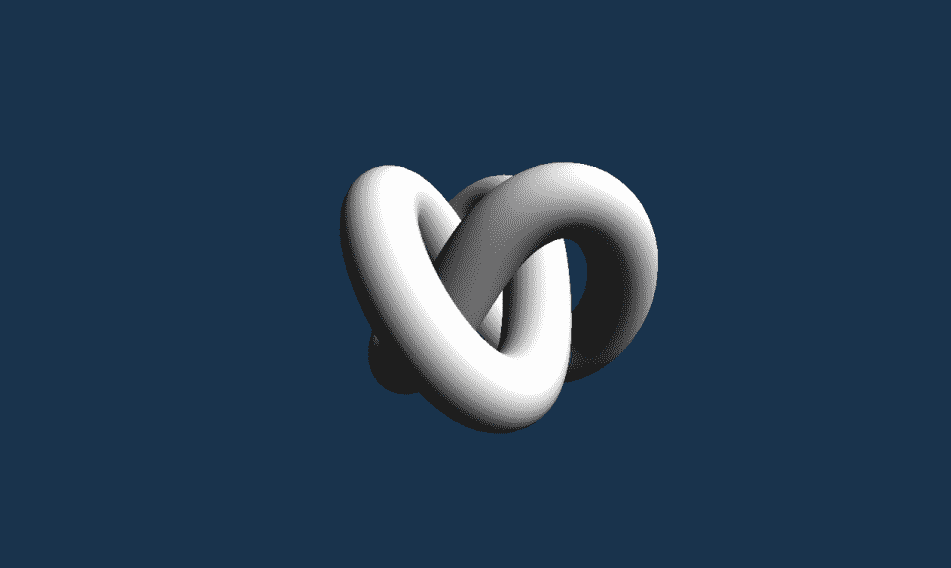

以下食谱非常详细，以便您可以更容易地理解和跟随所有步骤。后续食谱将基于这里描述的知识，因此它们更短，但也更通用。

# 准备工作

漫反射光照是基于由**约翰·海因里希·拉姆伯特**提出的**余弦定律**。它表明，观察到的表面光照强度与从表面到光源方向（光向量）与表面法线向量的夹角的余弦成正比：

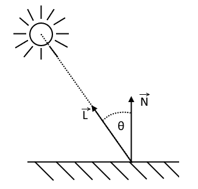

这个定律可以在着色器中轻松实现。法线向量作为顶点属性之一由应用程序提供。所有顶点的位置也是已知的，所以我们只需要提供一个光方向或光源的位置来在着色器内部计算光向量。正常向量和光向量都必须归一化（两者都必须长度等于`1.0`）。下一步是计算这两个向量之间角度的余弦值。这可以通过一个`dot()`函数来完成，如下所示：

```cpp
max( 0.0, dot( normal_vector, light_vector ) )

```

我们必须记住，余弦函数可以给出负值。这种情况发生在我们计算指向光源相反方向表面上的点光照时。这样的点不能被给定光源照亮（它们从给定光源的角度看处于阴影中），因此我们必须忽略这样的结果并将它们夹到`0`值。

在所有后续的配方中，我们将使用`VkDestroyer`类的对象，这允许我们自动销毁 Vulkan 资源。为了方便，还引入了一个`InitVkDestroyer()`函数。它的目的是将给定的资源包装在`VkDestroyer`对象中，并将其连接到创建的逻辑设备。

# 如何操作...

1.  使用一组启用的交换链扩展创建一个 Vulkan 实例和一个逻辑设备。同时存储从其中创建逻辑设备的物理设备的句柄（参考第二章，*启用 WSI 扩展创建 Vulkan 实例*和*启用 WSI 扩展创建逻辑设备*配方）。

1.  从逻辑设备获取图形和呈现队列的句柄（参考第一章，*实例和设备*中的*获取设备队列*配方）。

1.  使用一组期望的参数创建一个交换链。存储交换链的大小（图像维度）和格式（参考第二章，*使用 R8G8B8A8 格式和存在 MAILBOX 呈现模式的交换链创建*配方）。

1.  获取所有交换链图像的句柄（参考第二章，*获取交换链图像句柄*配方）。

1.  为所有交换链图像创建图像视图（参考第四章，*资源和内存*中的*创建图像视图*配方）。

1.  创建一组用于生成动画帧所需的资源——命令池和命令缓冲区、信号量（至少两个用于获取交换链图像和指示帧渲染完成，这在交换链图像呈现期间是必需的）、栅栏和帧缓冲区。至少创建一个这样的集合，但如果我们想分别渲染更多帧，则可以创建更多（请参阅第九章，*命令记录和绘制*）中的*通过增加单独渲染的帧数来提高性能*配方）。

1.  将具有顶点位置和法向量的 3D 模型数据加载到名为`Model`的`Mesh`类型变量中（请参阅第十章，*辅助配方*）中的*从 OBJ 文件加载 3D 模型*配方）。

1.  创建一个将作为顶点缓冲区并支持`VK_BUFFER_USAGE_TRANSFER_DST_BIT`和`VK_BUFFER_USAGE_VERTEX_BUFFER_BIT`用法的缓冲区（请参阅第四章，*资源和内存*）中的*创建缓冲区配方*）。

1.  分配一个具有`VK_MEMORY_PROPERTY_DEVICE_LOCAL_BIT`属性的内存对象并将其绑定到顶点缓冲区（请参阅第四章，*资源和内存*）中的*分配和绑定内存对象到缓冲区*配方）。

1.  使用中间缓冲区将`Model`变量的`Data`成员中的顶点数据复制到顶点缓冲区（请参阅第四章，*资源和内存*）中的*使用中间缓冲区更新绑定到设备本地内存的缓冲区*配方）。

1.  创建一个具有`VK_BUFFER_USAGE_TRANSFER_DST_BIT`和`VK_BUFFER_USAGE_UNIFORM_BUFFER_BIT`用法的统一缓冲区，其大小足以容纳两个 16 元素浮点值矩阵的数据（请参阅第五章，*描述符集*）中的*创建统一缓冲区*配方）。

1.  创建一个描述符集布局，其中只有一个由顶点着色器阶段访问的统一缓冲区（请参阅第五章，*描述符集*）中的*创建描述符集布局*配方）。

1.  从描述符池中创建一个描述符，该描述符可以分配一个统一缓冲区（请参阅第五章，*描述符集*）中的*创建描述符池*配方）。

1.  使用已准备的布局从创建的池中分配一个描述符集（请参阅第五章，*描述符集*）中的*分配描述符集*配方）。

1.  使用统一缓冲区的句柄更新描述符集（请参阅第五章，*描述符集*）中的*更新描述符集*配方）。

1.  准备渲染通道创建的参数。首先，指定两个附加文件的描述（参考第六章中的*指定附加文件描述*配方，*渲染通道和帧缓冲区*）：

    +   第一个附加文件应与 swapchain 图像具有相同的格式。它应在渲染通道开始时清除，并在渲染通道结束时存储其内容。其初始布局可以是未定义的，但最终布局必须为`VK_IMAGE_LAYOUT_PRESENT_SRC_KHR`。

    +   第二个附加文件应具有支持的深度格式之一（`VK_FORMAT_D16_UNORM`格式必须始终支持，并且至少支持`VK_FORMAT_X8_D24_UNORM_PACK32`或`VK_FORMAT_D32_SFLOAT`中的一个）。它必须在渲染通道开始时清除，但渲染通道之后不需要保留其内容。其初始布局可能是未定义的，最终布局应与子通道中指定的布局相同（以避免不必要的布局转换）。

1.  为渲染通道指定一个子通道，其中第一个渲染通道附加文件将作为具有`VK_IMAGE_LAYOUT_COLOR_ATTACHMENT_OPTIMAL`布局的颜色附加文件提供，第二个附加文件将用作具有`VK_IMAGE_LAYOUT_DEPTH_STENCIL_ATTACHMENT_OPTIMAL`布局的深度附加文件（参考第六章中的*指定子通道描述*配方，*渲染通道和帧缓冲区*）。

1.  为渲染通道指定两个子通道依赖项（参考第六章中的*指定子通道之间的依赖项*配方，*渲染通道和帧缓冲区*）。第一个依赖项使用以下值：

    +   `srcSubpass`的`VK_SUBPASS_EXTERNAL`值

    +   `dstSubpass`的`0`值

    +   `srcStageMask`的`VK_PIPELINE_STAGE_TOP_OF_PIPE_BIT`值

    +   `dstStageMask`的`VK_PIPELINE_STAGE_COLOR_ATTACHMENT_OUTPUT_BIT`值

    +   `srcAccessMask`的`VK_ACCESS_MEMORY_READ_BIT`值

    +   `dstAccessMask`的`VK_ACCESS_COLOR_ATTACHMENT_WRITE_BIT`值

    +   `dependencyFlags`的`VK_DEPENDENCY_BY_REGION_BIT`值

1.  第二个渲染通道依赖项使用以下值：

    +   `srcSubpass`的`0`值

    +   `dstSubpass`的`VK_SUBPASS_EXTERNAL`值

    +   `srcStageMask`的`VK_PIPELINE_STAGE_COLOR_ATTACHMENT_OUTPUT_BIT`值

    +   `dstStageMask`的`VK_PIPELINE_STAGE_TOP_OF_PIPE_BIT`值

    +   `srcAccessMask`的`VK_ACCESS_COLOR_ATTACHMENT_WRITE_BIT`值

    +   `dstAccessMask`的`VK_ACCESS_MEMORY_READ_BIT`值

    +   `dependencyFlags`的`VK_DEPENDENCY_BY_REGION_BIT`值

1.  使用准备好的参数创建渲染通道（参考第六章中的*创建渲染通道*配方，*渲染通道和帧缓冲区*）。

1.  使用仅包含统一缓冲区的已准备描述符集布局创建管线布局（请参阅第八章 *创建管线布局* 的配方，*图形和计算管线*）。

1.  使用从以下 GLSL 代码生成的 SPIR-V 代码创建一个用于顶点着色器阶段的着色器模块（请参阅第七章 *将 GLSL 着色器转换为 SPIR-V 代码* 的配方，*着色器*，以及第八章 *创建着色器模块* 的配方，*图形和计算管线*）。

```cpp
      #version 450 
      layout( location = 0 ) in vec4 app_position; 
      layout( location = 1 ) in vec3 app_normal; 
      layout( set = 0, binding = 0 ) uniform UniformBuffer { 
        mat4 ModelViewMatrix; 
        mat4 ProjectionMatrix; 
      }; 
      layout( location = 0 ) out float vert_color; 
      void main() { 
        gl_Position = ProjectionMatrix * ModelViewMatrix * 
        app_position; 
        vec3 normal = mat3( ModelViewMatrix ) * app_normal; 

        vert_color = max( 0.0, dot( normal, vec3( 0.58, 0.58, 0.58 ) )          ) + 0.1; 
      }

```

1.  使用从以下 GLSL 代码生成的 SPIR-V 代码创建一个用于片段着色器阶段的着色器模块：

```cpp
      #version 450 
      layout( location = 0 ) in float vert_color; 
      layout( location = 0 ) out vec4 frag_color; 
      void main() { 
        frag_color = vec4( vert_color ); 
      }

```

1.  使用顶点和片段着色器指定管线着色器阶段，两者都使用各自着色器模块中的 `main` 函数（请参阅第八章 *指定管线着色器阶段* 的配方，*图形和计算管线*）。

1.  指定管线顶点输入状态，包含两个从同一 0 绑定读取的属性。绑定应使用每个顶点读取的数据创建，步长等于 `6 * sizeof( float )`（请参阅第八章 *指定管线顶点输入状态* 的配方，*图形和计算管线*）。第一个属性应具有以下参数：

    +   `location` 的值为 `0`。

    +   `binding` 的值为 `0`。

    +   `format` 的值为 `VK_FORMAT_R32G32B32_SFLOAT`。

    +   `offset` 的值为 `0`。

1.  第二个顶点属性应使用以下值指定：

    +   `location` 的值为 `1`。

    +   `binding` 的值为 `0`。

    +   `format` 的值为 `VK_FORMAT_R32G32B32_SFLOAT`。

    +   `offset` 的值为 `3 * sizeof( float)`。

1.  指定管线输入装配状态，具有 `VK_PRIMITIVE_TOPOLOGY_TRIANGLE_LIST` 顶点类型和没有原语重启（请参阅第八章 *指定管线输入装配状态* 的配方，*图形和计算管线*）。

1.  仅使用一个视口和裁剪测试状态指定管线视口和裁剪测试状态。初始值不重要，因为它们将被动态设置（请参阅第八章 *指定管线视口和裁剪测试状态* 的配方，*图形和计算管线*）。

1.  使用无深度裁剪、无光栅化丢弃、`VK_POLYGON_MODE_FILL`、`VK_CULL_MODE_BACK_BIT` 和 `VK_FRONT_FACE_COUNTER_CLOCKWISE`，无深度偏差以及线宽为 `1.0f` 的光栅化状态指定管线（请参阅第八章 *指定管线光栅化状态* 的配方，*图形和计算管线*）。

1.  指定一个仅包含单个样本且无样本阴影、样本掩码、alpha 到覆盖或 alpha 到一的管线多采样状态（参考第八章中“指定管线多采样状态”的配方，*图形和计算管线*）。

1.  指定一个具有深度测试和深度写入启用的管线深度状态，使用`VK_COMPARE_OP_LESS_OR_EQUAL`运算符，且无深度界限或模板测试（参考第八章中“指定管线深度和模板状态”的配方，*图形和计算管线*）。

1.  指定一个具有逻辑运算和混合禁用的管线混合状态（参考第八章中“指定管线混合状态”的配方，*图形和计算管线*）。

1.  将视口和裁剪测试指定为管线的动态状态（参考第八章中“指定管线动态状态”的配方，*图形和计算管线*）。

1.  使用准备好的参数创建图形管线（参考第八章中“创建图形管线”的配方，*图形和计算管线*）。

1.  创建一个支持`VK_BUFFER_USAGE_TRANSFER_SRC_BIT`使用的 staging buffer，可以容纳两个矩阵的数据，每个矩阵包含 16 个浮点元素。该缓冲区的内存对象应在主机可见的内存上分配（参考第四章中“创建缓冲区”和“分配和绑定内存对象到缓冲区”的配方，*资源和内存*）。

1.  创建一个 2D 图像（使用适当的内存对象）和一个与渲染通道深度附加相同格式的图像视图，大小与 swapchain 图像相同，包含一个 mipmap 级别和数组层。该图像必须支持`VK_IMAGE_USAGE_DEPTH_STENCIL_ATTACHMENT_BIT`使用（参考第四章中“创建 2D 图像和视图”的配方，*资源和内存*）。记住，这些资源（连同 swapchain）必须在应用程序窗口大小调整时重新创建。

1.  准备一个模型矩阵，它可以是一个旋转、缩放和变换矩阵的乘积（参考第十章中“准备变换矩阵”、“准备旋转矩阵”和“准备缩放矩阵”的配方，*辅助配方*）。将连接矩阵的内容复制到偏移量为`0`的 staging buffer 中（参考第四章中“映射、更新和取消映射主机可见内存”的配方，*资源和内存*）。

1.  根据 swapchain 尺寸的纵横比准备透视投影矩阵（参考第十章中“准备透视投影矩阵配方”的配方 Chapter 10，*辅助配方*）。将矩阵的内容复制到阶段缓冲区，偏移量等于模型矩阵元素数量（16）乘以单个元素的大小（`sizeof(float)`）。记住，每次应用程序窗口大小改变时，都要重新创建投影矩阵并将其复制到阶段缓冲区（参考第四章中“映射、更新和取消映射主机可见内存”的配方 Chapter 4，*资源和内存*）。

1.  在渲染循环内部，对于每次循环迭代，通过获取 swapchain 图像之一，创建一个包含获取的 swapchain 图像和作为深度附加图像的 framebuffer，记录下以下所述的命令缓冲区，将其提交到图形队列，并展示获取到的图像（参考第九章中“准备单个动画帧”的配方 Chapter 9，*命令记录和绘图*）。

1.  要记录命令缓冲区：

    +   开始记录命令缓冲区，指定`VK_COMMAND_BUFFER_USAGE_ONE_TIME_SUBMIT_BIT`使用（参考第三章中“开始命令缓冲区记录操作”的配方 Chapter 3，*命令缓冲区和同步*）。

    +   如果阶段缓冲区自上一帧以来已被更新，为统一缓冲区设置缓冲区内存屏障，通知驱动器该缓冲区的内存将以不同的方式被访问，从阶段缓冲区复制数据到统一缓冲区，并设置另一个缓冲区内存屏障（参考第四章中“设置缓冲区内存屏障”和“在缓冲区之间复制数据”的配方 Chapter 4，*资源和内存*）。

    +   当图形和呈现队列不同时，使用图像内存屏障将获取到的 swapchain 图像的所有权从呈现队列转换到图形队列（参考第四章中“设置图像内存屏障”的配方 Chapter 4，*资源和内存*）。

    +   开始渲染通道（参考第六章中“开始渲染通道”的配方 Chapter 6，*渲染通道和帧缓冲区*）。

    +   动态设置视口和裁剪测试状态，提供当前 swapchain 的尺寸（参考第九章中“动态设置视口状态”和“动态设置裁剪状态”的配方 Chapter 9，*命令记录和绘图*）。

    +   将顶点缓冲区绑定到`0`绑定（参考第九章中“绑定顶点缓冲区”的配方 Chapter 9，*命令记录和绘图*）。

    +   将描述符集绑定到`0`索引（参考第五章的*绑定描述符集*配方，*描述符集*）。

    +   绑定图形管线（参考第八章的*绑定管线对象*配方，*图形和计算管线*）。

    +   绘制模型几何形状（参考第九章的*绘制几何形状*配方，*命令记录和绘制*）。

    +   结束渲染通道（参考第六章的*结束渲染通道*配方，*渲染通道和帧缓冲区*）。

    +   如果图形和呈现队列不同，使用图像内存屏障将获取的交换链图像的所有权从图形队列转换为呈现队列（参考第四章的*设置图像内存屏障*，*资源和内存*）。

    +   结束命令缓冲区的记录操作（参考第三章的*结束命令缓冲区记录操作*配方，*命令缓冲区和同步*）。

1.  为了提高应用程序的性能，使用不同的资源集准备多个动画帧（参考第九章的*通过增加单独渲染帧的数量来提高性能*配方，*命令记录和绘制*）。

# 它是如何工作的...

假设我们已经创建了一个 Vulkan 实例和一个启用了 WSI 扩展的逻辑设备。我们还创建了一个交换链对象（这些操作的完整源代码可以在附带的代码示例中找到）。

要渲染任何几何形状，我们首先需要加载一个 3D 模型。其数据需要复制到顶点缓冲区中，因此我们还需要创建一个顶点缓冲区，为其分配和绑定内存，并需要使用阶段缓冲区来复制模型数据：

```cpp
if( !Load3DModelFromObjFile( "Data/Models/knot.obj", true, false, false, true, Model ) ) { 
  return false; 
} 
InitVkDestroyer( LogicalDevice, VertexBuffer ); 
if( !CreateBuffer( *LogicalDevice, sizeof( Model.Data[0] ) * Model.Data.size(), VK_BUFFER_USAGE_TRANSFER_DST_BIT | VK_BUFFER_USAGE_VERTEX_BUFFER_BIT, *VertexBuffer ) ) { 
  return false; 
} 
InitVkDestroyer( LogicalDevice, VertexBufferMemory ); 
if( !AllocateAndBindMemoryObjectToBuffer( PhysicalDevice, *LogicalDevice, *VertexBuffer, VK_MEMORY_PROPERTY_DEVICE_LOCAL_BIT, *VertexBufferMemory ) ) { 
  return false; 
} 
if( !UseStagingBufferToUpdateBufferWithDeviceLocalMemoryBound( PhysicalDevice, *LogicalDevice, sizeof( Model.Data[0] ) * Model.Data.size(), &Model.Data[0], *VertexBuffer, 0, 0, VK_ACCESS_TRANSFER_WRITE_BIT, VK_PIPELINE_STAGE_TOP_OF_PIPE_BIT, VK_PIPELINE_STAGE_VERTEX_INPUT_BIT, GraphicsQueue.Handle, FrameResources.front().CommandBuffer, {} ) ) { 
  return false; 
}

```

接下来，需要一个统一缓冲区。我们将使用统一缓冲区向着色器提供变换矩阵：

```cpp
InitVkDestroyer( LogicalDevice, UniformBuffer ); 
InitVkDestroyer( LogicalDevice, UniformBufferMemory ); 
if( !CreateUniformBuffer( PhysicalDevice, *LogicalDevice, 2 * 16 * sizeof( float ), VK_BUFFER_USAGE_TRANSFER_DST_BIT | VK_BUFFER_USAGE_UNIFORM_BUFFER_BIT, 
  *UniformBuffer, *UniformBufferMemory ) ) { 
  return false; 
}

```

统一缓冲区将在顶点着色器中被访问。为此，我们需要一个描述符集布局、一个描述符池和一个单独的描述符集，该描述符集将更新（填充）以创建统一缓冲区：

```cpp
VkDescriptorSetLayoutBinding descriptor_set_layout_binding = { 
  0, 
  VK_DESCRIPTOR_TYPE_UNIFORM_BUFFER, 
  1, 
  VK_SHADER_STAGE_VERTEX_BIT, 
  nullptr 
}; 
InitVkDestroyer( LogicalDevice, DescriptorSetLayout ); 
if( !CreateDescriptorSetLayout( *LogicalDevice, { descriptor_set_layout_binding }, *DescriptorSetLayout ) ) { 
  return false; 
} 
VkDescriptorPoolSize descriptor_pool_size = { 
  VK_DESCRIPTOR_TYPE_UNIFORM_BUFFER, 
  1 
}; 
InitVkDestroyer( LogicalDevice, DescriptorPool ); 
if( !CreateDescriptorPool( *LogicalDevice, false, 1, { descriptor_pool_size }, *DescriptorPool ) ) { 
  return false; 
} 
if( !AllocateDescriptorSets( *LogicalDevice, *DescriptorPool, { *DescriptorSetLayout }, DescriptorSets ) ) { 
  return false; 
} 
BufferDescriptorInfo buffer_descriptor_update = { 
  DescriptorSets[0], 
  0, 
  0, 
  VK_DESCRIPTOR_TYPE_UNIFORM_BUFFER, 
  { 
    { 
      *UniformBuffer, 
      0, 
      VK_WHOLE_SIZE 
    } 
  } 
}; 
UpdateDescriptorSets( *LogicalDevice, {}, { buffer_descriptor_update }, {}, {} );

```

渲染操作只能在渲染通道内执行。我们需要一个具有两个附件的渲染通道：第一个是一个交换链图像；第二个是我们创建的图像，它将作为深度附件。由于我们将只渲染一个模型而不使用任何后处理技术，渲染通道只需要一个子通道就足够了。

```cpp
std::vector<VkAttachmentDescription> attachment_descriptions = { 
  { 
    0, 
    Swapchain.Format, 
    VK_SAMPLE_COUNT_1_BIT, 
    VK_ATTACHMENT_LOAD_OP_CLEAR, 
    VK_ATTACHMENT_STORE_OP_STORE, 
    VK_ATTACHMENT_LOAD_OP_DONT_CARE, 
    VK_ATTACHMENT_STORE_OP_DONT_CARE, 
    VK_IMAGE_LAYOUT_UNDEFINED, 
    VK_IMAGE_LAYOUT_PRESENT_SRC_KHR 
  }, 
  { 
    0, 
    DepthFormat, 
    VK_SAMPLE_COUNT_1_BIT, 
    VK_ATTACHMENT_LOAD_OP_CLEAR, 
    VK_ATTACHMENT_STORE_OP_DONT_CARE, 
    VK_ATTACHMENT_LOAD_OP_DONT_CARE, 
    VK_ATTACHMENT_STORE_OP_DONT_CARE, 
    VK_IMAGE_LAYOUT_UNDEFINED, 
    VK_IMAGE_LAYOUT_DEPTH_STENCIL_ATTACHMENT_OPTIMAL 
  } 
}; 
VkAttachmentReference depth_attachment = { 
  1, 
  VK_IMAGE_LAYOUT_DEPTH_STENCIL_ATTACHMENT_OPTIMAL 
}; 
std::vector<SubpassParameters> subpass_parameters = { 
  { 
    VK_PIPELINE_BIND_POINT_GRAPHICS, 
    {}, 
    { 
      { 
        0, 
        VK_IMAGE_LAYOUT_COLOR_ATTACHMENT_OPTIMAL, 
      } 
    }, 
    {}, 
    &depth_attachment, 
    {} 
  } 
}; 
std::vector<VkSubpassDependency> subpass_dependencies = { 
  { 
    VK_SUBPASS_EXTERNAL, 
    0, 
    VK_PIPELINE_STAGE_TOP_OF_PIPE_BIT, 
    VK_PIPELINE_STAGE_COLOR_ATTACHMENT_OUTPUT_BIT, 
    VK_ACCESS_MEMORY_READ_BIT, 
    VK_ACCESS_COLOR_ATTACHMENT_WRITE_BIT, 
    VK_DEPENDENCY_BY_REGION_BIT 
  }, 
  { 
    0, 
    VK_SUBPASS_EXTERNAL, 
    VK_PIPELINE_STAGE_COLOR_ATTACHMENT_OUTPUT_BIT, 
    VK_PIPELINE_STAGE_TOP_OF_PIPE_BIT, 
    VK_ACCESS_COLOR_ATTACHMENT_WRITE_BIT, 
    VK_ACCESS_MEMORY_READ_BIT, 
    VK_DEPENDENCY_BY_REGION_BIT 
  } 
}; 
InitVkDestroyer( LogicalDevice, RenderPass ); 
if( !CreateRenderPass( *LogicalDevice, attachment_descriptions, subpass_parameters, subpass_dependencies, *RenderPass ) ) { 
  return false; 
}

```

我们还需要一个阶段缓冲区。它将被用来从应用程序传输数据到统一缓冲区：

```cpp
InitVkDestroyer( LogicalDevice, StagingBuffer ); 
if( !CreateBuffer( *LogicalDevice, 2 * 16 * sizeof(float), VK_BUFFER_USAGE_TRANSFER_SRC_BIT, *StagingBuffer ) ) { 
  return false; 
} 
InitVkDestroyer( LogicalDevice, StagingBufferMemory ); 
if( !AllocateAndBindMemoryObjectToBuffer( PhysicalDevice, *LogicalDevice, *StagingBuffer, VK_MEMORY_PROPERTY_HOST_VISIBLE_BIT, *StagingBufferMemory ) ) { 
  return false; 
}

```

在我们可以渲染一个帧之前，我们需要做最后一件事：创建一个图形管线。由于创建它的代码相当直接，我们将跳过它（可以在本书附带的代码示例中看到）。

为了看到模型，我们需要准备模型和投影矩阵。模型矩阵用于将模型放置在虚拟世界中--它可以移动、缩放或旋转。这样的矩阵通常与视图矩阵结合使用，视图矩阵用于在场景中移动相机。在这里，为了简单起见，我们不会使用视图变换；但我们仍然需要一个投影矩阵。因为投影矩阵中的值取决于帧缓冲区的纵横比（在这种情况下是应用程序窗口的大小），所以每次应用程序窗口的尺寸改变时都必须重新计算：

```cpp
Matrix4x4 rotation_matrix = PrepareRotationMatrix( vertical_angle, { 1.0f, 0.0f, 0.0f } ) * PrepareRotationMatrix( horizontal_angle, { 0.0f, -1.0f, 0.0f } ); 
Matrix4x4 translation_matrix = PrepareTranslationMatrix( 0.0f, 0.0f, -4.0f ); 
Matrix4x4 model_view_matrix = translation_matrix * rotation_matrix; 
if( !MapUpdateAndUnmapHostVisibleMemory( *LogicalDevice, *StagingBufferMemory, 0, sizeof( model_view_matrix[0] ) * model_view_matrix.size(), &model_view_matrix[0], true, nullptr ) ) { 
  return false; 
} 
Matrix4x4 perspective_matrix = PreparePerspectiveProjectionMatrix( static_cast<float>(Swapchain.Size.width) / static_cast<float>(Swapchain.Size.height), 
  50.0f, 0.5f, 10.0f ); 
if( !MapUpdateAndUnmapHostVisibleMemory( *LogicalDevice, *StagingBufferMemory, sizeof( model_view_matrix[0] ) * model_view_matrix.size(), 
  sizeof( perspective_matrix[0] ) * perspective_matrix.size(), &perspective_matrix[0], true, nullptr ) ) { 
  return false;

```

最后，我们需要做的最后一件事是准备一个动画帧。这通常在渲染循环内部进行，其中对于每个循环迭代都会渲染一个单独的新帧。

首先，我们需要检查统一缓冲区的内容是否需要更新，以及数据是否需要从阶段缓冲区复制到统一缓冲区：

```cpp
if( !BeginCommandBufferRecordingOperation( command_buffer, VK_COMMAND_BUFFER_USAGE_ONE_TIME_SUBMIT_BIT, nullptr ) ) { 
  return false; 
} 
if( UpdateUniformBuffer ) { 
  UpdateUniformBuffer = false; 
  BufferTransition pre_transfer_transition = { 
    *UniformBuffer, 
    VK_ACCESS_UNIFORM_READ_BIT, 
    VK_ACCESS_TRANSFER_WRITE_BIT, 
    VK_QUEUE_FAMILY_IGNORED, 
    VK_QUEUE_FAMILY_IGNORED 
  }; 
  SetBufferMemoryBarrier( command_buffer, VK_PIPELINE_STAGE_BOTTOM_OF_PIPE_BIT, VK_PIPELINE_STAGE_TRANSFER_BIT, { pre_transfer_transition } ); 
  std::vector<VkBufferCopy> regions = { 
    { 
      0, 
      0, 
      2 * 16 * sizeof( float ) 
    } 
  }; 
  CopyDataBetweenBuffers( command_buffer, *StagingBuffer, *UniformBuffer, regions ); 
  BufferTransition post_transfer_transition = { 
    *UniformBuffer, 
    VK_ACCESS_TRANSFER_WRITE_BIT, 
    VK_ACCESS_UNIFORM_READ_BIT, 
    VK_QUEUE_FAMILY_IGNORED, 
    VK_QUEUE_FAMILY_IGNORED 
  }; 
  SetBufferMemoryBarrier( command_buffer, VK_PIPELINE_STAGE_TRANSFER_BIT, VK_PIPELINE_STAGE_VERTEX_SHADER_BIT, { post_transfer_transition } ); 
}

```

接下来，我们转移交换链图像的队列所有权（在图形和呈现队列不同的情况下）。然后，我们开始渲染通道并设置渲染几何形状所需的所有状态：我们设置视口和剪裁测试状态，绑定顶点缓冲区、描述符集和图形管线。之后，绘制几何形状并完成渲染通道。再次，我们需要将队列所有权转回到呈现队列（如果图形队列不同）并停止记录命令缓冲区。现在它可以提交到队列：

```cpp
if( PresentQueue.FamilyIndex != GraphicsQueue.FamilyIndex ) { 
  ImageTransition image_transition_before_drawing = { 
    Swapchain.Images[swapchain_image_index], 
    VK_ACCESS_MEMORY_READ_BIT, 
    VK_ACCESS_COLOR_ATTACHMENT_WRITE_BIT, 
    VK_IMAGE_LAYOUT_UNDEFINED, 
    VK_IMAGE_LAYOUT_COLOR_ATTACHMENT_OPTIMAL, 
    PresentQueue.FamilyIndex, 
    GraphicsQueue.FamilyIndex, 
    VK_IMAGE_ASPECT_COLOR_BIT 
  }; 
  SetImageMemoryBarrier( command_buffer, VK_PIPELINE_STAGE_COLOR_ATTACHMENT_OUTPUT_BIT, VK_PIPELINE_STAGE_COLOR_ATTACHMENT_OUTPUT_BIT, { image_transition_before_drawing } ); 
} 
BeginRenderPass( command_buffer, *RenderPass, framebuffer, { { 0, 0 }, Swapchain.Size }, { { 0.1f, 0.2f, 0.3f, 1.0f },{ 1.0f, 0 } }, VK_SUBPASS_CONTENTS_INLINE ); 
VkViewport viewport = { 
  0.0f, 
  0.0f, 
  static_cast<float>(Swapchain.Size.width), 
  static_cast<float>(Swapchain.Size.height), 
  0.0f, 
  1.0f, 
}; 
SetViewportStateDynamically( command_buffer, 0, { viewport } ); 
VkRect2D scissor = { 
  { 
    0, 
    0 
  }, 
  { 
    Swapchain.Size.width, 
    Swapchain.Size.height 
  } 
}; 
SetScissorsStateDynamically( command_buffer, 0, { scissor } ); 
BindVertexBuffers( command_buffer, 0, { { *VertexBuffer, 0 } } ); 
BindDescriptorSets( command_buffer, VK_PIPELINE_BIND_POINT_GRAPHICS, *PipelineLayout, 0, DescriptorSets, {} ); 
BindPipelineObject( command_buffer, VK_PIPELINE_BIND_POINT_GRAPHICS, *Pipeline ); 
for( size_t i = 0; i < Model.Parts.size(); ++i ) { 
  DrawGeometry( command_buffer, Model.Parts[i].VertexCount, 1, Model.Parts[i].VertexOffset, 0 ); 
} 
EndRenderPass( command_buffer ); 
if( PresentQueue.FamilyIndex != GraphicsQueue.FamilyIndex ) { 
  ImageTransition image_transition_before_present = { 
    Swapchain.Images[swapchain_image_index], 
    VK_ACCESS_COLOR_ATTACHMENT_WRITE_BIT, 
    VK_ACCESS_MEMORY_READ_BIT, 
    VK_IMAGE_LAYOUT_PRESENT_SRC_KHR, 
    VK_IMAGE_LAYOUT_PRESENT_SRC_KHR, 
    GraphicsQueue.FamilyIndex, 
    PresentQueue.FamilyIndex, 
    VK_IMAGE_ASPECT_COLOR_BIT 
  }; 
  SetImageMemoryBarrier( command_buffer, VK_PIPELINE_STAGE_COLOR_ATTACHMENT_OUTPUT_BIT, VK_PIPELINE_STAGE_BOTTOM_OF_PIPE_BIT, { image_transition_before_present } ); 
} 
if( !EndCommandBufferRecordingOperation( command_buffer ) ) { 
  return false; 
} 
return true;

```

当我们准备前一个帧时，法向量和顶点位置会自动从顶点缓冲区获取。位置不仅用于显示几何形状，而且与法向量一起，它们也用于光照计算。

```cpp
gl_Position = ProjectionMatrix * ModelViewMatrix * app_position; 
vec3 normal = mat3( ModelViewMatrix ) * app_normal; 
vert_color = max( 0.0, dot( normal, vec3( 0.58, 0.58, 0.58 ) ) ) + 0.1;

```

为了简化，光向量在顶点着色器中是硬编码的，但通常它应该通过统一缓冲区或推送常量来提供。在这种情况下，光向量始终指向同一方向（对于所有顶点），因此它模拟了方向性光源，这通常代表太阳。

在前面的代码中，所有光照计算都是在视图空间中进行的。我们可以在任何我们想要的坐标系中进行这样的计算，但为了使计算正确，所有向量（法线、光向量、视图向量等）都必须转换到同一空间。

在计算漫反射项之后，我们还向计算出的颜色中添加一个常数值。这通常被称为环境光照，用于照亮场景（否则所有阴影/未照亮的表面都会太暗）。

下面我们可以看到在每个顶点计算的漫反射光照应用于具有不同多边形数量的几何体：左侧，详细几何体（高多边形）；右侧模型，具有较少的细节（低多边形）：

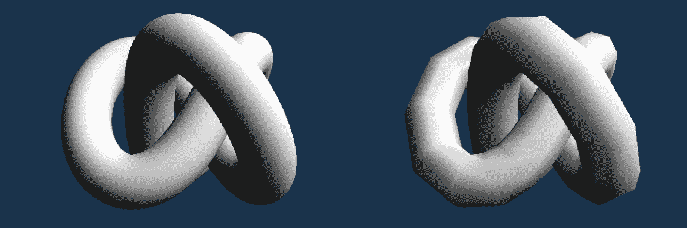

# 参见

+   在第二章，*图像展示*，查看以下配方：

    +   *使用 WSI 扩展启用创建 Vulkan 实例*

    +   *使用 WSI 扩展启用创建逻辑设备*

    +   *使用 R8G8B8A8 格式和存在 MAILBOX 显示模式创建交换链*

+   在第三章，*命令缓冲区和同步*，配方*开始命令缓冲区录制操作*

+   在第八章，*图形和计算管线*，配方*创建图形管线*

+   在第九章，*命令录制与绘制*，配方*通过增加单独渲染的帧数来提高性能*

+   在第十章，*辅助配方*，配方*从 OBJ 文件加载 3D 模型*

+   本章中的以下配方：

    +   *使用片段镜面反射光照渲染几何体*

    +   *渲染法线贴图几何体*

# 使用片段镜面反射光照渲染几何体

镜面反射光照使我们能够在模型表面添加明亮的亮点或反射。这样渲染的几何体看起来更亮、更光滑。

使用此配方生成的图像示例如下：

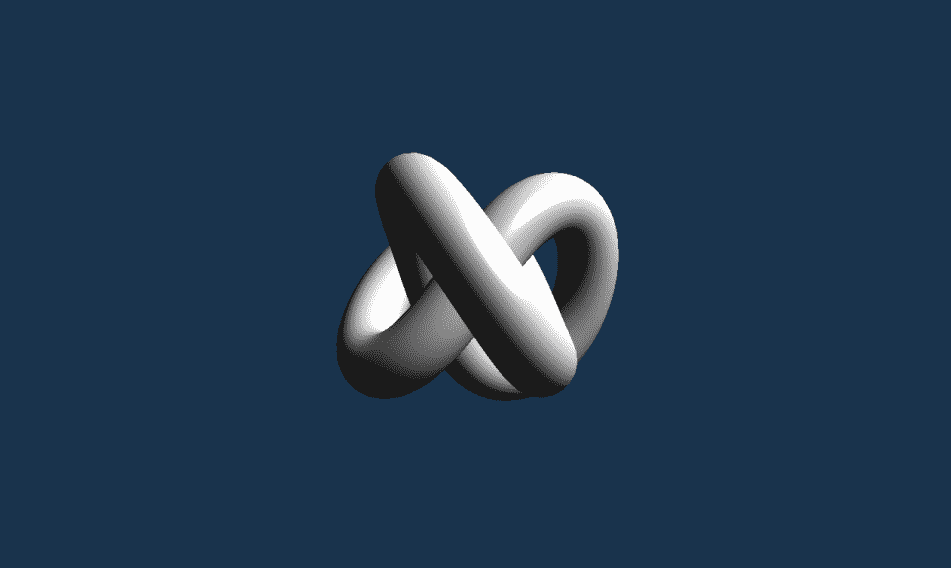

# 准备工作

描述表面光照方式最常用的算法是**Blinn-Phong**模型。它是一个经验模型，虽然不是物理上正确的，但在渲染几何体简化的情况下给出的结果更可信。因此，它非常适合 3D 实时图形。

**Blinn-Phong**模型描述了从给定表面发出的光作为四个分量的总和：

+   **发射**：表面发出的光量

+   : 在整个场景中散射的反射光量，没有明显的光源（用于照亮几何体）

环境光：在整个场景中散射的反射光量，没有明显的光源（用于照亮几何体）漫反射：描述粗糙表面反射的光（基于朗伯光照方程）

+   **镜面反射**：描述光滑表面反射的光

上述每个组件可能具有不同的颜色，这描述了表面材料（漫反射颜色通常来自纹理）。每个光源也可以为每个组件（除了发射组件）使用单独的颜色表示。我们可以将其解释为给定光源对场景中可用环境光的影响程度，光源发出的漫反射光量等等。当然，我们可以修改前面的算法以调整它以满足我们的需求。这样我们可以得到易于计算的各种结果。

在本配方中，我们将重点关注漫反射光照和镜面反射。前者在*使用顶点漫反射光照渲染几何体*配方中描述。后者通过表面法线向量和半向量的点积来计算。半向量是一个位于视向量（从被照点到观察者）和光向量（从被照点到光源）之间的向量：

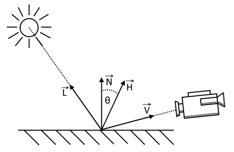

计算出的点积值负责在光滑表面上创建闪亮的光反射。由于以这种方式照亮的区域可能太大，因此计算出的值被提升到幂。幂值越高，物体表面的光反射就越小、越集中。在着色器中，这些计算如下：

```cpp
pow( dot( half_vector, normal_vector ), shinniness );

```

法线向量通常沿着几何形状加载并由应用程序提供。半向量按以下方式计算：

```cpp
vec3 view_vector = normalize( eye_position.xyz - vert_position.xyz ); 
vec3 light_vector = normalize( light_position.xyz - vert_position.xyz ); 
vec3 half_vector = normalize( view_vector + light_vector );

```

为了获得正确的结果，所有向量都必须归一化。当然，当表面未照亮（或未面向光源）时，镜面高光是不可见的。因此，只有在漫反射分量大于`0`时才应计算它们。

# 如何做到这一点...

1.  按照所述的*使用顶点漫反射光照渲染几何体*配方准备 Vulkan 资源。

1.  使用准备好的描述符集布局创建一个仅包含统一缓冲区和由片段着色器阶段访问的单个推送常量范围（从 0^(th)偏移开始，大小为`4 * sizeof( float )`）的管线布局（请参阅第八章中的*创建管线布局*配方，*图形和计算管线*）。

1.  使用从以下 GLSL 代码生成的 SPIR-V 汇编创建一个用于顶点着色器阶段的着色器模块（请参阅第七章中的*将 GLSL 着色器转换为 SPIR-V 汇编*配方，*着色器*，以及第八章中的*创建着色器模块*配方，*图形和计算管线*）：

```cpp
      #version 450 
      layout( location = 0 ) in vec4 app_position; 
      layout( location = 1 ) in vec3 app_normal; 
      layout( set = 0, binding = 0 ) uniform UniformBuffer { 
        mat4 ModelViewMatrix; 
        mat4 ProjectionMatrix; 
      }; 
      layout( location = 0 ) out vec3 vert_position; 
      layout( location = 1 ) out vec3 vert_normal; 
      void main() { 
        vec4 position = ModelViewMatrix * app_position; 

        vert_position = position.xyz; 
        vert_normal = mat3( ModelViewMatrix ) * app_normal; 
        gl_Position = ProjectionMatrix * position; 
      }

```

1.  使用从以下 GLSL 代码生成的 SPIR-V 汇编创建一个用于片段着色器阶段的着色器模块：

```cpp
      #version 450 
      layout( location = 0 ) in vec3 vert_position; 
      layout( location = 1 ) in vec3 vert_normal; 
      layout( push_constant ) uniform LightParameters { 
        vec4 Position; 
      } Light; 
      layout( location = 0 ) out vec4 frag_color; 
      void main() { 
        vec3 normal_vector = normalize( vert_normal ); 
        vec3 light_vector = normalize( Light.Position.xyz - 
      vert_position ); 
        float diffuse_term = max( 0.0, dot( normal_vector, light_vector       ) ); 

        frag_color = vec4( diffuse_term + 0.1 ); 
        if( diffuse_term > 0.0 ) { 
          vec3 view_vector = normalize( vec3( 0.0, 0.0, 0.0 ) - 
      vert_position.xyz ); 
          vec3 half_vector = normalize( view_vector + light_vector ); 
          float shinniness = 60.0; 
          float specular_term = pow( dot( half_vector, normal_vector ),       shinniness ); 
          frag_color += vec4( specular_term ); 
        } 
      }

```

1.  使用顶点和片段着色器指定管道着色器阶段，两者都使用各自着色器模块中的主函数（参考第八章，*图形和计算管道*中的*指定管道着色器阶段*配方）。

1.  使用之前介绍的管道布局和着色器阶段创建一个图形管道。管道的其他参数与在*使用顶点漫反射光照渲染几何体*配方中展示的相同。

1.  准备一个每帧执行的命令缓冲区记录（或渲染）函数。为此，我们需要开始命令缓冲区记录，将数据从阶段缓冲区复制到统一缓冲区（如果需要），设置一个图像内存屏障以转移从交换链获取的图像的所有权，开始渲染通道，动态设置视口和剪裁测试状态，绑定顶点缓冲区、描述符集和图形管道（参考*使用顶点漫反射光照渲染几何体*配方）。

1.  准备光源的位置，并通过推送常量将其提供给着色器。为此操作，提供管道布局，一个`VK_SHADER_STAGE_FRAGMENT_BIT`着色器阶段，`0`偏移量，大小为`sizeof( float ) * 4`，以及指向数据的指针，其中存储了光源的位置（参考第九章，*命令记录和绘制*中的*通过推送常量向着色器提供数据*配方）。

1.  通过记录模型绘制操作、结束渲染通道、为交换链图像设置另一个图像内存屏障以及结束命令缓冲区来最终化命令缓冲区。

1.  将命令缓冲区提交到图形队列，并呈现一个图像（参考第九章，*命令记录和绘制*中的*准备单个动画帧*和*通过增加单独渲染帧的数量来提高性能*配方）。

# 它是如何工作的...

整个源代码几乎与*使用顶点漫反射光照渲染几何体*配方中展示的相同。最重要的区别在于顶点和片段着色器，它们根据应用程序提供的数据执行光照计算。这次光照向量不是硬编码在着色器中的。相反，它使用应用程序提供的数据进行计算。位置和法向量自动作为顶点属性读取。使用推送常量读取光源的位置，因此当我们创建管道布局时需要包含推送常量范围：

```cpp
std::vector<VkPushConstantRange> push_constant_ranges = { 
  { 
    VK_SHADER_STAGE_FRAGMENT_BIT,   // VkShaderStageFlags     stageFlags 
    0,                              // uint32_t               offset 
    sizeof( float ) * 4             // uint32_t               size 
  } 
}; 
InitVkDestroyer( LogicalDevice, PipelineLayout ); 
if( !CreatePipelineLayout( *LogicalDevice, { *DescriptorSetLayout }, push_constant_ranges, *PipelineLayout ) ) { 
  return false; 
}

```

在命令缓冲区记录操作期间提供推送常量数据：

```cpp
BindVertexBuffers( command_buffer, 0, { { *VertexBuffer, 0 } } ); 
BindDescriptorSets( command_buffer, VK_PIPELINE_BIND_POINT_GRAPHICS, *PipelineLayout, 0, DescriptorSets, {} ); 
BindPipelineObject( command_buffer, VK_PIPELINE_BIND_POINT_GRAPHICS, *Pipeline ); 
std::array<float, 4> light_position = { 5.0f, 5.0f, 0.0f, 0.0f }; 
ProvideDataToShadersThroughPushConstants( command_buffer, *PipelineLayout, VK_SHADER_STAGE_FRAGMENT_BIT, 0, sizeof( float ) * 4, &light_position[0] );

```

通过推送常量，我们提供了一个光源的位置。这样我们的着色器就变得更加通用，因为我们可以直接在着色器中计算光照向量并将其用于光照计算。

在以下图像中，我们可以看到使用在片段着色器内计算出的漫反射和镜面光照渲染几何体的结果。在片段着色器中执行的光照计算结果比在顶点着色器中执行相同计算的结果要好得多。即使几何体相当简单，光照看起来也很不错。但当然，这伴随着性能的降低。

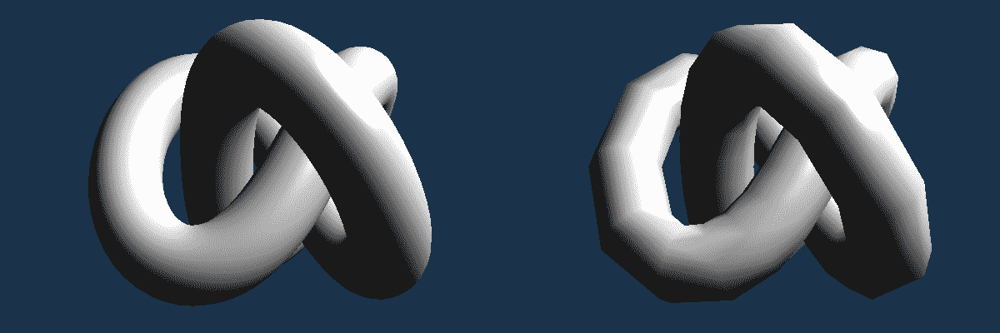

# 参见

+   在第七章，*着色器*中，食谱*将 GLSL 着色器转换为 SPIR-V 汇编*

+   在第八章，*图形和计算管线*中，查看以下食谱：

    +   *创建着色器模块*

    +   *指定管线着色器阶段*

    +   *创建管线布局*

+   在第九章，*命令记录与绘制*中，查看以下食谱：

    +   *通过推送常量向着色器提供数据*

+   本章中的以下食谱：

    +   *使用顶点漫反射光照渲染几何体*

# 渲染法线贴图几何体

法线贴图是一种技术，允许我们在不增加模型几何复杂性的情况下增加模型表面的细节。使用这种技术，与顶点关联的法线向量在光照计算期间不被使用。它们被从图像（纹理）中读取的法线向量所替代。这样，模型的形状保持不变，因此我们不需要额外的处理能力来转换顶点。然而，光照质量要好得多，并且仅取决于法线贴图图像的质量，而不是模型复杂性。

使用此食谱生成的图像示例如下：

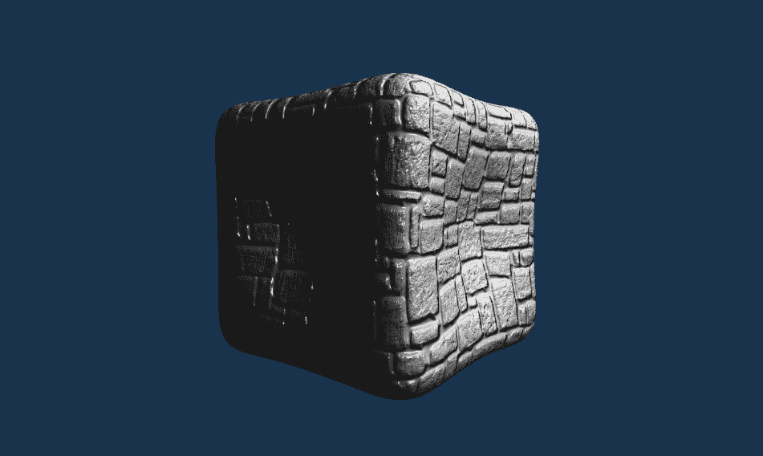

# 准备工作

法线贴图是一种图像，其中存储了从高度详细几何体获取的法线向量。它用于模拟简单（低多边形）几何体上的大量表面细节。

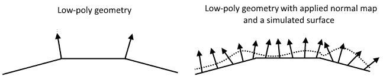

对于简单的光照计算，我们只需要加载位置和法向量，但法线贴图需要我们为给定的 3D 模型加载（或生成）更多的数据。除了上述属性外，我们还需要纹理坐标，这样我们就可以在片段着色器中采样法线贴图，还需要两个额外的向量：切线和副切线。法向量在给定点的表面上垂直于表面，并指向远离表面的方向。切线和副切线向量与表面相切。切线向量指向物体表面的方向，其中纹理图像水平前进，从左到右（纹理坐标的`s`分量增加）。副切线指向物体表面的方向，其中纹理图像垂直前进，从上到下（纹理坐标的`t`分量减少）。此外，所有三个向量——法线、切线和副切线——应相互垂直（允许有小的偏差）并且长度等于`1.0`。

法线、切线和副切线向量不是直接用于光照计算的。相反，它们形成一个旋转矩阵，可以用来将向量从纹理（或切线）空间转换为局部模型空间，反之亦然。这样我们就不需要创建一个只能应用于特定模型的法线向量纹理，而可以准备一个通用的法线贴图，并用它来处理任意几何体。使用所谓的 TBN 矩阵，我们可以从纹理中加载法线向量，并用于在更方便的坐标系中执行的光照计算。

# 如何实现...

1.  按照第十章*使用顶点漫反射光照渲染几何体*食谱中描述的方式准备 Vulkan 资源。

1.  从文件中加载具有法线贴图的纹理数据（参考第十章的*从文件加载纹理数据*食谱，*辅助食谱*）。

1.  创建一个具有颜色方面和格式（例如`VK_FORMAT_R8G8B8A8_UNORM`）的二维组合图像采样器，并支持`VK_IMAGE_USAGE_SAMPLED_BIT`和`VK_IMAGE_USAGE_TRANSFER_DST_BIT`使用（参考第五章的*创建组合图像采样器*食谱，*描述符集*）。

1.  使用阶段缓冲区将加载的法线图数据复制到创建的图像中（参考第四章的*使用阶段缓冲区更新绑定到设备本地内存的图像*食谱，*资源和内存*）。

1.  从文件中加载 3D 模型。除了顶点位置和法向量外，还需要加载纹理坐标，并加载或生成切线和副切线向量。创建一个（顶点）缓冲区，并使用阶段缓冲区将加载的模型数据复制到缓冲区的内存中（参考第十章的*从 OBJ 文件加载 3D 模型*，*辅助食谱*）。

1.  创建一个描述符集布局，其中包含一个由顶点着色器在 0^(th)绑定处访问的统一缓冲区，以及一个由片段着色器在 1^(st)绑定处访问的联合图像采样器（参考第五章中*创建描述符集布局*的配方，*描述符集*）。

1.  从创建的描述符池中分配一个统一缓冲区描述符和一个联合图像采样器描述符（参考第五章中*创建描述符池*的配方，*描述符集*）。

1.  使用包含一个统一缓冲区和一个联合图像采样器的描述符集布局从创建的池中分配一个描述符集（参考第五章中*分配描述符集*的配方，*描述符集*）。

1.  使用在 0^(th)绑定处访问的统一缓冲区和在 1^(st)绑定处访问的创建的联合图像采样器（具有正常图数据）更新描述符集。提供`VK_IMAGE_LAYOUT_SHADER_READ_ONLY_OPTIMAL`作为图像的布局（参考第五章中*更新描述符集*的配方，*描述符集*）。

1.  使用准备好的描述符集布局创建一个管线布局，该布局还指定了一个由片段着色器阶段访问的单个推送常量范围，起始位置为第 0 个偏移量，大小为`4 * sizeof( float )`（参考第八章中*创建管线布局*的配方，*图形和计算管线*）。

1.  使用从以下 GLSL 代码生成的 SPIR-V 汇编创建一个用于顶点着色器阶段的着色器模块（参考第七章中*将 GLSL 着色器转换为 SPIR-V 汇编*的配方，以及第八章中*创建着色器模块*的配方，*图形和计算管线*）：

```cpp
      #version 450 
      layout( location = 0 ) in vec4 app_position; 
      layout( location = 1 ) in vec3 app_normal; 
      layout( location = 2 ) in vec2 app_texcoord; 
      layout( location = 3 ) in vec3 app_tangent; 
      layout( location = 4 ) in vec3 app_bitangent; 
      layout( set = 0, binding = 0 ) uniform UniformBuffer { 
        mat4 ModelViewMatrix; 
        mat4 ProjectionMatrix; 
      }; 
      layout( location = 0 ) out vec3 vert_position; 
      layout( location = 1 ) out vec2 vert_texcoord; 
      layout( location = 2 ) out vec3 vert_normal; 
      layout( location = 3 ) out vec3 vert_tanget; 
      layout( location = 4 ) out vec3 vert_bitanget; 
      void main() { 
        vec4 position = ModelViewMatrix * app_position; 
        gl_Position = ProjectionMatrix * position; 

        vert_position = position.xyz; 
        vert_texcoord = app_texcoord; 
        vert_normal = mat3( ModelViewMatrix ) * app_normal; 
        vert_tanget = mat3( ModelViewMatrix ) * app_tangent; 
        vert_bitanget = mat3( ModelViewMatrix ) * app_bitangent; 
      }

```

1.  使用从以下 GLSL 代码生成的 SPIR-V 汇编创建一个用于片段着色器阶段的着色器模块：

```cpp
      #version 450 
      layout( location = 0 ) in vec3 vert_position; 
      layout( location = 1 ) in vec2 vert_texcoord; 
      layout( location = 2 ) in vec3 vert_normal; 
      layout( location = 3 ) in vec3 vert_tanget; 
      layout( location = 4 ) in vec3 vert_bitanget; 
      layout( set = 0, binding = 1 ) uniform sampler2D ImageSampler; 
      layout( push_constant ) uniform LightParameters { 
        vec4 Position; 
      } Light; 
      layout( location = 0 ) out vec4 frag_color; 
      void main() { 
        vec3 normal = 2 * texture( ImageSampler, vert_texcoord ).rgb - 
      1.0; 
        vec3 normal_vector = normalize( mat3( vert_tanget, 
      vert_bitanget, vert_normal) * normal ); 
        vec3 light_vector = normalize( Light.Position.xyz - 
      vert_position ); 
        float diffuse_term = max( 0.0, dot( normal_vector, light_vector 
      ) ) * max( 0.0, dot( vert_normal, light_vector ) ); 
        frag_color = vec4( diffuse_term + 0.1 ); 
        if( diffuse_term > 0.0 ) { 
          vec3 half_vector = normalize(normalize( -vert_position.xyz  ) 
      + light_vector); 
          float specular_term = pow( dot( half_vector, normal_vector ), 
      60.0 ); 
          frag_color += vec4( specular_term ); 
        } 
      }

```

1.  指定使用顶点和片段着色器的管线着色器阶段，两者都使用各自着色器模块中的`main`函数（参考第八章中*指定管线着色器阶段*的配方，*图形和计算管线*）。

1.  指定一个具有五个属性的管线顶点输入状态，这些属性从相同的 0^(th)绑定读取。绑定应使用每个顶点读取的数据和等于`14 * sizeof( float )`的步长创建（参考第八章中*指定管线顶点输入状态*的配方，*图形和计算管线*）。第一个属性应具有以下参数：

    +   `location`的值为`0`

    +   `binding`的值为`0`

    +   `format`的值为`VK_FORMAT_R32G32B32_SFLOAT`

    +   `offset`的值为`0`

1.  第二个属性应定义为以下内容：

    +   `location`的值为`1`

    +   `binding` 的值为 `0`

    +   `format` 的值为 `VK_FORMAT_R32G32B32_SFLOAT`

    +   `offset` 的值为 `3 * sizeof( float )`

1.  第三个属性应具有以下定义：

    +   `location` 的值为 `2`

    +   `binding` 的值为 `0`

    +   `format` 的值为 `VK_FORMAT_R32G32_SFLOAT`

    +   `offset` 的值为 `6 * sizeof( float )`

1.  第四个属性应指定如下：

    +   `location` 的值为 `3`

    +   `binding` 的值为 `0`

    +   `format` 的值为 `VK_FORMAT_R32G32B32_SFLOAT`

    +   `offset` 的值为 `8 * sizeof( float )`

1.  第五个属性应使用以下值：

    +   `location` 的值为 `4`

    +   `binding` 的值为 `0`

    +   `format` 的值为 `VK_FORMAT_R32G32B32_SFLOAT`

    +   `offset` 的值为 `11 * sizeof( float )`

1.  在动画的每一帧中，记录一个命令缓冲区，在其中将数据从阶段缓冲区复制到统一缓冲区，开始渲染过程，动态设置视口和裁剪测试状态，绑定顶点缓冲区、描述符集和图形管道（参考 *使用顶点漫反射光照渲染几何体菜谱*）。

1.  准备光源的位置，并通过推送常量将其提供给着色器。为此操作，提供管道布局，一个 `VK_SHADER_STAGE_FRAGMENT_BIT` 着色器阶段，`0` 偏移量，大小为 `sizeof( float ) * 4`，以及指向数据的指针，其中存储了光源的位置（参考第九章 *通过推送常量向着色器提供数据* 菜谱，*命令记录和绘制*)。

1.  绘制模型，将所需的其他操作记录到命令缓冲区中，将命令缓冲区提交到图形队列，并呈现图像（参考第九章 *准备单个动画帧和通过增加单独渲染帧的数量来提高性能* 菜谱，*命令记录和绘制*)。

# 它是如何工作的...

要在我们的应用程序中使用法线贴图，我们需要准备一个存储法向量的图像。我们必须加载图像的内容，创建一个图像，并将数据复制到图像的内存中。我们还需要创建一个采样器，它与图像一起将形成一个组合图像采样器：

```cpp
int width = 1; 
int height = 1; 
std::vector<unsigned char> image_data; 
if( !LoadTextureDataFromFile( "Data/Textures/normal_map.png", 4, image_data, &width, &height ) ) { 
  return false; 
} 
InitVkDestroyer( LogicalDevice, Sampler ); 
InitVkDestroyer( LogicalDevice, Image ); 
InitVkDestroyer( LogicalDevice, ImageMemory ); 
InitVkDestroyer( LogicalDevice, ImageView ); 
if( !CreateCombinedImageSampler( PhysicalDevice, *LogicalDevice, VK_IMAGE_TYPE_2D, VK_FORMAT_R8G8B8A8_UNORM, { (uint32_t)width, (uint32_t)height, 1 }, 
  1, 1, VK_IMAGE_USAGE_SAMPLED_BIT | VK_IMAGE_USAGE_TRANSFER_DST_BIT, VK_IMAGE_VIEW_TYPE_2D, VK_IMAGE_ASPECT_COLOR_BIT, VK_FILTER_LINEAR, 
  VK_FILTER_LINEAR, VK_SAMPLER_MIPMAP_MODE_NEAREST, VK_SAMPLER_ADDRESS_MODE_REPEAT, VK_SAMPLER_ADDRESS_MODE_REPEAT, 
  VK_SAMPLER_ADDRESS_MODE_REPEAT, 0.0f, false, 1.0f, false, VK_COMPARE_OP_ALWAYS, 0.0f, 1.0f, VK_BORDER_COLOR_FLOAT_OPAQUE_BLACK, 
  false, *Sampler, *Image, *ImageMemory, *ImageView ) ) { 
  return false; 
} 
VkImageSubresourceLayers image_subresource_layer = { 
  VK_IMAGE_ASPECT_COLOR_BIT,    // VkImageAspectFlags     aspectMask 
  0,                            // uint32_t               mipLevel 
  0,                            // uint32_t               baseArrayLayer 
  1                             // uint32_t               layerCount 
}; 
if( !UseStagingBufferToUpdateImageWithDeviceLocalMemoryBound( PhysicalDevice, *LogicalDevice, static_cast<VkDeviceSize>(image_data.size()), 
  &image_data[0], *Image, image_subresource_layer, { 0, 0, 0 }, { (uint32_t)width, (uint32_t)height, 1 }, VK_IMAGE_LAYOUT_UNDEFINED, 
  VK_IMAGE_LAYOUT_SHADER_READ_ONLY_OPTIMAL, 0, VK_ACCESS_SHADER_READ_BIT, VK_IMAGE_ASPECT_COLOR_BIT, VK_PIPELINE_STAGE_TOP_OF_PIPE_BIT, 
  VK_PIPELINE_STAGE_FRAGMENT_SHADER_BIT, GraphicsQueue.Handle, FrameResources.front().CommandBuffer, {} ) ) { 
  return false; 
}

```

之后，我们需要加载一个 3D 模型。我们需要加载位置、法向量以及纹理坐标。切线向量和双切线向量也必须加载，但由于 `.obj` 格式无法存储这么多不同的属性，我们必须生成它们（这是在 `Load3DModelFromObjFile()` 内部执行的）：

```cpp
uint32_t vertex_stride = 0; 
if( !Load3DModelFromObjFile( "Data/Models/ice.obj", true, true, true, true, Model, &vertex_stride ) ) { 
  return false; 
}

```

现在我们需要修改在 *使用顶点漫反射光照渲染几何体* 菜谱中描述的描述符集。首先，我们开始创建一个合适的布局：

```cpp
std::vector<VkDescriptorSetLayoutBinding> descriptor_set_layout_bindings = { 
  { 
    0, 
    VK_DESCRIPTOR_TYPE_UNIFORM_BUFFER, 
    1, 
    VK_SHADER_STAGE_VERTEX_BIT, 
    nullptr 
  }, 
  { 
    1, 
    VK_DESCRIPTOR_TYPE_COMBINED_IMAGE_SAMPLER, 
    1, 
    VK_SHADER_STAGE_FRAGMENT_BIT, 
    nullptr 
  } 
}; 
InitVkDestroyer( LogicalDevice, DescriptorSetLayout ); 
if( !CreateDescriptorSetLayout( *LogicalDevice, descriptor_set_layout_bindings, *DescriptorSetLayout ) ) { 
  return false; 
}

```

接下来，需要一个描述符池。从它分配一个描述符集：

```cpp
std::vector<VkDescriptorPoolSize> descriptor_pool_sizes = { 
  { 
    VK_DESCRIPTOR_TYPE_UNIFORM_BUFFER, 
    1 
  }, 
  { 
    VK_DESCRIPTOR_TYPE_COMBINED_IMAGE_SAMPLER, 
    1 
  } 
}; 
InitVkDestroyer( LogicalDevice, DescriptorPool ); 
if( !CreateDescriptorPool( *LogicalDevice, false, 1, descriptor_pool_sizes, *DescriptorPool ) ) { 
  return false; 
} 
if( !AllocateDescriptorSets( *LogicalDevice, *DescriptorPool, { *DescriptorSetLayout }, DescriptorSets ) ) { 
  return false; 
}

```

当描述符集被分配时，我们可以使用统一缓冲区和组合图像采样器的句柄来更新它：

```cpp
BufferDescriptorInfo buffer_descriptor_update = { 
  DescriptorSets[0], 
  0, 
  0, 
  VK_DESCRIPTOR_TYPE_UNIFORM_BUFFER, 
  { 
    { 
      *UniformBuffer, 
      0, 
      VK_WHOLE_SIZE 
    } 
  } 
}; 
ImageDescriptorInfo image_descriptor_update = { 
  DescriptorSets[0], 
  1, 
  0, 
  VK_DESCRIPTOR_TYPE_COMBINED_IMAGE_SAMPLER, 
  { 
    { 
      *Sampler, 
      *ImageView, 
      VK_IMAGE_LAYOUT_SHADER_READ_ONLY_OPTIMAL 
    } 
  } 
}; 
UpdateDescriptorSets( *LogicalDevice, { image_descriptor_update }, { buffer_descriptor_update }, {}, {} );

```

这次我们有两个而不是五个顶点属性，因此我们还需要修改顶点输入状态：

```cpp
std::vector<VkVertexInputBindingDescription> vertex_input_binding_descriptions = { 
  { 
    0, 
    vertex_stride, 
    VK_VERTEX_INPUT_RATE_VERTEX 
  } 
}; 
std::vector<VkVertexInputAttributeDescription> vertex_attribute_descriptions = { 
  { 
    0, 
    0, 
    VK_FORMAT_R32G32B32_SFLOAT, 
    0 
  }, 
  { 
    1, 
    0, 
    VK_FORMAT_R32G32B32_SFLOAT, 
    3 * sizeof( float ) 
  }, 
  { 
    2, 
    0, 
    VK_FORMAT_R32G32_SFLOAT, 
    6 * sizeof( float ) 
  }, 
  { 
    3, 
    0, 
    VK_FORMAT_R32G32B32_SFLOAT, 
    8 * sizeof( float ) 
  }, 
  { 
    4, 
    0, 
    VK_FORMAT_R32G32B32_SFLOAT, 
    11 * sizeof( float ) 
  } 
}; 
VkPipelineVertexInputStateCreateInfo vertex_input_state_create_info; 
SpecifyPipelineVertexInputState( vertex_input_binding_descriptions, vertex_attribute_descriptions, vertex_input_state_create_info );

```

上述属性在顶点着色器中读取，使用模型视图和投影矩阵将顶点位置转换到裁剪空间。此外，视图空间位置和未修改的纹理坐标被传递到片段着色器。法线、切线和二切向量也被传递到片段着色器，但它们首先使用模型视图矩阵转换到视图空间：

```cpp
vec4 position = ModelViewMatrix * app_position; 
gl_Position = ProjectionMatrix * position; 

vert_position = position.xyz; 
vert_texcoord = app_texcoord; 
vert_normal = mat3( ModelViewMatrix ) * app_normal; 
vert_tangent = mat3( ModelViewMatrix ) * app_tangent; 
vert_bitangent = mat3( ModelViewMatrix ) * app_bitangent;

```

从正常映射的角度来看，最重要的部分发生在片段着色器中。它首先从纹理中读取法线向量。通常，纹理存储的值在 `0.0` - `1.0` 范围内（除非我们使用有符号归一化纹理格式：`SNORM`）。然而，法线向量的所有分量可能具有 `-1.0` - `1.0` 范围内的值，因此我们需要像这样扩展加载的法线向量：

```cpp
vec3 normal = 2 * texture( ImageSampler, vert_texcoord ).rgb - 1.0;

```

片段着色器以与*使用片段镜面照明渲染几何体*食谱中描述的相同方式计算漫反射和镜面照明。它只是使用从纹理中加载的法线向量代替从顶点着色器提供的法线向量。它还需要执行一个额外的操作：所有向量（光和视图）都在视图空间中，但存储在正常映射中的法线向量在切线空间中，因此它也需要转换到相同的视图空间。这是通过使用由法线、切线和二切向量形成的 TBN 矩阵来完成的。它们由顶点着色器提供。因为顶点着色器通过乘以模型视图矩阵将它们从模型空间转换到视图空间，所以创建的 TBN 矩阵将法线向量直接从切线空间转换到视图空间：

```cpp
vec3 normal_vector = normalize( mat3( vert_tanget, vert_bitanget, vert_normal) * normal );

```

`mat3()` 是一个从三个分量向量创建 3x3 矩阵的构造函数。使用这样的矩阵，我们可以执行旋转和缩放，但不能平移。由于我们想要变换方向（单位长度向量），这正是这种情况所需要的。

正常映射可以在非常简单的（低多边形）几何体上为我们提供令人印象深刻的照明效果。在下面的图片中，左侧我们可以看到带有许多多边形的正常映射几何体；而右侧，相似的几何体以更少的顶点呈现。

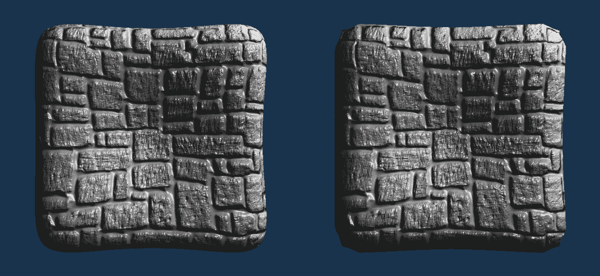

# 参见

+   在第四章的*资源和内存*中，查看*使用阶段缓冲区更新绑定到设备本地内存的图像*的食谱

+   在第五章的*描述符集*中，查看*创建组合图像采样器*的食谱

+   在第十章的*辅助食谱*中，查看以下食谱：

    +   *从文件中加载纹理数据*

    +   *从 OBJ 文件中加载 3D 模型*

+   此外，查看同一章节中的以下食谱：

    +   *使用顶点漫反射照明渲染几何体*

    +   *使用片段镜面照明渲染几何体*

# 使用立方体贴图绘制反射和折射几何体

在现实生活中，透明物体既会传播光线，也会反射光线。如果从高角度观察物体的表面，我们会看到更多的反射光。如果更直接地观察物体的表面，我们会看到更多的光线通过物体传播。模拟这种效果可能会产生非常逼真的结果。在本配方中，我们将了解如何渲染既具有折射性又具有反射性的几何体。

使用此配方生成的图像示例如下：


# 准备中

立方体贴图是覆盖立方体六个面的图像纹理。它们通常存储从给定位置观察到的场景视图。立方体贴图最常见的使用是天空盒。当我们要在给定模型的表面上映射反射时，它们也非常方便。另一个常见用途是模拟透明物体（即玻璃制成的物体），这些物体可以折射光线。非常低分辨率的立方体贴图（例如 4x4 像素）甚至可以直接用于环境光照。

立方体贴图包含六个二维图像。它们都是正方形，并且大小相同。在 Vulkan 中，使用具有六个数组层的 2D 图像创建立方体贴图，为这些数组层创建一个立方体贴图图像视图。通过它，六个数组层被解释为以下顺序的立方体贴图面：`+X`、`-X`、`+Y`、`-Y`、`+Z`、`-Z`。


图片由 Emil Persson 提供([h t t p ://w w w . h u m u s . n a m e](http://www.humus.name))

立方体贴图的六个面对应于六个方向，就像我们站在一个位置，转身，并拍摄周围的世界的照片一样。使用这种纹理，我们可以模拟世界从物体表面反射或通过物体传播。然而，当物体移动得太远，远离纹理创建的位置时，这种幻觉就会破裂，直到我们应用一个新的、适用于新位置的纹理。

# 如何操作...

1.  按照*使用顶点漫反射光照渲染几何体*配方中描述的步骤准备 Vulkan 资源。

1.  从文件中加载包含顶点位置和法向量的 3D 模型数据。此模型将显示为反射和传播环境的模型（参考第十章的*从 OBJ 文件加载 3D 模型*配方，*辅助配方*）。

1.  使用内存对象创建一个（顶点）缓冲区，并使用它存储我们模型的顶点数据（参考第四章的*创建缓冲区、分配和绑定内存对象到缓冲区*以及*使用阶段缓冲区更新绑定到设备本地内存的缓冲区*配方，*资源和内存*）。

1.  加载包含立方体顶点位置的 3D 模型。此模型将用于显示被反射的环境（参考第十二章的*绘制天空盒*配方，*高级渲染技术*）。

1.  创建一个缓冲区，以及一个与其绑定的内存对象，以存储环境的顶点数据（天空盒）。

1.  创建一个具有六个数组层和一个立方体贴图视图的两维组合图像采样器。它必须支持`VK_IMAGE_USAGE_SAMPLED_BIT`和`VK_IMAGE_USAGE_TRANSFER_DST_BIT`使用。必须对所有寻址维度使用`VK_SAMPLER_ADDRESS_MODE_CLAMP_TO_EDGE`采样器寻址模式（参考第五章中的*创建组合图像采样器*配方，*描述符集*）。

1.  从文件中加载立方体贴图的六个面的纹理数据（参考第十章中的*从文件加载纹理数据*配方，*辅助配方*）。

1.  将每个加载的纹理上传到创建的组合图像采样器的单独数组层。纹理应按以下顺序上传：正负 X、正负 Y、正负 Z（参考第四章中的*使用阶段缓冲区更新具有设备本地内存绑定的图像*配方，*资源和内存*）。

1.  创建一个包含两个描述符资源的描述符集布局：一个在顶点着色器中以 0^(th)绑定访问的统一缓冲区，以及一个在片段着色器中以 1^(st)绑定访问的组合图像采样器（参考第五章中的*创建描述符集布局*配方，*描述符集*）。

1.  创建一个描述符池，从中可以分配一个统一缓冲区描述符和一个组合图像采样器描述符（参考第五章中的*创建描述符池*配方，*描述符集*）。

1.  使用描述符集布局和统一缓冲区以及组合图像采样器资源从创建的池中分配一个描述符集（参考第五章中的*分配描述符集*配方，*描述符集*）。

1.  使用在 0^(th)绑定访问的统一缓冲区和在 1^(st)绑定访问的已创建的组合图像采样器（立方体贴图）更新（填充）描述符集。将`VK_IMAGE_LAYOUT_SHADER_READ_ONLY_OPTIMAL`值作为立方体贴图的布局（参考第五章中的*更新描述符集*配方，*描述符集*）。

1.  使用准备好的描述符集布局创建一个管线布局，该布局还指定了一个由片段着色器阶段访问的单个推送常量范围，从 0^(th)偏移开始，大小为`4 * sizeof( float )`（参考第八章中的*创建管线布局*配方，*图形和计算管线*）。

1.  创建一个用于绘制反射和折射模型的图形管道。首先，使用以下 GLSL 代码生成的 SPIR-V 汇编创建一个用于顶点着色器阶段的着色器模块（参考第七章 *将 GLSL 着色器转换为 SPIR-V 汇编* 的配方，*着色器* 以及第八章 *图形和计算管道* 中的 *创建着色器模块* 配方）：

```cpp
      #version 450 
      layout( location = 0 ) in vec4 app_position; 
      layout( location = 1 ) in vec3 app_normal; 
      layout( set = 0, binding = 0 ) uniform UniformBuffer { 
        mat4 ModelViewMatrix; 
        mat4 ProjectionMatrix; 
      }; 
      layout( location = 0 ) out vec3 vert_position; 
      layout( location = 1 ) out vec3 vert_normal; 
      void main() { 
        vert_position = app_position.xyz; 
        vert_normal = app_normal; 

        gl_Position = ProjectionMatrix * ModelViewMatrix * 
      app_position; 
      }

```

1.  使用以下 GLSL 代码生成的 SPIR-V 汇编创建一个用于片段着色器阶段的着色器模块：

```cpp
      #version 450 
      layout( location = 0 ) in vec3 vert_position; 
      layout( location = 1 ) in vec3 vert_normal; 
      layout( set = 0, binding = 1 ) uniform samplerCube Cubemap; 
      layout( push_constant ) uniform LightParameters { 
        vec4 Position; 
      } Camera; 
      layout( location = 0 ) out vec4 frag_color; 
      void main() { 
        vec3 view_vector = vert_position - Camera.Position.xyz; 

        float angle = smoothstep( 0.3, 0.7, dot( normalize( -
      view_vector ), vert_normal ) ); 

        vec3 reflect_vector = reflect( view_vector, vert_normal ); 
        vec4 reflect_color = texture( Cubemap, reflect_vector ); 

        vec3 refrac_vector = refract( view_vector, vert_normal, 0.3 ); 
        vec4 refract_color = texture( Cubemap, refrac_vector ); 

        frag_color = mix( reflect_color, refract_color, angle ); 
      }

```

1.  使用顶点和片段着色器指定管道着色器阶段，两者都使用各自着色器模块中的 `main` 函数（参考第八章 *图形和计算管道* 中的 *指定管道着色器阶段* 配方）。

1.  使用前面定义的管道着色器阶段创建一个用于绘制模型的图形管道，其余管道参数的设置方式与 *使用顶点漫反射光照渲染几何体* 配方中的方式相同。

1.  创建一个用于绘制被反射的环境——天空盒的图形管道（参考第十二章 *高级渲染技术* 中的 *绘制天空盒* 配方）。

1.  要渲染一帧，在每个渲染循环的迭代中记录一个命令缓冲区。在命令缓冲区中，将数据从阶段缓冲区复制到统一缓冲区，开始渲染过程，动态设置视口和裁剪测试状态，并绑定描述符集（参考 *使用顶点漫反射光照渲染几何体* 的配方）。

1.  绑定用于反射/折射模型的图形管道和顶点缓冲区。

1.  准备相机的位置，从该位置观察场景，并通过推送常量将其提供给着色器。为此操作，提供管道布局、`VK_SHADER_STAGE_FRAGMENT_BIT` 着色器阶段、`0` 偏移量和 `sizeof( float ) * 4` 的大小，以及存储相机位置的数据的指针（参考第九章 *通过推送常量向着色器提供数据* 的配方，*命令记录和绘图*）。

1.  绘制模型（参考第九章 *绘制几何体* 的配方，*命令记录和绘图*）。

1.  绑定用于天空盒的图形管道和顶点缓冲区，并绘制它。

1.  将其余所需操作记录到命令缓冲区中，将命令缓冲区提交到图形队列，并呈现一个图像（参考第九章 *准备单个动画帧和通过增加单独渲染帧的数量来提高性能* 的配方，*命令记录和绘图*）。

# 它是如何工作的...

我们从这个配方开始，加载和准备两个模型的缓冲区：第一个是模拟我们的主场景（反射/折射模型）的模型；第二个用于绘制环境本身（一个天空盒）。我们需要使用阶段缓冲区将顶点数据复制到两个顶点缓冲区中。

接下来，我们需要创建一个立方体贴图。我们通过创建一个组合图像采样器来完成此操作。图像必须是 2D 类型，必须具有六个数组层，并且必须支持`VK_IMAGE_USAGE_SAMPLED_BIT`和`VK_IMAGE_USAGE_TRANSFER_DST_BIT`用法。图像的格式取决于具体情况，但通常`VK_FORMAT_R8G8B8A8_UNORM`是一个不错的选择。创建的采样器必须对所有采样维度（`u`、`v`和`w`）使用`VK_SAMPLER_ADDRESS_MODE_CLAMP_TO_EDGE`寻址模式，否则我们可能会看到所有立方体贴图面的边缘：

```cpp
if( !CreateCombinedImageSampler( PhysicalDevice, *LogicalDevice, VK_IMAGE_TYPE_2D, VK_FORMAT_R8G8B8A8_UNORM, { 1024, 1024, 1 }, 1, 6, 
  VK_IMAGE_USAGE_SAMPLED_BIT | VK_IMAGE_USAGE_TRANSFER_DST_BIT, VK_IMAGE_VIEW_TYPE_CUBE, VK_IMAGE_ASPECT_COLOR_BIT, VK_FILTER_LINEAR, 
  VK_FILTER_LINEAR, VK_SAMPLER_MIPMAP_MODE_NEAREST, VK_SAMPLER_ADDRESS_MODE_CLAMP_TO_EDGE, VK_SAMPLER_ADDRESS_MODE_CLAMP_TO_EDGE, 
  VK_SAMPLER_ADDRESS_MODE_CLAMP_TO_EDGE, 0.0f, false, 1.0f, false, VK_COMPARE_OP_ALWAYS, 0.0f, 1.0f, VK_BORDER_COLOR_FLOAT_OPAQUE_BLACK, 
  false, *CubemapSampler, *CubemapImage, *CubemapImageMemory, *CubemapImageView ) ) { 
  return false; 
}

```

接下来，我们需要将数据上传到立方体贴图图像。在这个示例中，我们从六个单独的文件中加载数据并将其复制到图像的六个层中，如下所示：

```cpp
std::vector<std::string> cubemap_images = { 
  "Data/Textures/Skansen/posx.jpg", 
  "Data/Textures/Skansen/negx.jpg", 
  "Data/Textures/Skansen/posy.jpg", 
  "Data/Textures/Skansen/negy.jpg", 
  "Data/Textures/Skansen/posz.jpg", 
  "Data/Textures/Skansen/negz.jpg" 
}; 
for( size_t i = 0; i < cubemap_images.size(); ++i ) { 
  std::vector<unsigned char> cubemap_image_data; 
  int image_data_size; 
  if( !LoadTextureDataFromFile( cubemap_images[i].c_str(), 4, cubemap_image_data, nullptr, nullptr, nullptr, &image_data_size ) ) { 
    return false; 
  } 
  VkImageSubresourceLayers image_subresource = { 
    VK_IMAGE_ASPECT_COLOR_BIT, 
    0, 
    static_cast<uint32_t>(i), 
    1 
  }; 
  UseStagingBufferToUpdateImageWithDeviceLocalMemoryBound( PhysicalDevice, *LogicalDevice, image_data_size, &cubemap_image_data[0], 
    *CubemapImage, image_subresource, { 0, 0, 0 }, { 1024, 1024, 1 }, VK_IMAGE_LAYOUT_UNDEFINED, VK_IMAGE_LAYOUT_SHADER_READ_ONLY_OPTIMAL, 
    0, VK_ACCESS_SHADER_READ_BIT, VK_IMAGE_ASPECT_COLOR_BIT, VK_PIPELINE_STAGE_TOP_OF_PIPE_BIT, VK_PIPELINE_STAGE_FRAGMENT_SHADER_BIT, 
    GraphicsQueue.Handle, FrameResources.front().CommandBuffer, {} ); 
}

```

我们还需要一个描述符集，通过它片段着色器能够访问立方体贴图。为了分配描述符集，需要其布局：

```cpp
std::vector<VkDescriptorSetLayoutBinding> descriptor_set_layout_bindings = { 
  { 
    0, 
    VK_DESCRIPTOR_TYPE_UNIFORM_BUFFER, 
    1, 
    VK_SHADER_STAGE_VERTEX_BIT, 
    nullptr 
  }, 
  { 
    1, 
    VK_DESCRIPTOR_TYPE_COMBINED_IMAGE_SAMPLER, 
    1, 
    VK_SHADER_STAGE_FRAGMENT_BIT, 
    nullptr 
  } 
}; 
InitVkDestroyer( LogicalDevice, DescriptorSetLayout ); 
if( !CreateDescriptorSetLayout( *LogicalDevice, descriptor_set_layout_bindings, *DescriptorSetLayout ) ) { 
  return false; 
}

```

描述符集是从池中分配的。因此现在我们创建一个，并分配描述符集本身：

```cpp
std::vector<VkDescriptorPoolSize> descriptor_pool_sizes = { 
  { 
    VK_DESCRIPTOR_TYPE_UNIFORM_BUFFER, 
    1 
  }, 
  { 
    VK_DESCRIPTOR_TYPE_COMBINED_IMAGE_SAMPLER, 
    1 
  } 
}; 
InitVkDestroyer( LogicalDevice, DescriptorPool ); 
if( !CreateDescriptorPool( *LogicalDevice, false, 1, descriptor_pool_sizes, *DescriptorPool ) ) { 
  return false; 
} 
if( !AllocateDescriptorSets( *LogicalDevice, *DescriptorPool, { *DescriptorSetLayout }, DescriptorSets ) ) { 
  return false; 
}

```

与描述符资源相关联的最后一步是更新创建的集，包括在着色器中应访问的资源句柄：

```cpp
BufferDescriptorInfo buffer_descriptor_update = { 
  DescriptorSets[0], 
  0, 
  0, 
  VK_DESCRIPTOR_TYPE_UNIFORM_BUFFER, 
  { 
    { 
      *UniformBuffer, 
      0, 
      VK_WHOLE_SIZE 
    } 
  } 
}; 
ImageDescriptorInfo image_descriptor_update = { 
  DescriptorSets[0], 
  1, 
  0, 
  VK_DESCRIPTOR_TYPE_COMBINED_IMAGE_SAMPLER, 
  { 
    { 
      *CubemapSampler, 
      *CubemapImageView, 
      VK_IMAGE_LAYOUT_SHADER_READ_ONLY_OPTIMAL 
    } 
  } 
}; 
UpdateDescriptorSets( *LogicalDevice, { image_descriptor_update }, { buffer_descriptor_update }, {}, {} );

```

在描述符集之后，是时候创建渲染通道和图形管线了，或者说两个管线：一个用于绘制模型，另一个用于绘制环境（一个天空盒）。用于模型的图形管线与*使用顶点漫反射光照渲染几何体*配方中创建的图形管线非常相似，除了它使用不同的着色器程序和推送常量范围，因此我们需要在管线布局创建时包含它：

```cpp
std::vector<VkPushConstantRange> push_constant_ranges = { 
  { 
    VK_SHADER_STAGE_FRAGMENT_BIT, 
    0, 
    sizeof( float ) * 4 
  } 
}; 
InitVkDestroyer( LogicalDevice, PipelineLayout ); 
if( !CreatePipelineLayout( *LogicalDevice, { *DescriptorSetLayout }, push_constant_ranges, *PipelineLayout ) ) { 
  return false; 
}

```

顶点着色器，像往常一样，计算顶点的裁剪空间位置，并将未修改的位置和法线向量传递到片段着色器：

```cpp
vert_position = app_position.xyz; 
vert_normal = app_normal; 

gl_Position = ProjectionMatrix * ModelViewMatrix * app_position;

```

在世界空间中计算反射或折射是最容易的，我们应该将这两个向量转换到这个坐标系。然而，为了简化配方，上面的顶点着色器假设模型已经以世界空间提供，这就是为什么未修改的向量（位置和法线）被传递到片段着色器。然后它使用这些向量并使用内置的`reflect()`和`refract()`函数来计算反射和折射向量。计算出的向量用于从立方体贴图中读取值。然后根据观察角度将它们混合在一起：

```cpp
vec3 view_vector = vert_position - Camera.Position.xyz; 

float angle = smoothstep( 0.3, 0.7, dot( normalize( -view_vector ), vert_normal ) ); 

vec3 reflect_vector = reflect( view_vector, vert_normal ); 
vec4 reflect_color = texture( Cubemap, reflect_vector ); 

vec3 refrac_vector = refract( view_vector, vert_normal, 0.3 ); 
vec4 refract_color = texture( Cubemap, refrac_vector ); 

frag_color = mix( reflect_color, refract_color, angle );

```

至于创建用于天空盒渲染的图形管线，第十二章中有一个专门的*绘制天空盒*配方，*高级渲染技术*。

最后我们应该关注的是命令缓冲区记录。在这里我们渲染两个对象，而不是一个，因此首先我们需要设置一个适当的州，以便正确绘制模型：

```cpp
BindDescriptorSets( command_buffer, VK_PIPELINE_BIND_POINT_GRAPHICS, *PipelineLayout, 0, DescriptorSets, {} ); 
BindPipelineObject( command_buffer, VK_PIPELINE_BIND_POINT_GRAPHICS, *ModelPipeline ); 
BindVertexBuffers( command_buffer, 0, { { *ModelVertexBuffer, 0 } } ); 
ProvideDataToShadersThroughPushConstants( command_buffer, *PipelineLayout, VK_SHADER_STAGE_FRAGMENT_BIT, 0, sizeof( float ) * 4, &Camera.GetPosition()[0] ); 
for( size_t i = 0; i < Model.Parts.size(); ++i ) { 
  DrawGeometry( command_buffer, Model.Parts[i].VertexCount, 1, Model.Parts[i].VertexOffset, 0 ); 
}

```

在前面的代码之后，我们立即渲染天空盒：

```cpp
BindPipelineObject( command_buffer, VK_PIPELINE_BIND_POINT_GRAPHICS, *SkyboxPipeline ); 
BindVertexBuffers( command_buffer, 0, { { *SkyboxVertexBuffer, 0 } } ); 
for( size_t i = 0; i < Skybox.Parts.size(); ++i ) { 
  DrawGeometry( command_buffer, Skybox.Parts[i].VertexCount, 1, Skybox.Parts[i].VertexOffset, 0 ); 
}

```

当然，我们不需要渲染环境--反射（和折射）存储在纹理中。然而，通常我们还想看到环境被反射，而不仅仅是反射。

本配方中所有知识的综合，加上*使用顶点漫反射灯光渲染几何体*配方，应该生成以下图像中看到的结果：


# 参见

+   在第五章，*描述符集*中，配方*创建一个组合图像采样器*

+   在第九章，*命令记录与绘制*中，配方*通过推送常量向着色器提供数据*

+   在第十章，*辅助配方*中，查看以下配方：

    +   *从文件加载纹理数据*

    +   *从 OBJ 文件加载 3D 模型*

+   本章中的配方*使用顶点漫反射灯光渲染几何体*

# 向场景添加阴影

灯光是 3D 应用程序执行的最重要操作之一。不幸的是，由于图形库和图形硬件本身的特性，灯光计算有一个主要的缺点--它们没有所有绘制对象位置的信息。这就是为什么生成阴影需要特殊的方法和高级渲染算法。

针对高效生成自然外观阴影，存在几种流行的技术。现在我们将学习一种称为阴影映射的技术。

使用此配方生成的图像示例如下：

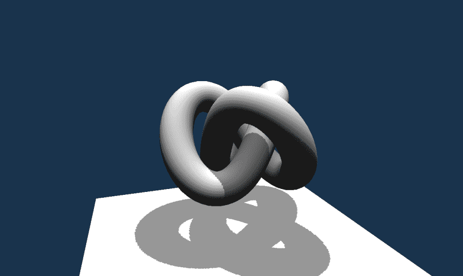

# 准备工作

阴影映射技术要求我们渲染场景两次。首先，我们渲染投射阴影的对象。它们从灯光的视角进行渲染。这样我们就在深度附加中存储深度值（不需要颜色值）。

然后，在第二步中，我们以通常的方式渲染场景，从摄像机的视角。在着色器内部，我们使用第一步中生成的阴影映射。顶点位置被投影到阴影映射上，并与其与灯光位置的距离与从阴影映射中读取的值进行比较。如果它更大，这意味着给定点被阴影覆盖，否则它被正常照亮。

# 如何操作...

1.  按照配方*使用顶点漫反射灯光渲染几何体*中描述的步骤准备 Vulkan 资源。

1.  加载带有顶点位置和法向量的 3D 模型。将加载的数据存储在（顶点）缓冲区中。

1.  创建一个具有`VK_BUFFER_USAGE_TRANSFER_DST_BIT`和`VK_BUFFER_USAGE_UNIFORM_BUFFER_BIT`用法的统一缓冲区，其大小足以容纳三个 16 元素浮点值矩阵的数据（参考第五章，*描述符集*中的*创建统一缓冲区*配方）。

1.  创建一个支持`VK_BUFFER_USAGE_TRANSFER_SRC_BIT`使用的暂存缓冲区，该缓冲区能够容纳三个矩阵，每个矩阵有 16 个浮点元素。缓冲区的内存对象应在主机可见的内存上分配（参考第四章的*创建缓冲区和分配以及将内存对象绑定到缓冲区*配方[f1332ca0-b5a2-49bd-ac41-e37068e31042.xhtml]，*资源和内存*）。

1.  创建一个应作为阴影贴图使用的组合图像采样器。图像应为二维的，并支持一种支持的深度格式（`VK_FORMAT_D16_UNORM`必须始终支持），并且应支持`VK_IMAGE_USAGE_SAMPLED_BIT`和`VK_IMAGE_USAGE_DEPTH_STENCIL_ATTACHMENT_BIT`使用（参考第五章的*创建组合图像采样器*配方[fe2cb528-9d22-49db-a05b-372bce2f87ee.xhtml]，*描述符集*）。

1.  创建一个包含两个描述符资源的描述符集布局：一个在顶点着色器中以 0^(th)绑定访问的统一缓冲区，以及一个在片段着色器中以 1^(st)绑定访问的组合图像采样器（参考第五章的*创建描述符集布局*配方[fe2cb528-9d22-49db-a05b-372bce2f87ee.xhtml]，*描述符集*）。

1.  创建一个描述符池，从中可以分配一个统一缓冲区描述符和一个组合图像采样器描述符（参考第五章的*创建描述符池*配方[fe2cb528-9d22-49db-a05b-372bce2f87ee.xhtml]，*描述符集*）。

1.  从创建的池中使用具有统一缓冲区和组合图像采样器资源（参考第五章的*分配描述符集*配方[fe2cb528-9d22-49db-a05b-372bce2f87ee.xhtml]，*描述符集*）的描述符集布局。

1.  使用在 0^(th)绑定访问的统一缓冲区和在 1^(st)绑定访问的创建的组合图像采样器（阴影贴图）更新（填充）描述符集。提供`VK_IMAGE_LAYOUT_DEPTH_STENCIL_READ_ONLY_OPTIMAL`值作为图像的布局（参考第五章的*更新描述符集*配方[fe2cb528-9d22-49db-a05b-372bce2f87ee.xhtml]，*描述符集*）。

1.  准备用于将整个场景绘制到阴影贴图中的渲染通道的数据。此渲染通道应只有一个附件，其格式与组合图像采样器的格式相同。图像在加载时应该清除，其初始布局可能未定义。图像内容应在渲染通道结束时存储，最终布局应设置为`VK_IMAGE_LAYOUT_DEPTH_STENCIL_READ_ONLY_OPTIMAL`（参考第六章的*指定附件描述*配方[2de4339d-8912-440a-89a6-fd1f84961448.xhtml]，*渲染通道和帧缓冲区*）。

1.  用于生成阴影图的渲染通道应只有一个子通道，并且只有一个深度附件，应使用帧缓冲区的 0^(th) 附件，其布局为 `VK_IMAGE_LAYOUT_DEPTH_STENCIL_ATTACHMENT_OPTIMAL`（参考 第六章，*渲染通道和帧缓冲区*中的 *指定子通道描述* 菜谱）。

1.  为渲染通道指定两个子通道依赖项（参考 第六章，*渲染通道和帧缓冲区*中的 *指定子通道之间的依赖项* 菜谱）。对于第一个依赖项使用以下值：

    +   `VK_SUBPASS_EXTERNAL` 对应于 `srcSubpass` 的值

    +   `0` 对应于 `dstSubpass`

    +   `VK_PIPELINE_STAGE_FRAGMENT_SHADER_BIT` 对应于 `srcStageMask` 的值

    +   `VK_PIPELINE_STAGE_EARLY_FRAGMENT_TESTS_BIT` 对应于 `dstStageMask` 的值

    +   `VK_ACCESS_SHADER_READ_BIT` 对应于 `srcAccessMask` 的值

    +   `VK_ACCESS_DEPTH_STENCIL_ATTACHMENT_WRITE_BIT` 对应于 `dstAccessMask` 的值

    +   `VK_DEPENDENCY_BY_REGION_BIT` 对应于 `dependencyFlags` 的值

1.  使用以下值设置第二个渲染通道的依赖项：

    +   `0` 对应于 `srcSubpass`

    +   `VK_SUBPASS_EXTERNAL` 对应于 `dstSubpass` 的值

    +   `VK_PIPELINE_STAGE_LATE_FRAGMENT_TESTS_BIT` 对应于 `srcStageMask` 的值

    +   `VK_PIPELINE_STAGE_FRAGMENT_SHADER_BIT` 对应于 `dstStageMask` 的值

    +   `VK_ACCESS_DEPTH_STENCIL_ATTACHMENT_WRITE_BIT` 对应于 `srcAccessMask` 的值

    +   `VK_ACCESS_SHADER_READ_BIT` 对应于 `dstAccessMask` 的值

    +   `VK_DEPENDENCY_BY_REGION_BIT` 对应于 `dependencyFlags` 的值

1.  使用上述参数创建一个渲染通道（参考 第六章，*渲染通道和帧缓冲区*中的 *创建渲染通道* 菜谱）。

1.  创建一个与创建的渲染通道兼容的帧缓冲区。帧缓冲区应有一个附件，应使用与阴影图组合图像采样器一起创建的图像视图。帧缓冲区还应具有与阴影图图像相同的尺寸（参考 第六章，*渲染通道和帧缓冲区*中的 *创建帧缓冲区* 菜谱）。

1.  创建一个用于将场景正常绘制到交换链中的第二个渲染通道（参考 *使用顶点漫反射光照渲染几何体* 菜谱）。

1.  使用准备好的描述符集布局创建一个管道布局。同时，指定一个由顶点着色器阶段访问的单个推送常量范围，从 0^(th) 偏移开始，大小为 `4 * sizeof( float )`（参考 第八章，*图形和计算管道*中的 *创建管道布局* 菜谱）。

1.  创建一个用于将场景绘制到阴影图中的图形管线。首先，使用从以下 GLSL 代码生成的 SPIR-V 汇编创建一个用于顶点着色器阶段的着色器模块（参考第七章中*将 GLSL 着色器转换为 SPIR-V 汇编*的配方，第七章，*着色器*和*创建着色器模块*的配方，第八章，*图形和计算管线*）：

```cpp
      #version 450 
      layout( location = 0 ) in vec4 app_position; 
      layout( set = 0, binding = 0 ) uniform UniformBuffer { 
        mat4 ShadowModelViewMatrix; 
        mat4 SceneModelViewMatrix; 
        mat4 ProjectionMatrix; 
      }; 
      void main() { 
        gl_Position = ProjectionMatrix * ShadowModelViewMatrix *       
      app_position; 
      }

```

1.  仅使用顶点着色器指定管线着色器阶段，它使用已准备的着色器模块中的`main`函数（参考第八章中*指定管线着色器阶段*的配方，第八章，*图形和计算管线*）。

1.  指定一个具有从 0^(th)绑定读取的一个属性的管线顶点输入状态。绑定应使用每个顶点读取的数据和等于`6 * sizeof( float )`的步长创建（参考第八章中*指定管线顶点输入状态*的配方，第八章，*图形和计算管线*）。该属性应具有以下参数：

    +   `location`的值为`0`

    +   `binding`的值为`0`

    +   `format`的值为`VK_FORMAT_R32G32B32_SFLOAT`

    +   `offset`的值为`0`

1.  使用一个与阴影图大小匹配的视口和裁剪测试参数指定视口和裁剪测试参数，参考第八章中*指定管线视口和裁剪测试状态*的配方（第八章，*图形和计算管线*）。

1.  使用之前指定的参数创建一个图形管线。跳过混合状态，因为用于阴影图生成的渲染通道没有任何颜色附件（尽管必须启用光栅化，否则不会生成片段，并且它们的深度不会存储在阴影图中）。另外，不要使用动态状态，因为阴影图的大小不会改变（参考第八章中*创建图形管线*的配方，第八章，*图形和计算管线*）。

1.  创建另一个用于渲染阴影场景的图形管线。这次，使用从以下 GLSL 代码生成的 SPIR-V 汇编创建一个用于顶点着色器阶段的着色器模块：

```cpp
      #version 450 

      layout( location = 0 ) in vec4 app_position; 
      layout( location = 1 ) in vec3 app_normal; 

      layout( set = 0, binding = 0 ) uniform UniformBuffer { 
        mat4 ShadowModelViewMatrix; 
        mat4 SceneModelViewMatrix; 
        mat4 ProjectionMatrix; 
      }; 

      layout( push_constant ) uniform LightParameters { 
        vec4 Position; 
      } Light; 

      layout( location = 0 ) out vec3 vert_normal; 
      layout( location = 1 ) out vec4 vert_texcoords; 
      layout( location = 2 ) out vec3 vert_light; 

      const mat4 bias = mat4(  
        0.5, 0.0, 0.0, 0.0, 
        0.0, 0.5, 0.0, 0.0, 
        0.0, 0.0, 1.0, 0.0, 
        0.5, 0.5, 0.0, 1.0 ); 

      void main() { 
        gl_Position = ProjectionMatrix * SceneModelViewMatrix * 
      app_position; 

        vert_normal = mat3( SceneModelViewMatrix ) * app_normal; 
        vert_texcoords = bias * ProjectionMatrix * 
      ShadowModelViewMatrix * app_position; 
        vert_light = (SceneModelViewMatrix * vec4( Light.Position.xyz, 
      0.0 ) ).xyz; 
      }

```

1.  使用从以下 GLSL 代码生成的 SPIR-V 汇编创建一个用于片段着色器阶段的着色器模块：

```cpp
#version 450 

layout( location = 0 ) in vec3 vert_normal; 
layout( location = 1 ) in vec4 vert_texcoords; 
layout( location = 2 ) in vec3 vert_light; 

layout( set = 0, binding = 1 ) uniform sampler2D ShadowMap; 

layout( location = 0 ) out vec4 frag_color; 

void main() { 
  float shadow = 1.0; 
  vec4 shadow_coords = vert_texcoords / vert_texcoords.w; 

  if( texture( ShadowMap, shadow_coords.xy ).r < shadow_coords.z - 0.005 ) { 
    shadow = 0.5; 
  } 

  vec3 normal_vector = normalize( vert_normal ); 
  vec3 light_vector = normalize( vert_light ); 
  float diffuse_term = max( 0.0, dot( normal_vector, light_vector ) ); 

  frag_color = shadow * vec4( diffuse_term ) + 0.1; 
}

```

1.  使用顶点和片段着色器指定管线着色器阶段，两者都使用相应着色器模块中的`main`函数。

1.  指定一个具有从同一 0^(th)绑定读取的两个属性的管线顶点输入状态。绑定应使用每个顶点读取的数据和等于`6 * sizeof( float )`的步长创建。第一个属性应具有以下参数：

    +   `location`的值为`0`

    +   `binding`的值为`0`

    +   `format`的值为`VK_FORMAT_R32G32B32_SFLOAT`

    +   `offset`的值为`0`

1.  第二个属性应具有以下定义：

    +   `location`的值为`1`

    +   `binding`的值为`0`

    +   `format`的值为`VK_FORMAT_R32G32B32_SFLOAT`

    +   `offset`的值为`3 * sizeof( float )`

1.  使用上述着色阶段和两个属性创建一个用于渲染阴影场景的图形管线，其余参数与*使用顶点漫反射光照渲染几何体*配方中定义的类似。

1.  准备一个视图矩阵，这可以是旋转、缩放和平移矩阵的乘积，用于从光的角度绘制场景（参考第十章的*准备平移矩阵*、*准备旋转矩阵*和*准备缩放矩阵*配方，*辅助配方*）。将连接矩阵的内容复制到偏移量为`0`的暂存缓冲区（参考第四章的*映射、更新和取消映射主机可见内存*配方，*资源和内存*）。

1.  准备一个用于从相机视角正常绘制场景的视图矩阵。将此矩阵的内容复制到偏移量为`16 * sizeof( float )`的暂存缓冲区。

1.  根据交换链尺寸的纵横比准备一个透视投影矩阵（参考第十章的*准备透视投影矩阵*配方，*辅助配方*）。将矩阵的内容复制到偏移量为`32 * sizeof( float )`的暂存缓冲区。记住，每次应用程序窗口大小调整时，都要重新创建投影矩阵并将其复制到暂存缓冲区（参考第四章的*映射、更新和取消映射主机可见内存*配方，*资源和内存*）。

1.  在动画的每一帧中，记录一个命令缓冲区。首先检查视图或投影矩阵是否被修改：如果被修改，则将暂存缓冲区的内容复制到统一缓冲区，由适当的管线屏障保护（参考第四章的*在缓冲区之间复制数据*配方，*资源和内存*）。

1.  从光的角度绘制场景到阴影图的渲染通道开始。绑定顶点缓冲区、描述符集以及用于填充阴影图的管线。绘制几何体并结束渲染通道。

1.  如果需要，转让获取的交换链图像的所有权。动态设置视口和裁剪测试状态，绑定用于渲染阴影场景的图形管线，并再次绘制几何体。结束命令缓冲区记录，将命令缓冲区提交到队列，并呈现图像。

# 它是如何工作的...

我们首先创建一个组合图像采样器，其中将存储来自光的角度的深度信息：

```cpp
if( !CreateCombinedImageSampler( PhysicalDevice, *LogicalDevice, VK_IMAGE_TYPE_2D, DepthFormat, { 512, 512, 1 }, 1, 1, 
  VK_IMAGE_USAGE_DEPTH_STENCIL_ATTACHMENT_BIT | VK_IMAGE_USAGE_SAMPLED_BIT, VK_IMAGE_VIEW_TYPE_2D, VK_IMAGE_ASPECT_DEPTH_BIT, VK_FILTER_LINEAR, 
  VK_FILTER_LINEAR, VK_SAMPLER_MIPMAP_MODE_NEAREST, VK_SAMPLER_ADDRESS_MODE_CLAMP_TO_EDGE, VK_SAMPLER_ADDRESS_MODE_CLAMP_TO_EDGE, 
  VK_SAMPLER_ADDRESS_MODE_CLAMP_TO_EDGE, 0.0f, false, 1.0f, false, VK_COMPARE_OP_ALWAYS, 0.0f, 1.0f, VK_BORDER_COLOR_FLOAT_OPAQUE_BLACK, 
  false, *ShadowMapSampler, *ShadowMap.Image, *ShadowMap.Memory, *ShadowMap.View ) ) { 
  return false; 
}

```

组合图像采样器，连同统一缓冲区，将在着色器中被访问，因此我们需要一个描述符集，通过它着色器可以访问两者。尽管我们使用两个不同的管线渲染场景两次，但我们仍然可以使用一个描述符集来避免不必要的状态切换：

```cpp
std::vector<VkDescriptorSetLayoutBinding> descriptor_set_layout_bindings = { 
  { 
    0, 
    VK_DESCRIPTOR_TYPE_UNIFORM_BUFFER, 
    1, 
    VK_SHADER_STAGE_VERTEX_BIT, 
    nullptr 
  }, 
  { 
    1, 
    VK_DESCRIPTOR_TYPE_COMBINED_IMAGE_SAMPLER, 
    1, 
    VK_SHADER_STAGE_FRAGMENT_BIT, 
    nullptr 
  } 
}; 
InitVkDestroyer( LogicalDevice, DescriptorSetLayout ); 
if( !CreateDescriptorSetLayout( *LogicalDevice, descriptor_set_layout_bindings, *DescriptorSetLayout ) ) { 
  return false; 
} 

std::vector<VkDescriptorPoolSize> descriptor_pool_sizes = { 
  { 
    VK_DESCRIPTOR_TYPE_UNIFORM_BUFFER, 
    1 
  }, 
  { 
    VK_DESCRIPTOR_TYPE_COMBINED_IMAGE_SAMPLER, 
    1 
  } 
}; 
InitVkDestroyer( LogicalDevice, DescriptorPool ); 
if( !CreateDescriptorPool( *LogicalDevice, false, 1, descriptor_pool_sizes, *DescriptorPool ) ) { 
  return false; 
} 
if( !AllocateDescriptorSets( *LogicalDevice, *DescriptorPool, { *DescriptorSetLayout }, DescriptorSets ) ) { 
  return false; 
}

```

我们还需要用统一缓冲区和组合图像采样器的句柄填充描述符集：

```cpp
BufferDescriptorInfo buffer_descriptor_update = { 
  DescriptorSets[0], 
  0, 
  0, 
  VK_DESCRIPTOR_TYPE_UNIFORM_BUFFER, 
  { 
    { 
      *UniformBuffer, 
      0, 
      VK_WHOLE_SIZE 
    } 
  } 
}; 

ImageDescriptorInfo image_descriptor_update = { 
  DescriptorSets[0], 
  1, 
  0, 
  VK_DESCRIPTOR_TYPE_COMBINED_IMAGE_SAMPLER, 
  { 
    { 
      *ShadowMapSampler, 
      *ShadowMap.View, 
      VK_IMAGE_LAYOUT_DEPTH_STENCIL_READ_ONLY_OPTIMAL 
    } 
  } 
}; 
UpdateDescriptorSets( *LogicalDevice, { image_descriptor_update }, { buffer_descriptor_update }, {}, {} );

```

下一步是为存储阴影图中的深度信息创建一个专门的渲染通道。它不使用任何颜色附件，因为我们只需要深度数据。我们还创建了一个帧缓冲区。它可以具有固定尺寸，因为我们不会改变阴影图的大小：

```cpp
std::vector<VkAttachmentDescription> shadow_map_attachment_descriptions = { 
  { 
    0 
    DepthFormat, 
    VK_SAMPLE_COUNT_1_BIT, 
    VK_ATTACHMENT_LOAD_OP_CLEAR, 
    VK_ATTACHMENT_STORE_OP_STORE, 
    VK_ATTACHMENT_LOAD_OP_DONT_CARE, 
    VK_ATTACHMENT_STORE_OP_DONT_CARE, 
    VK_IMAGE_LAYOUT_UNDEFINED, 
    VK_IMAGE_LAYOUT_DEPTH_STENCIL_READ_ONLY_OPTIMAL 
  } 
}; 
VkAttachmentReference shadow_map_depth_attachment = { 
  0, 
  VK_IMAGE_LAYOUT_DEPTH_STENCIL_ATTACHMENT_OPTIMAL 
}; 
std::vector<SubpassParameters> shadow_map_subpass_parameters = { 
  { 
    VK_PIPELINE_BIND_POINT_GRAPHICS, 
    {}, 
    {}, 
    {}, 
    &shadow_map_depth_attachment, 
    {} 
  } 
}; 
std::vector<VkSubpassDependency> shadow_map_subpass_dependencies = { 
  { 
    VK_SUBPASS_EXTERNAL, 
    0, 
    VK_PIPELINE_STAGE_FRAGMENT_SHADER_BIT, 
    VK_PIPELINE_STAGE_EARLY_FRAGMENT_TESTS_BIT, 
    VK_ACCESS_SHADER_READ_BIT, 
    VK_ACCESS_DEPTH_STENCIL_ATTACHMENT_WRITE_BIT, 
    VK_DEPENDENCY_BY_REGION_BIT 
  }, 
  { 
    0, 
    VK_SUBPASS_EXTERNAL, 
    VK_PIPELINE_STAGE_LATE_FRAGMENT_TESTS_BIT, 
    VK_PIPELINE_STAGE_FRAGMENT_SHADER_BIT, 
    VK_ACCESS_DEPTH_STENCIL_ATTACHMENT_WRITE_BIT, 
    VK_ACCESS_SHADER_READ_BIT, 
    VK_DEPENDENCY_BY_REGION_BIT 
  } 
}; 
InitVkDestroyer( LogicalDevice, ShadowMapRenderPass ); 
if( !CreateRenderPass( *LogicalDevice, shadow_map_attachment_descriptions, shadow_map_subpass_parameters, shadow_map_subpass_dependencies, 
  *ShadowMapRenderPass ) ) { 
  return false; 
} 
InitVkDestroyer( LogicalDevice, ShadowMap.Framebuffer ); 
if( !CreateFramebuffer( *LogicalDevice, *ShadowMapRenderPass, { *ShadowMap.View }, 512, 512, 1, *ShadowMap.Framebuffer ) ) { 
  return false; 
}

```

接下来，我们创建两个图形管线。它们都使用相同的推送常量范围来降低变量的数量（尽管只有第二个管线在着色器中使用它）：

```cpp
std::vector<VkPushConstantRange> push_constant_ranges = { 
  { 
    VK_SHADER_STAGE_VERTEX_BIT, 
    0, 
    sizeof( float ) * 4 
  } 
}; 
InitVkDestroyer( LogicalDevice, PipelineLayout ); 
if( !CreatePipelineLayout( *LogicalDevice, { *DescriptorSetLayout }, push_constant_ranges, *PipelineLayout ) ) { 
  return false; 
}

```

第一个管线用于生成阴影图。它使用非常简单的着色器，只读取顶点位置，并从光源的角度渲染场景。

第二个管线将场景正常渲染到交换链图像中。其着色器更复杂。顶点着色器正常计算位置，但还将法线向量和光向量转换为视图空间，以进行正确的光照计算：

```cpp
vert_normal = mat3( SceneModelViewMatrix ) * app_normal; 
vert_light = (SceneModelViewMatrix * vec4( Light.Position.xyz, 0.0 ) ).xyz;

```

顶点着色器最重要的任务是计算顶点在光源视图空间中的位置。为此，我们将其乘以光源的模型视图和投影矩阵（透视除法在片段着色器中完成）。获得的结果用于从阴影图中获取数据。然而，计算出的位置值（在透视除法之后）位于`-1.0 - 1.0`范围内，使用归一化纹理坐标从纹理中读取数据需要提供`0.0 - 1.0`范围内的值。这就是为什么我们需要偏置结果：

```cpp
vert_texcoords = bias * ProjectionMatrix * ShadowModelViewMatrix * app_position;

```

这样，片段着色器可以将插值后的位置投影到阴影图上，并从适当的坐标读取值：

```cpp
float shadow = 1.0; 
vec4 shadow_coords = vert_texcoords / vert_texcoords.w; 
if( texture( ShadowMap, shadow_coords.xy ).r < shadow_coords.z - 0.005 ) { 
  shadow = 0.5; 
}

```

从阴影图中读取的值与点与光源位置的距离（偏移一个小值）进行比较。如果距离大于阴影图中存储的值，则该点位于阴影中，不应该被照亮。我们需要添加这个小偏移，这样物体的表面就不会对自己产生阴影（只对更远的部分产生阴影）。我们也不完全丢弃光照，以避免阴影过于黑暗，因此将`0.5`分配给阴影变量。

上述计算可以使用`textureProj()`和`sampler2DShadow`执行。这样，透视除法、偏移距离并将其与参考值比较是自动完成的。

在本食谱中创建的其他资源与*使用顶点漫反射光照渲染几何体*食谱中展示的资源类似。渲染/记录命令缓冲区需要我们，除了常规内容外，还要将场景渲染两次。首先，我们从光源的角度绘制所有对象以填充阴影图。然后，在从相机视角渲染所有对象的过程中使用阴影图：

```cpp
BeginRenderPass( command_buffer, *ShadowMapRenderPass, *ShadowMap.Framebuffer, { { 0, 0, }, { 512, 512 } }, { { 1.0f, 0 } }, VK_SUBPASS_CONTENTS_INLINE ); 
BindVertexBuffers( command_buffer, 0, { { *VertexBuffer, 0 } } ); 
BindDescriptorSets( command_buffer, VK_PIPELINE_BIND_POINT_GRAPHICS, *PipelineLayout, 0, DescriptorSets, {} ); 
BindPipelineObject( command_buffer, VK_PIPELINE_BIND_POINT_GRAPHICS, *ShadowMapPipeline ); 
DrawGeometry( command_buffer, Scene[0].Parts[0].VertexCount + Scene[1].Parts[0].VertexCount, 1, 0, 0 ); 
EndRenderPass( command_buffer ); 
if( PresentQueue.FamilyIndex != GraphicsQueue.FamilyIndex ) { 
  ImageTransition image_transition_before_drawing = { 
    Swapchain.Images[swapchain_image_index], 
    VK_ACCESS_MEMORY_READ_BIT, 
    VK_ACCESS_MEMORY_READ_BIT, 
    VK_IMAGE_LAYOUT_UNDEFINED, 
    VK_IMAGE_LAYOUT_COLOR_ATTACHMENT_OPTIMAL, 
    PresentQueue.FamilyIndex, 
    GraphicsQueue.FamilyIndex, 
    VK_IMAGE_ASPECT_COLOR_BIT 
  }; 
  SetImageMemoryBarrier( command_buffer, VK_PIPELINE_STAGE_COLOR_ATTACHMENT_OUTPUT_BIT, VK_PIPELINE_STAGE_COLOR_ATTACHMENT_OUTPUT_BIT, { image_transition_before_drawing } ); 
} 
BeginRenderPass( command_buffer, *SceneRenderPass, framebuffer, { { 0, 0 }, Swapchain.Size }, { { 0.1f, 0.2f, 0.3f, 1.0f }, { 1.0f, 0 } }, VK_SUBPASS_CONTENTS_INLINE ); 

VkViewport viewport = { 
  0.0f, 
  0.0f, 
  static_cast<float>(Swapchain.Size.width), 
  static_cast<float>(Swapchain.Size.height), 
  0.0f, 
  1.0f, 
}; 
SetViewportStateDynamically( command_buffer, 0, { viewport } ); 

VkRect2D scissor = { 
  { 
    0, 
    0 
  }, 
  { 
    Swapchain.Size.width, 
    Swapchain.Size.height 
  } 
}; 
SetScissorsStateDynamically( command_buffer, 0, { scissor } ); 
BindPipelineObject( command_buffer, VK_PIPELINE_BIND_POINT_GRAPHICS, *ScenePipeline ); 
ProvideDataToShadersThroughPushConstants( command_buffer, *PipelineLayout, VK_SHADER_STAGE_VERTEX_BIT, 0, sizeof( float ) * 4, &LightSource.GetPosition()[0] ); 
DrawGeometry( command_buffer, Scene[0].Parts[0].VertexCount + Scene[1].Parts[0].VertexCount, 1, 0, 0 ); 
EndRenderPass( command_buffer );

```

以下图像显示了不同模型在平坦平面上投射的阴影：

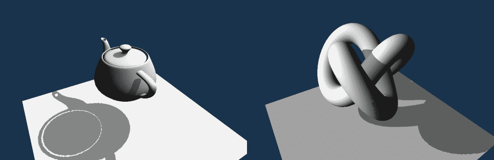

# 参见

+   在第五章，“描述符集”，查看以下食谱：

    +   *创建组合图像采样器*

+   在第六章，“渲染通道和帧缓冲区”，查看以下食谱：

    +   *创建渲染通道*

    +   *创建帧缓冲区*

+   本章中的食谱*使用顶点漫反射光照渲染几何体*
