# 高级渲染技术

在本章中，我们将涵盖以下配方：

+   绘制天空盒

+   使用几何着色器绘制广告牌

+   使用计算和图形管线绘制粒子

+   渲染细分地形

+   渲染全屏四边形进行后处理

+   使用输入附件进行颜色校正后处理效果

# 简介

创建 3D 应用程序，如游戏、基准测试或 CAD 工具，从渲染的角度来看，通常需要准备各种资源，包括网格或纹理、在场景中绘制多个对象，以及实现对象变换、光照计算和图像处理的算法。它们都可以以任何我们想要的方式开发，以最符合我们目的的方式开发。但 3D 图形行业中也有许多常用的技术。这些技术的描述可以在书籍和教程中找到，其中包含使用各种 3D 图形 API 实现的示例。

Vulkan 仍然是一个相对较新的图形 API，因此没有太多资源介绍使用 Vulkan API 实现的常见渲染算法。在本章中，我们将学习如何使用 Vulkan 准备各种图形技术。我们将了解从游戏和基准测试中找到的流行、高级渲染算法的重要概念，以及它们如何与 Vulkan 资源相匹配。

在本章中，我们将仅关注从给定配方角度重要的代码部分。未描述的资源（例如，命令池或渲染通道创建）将按常规创建（参考第十一章的*使用顶点漫反射光照渲染几何体*配方，*光照*）。

# 绘制天空盒

渲染 3D 场景，特别是具有广阔视距的开世界场景，需要绘制许多对象。然而，当前图形硬件的处理能力仍然过于有限，无法渲染我们每天所见到的那么多对象。因此，为了降低绘制对象的数量并绘制场景的背景，我们通常准备一张远距离对象的图像（或照片），并只绘制该图像。

在玩家可以自由移动和环顾四周的游戏中，我们不能只绘制一张图像。我们必须绘制所有方向的图像。这些图像形成一个立方体，放置背景图像的对象称为天空盒。我们以这种方式渲染，使其始终位于背景，在可用的最远深度值处。

# 准备工作

绘制天空盒需要准备一个立方体贴图。它包含六个方形图像，包含所有世界方向的视图（右、左、上、下、后、前），如下面的图像所示：

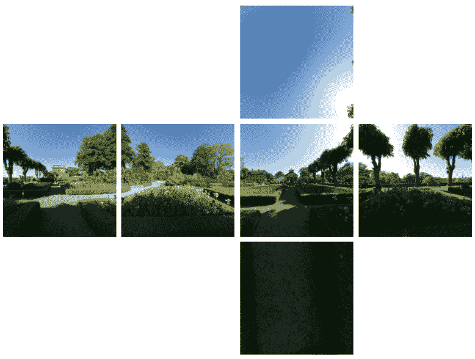

图片由 Emil Persson 提供([h t t p ://w w w . h u m u s . n a m e](http://www.humus.name))

在 Vulkan 中，立方体贴图是为具有六个数组层（或六的倍数）的图像创建的特殊图像视图。层必须按照*+X*，-*X*，*+Y*，-*Y*，*+Z*，-*Z*的顺序包含图像。

立方体贴图不仅可以用于绘制天空盒。我们还可以使用它们来绘制反射或透明物体。它们还可以用于光照计算（参考第十一章中“使用立方体贴图绘制反射和折射几何体”的配方，*光照*）。

# 如何做到这一点...

1.  从文件中加载一个立方体的 3D 模型，并将顶点数据存储在顶点缓冲区中。只需要顶点位置（参考第十章中“从 OBJ 文件加载 3D 模型”的配方 Chapter 10，*辅助配方*）。

1.  创建一个具有正方形`VK_IMAGE_TYPE_2D`图像的组合图像采样器，该图像具有六个数组层（或六的倍数），一个对所有坐标使用`VK_SAMPLER_ADDRESS_MODE_CLAMP_TO_EDGE`寻址模式的采样器，以及一个`VK_IMAGE_VIEW_TYPE_CUBE`图像视图（参考第五章中“创建组合图像采样器”的配方 Chapter 5，*描述符集*）。

1.  加载立方体的所有六个面的图像数据，并使用阶段缓冲区将其上传到图像的内存中。图像数据必须按照以下顺序上传到六个数组层：*+X*，-*X*，*+Y*，-*Y*，*+Z*，-*Z*（参考第十章中“从文件加载纹理数据”的配方 Chapter 10，辅助配方，以及第四章中“使用阶段缓冲区更新绑定到设备本地内存的图像”的配方 Chapter 4，*资源和内存*）。

1.  在一个统一缓冲区中创建一个用于存储变换矩阵的缓冲区（参考第五章中“创建统一缓冲区”的配方 Chapter 5，*描述符集*）。

1.  创建一个描述符集布局，其中统一缓冲区由顶点阶段访问，组合图像采样器由片段阶段访问。使用前面的布局分配一个描述符集。使用统一缓冲区和立方体贴图/组合图像采样器更新描述符集（参考第五章中“创建描述符集布局，分配描述符集”和“更新描述符集”的配方 Chapter 5，*描述符集*）。

1.  创建一个着色器模块，其中顶点着色器由以下 GLSL 代码创建（参考第八章中“创建着色器模块配方”的配方 Chapter 8，*图形和计算管线*）。

```cpp
       #version 450 
       layout( location = 0 ) in vec4 app_position; 
       layout( set = 0, binding = 0 ) uniform UniformBuffer { 
        mat4 ModelViewMatrix; 
        mat4 ProjectionMatrix; 
       }; 

       layout( location = 0 ) out vec3 vert_texcoord; 

       void main() { 
         vec3 position = mat3(ModelViewMatrix) * app_position.xyz; 
         gl_Position = (ProjectionMatrix * vec4( position, 0.0 )).xyzz; 
         vert_texcoord = app_position.xyz; 
       }

```

1.  创建一个着色器模块，其中片段着色器由以下 GLSL 代码创建：

```cpp
       #version 450 
       layout( location = 0 ) in vec3 vert_texcoord; 
       layout( set = 0, binding = 1 ) uniform samplerCube Cubemap; 
       layout( location = 0 ) out vec4 frag_color; 

       void main() { 
         frag_color = texture( Cubemap, vert_texcoord ); 
       }

```

1.  从前面的模块创建一个图形管线，使用顶点和片段着色器。该管线应使用一个具有三个组件（顶点位置）的顶点属性，并为光栅化状态的剔除模式使用`VK_CULL_MODE_FRONT_BIT`值。混合应被禁用。管线布局应允许访问统一缓冲区和立方体贴图/复合图像采样器（参考第八章中的*指定管线着色器阶段*、*指定管线顶点输入状态*、*指定管线光栅化状态*、*指定管线混合状态*、*创建管线布局*、*指定图形管线创建参数*和*创建图形管线*配方，第八章，*图形和计算管线*）。

1.  使用渲染几何体的其余部分绘制立方体（参考第五章中的*绑定描述符集*配方，第五章，*描述符集*，以及第八章中的*绑定管线对象*配方，第八章，*图形和计算管线*，以及第九章中的*绑定顶点缓冲区*和*绘制几何体*配方，第九章，*命令记录和绘制*）。

1.  每当用户（摄像机）在场景中移动时，在统一缓冲区中更新模型视图矩阵。每当应用程序窗口大小调整时，在统一缓冲区中更新投影矩阵。

# 它是如何工作的...

要渲染天空盒，我们需要加载或准备一个形成立方体的几何体。只需要位置，因为它们也可以用作纹理坐标。

接下来，我们加载六个立方体贴图图像并创建一个包含立方体贴图视图的复合图像采样器：

```cpp
InitVkDestroyer( LogicalDevice, CubemapImage ); 
InitVkDestroyer( LogicalDevice, CubemapImageMemory ); 
InitVkDestroyer( LogicalDevice, CubemapImageView ); 
InitVkDestroyer( LogicalDevice, CubemapSampler ); 
if( !CreateCombinedImageSampler( PhysicalDevice, *LogicalDevice, VK_IMAGE_TYPE_2D, VK_FORMAT_R8G8B8A8_UNORM, { 1024, 1024, 1 }, 1, 6, 
  VK_IMAGE_USAGE_SAMPLED_BIT | VK_IMAGE_USAGE_TRANSFER_DST_BIT, VK_IMAGE_VIEW_TYPE_CUBE, VK_IMAGE_ASPECT_COLOR_BIT, VK_FILTER_LINEAR, 
  VK_FILTER_LINEAR, VK_SAMPLER_MIPMAP_MODE_NEAREST, VK_SAMPLER_ADDRESS_MODE_CLAMP_TO_EDGE, VK_SAMPLER_ADDRESS_MODE_CLAMP_TO_EDGE, 
  VK_SAMPLER_ADDRESS_MODE_CLAMP_TO_EDGE, 0.0f, false, 1.0f, false, VK_COMPARE_OP_ALWAYS, 0.0f, 1.0f, VK_BORDER_COLOR_FLOAT_OPAQUE_BLACK, 
  false, *CubemapSampler, *CubemapImage, *CubemapImageMemory, *CubemapImageView ) ) { 
  return false; 
} 
std::vector<std::string> cubemap_images = { 
  "Data/Textures/Skansen/posx.jpg", 
  "Data/Textures/Skansen/negx.jpg", 
  "Data/Textures/Skansen/posy.jpg", 
  "Data/Textures/Skansen/negy.jpg", 
  "Data/Textures/Skansen/posz.jpg", 
  "Data/Textures/Skansen/negz.jpg" 
}; 
for( size_t i = 0; i < cubemap_images.size(); ++i ) { 
  std::vector<unsigned char> cubemap_image_data; 
  int image_data_size; 
  if( !LoadTextureDataFromFile( cubemap_images[i].c_str(), 4, cubemap_image_data, nullptr, nullptr, nullptr, &image_data_size ) ) { 
    return false; 
  } 
  VkImageSubresourceLayers image_subresource = { 
    VK_IMAGE_ASPECT_COLOR_BIT, 
    0, 
    static_cast<uint32_t>(i), 
    1 
  }; 
  UseStagingBufferToUpdateImageWithDeviceLocalMemoryBound( PhysicalDevice, *LogicalDevice, image_data_size, &cubemap_image_data[0], 
    *CubemapImage, image_subresource, { 0, 0, 0 }, { 1024, 1024, 1 }, VK_IMAGE_LAYOUT_UNDEFINED, VK_IMAGE_LAYOUT_SHADER_READ_ONLY_OPTIMAL, 
    0, VK_ACCESS_SHADER_READ_BIT, VK_IMAGE_ASPECT_COLOR_BIT, VK_PIPELINE_STAGE_TOP_OF_PIPE_BIT, VK_PIPELINE_STAGE_FRAGMENT_SHADER_BIT, 
    GraphicsQueue.Handle, FrameResources.front().CommandBuffer, {} ); 
}

```

创建的立方体贴图视图以及采样器随后通过描述符集提供给着色器。我们还需要一个统一缓冲区，其中将存储和访问着色器中的变换矩阵：

```cpp
std::vector<VkDescriptorSetLayoutBinding> descriptor_set_layout_bindings = { 
  { 
    0, 
    VK_DESCRIPTOR_TYPE_UNIFORM_BUFFER, 
    1, 
    VK_SHADER_STAGE_VERTEX_BIT, 
    nullptr 
  }, 
  { 
    1, 
    VK_DESCRIPTOR_TYPE_COMBINED_IMAGE_SAMPLER, 
    1, 
    VK_SHADER_STAGE_FRAGMENT_BIT, 
    nullptr 
  } 
}; 
InitVkDestroyer( LogicalDevice, DescriptorSetLayout ); 
if( !CreateDescriptorSetLayout( *LogicalDevice, descriptor_set_layout_bindings, *DescriptorSetLayout ) ) { 
  return false; 
} 

std::vector<VkDescriptorPoolSize> descriptor_pool_sizes = { 
  { 
    VK_DESCRIPTOR_TYPE_UNIFORM_BUFFER, 
    1 
  }, 
  { 
    VK_DESCRIPTOR_TYPE_COMBINED_IMAGE_SAMPLER, 
    1 
  } 
}; 
InitVkDestroyer( LogicalDevice, DescriptorPool ); 
if( !CreateDescriptorPool( *LogicalDevice, false, 1, descriptor_pool_sizes, *DescriptorPool ) ) { 
  return false; 
} 

if( !AllocateDescriptorSets( *LogicalDevice, *DescriptorPool, { *DescriptorSetLayout }, DescriptorSets ) ) { 
  return false; 
} 

BufferDescriptorInfo buffer_descriptor_update = { 
  DescriptorSets[0], 
  0, 
  0, 
  VK_DESCRIPTOR_TYPE_UNIFORM_BUFFER, 
  { 
    { 
      *UniformBuffer, 
      0, 
      VK_WHOLE_SIZE 
    } 
  } 
}; 

ImageDescriptorInfo image_descriptor_update = { 
  DescriptorSets[0], 
  1, 
  0, 
  VK_DESCRIPTOR_TYPE_COMBINED_IMAGE_SAMPLER, 
  { 
    { 
      *CubemapSampler, 
      *CubemapImageView, 
      VK_IMAGE_LAYOUT_SHADER_READ_ONLY_OPTIMAL 
    } 
  } 
}; 

UpdateDescriptorSets( *LogicalDevice, { image_descriptor_update }, { buffer_descriptor_update }, {}, {} );

```

要绘制天空盒，我们不需要单独的、专门的*渲染通道*，因为我们可以在正常几何体上渲染它。更重要的是，为了节省处理能力（图像填充率），我们通常在（不透明的）几何体之后和透明物体之前绘制天空盒。它以这种方式渲染，使其顶点始终位于远裁剪平面。这样，它不会覆盖已经绘制的几何体，也不会被裁剪掉。这种效果是通过一个特殊的顶点着色器实现的。其最重要的部分是以下代码：

```cpp
vec3 position = mat3(ModelViewMatrix) * app_position.xyz; 
gl_Position = (ProjectionMatrix * vec4( position, 0.0 )).xyzz;

```

首先，我们将位置乘以一个模型视图矩阵。我们只取矩阵的旋转部分。玩家应该始终位于天空盒的中心，否则幻觉将被打破。这就是我们不希望移动天空盒的原因，我们只需要将其旋转作为玩家环顾四周的响应。

接下来，我们将顶点的视图空间位置乘以一个投影矩阵。结果存储在一个 4 元素向量中，最后两个分量相同，等于结果的 z 分量。在现代图形硬件中，透视投影是通过将位置向量除以其`w`分量来执行的。之后，所有`x`和`y`分量适合于`<-1, 1>`范围（包含）且`z`分量适合于`<0, 1>`范围（包含）的顶点都在裁剪体积内且是可见的（除非它们被其他东西遮挡）。因此，以使最后两个分量相等的方式来计算顶点位置，可以保证顶点将位于远裁剪平面。

除了顶点着色器和立方体贴图视图之外，天空盒只需要一种额外的特殊处理。我们需要记住多边形的朝向。通常，我们使用背面剔除来绘制几何体，因为我们想看到它的外部表面。对于天空盒，我们想要渲染其内部表面，因为我们是从内部看它的。这就是为什么，如果我们没有为天空盒特别准备网格，我们可能希望在天空盒渲染期间剔除前表面。我们可以这样准备管线光栅化信息：

```cpp
VkPipelineRasterizationStateCreateInfo rasterization_state_create_info; 
SpecifyPipelineRasterizationState( false, false, VK_POLYGON_MODE_FILL, VK_CULL_MODE_FRONT_BIT, VK_FRONT_FACE_COUNTER_CLOCKWISE, false, 0.0f, 1.0f, 0.0f, 1.0f, rasterization_state_create_info );

```

除了这些，图形管线是以通常的方式创建的。为了用它来绘制，我们需要绑定描述符集、顶点缓冲区和管线本身：

```cpp
BindVertexBuffers( command_buffer, 0, { { *VertexBuffer, 0 } } ); 

BindDescriptorSets( command_buffer, VK_PIPELINE_BIND_POINT_GRAPHICS, *PipelineLayout, 0, DescriptorSets, {} ); 

BindPipelineObject( command_buffer, VK_PIPELINE_BIND_POINT_GRAPHICS, *Pipeline ); 

for( size_t i = 0; i < Skybox.Parts.size(); ++i ) { 
  DrawGeometry( command_buffer, Skybox.Parts[i].VertexCount, 1, Skybox.Parts[i].VertexOffset, 0 ); 
}

```

以下图像是使用此配方生成的：


# 参见

+   在第五章，*描述符集*中，查看以下配方：

    +   *创建组合图像采样器*

    +   *创建描述符集布局*

    +   *分配描述符集*

    +   *更新描述符集*

    +   *绑定描述符集*

+   在第八章，*图形和计算管线*中，查看以下配方：

    +   *创建着色器模块*

    +   *指定管线着色器阶段*

    +   *创建图形管线*

    +   *绑定管线对象*

+   在第九章，*命令记录和绘制*中，查看以下配方：

    +   *绑定顶点缓冲区*

    +   *绘制几何体*

+   在第十章，*辅助配方*中，查看以下配方：

    +   *从文件加载纹理数据*

    +   *从 OBJ 文件加载 3D 模型*

+   在第十一章，*光照*中，查看以下配方：

    +   *使用立方体贴图绘制反射和折射几何体*

# 使用几何着色器绘制广告牌

在远处简化绘制的几何体是降低渲染整个场景所需处理能力的一种常见技术。可以绘制的最简单几何体是一个带有描绘物体外观的图像的平面四边形（或三角形）。为了使效果令人信服，四边形必须始终朝向相机：

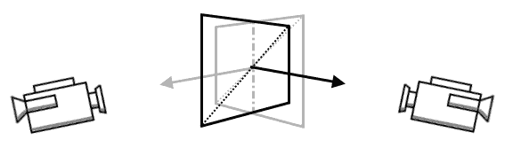

始终面向摄像机的平面物体被称为 billboard。它们不仅用于作为几何体最低细节级别远距离物体，还用于粒子效果。

绘制 billboard 的一个直接技术是使用几何着色器。

# 如何操作...

1.  使用启用`geometryShader`功能的逻辑设备（参考第一章，*实例和设备*中的*获取物理设备的特性和属性*和*创建逻辑设备*配方）。

1.  使用每个 billboard 一个顶点的方式为所有 billboard 准备位置。将它们存储在顶点缓冲区中（参考第四章，*资源和内存*中的*创建缓冲区*配方）。

1.  为至少两个 4x4 变换矩阵创建一个统一缓冲区（参考第五章，*描述符集*中的*创建统一缓冲区*配方）。

1.  如果 billboard 应该使用纹理，创建一个联合图像采样器并将从文件加载的纹理数据上传到图像内存中（参考第五章，*描述符集*中的*创建联合图像采样器*配方，以及第十章，*辅助配方*中的*从文件加载纹理数据*配方）。

1.  为由顶点和几何阶段访问的统一缓冲区以及如果需要纹理的 billboard，由片段着色器阶段访问的联合图像采样器准备描述符集布局。创建一个描述符集，并使用创建的统一缓冲区和联合图像采样器更新它（参考第五章，*描述符集*中的*创建描述符集布局*、*分配描述符集*和*更新描述符集*配方）。

1.  创建一个使用以下 GLSL 代码创建的顶点着色器的着色器模块（参考第八章，*图形和计算管线*中的*创建着色器模块*配方）：

```cpp
       #version 450 
       layout( location = 0 ) in vec4 app_position; 
       layout( set = 0, binding = 0 ) uniform UniformBuffer { 
         mat4 ModelViewMatrix; 
         mat4 ProjectionMatrix; 
       }; 

       layout( push_constant ) uniform TimeState { 
        float Time; 
       } PushConstant; 

       void main() { 
         gl_Position = ModelViewMatrix * app_position; 
       }

```

1.  创建一个包含以下 GLSL 代码生成的几何着色器的着色器模块：

```cpp
       #version 450 
       layout( points ) in; 
       layout( set = 0, binding = 0 ) uniform UniformBuffer { 
        mat4 ModelViewMatrix; 
        mat4 ProjectionMatrix; 
       }; 

       layout( triangle_strip, max_vertices = 4 ) out; 
       layout( location = 0 ) out vec2 geom_texcoord; 

       const float SIZE = 0.1; 

       void main() { 
         vec4 position = gl_in[0].gl_Position; 

         gl_Position = ProjectionMatrix * (gl_in[0].gl_Position + vec4( 
         -SIZE, SIZE, 0.0, 0.0 )); 
         geom_texcoord = vec2( -1.0, 1.0 ); 
         EmitVertex(); 

         gl_Position = ProjectionMatrix * (gl_in[0].gl_Position + vec4( 
         -SIZE, -SIZE, 0.0, 0.0 )); 
         geom_texcoord = vec2( -1.0, -1.0 ); 
         EmitVertex(); 

         gl_Position = ProjectionMatrix * (gl_in[0].gl_Position + vec4( 
         SIZE, SIZE, 0.0, 0.0 )); 
         geom_texcoord = vec2( 1.0, 1.0 ); 
         EmitVertex(); 

         gl_Position = ProjectionMatrix * (gl_in[0].gl_Position + vec4( 
         SIZE, -SIZE, 0.0, 0.0 )); 
         geom_texcoord = vec2( 1.0, -1.0 ); 
         EmitVertex(); 

         EndPrimitive(); 
       }

```

1.  创建一个使用以下 GLSL 代码生成的 SPIR-V 汇编的片段着色器的着色器模块：

```cpp
       #version 450 
       layout( location = 0 ) in vec2 geom_texcoord; 
       layout( location = 0 ) out vec4 frag_color; 

       void main() { 
         float alpha = 1.0 - dot( geom_texcoord, geom_texcoord ); 
         if( 0.2 > alpha ) { 
           discard; 
         } 
         frag_color = vec4( alpha ); 
       }

```

1.  创建一个图形管线。它必须使用前面的顶点、几何和片段着色器模块。只需要一个顶点属性（一个位置）。它将用于使用`VK_PRIMITIVE_TOPOLOGY_POINT_LIST`原语绘制几何图形。管线应该能够访问包含变换矩阵的统一缓冲区以及（如果需要）一个组合图像纹理（参考第八章，*图形和计算管线*中的*指定管线着色器阶段*、*指定管线顶点输入状态*、*指定管线输入装配状态*、*创建管线布局*、*指定图形管线创建参数*和*创建图形管线*配方）。

1.  在渲染通道内绘制几何图形（参考第五章，*描述符集*中的*绑定描述符集*配方，到第八章，*图形和计算管线*中的*绑定管线对象*配方，以及到第九章，*命令记录和绘制*中的*绑定顶点缓冲区和绘制几何图形*配方）。

1.  每当用户（一个摄像机）在场景中移动时，在统一缓冲区中更新模型视图矩阵。每当应用程序窗口大小调整时，在统一缓冲区中更新投影矩阵。

# 它是如何工作的...

首先，我们开始准备广告牌的位置。广告牌作为点原语绘制，因此一个顶点对应一个广告牌。我们如何准备几何图形由我们自己决定，我们不需要其他属性。一个几何着色器将单个顶点转换为一个面向摄像机的四边形并计算纹理坐标。

在这个例子中，我们不使用纹理，但我们将使用纹理坐标来绘制圆形。我们只需要访问存储在如下生成的统一缓冲区中的变换矩阵：

```cpp
std::vector<VkDescriptorSetLayoutBinding> descriptor_set_layout_bindings = { 
  { 
    0, 
    VK_DESCRIPTOR_TYPE_UNIFORM_BUFFER, 
    1, 
    VK_SHADER_STAGE_VERTEX_BIT | VK_SHADER_STAGE_GEOMETRY_BIT, 
    nullptr 
  } 
}; 
InitVkDestroyer( LogicalDevice, DescriptorSetLayout ); 
if( !CreateDescriptorSetLayout( *LogicalDevice, descriptor_set_layout_bindings, *DescriptorSetLayout ) ) { 
  return false; 
} 

std::vector<VkDescriptorPoolSize> descriptor_pool_sizes = { 
  { 
    VK_DESCRIPTOR_TYPE_UNIFORM_BUFFER, 
    1 
  } 
}; 
InitVkDestroyer( LogicalDevice, DescriptorPool ); 
if( !CreateDescriptorPool( *LogicalDevice, false, 1, descriptor_pool_sizes, *DescriptorPool ) ) { 
  return false; 
} 

if( !AllocateDescriptorSets( *LogicalDevice, *DescriptorPool, { *DescriptorSetLayout }, DescriptorSets ) ) { 
  return false; 
} 

BufferDescriptorInfo buffer_descriptor_update = { 
  DescriptorSets[0], 
  0, 
  0, 
  VK_DESCRIPTOR_TYPE_UNIFORM_BUFFER, 
  { 
    { 
      *UniformBuffer, 
      0, 
      VK_WHOLE_SIZE 
    } 
  } 
}; 

UpdateDescriptorSets( *LogicalDevice, {}, { buffer_descriptor_update }, {}, {} );

```

下一步是创建一个图形管线。它使用以下方式定义的单个顶点属性（一个位置）：

```cpp
std::vector<VkVertexInputBindingDescription> vertex_input_binding_descriptions = { 
  { 
    0, 
    3 * sizeof( float ), 
    VK_VERTEX_INPUT_RATE_VERTEX 
  } 
}; 

std::vector<VkVertexInputAttributeDescription> vertex_attribute_descriptions = { 
  { 
    0, 
    0, 
    VK_FORMAT_R32G32B32_SFLOAT, 
    0 
  } 
}; 

VkPipelineVertexInputStateCreateInfo vertex_input_state_create_info; 
SpecifyPipelineVertexInputState( vertex_input_binding_descriptions, vertex_attribute_descriptions, vertex_input_state_create_info );

```

我们以点绘制顶点，因此在创建管线时需要指定一个合适的原语类型：

```cpp
VkPipelineInputAssemblyStateCreateInfo input_assembly_state_create_info; 
SpecifyPipelineInputAssemblyState( VK_PRIMITIVE_TOPOLOGY_POINT_LIST, false, input_assembly_state_create_info );

```

管线参数的其余部分相当典型。最重要的部分是着色器。

顶点着色器将顶点从局部空间转换到视图空间。广告牌必须始终面向摄像机，因此在视图空间中直接进行计算更容易。

几何着色器几乎完成所有工作。它取一个顶点（一个点）并发出一个由四个顶点组成的三角形带（一个四边形）。每个新顶点稍微向左/右和上/下偏移，以形成一个四边形：

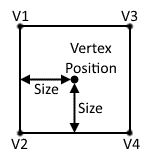

此外，根据方向/偏移量，为生成的顶点分配一个纹理坐标。在我们的例子中，第一个顶点准备如下：

```cpp
vec4 position = gl_in[0].gl_Position; 

gl_Position = ProjectionMatrix * (gl_in[0].gl_Position + vec4( -SIZE, SIZE, 0.0, 0.0 )); 
geom_texcoord = vec2( -1.0, 1.0 ); 
EmitVertex();

```

剩余的顶点以类似的方式发出。由于我们在顶点着色器中将顶点转换到视图空间，生成的四边形始终面向屏幕平面。我们所需做的只是将生成的顶点乘以一个投影矩阵，将它们转换到裁剪空间。

使用片段着色器丢弃一些片段以形成从四边形到圆形：

```cpp
float alpha = 1.0 - dot( geom_texcoord, geom_texcoord ); 
if( 0.2 > alpha ) { 
  discard; 
}

```

在以下示例中，我们可以看到在网格顶点位置渲染的布告板。图像中看到的圆是平的；它们不是球体：

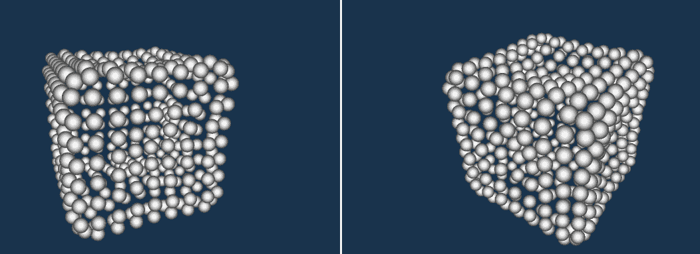

# 参见

+   在第一章，*实例和设备*中，查看以下配方：

    +   *获取物理设备的特性和属性*

    +   *创建逻辑设备*

+   在第五章，*描述符集*中，查看以下配方：

    +   *创建统一缓冲区*

    +   *创建描述符集布局*

    +   *分配描述符集*

    +   *更新描述符集*

    +   *绑定描述符集*

+   在第七章，*着色器*中，查看*编写几何着色器*配方

+   在第八章，*图形和计算管道*中，查看以下配方：

    +   *创建着色器模块*

    +   *指定管道着色器阶段*

    +   *指定管道顶点绑定描述、属性描述和输入状态*

    +   *指定管道输入装配状态*

    +   *创建管道布局*

    +   *指定图形管道创建参数*

    +   *创建图形管道*

    +   *绑定管道对象*

+   在第九章，*命令录制和绘制*中，查看以下配方：

    +   *绑定顶点缓冲区*

    +   *绘制几何配方*

# 使用计算和图形管道绘制粒子

由于图形硬件的性质以及图形管道处理对象的方式，显示诸如云、烟、火花、火、下落的雨和雪等现象相当困难。这些效果通常使用粒子系统来模拟，粒子系统是一大批根据系统实现算法行为的小精灵。

由于独立实体数量非常大，使用计算着色器实现粒子的行为和相互交互很方便。模仿每个粒子外观的精灵通常使用几何着色器显示为布告板。

在以下示例中，我们可以看到使用此配方生成的图像：

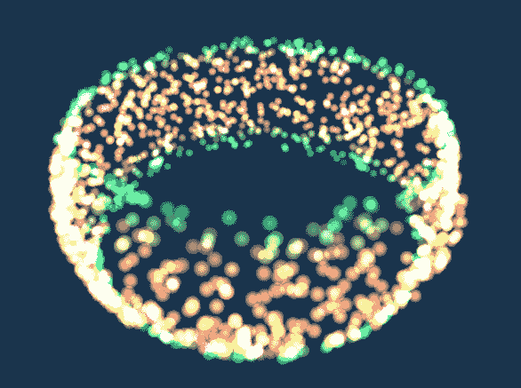

# 如何做到...

1.  创建一个启用`geometryShader`特性的逻辑设备。请求一个支持图形操作的队列和一个支持计算操作的队列（参考第一章，*实例和设备*中的*获取物理设备的特性和属性*和*创建逻辑设备*配方）。

1.  为粒子系统生成初始数据（属性）。

1.  创建一个既作为顶点缓冲区也作为存储纹理缓冲区的缓冲区。将生成的粒子数据复制到缓冲区中（参考第五章，*描述符集*中的*创建存储纹理缓冲区*做法，以及第四章，*资源和内存*中的*使用阶段缓冲区更新设备本地内存绑定的缓冲区*做法）。

1.  创建一个用于两个变换矩阵的统一缓冲区。每次相机移动或窗口调整大小时更新它（参考第五章，*创建统一缓冲区*的做法）。

1.  创建两个描述符集布局：一个由顶点和几何阶段访问的统一缓冲区；另一个由计算阶段访问的存储纹理缓冲区。创建一个描述符池，并使用上述布局分配两个描述符集。使用统一缓冲区和存储纹理缓冲区更新它们（参考第五章，*创建描述符集布局*，*创建描述符池*，*分配描述符集*和*更新描述符集*，这些做法）。

1.  创建一个包含以下 GLSL 代码的计算着色器的着色器模块（参考第八章，*创建着色器模块*的做法）。

```cpp
       #version 450 
       layout( local_size_x = 32, local_size_y = 32 ) in; 
       layout( set = 0, binding = 0, rgba32f ) uniform imageBuffer 
       StorageTexelBuffer; 

       layout( push_constant ) uniform TimeState { 
         float DeltaTime; 
       } PushConstant; 

       const uint PARTICLES_COUNT = 2000; 

       void main() { 
         if( gl_GlobalInvocationID.x < PARTICLES_COUNT ) { 
           vec4 position = imageLoad( StorageTexelBuffer, 
           int(gl_GlobalInvocationID.x * 2) ); 
           vec4 color = imageLoad( StorageTexelBuffer, 
           int(gl_GlobalInvocationID.x * 2 + 1) ); 

           vec3 speed = normalize( cross( vec3( 0.0, 1.0, 0.0 ), 
           position.xyz ) ) * color.w; 

           position.xyz += speed * PushConstant.DeltaTime; 

           imageStore( StorageTexelBuffer, int(gl_GlobalInvocationID.x 
           * 
           2), position ); 
         } 
       }

```

1.  创建一个使用包含计算着色器的着色器模块的计算管线，它具有访问存储纹理缓冲区和包含一个浮点值的推送常量范围的权限（参考第八章，*图形和计算管线*中的*指定管线着色器阶段*，*创建管线布局做法*和*创建计算管线*的做法）。

1.  创建一个图形管线，其中包含顶点、几何和片段着色器，如*使用几何着色器绘制广告牌*的做法所述。图形管线必须获取两个顶点属性，以`VK_PRIMITIVE_TOPOLOGY_POINT_LIST`原语绘制顶点，并且必须启用混合（参考第八章，*图形和计算管线*中的*指定管线顶点输入状态*，*指定管线输入装配状态*，*指定管线混合状态*和*创建图形管线*的做法）。

1.  要渲染一帧，记录一个命令缓冲区，该缓冲区调度计算工作并将其提交到支持计算操作的队列中。提供一个信号量，当队列完成处理提交的命令缓冲区时触发该信号量（参考第九章，*命令记录*中的*通过推送*常量向着色器提供数据*和*调度计算工作*配方，以及第三章，*命令缓冲区和同步*中的*将命令缓冲区提交到队列*配方）。

1.  此外，在每一帧中记录一个命令缓冲区，该缓冲区按照*使用几何着色器绘制广告牌*配方绘制广告牌。将其提交到支持图形操作的队列中。在提交过程中，提供一个信号量，该信号量由计算队列触发。将其作为等待信号量提供（参考第三章，*命令缓冲区和同步*中的*同步两个命令缓冲区*配方）。

# 它是如何工作的...

绘制粒子系统可以分为两个步骤：

+   我们使用计算着色器计算并更新所有粒子的位置。

+   我们使用顶点、几何和片段着色器通过图形管线在更新后的位置绘制粒子。

为了准备粒子系统，我们需要考虑计算位置和绘制所有粒子所需的数据。在这个例子中，我们将使用三个参数：位置、速度和颜色。这些参数的每一组都将通过顶点缓冲区由顶点着色器访问，并且相同的数据将在计算着色器中被读取。在除了顶点着色器之外的其他阶段访问大量条目的简单方便的方法是使用 texel 缓冲区。由于我们既要读取又要存储数据，因此我们需要一个存储 texel 缓冲区。它允许我们从被视为一维图像的缓冲区中获取数据（参考第五章，*描述符集*中的*创建存储 texel 缓冲区*配方）。

首先，我们需要为我们的粒子系统生成初始数据。为了正确读取存储在存储 texel 缓冲区中的数据，它必须按照选定的格式存储。存储 texel 缓冲区有一组有限的强制格式，因此我们需要将我们的粒子参数打包到其中之一。位置和颜色每个至少需要三个值。在我们的例子中，粒子将在整个系统的中心周围移动，因此速度可以根据粒子的当前位置轻松计算。我们只需要区分粒子的速度。为此，一个用于缩放速度向量的值就足够了。

因此，我们最终得到七个值。我们将它们打包成两个 RGBA 浮点向量。首先有三个`X`、`Y`、`Z`分量表示位置属性。下一个值在我们的粒子系统中未使用，但为了正确读取数据，它需要被包含。我们将一个`1.0f`值存储为位置属性的第四个分量。之后是颜色属性的`R`、`G`、`B`值，以及一个缩放粒子速度向量的值。我们随机生成所有值并将它们存储在一个向量中：

```cpp
std::vector<float> particles; 

for( uint32_t i = 0; i < PARTICLES_COUNT; ++i ) { 
  Vector3 position = /* generate position */; 
  Vector3 color = /* generate color */; 
  float speed = /* generate speed scale */; 
  particles.insert( particles.end(), position.begin(), position.end() ); 
  particles.push_back( 1.0f ); 
  particles.insert( particles.end(), color.begin(), color.end() ); 
  particles.push_back( speed ); 
}

```

生成的数据被复制到缓冲区中。我们创建一个缓冲区，它将作为渲染期间的顶点缓冲区，以及在位置计算期间的存储纹理缓冲区：

```cpp
InitVkDestroyer( LogicalDevice, VertexBuffer ); 
InitVkDestroyer( LogicalDevice, VertexBufferMemory ); 
InitVkDestroyer( LogicalDevice, VertexBufferView ); 
if( !CreateStorageTexelBuffer( PhysicalDevice, *LogicalDevice, VK_FORMAT_R32G32B32A32_SFLOAT, sizeof( particles[0] ) * particles.size(), 
  VK_BUFFER_USAGE_TRANSFER_DST_BIT | VK_BUFFER_USAGE_VERTEX_BUFFER_BIT | VK_BUFFER_USAGE_STORAGE_TEXEL_BUFFER_BIT, false, 
  *VertexBuffer, *VertexBufferMemory, *VertexBufferView ) ) { 
  return false; 
} 

if( !UseStagingBufferToUpdateBufferWithDeviceLocalMemoryBound( PhysicalDevice, *LogicalDevice, sizeof( particles[0] ) * particles.size(), 
  &particles[0], *VertexBuffer, 0, 0, VK_ACCESS_TRANSFER_WRITE_BIT, VK_PIPELINE_STAGE_TOP_OF_PIPE_BIT, VK_PIPELINE_STAGE_VERTEX_INPUT_BIT, 
  GraphicsQueue.Handle, FrameResources.front().CommandBuffer, {} ) ) { 
  return false; 
}

```

此外，我们还需要一个统一缓冲区，通过它我们将提供变换矩阵。存储纹理缓冲区旁边的统一缓冲区将通过描述符集提供给着色器。在这里，我们将有两个独立的集。在第一个集中，我们将只有一个由顶点和几何着色器访问的统一缓冲区。第二个描述符集用于计算着色器访问存储纹理缓冲区。为此，我们需要两个独立的描述符集布局：

```cpp
std::vector<VkDescriptorSetLayoutBinding> descriptor_set_layout_bindings = { 
  { 
    0, 
    VK_DESCRIPTOR_TYPE_UNIFORM_BUFFER, 
    1, 
    VK_SHADER_STAGE_VERTEX_BIT | VK_SHADER_STAGE_GEOMETRY_BIT, 
    nullptr 
  }, 
  { 
    0, 
    VK_DESCRIPTOR_TYPE_STORAGE_TEXEL_BUFFER, 
    1, 
    VK_SHADER_STAGE_COMPUTE_BIT, 
    nullptr 
  } 
}; 

DescriptorSetLayout.resize( 2 ); 
InitVkDestroyer( LogicalDevice, DescriptorSetLayout[0] ); 
InitVkDestroyer( LogicalDevice, DescriptorSetLayout[1] ); 
if( !CreateDescriptorSetLayout( *LogicalDevice, { descriptor_set_layout_bindings[0] }, *DescriptorSetLayout[0] ) ) { 
  return false; 
} 
if( !CreateDescriptorSetLayout( *LogicalDevice, { descriptor_set_layout_bindings[1] }, *DescriptorSetLayout[1] ) ) { 
  return false; 
}

```

接下来，我们需要一个池，我们可以从中分配两个描述符集：

```cpp
std::vector<VkDescriptorPoolSize> descriptor_pool_sizes = { 
  { 
    VK_DESCRIPTOR_TYPE_UNIFORM_BUFFER, 
    1 
  }, 
  { 
    VK_DESCRIPTOR_TYPE_STORAGE_TEXEL_BUFFER, 
    1 
  } 
}; 
InitVkDestroyer( LogicalDevice, DescriptorPool ); 
if( !CreateDescriptorPool( *LogicalDevice, false, 2, descriptor_pool_sizes, *DescriptorPool ) ) { 
  return false; 
}

```

之后，我们可以分配两个描述符集，并使用创建的缓冲区和缓冲区视图来更新它们：

```cpp
if( !AllocateDescriptorSets( *LogicalDevice, *DescriptorPool, { *DescriptorSetLayout[0], *DescriptorSetLayout[1] }, DescriptorSets ) ) { 
  return false; 
} 

BufferDescriptorInfo buffer_descriptor_update = { 
  DescriptorSets[0], 
  0, 
  0, 
  VK_DESCRIPTOR_TYPE_UNIFORM_BUFFER, 
  { 
    { 
      *UniformBuffer, 
      0, 
      VK_WHOLE_SIZE 
    } 
  } 
}; 

TexelBufferDescriptorInfo storage_texel_buffer_descriptor_update = { 
  DescriptorSets[1], 
  0, 
  0, 
  VK_DESCRIPTOR_TYPE_STORAGE_TEXEL_BUFFER, 
  { 
    { 
      *VertexBufferView 
    } 
  } 
}; 

UpdateDescriptorSets( *LogicalDevice, {}, { buffer_descriptor_update }, { storage_texel_buffer_descriptor_update }, {} );

```

下一个重要步骤是创建图形和计算管线。当涉及到移动时，计算必须基于实时值进行，因为我们通常不能依赖于固定的时间间隔。因此，计算着色器必须能够访问自上一帧以来经过的时间值。这样的值可以通过推送常量范围提供。我们可以在这里看到创建计算管线所需的代码：

```cpp
std::vector<unsigned char> compute_shader_spirv; 
if( !GetBinaryFileContents( "Data/Shaders/Recipes/12 Advanced Rendering Techniques/03 Drawing particles using compute and graphics pipelines/shader.comp.spv", compute_shader_spirv ) ) { 
  return false; 
} 

VkDestroyer<VkShaderModule> compute_shader_module( LogicalDevice ); 
if( !CreateShaderModule( *LogicalDevice, compute_shader_spirv, *compute_shader_module ) ) { 
  return false; 
} 
std::vector<ShaderStageParameters> compute_shader_stage_params = { 
  { 
    VK_SHADER_STAGE_COMPUTE_BIT, 
    *compute_shader_module, 
    "main", 
    nullptr 
  } 
}; 
std::vector<VkPipelineShaderStageCreateInfo> compute_shader_stage_create_infos; 
SpecifyPipelineShaderStages( compute_shader_stage_params, compute_shader_stage_create_infos ); 
VkPushConstantRange push_constant_range = { 
  VK_SHADER_STAGE_COMPUTE_BIT, 
  0, 
  sizeof( float ) 
}; 

InitVkDestroyer( LogicalDevice, ComputePipelineLayout ); 
if( !CreatePipelineLayout( *LogicalDevice, { *DescriptorSetLayout[1] }, { push_constant_range }, *ComputePipelineLayout ) ) { 
  return false; 
} 

InitVkDestroyer( LogicalDevice, ComputePipeline ); 
if( !CreateComputePipeline( *LogicalDevice, 0, compute_shader_stage_create_infos[0], *ComputePipelineLayout, VK_NULL_HANDLE, VK_NULL_HANDLE, *ComputePipeline ) ) { 
  return false; 
}

```

计算着色器从如下定义的存储纹理缓冲区读取数据：

```cpp
layout( set = 0, binding = 0, rgba32f ) uniform imageBuffer StorageTexelBuffer;

```

使用`imageLoad()`函数从存储纹理缓冲区读取数据：

```cpp
vec4 position = imageLoad( StorageTexelBuffer, int(gl_GlobalInvocationID.x * 2) ); 
vec4 color = imageLoad( StorageTexelBuffer, int(gl_GlobalInvocationID.x * 2 + 1) );

```

我们读取两个值，因此需要两个`imageLoad()`调用，因为每个这样的操作都返回缓冲区（在这种情况下，一个 4 分量浮点向量）定义的格式的一个元素。我们根据当前计算着色器实例的唯一值访问缓冲区。

接下来，我们进行计算并更新顶点的位置。计算是为了让粒子根据位置和向上向量围绕场景中心移动。使用`cross()`函数计算一个新的向量（速度）：


这个计算出的速度向量被添加到获取的位置上，结果使用`imageStore()`函数存储在同一个缓冲区中：

```cpp
imageStore( StorageTexelBuffer, int(gl_GlobalInvocationID.x * 2), position );

```

我们没有更新颜色或速度，所以我们只存储一个值。

由于我们只访问一个粒子的数据，我们可以从同一缓冲区读取值并将值存储在同一个缓冲区中。在更复杂的场景中，例如当粒子之间存在交互时，我们不能使用同一个缓冲区。计算着色器调用的执行顺序是未知的，因此一些调用将访问未修改的值，而其他调用将读取已经更新的数据。这将影响计算结果的准确性，并可能导致系统不可预测。

图形管线创建与“使用几何着色器绘制广告牌”方法中展示的非常相似。不同之处在于它获取两个属性而不是一个：

```cpp
std::vector<VkVertexInputBindingDescription> vertex_input_binding_descriptions = { 
  { 
    0,    VK_VERTEX_INPUT_RATE_VERTEX 
  } 
}; 

std::vector<VkVertexInputAttributeDescription> vertex_attribute_descriptions = { 
  { 
    0, 
    0, 
    VK_FORMAT_R32G32B32A32_SFLOAT, 
    0 
  }, 
  { 
    1, 
    0, 
    VK_FORMAT_R32G32B32A32_SFLOAT, 
    4 * sizeof( float ) 
  } 
}; 

VkPipelineVertexInputStateCreateInfo vertex_input_state_create_info; 
SpecifyPipelineVertexInputState( vertex_input_binding_descriptions, vertex_attribute_descriptions, vertex_input_state_create_info );

```

我们还以点原语的形式渲染顶点：

```cpp
VkPipelineInputAssemblyStateCreateInfo input_assembly_state_create_info; 
SpecifyPipelineInputAssemblyState( VK_PRIMITIVE_TOPOLOGY_POINT_LIST, false, input_assembly_state_create_info );

```

最后一个区别是，在这里我们启用了加法混合，因此粒子看起来像是在发光：

```cpp
std::vector<VkPipelineColorBlendAttachmentState> attachment_blend_states = { 
  { 
    true, 
    VK_BLEND_FACTOR_SRC_ALPHA, 
    VK_BLEND_FACTOR_ONE, 
    VK_BLEND_OP_ADD, 
    VK_BLEND_FACTOR_ONE, 
    VK_BLEND_FACTOR_ONE, 
    VK_BLEND_OP_ADD, 
    VK_COLOR_COMPONENT_R_BIT | 
    VK_COLOR_COMPONENT_G_BIT | 
    VK_COLOR_COMPONENT_B_BIT | 
    VK_COLOR_COMPONENT_A_BIT 
  } 
}; 
VkPipelineColorBlendStateCreateInfo blend_state_create_info; 
SpecifyPipelineBlendState( false, VK_LOGIC_OP_COPY, attachment_blend_states, { 1.0f, 1.0f, 1.0f, 1.0f }, blend_state_create_info );

```

绘制过程也被分为两个步骤。首先，我们记录一个命令缓冲区，用于调度计算工作。某些硬件平台可能有一个专门用于数学计算的队列家族，因此将带有计算着色器的命令缓冲区提交到该队列可能更可取：

```cpp
if( !BeginCommandBufferRecordingOperation( ComputeCommandBuffer, VK_COMMAND_BUFFER_USAGE_ONE_TIME_SUBMIT_BIT, nullptr ) ) { 
  return false; 
} 

BindDescriptorSets( ComputeCommandBuffer, VK_PIPELINE_BIND_POINT_COMPUTE, *ComputePipelineLayout, 0, { DescriptorSets[1] }, {} ); 

BindPipelineObject( ComputeCommandBuffer, VK_PIPELINE_BIND_POINT_COMPUTE, *ComputePipeline ); 

float time = TimerState.GetDeltaTime(); 
ProvideDataToShadersThroughPushConstants( ComputeCommandBuffer, *ComputePipelineLayout, VK_SHADER_STAGE_COMPUTE_BIT, 0, sizeof( float ), &time ); 

DispatchComputeWork( ComputeCommandBuffer, PARTICLES_COUNT / 32 + 1, 1, 1 ); 

if( !EndCommandBufferRecordingOperation( ComputeCommandBuffer ) ) { 
  return false; 
} 

if( !SubmitCommandBuffersToQueue( ComputeQueue.Handle, {}, { ComputeCommandBuffer }, { *ComputeSemaphore }, *ComputeFence ) ) { 
  return false; 
}

```

绘制以正常方式进行。我们只需要将图形队列与计算队列同步。我们通过在提交命令缓冲区到图形队列时提供一个额外的等待信号量来实现这一点。当计算队列完成处理提交的命令缓冲区时，它必须发出信号：

计算着色器被调度。

以下示例图像展示了使用不同数量的粒子渲染的相同粒子系统：

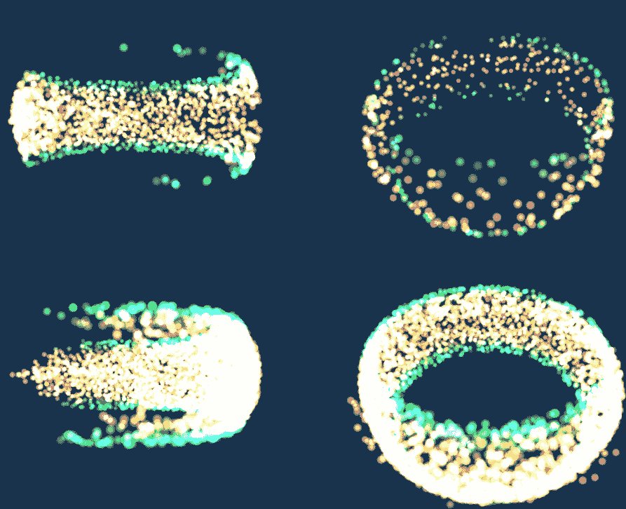

# 参见

+   在第一章，“实例和设备”，查看获取物理设备特性和属性的方法

+   在第五章，“描述符集”，查看以下方法：

    +   *创建存储纹理缓冲区*

    +   *创建描述符集布局*

    +   *创建描述符池*

    +   *分配描述符集*

    +   *更新描述符集*

+   在第七章，“着色器”，查看编写计算着色器的方法

+   在第八章，“图形和计算管线”，查看以下方法：

    +   *创建着色器模块*

    +   *创建计算管线*

    +   *创建图形管线*

+   在第九章，“命令录制和绘制”，查看以下方法：

    +   *通过推送常量向着色器提供数据*

    +   *绘制几何体*

    +   *调度计算工作*

# 渲染细分地形

具有开放世界和长渲染距离的 3D 场景通常也包含广阔的地形。绘制地面是一个非常复杂的话题，可以以许多不同的方式执行。远处的地形不能太复杂，因为它将占用太多的内存和计算能力来显示。另一方面，靠近玩家的区域必须足够详细，以看起来令人信服和自然。这就是为什么我们需要一种方法来随着距离的增加降低细节数量，或者在摄像机附近增加地形的保真度。

这是一个使用细分着色器实现高质量渲染图像的示例。对于地形，我们可以使用具有少量顶点的平面。使用细分着色器，我们可以增加靠近摄像机的地面原素的数量。然后我们可以通过所需的量偏移生成的顶点，以增加或减少地形的高度。

以下截图是使用此配方生成的图像示例：

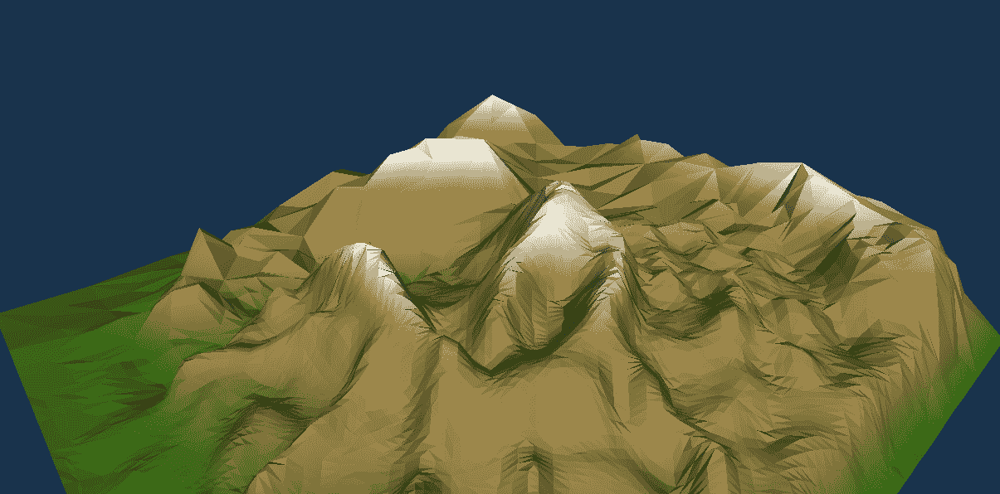

# 准备工作

绘制地形通常需要准备高度数据。这可以即时、根据某些期望的公式进行生成。然而，它也可以以高度图这种纹理的形式提前准备。它包含有关地形相对于指定海拔高度的高度信息，其中较浅的颜色表示较高的高度，较深的颜色表示较低的高度。以下图像显示了此类高度图的一个示例：

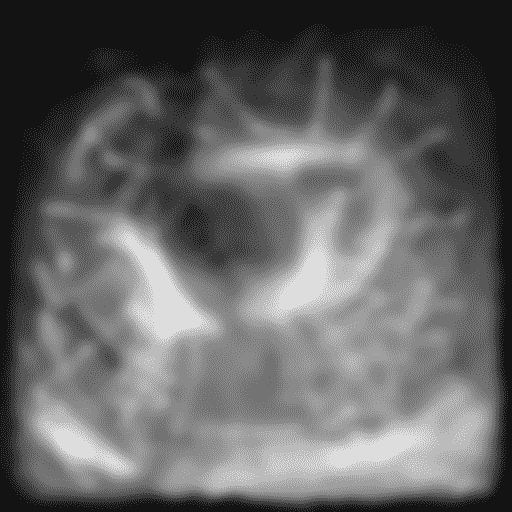

# 如何操作...

1.  加载或生成一个水平对齐的平面模型。需要两个属性——位置和纹理坐标。将顶点数据上传到顶点缓冲区（参考第十章的*从 OBJ 文件加载 3D 模型*配方，*辅助配方*，以及第四章的*创建缓冲区*和*使用阶段缓冲区更新设备本地内存绑定缓冲区*配方，*资源和内存*）。

1.  为两个变换矩阵创建一个统一缓冲区（参考第五章的*创建统一缓冲区*配方，*描述符集*）。

1.  从图像文件加载高度信息（参考第十章的*从文件加载纹理数据*配方，*辅助配方*）。创建一个组合图像采样器并将加载的高度数据复制到图像的内存中（参考第五章的*创建组合图像采样器*配方，*描述符集*，以及第四章的*使用阶段缓冲区更新具有设备本地内存绑定图像*配方，*资源和内存*）。

1.  创建一个描述符集布局，其中包含一个由细分控制和几何阶段访问的统一缓冲区和一个由细分控制和评估阶段访问的联合图像采样器（参考第五章，*描述符集*中的*创建描述符集布局*配方）。使用准备好的布局分配描述符集。使用创建的统一缓冲区和采样器以及图像视图句柄更新它（参考第五章，*描述符集*中的*分配描述符集*和*更新描述符集*配方）。

1.  使用以下 GLSL 代码创建一个顶点着色器，并为其创建一个 SPIR-V 汇编（参考第八章，*图形和计算管线*中的*创建着色器模块*配方）：

```cpp
       #version 450 
       layout( location = 0 ) in vec4 app_position; 
       layout( location = 1 ) in vec2 app_texcoord; 
       layout( location = 0 ) out vec2 vert_texcoord; 

       void main() { 
         gl_Position = app_position; 
         vert_texcoord = app_texcoord; 
       }

```

1.  为一个细分控制阶段创建一个着色器模块。使用以下 GLSL 代码从以下内容生成 SPIR-V 汇编：

```cpp
       #version 450 
       layout( location = 0 ) in vec2 vert_texcoord[]; 
       layout( set = 0, binding = 0 ) uniform UniformBuffer { 
        mat4 ModelViewMatrix; 
        mat4 ProjectionMatrix; 
       }; 

       layout( set = 0, binding = 1 ) uniform sampler2D ImageSampler; 
       layout( vertices = 3 ) out; 
       layout( location = 0 ) out vec2 tesc_texcoord[]; 

       void main() { 
         if( 0 == gl_InvocationID ) { 
           float distances[3]; 
           float factors[3]; 

           for( int i = 0; i < 3; ++i ) { 
             float height = texture( ImageSampler, vert_texcoord[i] 
             ).x; 
             vec4 position = ModelViewMatrix * (gl_in[i].gl_Position + 
             vec4( 0.0, height, 0.0, 0.0 )); 
             distances[i] = dot( position, position ); 
           } 
           factors[0] = min( distances[1], distances[2] ); 
           factors[1] = min( distances[2], distances[0] ); 
           factors[2] = min( distances[0], distances[1] ); 

           gl_TessLevelInner[0] = max( 1.0, 20.0 - factors[0] ); 
           gl_TessLevelOuter[0] = max( 1.0, 20.0 - factors[0] ); 
           gl_TessLevelOuter[1] = max( 1.0, 20.0 - factors[1] ); 
           gl_TessLevelOuter[2] = max( 1.0, 20.0 - factors[2] ); 
         } 
         gl_out[gl_InvocationID].gl_Position = 
         gl_in[gl_InvocationID].gl_Position; 
         tesc_texcoord[gl_InvocationID] = 
         vert_texcoord[gl_InvocationID]; 
       }

```

1.  从以下 GLSL 代码创建一个细分评估着色器，创建一个着色器模块：

```cpp
       #version 450 
       layout( triangles, fractional_even_spacing, cw ) in; 
       layout( location = 0 ) in vec2 tesc_texcoord[]; 
       layout( set = 0, binding = 1 ) uniform sampler2D HeightMap; 
       layout( location = 0 ) out float tese_height; 
       void main() { 
         vec4 position = gl_in[0].gl_Position * gl_TessCoord.x + 
                         gl_in[1].gl_Position * gl_TessCoord.y + 
                         gl_in[2].gl_Position * gl_TessCoord.z; 
         vec2 texcoord = tesc_texcoord[0] * gl_TessCoord.x + 
                         tesc_texcoord[1] * gl_TessCoord.y + 
                         tesc_texcoord[2] * gl_TessCoord.z; 
         float height = texture( HeightMap, texcoord ).x; 
         position.y += height; 
         gl_Position = position; 
         tese_height = height; 
       }

```

1.  为几何着色器创建一个着色器模块，并使用以下 GLSL 代码：

```cpp
       #version 450 

       layout( triangles ) in; 
       layout( location = 0 ) in float tese_height[]; 

       layout( set = 0, binding = 0 ) uniform UniformBuffer { 
         mat4 ModelViewMatrix; 
         mat4 ProjectionMatrix; 
       }; 
       layout( triangle_strip, max_vertices = 3 ) out; 
       layout( location = 0 ) out vec3  geom_normal; 
       layout( location = 1 ) out float geom_height; 

       void main() { 
         vec3 v0v1 = gl_in[1].gl_Position.xyz - 
         gl_in[0].gl_Position.xyz; 
         vec3 v0v2 = gl_in[2].gl_Position.xyz - 
         gl_in[0].gl_Position.xyz; 
         vec3 normal = normalize( cross( v0v1, v0v2 ) ); 

         for( int vertex = 0; vertex < 3; ++vertex ) { 
           gl_Position = ProjectionMatrix * ModelViewMatrix * 
           gl_in[vertex].gl_Position; 
           geom_height = tese_height[vertex]; 
           geom_normal = normal; 
           EmitVertex(); 
         } 

         EndPrimitive(); 
       }

```

1.  创建一个包含片段着色器源代码的着色器模块。从以下 GLSL 代码生成 SPIR-V 汇编：

```cpp
       #version 450 
       layout( location = 0 ) in vec3  geom_normal; 
       layout( location = 1 ) in float geom_height; 
       layout( location = 0 ) out vec4 frag_color; 

       void main() { 
         const vec4 green = vec4( 0.2, 0.5, 0.1, 1.0 ); 
         const vec4 brown = vec4( 0.6, 0.5, 0.3, 1.0 ); 
         const vec4 white = vec4( 1.0 ); 
         vec4 color = mix( green, brown, smoothstep( 0.0, 0.4, 
         geom_height ) ); 
         color = mix( color, white, smoothstep( 0.6, 0.9, geom_height ) 
         ); 

         float diffuse_light = max( 0.0, dot( geom_normal, vec3( 0.58, 
         0.58, 0.58 ) ) ); 
         frag_color = vec4( 0.05, 0.05, 0.0, 0.0 ) + diffuse_light * 
         color; 
       }

```

1.  使用上述五个着色器模块创建一个图形管线。该管线应检索两个顶点属性：一个 3 分量位置和一个 2 分量纹理坐标。它必须使用`VK_PRIMITIVE_TOPOLOGY_PATCH_LIST`原语。一个补丁应包含三个控制点（参考第八章，*图形和计算管线*中的*指定管线输入装配状态*、*指定管线细分状态*、*指定图形管线创建参数*和*创建图形管线*配方）。

1.  创建剩余的资源并绘制几何图形（参考第十一章，*光照*中的*使用顶点漫反射光照渲染几何图形*配方）。

# 它是如何工作的...

我们通过加载一个平坦平面的模型开始绘制地形的绘制过程。它可能是一个带有超过四个顶点的简单四边形。在细分阶段生成过多的顶点可能在性能上过于昂贵，因此我们需要在基本几何的复杂性和细分因子之间找到平衡。我们可以在以下图像中看到用作细分地形基础的平面：

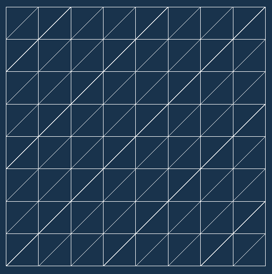

在本例中，我们将从纹理中加载高度信息。我们以与从文件加载数据相同的方式进行此操作。然后我们创建一个联合图像采样器并将加载的数据上传到其内存中：

```cpp
int width = 1; 
int height = 1; 
std::vector<unsigned char> image_data; 
if( !LoadTextureDataFromFile( "Data/Textures/heightmap.png", 4, image_data, &width, &height ) ) { 
  return false; 
} 

InitVkDestroyer( LogicalDevice, HeightSampler ); 
InitVkDestroyer( LogicalDevice, HeightMap ); 
InitVkDestroyer( LogicalDevice, HeightMapMemory ); 
InitVkDestroyer( LogicalDevice, HeightMapView ); 
if( !CreateCombinedImageSampler( PhysicalDevice, *LogicalDevice, VK_IMAGE_TYPE_2D, VK_FORMAT_R8G8B8A8_UNORM, { (uint32_t)width, (uint32_t)height, 1 }, 
  1, 1, VK_IMAGE_USAGE_SAMPLED_BIT | VK_IMAGE_USAGE_TRANSFER_DST_BIT, VK_IMAGE_VIEW_TYPE_2D, VK_IMAGE_ASPECT_COLOR_BIT, VK_FILTER_LINEAR, 
  VK_FILTER_LINEAR, VK_SAMPLER_MIPMAP_MODE_NEAREST, VK_SAMPLER_ADDRESS_MODE_CLAMP_TO_EDGE, VK_SAMPLER_ADDRESS_MODE_CLAMP_TO_EDGE, 
  VK_SAMPLER_ADDRESS_MODE_CLAMP_TO_EDGE, 0.0f, false, 1.0f, false, VK_COMPARE_OP_ALWAYS, 0.0f, 1.0f, VK_BORDER_COLOR_FLOAT_OPAQUE_BLACK, 
  false, *HeightSampler, *HeightMap, *HeightMapMemory, *HeightMapView ) ) { 
  return false; 
} 

VkImageSubresourceLayers image_subresource_layer = { 
  VK_IMAGE_ASPECT_COLOR_BIT, 
  0, 
  0, 
  1 
}; 
if( !UseStagingBufferToUpdateImageWithDeviceLocalMemoryBound( PhysicalDevice, *LogicalDevice, static_cast<VkDeviceSize>(image_data.size()), 
&image_data[0], *HeightMap, image_subresource_layer, { 0, 0, 0 }, { (uint32_t)width, (uint32_t)height, 1 }, VK_IMAGE_LAYOUT_UNDEFINED, 
VK_IMAGE_LAYOUT_SHADER_READ_ONLY_OPTIMAL, 0, VK_ACCESS_SHADER_READ_BIT, VK_IMAGE_ASPECT_COLOR_BIT, VK_PIPELINE_STAGE_TOP_OF_PIPE_BIT, 
VK_PIPELINE_STAGE_FRAGMENT_SHADER_BIT, GraphicsQueue.Handle, FrameResources.front().CommandBuffer, {} ) ) { 
return false; 
}

```

还需要一个包含变换矩阵的统一缓冲区，以便将顶点从局部空间变换到视图空间和裁剪空间：

```cpp
InitVkDestroyer( LogicalDevice, UniformBuffer ); 
InitVkDestroyer( LogicalDevice, UniformBufferMemory ); 
if( !CreateUniformBuffer( PhysicalDevice, *LogicalDevice, 2 * 16 * sizeof( float ), VK_BUFFER_USAGE_TRANSFER_DST_BIT | VK_BUFFER_USAGE_UNIFORM_BUFFER_BIT, 
  *UniformBuffer, *UniformBufferMemory ) ) { 
  return false; 
} 

if( !UpdateStagingBuffer( true ) ) { 
  return false; 
}

```

下一步是为统一缓冲区和组合图像采样器创建描述符集。统一缓冲区在镶嵌控制和几何阶段被访问。高度信息在镶嵌控制和评估阶段读取：

```cpp
std::vector<VkDescriptorSetLayoutBinding> descriptor_set_layout_bindings = { 
  { 
    0, 
    VK_DESCRIPTOR_TYPE_UNIFORM_BUFFER, 
    1, 
    VK_SHADER_STAGE_TESSELLATION_CONTROL_BIT | VK_SHADER_STAGE_GEOMETRY_BIT, 
    nullptr 
  }, 
  { 
    1, 
    VK_DESCRIPTOR_TYPE_COMBINED_IMAGE_SAMPLER, 
    1, 
    VK_SHADER_STAGE_TESSELLATION_CONTROL_BIT | VK_SHADER_STAGE_TESSELLATION_EVALUATION_BIT, 
    nullptr 
  } 
}; 
InitVkDestroyer( LogicalDevice, DescriptorSetLayout ); 
if( !CreateDescriptorSetLayout( *LogicalDevice, descriptor_set_layout_bindings, *DescriptorSetLayout ) ) { 
  return false; 
} 

std::vector<VkDescriptorPoolSize> descriptor_pool_sizes = { 
  { 
    VK_DESCRIPTOR_TYPE_UNIFORM_BUFFER, 
    1 
  }, 
  { 
    VK_DESCRIPTOR_TYPE_COMBINED_IMAGE_SAMPLER, 
    2 
  } 
}; 
InitVkDestroyer( LogicalDevice, DescriptorPool ); 
if( !CreateDescriptorPool( *LogicalDevice, false, 1, descriptor_pool_sizes, *DescriptorPool ) ) { 
  return false; 
} 

if( !AllocateDescriptorSets( *LogicalDevice, *DescriptorPool, { *DescriptorSetLayout }, DescriptorSets ) ) { 
  return false; 
}

```

接下来，我们可以使用统一缓冲区句柄以及采样器和图像视图句柄更新描述符集，因为它们在我们的应用程序生命周期内不会改变（也就是说，当窗口大小修改时，我们不需要重新创建它们）。

```cpp
BufferDescriptorInfo buffer_descriptor_update = { 
  DescriptorSets[0], 
  0, 
  0, 
  VK_DESCRIPTOR_TYPE_UNIFORM_BUFFER, 
  { 
    { 
      *UniformBuffer, 
      0, 
      VK_WHOLE_SIZE 
    } 
  } 
}; 

std::vector<ImageDescriptorInfo> image_descriptor_updates = { 
  { 
    DescriptorSets[0], 
    1, 
    0, 
    VK_DESCRIPTOR_TYPE_COMBINED_IMAGE_SAMPLER, 
    { 
      { 
        *HeightSampler, 
        *HeightMapView, 
        VK_IMAGE_LAYOUT_SHADER_READ_ONLY_OPTIMAL 
      } 
    } 
  } 
}; 

UpdateDescriptorSets( *LogicalDevice, image_descriptor_updates, { buffer_descriptor_update }, {}, {} );

```

下一步是创建图形管线。这次我们有一个非常复杂的管线，所有五个可编程图形阶段都被启用：

```cpp
std::vector<ShaderStageParameters> shader_stage_params = { 
  { 
    VK_SHADER_STAGE_VERTEX_BIT, 
    *vertex_shader_module, 
    "main", 
    nullptr 
  }, 
  { 
    VK_SHADER_STAGE_TESSELLATION_CONTROL_BIT, 
    *tessellation_control_shader_module, 
    "main", 
    nullptr 
},
  { 
    VK_SHADER_STAGE_TESSELLATION_EVALUATION_BIT, 
    *tessellation_evaluation_shader_module, 
    "main", 
    nullptr 
  }, 
  { 
    VK_SHADER_STAGE_GEOMETRY_BIT, 
    *geometry_shader_module, 
    "main", 
    nullptr 
  }, 
  { 
    VK_SHADER_STAGE_FRAGMENT_BIT, 
    *fragment_shader_module, 
    "main", 
    nullptr 
  } 

}; 

std::vector<VkPipelineShaderStageCreateInfo> shader_stage_create_infos; 
SpecifyPipelineShaderStages( shader_stage_params, shader_stage_create_infos );

```

为什么我们需要所有五个阶段？顶点着色器始终是必需的。这次它只读取两个输入属性（位置和 texcoord）并将其传递到管线中。

当启用镶嵌时，我们需要控制和评估着色器阶段。镶嵌控制着色器，正如其名称所暗示的，控制处理补丁的镶嵌级别（生成的顶点数量）。在这个菜谱中，我们根据从摄像机到距离生成顶点：补丁的顶点越靠近摄像机，镶嵌器生成的顶点就越多。这样，远处的地形简单，不需要太多处理能力来渲染；但是，越靠近摄像机，地形就越复杂。

我们不能为整个补丁（在这种情况下是一个三角形）选择一个镶嵌级别。当两个相邻的三角形以不同的因子进行镶嵌时，它们在公共边上的顶点数量将不同。每个三角形的顶点将放置在不同的位置，并且它们将以不同的值偏移。这将在我们的大地上造成空洞：

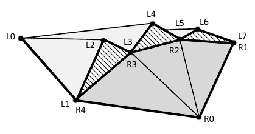

在前面的图像中，我们看到两个三角形：左边由顶点 L0-L1-L7 组成，右边由顶点 R0-R1-R4 组成。其他顶点由镶嵌器生成。三角形共享一条边：L1-L7 或 R1-R4（点 L1 和 R4 表示同一个顶点；同样，点 L7 和 R1 表示同一个顶点）；但是，边以不同的因子进行镶嵌。这会在由两个三角形形成的表面上造成不连续性（由条纹表示）。

为了避免这个问题，我们需要为每个三角形边计算一个镶嵌因子，使其在共享相同边的三角形之间保持固定。在这个例子中，我们将根据顶点到摄像机的距离来计算镶嵌因子。我们将对三角形中的所有顶点都这样做。然后，对于给定的三角形边，我们将选择一个更大的镶嵌因子，该因子是从边的某个顶点计算出来的：

```cpp
float distances[3]; 
float factors[3]; 

for( int i = 0; i < 3; ++i ) { 
  float height = texture( ImageSampler, vert_texcoord[i] ).x; 
  vec4 position = ModelViewMatrix * (gl_in[i].gl_Position + vec4( 0.0, 
  height, 0.0, 0.0 )); 
  distances[i] = dot( position, position ); 
} 
factors[0] = min( distances[1], distances[2] ); 
factors[1] = min( distances[2], distances[0] ); 
factors[2] = min( distances[0], distances[1] ); 

gl_TessLevelInner[0] = max( 1.0, 20.0 - factors[0] ); 
gl_TessLevelOuter[0] = max( 1.0, 20.0 - factors[0] ); 
gl_TessLevelOuter[1] = max( 1.0, 20.0 - factors[1] ); 
gl_TessLevelOuter[2] = max( 1.0, 20.0 - factors[2] );

```

在前面的镶嵌控制着色器代码中，我们计算了所有顶点到摄像机的距离（平方）。我们需要通过从高度图中读取的值来偏移位置，以确保整个补丁位于正确的位置，并且距离被正确计算。

接下来，对于所有三角形边，我们取两个顶点之间的较小距离。因为我们希望细分因子随着距离的减小而增加，所以我们需要反转计算出的因子。在这里，我们取一个硬编码的值`20`并减去一个选定的距离值。因为我们不希望细分因子小于`1.0`，所以我们执行额外的钳位。

这样计算的细分因子会随着生成顶点数量的增加而减小，这是故意为之，以便我们可以看到三角形是如何细分的，以及细节数量在相机附近的增加情况。然而，在实际示例中，我们应该准备这样的公式，以便效果几乎不可见。

接下来，一个细分评估着色器根据生成的顶点的权重来计算新顶点的有效位置。我们同样对纹理坐标进行相同的处理，因为我们需要从高度图中加载高度信息：

```cpp
vec4 position = gl_in[0].gl_Position * gl_TessCoord.x + 
                gl_in[1].gl_Position * gl_TessCoord.y + 
                gl_in[2].gl_Position * gl_TessCoord.z; 

vec2 texcoord = tesc_texcoord[0] * gl_TessCoord.x + 
                tesc_texcoord[1] * gl_TessCoord.y + 
                tesc_texcoord[2] * gl_TessCoord.z;

```

在计算出新顶点的位置后，我们需要对其进行偏移，以便顶点位于适当的高度：

```cpp
float height = texture( HeightMap, texcoord ).x; 
position.y += height; 
gl_Position = position;

```

细分评估着色器阶段之后是几何着色器阶段。我们可以省略它，但在这里我们使用它来计算生成三角形的法向量。我们为三角形的所有顶点取一个法向量，因此在这个示例中我们将执行平面着色。

法向量是通过`cross()`函数计算的，该函数接受两个向量并返回一个垂直于所提供向量的向量。我们提供形成三角形两条边的向量：

```cpp
vec3 v0v1 = gl_in[1].gl_Position.xyz - gl_in[0].gl_Position.xyz; 
vec3 v0v2 = gl_in[2].gl_Position.xyz - gl_in[0].gl_Position.xyz; 
vec3 normal = normalize( cross( v0v1, v0v2 ) );

```

最后，几何着色器计算所有顶点的裁剪空间位置并将它们发出：

```cpp
for( int vertex = 0; vertex < 3; ++vertex ) { 
  gl_Position = ProjectionMatrix * ModelViewMatrix * gl_in[vertex].gl_Position; 
  geom_height = tese_height[vertex]; 
  geom_normal = normal; 
  EmitVertex(); 
} 

EndPrimitive();

```

为了简化配方，片段着色器也很简单。它根据地面以上的高度混合三种颜色：下部的草地为绿色，中间的岩石为灰色/棕色，山顶的雪为白色。它还使用漫射/朗伯光照模型进行简单的光照计算。

前面的着色器形成了一个用于绘制细分地形的图形管道。在创建管道期间，我们必须记住要考虑原语拓扑。由于启用了细分阶段，我们需要使用`VK_PRIMITIVE_TOPOLOGY_PATCH_LIST`拓扑。我们还需要在创建管道期间提供细分状态。因为我们想对三角形进行操作，所以我们指定一个补丁包含三个控制点：

```cpp
VkPipelineInputAssemblyStateCreateInfo input_assembly_state_create_info; 
SpecifyPipelineInputAssemblyState( VK_PRIMITIVE_TOPOLOGY_PATCH_LIST, false, input_assembly_state_create_info ); 
VkPipelineTessellationStateCreateInfo tessellation_state_create_info; 
SpecifyPipelineTessellationState( 3, tessellation_state_create_info );

```

用于管道创建的其余参数以通常的方式定义。我们也不需要在渲染期间做任何特殊的事情。我们只需使用先前绑定的图形管道绘制一个平面，我们应该看到一个类似地形的几何形状。我们可以在以下图像中看到使用此配方生成的结果示例：

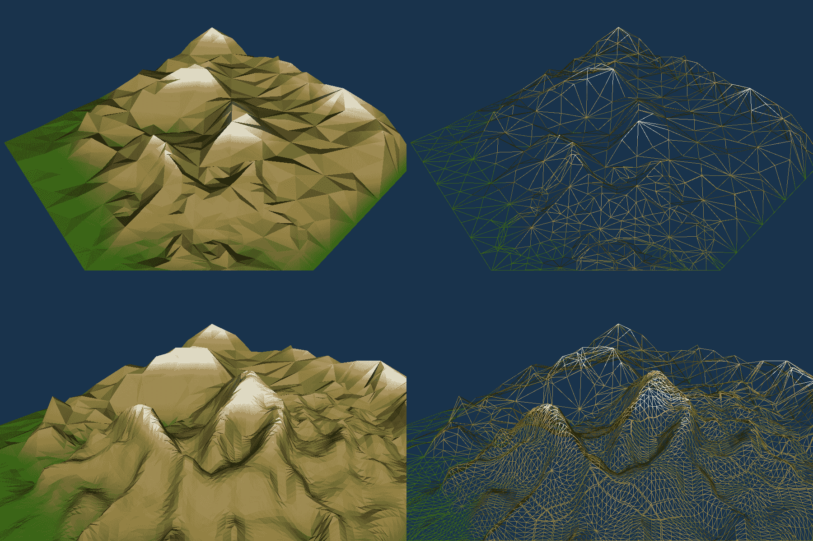

# 参见

+   在第四章，*资源和内存*，查看*创建缓冲区*配方

+   在第五章，*描述符集*中，查看以下配方：

    +   *创建组合图像采样器*

    +   *创建统一缓冲区*

    +   *创建描述符集布局*

    +   *分配描述符集*

    +   *更新描述符集*

+   在第七章，*着色器*中，查看以下配方：

    +   *编写细分控制着色器*

    +   *编写细分评估着色器*

    +   *编写几何着色器*

+   在第八章，*图形和计算管线*中，查看以下配方：

    +   *创建着色器模块*

    +   *指定管线输入装配状态*

    +   *指定管线细分状态*

    +   *创建图形管线*

+   在第十章，*辅助配方*中，查看以下配方：

    +   *从文件中加载纹理数据*

    +   *从 OBJ 文件加载 3D 模型*

+   在第十一章，*光照*中，查看*使用顶点漫反射光照配方渲染几何体*

# 渲染全屏四边形进行后期处理

图像处理是 3D 图形中常用的一类技术。人眼感知周围世界的方式几乎无法直接模拟。有许多效果仅通过绘制几何形状是无法显示的。例如，亮区似乎比暗区大（这通常被称为光晕）；在我们焦点处的物体看起来很清晰，但距离焦点越远，这些物体变得越模糊或模糊（我们称这种效果为景深）；颜色在白天和夜晚的感知可能不同，当光线非常微弱时，一切似乎都带有更多的蓝色。

这些现象很容易作为后期处理效果实现。我们通常将场景渲染到图像中。之后，我们进行另一次渲染，这次是使用存储在图像中的数据，并按照选择的算法进行处理。要渲染图像，我们需要将其放置在一个覆盖整个场景的四边形上。这种几何形状通常被称为全屏四边形。

# 如何做到这一点...

1.  准备四边形的几何顶点数据。使用以下值（如有需要，请添加纹理坐标）：

    +   `{ -1.0f, -1.0f, 0.0f }` 为左上角顶点

    +   `{ -1.0f, 1.0f, 0.0f }` 为左下角顶点

    +   `{ 1.0f, -1.0f, 0.0f }` 为右上角顶点

    +   `{ 1.0f, 1.0f, 0.0f }` 为右下角顶点

1.  创建一个作为顶点缓冲区的缓冲区。分配一个内存对象并将其绑定到缓冲区。使用阶段资源（参考第四章，*资源和内存*中的*创建缓冲区*、*分配和绑定内存对象到缓冲区*和*使用阶段缓冲区更新绑定设备本地内存的缓冲区*）将顶点数据上传到缓冲区。

1.  创建一个组合图像采样器。请记住，根据图像在渲染和后期处理期间将被访问的方式提供有效的用途：将场景渲染到图像中需要一个`VK_IMAGE_USAGE_COLOR_ATTACHMENT_BIT`；采样图像（使用采样器读取数据）需要一个`VK_IMAGE_USAGE_SAMPLED_BIT`；对于图像加载/存储，我们必须提供一个`VK_IMAGE_USAGE_STORAGE_BIT`；可能还需要其他用途（参考第五章，*描述符集*中*创建组合图像采样器*的配方）。

1.  创建一个包含一个组合图像采样器的描述符集布局。创建一个描述符池，并使用创建的布局从其中分配一个描述符集。使用图像视图的句柄和采样器更新描述符集。每次应用程序窗口大小调整且图像被重新创建时都要这样做（参考第五章，*描述符集*中的*创建描述符集布局*、*创建描述符池*、*分配描述符集*和*更新描述符集*的配方）。

1.  如果我们想要访问许多不同的图像坐标，创建一个单独的、专用的渲染通道，其中包含一个颜色附件和至少一个子通道（参考第六章，*渲染通道和帧缓冲区*中的*指定附件描述*、*指定子通道描述*、*指定子通道之间的依赖关系*和*创建渲染通道*的配方）。

1.  使用以下 GLSL 代码创建一个顶点着色器，并为其创建一个 SPIR-V 汇编模块（参考第八章，*创建着色器模块*）：

```cpp
       #version 450 
       layout( location = 0 ) in vec4 app_position; 
       void main() { 
         gl_Position = app_position; 
       }

```

1.  使用以下 GLSL 代码创建一个片段着色器：

```cpp
       #version 450 
       layout( set = 0, binding = 0 ) uniform sampler2D Image; 
       layout( location = 0 ) out vec4 frag_color; 
       void main() { 
        vec4 color = vec4( 0.5 ); 
        color -= texture( Image, gl_FragCoord.xy + vec2( -1.0,  0.0 ) ); 
        color += texture( Image, gl_FragCoord.xy + vec2(  1.0,  0.0 ) ); 

        color -= texture( Image, gl_FragCoord.xy + vec2(  0.0, -1.0 ) ); 
        color += texture( Image, gl_FragCoord.xy + vec2(  0.0,  1.0 ) ); 

        frag_color = abs( 0.5 - color ); 
       }

```

1.  使用前面的着色器模块创建一个图形管线。它必须读取一个顶点属性，包含顶点位置（以及可能的一个包含纹理坐标的第二个属性）。使用`VK_PRIMITIVE_TOPOLOGY_TRIANGLE_STRIP`拓扑，并禁用面剔除（参考第八章，*指定管线顶点输入状态*、*指定管线输入装配状态*、*指定管线光栅化状态*和*创建图形管线*的配方）。

1.  将场景渲染到创建的图像中。接下来，开始另一个渲染通道，并使用准备好的图形管线绘制全屏四边形（参考第六章，*渲染通道和帧缓冲区*中的*开始渲染通道*和*结束渲染通道*配方，第五章，*描述符集*中的*绑定描述符集*配方，以及第九章，*命令记录和绘制*中的*绑定顶点缓冲区*和*绘制几何体*配方）。

# 它是如何工作的...

可以使用计算着色器执行图像后处理。然而，当我们想在屏幕上显示图像时，我们必须使用交换链。从着色器内部存储数据到图像中要求创建具有存储图像用法的图像。不幸的是，这种用法可能不支持交换链图像，因此需要创建额外的中间资源，这进一步增加了代码的复杂性。

使用图形管线允许我们在片段着色器内部处理图像数据并将结果存储在颜色附件中。这种用法对于交换链图像是强制性的，因此使用 Vulkan API 实现的图像处理感觉更自然。另一方面，图形管线要求我们绘制几何体，因此我们不仅需要顶点数据、顶点和片段着色器，还需要一个渲染通道和一个帧缓冲区。这就是为什么使用计算着色器可能更高效。所以，一切取决于图形硬件（可用的交换链图像用法）和给定情况支持的功能。

在这个食谱中，我们将介绍在图像后处理阶段绘制全屏四边形的方法。首先，我们需要顶点数据本身。它可以直接在裁剪空间中准备。这样我们可以创建一个更简单的顶点着色器，并避免将顶点位置乘以投影矩阵。在透视除法之后，为了使顶点适合视图，它们位置中的 `x` 和 `y` 分量存储的值必须适合 `<-1, 1>` 范围（包含）内，而 `z` 分量中的值必须在 `<0, 1>` 范围内。因此，如果我们想覆盖整个屏幕，我们需要以下顶点集：

```cpp
std::vector<float> vertices = { 
  -1.0f, -1.0f, 0.0f, 
  -1.0f,  1.0f, 0.0f, 
   1.0f, -1.0f, 0.0f, 
   1.0f,  1.0f, 0.0f, 
};

```

如果需要，我们可以添加归一化纹理坐标，或者我们可以依赖内置的 `gl_FragCoord` 值（当编写 GLSL 着色器时），它包含当前正在处理的着色器的屏幕坐标。当我们使用输入附件时，甚至不需要纹理坐标，因为我们只能访问与当前正在处理的片段关联的样本。

顶点数据需要存储在一个作为顶点缓冲区的缓冲区中。因此，我们需要创建它，分配一个内存对象并将其绑定到缓冲区，然后将顶点数据上传到缓冲区：

```cpp
InitVkDestroyer( LogicalDevice, VertexBuffer ); 
if( !CreateBuffer( *LogicalDevice, sizeof( vertices[0] ) * vertices.size(), VK_BUFFER_USAGE_TRANSFER_DST_BIT | VK_BUFFER_USAGE_VERTEX_BUFFER_BIT, *VertexBuffer ) ) { 
  return false; 
} 

InitVkDestroyer( LogicalDevice, BufferMemory ); 
if( !AllocateAndBindMemoryObjectToBuffer( PhysicalDevice, *LogicalDevice, *VertexBuffer, VK_MEMORY_PROPERTY_DEVICE_LOCAL_BIT, *BufferMemory ) ) { 
  return false; 
} 

if( !UseStagingBufferToUpdateBufferWithDeviceLocalMemoryBound( PhysicalDevice, *LogicalDevice, sizeof( vertices[0] ) * vertices.size(), &vertices[0], *VertexBuffer, 0, 0, 
  VK_ACCESS_VERTEX_ATTRIBUTE_READ_BIT, VK_PIPELINE_STAGE_TOP_OF_PIPE_BIT, VK_PIPELINE_STAGE_VERTEX_INPUT_BIT, GraphicsQueue.Handle, FrameResources.front().CommandBuffer, {} ) ) { 
  return false;

```

接下来，我们需要一种方法来访问片段着色器内部的光栅数据。如果我们想从同一渲染通道的先前子通道中访问存储在颜色附件中的数据，我们可以使用一个输入附件。我们可以使用一个存储图像，分离采样器和采样图像，或者使用一个组合图像采样器。后一种在本食谱中使用。为了简化这个食谱和代码，我们从文件中读取纹理数据。但通常我们会有一个图像，场景将被渲染到这个图像中：

```cpp
int width = 1; 
int height = 1; 
std::vector<unsigned char> image_data; 
if( !LoadTextureDataFromFile( "Data/Textures/sunset.jpg", 4, image_data, &width, &height ) ) { 
  return false; 
} 

InitVkDestroyer( LogicalDevice, Sampler ); 
InitVkDestroyer( LogicalDevice, Image ); 
InitVkDestroyer( LogicalDevice, ImageMemory ); 
InitVkDestroyer( LogicalDevice, ImageView ); 
if( !CreateCombinedImageSampler( PhysicalDevice, *LogicalDevice, VK_IMAGE_TYPE_2D, VK_FORMAT_R8G8B8A8_UNORM, { (uint32_t)width, (uint32_t)height, 1 }, 
  1, 1, VK_IMAGE_USAGE_SAMPLED_BIT | VK_IMAGE_USAGE_TRANSFER_DST_BIT, VK_IMAGE_VIEW_TYPE_2D, VK_IMAGE_ASPECT_COLOR_BIT, VK_FILTER_NEAREST, 
  VK_FILTER_NEAREST, VK_SAMPLER_MIPMAP_MODE_NEAREST, VK_SAMPLER_ADDRESS_MODE_CLAMP_TO_EDGE, VK_SAMPLER_ADDRESS_MODE_CLAMP_TO_EDGE, 
  VK_SAMPLER_ADDRESS_MODE_CLAMP_TO_EDGE, 0.0f, false, 1.0f, false, VK_COMPARE_OP_ALWAYS, 0.0f, 1.0f, VK_BORDER_COLOR_FLOAT_OPAQUE_BLACK, true, 
  *Sampler, *Image, *ImageMemory, *ImageView ) ) { 
  return false; 
} 

VkImageSubresourceLayers image_subresource_layer = { 
  VK_IMAGE_ASPECT_COLOR_BIT, 
  0, 
  0, 
  1 
}; 
if( !UseStagingBufferToUpdateImageWithDeviceLocalMemoryBound( PhysicalDevice, *LogicalDevice, static_cast<VkDeviceSize>(image_data.size()), 
  &image_data[0], *Image, image_subresource_layer, { 0, 0, 0 }, { (uint32_t)width, (uint32_t)height, 1 }, VK_IMAGE_LAYOUT_UNDEFINED, 
  VK_IMAGE_LAYOUT_SHADER_READ_ONLY_OPTIMAL, 0, VK_ACCESS_SHADER_READ_BIT, VK_IMAGE_ASPECT_COLOR_BIT, VK_PIPELINE_STAGE_TOP_OF_PIPE_BIT, 
  VK_PIPELINE_STAGE_FRAGMENT_SHADER_BIT, GraphicsQueue.Handle, FrameResources.front().CommandBuffer, {} ) ) { 
  return false; 
}

```

在前面的代码中，我们创建了一个组合图像采样器，并指定我们将使用非归一化纹理坐标来访问它。通常我们提供坐标在<0.0, 1.0>范围内（包含）。这样我们就不必担心图像的大小。另一方面，对于后期处理，我们通常希望使用屏幕空间坐标来引用纹理图像，这就是使用非归一化纹理坐标的时候——它们对应于图像的尺寸。

要访问一个图像，我们还需要一个描述符集。我们不需要统一缓冲区，因为我们没有变换几何图形，绘制出的顶点已经处于正确的空间（裁剪空间）。在我们能够分配描述符集之前，我们创建一个布局，其中包含一个在片段着色器阶段访问的组合图像采样器。之后，创建一个池，并从池中分配一个描述符集：

```cpp
VkDescriptorSetLayoutBinding descriptor_set_layout_binding = { 
  0, 
  VK_DESCRIPTOR_TYPE_COMBINED_IMAGE_SAMPLER, 
  1, 
  VK_SHADER_STAGE_FRAGMENT_BIT, 
  nullptr 
}; 
InitVkDestroyer( LogicalDevice, DescriptorSetLayout ); 
if( !CreateDescriptorSetLayout( *LogicalDevice, { descriptor_set_layout_binding }, *DescriptorSetLayout ) ) { 
  return false; 
} 

VkDescriptorPoolSize descriptor_pool_size = { 
  VK_DESCRIPTOR_TYPE_COMBINED_IMAGE_SAMPLER, 
  1 
}; 
InitVkDestroyer( LogicalDevice, DescriptorPool ); 
if( !CreateDescriptorPool( *LogicalDevice, false, 1, { descriptor_pool_size }, *DescriptorPool ) ) { 
  return false; 
} 

if( !AllocateDescriptorSets( *LogicalDevice, *DescriptorPool, { *DescriptorSetLayout }, DescriptorSets ) ) { 
  return false; 
} 

ImageDescriptorInfo image_descriptor_update = { 
  DescriptorSets[0], 
  0, 
  0, 
  VK_DESCRIPTOR_TYPE_COMBINED_IMAGE_SAMPLER, 
  { 
    { 
      *Sampler, 
      *ImageView, 
      VK_IMAGE_LAYOUT_SHADER_READ_ONLY_OPTIMAL 
    } 
  } 
}; 

UpdateDescriptorSets( *LogicalDevice, { image_descriptor_update }, {}, {}, {} );

```

在前面的代码中，我们还使用创建的采样器和图像视图的句柄更新了描述符集。不幸的是，我们将场景渲染到其中的图像通常适合屏幕。这意味着当应用程序窗口的大小改变时，我们必须重新创建它。为此，我们必须销毁旧图像并创建一个具有新尺寸的新图像。在这样操作之后，我们必须再次使用新图像的句柄（采样器不需要重新创建）来更新描述符集。因此，我们必须记住每次应用程序窗口大小改变时都要更新描述符集。

最后一件事情是创建一个图形管线。它只使用两个着色器阶段：顶点和片段。顶点着色器获取的属性数量取决于我们是否需要纹理坐标（以及其他专用属性）。全屏四边形的几何形状应该使用`VK_PRIMITIVE_TOPOLOGY_TRIANGLE_STRIP`拓扑来绘制。我们也不需要任何混合。

后期处理最重要的部分是在片段着色器中执行的。要完成的工作取决于我们想要实现的技术。在这个菜谱中，我们展示了一个边缘检测算法：

```cpp
vec4 color = vec4( 0.5 ); 

color -= texture( Image, gl_FragCoord.xy + vec2( -1.0,  0.0 ) ); 
color += texture( Image, gl_FragCoord.xy + vec2(  1.0,  0.0 ) ); 

color -= texture( Image, gl_FragCoord.xy + vec2(  0.0, -1.0 ) ); 
color += texture( Image, gl_FragCoord.xy + vec2(  0.0,  1.0 ) ); 

frag_color = abs( 0.5 - color );

```

在前面的片段着色器代码中，我们采样处理中的片段周围的四个值。我们从左侧的一个样本中取一个负值，并添加从右侧的一个样本中读取的值。这样我们就知道水平方向上样本之间的差异。当差异很大时，我们知道存在一个边缘。

我们对垂直方向进行相同的操作，以便检测水平线（使用垂直差分或梯度来检测水平边缘；水平梯度使我们能够检测垂直边缘）。之后，我们在输出变量中存储一个值。我们还会取`abs()`值，但这只是为了可视化目的。

在前面的片段着色器中，我们访问多个纹理坐标。这可以在组合图像采样器（输入附件使我们能够访问与正在处理的片段相关联的单个坐标）。然而，要将图像绑定到描述符集作为资源而不是输入附件，我们必须结束当前的渲染过程并开始另一个。在给定的渲染过程中，图像不能同时用于附件和任何其他非附件目的。

使用前面的设置，我们应该看到以下结果（在右侧），左侧是原始图像：


# 参见

+   在第四章，*资源和内存*，查看以下食谱：

    +   *创建缓冲区*

    +   *分配和绑定内存对象到缓冲区*

    +   *使用阶段缓冲区更新绑定到设备本地内存的缓冲区*

+   在第五章，*描述符集*，查看以下食谱：

    +   *创建组合图像采样器*

    +   *创建描述符集布局*

    +   *分配描述符集*

    +   *绑定描述符集*

    +   *更新描述符集*

+   在第六章，*渲染过程和帧缓冲区*，查看以下食谱：

    +   *开始渲染过程*

    +   *结束渲染过程*

+   在第八章，*图形和计算管线*，查看以下食谱：

    +   *创建着色器模块*

    +   *指定管线顶点输入状态*

    +   *指定管线输入装配状态*

    +   *指定管线光栅化状态*

    +   *创建图形管线*

+   在第九章，*命令录制和绘制*，查看以下食谱：

    +   *绑定顶点缓冲区*

    +   *绘制几何体*

# 使用输入附件进行颜色校正后处理效果

在 3D 应用程序中使用了许多不同的后处理技术。颜色校正就是其中之一。这相对简单，但可以产生令人印象深刻的成果，并大大提升渲染场景的外观和感觉。颜色校正可以改变场景的氛围，并诱导用户产生预期的感受。

通常，颜色校正效果需要我们读取单个当前处理样本的数据。得益于这一特性，我们可以使用输入附件来实现此效果。这允许我们在渲染整个场景的同一渲染过程中执行后处理，从而提高我们应用程序的性能。

以下是一个使用此食谱生成的图像示例：


# 如何做到...

1.  创建一个全屏四边形，并在后处理阶段需要额外的资源（参考*渲染全屏四边形进行后处理*食谱）。

1.  创建一个描述符集布局，其中包含一个在片段着色器阶段访问的输入附件。使用准备好的布局分配一个描述符集（参考第五章“描述符集”中的*创建描述符集布局*和*分配描述符集*配方）。

1.  创建一个 2D 图像（包括内存对象和图像视图），场景将绘制到其中。在创建图像时，不仅要指定`VK_IMAGE_USAGE_COLOR_ATTACHMENT_BIT`使用，还要指定`VK_IMAGE_USAGE_INPUT_ATTACHMENT_BIT`使用。每次应用程序窗口大小调整时都要重新创建图像（参考第五章“描述符集”中的*创建输入附件*配方）。

1.  使用创建的图像句柄通过输入附件更新描述符集。每次应用程序窗口大小调整和图像重新创建时都要这样做（参考第五章“描述符集”中的*更新描述符集*配方）。

1.  准备所有正常渲染场景所需的资源。在创建用于渲染场景的渲染传递时，在渲染传递的末尾添加一个额外的子传递。指定先前子传递中使用的附件作为颜色附件，在额外子传递中作为输入附件。在额外子传递中应使用 swapchain 图像作为颜色附件（参考第六章“渲染传递和帧缓冲区”中的*指定子传递描述*和*创建渲染传递*配方）。

1.  使用以下 GLSL 代码创建一个顶点着色器模块（参考第八章“图形和计算管线”中的*创建着色器模块*配方）。

```cpp
       #version 450 
       layout( location = 0 ) in vec4 app_position; 
       void main() { 
         gl_Position = app_position; 
       }

```

1.  使用以下 GLSL 代码创建一个片段着色器模块：

```cpp
       #version 450 
       layout( input_attachment_index = 0, set = 0, binding = 0 ) 
       uniform subpassInput InputAttachment; 
       layout( location = 0 ) out vec4 frag_color; 

       void main() { 
         vec4 color = subpassLoad( InputAttachment ); 
         float grey = dot( color.rgb, vec3( 0.2, 0.7, 0.1 ) ); 
         frag_color = grey * vec4( 1.5, 1.0, 0.5, 1.0 ); 
       }

```

1.  创建一个用于绘制后处理阶段的图形管线。使用前面的顶点和片段着色器模块。根据*渲染全屏四边形进行后处理*配方准备其余的管线参数。

1.  在动画的每一帧中，将场景正常渲染到创建的图像中，然后进入下一个子通道（参考第六章的*进入下一个子通道*配方，*渲染通道和帧缓冲区*）。绑定用于后处理的创建的图形管线，绑定带有输入附加的描述符集，绑定包含全屏四边形数据的顶点缓冲区，并绘制全屏四边形（参考第五章的*绑定描述符集*配方，*描述符集*，以及第八章的*绑定管线对象*配方，*图形和计算管线*，以及第九章的*绑定顶点缓冲区和绘制几何体*配方，*命令记录和绘制*）。

# 它是如何工作的...

创建一个在场景渲染的同一渲染通道内渲染的后处理效果分为两个步骤。

在第一步中，我们需要为基本场景准备资源：其几何形状、纹理、描述符集和管线对象等。在第二步中，我们按照*渲染全屏四边形用于后处理*配方进行全屏四边形的相同操作。

仅为了后处理阶段准备的两个最重要的资源是一个图像和一个图形管线。当以正常方式渲染场景时，图像将作为颜色附加使用。我们只需将场景渲染到图像中，而不是渲染到交换链图像中。图像必须在场景渲染期间作为颜色附加使用，同时在后处理期间作为输入附加使用。我们还必须记住在应用程序窗口大小改变时重新创建它：

```cpp
InitVkDestroyer( LogicalDevice, SceneImage ); 
InitVkDestroyer( LogicalDevice, SceneImageMemory ); 
InitVkDestroyer( LogicalDevice, SceneImageView ); 
if( !CreateInputAttachment( PhysicalDevice, *LogicalDevice, VK_IMAGE_TYPE_2D, Swapchain.Format, { Swapchain.Size.width, 
Swapchain.Size.height, 1 }, VK_IMAGE_USAGE_COLOR_ATTACHMENT_BIT | VK_IMAGE_USAGE_INPUT_ATTACHMENT_BIT, VK_IMAGE_VIEW_TYPE_2D, 
VK_IMAGE_ASPECT_COLOR_BIT, *SceneImage, *SceneImageMemory, *SceneImageView ) ) { 
return false; 
}

```

将图像作为输入附加访问需要我们使用描述符集。它必须包含至少我们的输入附加，因此我们需要创建一个适当的布局。输入附加只能在片段着色器中访问，因此创建描述符集布局、描述符池和分配描述符集可能看起来像这样：

```cpp
std::vector<VkDescriptorSetLayoutBinding> scene_descriptor_set_layout_bindings = { 
  { 
    0, 
    VK_DESCRIPTOR_TYPE_INPUT_ATTACHMENT, 
    1, 
    VK_SHADER_STAGE_FRAGMENT_BIT, 
    nullptr 
  } 
}; 
InitVkDestroyer( LogicalDevice, PostprocessDescriptorSetLayout ); 
if( !CreateDescriptorSetLayout( *LogicalDevice, scene_descriptor_set_layout_bindings, *PostprocessDescriptorSetLayout ) ) { 
  return false; 
} 

std::vector<VkDescriptorPoolSize> scene_descriptor_pool_sizes = { 
  { 
    VK_DESCRIPTOR_TYPE_INPUT_ATTACHMENT, 
    1 
  } 
}; 
InitVkDestroyer( LogicalDevice, PostprocessDescriptorPool ); 
if( !CreateDescriptorPool( *LogicalDevice, false, 1, scene_descriptor_pool_sizes, *PostprocessDescriptorPool ) ) { 
  return false; 
} 

if( !AllocateDescriptorSets( *LogicalDevice, *PostprocessDescriptorPool, { *PostprocessDescriptorSetLayout }, PostprocessDescriptorSets ) ) { 
  return false; 
}

```

我们还必须使用我们的颜色附加/输入附加图像句柄更新描述符集。由于图像在应用程序窗口大小改变时会被重新创建，我们必须更新描述符：

```cpp
ImageDescriptorInfo scene_image_descriptor_update = { 
  PostprocessDescriptorSets[0], 
  0, 
  0, 
  VK_DESCRIPTOR_TYPE_INPUT_ATTACHMENT, 
  { 
    { 
      VK_NULL_HANDLE, 
      *SceneImageView, 
      VK_IMAGE_LAYOUT_SHADER_READ_ONLY_OPTIMAL 
    } 
  } 
}; 

UpdateDescriptorSets( *LogicalDevice, { scene_image_descriptor_update }, {}, {}, {} );

```

我们接下来需要描述的是渲染通道的准备。在这个配方中，渲染通道对场景渲染和后处理阶段都是通用的。场景将在自己的、专用的子通道（或子通道）中渲染。后处理阶段为渲染全屏四边形添加了一个额外的子通道。

通常，我们定义两个渲染通道附件：一个颜色附件（一个交换链图像）和一个深度附件（一个具有深度格式的图像）。这次我们需要三个附件：第一个是一个颜色附件，创建的图像将用于此；深度附件与通常相同；第三个附件也是一个颜色附件，将使用交换链图像。这样，场景就正常渲染到两个（颜色和深度附件）中。然后，第一个附件在后期处理期间用作输入附件；全屏四边形渲染到第二个颜色附件（交换链图像）中，这样最终的图像就会显示在屏幕上。

以下代码设置了渲染通道附件：

```cpp
std::vector<VkAttachmentDescription> attachment_descriptions = { 
  { 
    0, 
    Swapchain.Format, 
    VK_SAMPLE_COUNT_1_BIT, 
    VK_ATTACHMENT_LOAD_OP_CLEAR, 
    VK_ATTACHMENT_STORE_OP_DONT_CARE, 
    VK_ATTACHMENT_LOAD_OP_DONT_CARE, 
    VK_ATTACHMENT_STORE_OP_DONT_CARE, 
    VK_IMAGE_LAYOUT_UNDEFINED, 
    VK_IMAGE_LAYOUT_SHADER_READ_ONLY_OPTIMAL 
  }, 
  { 
    0, 
    DepthFormat, 
    VK_SAMPLE_COUNT_1_BIT, 
    VK_ATTACHMENT_LOAD_OP_CLEAR, 
    VK_ATTACHMENT_STORE_OP_DONT_CARE, 
    VK_ATTACHMENT_LOAD_OP_DONT_CARE, 
    VK_ATTACHMENT_STORE_OP_DONT_CARE, 
    VK_IMAGE_LAYOUT_UNDEFINED, 
    VK_IMAGE_LAYOUT_DEPTH_STENCIL_ATTACHMENT_OPTIMAL 
  }, 
  { 
    0, 
    Swapchain.Format, 
    VK_SAMPLE_COUNT_1_BIT, 
    VK_ATTACHMENT_LOAD_OP_DONT_CARE, 
    VK_ATTACHMENT_STORE_OP_STORE, 
    VK_ATTACHMENT_LOAD_OP_DONT_CARE, 
    VK_ATTACHMENT_STORE_OP_DONT_CARE, 
    VK_IMAGE_LAYOUT_UNDEFINED, 
    VK_IMAGE_LAYOUT_PRESENT_SRC_KHR 
  } 
};

```

渲染通道定义了两个子通道，如下所示：

```cpp
VkAttachmentReference depth_attachment = { 
  1, 
  VK_IMAGE_LAYOUT_DEPTH_STENCIL_ATTACHMENT_OPTIMAL 
}; 

std::vector<SubpassParameters> subpass_parameters = { 
  { 
    VK_PIPELINE_BIND_POINT_GRAPHICS, 
    {}, 
    { 
      { 
        0, 
        VK_IMAGE_LAYOUT_COLOR_ATTACHMENT_OPTIMAL, 
      } 
    }, 
    {}, 
    &depth_attachment, 
    {} 
  }, 
  { 
    VK_PIPELINE_BIND_POINT_GRAPHICS, 
    { 
      { 
        0, 
        VK_IMAGE_LAYOUT_SHADER_READ_ONLY_OPTIMAL, 
      } 
    }, 
    { 
      { 
        2, 
        VK_IMAGE_LAYOUT_COLOR_ATTACHMENT_OPTIMAL, 
      } 
    }, 
    {}, 
    nullptr, 
    {} 
  } 
};

```

我们也不能忘记渲染通道子通道依赖关系。在这里它们非常重要，因为它们同步了两个子通道。我们无法从纹理中读取数据，直到数据被写入，因此我们需要在 0 和 1 子通道（用于作为颜色和输入附件的图像）之间建立依赖关系。同样，对于交换链图像也需要依赖关系：

```cpp
std::vector<VkSubpassDependency> subpass_dependencies = { 
  { 
    0, 
    1, 
    VK_PIPELINE_STAGE_COLOR_ATTACHMENT_OUTPUT_BIT, 
    VK_PIPELINE_STAGE_FRAGMENT_SHADER_BIT, 
    VK_ACCESS_COLOR_ATTACHMENT_WRITE_BIT, 
    VK_ACCESS_INPUT_ATTACHMENT_READ_BIT, 
    VK_DEPENDENCY_BY_REGION_BIT 
  }, 
  { 
    VK_SUBPASS_EXTERNAL, 
    1, 
    VK_PIPELINE_STAGE_TOP_OF_PIPE_BIT, 
    VK_PIPELINE_STAGE_COLOR_ATTACHMENT_OUTPUT_BIT, 
    VK_ACCESS_MEMORY_READ_BIT, 
    VK_ACCESS_COLOR_ATTACHMENT_WRITE_BIT, 
    VK_DEPENDENCY_BY_REGION_BIT 
  }, 
  { 
    1, 
    VK_SUBPASS_EXTERNAL, 
    VK_PIPELINE_STAGE_COLOR_ATTACHMENT_OUTPUT_BIT, 
    VK_PIPELINE_STAGE_TOP_OF_PIPE_BIT, 
    VK_ACCESS_COLOR_ATTACHMENT_WRITE_BIT, 
    VK_ACCESS_MEMORY_READ_BIT, 
    VK_DEPENDENCY_BY_REGION_BIT 
  } 
};

```

后期处理阶段使用的图形管线是标准的。只有两件事不同：图形管线在索引为`1`的子通道中使用（而不是其他食谱中的`0`——场景在子通道`0`中渲染）；片段着色器加载颜色数据，不是从组合图像采样器，而是从输入附件。片段着色器中的输入附件定义如下：

```cpp
layout( input_attachment_index = 0, set = 0, binding = 0 ) uniform subpassInput InputAttachment;

```

我们使用`subpassLoad()`函数从中读取数据。它只接受统一变量。纹理坐标是不必要的，因为通过输入附件，我们只能从正在处理的片段关联的坐标读取数据。

```cpp
vec4 color = subpassLoad( InputAttachment );

```

片段着色器随后从加载的颜色中计算出一个棕褐色，并将其存储在一个输出变量（颜色附件）中。所有这些组合应该引导我们创建以下结果。在左边我们看到场景正常渲染。在右边我们看到应用了后期处理效果：

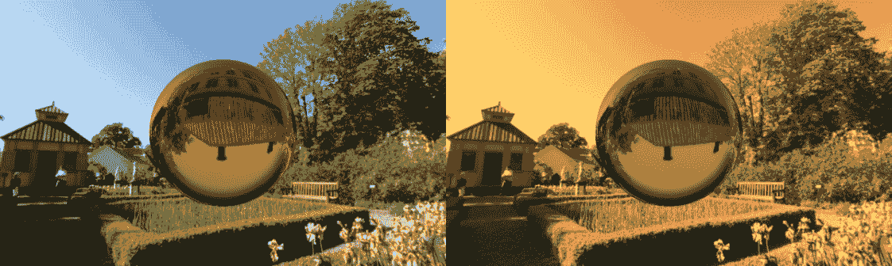

# 参见

+   在第五章“描述符集”中，查看以下食谱：

    +   *创建输入附件*

    +   *创建描述符集布局*

    +   *分配描述符集*

    +   *更新描述符集*

    +   *绑定描述符集*

+   在第六章“渲染通道和帧缓冲区”中，查看以下食谱：

    +   *指定子通道描述*

    +   *创建渲染通道*

    +   *进入下一个子通道*

+   在第八章“图形和计算管线”中，查看以下食谱：

    +   *创建着色器模块*

    +   *绑定管线对象*

+   在第九章“命令录制和绘制”中，查看以下食谱：

    +   绑定顶点缓冲区

    +   绘制几何体

+   本章的食谱 *渲染全屏四边形进行后处理*
